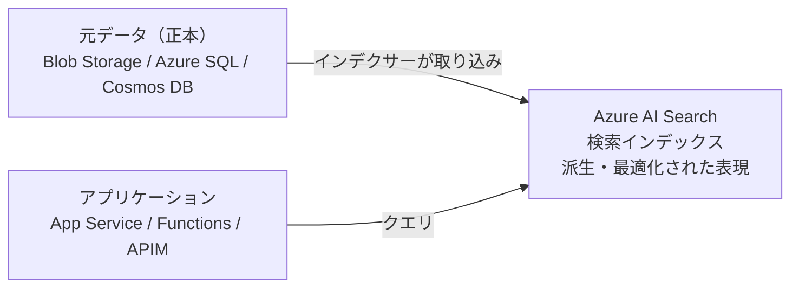
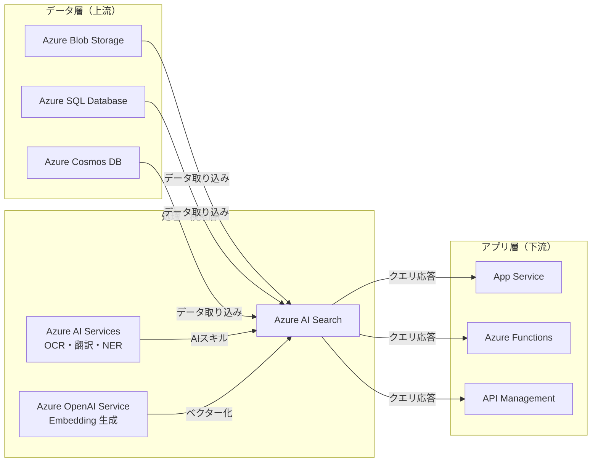
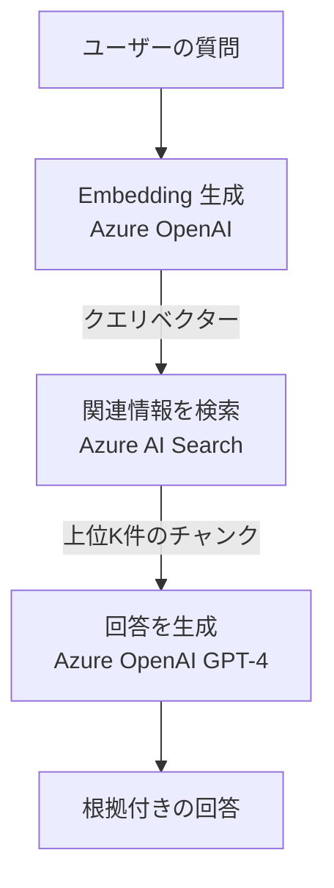
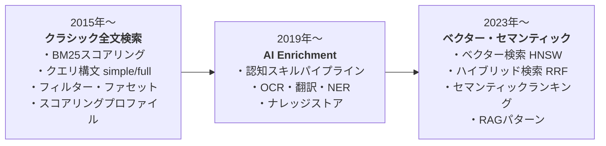
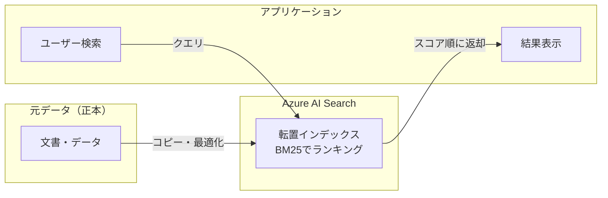

# Week 1 — 製品の存在理由と設計思想

> **Phase 1a** | 学習プラン Week 1 / 8  
> 学習目標：Azure AI Search が「なぜ存在するのか」「何を解決するのか」を自分の言葉で説明できる

---

## 1. データベースで「検索」が難しい理由

Azure AI Search を理解するには、まず「なぜ必要なのか」という問題から入る。

### RDB の LIKE 句の限界

社内に1万件の Word 文書があるとき、「コスト削減について書かれた文書を探して」という問いに対して、普通のデータベースでやろうとすると：

```sql
SELECT * FROM documents WHERE content LIKE '%コスト削減%'
```

これには 3 つの根本的な問題がある。

| 問題 | 説明 |
|---|---|
| **語彙不一致** | 「費用低減」「コストカット」「経費節約」と書かれた文書はヒットしない |
| **全行スキャン** | 文書が増えるほど遅くなる（インデックスが効かない） |
| **ランキング不可** | 「どの文書が一番関連性が高いか」を判断できない |

> **重要な概念の区別**
> - **フィルタリング**：完全一致（`WHERE name = '田中'`）→ 正確な値がわかっているとき
> - **検索**：関連度ランキング付きの曖昧な照合 → ユーザーが何を探しているか「意味」で探すとき

Azure AI Search はこの「検索」の問題を解くために作られた。

---

## 2. 転置インデックス — 高速検索の基盤

### 通常のインデックスとの違い

通常のデータベースは「文書 → 中身の単語」という方向で情報を持つ。転置インデックスはその逆：「単語 → その単語が含まれる文書のリスト」。

```
【通常のインデックス】        【転置インデックス（逆引き）】
文書1 → コスト、削減、品質    コスト  → 文書1, 文書2
文書2 → コスト、品質、改善    削減   → 文書1
                             品質   → 文書1, 文書2
                             改善   → 文書2
```

「コスト削減」で検索すると、「コスト」のリストと「削減」のリストの**積集合**を取る → 文書1 が上位にくる。

全行をスキャンせず、単語ごとのリストをたどるだけなので高速。

---

## 3. BM25 — 関連度スコアの計算

転置インデックスで「どの文書がヒットするか」は分かったが、「どれが一番関連性が高いか」はどう決めるのか。Azure AI Search は **BM25（Best Match 25）** というアルゴリズムを使う。

スコアは 3 つの要素のバランスで決まる：

### TF（Term Frequency）— 出現頻度
文書内でその単語が何回出てくるか。多いほど高スコアだが**逓減する**（10回 ≠ 2回の5倍）。

### IDF（Inverse Document Frequency）— 希少度
全文書の中でその単語がどれだけ珍しいか。
- 「コスト」→ 多くの文書に出現 → 低 IDF（あまり参考にならない）
- 「HNSW」→ ほぼ出現しない → 高 IDF（出てきたら強いシグナル）

### フィールド長正規化
短いタイトルに出てくる単語は、長い本文に出てくる同じ単語より重い。

> **まとめ**：この 3 つのバランスで「最も関連性の高い文書」を順位付けする。

---

## 4. Azure AI Search の設計思想：関心の分離

Azure AI Search は **Managed Search-as-a-Service**。Elasticsearch や Lucene のクラスターを自分で管理しない。

### 核心となる設計思想

> **データの「保管」と「検索」は、別のシステムが担当する**



### 重要な原則

- **AI Search はシステムオブレコードではない** — 元データの正本は Blob や SQL にある
- AI Search が保持するのは、検索に特化した「コピー（派生物）」
- 元データを削除しても AI Search のインデックスには残る（明示的に削除が必要）

---

## 5. Azure エコシステムの中での位置づけ

AI Search は単体では動かない。周囲のサービスとの関係を理解することが重要。



| 方向 | 関係 |
|---|---|
| **上流** | Blob / SQL / Cosmos DB → データソースとして AI Search が取り込む |
| **横連携** | Azure AI Services → スキルセットで OCR・翻訳・エンティティ認識を実行 |
| **横連携** | Azure OpenAI → 埋め込み（Embedding）の生成、RAG の生成側を担う |
| **下流** | App Service / Functions / APIM → アプリが AI Search を呼ぶ |

---

## 6. RAG パターンの予告

Azure OpenAI との組み合わせが重要なため、ここで概要だけ押さえておく（詳細は Week 6）。



> - **AI Search の役割** = Retrieval（関連する情報を「見つけてくる」）
> - **Azure OpenAI の役割** = Generation（見つけた情報をもとに「回答を生成する」）
> - この組み合わせを **RAG（Retrieval-Augmented Generation）** と呼ぶ

LLM（大規模言語モデル）は学習データ以外の情報を知らない。RAG によって、自社の最新ドキュメントや非公開データに基づいた回答が可能になる。

---

## 7. 製品の 3 つの時代

AI Search のドキュメントを読んでいると機能が「重層的」に見えることがある。歴史的な文脈を知ると整理しやすい。



ドキュメントや記事を読むとき、「これは 2015 年代の機能か、2023 年代の機能か」と意識すると整理しやすい。

---

## 8. Week 1 全体の整理

### データフロー（現時点の理解）



### 重要な用語まとめ

| 用語 | 一言説明 |
|---|---|
| 転置インデックス | 「単語 → 文書」の逆引き構造。高速検索の基盤 |
| BM25 | TF・IDF・フィールド長正規化の3要素で関連度を計算するアルゴリズム |
| フィルタリング | 完全一致。`WHERE name = '田中'` のような使い方 |
| 検索 | 関連度ランキング付きの曖昧照合 |
| システムオブレコード | データの「正本」を持つシステム。AI Search はこれではない |
| RAG | 検索（Retrieval）と生成（Generation）を組み合わせる設計パターン |

---

## ハンズオン チェックリスト

- [ ] Azure Portal で AI Search サービスを作成（Free または Basic ティア）
- [ ] 各ブレードを開いて 1 文でメモする
  - Indexes：
  - Indexers：
  - Data Sources：
  - Skillsets：
  - Scale：
  - Keys：
  - Networking：
- [ ] データフロー図を手描きする（このノートのフロー図と比較してみる）

---

## 自己チェック

週末にドキュメントを閉じて答えてみる。

1. **転置インデックスを図なしで口頭説明できるか？**
   - キーワード：逆引き、単語→文書リスト、積集合

2. **AI Search が元データを保存しない理由は？**
   - キーワード：関心の分離、派生物、システムオブレコードではない

3. **フィルターと検索クエリの違いを例で説明できるか？**
   - キーワード：完全一致 vs 関連度ランキング、LIKE vs BM25

4. **Azure エコシステムの中で AI Search はどの層に位置するか？**
   - キーワード：処理・検索層、上流はデータソース、下流はアプリ

---

## 次週の予告（Week 2）

5 つのコアオブジェクトを学ぶ：

- **Index** — スキーマ定義済みの検索ストア
- **Indexer** — データソースからの自動取り込みパイプライン
- **Data Source** — 接続定義
- **Skillset** — AI 処理のパイプライン
- **Knowledge Store** — エンリッチ済みデータの永続化
