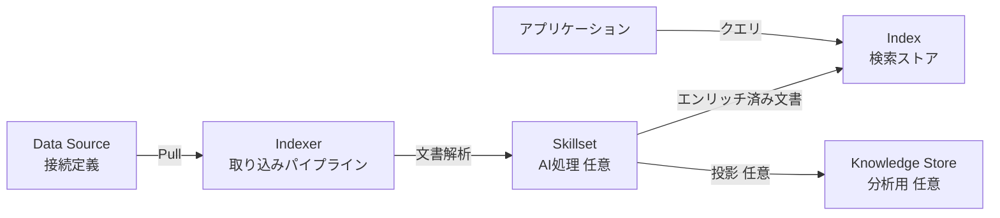
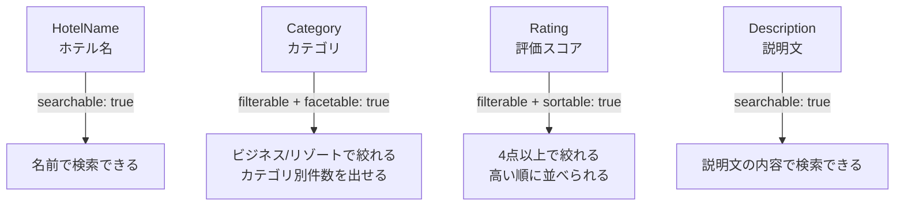
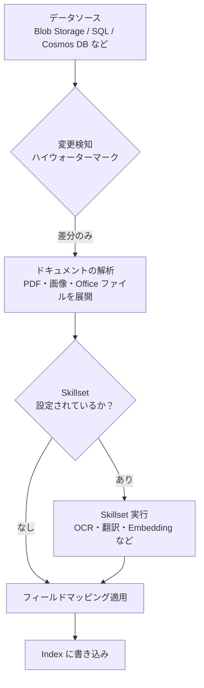
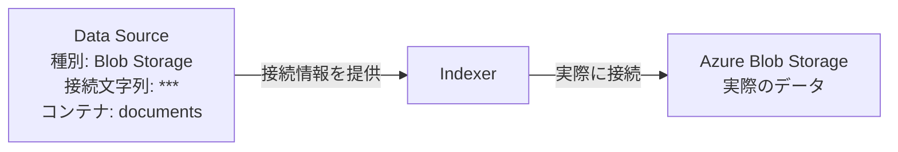
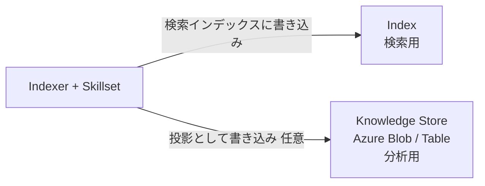
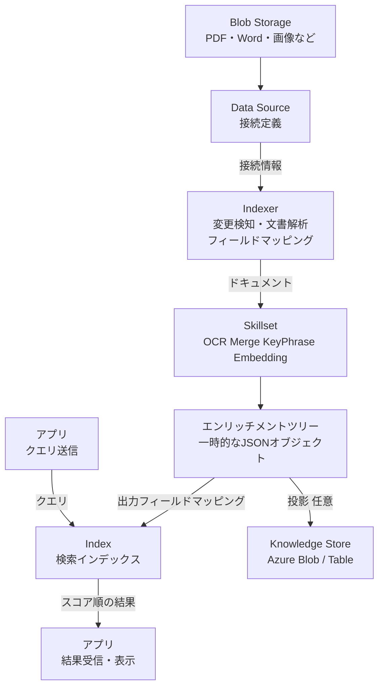

# Week 2 — コアオブジェクトモデルとデータフロー

> **Phase 1a** | 学習プラン Week 2 / 8  
> 学習目標：5つのコアオブジェクトの役割とデータフローを図解できる

---

## 全体像：5つのコアオブジェクト



> 「任意」と書かれた矢印・ノードはオプション設定

---

## 1. Index（インデックス）

**スキーマ定義済みの JSON ドキュメントのコレクション**。AI Search の中心オブジェクト。

> **📖 JSON ドキュメントとは**  
> JSON（JavaScript Object Notation）はデータを表現するフォーマット。  
> AI Search のインデックスに入る 1件のデータはこの形をしている：
>
> ```json
> {
>   "HotelId":    "1",
>   "HotelName":  "新宿グランドホテル",
>   "Rating":     4.5,
>   "Category":   "Business",
>   "Description":"都心へのアクセス抜群の快適なホテルです",
>   "Tags":       ["wifi", "pool", "restaurant"]
> }
> ```
>
> これが「1つの JSON ドキュメント」。ホテル50軒分なら50個 → その集まりが **コレクション（= インデックス全体）**。  
>
> RDB との対応関係：
>
> | RDB | Azure AI Search |
> |---|---|
> | テーブル | インデックス（コレクション全体） |
> | 行（レコード） | ドキュメント（JSON 1件） |
> | 列 | フィールド |
> | `CREATE TABLE` の定義 | スキーマ |
>
> RDB と違う点：ドキュメントごとにフィールドの値を省略できる柔軟さがある。

> **📖 スキーマ定義済みとは**  
> スキーマとは「データの設計図」のこと。  
> 「どんなフィールドが、何型で、何の属性を持つか」を **インデックス作成前に宣言する** ことを「スキーマ定義済み」と言う。
>
> ```json
> // インデックスを作るときに事前に宣言するスキーマの例
> {
>   "fields": [
>     { "name": "HotelId",    "type": "Edm.String",  "key": true },
>     { "name": "HotelName",  "type": "Edm.String",  "searchable": true },
>     { "name": "Rating",     "type": "Edm.Double",  "filterable": true, "sortable": true },
>     { "name": "Category",   "type": "Edm.String",  "filterable": true, "facetable": true }
>   ]
> }
> ```
>
> このスキーマを元に AI Search が「`HotelName` は転置インデックスを作る」「`Rating` はフィルター用 B-Tree を作る」という最適化を行う。後から型や属性を変えると、この内部構造を作り直す必要があるため **再構築が必要** になる。

### フィールドの属性

各フィールドに「何ができるか」を属性で決める。目的に応じて選ぶことが重要。

| 属性 | 意味 | 向いているフィールド例 |
|---|---|---|
| `searchable` | 転置インデックスを構築。全文検索の対象になる | ホテル名、説明文 |
| `filterable` | `$filter=` での絞り込みに使える | 評価スコア、カテゴリ |
| `sortable` | `$orderby=` での並び替えに使える | 価格、日付 |
| `facetable` | 集計に使える（「カテゴリ別の件数」など） | タグ、地域、カテゴリ |
| `retrievable` | 検索結果として返却される | ほとんどのフィールド |
| `key` | ドキュメントの一意ID（必須、1フィールドのみ） | `id` |

### 属性の選び方（hotels サンプルで考える）



> **設計の核心**：全属性 ON にするとストレージとインデックス構築コストが増える。  
> 「このフィールドをどう使うか」を決めてから属性を選ぶ。

### スキーマ変更のルール

| 変更の種類 | 再構築が必要か |
|---|---|
| 新しいフィールドを追加する | **不要**（後から追加できる） |
| フィールドの型を変更する | **必要**（再構築） |
| `searchable` などの属性を変更する | **必要**（再構築） |
| フィールドを削除する | **必要**（再構築） |

---

## 2. Indexer（インデクサー）

**データソースからデータを自動取得し、インデックスに書き込むパイプライン**。

Push モデル（アプリが直接 API を叩く）と対比して、**Pull モデル** と呼ばれる。

> **📖 パイプラインとは**  
> 「管（パイプ）を流れるように、データが一方向に通り抜けながら順番に処理される仕組み」のこと。  
> 工場のベルトコンベアに例えると：
>
> ```
> 【工場のベルトコンベア】
> 原材料 → [洗浄] → [加工] → [塗装] → [検査] → 完成品
>
> 【Indexer のパイプライン】
> Blob Storage → [ドキュメント取得] → [PDF・画像の展開] → [Skillset 実行] → [フィールドマッピング] → Index
> ```
>
> 重要な特徴：**文書1件ずつに対して全ステップが実行される**（全件まとめてステップ1→次に全件ステップ2…ではない）。
>
> ```
> 文書1: [取得] → [PDF展開] → [OCR] → [キーフレーズ] → [書き込み] ✓
> 文書2: [取得] → [PDF展開] → ✗ エラー → スキップ（失敗件数に記録）
> 文書3: [取得] → [PDF展開] → [OCR] → [キーフレーズ] → [書き込み] ✓
> ```
>
> 1件が失敗しても他の件の処理は止まらない。

### 動作の流れ



### 重要な概念

**ハイウォーターマーク（変更検知）**
- 初回：全件処理
- 2回目以降：前回実行時刻以降に更新されたものだけ処理
- ソース側に更新日時のフィールド（`LastModified` など）が必要

**削除検知**
- デフォルトでは、ソースから消えたドキュメントはインデックスに残り続ける
- 明示的に「削除検知ポリシー」（ソフト削除フラグなど）を設定する必要がある

**フィールドマッピング vs 出力フィールドマッピング**

| | フィールドマッピング | 出力フィールドマッピング |
|---|---|---|
| タイミング | ドキュメント取り込み時 | Skillset 実行後 |
| 用途 | ソースのフィールド名 → インデックスのフィールド名 | Skill の出力 → インデックスのフィールド |
| 例 | `hotel_name` → `HotelName` | `/document/keyphrases` → `KeyPhrases` |

---

## 3. Data Source（データソース）

インデクサーが接続するための**接続定義オブジェクト**。



**対応しているデータソース（主なもの）：**
- Azure Blob Storage（PDF・Word・画像など）
- Azure SQL Database
- Azure Cosmos DB（NoSQL API）
- Azure Table Storage
- SharePoint Online（プレビュー）

> **認証情報の扱い**：接続文字列（キー）はデータソースオブジェクトに持たせる。  
> 本番環境では Managed Identity を使うと、キーを一切コードや設定に書かずに済む（Week 6 で詳述）。

> **📖 認証情報（接続文字列）とは**  
> ストレージやデータベースに「接続するための鍵」のこと。これを持っていれば該当のリソースにアクセスできる。  
>
> ```
> # Azure Blob Storage の接続文字列の例
> DefaultEndpointsProtocol=https;
> AccountName=mystorageaccount;
> AccountKey=AbCdEfGhIj1234567890XXXXX==;
> EndpointSuffix=core.windows.net
> ```

> **📖 なぜ認証情報を Indexer ではなく Data Source が持つのか**  
> 「接続先の情報」と「取り込みの処理の定義」を **別オブジェクトに分けて管理するため**。
>
> ```
> 【❌ Indexer が認証情報を持つ場合】
>
> Indexer A（スキルなし）    ─── 接続文字列を直接持つ
> Indexer B（OCRスキルあり） ─── 接続文字列を直接持つ
> Indexer C（翻訳スキルあり）─── 接続文字列を直接持つ
>
> 問題：
> ・接続文字列が変わったら3箇所すべてを更新しなければならない
> ・Indexer C の設定を見れば接続文字列も見えてしまう
> ```
>
> ```
> 【✅ Data Source が認証情報を持つ場合】
>
> Data Source（接続文字列を1箇所だけ持つ）
>     ↑ 参照するだけ（接続文字列は持たない）
> Indexer A ─→ Data Source を参照
> Indexer B ─→ Data Source を参照
> Indexer C ─→ Data Source を参照
>
> メリット：
> ・接続文字列が変わっても Data Source を1箇所更新するだけ
> ・Indexer の設定を見ても接続文字列は入っていない
> ・新しい Indexer を追加するとき接続文字列を再入力しなくて良い
> ```
>
> Week 1 で学んだ「**関心の分離**」の設計思想がオブジェクト設計にも適用されている。

---

## 4. Skillset（スキルセット）

インデクサーが各ドキュメントを処理する際に実行する **AI 処理のパイプライン**。

設定は任意だが、AI エンリッチメントやベクター化をしたい場合は必須。

> **📖 DAG（有向非循環グラフ）とは**  
> 3つの言葉それぞれの意味：
>
> **グラフ**：「ノード（点）」と「エッジ（線・矢印）」の集まり。折れ線グラフではなく数学的な意味。  
> Skillset の場合 → ノード = 各スキル、エッジ = データの流れ
>
> **有向（Directed）**：エッジ（矢印）に「向き」がある。A→B と B→A は別物。  
> `OcrSkill → MergeSkill` は成立するが `MergeSkill → OcrSkill` は存在しない
>
> **非循環（Acyclic）**：ループがない。矢印をたどっていくと同じ点には戻ってこない。  
>
> ```
> 【❌ 循環グラフ（NG）】       【✅ 非循環グラフ（OK）】
>  A → B → C → A               A → B → C
>  （ループがある）              （どこから出発しても同じ点に戻れない）
> ```
>
> 循環が許可されない理由：「A は B の出力が必要、B は A の出力が必要」となると、どちらも永遠に実行できないため。非循環であることで AI Search が実行順序を自動決定できる。
>
> **Skillset の DAG の実例（スキャン PDF を処理する場合）：**
>
> ```
> [元の PDF ドキュメント]
>         │
>         ├──────────────────────────┐
>         ↓                          ↓
>  OcrSkill                    （元のテキストフィールド）
>  （画像ページ → テキスト抽出）       │
>         │                          │
>         └──────────┬───────────────┘
>                    ↓（両方の出力が揃ってから実行）
>              MergeSkill
>              （元テキスト + OCRテキストを結合）
>                    │
>         ┌──────────┴──────────┐
>         ↓                    ↓
> KeyPhraseSkill          EmbeddingSkill
> （キーフレーズ抽出）      （ベクター生成）
> ```
>
> 単純な一本道（A→B→C）と違い、**分岐（1つの出力が複数のスキルへ）と合流（複数の出力が1つのスキルへ）** ができる。これが DAG の強み。

### エンリッチメントツリー

Skillset が実行されると、各ドキュメントに対して「エンリッチメントツリー」という一時的な JSON が構築される。各スキルはこのツリーに出力を追加していく。

> **📖 エンリッチメントツリーとは**  
> 「ツリー（木）」とは、フォルダ構造のような **親子関係を持つ階層構造** のこと。  
> エンリッチメントツリーは **1つのドキュメントを処理する間だけ存在する、スキル間のデータ受け渡し場所**。  
> スキルが実行されるたびに新しいデータがこのツリーに追記されていく。
>
> **スキルが実行されるたびにツリーの内容がどう変化するか：**
>
> ```
> ▼ 最初（スキル実行前）
> /document
>   /content:              "コスト削減についての報告書..."
>   /metadata_author:      "田中 太郎"
>   /normalized_images:    [スキャン画像1のデータ, スキャン画像2のデータ]
>
> ▼ OcrSkill 実行後（画像からテキストを抽出した）
> /document
>   /content:              "コスト削減についての報告書..."
>   /normalized_images:    [...]
>   /normalized_images/0/text: "図1：コスト推移グラフ 2023年度比..."  ← 追記された
>   /normalized_images/1/text: "表1：部門別削減目標..."               ← 追記された
>
> ▼ MergeSkill 実行後（元テキストと OCR テキストを結合した）
> /document
>   ...（上記すべて）
>   /merged_content: "コスト削減についての報告書... 図1：コスト推移グラフ..."  ← 追記された
>
> ▼ KeyPhraseExtractionSkill 実行後
> /document
>   ...（上記すべて）
>   /keyphrases: ["コスト削減", "2023年度", "部門別削減目標"]  ← 追記された
> ```
>
> **処理が終わったら「必要な部分だけ」をインデックスに書き込む（出力フィールドマッピング）：**
>
> ```
> /document/merged_content  →  インデックスの "SearchableContent" フィールド
> /document/keyphrases      →  インデックスの "KeyPhrases" フィールド
> /document/metadata_author →  インデックスの "Author" フィールド
> ↑ここで選ばれたものだけがインデックスに入る。ツリー全体ではない。
> ```
>
> **「一時的」の意味**：Skillset 処理が終わると、このツリー全体は破棄される。インデックスに残るのは出力フィールドマッピングで指定した部分だけ。（キャッシュを有効にすればツリーを Storage に保存して次回の再利用が可能）

```
/document
  /content          ← 元テキスト
  /normalized_images ← 画像データ（OcrSkill への入力）
  /merged_content   ← OCR出力と元テキストの結合（MergeSkill の出力）
  /keyphrases       ← キーフレーズ（KeyPhraseExtractionSkill の出力）
  /entities         ← エンティティ（EntityRecognitionSkill の出力）
  /embedding        ← ベクター（AzureOpenAIEmbeddingSkill の出力）
```

### 主な組み込みスキル

| スキル | 何をするか | 使うシーン |
|---|---|---|
| `OcrSkill` | 画像・PDF からテキスト抽出 | スキャンした文書を検索可能にする |
| `MergeSkill` | OCR出力と元テキストを結合 | OCR後の後処理 |
| `LanguageDetectionSkill` | 言語を検出 | 多言語コンテンツの振り分け |
| `EntityRecognitionSkill` | 人物・組織・場所などを抽出 | 固有表現の構造化 |
| `KeyPhraseExtractionSkill` | キーフレーズを抽出 | 文書の要約・タグ化 |
| `SplitSkill` | 大きな文書をチャンクに分割 | RAG 用の前処理 |
| `AzureOpenAIEmbeddingSkill` | Embedding を生成 | ベクター検索の統合ベクター化 |

> **📖 チャンクに分割（SplitSkill）とは**  
> チャンク（chunk）は英語で「かたまり」の意味。文書を一定のサイズに切り出した断片のこと。
>
> なぜ分割が必要なのか — **2つの理由がある**：
>
> **理由①：AI モデルのトークン制限**  
> 「トークン」とは AI モデルが処理する文字の単位（日本語は1文字≒1〜2トークン）。  
> モデルが一度に処理できる量に上限がある：
>
> ```
> Azure OpenAI Embedding モデル（text-embedding-3-small）：最大 8,191 トークン（≒ 約4,000文字）
> → 50ページの PDF は余裕でこれを超える → 分割必須
> ```
>
> **理由②：検索精度の問題**
>
> ```
> 【❌ 分割しない場合】
> 50ページの PDF 全体 → 1つのベクター
> （"コスト削減" も "人事制度" も "IT投資" も全部混ざった平均的な意味）
>
> ユーザーの質問：「2023年の設備投資の削減率は？」
> → 文書全体の平均ベクターとの比較になるため、
>   ページ10の「設備投資の削減率」の段落の情報が埋もれる → 精度が低い
>
> 【✅ チャンクに分割した場合】
> ページ10の「設備投資の削減率」の段落 → そのトピックだけのベクター
>
> ユーザーの質問 → そのベクターに近い → 正確にヒット → 精度が高い
> ```
>
> **チャンクのイメージ（オーバーラップあり）：**
>
> ```
> 元の文書：[段落A──────][段落B──────][段落C──────][段落D──────]
>
> チャンク1: [段落A全体 + 段落Bの先頭]
> チャンク2:      [段落Aの末尾 + 段落B全体 + 段落Cの先頭]  ← 前後と少し重複
> チャンク3:                 [段落Bの末尾 + 段落C全体 + 段落Dの先頭]
> チャンク4:                            [段落Cの末尾 + 段落D全体]
> ```
>
> **オーバーラップ**（前後のチャンクを少し重ねる）を入れる理由：「それは〜」「この結果〜」のような文脈が段落の境界で切れると意味が失われるため、少し重ねて文脈を保つ。

> **📖 Embedding（エンベディング）とは**  
> テキストを「意味を保ったまま数値のリストに変換する処理」。この数値のリストを **ベクター** と呼ぶ。
>
> ```
> "快適なホテル"      → [0.23, -0.81, 0.47, 0.12, -0.09, ...]  （1536個の数値）
> "comfortable hotel" → [0.25, -0.79, 0.49, 0.11, -0.08, ...]  （ほぼ同じ！）
> "猫の鳴き声"        → [-0.62, 0.33, -0.15, 0.78, 0.44, ...]  （全然違う）
> ```
>
> **意味が似ている → 数値が似ている** という性質がある。  
> この性質を使うと BM25（キーワードの一致）では見つけられなかった「意味的に近いもの」を検索できる。
>
> **なぜ数値で意味を表現できるのか：**  
> AI モデルが大量のテキストから「"快適"・"comfortable"・"cozy" は似た文脈で使われる」と学習した結果、これらを多次元空間の近い位置（= 似た数値）に配置するようになった。
>
> **1536次元とは：**  
> 1536個の数値それぞれが「テキストの意味のある何らかの側面」を表している（何を表すかは人間には解釈できない）。この高次元空間で「距離が近い ＝ 意味が近い」として扱う。

> **📖 統合ベクター化（Integrated Vectorization）とは**  
> Embedding 生成（テキスト → ベクター変換）を AI Search のパイプライン内で自動化する機能。
>
> ```
> 【❌ 統合ベクター化なし（従来のやり方）】
>
> 開発者がコードで書く必要がある：
> ①自分で OpenAI API を呼び出してドキュメントをベクター化
> ②そのベクターを AI Search の API に送ってインデックスへ格納
> ③クエリ時もユーザーの質問を自分でベクター化してから検索 API を呼ぶ
>
> 【✅ 統合ベクター化あり（AzureOpenAIEmbeddingSkill を設定した場合）】
>
> インデックス時：
> ドキュメントを Blob Storage に置くだけ
> → Indexer が自動で取得 → Skillset 内で自動で OpenAI を呼ぶ → ベクターを自動でインデックスに格納
>
> クエリ時（ベクタライザー設定が必要）：
> search_text="快適なホテル" と送るだけ
> → AI Search が自動でベクター変換 → ベクター検索 → 結果を返す
>
> アプリ側にベクター化のコードを書かなくて良い
> ```
>
> （詳細は Week 4 のベクター検索で実際に設定する）

### カスタムスキル

Azure Functions などの **HTTPS エンドポイント**を任意処理として挟める。入出力の形式は固定。

```
入力（AI Search → カスタムスキル）:
{
  "values": [
    { "recordId": "0", "data": { "text": "..." } }
  ]
}

出力（カスタムスキル → AI Search）:
{
  "values": [
    { "recordId": "0", "data": { "wordCount": 42 } }
  ]
}
```

---

## 5. Knowledge Store（ナレッジストア）

Skillset の処理結果を **Azure Storage（Blob または Table）に永続化**する仕組み。



**いつ使うか：**
- エンリッチメント結果を Power BI で分析したい
- 別のパイプライン（Azure ML など）に流したい
- OCR・翻訳の結果を「検索以外の目的」で再利用したい

> **注意**：Knowledge Store は検索インデックスとは完全に別物。  
> AI Search に対してクエリを投げても Knowledge Store の内容は返ってこない。

---

## 全体データフローの詳細版



---

## 重要な用語まとめ

| 用語 | 一言説明 |
|---|---|
| Index | スキーマ定義済みの検索ストア。AI Search の中心 |
| Indexer | データを Pull してインデックスに書き込むパイプライン |
| Data Source | インデクサーが使う接続定義オブジェクト |
| Skillset | AI処理（OCR・翻訳・Embedding など）のパイプライン |
| Knowledge Store | Skillset の処理結果を Storage に保存する仕組み |
| エンリッチメントツリー | Skillset 実行中に構築される一時的な JSON 構造 |
| ハイウォーターマーク | 差分のみ再処理するための変更検知の仕組み |
| フィールドマッピング | ソースのフィールド名をインデックスのフィールド名に変換 |
| 出力フィールドマッピング | Skill の出力をインデックスのフィールドに書き込む |

---

## ハンズオン チェックリスト

- [ ] Azure Portal の「データのインポート」ウィザードを開く
- [ ] hotels サンプルデータで Data Source / Index / Indexer を自動作成する
- [ ] Indexer を手動実行し、「処理済み件数」と「失敗件数」を確認する
- [ ] Search Explorer で以下のクエリを順番に実行して違いを観察する
  - `search=*`（全件、スコアは均一）
  - `search=pool`（全文検索、スコアが変わる）
  - `search=pool&$filter=Rating ge 4`（検索＋フィルター）
  - `search=pool&$select=HotelName,Rating`（返却フィールドを絞る）
  - `search=pool&$orderby=Rating desc`（スコアランキングを上書き）
- [ ] インデックスのスキーマを開き、`HotelName` と `Category` の属性の違いを確認する
- [ ] Week 1 のデータフロー図を更新する（5オブジェクトを加える）

---

## 自己チェック

1. **`filterable: true`・`searchable: false` のフィールドに対して `search=xxx` は機能するか？**
   - キーワード：転置インデックスなし、フィルターはできるが全文検索対象外

2. **インデクサーが削除されたドキュメントをデフォルトで削除しない理由は？**
   - キーワード：Pull モデル、削除検知ポリシーが必要

3. **フィールドマッピングと出力フィールドマッピングの違いは？**
   - キーワード：前者はソースのフィールド名変換、後者は Skill の出力をインデックスに繋ぐ

4. **Skillset を使わない Indexer は作れるか？**
   - キーワード：作れる（任意）、ただしエンリッチメントやベクター化は不可

5. **Knowledge Store と Index はどう違うか？**
   - キーワード：別物、Index は検索用・Knowledge Store は分析用の永続化

---

## 次週の予告（Week 3）

全文検索の詳細に入る：

- **BM25 スコアリング**の実際の動き
- **クエリタイプ**：`simple` / `full（Lucene）` / `semantic` / `vector`
- **スコアリングプロファイル**：フィールドウェイト・マグニチュード関数
- **アナライザー**：インデックス時とクエリ時の一致
- **最初の Python コード**：azure-search-documents SDK を使った検索
