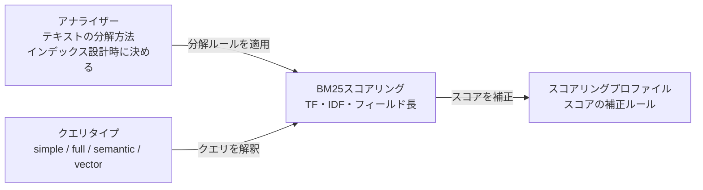
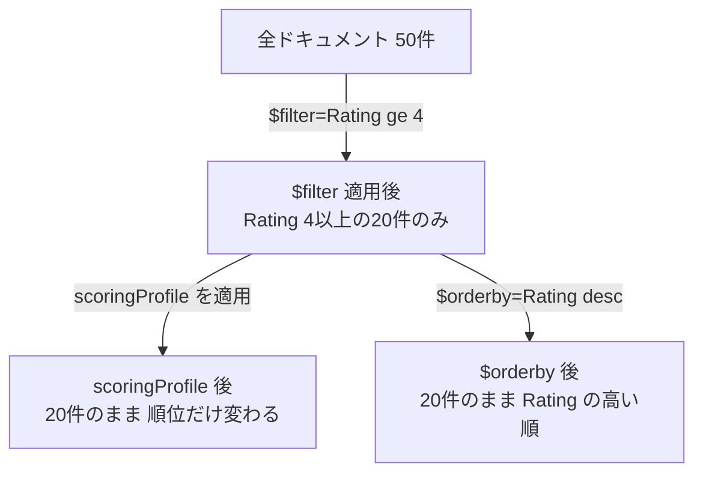
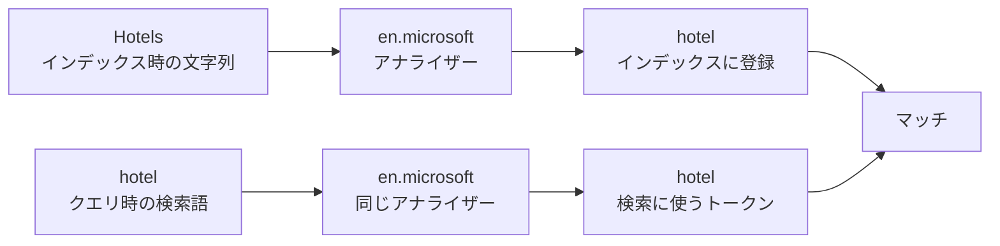

# Week 3 — 全文検索の詳細

> **Phase 1b** | 学習プラン Week 3 / 8  
> 学習目標：BM25スコアリング・クエリタイプ・スコアリングプロファイル・アナライザーを理解し、クエリ設計の判断ができる

---

## 全体像：全文検索を構成する4つの要素



---

## 1. BM25スコアリングの実際

Week 1 で概念は学んだ。今週は「実際にどう効いてくるか」を掘り下げる。

### 3要素が独立して効く

**TF（出現頻度）は逓減する**

同じ単語を大量に詰め込んでもスコアは頭打ちになる。

| 出現回数 | スコア貢献の比率 |
|---|---|
| 1回 | 基準（1.0） |
| 2回 | 約 +60%（2倍にはならない） |
| 5回 | 約 +130%（5倍にはならない） |
| 10回 | 約 +170%（10倍にはならない） |

> **📖 この数値は固定ではない**  
> BM25 には `k1`（TF逓減の速さ）と `b`（フィールド長正規化の強さ）という2つのパラメーターがある。  
> 上の表は Azure AI Search のデフォルト値（`k1 = 1.2`、`b = 0.75`）で計算した近似値。  
> インデックスの設定でこれらを変更することもできるが、ほとんどのユースケースではデフォルトで十分。
>
> | パラメーター | 意味 | デフォルト |
> |---|---|---|
> | `k1` | 高いほど出現回数の差が効きやすい | `1.2` |
> | `b` | `0` で正規化なし、`1` で完全正規化 | `0.75` |

> **📖 キーワードスタッフィングとは**  
> 「検索で上位に出るために、同じ単語を意味もなく大量に詰め込む行為」のこと。  
>
> ```
> 【悪意のある文書の例】
> 「安い ホテル 東京 格安 ホテル 東京 ホテル 安い 格安 東京...」
> （意味のある文章ではなく、スコアを上げるためだけに単語を詰め込んでいる）
> ```
>
> 古い検索エンジンは TF が線形（10回 = 1回の10倍のスコア）だったため、詰め込めば詰め込むほど有利だった。  
> BM25 は TF を **逓減（上がり幅がだんだん小さくなる）** にすることで、詰め込んでも意味がないよう設計されている。これがキーワードスタッフィング対策。

**IDF（希少度）が効く**

```
「コスト削減 効率化」で検索した場合：

「コスト」 → 多くの文書に出現 → IDF 低い → スコアへの影響が小さい
「効率化」  → 少数の文書にしか出現しない → IDF 高い → スコアへの影響が大きい

→ 「効率化」にマッチした文書の方がスコアが大きく上がる
```

**フィールド長正規化が効く**

```
同じ「pool」という単語が：

HotelName（3単語）に出現     → 短いフィールド → 補正大 → 高スコア
Description（200単語）に出現 → 長いフィールド → 補正小 → 低スコア

→ タイトルにマッチした文書の方が「より関連性が高い」と判断される
```

### Search Explorer で実際に確認する

```
search=pool
→ @search.score を確認。同じ pool でもスコアが文書によって異なることを見る

search=pool&$orderby=@search.score desc
→ 明示的にスコア降順で表示（デフォルトはすでにスコア順）

search=pool&$orderby=Rating desc
→ スコアランキングを「完全に捨てて」Rating で並び替える
→ スコアが低い文書が1位になることを確認
```

---

## 2. クエリタイプ

### simple（デフォルト）

ユーザー入力をそのまま使っても安全。

```
search=pool                → 「pool」を含む文書
search=pool wifi           → 「pool」または「wifi」（OR）
search=+pool +wifi         → 両方必須（AND）
search=pool -parking       → pool あり・parking なし
search=pool*               → pool で始まる単語（ワイルドカード）
search="grand hotel"       → このフレーズがそのまま含まれる
```

### full（Lucene 構文）

> **📖 Lucene（ルシーン）とは**  
> Apache Lucene（アパッチ ルシーン）は、Java で書かれたオープンソースの全文検索ライブラリ。  
> Azure AI Search はこの Lucene を内部の検索エンジンとして使っており、Lucene が提供するクエリ言語を `queryType=full` で利用できる。  
> 「simple モードでは表現できない高度な検索条件」を書くための構文、と理解すればよい。

```
search=HotelName:pool^3         → HotelName フィールドのマッチを3倍重視
search=pool~                    → ファジー検索（スペルミス対応 poool, pol なども拾う）
search=pool~1                   → 編集距離1以内（1文字だけ違う単語）
search="pool view"~5            → 近傍検索（pool と view が5単語以内に出現）
search=Rating:[4 TO 5]          → 範囲指定（4以上5以下）
```

> **なぜユーザー入力に直接使うと危険か**  
> Lucene 構文には特殊文字（`+ - && || ! ( ) { } [ ] ^ " ~ * ? : \`）がある。  
> ユーザーが検索バーに `"hotel` と入力すると、クォートが閉じていないためパースエラーになる。  
> 使う場合はサーバーサイドで特殊文字をエスケープしてからクエリを組み立てる。

### semantic と vector（次週以降で詳述）

| クエリタイプ | 仕組み | 使うタイミング |
|---|---|---|
| `simple` | キーワードマッチ + BM25 | ほとんどの基本的な検索 |
| `full` | Lucene 構文 + BM25 | フィールド指定・ファジーなど高度な制御が必要なとき |
| `semantic` | BM25結果をニューラルで再ランキング | 精度重視・自然言語の質問 |
| `vector` | Embedding ベクターの類似度検索 | 意味検索・RAG |

---

## 3. スコアリングプロファイル

BM25スコアに「補正」をかけて検索順位を調整する仕組み。

### フィルターとの違い（重要）



> スコアリングプロファイルは「返す文書の数・内容は変えない」。あくまで **順位の微調整**。  
> 「特定の条件の文書だけ出したい」なら `$filter`、「強制的に並び替えたい」なら `$orderby` を使う。

### フィールドウェイト

```json
"scoringProfiles": [{
  "name": "titleBoost",
  "text": {
    "weights": {
      "HotelName": 5,
      "Description": 1
    }
  }
}]
```

`HotelName` にマッチしたときのスコアが5倍になる。「名前にマッチした文書を上位に出したい」ときに使う。

### 関数（Functions）

| 関数 | 何をするか | 例 |
|---|---|---|
| `magnitude` | 数値が高い文書をブースト | Rating 5.0 の文書を上位に |
| `freshness` | 更新日時が新しいほどブースト | 最新の記事・求人情報を上位に |
| `distance` | 地理的に近いほどブースト | 現在地から近いホテルを上位に |
| `tag` | タグが一致するほどブースト | ユーザーの好みタグに合う文書を上位に |

> BM25スコアが圧倒的に高い文書は、関数補正があっても抜かせないことがある。  
> スコアリングプロファイルは「微調整」であって「強制的な並び替え」ではない。

---

## 4. アナライザー

「テキストをどう分解して転置インデックスに登録するか」を決める仕組み。

### ステミングとは

> **📖 ステミング（Stemming）**  
> 単語を「語幹（word stem）」に変換する処理。さまざまな活用形・変形を同じ単語として扱えるようにする。
>
> ```
> running  → run
> hotels   → hotel
> studies  → study
> waited   → wait
> ```
>
> インデックスに `"hotel"` として登録しておけば、`"hotel"` でも `"hotels"` でも `"Hotel"` でも同じトークンにマッチする。
>
> **日本語の場合：** 英語のステミングに相当するのが「形態素解析」。  
> 「コスト削減」を「コスト」と「削減」に分割するように、文章を意味の最小単位（形態素）に分ける。  
> これが `ja.microsoft` アナライザーがやっていること。

### なぜ重要か：インデックス時とクエリ時が一致していないと検索できない



アナライザーが一致しない場合：

```
インデックス時: standard    → ["hotels"]（小文字化のみ、ステミングなし）
クエリ時:       en.microsoft → ["hotel"]（ステミングあり）

"hotels" と "hotel" は別トークン → 検索できない ✗
```

### 主なアナライザー

| アナライザー | 特徴 | 向いている用途 |
|---|---|---|
| `standard`（デフォルト） | Unicode分割・小文字化のみ | 英語以外の言語を含む基本的なテキスト |
| `en.microsoft` | 英語のステミング・ストップワード除去 | 英語文書の全文検索 |
| `ja.microsoft` | 日本語形態素解析 | 日本語文書の全文検索 |
| `keyword` | テキスト全体を1トークンとして扱う | カテゴリ・タグ・ID（完全一致が必要なもの） |
| `whitespace` | スペースで分割するだけ | 独自フォーマットのテキスト |

> **ストップワードとは：** "the" "a" "is" など、多くの文書に出現しすぎて IDF がほぼ 0 になる単語。  
> `en.microsoft` はこれらを除外することで、意味のある単語だけで検索できるようにする。

> **日本語コンテンツは必ず `ja.microsoft` または `ja.lucene` を指定する。**  
> デフォルトの `standard` は日本語の単語境界を検出できないため、「コスト削減」を1単語として扱ってしまう。

### インデックス定義での指定方法

```json
{
  "name": "Description",
  "type": "Edm.String",
  "searchable": true,
  "analyzer": "ja.microsoft"
}
```

---

## 5. オートコンプリートとサジェスト

**Suggester** を設定すると、入力途中での補完・提案機能が使えるようになる。

```
ユーザーが "po" と入力中...

オートコンプリート: "pool" "poolside" "port" ...      （入力中の単語を補完）
サジェスト:         "Hotel with Pool View" ...         （関連ドキュメントを提案）
```

> Suggester を有効にしたフィールドには、プレフィックスマッチ用の追加インデックスが自動構築される。  
> 後から有効/無効を切り替えるとインデックスの再構築が必要になる。

---

## 最初の Python コード

### セットアップ

```bash
pip install azure-search-documents
```

### 接続

```python
from azure.search.documents import SearchClient
from azure.core.credentials import AzureKeyCredential

client = SearchClient(
    endpoint="https://<your-service-name>.search.windows.net",
    index_name="hotels-sample-index",
    credential=AzureKeyCredential("<your-query-api-key>")
)
```

> API キーは Azure Portal の AI Search サービス → 設定 → キー から取得する。  
> クエリ専用キー（読み取り専用）を使う。Admin キーはコードに書かない。

### 基本クエリ

```python
# 1. 全文検索（simple モード）
results = client.search("pool", top=5)
for r in results:
    print(r["HotelName"], r["@search.score"])

# 2. フィルターを組み合わせる
results = client.search(
    "pool",
    filter="Rating ge 4",
    select=["HotelName", "Rating"],
    top=5
)
for r in results:
    print(r["HotelName"], r["Rating"])

# 3. Lucene 構文（full モード）
results = client.search(
    "HotelName:pool^3",
    query_type="full",
    top=5
)
for r in results:
    print(r["HotelName"], r["@search.score"])

# 4. スコアランキングを上書き（Rating 降順）
results = client.search(
    "pool",
    order_by=["Rating desc"],
    select=["HotelName", "Rating"],
    top=5
)
for r in results:
    print(r["HotelName"], r["Rating"])
```

### スコアリングプロファイルの適用

```python
# ポータルでスコアリングプロファイルを作成後
results = client.search(
    "pool",
    scoring_profile="titleBoost",
    top=5
)
for r in results:
    print(r["HotelName"], r["@search.score"])
```

---

## 重要な用語まとめ

| 用語 | 一言説明 |
|---|---|
| TF（Term Frequency） | 文書内での単語の出現頻度。多いほど高スコアだが逓減する |
| IDF（Inverse Document Frequency） | 全文書中での単語の希少度。珍しいほど高 IDF で効きやすい |
| フィールド長正規化 | 短いフィールドでのマッチを重く扱う |
| キーワードスタッフィング | スコアを上げるために単語を大量に詰め込む行為。BM25の逓減で対策済み |
| k1 / b | BM25 のパラメーター。TF逓減の速さ / フィールド長正規化の強さ |
| simple | デフォルトのクエリ構文。ユーザー入力に使っても安全 |
| full（Lucene） | ルシーン構文。フィールド指定・ファジー・近傍など高度な制御が可能 |
| スコアリングプロファイル | BM25スコアの補正ルール。返す文書ではなく順位を調整する |
| アナライザー | テキストをトークンに分解するルール。インデックス時とクエリ時で一致必須 |
| ステミング | 語幹に正規化する処理。running → run。英語向け |
| 形態素解析 | 日本語の単語分割処理。ステミングの日本語版に相当 |
| ストップワード | IDF がほぼ 0 の一般的すぎる単語（"the" "a" など）。検索から除外される |
| Suggester | プレフィックスマッチ用の追加インデックス。オートコンプリートに使う |

---

## ハンズオン チェックリスト

- [ ] Search Explorer で以下を実行してスコアの違いを確認する
  - `search=pool`（デフォルト simple）
  - `search=pool&queryType=full&search=pool~`（Lucene ファジー検索）
  - `search=pool&$orderby=Rating desc`（スコアを捨てて Rating 順）
- [ ] Python 環境を用意する（`pip install azure-search-documents`）
- [ ] 接続コードを手で入力して実行する（コピーペーストしない）
- [ ] `search="pool"` と `search="pool wifi"` の `@search.score` の違いをノートに記録する
- [ ] ポータルでスコアリングプロファイルを追加し、`HotelName` のウェイトを3に設定する
- [ ] プロファイル適用前後でスコアがどう変わるか確認する

---

## 自己チェック

1. **「pool」が10回出現する文書 vs タイトルに1回出現する文書、どちらがBM25スコアで高くなるか？**
   - キーワード：TF逓減、フィールド長正規化、短いフィールドのマッチが重い

2. **`queryType=full` をユーザー入力に直接適用すると何が危険か？**
   - キーワード：Lucene 特殊文字、パースエラー、サーバーサイドでエスケープ

3. **スコアリングプロファイルで `Rating` ブーストを設定しても、BM25スコアが高い文書が1位になることがあるのはなぜか？**
   - キーワード：微調整、強制的な並び替えは `$orderby`

4. **インデックス時に `ja.microsoft`、クエリ時に `standard` を使うとどうなるか？**
   - キーワード：トークン不一致、検索できない

5. **`keyword` アナライザーはどんなフィールドに向いているか？**
   - キーワード：1トークン、完全一致、カテゴリ・タグ・ID

---

## 次週の予告（Week 4）

ベクター検索・ハイブリッド検索に入る：

- **Embedding（埋め込み）** の仕組みとベクターの作り方
- **HNSW アルゴリズム** の近似最近傍探索
- **ハイブリッド検索** = BM25 + ベクター検索
- **RRF（Reciprocal Rank Fusion）** でスコアを統合する仕組み
- **Python SDK** でベクタークエリを実装する
