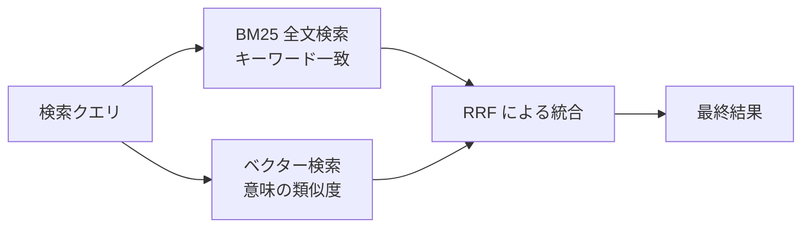
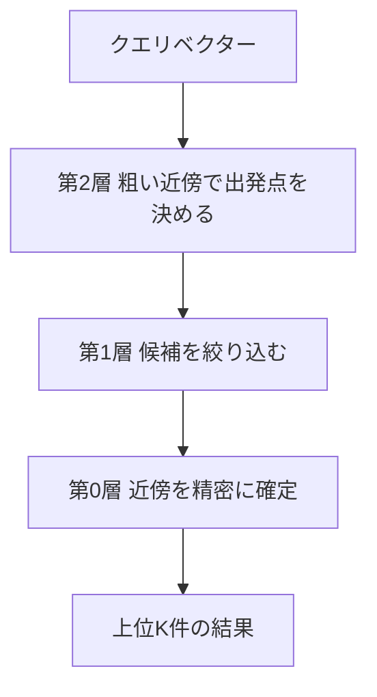

# Week 4 — ベクター検索・ハイブリッド検索

> **Phase 1b** | 学習プラン Week 4 / 8  
> 学習目標：Embedding・HNSW・RRF の仕組みを説明でき、Python SDK でベクター検索とハイブリッド検索を実装できる

---

## 全体像：3種類の検索とその使い分け



---

## 1. なぜベクター検索が必要か：BM25 の限界

BM25 は「キーワードが一致するか」で検索する。語彙が違うと絶対にマッチしない。

```
クエリ：「格安宿泊施設」

文書A: "東京の格安宿泊施設"          → キーワードが一致 → BM25: ヒット ✓
文書B: "affordable accommodation"    → 一致する単語がない → BM25: ヒットしない ✗
文書C: "リーズナブルな価格で泊まれる"  → 語彙が違う → BM25: ヒットしない ✗
```

文書B・Cは意味的に「格安宿泊施設」に近いが、BM25 では見つけられない。これを解決するのがベクター検索。

---

## 2. Embedding（埋め込み）と類似度の測り方

### Embedding の復習

```
テキスト → AI モデル → 数値のリスト（ベクター）

"格安宿泊施設"       → [0.21, -0.74, 0.53, ...]（1536個）
"affordable hotel"   → [0.23, -0.71, 0.55, ...]（ほぼ同じ）
"猫の鳴き声"         → [-0.61, 0.44, -0.12, ...] （全然違う）
```

意味が近い → ベクター空間での距離が近い。

### コサイン類似度とは

2つのベクターの「方向の近さ」を -1.0 から 1.0 の値で表す指標。

| 値 | 意味 |
|---|---|
| 1.0 | 完全に同じ方向（最も近い） |
| 0.0 | 直角（無関係） |
| -1.0 | 逆方向（最も遠い） |

> **「距離」ではなく「角度」を使う理由**  
> ベクターの長さ（大きさ）はモデルによってバラバラなので、長さを除いた「方向だけ」で類似度を比べる。

### 📖 補足：ベクトル化（Embedding）は何をしているか

Embedding の本質は**「意味を座標として表現する」**こと。

```
【直感的なイメージ：2次元で考えた場合】

軸1「生き物っぽさ」 / 軸2「乗り物っぽさ」

犬   → (0.9, 0.0)   ← 生き物で乗り物ではない
猫   → (0.8, 0.0)   ← 犬と近い
車   → (0.0, 0.9)   ← 乗り物で生き物ではない
電車 → (0.0, 0.8)   ← 車と近い
```

実際には 1536 本の軸があり、意味が近いテキストが近い座標に集まる。

モデルはどうやってこれを学ぶか：

```
学習データ（大量のテキスト）を読む中で気づく：

  「ホテル」「宿」「アコモデーション」は同じような文脈に登場する
  → 似たような座標を割り当てるべき

  「機械学習」「深層学習」「ニューラルネット」も同じ文脈に登場する
  → こちらも互いに近い座標
```

**「何が似ているか」は人間が教えるのではなく、モデルが学習で自力で発見する。**

各次元が何を表すかは人間には読めない。ある値が「宿泊施設っぽさ」なのか「食べ物との距離」なのかは不明。1536 本の軸が組み合わさって初めて意味が表現される。

### 📖 補足：次元数（1536）はどう決まるか

次元数はモデルを設計するときの「選択肢」であり、データから自動で決まるものではない。

| 次元数が少なすぎる場合 | 次元数が多すぎる場合 |
|---|---|
| 意味の微妙なニュアンスを表現しきれない | 計算コストが爆発、ストレージが膨大 |
| 「ホテル」と「宿」が同じ座標になってしまう | 次元の呪い：全点が等距離になり類似度が測れなくなる |

1536 は「精度 vs コスト」を実験的に最適化した結果の数字。カメラの画素数に似ている：1万画素では細かいものが写せない、10億画素はデータが重すぎる、1600万画素は現実的な最適解。

| モデル | 次元数 |
|---|---|
| text-embedding-ada-002 | 1536 |
| text-embedding-3-small | 1536 |
| text-embedding-3-large | 3072 |

---

## 3. HNSW アルゴリズム

### なぜ全件比較（ブルートフォース）ではダメか

> **📖 ブルートフォースとは**  
> 「賢い方法を考えず、すべての可能性を一つずつ確認する」手法。  
> 例：鍵を探すとき、引き出し・ポケット・棚をすべて漏れなく調べる = ブルートフォース。  
> 必ず正解を見つけられるが、全部調べるまで終わらない。

ベクター検索でのブルートフォース：クエリベクターを全文書のベクターと 1 件ずつ比較する。

```
文書が 100 万件ある場合：

クエリのたびに 100 万件 × コサイン類似度の計算
= O(n) の計算量（n = 文書数）

文書数が 2 倍 → 計算量も 2 倍
文書数が 10 倍 → 計算量も 10 倍

✓ 必ず正確な上位 K 件を返す
✗ 大規模インデックスでは使えない
```

### HNSW（Hierarchical Navigable Small World）

「階層グラフで近傍を**近似的に高速探索**する」アルゴリズム。計算量は **O(log n)**。



> **重要：第0層で「全ノード」を調べるわけではない**  
> 第0層でも調べるのはごく一部のノードだけ。上位層の役割は「第0層のどこから探索を始めるか」を絞り込むこと。

### 📖 補足：層をたどる検索の具体的な流れ（100万件の例）

**クエリ：「格安で快適なホテル」、構成：第2層=100件 / 第1層=10,000件 / 第0層=100万件**

**Step 1 ── 第2層（100件）**

```
固定のエントリーポイントから出発。
隣のノードを確認して、クエリに近い方向へ移動。
「もうどの隣もここより遠い」と判断したら止まる。

調べたノード数：約20〜30件 / 100件中
結果：第0層の探索を始める「出発エリア」が決まる
```

**Step 2 ── 第1層（10,000件）**

```
Step 1 で止まったノードの、第1層での対応ノードから再開。
もう少し細かい地図で同じ操作を繰り返す。

調べたノード数：約30〜50件 / 10,000件中
結果：出発エリアがさらに絞り込まれる
```

**Step 3 ── 第0層（100万件）**

```
Step 2 で止まったノードの、第0層での対応ノードから再開。
このノードはすでにクエリの近くにある。
ef（候補リスト）を使って周辺を丁寧に探索。

調べたノード数：約100〜200件 / 100万件中
結果：上位K件を確定して返す
```

**合計調査ノード数：約230件 ← 100万件中の 0.02% だけ**

---

**上位層がなければどうなるか：**

```
第0層だけで探索するとして、スタート地点がランダムになる

運悪く「量子力学の教科書」ノードからスタート →
量子力学 → 物理学 → 自然科学 → 地理 → 旅行 → ホテル → 格安ホテル

遠回りになる、途中で局所最適に引っかかって見つけられない可能性がある

上位層の役割 = 「まず正しい大陸・国・都市に移動する」こと
               → 第0層では「正しい都市の中だけ」を精密に探せばよい
```

> **「近似」と「正確」の違い**  
> ブルートフォース：すべての文書を比較 → 100%正確、ただし遅い  
> HNSW：グラフをたどって探索 → わずかに見逃しがある可能性があるが、実用上十分な精度で高速

### 📖 補足：ノードと層の概念

**ノード = 1つの文書（のベクター）**

```
文書A:「東京のホテル...」  → ベクター [0.21, -0.74, ...] = ノード A
文書B:「大阪の旅館...」   → ベクター [0.23, -0.71, ...] = ノード B
文書C:「機械学習とは...」 → ベクター [-0.61, 0.44, ...] = ノード C
```

100 万件の文書 = 100 万個のノード。近いノード同士が `m` 本のリンクでつながれている。

**リンク = 「ベクター空間上で近い 2 つのノードをつなぐ双方向の道」**

インデックスを構築するとき、各ノードに対して「最も近い `m` 件の文書」を探し、その間にリンクを張る。

```
文書A:「東京の格安ホテル」      → ベクター [0.21, -0.74, ...]
文書B:「新宿の安いホテル」      → ベクター [0.22, -0.73, ...]  ← A に近い
文書C:「大阪のリーズナブルな宿」 → ベクター [0.19, -0.71, ...]  ← A に近い
文書D:「機械学習の基礎」        → ベクター [-0.61, 0.44, ...]  ← A から遠い

m = 2 の場合：
  A <──> B （近いのでリンクあり）
  A <──> C （近いのでリンクあり）
  A   ✗  D （遠いのでリンクなし）
```

リンクは「道路」のようなもの。検索時はこの道路をたどって近いノードへ移動する。  
`m` が大きいほど 1 ノードから出る道路の数が増え、局所最適に引っかかりにくくなる（精度向上）が、  
全リンク情報をメモリに保持するためメモリ使用量も増える。

**層 = 同じノード群の「解像度違いのコピー」**

上の層ほどノード数が少なく長距離のリンクを持つ。下の層ほど密で精密。

```
第 2 層（最上層）：ランダムに選ばれた代表ノードのみ（例：約 1,000 件）
  A ─────────────────── F
第 1 層（中間層）：もう少し多いノード（例：約 10,000 件）
  A ──B── C ──D── E ──F
第 0 層（最下層）：全ノード（100 万件すべて）
  A-B-C-D-E-F-G-H-...（全部）
```

上の層にいるノードは下の層にも存在する。上の層は「地図の縮尺が荒い版」、下の層は「精密な地図」。

**なぜ O(log n) になるか**

```
n = 100 万件の場合、層の数 ≈ log₂(100 万) ≈ 20 層

各層で調べるノード数は定数（m に依存）= 少数

合計計算量 = 20 層 × 定数 = O(log n)

文書数別の比較：

文書数        ブルートフォース    HNSW
10 万件       100,000 回         約 170 回
100 万件      1,000,000 回       約 200 回
1000 万件     10,000,000 回      約 230 回

文書が 10 倍になっても HNSW の計算回数はほとんど増えない
```

### 📖 補足：具体例で追う（9件、m=2、2層構造）

※ 2D 座標を使って説明する（実際は 1536 次元だが、概念はまったく同じ）

**文書一覧**

```
ID     座標      内容
A1    (8, 7)   「東京の格安ホテル」   ← クエリの正解
A2    (9, 6)   「新宿ビジネスホテル」
A3    (7, 8)   「銀座ホテル」
B1    (8, 2)   「東京ラーメン」
B2    (7, 3)   「渋谷カフェ」
B3    (9, 1)   「寿司店」
C1    (1, 8)   「機械学習入門」
C2    (2, 7)   「Python入門」
C3    (1, 6)   「DB設計」
```

**座標マップ**

```
Y
8 | C1          A3
7 | C2          A1   ★ Q(8.5, 7.5)「格安ホテル」
6 | C3          A2
5 |
4 |
3 |             B2
2 |             B1
1 |                B3
  +──────────────────
    1  2         7  8  9   X
```

3 つのグループが存在する：A（宿泊）・B（飲食）・C（IT）

---

**📖 距離の計算方法（ユークリッド距離）**

2点間の「直線距離」をピタゴラスの定理で求める。

```
2点 P1=(x1, y1) と P2=(x2, y2) の距離：

  距離 = √( (x2-x1)² + (y2-y1)² )

例：A1(8,7) と Q(8.5, 7.5) の距離
  x の差：8.5 - 8.0 = 0.5 → 2乗 → 0.25
  y の差：7.5 - 7.0 = 0.5 → 2乗 → 0.25
  距離 = √(0.25 + 0.25) = √0.5 ≈ 0.71

例：C1(1,8) と Q(8.5, 7.5) の距離
  x の差：8.5 - 1.0 = 7.5 → 2乗 → 56.25
  y の差：7.5 - 8.0 = -0.5 → 2乗 → 0.25
  距離 = √(56.25 + 0.25) = √56.5 ≈ 7.52
```

1536 次元でも同じ原理。各次元の差を2乗して全部足し、平方根をとる。

> **実際のベクター検索はコサイン類似度を使う**  
> 今回の例はイメージしやすいようにユークリッド距離を使ったが、テキスト Embedding の検索では  
> 「2点の離れ具合」ではなく「2つのベクターが向いている方向の近さ（角度）」= コサイン類似度で比較する。  
> HNSW のアルゴリズム自体（近い隣に移動する・層をたどる）はどちらの指標でも同じ動作をする。

---

**Layer 0 のリンク（全 9 件、m=2 で最近傍 2 件とつなぐ）**

```
A1(8,7) の最近傍 2 件 → A2(距離 1.41), A3(距離 1.41) → リンク: A1─A2, A1─A3
A2(9,6) の最近傍 2 件 → A1(距離 1.41), A3(距離 2.83) → リンク: A2─A1, A2─A3
A3(7,8) の最近傍 2 件 → A1(距離 1.41), A2(距離 2.83) → リンク: A3─A1, A3─A2

B1〜B3 は B グループ内のみ。C1〜C3 は C グループ内のみ。
```

m=2 ではグループをまたぐリンクが生まれない。各グループは「孤立した島」になる。

```
Layer 0 のリンク図：

C1─C2─C3（孤立）        A3─A1─A2（孤立）        B3─B1─B2（孤立）
```

**Layer 1 のリンク（代表ノード 3 件：C1, A1, B1）**

```
3 件しかないので全員がつながる：

C1(1,8) ─── A1(8,7)   距離 7.07
C1(1,8) ─── B1(8,2)   距離 9.22
A1(8,7) ─── B1(8,2)   距離 5.00
```

Layer 1 は 3 グループを横断するリンクを持つ。

---

**検索実行：クエリ Q = (8.5, 7.5)「格安ホテル」**

エントリーポイント（固定の出発点）= C1(1,8)

**Layer 1 の探索**

```
現在地：C1(1,8)
Q までの距離：sqrt((8.5-1)²+(7.5-8)²) ≈ 7.52

C1 の Layer1 隣ノードを確認：
  A1(8,7) → Q まで sqrt(0.25+0.25) ≈ 0.71  ← C1(7.52) より近い！
  B1(8,2) → Q まで sqrt(0.25+30.25) ≈ 5.52

→ A1 が一番近い → A1 に移動
```

```
現在地：A1(8,7)
Q までの距離：0.71

A1 の Layer1 隣ノードを確認：
  B1(8,2) → Q まで 5.52  ← A1(0.71) より遠い
  C1(1,8) → Q まで 7.52  ← 遠い（訪問済み）

→ どの隣も今より遠い → STOP

Layer 1 結果：A1(8,7)  ← Layer 0 はここから始める
```

Layer 1 で確認したノード：C1, A1, B1 の **3 件のみ**

---

**Layer 0 の探索（A1 からスタート）**

```
現在地：A1(8,7)
Q までの距離：0.71

A1 の Layer0 隣ノードを確認：
  A2(9,6) → Q まで sqrt(0.25+2.25) ≈ 1.58  ← A1(0.71) より遠い
  A3(7,8) → Q まで sqrt(2.25+0.25) ≈ 1.58  ← A1(0.71) より遠い

→ どの隣も今より遠い → 即 STOP

Layer 0 結果：A1(8,7) = 最終的な検索結果  ← 正解！
```

Layer 0 で確認したノード：A1, A2, A3 の **3 件のみ**

---

**結果まとめ**

```
確認したノード：C1, A1, B1（Layer1）+ A2, A3（Layer0）= 合計 5 件 / 9 件中

一度も確認しなかったノード：B2, B3, C2, C3（4 件）
```

**なぜ B2, B3, C2, C3 に触れなかったか**

```
Layer 0 は A1 からスタート。A1 からたどれるリンクは A2 と A3 のみ。
B・C グループへのリンクは m=2 では存在しない → 物理的に到達できない。

これが HNSW の速さの理由：
  「無関係なエリアへのリンクがないので、そもそも探索対象に入らない」
```

**Layer 1 がなかったら何が起きるか（同じ例で確認）**

```
Layer 0 だけで探索、スタートが C1(1,8) になったとする：

C1 の Layer0 隣ノード → C2, C3（C グループ内しかリンクがない）
C2 の Layer0 隣ノード → C1, C3
C3 の Layer0 隣ノード → C2, C1

→ C グループの中を行ったり来たりするだけで A グループに出る道がない
→ 正解の A1 に永遠にたどり着けない

Layer 1 の C1─A1 リンクが「IT 系から宿泊系への唯一の橋渡し」だった。
```

### HNSW のパラメーター

| パラメーター | 意味 | 高くすると | 低くすると |
|---|---|---|---|
| `m` | 各ノードが持つリンク数 | 精度↑ メモリ使用量↑ | 精度↓ メモリ↓ |
| `efConstruction` | インデックス構築時の探索幅 | 精度↑ 構築時間↑ | 精度↓ 構築高速 |
| `efSearch` | クエリ時の探索幅 | 精度↑ レイテンシ↑ | 精度↓ レイテンシ↓ |

> 通常はデフォルト値で始め、精度が足りないときだけチューニングする。

### 📖 補足：「探索幅」（ef）とは

HNSW はグラフをたどるとき「今一番近そうなノード」に移動し続ける欲張りな戦略をとる。  
この問題点：本当の最近傍に向かう途中で「局所最適（行き止まり）」に引っかかることがある。

```
クエリ ★ に一番近い文書は C のはずなのに...

  A ─── B ─── C ─── ★
  │
  D ─── E（今の位置から見ると E の方が近く見えてしまう）

E に移動すると A, B, C 方向が見えなくなり、C を見逃す
```

`ef` は探索中に保持する「候補ノードのリスト」のサイズ。複数の探索ルートを同時に持ち続けることで局所最適を回避する。

```
ef = 3：候補リストに 3 件だけ保持 → 速いが行き止まりに引っかかりやすい
ef = 50：候補リストに 50 件保持  → 複数方向を並行して探索 → 見逃しにくい、その分遅い
```

| | efConstruction | efSearch |
|---|---|---|
| いつ使うか | インデックスを**作るとき** | クエリを**実行するとき** |
| 影響するもの | グラフ構造の質（リンクの精度） | 1 クエリの探索精度 |
| 変更タイミング | インデックス再構築が必要 | クエリのたびに変えられる |
| アナロジー | 地図を作るときの丁寧さ | 地図を使って移動するときの念入りさ |

---

## 4. ハイブリッド検索と RRF

### なぜ組み合わせるのか

| | BM25 が得意 | ベクターが得意 |
|---|---|---|
| キーワードの完全一致 | ◎ | △ |
| 固有名詞・型番・製品コード | ◎ | △ |
| 語彙が違っても意味が近い検索 | ✗ | ◎ |
| 多言語をまたぐ検索 | ✗ | ◎ |
| スペルミス | △（Lucene のみ） | ◎ |

→ どちらかの弱点をもう一方が補う。**実務ではハイブリッド検索がほとんどのケースで最善。**

### なぜ「スコアの平均」ではなく RRF を使うのか

> **📖 スコールスケールが異なる問題**  
> BM25 と ベクター検索のスコールの「大きさの単位」がまったく違う。
>
> ```
> BM25スコア：  文書A=2.8、文書B=1.2、文書C=0.5
> ベクタースコア: 文書A=0.91、文書B=0.85、文書C=0.72
>
> 単純に足すと BM25 のスコールが支配的になり、
> ベクター検索の結果がほぼ無視されてしまう。
> ```
>
> そこで「スコアの値」ではなく「**順位**」を使って統合するのが RRF。

### RRF（Reciprocal Rank Fusion）の計算式

```
RRFスコア(文書d) = 1/(BM25での順位 + 60) + 1/(ベクターでの順位 + 60)
```

> `60` は定数（k）。順位の差が大きすぎるときの影響を和らげるための調整値。

### 具体的な計算例

| 文書 | BM25 順位 | ベクター順位 | RRFスコア | 最終順位 |
|---|---|---|---|---|
| 文書A | 1位 | 2位 | 1/61 + 1/62 = **0.0326** | 1位 |
| 文書B | 5位 | 1位 | 1/65 + 1/61 = **0.0318** | 2位 |
| 文書C | 2位 | 未ランク | 1/62 + 0 = **0.0161** | 3位 |
| 文書D | 未ランク | 3位 | 0 + 1/63 = **0.0159** | 4位 |

→ 両リストで上位に出た文書A が1位。片方にしか出ない文書も部分スコアを得る。

---

## 5. Python SDK での実装

### ベクターインデックスの作成

```python
from azure.search.documents.indexes import SearchIndexClient
from azure.search.documents.indexes.models import (
    SearchIndex, SimpleField, SearchableField,
    SearchField, SearchFieldDataType,
    VectorSearch, HnswAlgorithmConfiguration, VectorSearchProfile
)
from azure.core.credentials import AzureKeyCredential

index_client = SearchIndexClient(
    endpoint="https://<your-service>.search.windows.net",
    credential=AzureKeyCredential("<your-admin-key>")
)

# HNSW の設定
vector_search = VectorSearch(
    algorithms=[HnswAlgorithmConfiguration(name="hnsw-config")],
    profiles=[VectorSearchProfile(
        name="hnsw-profile",
        algorithm_configuration_name="hnsw-config"
    )]
)

# フィールド定義
fields = [
    SimpleField(name="id", type=SearchFieldDataType.String, key=True),
    SearchableField(name="content", type=SearchFieldDataType.String),
    SearchField(
        name="content_vector",
        type=SearchFieldDataType.Collection(SearchFieldDataType.Single),
        searchable=True,
        vector_search_dimensions=1536,         # モデルの次元数に合わせる
        vector_search_profile_name="hnsw-profile"
    )
]

index = SearchIndex(
    name="my-vector-index",
    fields=fields,
    vector_search=vector_search
)
index_client.create_or_update_index(index)
```

### クエリをベクター化して検索する

```python
from openai import AzureOpenAI
from azure.search.documents import SearchClient
from azure.search.documents.models import VectorizedQuery
from azure.core.credentials import AzureKeyCredential

# Azure OpenAI でベクター化
openai_client = AzureOpenAI(
    azure_endpoint="https://<your-openai>.openai.azure.com/",
    api_key="<your-openai-key>",
    api_version="2024-02-01"
)

def get_embedding(text):
    response = openai_client.embeddings.create(
        input=text,
        model="text-embedding-3-small"    # デプロイ名を指定
    )
    return response.data[0].embedding

search_client = SearchClient(
    endpoint="https://<your-service>.search.windows.net",
    index_name="my-vector-index",
    credential=AzureKeyCredential("<your-query-key>")
)

query = "格安で快適なホテル"
query_vector = get_embedding(query)

# ① BM25 のみ
r1 = list(search_client.search(search_text=query))

# ② ベクターのみ（search_text=None にする）
vector_q = VectorizedQuery(
    vector=query_vector,
    k_nearest_neighbors=5,
    fields="content_vector"
)
r2 = list(search_client.search(
    search_text=None,
    vector_queries=[vector_q]
))

# ③ ハイブリッド（BM25 + ベクター → RRF で自動統合）
r3 = list(search_client.search(
    search_text=query,
    vector_queries=[vector_q]
))

# 結果を比較する
print("=== BM25 のみ ===")
for r in r1[:3]:
    print(r["content"][:60], "score:", r["@search.score"])

print("=== ベクターのみ ===")
for r in r2[:3]:
    print(r["content"][:60], "score:", r["@search.score"])

print("=== ハイブリッド ===")
for r in r3[:3]:
    print(r["content"][:60], "score:", r["@search.score"])
```

> **注意**：インデックス時と異なるモデルでクエリをベクター化すると、ベクター空間がずれてマッチしなくなる。  
> インデックス時に `text-embedding-3-small` を使ったなら、クエリ時も同じモデルを使う。

---

## 重要な用語まとめ

| 用語 | 一言説明 |
|---|---|
| コサイン類似度 | 2つのベクターの方向の近さを -1〜1 で表す指標 |
| HNSW | 階層グラフで近傍を近似検索するアルゴリズム。O(log n) で高速 |
| 近似最近傍探索 | 完全に正確ではないが、十分近い結果を高速に返す探索方法 |
| m | HNSWの各ノードのリンク数。高いほど精度↑・メモリ↑ |
| efConstruction | HNSW構築時の探索幅。高いほど精度↑・構築時間↑ |
| efSearch | HNSWクエリ時の探索幅。高いほど精度↑・レイテンシ↑ |
| ハイブリッド検索 | BM25 とベクター検索を同時に走らせ RRF で統合する検索方式 |
| RRF | スコアではなく順位を使って2つの結果リストを統合する手法 |
| VectorizedQuery | SDK でベクタークエリを指定するオブジェクト |

---

## ハンズオン チェックリスト

- [ ] インデックスにベクターフィールド（`content_vector`、dimensions=1536）を追加して作成する
- [ ] 10〜20件のテキストデータを用意し、Azure OpenAI Embeddings でベクター化する
- [ ] ベクター化したデータをインデックスに格納する（Push モデル）
- [ ] 同じ質問を以下の3通りで実行し、結果の違いをノートに記録する
  - BM25 のみ（`search_text=query, vector_queries=なし`）
  - ベクターのみ（`search_text=None, vector_queries=vector_q`）
  - ハイブリッド（`search_text=query, vector_queries=vector_q`）
- [ ] HNSW の `m` や `efSearch` の値を変えてインデックスを作り直し、結果の変化を確認する

---

## 自己チェック

1. **インデックス時に `text-embedding-3-small`、クエリ時に `text-embedding-ada-002` を使うとどうなるか？**
   - キーワード：ベクター空間がずれる、マッチしない、モデルは揃える

2. **RRF を「スコアの平均」にしない理由は？**
   - キーワード：スコールスケールが異なる、BM25 が支配的になる、順位を使う

3. **HNSW `m=4` と `m=16` のトレードオフは？**
   - キーワード：m が低い→メモリ少・精度低、m が高い→メモリ多・精度高

4. **ベクター検索のみでは「Azure AI Search」という型番を正確に検索しにくい理由は？**
   - キーワード：固有名詞・完全一致は BM25 が得意、ハイブリッドで補完

5. **ハイブリッド検索で `search_text=None` にするとどうなるか？**
   - キーワード：BM25 なし、ベクター検索のみになる

---

## 次週の予告（Week 5）

セマンティックランキングと AI Enrichment に入る：

- **セマンティックランキング** = BM25/ハイブリッドの結果をニューラルで**再ランキング**（ベクター検索とは別物）
- **AI Enrichment パイプラインの詳細**：OCR・翻訳・エンティティ抽出の設定
- **カスタムスキルの実装**：Azure Functions で独自処理を挟む
- **インクリメンタルエンリッチメント**：変更されたスキルの下流だけ再実行するキャッシュ機能
