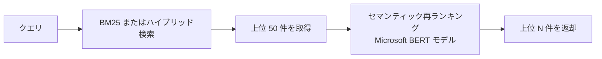
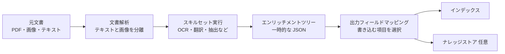

# Week 5 — セマンティックランキングと AI Enrichment

> **Phase 2a** | 学習プラン Week 5 / 8  
> 学習目標：セマンティックランカーと AI Enrichment パイプラインの仕組みを詳細に説明でき、カスタムスキルを実装できる

---

## 1. セマンティックランキング

### 📖 補足：「セマンティック」という言葉の意味

「セマンティック（semantic）」はギリシャ語の「意味のある」が語源。対義語は「シンタックス（syntax：構文・形式）」。

```
シンタックス的な比較 = 文字・形を見る
  「犬」と「dog」   → 違う文字列 → 別物
  「ホテル」と「宿」→ 違う文字  → 別物

セマンティックな比較 = 意味・文脈を見る
  「犬」と「dog」   → 同じ概念 → 近い
  「ホテル」と「宿」→ 同じ概念 → 近い
```

AI Search の各機能を「何を見るか」で整理すると：

| 機能 | 何を見るか |
|---|---|
| BM25 | キーワードの一致（形・シンタックス） |
| ベクター検索 | 意味の近さ（セマンティック） |
| セマンティックランキング | クエリと文書の意味的な関連度（より深いセマンティック） |

### よくある誤解：ベクター検索とは別物

Week 4 で学んだベクター検索と混同しやすいが、まったく異なるものです。

| | ベクター検索 | セマンティックランキング |
|---|---|---|
| 何をするか | 全文書から意味が近いものを探す | すでに見つかった上位 50 件を並べ替える |
| どの段階で動くか | 検索フェーズ（候補を見つける） | 再ランキングフェーズ（順位を付け直す） |
| 使うモデル | Embedding モデル（text-embedding-3-small 等） | Microsoft 製クロスエンコーダー（BERT ベース） |
| 対象の文書数 | インデックス全件 | BM25/ハイブリッド結果の上位 50 件のみ |

### 処理の流れ



### 📖 補足：クロスエンコーダーはどういう処理をしているか

Embedding（バイエンコーダー）との違いを理解するのが重要。

**バイエンコーダー（Embedding）**：クエリと文書を別々に変換してからベクターを比較する

```
クエリ  → [モデル] → ベクター A
文書    → [モデル] → ベクター B
類似度 = A と B のコサイン類似度
```

文書を事前にベクター化してインデックスに保存できるので速い。ただし「クエリの文脈での意味」は捉えられない。

**クロスエンコーダー**：クエリと文書を一緒にモデルに渡して関連度を直接評価する

```
"[クエリ: 格安ホテルを探しています] + [文書: リーズナブルな価格で快適に宿泊できます]"
                     ↓ 一緒に BERT モデルに入力
               関連度スコア：3.7 / 4.0
```

クエリと文書の相互作用（この質問に対してこの文書は答えになっているか）を直接判定するため精度が高い。

**なぜ全件に使えないか：**

```
バイエンコーダー：文書を事前にベクター化 → クエリ時はクエリだけ変換（速い）

クロスエンコーダー：事前計算できない（クエリが来てから初めてペアを作れる）
  クエリ × 文書A を評価 → クエリ × 文書B を評価 → ...全件繰り返し（遅い）

→ BM25 で 50 件に絞ってから適用する理由はここにある
```

### なぜ上位 50 件だけか

クロスエンコーダーは「クエリと文書のペア」を 1 件ずつ評価する。全文書に適用すると処理時間が膨大になるため、BM25/ハイブリッドで絞り込んだ 50 件だけに適用する。

> 50 位以下の文書はセマンティックランキングの対象外。BM25 で 51 位以下だった文書がどれだけ意味的に関連していても、再ランキングの対象にならない。

### 出力フィールド

通常の検索に加えて以下のフィールドが追加される：

| フィールド | 内容 | 値の範囲 |
|---|---|---|
| `@search.score` | BM25 または RRF スコア（従来通り） | - |
| `@search.reranker_score` | セマンティックランキングのスコア | 0.0 〜 4.0 |
| `@search.captions` | クエリに最も関連するパッセージの抜粋 | - |
| `@search.answers` | 文書がクエリに直接回答している場合にその内容を抽出 | - |

### BM25 で 8 位だった文書がセマンティックで 2 位になるのはなぜか

```
BM25 の評価：「キーワード "格安" "ホテル" が何回出てくるか」
  → キーワードが多い文書が上位に来る

セマンティックランキングの評価：「このクエリに対してこの文書は本当に答えているか」
  → 文書全体の意味・文脈でクエリとの関連度を判断

例：
  文書X:「格安ホテルの格安ホテルへの格安なご案内...」← BM25: キーワード多くて高位
  文書Y:「リーズナブルな価格で快適に宿泊できます」  ← BM25: 低位 → セマンティックで上昇
```

---

## 2. セマンティック設定と Python SDK

### インデックスにセマンティック設定を追加

```python
from azure.search.documents.indexes import SearchIndexClient
from azure.search.documents.indexes.models import (
    SemanticConfiguration, SemanticSearch,
    SemanticPrioritizedFields, SemanticField
)

semantic_config = SemanticConfiguration(
    name="my-semantic-config",
    prioritized_fields=SemanticPrioritizedFields(
        title_field=SemanticField(field_name="HotelName"),        # タイトル
        content_fields=[SemanticField(field_name="Description")], # 本文
        keywords_fields=[SemanticField(field_name="Tags")]        # キーワード
    )
)
semantic_search = SemanticSearch(configurations=[semantic_config])

# 既存インデックスへの追加も可能
index = index_client.get_index("hotels-sample-index")
index.semantic_search = semantic_search
index_client.create_or_update_index(index)
```

### セマンティック検索の実行

```python
results = search_client.search(
    search_text="格安で快適なホテル",
    query_type="semantic",
    semantic_configuration_name="my-semantic-config",
    top=5
)
for r in results:
    print(r["HotelName"])
    print("  BM25 score    :", r["@search.score"])
    print("  Semantic score:", r["@search.reranker_score"])
    if r.get("@search.captions"):
        print("  Caption:", r["@search.captions"][0].text)
```

---

## 3. AI Enrichment パイプラインの詳細

Week 2 でスキルセット・エンリッチメントツリーの概念を学んだ。ここでは具体的なスキルと設定を掘り下げる。

### パイプラインの流れ



### 主な組み込みスキル

| スキル名 | 何をするか | 典型的な使い道 |
|---|---|---|
| `OcrSkill` | 画像からテキストを抽出 | PDF 内の画像、スキャン文書 |
| `MergeSkill` | 複数テキストを結合 | OCR テキスト + 元テキストを 1 つに |
| `LanguageDetectionSkill` | 言語を検出 | "ja" / "en" などのコードを返す |
| `TranslationSkill` | テキストを翻訳 | 多言語コンテンツを日本語/英語に統一 |
| `EntityRecognitionSkill` | 人物・組織・場所を抽出 | 文書から固有名詞を自動タグ付け |
| `KeyPhraseExtractionSkill` | キーフレーズを抽出 | 要約・ファセット用のキーワード生成 |
| `SplitSkill` | 文書をチャンクに分割 | Embedding 用のトークン上限対応 |
| `AzureOpenAIEmbeddingSkill` | テキストをベクター化 | 統合ベクター化（クエリ時も自動変換） |

### 📖 補足：エンリッチメントツリーと出力フィールドマッピングの関係

**エンリッチメントツリーの実体**

1文書を処理するたびに作られる一時的な JSON。スキルが実行されるたびに枝が追加される。

```json
{
  "document": {
    "content": "東京の格安ホテルの記事...",     ← Indexer が自動で作る
    "normalized_images": ["(画像データ)"],      ← Indexer が自動で作る
    "ocrText": "画像から抽出したテキスト",      ← OcrSkill が追加
    "mergedContent": "元テキスト＋OCRテキスト", ← MergeSkill が追加
    "language": "ja",                           ← LanguageDetectionSkill が追加
    "keyPhrases": ["格安ホテル", "東京"],        ← KeyPhraseExtractionSkill が追加
    "entities": {
      "locations": ["東京", "新宿"]             ← EntityRecognitionSkill が追加
    }
  }
}
```

処理が終わったらこのツリーは**捨てられる**。インデックスに残すには出力フィールドマッピングで明示的に指定が必要。

**出力フィールドマッピングで「どの枝」を「どのフィールドに書くか」を指定する**

```json
"outputFieldMappings": [
  { "sourceFieldName": "/document/mergedContent",       "targetFieldName": "content"    },
  { "sourceFieldName": "/document/keyPhrases",          "targetFieldName": "keyPhrases" },
  { "sourceFieldName": "/document/entities/locations",  "targetFieldName": "locations"  }
]
```

```
エンリッチメントツリー（一時的）         インデックス（永続）

/document/content           → 指定なし → 捨てられる
/document/ocrText           → 指定なし → 捨てられる
/document/mergedContent     ──────────→ content
/document/language          → 指定なし → 捨てられる
/document/keyPhrases        ──────────→ keyPhrases
/document/entities/locations ─────────→ locations
```

### エンリッチメントツリーのパスについて

各スキルの入出力は `/document/` から始まるパスで指定する。

```
/document/              ← ルート（文書 1 件 = 1 ツリー）
/document/content       ← Indexer が解析した元テキスト
/document/ocrText       ← OcrSkill の出力
/document/mergedContent ← MergeSkill の出力
/document/keyPhrases    ← KeyPhraseExtractionSkill の出力
/document/pages/*       ← SplitSkill でチャンク分割した各ページ
```

スキルが実行されるたびにツリーに枝が追加されていくイメージ。最後に「出力フィールドマッピング」で必要な枝だけインデックスに書き込む。

### スキルセットの JSON 設定例（OCR + キーフレーズ抽出）

```json
{
  "name": "my-skillset",
  "skills": [
    {
      "@odata.type": "#Microsoft.Skills.Vision.OcrSkill",
      "name": "ocr-skill",
      "inputs": [
        { "name": "image", "source": "/document/normalized_images/*" }
      ],
      "outputs": [
        { "name": "text", "targetName": "ocrText" }
      ]
    },
    {
      "@odata.type": "#Microsoft.Skills.Text.MergeSkill",
      "name": "merge-skill",
      "inputs": [
        { "name": "text",          "source": "/document/content" },
        { "name": "itemsToInsert", "source": "/document/normalized_images/*/ocrText" }
      ],
      "outputs": [
        { "name": "mergedText", "targetName": "mergedContent" }
      ]
    },
    {
      "@odata.type": "#Microsoft.Skills.Text.KeyPhraseExtractionSkill",
      "name": "keyphrases-skill",
      "inputs": [
        { "name": "text",         "source": "/document/mergedContent" },
        { "name": "languageCode", "source": "/document/languageCode" }
      ],
      "outputs": [
        { "name": "keyPhrases", "targetName": "keyPhrases" }
      ]
    }
  ]
}
```

---

## 4. カスタムスキル

組み込みスキルでは対応できない処理（独自の分類モデル・社内 API など）を Azure Functions で実装できる。

### リクエスト・レスポンスの形式

```json
// AI Search → カスタムスキルへのリクエスト
{
  "values": [
    { "recordId": "0", "data": { "text": "処理対象のテキスト" } },
    { "recordId": "1", "data": { "text": "別の文書のテキスト" } }
  ]
}

// カスタムスキル → AI Search へのレスポンス
{
  "values": [
    { "recordId": "0", "data": { "wordCount": 42 } },
    { "recordId": "1", "data": { "wordCount": 17 } }
  ]
}
```

> `recordId` を使って入力と出力を対応させる。順番が変わっても `recordId` で一致させるため、並列処理が可能。

### Azure Functions での実装例

```python
import azure.functions as func
import json

def main(req: func.HttpRequest) -> func.HttpResponse:
    body = req.get_json()
    results = []

    for record in body["values"]:
        text = record["data"]["text"]
        word_count = len(text.split())

        results.append({
            "recordId": record["recordId"],
            "data": { "wordCount": word_count },
            "errors": None,
            "warnings": None
        })

    return func.HttpResponse(
        json.dumps({"values": results}),
        mimetype="application/json"
    )
```

### スキルセット JSON でカスタムスキルを指定

```json
{
  "@odata.type": "#Microsoft.Skills.Custom.WebApiSkill",
  "name": "word-count-skill",
  "uri": "https://<your-function>.azurewebsites.net/api/WordCount",
  "httpHeaders": { "x-functions-key": "<function-key>" },
  "inputs": [
    { "name": "text", "source": "/document/mergedContent" }
  ],
  "outputs": [
    { "name": "wordCount", "targetName": "wordCount" }
  ]
}
```

---

## 5. インクリメンタルエンリッチメント（エンリッチメントキャッシュ）

### 問題：スキルを 1 つ変えると全文書の再処理が必要

```
4 つのスキルがある場合：
  OCR → 言語検出 → キーフレーズ抽出 → エンティティ抽出

「キーフレーズ抽出」のパラメーターを 1 つ変更したいとき：
  デフォルト → 100 万件の文書を最初から全部再処理
  Azure AI Services API の課金 × 100 万件 → 非常に高額
```

### 解決：エンリッチメントキャッシュ

Azure Blob Storage にスキルの出力をキャッシュしておく。変更されたスキルの**下流だけ**を再実行する。

```
変更したスキル：キーフレーズ抽出

OCR              ← キャッシュを使う（再処理なし・課金なし）
言語検出         ← キャッシュを使う（再処理なし・課金なし）
キーフレーズ抽出 ← 変更したので再実行
エンティティ抽出 ← 上流が変わったので再実行
```

### 📖 補足：キャッシュの目的と処理フロー

**目的：Azure AI Services の API 呼び出し回数と課金を抑える**

OCR・言語検出・キーフレーズ抽出・エンティティ抽出・Embedding 生成などは Azure AI Services への API コールが発生し、件数に応じて課金される。100 万件の文書でスキルを 1 つ変更して全件再実行すると、変更のないスキルにも再び課金が発生する。これを防ぐのがキャッシュの主目的。

**Blob Storage に保存されるのは「スキルごとの出力結果（個別）」**

エンリッチメントツリー全体ではなく、スキルの出力を 1 つずつ Blob に保存する。

**初回実行：全スキルを実行してキャッシュを Blob Storage に保存する**

```
文書A を処理：
  OCR スキル実行     → API コール発生 → 出力を Blob に保存 → ツリーに追加
  言語検出スキル実行 → API コール発生 → 出力を Blob に保存 → ツリーに追加
  キーフレーズ実行   → API コール発生 → 出力を Blob に保存 → ツリーに追加
  エンティティ実行   → API コール発生 → 出力を Blob に保存 → ツリーに追加

  出力フィールドマッピング → インデックスに書き込み
  エンリッチメントツリーはメモリから捨てられる
```

**スキル定義を変更した後の再実行（「キーフレーズ」のパラメーターを変更した場合）**

```
文書A を処理：
  OCR スキル         → Blob 確認 → キャッシュあり → 読み込む（API コールなし）→ ツリーに追加
  言語検出スキル     → Blob 確認 → キャッシュあり → 読み込む（API コールなし）→ ツリーに追加
  キーフレーズ実行   → Blob 確認 → 定義が変わった → キャッシュなし → API コール発生 → Blob に保存 → ツリーに追加
  エンティティ実行   → 上流が変わった可能性あり → キャッシュ無効 → API コール発生 → ツリーに追加

  出力フィールドマッピング → インデックスに書き込み（通常通り）
```

キャッシュは「インデックスへの書き込み」の代わりではなく、「スキルの API 実行」の代わり。インデックスへの最終的な書き込みは毎回通常通り行われる。

**キャッシュの有効・無効はどう判定するか**

```
キャッシュキー = ドキュメントID + スキル定義のハッシュ値

スキル設定が変わる → ハッシュ変わる → キャッシュキーが一致しない → 再実行
スキル設定が同じ  → ハッシュ同じ  → キャッシュキーが一致する  → 読み取り
```

**下流も無効化される理由**

```
キーフレーズの出力が変わるかもしれない
  → エンティティスキルの入力に使われている場合、入力が変われば出力も変わる
  → 安全のためエンティティのキャッシュも無効化

逆に変更スキルより「上流」のスキルは入力が絶対変わらないため安全にキャッシュを使える
```

### キャッシュの有効化

```python
from azure.search.documents.indexes.models import SearchIndexerCache

indexer = search_indexer_client.get_indexer("my-indexer")
indexer.cache = SearchIndexerCache(
    storage_connection_string="<blob-storage-connection-string>",
    enable_reprocessing=True
)
search_indexer_client.create_or_update_indexer(indexer)
```

> **大規模データでは必ずキャッシュを有効化してから作業を始める。**  
> 後から有効化しても最初の 1 回は全件処理が走る。最初から設定するのが正解。

---

## 重要な用語まとめ

| 用語 | 一言説明 |
|---|---|
| セマンティックランキング | BM25/ハイブリッドの上位 50 件を BERT で再ランキングする機能 |
| クロスエンコーダー | クエリと文書のペアをまとめて評価するモデル（Embedding とは別） |
| `@search.reranker_score` | セマンティックランキングのスコア（0〜4）|
| `@search.captions` | セマンティックが抽出した関連パッセージの抜粋 |
| `@search.answers` | 文書がクエリに直接回答している場合にその内容を返すフィールド |
| OcrSkill | 画像からテキストを抽出する組み込みスキル |
| MergeSkill | OCR テキストと元テキストを結合するスキル |
| `/document/` パス | エンリッチメントツリーのルート。スキルの入出力を指定するパス記法 |
| カスタムスキル | Azure Functions 等の HTTPS エンドポイントで独自処理を実装する仕組み |
| `recordId` | カスタムスキルの入出力対応に使う識別子。並列処理を可能にする |
| インクリメンタルエンリッチメント | スキル変更時に変更箇所の下流だけ再実行するキャッシュ機能 |

---

## ハンズオン チェックリスト

- [ ] hotels インデックスにセマンティック設定を追加し、`query_type="semantic"` でクエリを実行する
- [ ] `@search.score` と `@search.reranker_score` を並べて表示し、順位の変化を確認する
- [ ] PDF または画像入りの Blob コンテナを作成し、OCR + KeyPhrase スキルセットを設定する
- [ ] カスタムスキル（文字数カウントなど簡単なもの）を Azure Functions で実装し、スキルセットに組み込む
- [ ] インデクサーにキャッシュを設定した後、スキルを 1 つ変更して再実行し、キャッシュされたスキルがスキップされることを確認する

---

## 自己チェック

1. **セマンティックランキングとベクター検索の違いを 1 文で説明できるか？**
   - キーワード：再ランキング・上位 50 件・候補を探す vs 並び替える

2. **BM25 で 8 位だった文書がセマンティックランキングで 2 位に上がった。理由は？**
   - キーワード：意味・文脈で評価・キーワードの出現頻度ではない

3. **セマンティックランキングに「上位 50 件の制限」がある理由は？51 位以下の文書はどうなるか？**
   - キーワード：クロスエンコーダーが重い・51 位以下は対象外

4. **エンリッチメントツリーとは何か？スキル実行後にどこへ行くか？**
   - キーワード：一時的な JSON・出力フィールドマッピングで選択・インデックスまたはナレッジストアに書き込み

5. **カスタムスキルの `recordId` はなぜ必要か？**
   - キーワード：並列処理・入力と出力の対応・順番が変わっても一致させる

6. **インクリメンタルエンリッチメントを最初から設定しない場合、後から有効化するとどうなるか？**
   - キーワード：最初の 1 回は全件処理・最初から設定が正解

---

## 次週の予告（Week 6）

RAG パターンとセキュリティに入る：

- **RAG アーキテクチャの実装**：Embedding → ハイブリッド検索 → セマンティックランキング → GPT-4 への回答生成
- **ドキュメントレベルのセキュリティトリミング**：`allowedUsers` フィールドでアクセス制御
- **認証モデル**：API Key / RBAC / Managed Identity の使い分け
- **ネットワークセキュリティ**：プライベートエンドポイント・IP ルール・共有プライベートリンク
