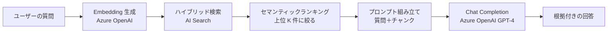
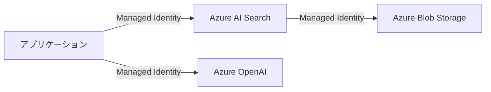

# Week 6 — RAG パターンとセキュリティ

> **Phase 2a** | 学習プラン Week 6 / 8  
> 学習目標：RAG システムの設計と実装ができる。API Key / RBAC / Managed Identity / ネットワークセキュリティを説明・実装できる

---

## 1. LLM とは何か

**LLM（Large Language Model）= 大規模言語モデル**。大量のテキストで学習した「言語を理解して生成する AI」。

### どうやって学習するか

インターネット上の膨大なテキスト（書籍・Wikipedia・ウェブサイトなど）を使い、「このテキストの次に来る言葉は何か」を繰り返し予測する訓練をしたニューラルネットワーク。

```
学習の例：
  「東京は日本の___」→ 「首都」
  「水は 100 度で___」→ 「沸騰する」

この予測を何兆回も繰り返した結果、
言語の意味・文脈・論理を内部的に学習する
```

代表的な LLM：GPT-4（Microsoft/OpenAI）、Claude（Anthropic）、Gemini（Google）。

### LLM が得意なこと・苦手なこと

```
得意なこと：
  ✓ 自然な文章を書く・要約する・翻訳する
  ✓ 与えられた文章から質問に答える
  ✓ 複数の情報を整理して答える

苦手なこと（AI Search が補う部分）：
  ✗ 学習データにない社内情報・最新情報を知らない
  ✗ 大量の文書から「どこに答えが書いてあるか」を探す
  ✗ 根拠なく自信満々に間違いを答える（ハルシネーション）
```

### AI Search と LLM の役割分担

| | AI Search | LLM |
|---|---|---|
| 役割 | 大量の文書から「関連するもの」を素早く見つける | 見つかった文書を読んで「答え」を自然な文章で作る |
| 比喩 | 図書館の司書（どの棚のどの本に答えがある） | その本を読んで要約してくれる人 |

```
AI Search だけだと：
  「この 5 件の文書が関連しています」← 一覧を返すだけ。ユーザーが自分で読む必要がある

LLM だけだと：
  「弊社の 2024 年の売上は？」→ 社内データを知らない → 嘘の数字を自信満々に答える

AI Search + LLM（RAG）：
  AI Search が「2024年売上が記載された社内文書」を見つける
  LLM がその文書を読んで「2024 年の売上は ◯◯ 億円です」と根拠付きで答える
```

---

## 2. RAG とは何か

**RAG（Retrieval-Augmented Generation）= 検索で取得した情報を使って LLM に回答を生成させる仕組み**

### なぜ RAG が必要か

```
LLM（GPT-4 など）だけに質問した場合の問題：

  「2024年の弊社の売上は？」→ LLM は社内データを知らない → 答えられない
  「最新の製品仕様は？」   → LLM の学習データは古い    → 古い情報を答える
  「この規約の第5条は？」  → LLM は特定文書を持たない  → ハルシネーション（でたらめを答える）
```

RAG の解決策：質問に関連する文書を検索して取得し、それをプロンプトに組み込んでから LLM に渡す。LLM は「与えられた文書に基づいて」回答するので、最新・正確・根拠のある回答ができる。

### 全体像



---

## 2. RAG の設計判断ポイント

### チャンクサイズ

文書を AI Search に格納するとき、大きな文書はチャンク（断片）に分割する。

```
チャンクサイズが大きすぎる場合（例：5000 トークン）：
  → プロンプトに関係のない情報が混入してコンテキストが汚染される
  → LLM への入力コスト（トークン課金）が増える
  → 1 チャンクに複数のトピックが混在してベクター検索の精度が下がる

チャンクサイズが小さすぎる場合（例：50 トークン）：
  → 文脈が失われる（「それは〜」の「それ」が何か分からなくなる）
  → 意味のある情報が断片化する

実務的な目安：256〜1024 トークン
```

### オーバーラップ

チャンク間で数百トークン重複させる。前後の文脈が途切れないようにするため。

```
チャンク1：「...東京のホテルは3つのカテゴリに分類される。高級・中級・格安である。」
チャンク2：「高級・中級・格安である。このうち格安ホテルは...」
                 ↑ ここが重複部分（overlap）
```

### top-K（取得件数）

プロンプトに組み込む検索結果の件数。

```
top-K が多い（例：K=20）：
  → 正解チャンクが含まれる可能性↑
  → LLM への入力トークン↑ → コスト↑・レイテンシ↑

top-K が少ない（例：K=3）：
  → コスト↓・レイテンシ↓
  → 正解チャンクが含まれない可能性↑

実務的な目安：3〜10 件。セマンティックランキングで精度を上げてから K を絞る
```

### プロンプト設計

```
system: |
  以下のコンテキストのみを使って質問に回答してください。
  コンテキストに情報がない場合は「資料に記載がありません」と答えてください。

  コンテキスト:
  ===
  {chunk1}
  ===
  {chunk2}
  ===
  {chunk3}

user: 格安ホテルの予約方法を教えてください
```

「コンテキストのみを使って」という指示が重要。これがないと LLM は学習データから答えを補完してしまい、根拠のない回答が混入する。

---

## 3. Python での RAG 実装

```python
from azure.identity import DefaultAzureCredential
from azure.search.documents import SearchClient
from azure.search.documents.models import VectorizedQuery
from openai import AzureOpenAI

SEARCH_ENDPOINT = "https://<your-service>.search.windows.net"
SEARCH_INDEX    = "my-vector-index"
OPENAI_ENDPOINT = "https://<your-openai>.openai.azure.com/"
EMBED_MODEL     = "text-embedding-3-small"
CHAT_MODEL      = "gpt-4"

credential     = DefaultAzureCredential()
search_client  = SearchClient(SEARCH_ENDPOINT, SEARCH_INDEX, credential)
openai_client  = AzureOpenAI(azure_endpoint=OPENAI_ENDPOINT, api_version="2024-02-01",
                              azure_ad_token_provider=lambda: credential.get_token(
                                  "https://cognitiveservices.azure.com/.default"
                              ).token)

def rag_query(question: str, top_k: int = 5) -> str:
    # Step 1: クエリを Embedding 化
    embed_response = openai_client.embeddings.create(input=question, model=EMBED_MODEL)
    query_vector   = embed_response.data[0].embedding

    # Step 2: ハイブリッド検索 + セマンティックランキング
    vector_query = VectorizedQuery(
        vector=query_vector,
        k_nearest_neighbors=50,          # RRF 後に上位 50 件をセマンティックへ
        fields="content_vector"
    )
    results = search_client.search(
        search_text=question,
        vector_queries=[vector_query],
        query_type="semantic",
        semantic_configuration_name="my-semantic-config",
        top=top_k
    )

    # Step 3: チャンクをプロンプトに組み立て
    chunks = "\n===\n".join(r["content"] for r in results)
    system_prompt = f"""以下のコンテキストのみを使って質問に回答してください。
コンテキストに情報がない場合は「資料に記載がありません」と答えてください。

コンテキスト:
===
{chunks}"""

    # Step 4: Chat Completion
    response = openai_client.chat.completions.create(
        model=CHAT_MODEL,
        messages=[
            {"role": "system", "content": system_prompt},
            {"role": "user",   "content": question}
        ]
    )
    return response.choices[0].message.content


# 使用例
answer = rag_query("格安で快適なホテルの予約方法を教えてください")
print(answer)
```

---

## 4. ドキュメントレベルのセキュリティトリミング

### 課題：ユーザーによってアクセスできる文書を制限したい

```
例：社内ドキュメント検索システム
  経理部の文書 → 経理部員のみ閲覧可
  人事部の文書 → 人事部員のみ閲覧可
  全社共有文書 → 全員閲覧可
```

### 実装方法：`allowedUsers` フィールド + クエリ時フィルター

**インデックスのスキーマにアクセス制御フィールドを追加する**

```python
SimpleField(
    name="allowedUsers",
    type=SearchFieldDataType.Collection(SearchFieldDataType.String),
    filterable=True      # フィルターで使うので必須
)
```

**文書を格納するときにアクセス許可ユーザーを設定する**

```python
documents = [
    {
        "id": "doc-001",
        "content": "経理部の予算資料...",
        "allowedUsers": ["alice@example.com", "bob@example.com"]
    },
    {
        "id": "doc-002",
        "content": "全社共有のお知らせ...",
        "allowedUsers": ["alice@example.com", "bob@example.com", "carol@example.com"]
    }
]
search_client.upload_documents(documents)
```

**クエリ時に現在のユーザーでフィルターする**

```python
current_user = "alice@example.com"    # ログイン中のユーザー（認証システムから取得）

results = search_client.search(
    search_text="予算について",
    filter=f"allowedUsers/any(u: u eq '{current_user}')"
)
```

### 注意点

```
これはアプリケーション層の制御。

✓ アプリが正直に current_user を設定する前提で動く
✗ アプリ自体が改ざんされると bypass できる
✗ AI Search の管理キーを持つ人は全文書にアクセスできる

→ 本番環境では Azure AD 認証との組み合わせと、
  Query Key / RBAC によるアクセス制御が別途必要
```

---

## 5. 認証モデル

### 4種類の認証方式



| 方式 | 用途 | 推奨度 | 備考 |
|---|---|---|---|
| Admin Key | サービス全操作（インデックス作成・削除含む） | 低 | 漏洩リスク大。開発時のみ |
| Query Key | インデックスの読み取り（検索）のみ | 中 | クライアントサイドへの埋め込みは比較的安全 |
| RBAC（AAD） | ユーザー/サービスプリンシパルに役割付与 | 高 | シークレット不要。推奨 |
| Managed Identity | Azure リソース間の認証 | 最高 | シークレット管理が完全に不要 |

### RBAC の主なロール

| ロール名 | できること |
|---|---|
| `Search Service Contributor` | サービス設定・インデックス管理 |
| `Search Index Data Contributor` | インデックスのデータ読み書き（ドキュメントの追加・削除） |
| `Search Index Data Reader` | インデックスの検索（読み取り）のみ |

### Managed Identity とは

**シークレット（パスワード・API キー）を一切使わずに Azure リソース間で認証する仕組み**

```
従来の方法（API Key）：
  アプリ → AI Search に接続するために admin-key = "abc123..." を設定ファイルに保存
  問題：キーが漏洩すると誰でもアクセスできる。キーのローテーションが手間

Managed Identity：
  App Service に「システム割り当て Managed Identity」を有効化
  → Azure が自動で「このアプリの ID」を作成・管理（パスワード不要）
  → AI Search 側で「この App Service の ID に Search Index Data Reader を付与」
  → アプリはキーなしで AI Search に接続できる
```

### Python での認証切り替え

```python
from azure.core.credentials import AzureKeyCredential
from azure.identity import DefaultAzureCredential

# API Key を使う場合（開発・テスト用）
credential = AzureKeyCredential("<your-admin-key>")

# Managed Identity / Azure AD を使う場合（本番推奨）
credential = DefaultAzureCredential()
# DefaultAzureCredential は以下を順番に試す：
#   1. 環境変数（AZURE_CLIENT_ID 等）
#   2. Managed Identity（Azure 上で実行時）
#   3. Azure CLI ログイン（az login、ローカル開発時）
#   4. Visual Studio / VS Code のログイン情報

search_client = SearchClient(
    endpoint="https://<your-service>.search.windows.net",
    index_name="my-index",
    credential=credential
)
```

`DefaultAzureCredential` を使うことで、ローカル開発時（`az login`）と本番環境（Managed Identity）で同じコードが動く。

---

## 6. ネットワークセキュリティ

### 3つの制御レベル

| 設定 | 何を制限するか | ユースケース |
|---|---|---|
| IP ルール | パブリックエンドポイントにアクセスできる IP を制限 | 特定のオフィス IP のみ許可 |
| プライベートエンドポイント | VNet 内からのみアクセス可能（パブリック接続を遮断） | エンタープライズ本番環境の標準 |
| 共有プライベートリンク | AI Search からストレージ等への**送信接続**をプライベート化 | インデクサーがプライベート Blob に接続する場合 |

### IP ルール

```
AI Search はデフォルトでインターネットからアクセス可能。
IP ルールで「許可する IP のみ通す」ホワイトリスト制御ができる。

許可設定例：
  会社の固定 IP: 203.0.113.10/32
  Azure Portal の IP: 各リージョンの管理 IP 範囲（Microsoft が公開）
```

### プライベートエンドポイント

```
設定後の接続経路：

設定前：インターネット → AI Search（パブリック IP）
設定後：VNet 内の App Service → プライベートエンドポイント（VNet 内の IP）→ AI Search

インターネットからは一切アクセスできなくなる。
DNS も VNet 内のプライベート DNS ゾーンで解決する必要がある。
```

### 共有プライベートリンク（方向に注意）

```
通常のプライベートエンドポイント：
  外部 → AI Search への受信接続をプライベート化

共有プライベートリンク：
  AI Search → Blob Storage / Cosmos DB などへの送信接続をプライベート化

使う場面：
  Blob Storage をプライベートエンドポイント化している環境で
  AI Search のインデクサーが Blob にアクセスしたい場合
```

---

## 重要な用語まとめ

| 用語 | 一言説明 |
|---|---|
| RAG | 検索で取得した文書をプロンプトに組み込み LLM に回答させる仕組み |
| チャンク | 文書を検索・Embedding しやすいサイズに分割した断片 |
| オーバーラップ | チャンク間で文脈が途切れないよう重複させる部分 |
| top-K | プロンプトに組み込む検索結果の件数 |
| ハルシネーション | LLM が根拠なく事実に反する内容を生成してしまう現象 |
| セキュリティトリミング | クエリ時に `$filter` でユーザーのアクセス権に応じて結果を絞り込む手法 |
| Admin Key | AI Search の全操作が可能な管理者キー |
| Query Key | インデックスの読み取り（検索）のみ可能なキー |
| RBAC | Azure AD を使ってロールベースでアクセス制御する仕組み |
| Managed Identity | シークレット不要で Azure リソース間認証を行う仕組み |
| DefaultAzureCredential | ローカル（az login）と本番（Managed Identity）で同じコードが動く認証クラス |
| プライベートエンドポイント | AI Search を VNet 内からのみアクセス可能にする設定 |
| 共有プライベートリンク | AI Search からストレージ等への送信接続をプライベート化する設定 |

---

## ハンズオン チェックリスト

- [ ] `rag_query()` 関数を実装し、実際の AI Search インデックスに対して RAG クエリを実行する
- [ ] `top_k` の値を 3・5・10 と変えて回答の質とレイテンシの変化を観察する
- [ ] `allowedUsers` フィールドを持つインデックスを作成し、ユーザーによって返却される文書が変わることを確認する
- [ ] API Key から `DefaultAzureCredential`（`az login`）に切り替えて動作確認する
- [ ] IP ルールで自分の IP 以外からのアクセスを制限し、制限が効くことを確認してから解除する

---

## 自己チェック

1. **RAG がハルシネーションを防げる理由は？完全に防げるか？**
   - キーワード：コンテキストのみ使う指示・LLM は与えられた文書に基づく・完全には防げない

2. **チャンクサイズを 5000 トークンにするとどんな問題が起きるか？**
   - キーワード：コンテキスト汚染・トークンコスト増・ベクター検索の精度低下

3. **Query Key はなぜ Admin Key より安全か？**
   - キーワード：読み取り専用・インデックスの作成・削除はできない

4. **`DefaultAzureCredential` を使う利点は何か？**
   - キーワード：ローカルと本番で同じコード・Managed Identity と az login を自動切り替え

5. **インデクサーがプライベートエンドポイント化された Blob Storage にアクセスするために必要な設定は？**
   - キーワード：共有プライベートリンク・送信接続をプライベート化

6. **セキュリティトリミングの限界は何か？**
   - キーワード：アプリ層の制御・アプリ自体が信頼される前提・Admin Key 保持者は bypass 可能

---

## 次週の予告（Week 7）

スケーリング・運用・高度な機能の網羅的な理解に入る：

- **価格ティアの選定**：Free / Basic / S1〜S3 / Storage Optimized の違い
- **レプリカとパーティション**：QPS・可用性・ストレージの調整方法と SLA の条件
- **インデックスのライフサイクル管理**：スキーマ変更の制約とエイリアスを使ったゼロダウンタイム移行
- **監視・診断**：Log Analytics・KQL クエリ・スロットリングへの対処
- **未習得の機能**：ファセット・ハイライト・地理空間検索・ベクター量子化・デバッグセッション
