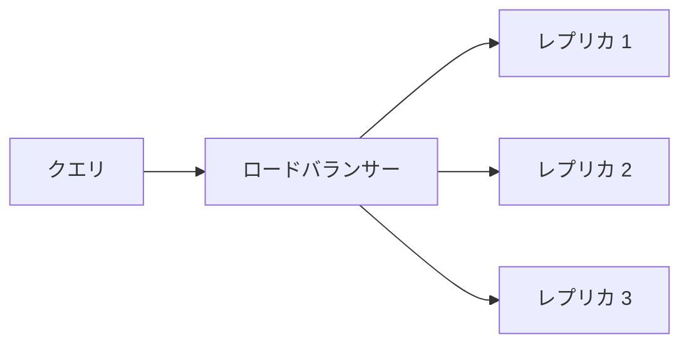
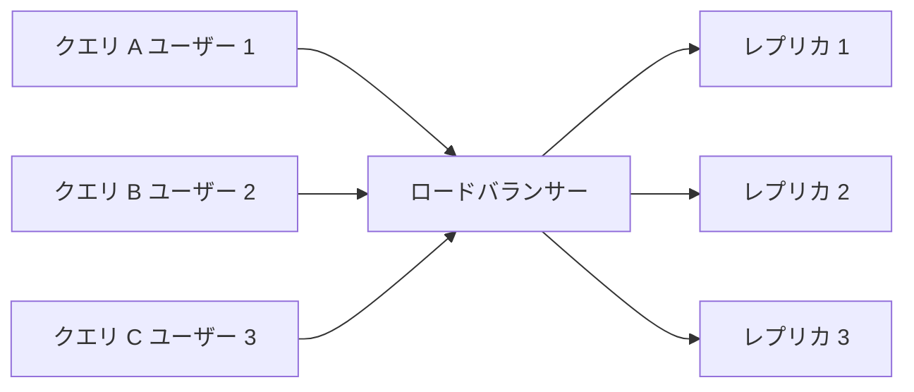
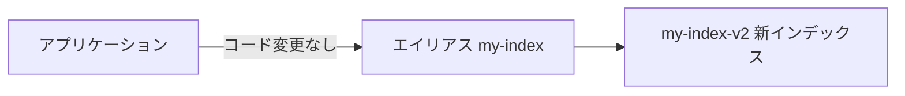

# Week 7 — スケーリング・運用・高度な機能

> **Phase 2b** | 学習プラン Week 7 / 8  
> 学習目標：サービスのサイジング・スケーリング判断ができる。監視・運用の実践知識を持つ。未習得の機能を把握する

---

## 1. 価格ティア選定

### ティア一覧

| ティア | 最大インデックス数 | パーティションあたりストレージ | 主な用途 |
|---|---|---|---|
| Free | 3 | 50 MB | 学習・検証のみ。SLA なし |
| Basic | 15 | 2 GB | 小規模本番。パーティション増設不可（常に 1） |
| Standard S1 | 50 | 25 GB | 汎用本番向け |
| Standard S2 | 200 | 100 GB | 大規模インデックス |
| Standard S3 | 200 | 200 GB | 超大規模 |
| Storage Optimized L1 | 10 | 1 TB | 大容量優先（QPS は S より低下） |
| Storage Optimized L2 | 10 | 2 TB | さらに大容量 |

> **ティアはダウングレード不可。** 変更するにはサービスを再作成して全データを移行する必要がある。初期選定が重要。

### ティア選定の判断フロー

```
Q1: 本番環境か？
  No → Free
  Yes → Q2

Q2: 合計ストレージは何 GB か？
  〜2 GB    → Basic（パーティション追加不要な小規模なら）
  〜25 GB   → S1
  〜100 GB  → S2
  〜200 GB  → S3
  1 TB 超   → L1/L2

Q3: ストレージより QPS（秒間クエリ数）が重要か？
  Yes → S 系（S1〜S3）
  No（大容量優先）→ L 系（L1/L2）
```

---

## 2. レプリカとパーティション

### それぞれの役割

**レプリカ** = インデックスの複製。クエリを並列処理するためのコピー。



レプリカを増やすと：
- QPS（秒間クエリ数）が上がる
- 1 台が障害になっても他が処理を続ける（可用性↑）
- SLA の条件を満たす

**パーティション** = インデックスデータの分割。ストレージ容量と書き込みスループットが増える。

```
パーティション 1 のみ：
  [文書 1〜1,000,000 を格納]

パーティション 3 に増設：
  パーティション 1: 文書 1〜333,333
  パーティション 2: 文書 333,334〜666,666
  パーティション 3: 文書 666,667〜1,000,000
```

### SLA の条件

| 構成 | SLA |
|---|---|
| レプリカ 1（デフォルト） | SLA なし |
| レプリカ 2 以上 | 99.9%（読み取り） |
| レプリカ 3 以上 | 99.9%（読み取り・書き込み） |

> Basic ティアはパーティションが常に 1 のみ（増設不可）。ストレージが 2 GB を超えそうなら最初から S1 以上を選ぶ。

### Search Unit（SU）と課金

```
SU = レプリカ数 × パーティション数

例：
  レプリカ 3、パーティション 2 → SU = 6
  レプリカ 1、パーティション 1 → SU = 1

課金は SU 単位。SU が多いほど月額が増える。
```

### スケーリング戦略

```
問題：レイテンシは OK だが QPS が足りない → レプリカを追加
問題：ストレージが足りない              → パーティションを追加
問題：両方足りない                      → 両方追加
問題：ティアごとの上限に達した          → ティアを上げる（サービス再作成が必要）
```

### 📖 レプリカのメリットは「並列処理」ではなく「同時受け付け」

よくある誤解：「複数のレプリカが同じクエリを並列で処理して速くなる」
→ 正確には異なる。**1 つのクエリは必ず 1 つのレプリカだけに送られる。**

レプリカが増えることで得られるメリットは「同時に来た**別々のクエリ**をそれぞれ別のレプリカで処理できる」こと。

**スーパーのレジで考える：**

```
レジ 1 台（レプリカ 1）：
  客 A が会計中 → 客 B は「待ちます」 → 客 C は「さらに待ちます」

レジ 3 台（レプリカ 3）：
  客 A → レジ 1 で会計中
  客 B → レジ 2 で会計中（A を待たない）
  客 C → レジ 3 で会計中（A も B も待たない）
```

**クエリに置き換えると：**



クエリ A・B・C は**それぞれ別のレプリカに振り分けられて同時に処理**される。レプリカが 1 台しかない場合、同時に 100 クエリが来たら 99 クエリが順番待ちになる。これが QPS（秒間クエリ数）の上限につながる。

### 📖 パーティションが増えると 1 クエリはどうなるか

パーティション 3 の構成でクエリ A がレプリカ 1 に振り分けられたとき、レプリカ 1 の内部では次のことが起きる。

```
レプリカ 1 の内部：
  パーティション 1（文書 1〜30）    ──┐
  パーティション 2（文書 31〜60）   ──┼── 並列で検索 → 結果をマージして返す
  パーティション 3（文書 61〜90）   ──┘
```

パーティションが増えることで得られるメリット：

- **ストレージ容量が増える**（パーティションあたりストレージ × 個数）
- **1 クエリ内の検索が並列化される**（各パーティションを同時に探索して合算）
- **インデクサーの書き込みスループットが上がる**（並列書き込み）

「1 クエリを速くする効果」は主にパーティションの役割。「同時クエリ数を増やす効果」は主にレプリカの役割。

### 📖 3 レプリカ × 3 パーティションの全体像

「文書 1〜30 のパーティション」はレプリカ 1・2・3 すべてに存在する。

```
レプリカ 1 ──[ P1: 文書1-30 | P2: 文書31-60 | P3: 文書61-90 ]
レプリカ 2 ──[ P1: 文書1-30 | P2: 文書31-60 | P3: 文書61-90 ]
レプリカ 3 ──[ P1: 文書1-30 | P2: 文書31-60 | P3: 文書61-90 ]
```

この構成が解決するもの：

| 問題 | 解決する仕組み |
|---|---|
| 同時に 3 クエリが来た | 3 つのレプリカが 1 クエリずつ担当 |
| 文書が 90 件あって 1 パーティションでは遅い | 3 パーティションが並列で 30 件ずつ検索 |
| レプリカ 1 がサーバー障害で落ちた | レプリカ 2・3 が引き続き処理（SLA の根拠） |
| 90 件がさらに増えてストレージが足りない | パーティションを追加してストレージを増やす |

**一言まとめ：**

```
レプリカを増やす = レジを増やす（同時に並べる客の列を減らす）
パーティションを増やす = 倉庫を広げる & 棚探しを分担する
```

---

## 3. インデックスのライフサイクル管理

### スキーマ変更の制約

インデックスは一度作ると変更に制約がある。

```
できること（再構築不要）：
  ✓ 新しいフィールドを追加する
  ✓ スコアリングプロファイルを追加・変更する
  ✓ セマンティック設定を追加・変更する

できないこと（再構築が必要）：
  ✗ 既存フィールドの型を変える（String → Int32 など）
  ✗ 既存フィールドの属性を変える（searchable を後から追加/削除）
  ✗ フィールドを削除する
  ✗ キーフィールドを変える
```

再構築が必要な場合は「新しいインデックスを作って全データを再インデックス」が唯一の方法。

### エイリアスを使ったゼロダウンタイム移行

エイリアス = インデックスの「仮想名」。アプリはエイリアス名で接続し、実際に向き先のインデックスを切り替える。



**手順：**

```
① 現在の状態
     アプリ → エイリアス「my-index」→ my-index-v1（稼働中）

② 新インデックスをバックグラウンドで構築
     my-index-v2 を作成・データ投入（アプリへの影響なし）

③ エイリアスの向き先を切り替える（一瞬で完了）
     エイリアス「my-index」→ my-index-v2 に変更

④ アプリコードの変更は不要。ダウンタイムもなし
```

```python
from azure.search.documents.indexes import SearchIndexClient

index_client = SearchIndexClient(
    endpoint="https://<your-service>.search.windows.net",
    credential=credential
)

# エイリアスの向き先を切り替え
from azure.search.documents.indexes.models import SearchAlias

alias = SearchAlias(name="my-index", indexes=["my-index-v2"])
index_client.create_or_update_alias(alias)
```

---

## 4. 監視・診断

### Log Analytics への診断ログ送信

Azure Portal → AI Search → 診断設定 → Log Analytics ワークスペースに送信を設定する。

主なログカテゴリ：

| カテゴリ | 内容 |
|---|---|
| `OperationLogs` | インデクサーの実行結果・エラー |
| `QueryLogs` | クエリごとの実行時間・スキャン件数 |

### 重要メトリクス

| メトリクス名 | 意味 | 対処 |
|---|---|---|
| `ThrottledSearchQueriesPercentage` | スロットリングされたクエリの割合 | 0% 超 → レプリカ追加 |
| `SearchQueriesPerSecond` | 現在の QPS | ピーク時の容量計画に使う |
| `DocumentsProcessedCount` | インデクサーの処理件数 | 想定より少ない → エラーログを確認 |
| `SearchLatency` | クエリのレイテンシ（ミリ秒） | 急増 → スロットリングまたは複雑なクエリ |

### KQL クエリ例（Log Analytics）

```kql
// クエリの平均レイテンシを 5 分ごとに集計してグラフ表示
AzureDiagnostics
| where Category == "QueryLogs"
| summarize avg(DurationMS) by bin(TimeGenerated, 5m)
| render timechart
```

```kql
// 直近 1 時間のエラーを一覧表示
AzureDiagnostics
| where Category == "OperationLogs"
| where ResultType == "Failed"
| where TimeGenerated > ago(1h)
| project TimeGenerated, OperationName, ResultDescription
```

### スロットリング（HTTP 503）への対処

AI Search はリクエストが多すぎると HTTP 503 を返す（スロットリング）。アプリ側でリトライが必須。

```python
import time

def search_with_retry(search_client, query, max_retries=3):
    for attempt in range(max_retries):
        try:
            return list(search_client.search(query))
        except Exception as e:
            if "503" in str(e) and attempt < max_retries - 1:
                wait = 2 ** attempt          # 1秒 → 2秒 → 4秒（指数バックオフ）
                time.sleep(wait)
            else:
                raise
```

> 根本対処はレプリカ追加。`ThrottledSearchQueriesPercentage` が継続的に 0% 超なら増設を検討する。

### 📖 スロットリングとは何か、AI Search で何が起きているのか

**スロットリングとは（一般概念）：**

サービスへのリクエスト数が処理できる上限を超えたとき、一部のリクエストを意図的に拒否する仕組み。目的は「サービス全体がダウンしないようにする安全弁」。過負荷の状態でも全員に少しずつ応答するより、上限を超えた分はきっぱり拒否して既存の処理を守る。

**Azure AI Search で具体的に何が起きているか：**

各レプリカは同時に処理できるクエリ数に上限がある。全レプリカが処理中のときに新しいクエリが来ると、AI Search は **HTTP 503（Service Unavailable）** を返してそのクエリを拒否する。

```
通常の状態：
  クエリ A 到着 → レプリカ 1 が空いている → すぐ処理される

スロットリング発生の状態：
  クエリ A 処理中（レプリカ 1）
  クエリ B 処理中（レプリカ 2）
  クエリ C 処理中（レプリカ 3）
  クエリ D 到着 → 全レプリカが塞がっている → HTTP 503 で拒否される
                  ↑ このクエリは処理されない。アプリ側でリトライが必要
```

**アプリ側が指数バックオフでリトライする理由：**

503 を受け取った直後に即リトライすると、他のクエリもまだ処理中のため再び 503 が返る可能性が高い。少し待ってからリトライすることで、レプリカが空くまでの時間を確保できる。

```
1回目失敗 → 1秒待つ → リトライ
2回目失敗 → 2秒待つ → リトライ
3回目失敗 → 4秒待つ → リトライ（指数バックオフ）
```

**根本解決：**

スロットリングが常態化している場合、レプリカを追加して「同時に処理できるクエリ数の上限」を引き上げる。`ThrottledSearchQueriesPercentage` が継続的に 0% 超えているのはレプリカ不足のサイン。

---

## 5. その他の機能

### ファセット（Facet）

フィールド値ごとの件数を集計する機能。EC サイトの「カテゴリ別 件数」のような絞り込み UI に使う。

```python
results = search_client.search(
    search_text="ホテル",
    facets=["Category,count:5", "Rating,interval:1"]
)

# ファセット結果を取り出す
for facet_name, facet_values in results.get_facets().items():
    print(f"{facet_name}:")
    for fv in facet_values:
        print(f"  {fv['value']}: {fv['count']} 件")

# 出力例：
# Category:
#   リゾート: 23 件
#   ビジネス: 41 件
#   格安: 18 件
# Rating:
#   4〜5: 30 件
#   3〜4: 28 件
```

### 📖 ファセットのパラメーターと出力結果の詳細

`facets=["Category,count:5", "Rating,interval:1"]` の読み方：

| パラメーター | 意味 |
|---|---|
| `Category,count:5` | Category フィールドの値ごとに文書数を集計し、**多い順に最大 5 種類**を返す |
| `Rating,interval:1` | Rating フィールド（数値）を **1 刻みの区間（バケット）** でグループ化して集計する |

**実際に返ってくる JSON の構造：**

```json
{
  "@search.facets": {
    "Category": [
      {"value": "ビジネス",   "count": 41},
      {"value": "リゾート",   "count": 23},
      {"value": "格安",       "count": 18},
      {"value": "高級",       "count": 12},
      {"value": "長期滞在",   "count":  7}
    ],
    "Rating": [
      {"from": 1.0, "to": 2.0, "count":  3},
      {"from": 2.0, "to": 3.0, "count":  8},
      {"from": 3.0, "to": 4.0, "count": 28},
      {"from": 4.0, "to": 5.0, "count": 30}
    ]
  }
}
```

**ポイント：**

- `Category` の `count:5` は「最大 5 種類まで」という上限。実際のカテゴリが 10 種類あっても件数が多い上位 5 種類しか返らない。上限を外したい場合は `count:0` を指定する。
- `Rating` の `interval:1` は「1 単位ごとの区間」。`interval:0.5` にすれば 0〜0.5、0.5〜1.0 … という細かい区間になる。
- ファセットは「現在の検索条件にマッチした文書の中での集計」。`search=ビジネス` で検索した場合、ビジネスホテルの文書の中でカテゴリが集計される。

**UI での活用例：**

```
ユーザーが「ホテル」で検索した結果画面の左サイドバー：

  カテゴリで絞り込む
  ☐ ビジネス（41）
  ☐ リゾート（23）
  ☐ 格安（18）
  ☐ 高級（12）
  ☐ 長期滞在（7）

  評価で絞り込む
  ☐ 4〜5 点（30）
  ☐ 3〜4 点（28）
  ☐ 2〜3 点（8）
  ☐ 1〜2 点（3）
```

ユーザーが「ビジネス」にチェックを入れたら、`$filter=Category eq 'ビジネス'` を追加して再クエリする。

### ハイライト

検索語に一致した箇所を `<em>` タグで囲んで返す機能。検索結果 UI での強調表示に使う。

```python
results = search_client.search(
    search_text="格安ホテル",
    highlight_fields="Description",
    highlight_pre_tag="<strong>",
    highlight_post_tag="</strong>"
)

for r in results:
    if r.get("@search.highlights"):
        print(r["@search.highlights"]["Description"])
        # 出力例：["...東京の<strong>格安ホテル</strong>の中でも..."]
```

### 地理空間検索

`Edm.GeographyPoint` 型フィールドに緯度経度を格納して距離ベースの検索・フィルターができる。

```python
# 東京駅から 5 km 以内のホテルを検索
results = search_client.search(
    search_text="ホテル",
    filter="geo.distance(Location, geography'POINT(139.767 35.681)') le 5"
)

# 距離順に並べ替え
results = search_client.search(
    search_text="ホテル",
    order_by=["geo.distance(Location, geography'POINT(139.767 35.681)')"]
)
```

### 📖 地理空間検索で何が起きているのか・どんな結果が出るのか

**全体の流れ：**

```
① インデックス作成時：
     各文書の Location フィールドに緯度経度を保存する

② クエリ実行時：
     「基準点（例：東京駅）」との距離を各文書について計算する

③ 結果：
     距離条件でフィルター（5km 以内）または距離順にソートして返す
```

**インデックス内の文書（イメージ）：**

```json
{"HotelName": "有楽町ホテル",   "Location": {"type": "Point", "coordinates": [139.762, 35.675]}}
{"HotelName": "銀座プレミアム", "Location": {"type": "Point", "coordinates": [139.769, 35.671]}}
{"HotelName": "川崎ビジネス",   "Location": {"type": "Point", "coordinates": [139.702, 35.532]}}
```

> **注意：coordinates は [経度, 緯度] の順**（一般的な「緯度・経度」の順と逆なので注意）

**`geo.distance()` が何を計算しているか：**

`geo.distance(Location, geography'POINT(139.767 35.681)')` は、各文書の Location と指定した点（東京駅）との間の距離を **km 単位**で返す内部関数。

```
有楽町ホテル   → 東京駅まで約 0.5 km  → le 5 を満たす → 結果に含まれる
銀座プレミアム → 東京駅まで約 0.9 km  → le 5 を満たす → 結果に含まれる
川崎ビジネス   → 東京駅まで約 17 km   → le 5 を満たさない → 除外される
```

**フィルターで絞り込んだ場合の出力（5km 以内）：**

```json
[
  {
    "HotelName": "有楽町ホテル",
    "Location": {"type": "Point", "coordinates": [139.762, 35.675]}
  },
  {
    "HotelName": "銀座プレミアム",
    "Location": {"type": "Point", "coordinates": [139.769, 35.671]}
  }
]
```

> 計算された距離の値（0.5 km など）は結果フィールドには含まれない。「◯◯ km」と UI に表示したい場合は、返ってきた coordinates を使ってクライアント側で計算する。

**距離順ソートの場合（order_by）：**

`order_by=["geo.distance(Location, geography'POINT(139.767 35.681)')"]` を指定すると、全文書が東京駅からの距離が近い順に並んで返る。フィルターと組み合わせることも多い。

**`geo.distance` と `geo.intersects` の使い分け：**

| 関数 | 形状 | 使いどころ |
|---|---|---|
| `geo.distance(field, point) le N` | 円形（中心点から半径 N km） | 「◯◯ から N km 以内」 |
| `geo.intersects(field, polygon)` | 任意の多角形 | 「この配達エリア内」「この行政区内」 |

### スペルチェック

クエリのスペルミスを自動修正する機能。英語のみ対応。Basic 以上で使用可能。

```python
results = search_client.search(
    search_text="hoteel tokyo",      # "hoteel" はスペルミス
    speller="lexicon",
    query_language="en-us"
)
# "hotel tokyo" として検索される
```

### ベクター量子化

ベクターデータをより小さいサイズで保存する技術。ストレージと検索速度を改善できる。

```
通常の float32 ベクター（1536 次元）：
  1536 × 4 bytes = 6,144 bytes / 文書

スカラー量子化（int8 に圧縮）：
  1536 × 1 byte = 1,536 bytes / 文書 → 75% 削減

トレードオフ：
  ✓ ストレージ削減・検索高速化
  ✗ わずかに精度（リコール）が低下
```

```python
from azure.search.documents.indexes.models import (
    HnswAlgorithmConfiguration,
    ScalarQuantizationCompression,
    VectorSearchCompression
)

# HNSW にスカラー量子化を設定
algorithms = [HnswAlgorithmConfiguration(name="hnsw-config")]
compressions = [ScalarQuantizationCompression(compression_name="scalar-compression")]
```

### デバッグセッション

Azure Portal でスキルセットの問題を 1 文書ずつステップ実行して確認できる機能。

```
使う場面：
  - インデクサーを実行してもエンリッチメントツリーに期待した値が入らない
  - カスタムスキルが正しく動いているか確認したい
  - スキルの入出力パス（/document/xxx）が間違っていないか調べたい

操作：
  Azure Portal → AI Search → デバッグセッション → インデクサーを選択 → 1 文書を選択
  → 各スキルの入力・出力・エラーをステップごとに確認できる
```

---

## 重要な用語まとめ

| 用語 | 一言説明 |
|---|---|
| ティア | AI Search サービスの性能・容量グレード。ダウングレード不可 |
| レプリカ | インデックスのコピー。QPS・可用性を上げる |
| パーティション | インデックスの分割。ストレージ容量・書き込みスループットを上げる |
| SU（Search Unit） | レプリカ数 × パーティション数。課金の単位 |
| SLA | サービスレベル協定。レプリカ 2 以上で 99.9% |
| スロットリング | リクエスト過多で HTTP 503 を返す仕組み。レプリカ追加で対処 |
| エイリアス | インデックスの仮想名。向き先を変えるだけでゼロダウンタイム移行ができる |
| ファセット | フィールド値ごとの件数を集計する機能 |
| ハイライト | 検索語に一致した箇所を HTML タグで囲んで返す機能 |
| 地理空間検索 | 緯度経度フィールドで距離フィルター・距離順ソートができる機能 |
| ベクター量子化 | float32 ベクターを int8 などに圧縮してストレージを削減する技術 |
| デバッグセッション | スキルセットの処理を 1 文書ずつ確認できるポータル機能 |

---

## ハンズオン チェックリスト

- [ ] Azure 料金計算ツールで「50 GB インデックス・ピーク 50 QPS・99.9% SLA」の要件を満たす最小構成と月額を見積もる
- [ ] 診断ログを Log Analytics に有効化し、KQL でクエリレイテンシのグラフを表示する
- [ ] ファセットを使ってカテゴリ別の件数を取得し、結果を表示するコードを書く
- [ ] エイリアスを使ってインデックスの向き先を切り替えるゼロダウンタイム移行を実際に行う
- [ ] デバッグセッションでスキルセットの各スキルの入出力を確認する

---

## 自己チェック

1. **`ThrottledSearchQueriesPercentage` が 15% のとき、何をするか？**
   - キーワード：レプリカ追加・QPS 不足・パーティションでは解決しない

2. **S1 × 3 レプリカ × 2 パーティションの SU 数は？SLA は何 %？**
   - キーワード：SU = 3×2 = 6・99.9%（レプリカ 3 以上）

3. **既存のフィールドを `filterable: false → true` に変更したい。どうすればよいか？**
   - キーワード：属性変更は再構築が必要・新インデックス作成 → エイリアス切り替え

4. **エイリアスを使ったゼロダウンタイム移行の手順を口頭で説明できるか？**
   - キーワード：新インデックス構築 → エイリアス切り替え → アプリコード変更なし

5. **ベクター量子化を有効化するトレードオフは何か？**
   - キーワード：ストレージ削減・検索速度向上・リコール精度がわずかに低下

6. **Storage Optimized（L1/L2）を S3 より選ぶのはどんな場合か？**
   - キーワード：ストレージが 200 GB 超・QPS よりも容量を優先する場合

---

## 次週の予告（Week 8）

最終週は Bicep + Python でエンドツーエンドの実装：

- **Bicep で本番グレードの環境をプロビジョニング**：AI Search + Storage + ロール割り当て
- **Python でインデックス作成 → インデクサー実行 → RAG クエリ**まで一気通貫で実装
- **Week 1 のデータフロー図を最終版に更新**：学習前と学習後の理解の差を確認
