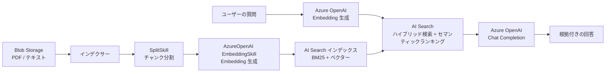

# Week 8 — Bicep + Python エンドツーエンド実装

> **最終フェーズ** | 学習プラン Week 8 / 8  
> 学習目標：Bicep で本番グレードの環境をプロビジョニングし、Python でインデックス作成・インデクサー実行・RAG クエリを一気通貫で実装する

---

## 0. 全体の作業フロー

```
① Bicep でインフラを作る
     AI Search + Blob Storage + ロール割り当て

② Python でインデックスを作る（setup_index.py）
     フィールド定義・ベクター設定・セマンティック設定

③ Python でインデクサーを動かす（run_indexer.py）
     データソース + スキルセット + インデクサーを作って実行

④ Python で RAG クエリを実行する（rag_query.py）
     質問 → Embedding → ハイブリッド検索 → GPT-4 → 回答

⑤ 最終自己評価
     Week 1 のデータフロー図を更新して理解の深化を確認
```

**実行時の認証：** すべて `DefaultAzureCredential` を使う。ローカル開発は `az login`、Azure 上では Managed Identity が自動で使われる。

---

## 1. ディレクトリ構造

```
ai-search/
  infra/
    main.bicep           # AI Search + Storage + ロール割り当て
    main.bicepparam      # パラメーターファイル
  code/
    setup_index.py       # インデックススキーマ作成
    run_indexer.py       # データソース + スキルセット + インデクサー作成・実行
    rag_query.py         # RAG クエリ関数
    requirements.txt     # Python パッケージ一覧
    sample_docs/         # テスト用の txt または pdf ファイルを置く
  notes/
    week1.md 〜 week8.md
```

---

## 2. Bicep によるインフラプロビジョニング

### `infra/main.bicep`

```bicep
param location string = resourceGroup().location
param searchServiceName string
param storageAccountName string
param searchSku string = 'basic'

// ── AI Search サービス ─────────────────────────────────────
resource searchService 'Microsoft.Search/searchServices@2023-11-01' = {
  name: searchServiceName
  location: location
  identity: {
    type: 'SystemAssigned'        // Managed Identity を有効化
  }
  sku: {
    name: searchSku
  }
  properties: {
    replicaCount: 1
    partitionCount: 1
    publicNetworkAccess: 'Enabled'
    authOptions: {
      aadOrApiKey: {
        aadAuthFailureMode: 'http403'   // RBAC 失敗時は 403 を返す
      }
    }
  }
}

// ── Blob Storage ────────────────────────────────────────────
resource storageAccount 'Microsoft.Storage/storageAccounts@2023-01-01' = {
  name: storageAccountName
  location: location
  kind: 'StorageV2'
  sku: {
    name: 'Standard_LRS'
  }
  properties: {
    allowBlobPublicAccess: false    // パブリックアクセスは閉じる
  }
}

// ドキュメントを入れるコンテナ
resource blobContainer 'Microsoft.Storage/storageAccounts/blobServices/containers@2023-01-01' = {
  name: '${storageAccount.name}/default/documents'
  properties: {
    publicAccess: 'None'
  }
}

// ── ロール割り当て ──────────────────────────────────────────
// AI Search の Managed Identity に Storage Blob Data Reader を付与
// これで AI Search が Blob からデータを読める
resource roleAssignmentSearchToStorage 'Microsoft.Authorization/roleAssignments@2022-04-01' = {
  scope: storageAccount
  name: guid(storageAccount.id, searchService.id, 'StorageBlobDataReader')
  properties: {
    roleDefinitionId: subscriptionResourceId(
      'Microsoft.Authorization/roleDefinitions',
      '2a2b9908-6ea1-4ae2-8e65-a410df84e7d1'   // Storage Blob Data Reader
    )
    principalId: searchService.identity.principalId
    principalType: 'ServicePrincipal'
  }
}

// ── 出力 ────────────────────────────────────────────────────
output searchEndpoint string = 'https://${searchService.name}.search.windows.net'
output storageAccountName string = storageAccount.name
```

### `infra/main.bicepparam`

```bicep
using 'main.bicep'

param searchServiceName  = 'srch-myapp-dev'
param storageAccountName = 'stmyappdev001'
param searchSku          = 'basic'
```

### デプロイコマンド

```bash
# リソースグループを作る
az group create --name rg-ai-search-dev --location japaneast

# Bicep をデプロイする
az deployment group create \
  --resource-group rg-ai-search-dev \
  --template-file infra/main.bicep \
  --parameters infra/main.bicepparam
```

---

## 3. Python パッケージ（`code/requirements.txt`）

```
azure-search-documents==11.6.0b12
azure-identity==1.17.1
openai==1.40.0
```

```bash
pip install -r code/requirements.txt
```

---

## 4. インデックス作成（`code/setup_index.py`）

```python
import os
from azure.identity import DefaultAzureCredential
from azure.search.documents.indexes import SearchIndexClient
from azure.search.documents.indexes.models import (
    SearchIndex,
    SimpleField,
    SearchableField,
    SearchField,
    SearchFieldDataType,
    VectorSearch,
    HnswAlgorithmConfiguration,
    VectorSearchProfile,
    SemanticConfiguration,
    SemanticSearch,
    SemanticPrioritizedFields,
    SemanticField,
)

# ── 設定値（環境変数から取得） ────────────────────────────────
SEARCH_ENDPOINT = os.environ["AZURE_SEARCH_ENDPOINT"]   # 例: https://srch-myapp-dev.search.windows.net
INDEX_NAME      = "documents-index"

credential   = DefaultAzureCredential()
index_client = SearchIndexClient(endpoint=SEARCH_ENDPOINT, credential=credential)

# ── フィールド定義 ────────────────────────────────────────────
fields = [
    SimpleField(
        name="id",
        type=SearchFieldDataType.String,
        key=True,           # 一意キー
        filterable=True,
    ),
    SearchableField(
        name="content",
        type=SearchFieldDataType.String,
        analyzer_name="ja.microsoft",   # 日本語アナライザー
    ),
    SearchField(
        name="content_vector",
        type=SearchFieldDataType.Collection(SearchFieldDataType.Single),
        searchable=True,
        vector_search_dimensions=1536,                      # text-embedding-ada-002 の次元数
        vector_search_profile_name="hnsw-profile",
    ),
    SimpleField(name="source_file", type=SearchFieldDataType.String, filterable=True, retrievable=True),
    SimpleField(name="chunk_id",    type=SearchFieldDataType.String, filterable=True, retrievable=True),
]

# ── ベクター検索の設定 ────────────────────────────────────────
vector_search = VectorSearch(
    algorithms=[
        HnswAlgorithmConfiguration(
            name="hnsw-config",
            parameters={"m": 4, "efConstruction": 400, "efSearch": 500, "metric": "cosine"},
        )
    ],
    profiles=[
        VectorSearchProfile(name="hnsw-profile", algorithm_configuration_name="hnsw-config")
    ],
)

# ── セマンティックランキングの設定 ────────────────────────────
semantic_search = SemanticSearch(
    configurations=[
        SemanticConfiguration(
            name="my-semantic-config",
            prioritized_fields=SemanticPrioritizedFields(
                content_fields=[SemanticField(field_name="content")]
            ),
        )
    ]
)

# ── インデックスを作成（すでに存在する場合は更新） ────────────
index = SearchIndex(
    name=INDEX_NAME,
    fields=fields,
    vector_search=vector_search,
    semantic_search=semantic_search,
)

result = index_client.create_or_update_index(index)
print(f"インデックス '{result.name}' を作成しました")
```

---

## 5. インデクサー設定・実行（`code/run_indexer.py`）

```python
import os
import time
from azure.identity import DefaultAzureCredential
from azure.search.documents.indexes import SearchIndexerClient
from azure.search.documents.indexes.models import (
    SearchIndexerDataSourceConnection,
    SearchIndexerDataContainer,
    SearchIndexer,
    SearchIndexerSkillset,
    SplitSkill,
    AzureOpenAIEmbeddingSkill,
    InputFieldMappingEntry,
    OutputFieldMappingEntry,
    FieldMapping,
    NativeBlobSoftDeleteDeletionDetectionPolicy,
)

# ── 設定値 ────────────────────────────────────────────────────
SEARCH_ENDPOINT      = os.environ["AZURE_SEARCH_ENDPOINT"]
STORAGE_ACCOUNT_NAME = os.environ["AZURE_STORAGE_ACCOUNT_NAME"]
OPENAI_ENDPOINT      = os.environ["AZURE_OPENAI_ENDPOINT"]   # 例: https://myoai.openai.azure.com
EMBEDDING_DEPLOYMENT = os.environ["AZURE_OPENAI_EMBEDDING_DEPLOYMENT"]   # 例: text-embedding-ada-002
INDEX_NAME           = "documents-index"
DATASOURCE_NAME      = "blob-datasource"
SKILLSET_NAME        = "my-skillset"
INDEXER_NAME         = "my-indexer"

credential       = DefaultAzureCredential()
indexer_client   = SearchIndexerClient(endpoint=SEARCH_ENDPOINT, credential=credential)

# ── データソース（Blob Storage を Managed Identity で接続）────
datasource = SearchIndexerDataSourceConnection(
    name=DATASOURCE_NAME,
    type="azureblob",
    # 接続文字列の代わりに resourceId で Managed Identity 認証
    connection_string=(
        f"ResourceId=/subscriptions/{{subscriptionId}}/resourceGroups/{{resourceGroup}}"
        f"/providers/Microsoft.Storage/storageAccounts/{STORAGE_ACCOUNT_NAME};"
    ),
    container=SearchIndexerDataContainer(name="documents"),
)
indexer_client.create_or_update_data_source_connection(datasource)
print("データソースを作成しました")

# ── スキルセット ──────────────────────────────────────────────
# スキル 1: テキストをチャンクに分割する
split_skill = SplitSkill(
    name="split-skill",
    description="文書をチャンクに分割",
    text_split_mode="pages",
    maximum_page_length=2000,
    page_overlap_length=200,
    context="/document",
    inputs=[InputFieldMappingEntry(name="text", source="/document/content")],
    outputs=[OutputFieldMappingEntry(name="textItems", target_name="chunks")],
)

# スキル 2: チャンクを Embedding ベクターに変換する
embedding_skill = AzureOpenAIEmbeddingSkill(
    name="embedding-skill",
    description="チャンクをベクター化",
    resource_uri=OPENAI_ENDPOINT,
    deployment_id=EMBEDDING_DEPLOYMENT,
    model_name=EMBEDDING_DEPLOYMENT,
    context="/document/chunks/*",
    inputs=[InputFieldMappingEntry(name="text", source="/document/chunks/*")],
    outputs=[OutputFieldMappingEntry(name="embedding", target_name="content_vector")],
)

skillset = SearchIndexerSkillset(
    name=SKILLSET_NAME,
    skills=[split_skill, embedding_skill],
)
indexer_client.create_or_update_skillset(skillset)
print("スキルセットを作成しました")

# ── インデクサー ──────────────────────────────────────────────
indexer = SearchIndexer(
    name=INDEXER_NAME,
    data_source_name=DATASOURCE_NAME,
    target_index_name=INDEX_NAME,
    skillset_name=SKILLSET_NAME,
    # エンリッチメントツリーからインデックスフィールドへのマッピング
    output_field_mappings=[
        FieldMapping(
            source_field_name="/document/chunks/*/content_vector",
            target_field_name="content_vector",
        ),
    ],
)
indexer_client.create_or_update_indexer(indexer)
print("インデクサーを作成しました。実行を開始します...")

# インデクサーを手動で実行
indexer_client.run_indexer(INDEXER_NAME)

# ── 完了をポーリングして待つ ──────────────────────────────────
while True:
    status = indexer_client.get_indexer_status(INDEXER_NAME)
    last_run = status.last_result

    if last_run is None:
        print("  実行待機中...")
        time.sleep(5)
        continue

    state = last_run.status
    print(f"  状態: {state} | 成功: {last_run.item_count} 件 | 失敗: {last_run.failed_item_count} 件")

    if state in ("success", "transientFailure", "persistentFailure"):
        break

    time.sleep(10)

if last_run.failed_item_count > 0:
    print("⚠ 一部の文書でエラーが発生しました。Azure Portal のデバッグセッションで確認してください。")
else:
    print("✓ インデクサーの実行が完了しました")
```

---

## 6. RAG クエリ（`code/rag_query.py`）

```python
import os
from azure.identity import DefaultAzureCredential, get_bearer_token_provider
from azure.search.documents import SearchClient
from azure.search.documents.models import VectorizedQuery
from openai import AzureOpenAI

# ── 設定値 ────────────────────────────────────────────────────
SEARCH_ENDPOINT      = os.environ["AZURE_SEARCH_ENDPOINT"]
OPENAI_ENDPOINT      = os.environ["AZURE_OPENAI_ENDPOINT"]
EMBEDDING_DEPLOYMENT = os.environ["AZURE_OPENAI_EMBEDDING_DEPLOYMENT"]
CHAT_DEPLOYMENT      = os.environ["AZURE_OPENAI_CHAT_DEPLOYMENT"]   # 例: gpt-4o
INDEX_NAME           = "documents-index"

credential = DefaultAzureCredential()

# Azure OpenAI は token provider 経由で Managed Identity 認証
token_provider = get_bearer_token_provider(credential, "https://cognitiveservices.azure.com/.default")

search_client = SearchClient(
    endpoint=SEARCH_ENDPOINT,
    index_name=INDEX_NAME,
    credential=credential,
)

openai_client = AzureOpenAI(
    azure_endpoint=OPENAI_ENDPOINT,
    azure_ad_token_provider=token_provider,
    api_version="2024-05-01-preview",
)


def rag_query(question: str, top_k: int = 5) -> str:
    # ── Step 1: 質問を Embedding ベクターに変換 ───────────────
    embed_response = openai_client.embeddings.create(
        input=question,
        model=EMBEDDING_DEPLOYMENT,
    )
    query_vector = embed_response.data[0].embedding

    # ── Step 2: ハイブリッド検索 + セマンティックランキング ───
    vector_query = VectorizedQuery(
        vector=query_vector,
        k_nearest_neighbors=top_k,
        fields="content_vector",
    )

    search_results = list(search_client.search(
        search_text=question,           # BM25 用のテキストクエリ
        vector_queries=[vector_query],  # ベクタークエリ（RRF で統合）
        query_type="semantic",
        semantic_configuration_name="my-semantic-config",
        top=top_k,
        select=["content", "source_file"],
    ))

    # ── Step 3: 検索結果をプロンプトに組み込む ───────────────
    context_blocks = []
    for i, r in enumerate(search_results, 1):
        source = r.get("source_file", "不明")
        context_blocks.append(f"[{i}] （出典: {source}）\n{r['content']}")

    context = "\n\n".join(context_blocks)

    system_prompt = (
        "あなたは社内文書を参照して回答するアシスタントです。\n"
        "以下の【参考文書】の内容のみを根拠として回答してください。\n"
        "参考文書に書かれていないことは「文書に記載がありません」と答えてください。\n\n"
        f"【参考文書】\n{context}"
    )

    # ── Step 4: GPT-4 で回答を生成 ───────────────────────────
    chat_response = openai_client.chat.completions.create(
        model=CHAT_DEPLOYMENT,
        messages=[
            {"role": "system", "content": system_prompt},
            {"role": "user",   "content": question},
        ],
        temperature=0,      # 0 にすることで再現性を高め、ハルシネーションを抑える
    )

    answer = chat_response.choices[0].message.content

    # ── 結果を表示 ───────────────────────────────────────────
    print(f"\n質問: {question}")
    print(f"\n回答:\n{answer}")
    print(f"\n参照した文書:")
    for r in search_results:
        score = r.get("@search.reranker_score") or r.get("@search.score", 0)
        print(f"  [{r.get('source_file', '不明')}] スコア: {score:.3f}")

    return answer


# ── 実行例 ───────────────────────────────────────────────────
if __name__ == "__main__":
    rag_query("社内の有給休暇申請の手続きを教えてください")
```

---

## 7. 実行手順（ステップバイステップ）

```bash
# 1. Azure にログイン（ローカル開発では必須）
az login

# 2. Bicep でインフラをデプロイ
az deployment group create \
  --resource-group rg-ai-search-dev \
  --template-file infra/main.bicep \
  --parameters infra/main.bicepparam

# 3. 環境変数をセット（デプロイ結果を使う）
export AZURE_SEARCH_ENDPOINT="https://srch-myapp-dev.search.windows.net"
export AZURE_STORAGE_ACCOUNT_NAME="stmyappdev001"
export AZURE_OPENAI_ENDPOINT="https://<your-oai>.openai.azure.com"
export AZURE_OPENAI_EMBEDDING_DEPLOYMENT="text-embedding-ada-002"
export AZURE_OPENAI_CHAT_DEPLOYMENT="gpt-4o"

# 4. テスト用文書を Blob にアップロード
az storage blob upload-batch \
  --account-name stmyappdev001 \
  --destination documents \
  --source code/sample_docs/ \
  --auth-mode login

# 5. インデックスを作成
python code/setup_index.py

# 6. インデクサーを実行（Blob からデータを取り込む）
python code/run_indexer.py

# 7. RAG クエリを実行
python code/rag_query.py
```

---

## 8. トラブルシューティング

| 症状 | 原因 | 対処 |
|---|---|---|
| `DefaultAzureCredential` が失敗する | `az login` 未実行 | `az login` を実行してから再試行 |
| インデクサーが `persistentFailure` | スキルセットの入出力パスが間違っている | Portal のデバッグセッションで確認 |
| 検索結果が空 | インデクサーが完了していない | `run_indexer.py` の完了ログを確認 |
| 403 エラー | RBAC のロール割り当てが不足 | Bicep の roleAssignment が適用されているか確認 |
| Embedding のモデルが見つからない | デプロイ名が間違っている | Azure OpenAI Studio でデプロイ名を確認 |

---

## 9. 最終自己評価

### Week 1 のデータフロー図を更新する

学習開始時（Week 1）に描いたデータフロー図を最終版に書き直す。  
正確でなくてよかった Week 1 の図と比べて、何が追加・修正されたかを確認する。

**最終版のデータフロー（完全版）：**



### 500 文字の説明（自己評価）

「Azure AI Search を知らない開発者」に向けて、以下の問いに答えられるか確認する。

```
Q1: Azure AI Search は何をするサービスか？なぜ SQL の LIKE 句では代替できないのか？

Q2: インデックス・インデクサー・データソース・スキルセットの関係を図なしで説明できるか？

Q3: ハイブリッド検索とは何か？なぜ BM25 単独やベクター単独より優れることが多いのか？

Q4: RAG システムで AI Search と Azure OpenAI はそれぞれ何を担当しているか？

Q5: 本番環境でセキュリティを確保するために何を設定するか（認証・ネットワーク）？
```

---

## 重要な用語まとめ（Week 8）

| 用語 | 一言説明 |
|---|---|
| `DefaultAzureCredential` | ローカルは az login、Azure 上は Managed Identity を自動で選ぶ認証クラス |
| System-assigned Managed Identity | Azure リソースに自動で付与される ID。シークレット不要 |
| Storage Blob Data Reader | Blob を読める RBAC ロール。AI Search に付与して認証なしで Blob にアクセスさせる |
| `SplitSkill` | 大きなテキストを指定サイズのチャンクに分割するスキル |
| `AzureOpenAIEmbeddingSkill` | インデックス時にチャンクを Embedding ベクターに変換するスキル |
| 出力フィールドマッピング | エンリッチメントツリーの値をインデックスフィールドに書き込む設定 |
| `temperature=0` | LLM の回答のランダム性をゼロに。同じ質問には同じ回答が返る（再現性） |

---

## 自己チェック

1. **Bicep で `searchService.identity.principalId` を参照できるのはなぜか？**
   - キーワード：System-assigned Managed Identity・リソース依存順序（roleAssignment が searchService の後に作られる）

2. **ローカルで `DefaultAzureCredential` が機能するために必要な準備は何か？**
   - キーワード：`az login`・ログインしたアカウントに AI Search の RBAC ロールが必要

3. **インデクサーが `failed_item_count > 0` のとき、詳細はどこで確認するか？**
   - キーワード：Azure Portal のデバッグセッション・`OperationLogs`（Log Analytics）

4. **`SplitSkill` を使う理由は何か？**
   - キーワード：LLM のコンテキスト長の上限・チャンクが小さいほど Embedding の精度が上がる

5. **`temperature=0` を Chat Completion に設定する理由は何か？**
   - キーワード：ハルシネーション抑制・再現性確保・RAG では創造性より正確性が重要

6. **Week 1 の図と今の図を比べて、最も理解が深まった部分はどこか？**
   - 自由記述。答えが出てくること自体が学習完了の証拠
