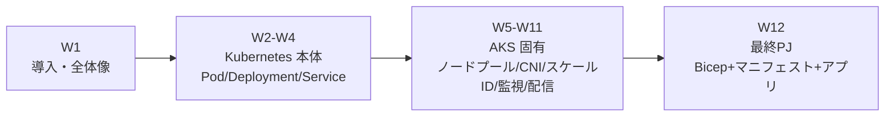
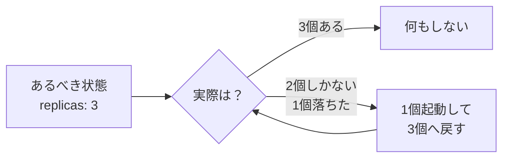
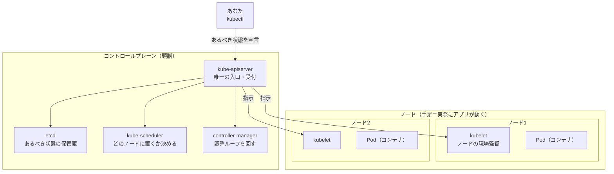
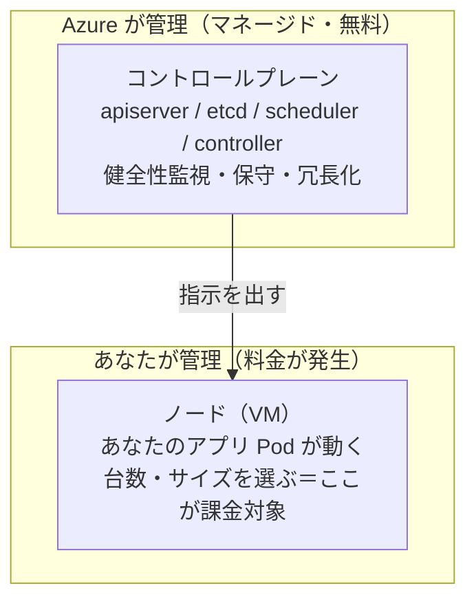
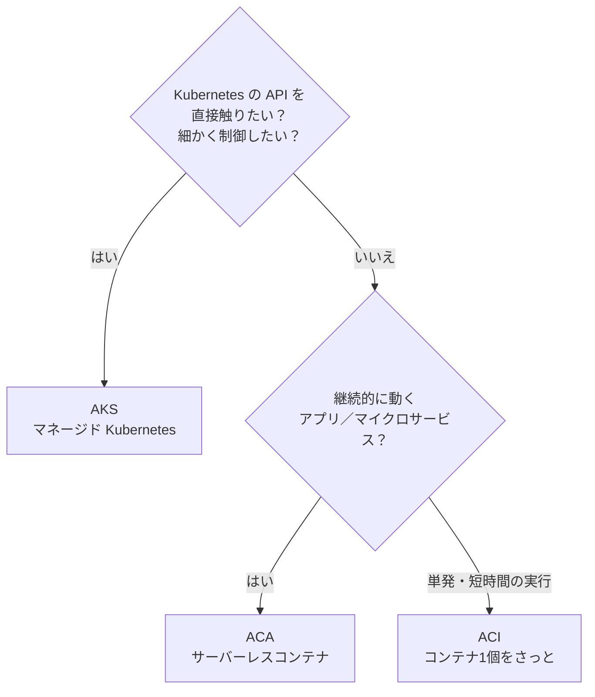

# AKS 学習ノート — 第1週：AKS とは何か（Kubernetes とマネージドの意味）

## 学習目標

この週を終えると、次を自分の言葉で説明できる状態を目指す。

- コンテナを本番で動かすときに何が困るのか（＝オーケストレーションが必要になる理由）を説明できる。
- Kubernetes（クバネティス、略称 K8s）が「宣言的（せんげんてき）」「自己修復（じこしゅうふく）」で何を自動化してくれるのかを説明できる。
- Kubernetes の全体構造＝**コントロールプレーン（頭脳）** と **ノード（手足）** の役割分担を図で描ける。
- AKS（Azure Kubernetes Service）の「マネージド（managed＝Azure が面倒を見る）」が具体的に**どこまで**を指すのか（コントロールプレーンは無料で Azure が管理・料金はノード分だけ）を説明できる。
- AKS / ACA（Azure Container Apps）/ ACI（Azure Container Instances）の線引きができ、「いつ AKS を選ぶか」を判断できる。
- 最初の AKS クラスターを作り、`kubectl`（キューブシーティーエル）で接続してノードが見えるところまで手を動かす。

---

## §0 この週の位置づけ

本教材は全12週で AKS を扱う。大きく3つのかたまりに分かれる。



AKS は「**Kubernetes 本体**」と「**Azure のマネージド層**」の2階建てである。この2つを混ぜて覚えると必ず混乱するので、本教材は **W2〜W4 でまず素の Kubernetes を身につけ**、そのあと W5 以降で「Azure がその Kubernetes をどう楽にしてくれるか」を積み上げる。W1 はその土台として、「そもそも何を解決する道具なのか」「マネージドとは何をマネージ（管理）してくれることなのか」を押さえる回である。

> **前提の確認**
> 本教材はコンテナ（Docker のイメージ／コンテナ）の基本は既知として進める。「イメージ＝アプリを固めた設計図」「コンテナ＝その設計図から起動した実行中のインスタンス」がピンとくれば十分である。ピンとこない場合は本文中の用語補足で都度フォローする。

---

## 1. なぜコンテナ1個では足りないのか（オーケストレーションの必要性）

コンテナを1個、手元で `docker run` して動かすのは簡単である。問題は**本番で、たくさん、止めずに**動かそうとした瞬間に噴き出す。

具体的に、次のような「誰かがやらないといけない仕事」が一気に発生する。

| 本番で起きること | 手作業だと何が大変か |
|---|---|
| コンテナが落ちた | 誰かが気づいて再起動しないと止まったまま |
| アクセスが増えた | コンテナを増やし、増えた分に負荷を振り分ける必要がある |
| 複数サーバーに配置したい | どのサーバーにどれを置くか（空き容量を見て）人間が決める |
| 新バージョンを出したい | 全部一斉に入れ替えると事故る。少しずつ入れ替えたい |
| 壊れたバージョンだった | すぐ前の版に戻したい（ロールバック） |
| コンテナ同士が通信したい | 相手の IP は起動のたびに変わる。名前で見つけたい |

これらを**人間が手で**やり続けるのは非現実的である。そこで「コンテナ群を、あるべき状態に保ち続ける**司令塔**」が欲しくなる。これが **コンテナオーケストレーション（container orchestration＝コンテナの編成・指揮）** であり、その事実上の標準が **Kubernetes** である。

> **用語補足：オーケストレーション（orchestration）**
> 語源はオーケストラの「指揮」。指揮者は自分で楽器を弾かない。奏者（＝コンテナ）に「今こう鳴らせ」と全体を合わせる。Kubernetes も自分がアプリになるのではなく、大量のコンテナを「あるべき音（状態）」に合わせ続ける指揮者である。

---

## 2. Kubernetes とは何か

Kubernetes 公式は次のように定義している。

> Kubernetes is a portable, extensible, open source platform for managing containerized workloads and services that facilitate both declarative configuration and automation.
> （コンテナ化されたワークロードとサービスを管理するための、可搬・拡張可能なオープンソース基盤。宣言的な構成と自動化の両方を支援する）
> — 出典：kubernetes.io / Overview

読み方と成り立ちを先に押さえておく。

> **用語補足：Kubernetes（クバネティス）／ K8s（ケーエイツ）**
> - Kubernetes はギリシャ語で「**helmsman or pilot（舵取り・操舵手）**」の意味。船の舵を取る人。コンテナ（＝海に浮かぶコンテナ船）の舵を取るイメージ。
> - **K8s** は、"K" と "s" の**間にある8文字**（ubernete）を数字の 8 で省略した略記。読みは「ケーエイツ」。
> - 2014 年に Google がオープンソース化。Google が15年以上、自社の本番を大規模運用してきた知見が下敷きになっている。
> - 出典：kubernetes.io / Overview

### 2.1 Kubernetes が自動でやってくれること

公式が挙げる代表的な機能は次のとおり。§1 の「本番で誰かがやらないといけない仕事」とほぼ一対一で対応している。

| Kubernetes の機能（英語） | 日本語 | §1 のどの困りごとを解くか |
|---|---|---|
| Self-healing | 自己修復 | 落ちたら勝手に再起動・置き換え |
| Horizontal scaling | 水平スケール | 負荷に応じてコンテナ数を増減 |
| Service discovery and load balancing | サービス発見と負荷分散 | 変わる IP を名前で解決し、負荷を振り分け |
| Automated rollouts and rollbacks | 自動ロールアウト／ロールバック | 少しずつ入れ替え・すぐ戻す |
| Automatic bin packing | 自動配置（詰め込み） | どのサーバーに置くかを空き資源から自動決定 |
| Storage orchestration | ストレージ編成 | 永続データ用のディスクを自動でつなぐ |
| Secret and configuration management | 機密・設定の管理 | パスワードや設定を安全に注入 |

> **用語補足：bin packing（ビンパッキング＝箱詰め）**
> 「どの箱（サーバー）にどの荷物（コンテナ）を、CPU・メモリの空きを見て一番効率よく詰めるか」という最適配置問題のこと。Kubernetes はこれを自動でやる。人間が「サーバー3号機がまだ空いてるからここに置こう」と考える作業を肩代わりする。

### 2.2 いちばん大事な2つの性質：宣言的と自己修復

Kubernetes の思想を一言でいうと「**あるべき状態（desired state）を宣言すれば、実際の状態（actual state）をそこへ寄せ続けてくれる**」である。

**宣言的（declarative）とは。**

> You can describe the desired state for your deployed containers using Kubernetes, and it can change the actual state to the desired state at a controlled rate.
> （あるべき状態を記述すれば、Kubernetes が実際の状態を、制御された速度でその状態へ変えていく）
> — 出典：kubernetes.io / Overview

対比で理解すると速い。

| | 命令的（imperative） | 宣言的（declarative） |
|---|---|---|
| 言い方 | 「コンテナを1個起動しろ」「もう1個起動しろ」…と**手順**を指示 | 「コンテナは常に3個であるべき」と**結果**を宣言 |
| 例 | `docker run` を3回叩く | `replicas: 3` と書いて渡す |
| 1個落ちたら | 人間が気づいて4回目を叩く | Kubernetes が勝手に3個へ戻す |
| たとえ | 料理の作り方を1手順ずつ命令 | 「常に皿には3個盛られている状態にして」と結果だけ頼む |

**自己修復（self-healing）とは。** 宣言した「あるべき状態」を Kubernetes が監視し続け、ズレたら勝手に直す。

> Kubernetes restarts containers that fail, replaces containers, kills containers that don't respond to your user-defined health check, and doesn't advertise them to clients until they are ready to serve.
> （失敗したコンテナを再起動し、置き換え、ヘルスチェックに応じないものは停止し、応答準備が整うまでクライアントには見せない）
> — 出典：kubernetes.io / Overview



この「宣言 → 監視 → ズレたら修正 → また監視」のループ（**制御ループ／reconciliation loop＝調整ループ**）こそ Kubernetes の心臓部である。W3 以降、Deployment・ReplicaSet を学ぶとき、この図が何度も出てくる。

> **初心者向け用語補足：reconciliation（リコンシリエーション＝調整・突き合わせ）**
> 帳簿の「照合（あるべき残高と実際の残高を突き合わせて合わせる）」と同じ語。Kubernetes は「あるべき YAML」と「今のクラスター」を絶えず突き合わせ、差があれば実際のほうを動かして合わせる。

---

## 3. Kubernetes の全体構造：コントロールプレーンとノード

Kubernetes クラスター（cluster＝群れ・集合）は、大きく2種類のマシン群でできている。



### 3.1 コントロールプレーン（control plane＝制御面＝頭脳）

クラスター全体を管理する頭脳。主要な部品（コンポーネント）は次のとおり。名前は W5 以降でも繰り返し出てくるので、役割だけ今つかんでおけばよい。

| 部品 | 読み | 役割（一言で） |
|---|---|---|
| kube-apiserver | エーピーアイサーバー | **唯一の入口**。すべての操作はここを通る。受付窓口 |
| etcd | エトセディー | クラスターの**あるべき状態を保管する台帳**（キーバリューDB） |
| kube-scheduler | スケジューラー | 新しい Pod を**どのノードに置くか**を決める（bin packing 担当） |
| kube-controller-manager | コントローラーマネージャー | §2.2 の**調整ループ**を回し続ける番人 |

> **用語補足：etcd（エトセディー）**
> クラスターの「現在の設定・状態のすべて」を保存する分散キーバリューストア。ここが壊れるとクラスターの記憶が飛ぶ。だからこそ**堅牢な運用が難しい**部品でもある。後述するが、AKS ではこの etcd を含むコントロールプレーンを **Azure が丸ごと預かってくれる**のが大きな価値になる。

### 3.2 ノード（node＝節点＝手足）

実際にアプリ（コンテナ）が動く**ワーカーマシン**（VM または物理サーバー）。各ノードには最低限これが乗る。

| 部品 | 読み | 役割 |
|---|---|---|
| kubelet | キューブレット | ノードの**現場監督**。apiserver の指示どおりに Pod を起動・監視し、状態を報告 |
| kube-proxy | キューブプロキシ | ノード上の**通信係**。Service 宛の通信を正しい Pod へ振り分ける（W4 で詳説） |
| コンテナランタイム | — | 実際にコンテナを動かすエンジン（containerd など） |

> **用語補足：Pod（ポッド）**
> Kubernetes が動かす**最小単位**。コンテナそのものではなく「1個以上のコンテナをまとめた入れ物」。多くの場合は中身1コンテナ。詳細は W2 で丸ごと扱う。今は「Kubernetes が配置・複製・監視する単位＝Pod」とだけ覚えればよい。

> **用語補足：node（ノード）**
> 「節点」の意。ネットワークやグラフで「点」を指す一般語。Kubernetes では「アプリが動く1台のワーカーマシン」を指す。AKS ではこのノードの実体は **Azure の仮想マシン（VM）** である（W5 で VMSS＝仮想マシンスケールセットとして詳説）。

---

## 4. マネージド Kubernetes とは：AKS の「どこまで面倒を見てくれるか」

ここが W1 の核心である。素の Kubernetes を自前で運用しようとすると、§3.1 のコントロールプレーン（apiserver・etcd・scheduler…）を**自分で構築・冗長化・バックアップ・アップグレード**しなければならない。これは非常に骨が折れる。

**AKS（Azure Kubernetes Service）は、この面倒な部分を Azure に肩代わりさせるサービス**である。公式定義を見る。

> Azure Kubernetes Service (AKS) is a managed Kubernetes service for deploying and managing containerized applications. AKS offloads the complexity and operational overhead of managing Kubernetes to Azure.
> （AKS はコンテナ化アプリのデプロイ・管理のためのマネージド Kubernetes サービス。Kubernetes 管理の複雑さと運用負荷を Azure に肩代わりさせる）
> — 出典：Microsoft Learn / What is Azure Kubernetes Service (AKS)?

### 4.1 誰が何を管理するのか（責任分界）

いちばん重要な一文がこれである。

> When you create an AKS cluster, Azure automatically creates and configures a control plane for you **at no cost**. ... **you only pay for the AKS nodes that run your applications.**
> （AKS クラスターを作ると、Azure が**無料で**コントロールプレーンを自動作成・構成する。…料金は**アプリを動かすノード分だけ**）
> — 出典：Microsoft Learn / What is Azure Kubernetes Service (AKS)?



| 領域 | 素の Kubernetes（自前） | AKS |
|---|---|---|
| コントロールプレーンの構築 | 自分で | **Azure が自動作成** |
| etcd のバックアップ・冗長化 | 自分で | **Azure が管理** |
| コントロールプレーンの健全性監視・保守 | 自分で | **Azure が実施**（"critical operations like health monitoring and maintenance"） |
| ノード（VM）の用意・アプリのデプロイ | 自分で | **あなた**（ただし作成・スケールは AKS が補助） |
| 料金 | 全部 | **ノード分だけ**（コントロールプレーンは無料枠。SLA 付き上位ティアは有料） |

> **なぜこれが嬉しいのか**
> 一番壊すと怖い・運用が難しい etcp を含む頭脳部分を、Azure が SLA 付きで預かってくれる。あなたは「アプリをどう動かすか（ノードとマニフェスト）」に集中できる。ACA 教材で「Kubernetes API 直接操作は AKS 領域」と切り分けたが、その"直接操作できる Kubernetes"を**運用の重い部分だけ Azure に外注した状態**が AKS だと捉えるとよい。

> **用語補足：SLA（Service Level Agreement＝サービス品質保証）**
> 「99.9% の時間は使えるようにします」といった、提供側が約束する品質水準。AKS では上位ティアでコントロールプレーンの稼働率 SLA が付く（無料ティアは SLA なし）。SLA=（Service=サービス／Level=水準／Agreement=合意）。

### 4.2 AKS Standard と AKS Automatic（2つのモード）

近年の AKS には作成モードが2つある。本教材は基本を丁寧に学ぶため **AKS Standard を軸**に進め、Automatic は「楽をしたいときの選択肢」として要所で触れる。

| 観点 | AKS Standard（本教材の軸） | AKS Automatic |
|---|---|---|
| ひとことで | クラスター構成を**自分で握る** | 本番向け既定値で**Azure に任せる** |
| ノード管理 | ノードプールを手動で作成・管理 | ノード自動プロビジョニングで全自動 |
| 監視 | 機能ごとにオプトイン（自分で有効化） | Managed Prometheus / Container Insights / Grafana が既定でオン |
| スケール | 手動が既定（オートスケーラは任意） | HPA・KEDA・VPA が最初から有効 |
| 向く人 | インフラを細かく制御したいプラットフォーム担当 | まず素早く本番品質で始めたい開発チーム |

出典：Microsoft Learn / What is Azure Kubernetes Service (AKS)?（"AKS Automatic" と "AKS Standard" の比較表）

> **用語補足：オプトイン（opt-in）／プロビジョニング（provisioning）**
> - opt-in＝「自分から有効化を選ぶ」。逆は opt-out（既定でオン、要らなければ切る）。Standard は監視やスケールを opt-in、Automatic は最初からオン。
> - provisioning＝「必要な資源（ここではノード VM）を用意・供給すること」。node auto-provisioning は「必要なノードを自動で用意する」機能（W8 で詳説）。

---

## 5. AKS / ACA / ACI の線引き：いつ AKS を選ぶか

Azure にはコンテナを動かす選択肢が複数ある。公式のコンテナソリューション表から主要3つを抜き出す。

| サービス | 種別（公式表記） | 抽象度 | ひとことで |
|---|---|---|---|
| **AKS**（Azure Kubernetes Service） | Managed Kubernetes | 低（生の K8s に近い） | Kubernetes をフルに使いたい。細かい制御が要る |
| **ACA**（Azure Container Apps） | Managed（内部は K8s+Dapr/KEDA/Envoy） | 中 | K8s を意識せずサーバーレスにコンテナを動かしたい |
| **ACI**（Azure Container Instances） | Managed Docker container instance | 高（1コンテナ単位） | コンテナを1個、さっと単発で動かしたい |

出典：Microsoft Learn / What is Azure Kubernetes Service (AKS)?（"Container solutions in Azure" 表）



**AKS を選ぶ典型シーン**（公式のユースケースより）：
- 既存アプリをコンテナへ移行（リフト＆シフト）してフルマネージドの K8s 上で動かしたい。
- マイクロサービスを、水平スケール・自己修復・負荷分散・シークレット管理込みで運用したい。
- Helm・Istio・GPU・Windows コンテナ・独自 CNI など、**Kubernetes エコシステムの機能をフルに使いたい**。

> **判断の勘所**
> 「K8s の知識・エコシステムをフル活用したい／細かく握りたい」なら AKS。「K8s を意識せず楽にコンテナを常駐させたい」なら ACA。「1個をさっと」なら ACI。**制御力と運用負荷はトレードオフ**で、AKS は制御力が最大な分、学ぶこと・運用することも最も多い。本教材はその"最も多い"を12週かけて登る。

---

## 6. ハンズオン：最初の AKS クラスターを作って kubectl でつなぐ

ここでは最小構成のクラスターを1つ作り、`kubectl` でノードが見えるところまでを確認する。**課金対象はノード（VM）なので、学習後は §6.6 で必ず削除**する。

> **前提**：Azure サブスクリプション、Azure CLI（`az`）がローカルに入っていること。未導入なら `az` の公式インストール手順を先に済ませる。

### 6.1 使うコマンドの読み方

| コマンド | 読み・展開 | 何をする | 破壊的か |
|---|---|---|---|
| `az group create` | エーゼット・グループ | リソースグループ（入れ物）を作る | 作成（非破壊） |
| `az aks create` | エーゼット・エーケーエス | AKS クラスターを作る | 作成（課金発生） |
| `az aks get-credentials` | ゲット・クレデンシャルズ | kubectl 用の接続情報を取得 | ローカル設定更新（非破壊） |
| `kubectl get nodes` | キューブシーティーエル・ゲット・ノーズ | ノード一覧を**覗く** | 非破壊（見るだけ） |
| `kubectl get pods -A` | ゲット・ポッズ・オールネームスペース | 全 Pod を覗く（`-A`=all namespaces） | 非破壊 |
| `az group delete` | グループ・デリート | 入れ物ごと全削除 | **破壊的**（消える） |

> **用語補足：kubectl（キューブシーティーエル／通称"キューブコントロール"）**
> Kubernetes を操作する CLI（コマンドラインツール）。読みは公式に「キューブ・コントロール」「キューブ・シーティーエル」など揺れがあるが、意味は kube（Kubernetes）+ ctl（control＝制御）。**あなたの手（kubectl）→ apiserver（受付）→ クラスター** という §3 の入口をそのまま叩く道具である。

> **用語補足：リソースグループ（Resource Group）**
> Azure の「リソースをまとめて入れる箱」。箱ごと消せば中身も全部消える。学習では専用の箱を1つ作り、終わったら箱ごと捨てると消し忘れがない。

### 6.2 リソースグループを作る

```bash
az group create --name rg-aks-learn --location japaneast
```

読み：`rg-aks-learn` という名前の箱を、`japaneast`（東日本リージョン）に作る。

### 6.3 AKS クラスターを作る（最小構成）

```bash
az aks create \
  --resource-group rg-aks-learn \
  --name aks-learn \
  --node-count 1 \
  --node-vm-size Standard_B2s \
  --generate-ssh-keys \
  --tier free
```

読みどころ：
- `--node-count 1`：ノード（VM）を1台だけ。学習用に最小。
- `--node-vm-size Standard_B2s`：小さめの VM サイズ（コスト抑制）。
- `--tier free`：コントロールプレーンを無料ティアで（SLA なし＝学習用途で十分）。
- 作成には数分かかる。この間に Azure が§4のコントロールプレーンを**裏で無料で**立ち上げている。

> **コスト注意**：ノード VM は起動している間ずっと課金される。学習が終わったら §6.6 で必ず削除すること。

### 6.4 kubectl の接続情報を取得

```bash
az aks get-credentials --resource-group rg-aks-learn --name aks-learn
```

これで、`kubectl` があなたの `aks-learn` クラスターの apiserver を向くよう、ローカルの設定ファイル（kubeconfig）が更新される。

### 6.5 ノードと Pod を覗く

```bash
kubectl get nodes
```

1台のノードが `Ready`（準備完了）と表示されれば、§3 の「ノード」が実在し、apiserver 経由で見えている証拠である。

```bash
kubectl get pods -A
```

`-A`（all namespaces）で、あなたがまだ何もデプロイしていないのに**システム用の Pod が既にいくつか動いている**のが見える（`kube-system` 名前空間の CoreDNS など）。これらは Kubernetes 自身が動くための Pod で、Azure が用意してくれている。

> **用語補足：namespace（ネームスペース＝名前空間）**
> クラスター内をさらに区切る「仕切り」。`kube-system` は Kubernetes のシステム部品用の仕切り。自分のアプリは別の名前空間に置く。詳細は W2 で扱う。

### 6.6 後片付け（必ず実施）

```bash
az group delete --name rg-aks-learn --yes --no-wait
```

箱ごと削除するので、クラスターもノード VM も一括で消える。`--no-wait` で削除完了を待たずにコマンドが返る。**課金を止めるため学習後は必ず実行**する。

---

## 7. 自己チェック

1. 「コンテナを本番で動かすと発生する仕事」を3つ挙げ、それぞれ Kubernetes のどの機能が解くか対応づけよ。
2. 「宣言的」と「命令的」の違いを、`replicas: 3` を例に説明せよ。1個落ちたときの挙動の違いも述べよ。
3. 自己修復（self-healing）で Kubernetes がやることを、公式の記述に沿って2つ以上挙げよ。
4. コントロールプレーンとノードの役割分担を図で描き、apiserver・etcd・kubelet の役割をそれぞれ一言で述べよ。
5. AKS の「マネージド」とは具体的にどこまでを指すか。「無料」なのはどの部分で、「課金」されるのはどの部分か。
6. AKS / ACA / ACI を「制御力」と「運用負荷」の軸で並べ、AKS を選ぶべき典型シーンを1つ挙げよ。
7. `kubectl get nodes` は §3 の図でいうと、どの部品に対して何を問い合わせているか説明せよ。

---

## 8. 次週予告（W2：Kubernetes コア① Pod）

W2 からいよいよ素の Kubernetes に手を入れる。最初のテーマは **Pod**。

- Pod とコンテナは何が違うのか（なぜ「コンテナ」ではなく「Pod」が最小単位なのか）。
- `kubectl` の基本操作：`get` / `describe` / `logs` / `exec` を読み方から。
- 宣言的 YAML（マニフェスト）を書いて `kubectl apply` で反映する流れ。
- ラベル（label）とセレクタ（selector）で Pod をグループとして扱う考え方。
- namespace で仕切る。

W1 で描いた「あなた → kubectl → apiserver → ノード上の Pod」という一本道を、実際に Pod を1個立てて体感するのが W2 の狙いである。

---

## 出典（公式ドキュメント）

- Microsoft Learn — What is Azure Kubernetes Service (AKS)?：https://learn.microsoft.com/en-us/azure/aks/what-is-aks
- Kubernetes 公式 — Overview（What is Kubernetes / Kubernetes components）：https://kubernetes.io/docs/concepts/overview/
- Kubernetes 公式 — Kubernetes Components：https://kubernetes.io/docs/concepts/overview/components/
