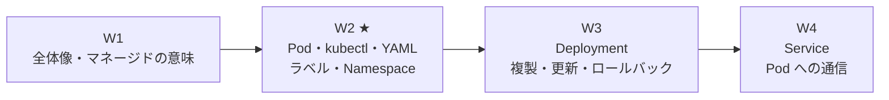
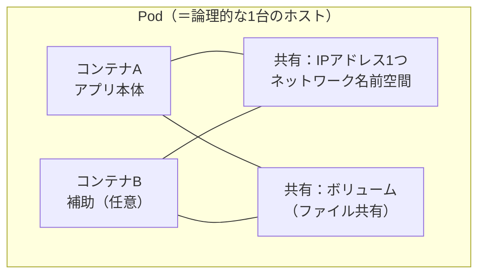
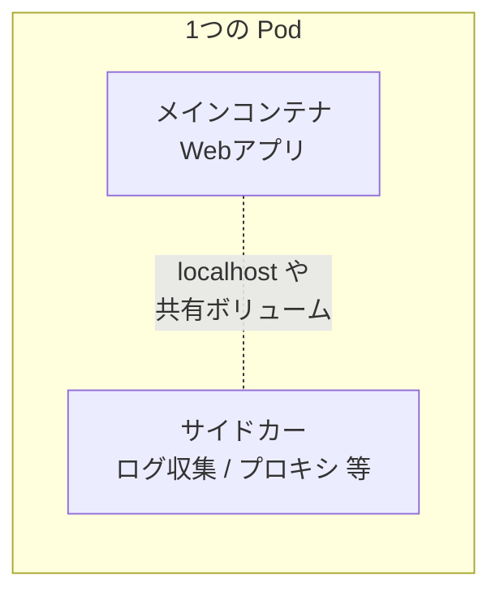
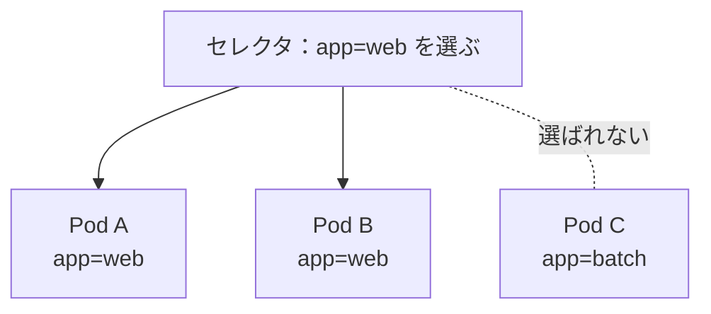

# AKS 学習ノート — 第2週：Kubernetes コア① Pod（kubectl・宣言的YAML・ラベル・Namespace）

## 学習目標

この週を終えると、次を自分の言葉で説明し、手を動かせる状態を目指す。

- **Pod（ポッド）** の定義を言え、「なぜコンテナではなく Pod が最小単位なのか」を説明できる。
- 1つの Pod が提供する**共有コンテキスト**（同じ IP・ネットワーク名前空間、共有ストレージ）を説明できる。
- 単一コンテナ Pod と複数コンテナ Pod（サイドカー）の違いと、後者を使うべき場面を判断できる。
- `kubectl` の基本4動詞 `get` / `describe` / `logs` / `exec` を読み方から使い分けられる。
- **命令的（`kubectl run`）と宣言的（YAML＋`kubectl apply`）** の違いを説明し、宣言的マニフェストを1つ書ける。
- **ラベル（label）とセレクタ（selector）** で Pod をグループとして扱う考え方を説明できる。
- **Namespace（名前空間）** で何を仕切るのかを説明し、`default` を避ける理由を言える。

---

## §0 この週の位置づけ

W1 で「あなた → `kubectl` → apiserver → ノード上の **Pod**」という一本道を描いた。W2 はその終点にある **Pod** を、実際に1個立てて中身を確かめる回である。



Pod 単体は、実は本番でそのまま使う対象ではない（後述のとおり、ふつうは Deployment 経由で作る）。それでも Pod を先に丸ごと理解するのは、**Deployment も Service も HPA も、すべて「Pod」を土台に組み上がっている**からである。土台を飛ばすと後段がすべてあやふやになる。ここは急がず固める。

---

## 1. Pod とは何か

Kubernetes 公式の定義はこうである。

> _Pods_ are the smallest deployable units of computing that you can create and manage in Kubernetes.
> （Pod は、Kubernetes で作成・管理できる**最小のデプロイ単位**である）

> A _Pod_ (as in a pod of whales or pea pod) is a group of one or more containers, with shared storage and network resources, and a specification for how to run the containers.
> （Pod とは、1つ以上のコンテナのまとまりで、**共有ストレージとネットワーク資源**、およびコンテナの動かし方の仕様を持つ）
> — 出典：kubernetes.io / Pods

> **用語補足：Pod（ポッド）**
> 英語の pod は「（クジラの）群れ」「（エンドウ豆の）さや」の意。**さやの中に豆（コンテナ）が1つ以上入っている**イメージ。さや＝Pod が Kubernetes の扱う単位で、中の豆＝コンテナはさやごと配置・複製・削除される。

### 1.1 なぜ「コンテナ」ではなく「Pod」が最小単位なのか

W1 で Kubernetes は「コンテナのオーケストレーター」と学んだのに、扱う単位はコンテナではなく Pod である。これはなぜか。

公式はこう言う。

> A Pod's contents are always co-located and co-scheduled, and run in a shared context. A Pod models an application-specific "logical host".
> （Pod の中身は常に**同じ場所に置かれ・同時にスケジュールされ**、共有コンテキストで動く。Pod はアプリ固有の「論理的なホスト（1台のマシンのようなもの）」を模している）
> — 出典：kubernetes.io / Pods

ポイントは、**「同じ Pod に入れたコンテナは、必ず同じノードに、まとめて配置される」**こと、そして**「1つのマシンのように IP やディスクを共有する」**ことである。つまり Pod は「密結合なコンテナ群を、1台の仮想的なホストに同居させる箱」である。



> **用語補足：co-located / co-scheduled（同一配置／同時スケジュール）**
> - co-located＝「同じ場所（＝同じノード）に置かれる」。Pod 内のコンテナがバラバラのノードに散ることはない。
> - co-scheduled＝「まとめてスケジュールされる」。スケジューラ（W1・§3.1）は Pod 単位で「どのノードに置くか」を決める。コンテナ1個ずつではない。

### 1.2 Pod が提供する「共有コンテキスト」

同じ Pod のコンテナは、次を**共有**する。

| 共有するもの | 意味 | 具体的に何が嬉しいか |
|---|---|---|
| ネットワーク名前空間（IP・ポート空間） | Pod に IP が**1つ**。中のコンテナは同じ IP を共有 | 同一 Pod 内のコンテナ同士は `localhost` で通信できる |
| ストレージ（ボリューム） | 同じボリュームをマウントして共有 | ファイルを介してデータを受け渡せる |
| Linux 名前空間・cgroups | 分離と資源境界の単位 | 「1台のホスト」らしい隔離をまとめて効かせる |

> A Pod is similar to a set of containers with shared namespaces and shared filesystem volumes.
> （Pod は、名前空間とファイルシステムのボリュームを共有するコンテナ群のようなもの）
> — 出典：kubernetes.io / Pods

> **用語補足：namespace が2つの意味で出てくる点に注意**
> - ここでの「ネットワーク**名前空間**（Linux namespace）」＝ OS レベルの隔離機構。Pod 内で共有される。
> - §5 で出る「Kubernetes の **Namespace**」＝ クラスターを論理的に仕切る別物。**同じ「名前空間」でも指すものが違う**。本ノートでは前者を「Linux 名前空間」、後者を「Namespace」と表記して区別する。

### 1.3 単一コンテナ Pod と複数コンテナ Pod（サイドカー）

**単一コンテナ Pod（最も普通）。**

> The "one-container-per-Pod" model is the most common Kubernetes use case; in this case, you can think of a Pod as a wrapper around a single container.
> （「1 Pod に1コンテナ」が最も一般的。この場合、Pod は単一コンテナのラッパー（包み紙）と考えてよい）
> — 出典：kubernetes.io / Pods

最初はこれだけ覚えればよい。**Pod ≒ コンテナ1個の包み**である。

**複数コンテナ Pod（サイドカー・応用）。** 1つの Pod に密結合したコンテナを同居させる形。補助役のコンテナを **サイドカー（sidecar＝バイクの横につく補助席）** と呼ぶ。



ただし公式は釘を刺す。

> Grouping multiple co-located and co-managed containers in a single Pod is a relatively advanced use case. You should use this pattern only in specific instances in which your containers are tightly coupled.
> （複数コンテナの同居は比較的**高度なユースケース**。コンテナが**密結合**な特定の場合にのみ使うべき）
> — 出典：kubernetes.io / Pods

> **よくある誤解**：「たくさん動かしたい（複製したい）」ときに Pod にコンテナを何個も入れるのは**間違い**。公式いわく "You don't need to run multiple containers to provide replication"。複製は「同じ Pod を複数個」で実現する（＝W3 の Deployment の仕事）。サイドカーは「役割の違う相棒を同居させる」ためのもので、複製とは無関係。

### 1.4 Pod は「使い捨て」——だから普通は直接作らない

Pod の重要な性質：**壊れても自分では蘇らない**。Pod が動くノードが落ちれば、その Pod は失われる。復活させる（＝W1 の自己修復をする）のは Pod 自身ではなく、上位の**コントローラ**の役目である。

> Usually you don't need to create Pods directly, even singleton Pods. Instead, create them using workload resources such as Deployment or Job. ... A controller for the resource handles replication and rollout and automatic healing in case of Pod failure.
> （通常、Pod を直接作る必要はない。Deployment や Job などのワークロードリソース経由で作る。コントローラが複製・ロールアウト・Pod 障害時の自己修復を担う）
> — 出典：kubernetes.io / Pods

| ワークロードリソース | 用途 |
|---|---|
| Deployment | 複製されるステートレスなアプリ（**W3 で詳説**） |
| StatefulSet | 永続ストレージを持つ状態ありアプリ（**W7**） |
| DaemonSet | 各ノードに1個ずつ Pod を配る |
| Job / CronJob | 有限のバッチ処理 |

> **本週の立ち位置**：W2 では学習のために Pod を**あえて直接**作る（仕組みを裸で見るため）。W3 以降は Deployment に主役を譲る。「Pod を直接作るのは学習・デバッグ時だけ」と覚えておく。

---

## 2. kubectl の基本4動詞

Pod を触るには `kubectl`（W1・§6.1 参照）を使う。まず**最頻出の4つ**を、破壊的か否かで整理する。

| コマンド | 読み・展開 | すること | 破壊的か |
|---|---|---|---|
| `kubectl get` | ゲット | 一覧を**覗く**（Pod/ノード等をリスト表示） | 非破壊（見るだけ） |
| `kubectl describe` | ディスクライブ | 1つの詳細を**覗く**（イベント・状態・原因の宝庫） | 非破壊 |
| `kubectl logs` | ログズ | コンテナの**標準出力ログを覗く** | 非破壊 |
| `kubectl exec` | エグゼク（execute＝実行） | 動作中コンテナの中で**コマンドを実行**（中に入る） | 状況次第（中で何をするか次第） |

> **コマンドの読み方ボックス：`kubectl <動詞> <種類> <名前>` の型**
> kubectl はおおむね「**動詞 → リソース種類 → 名前**」の順。
> - `kubectl get pods` ＝「Pod（複数）を一覧で覗け」
> - `kubectl describe pod nginx` ＝「`nginx` という Pod の詳細を覗け」
> - `kubectl logs nginx` ＝「`nginx` のログを覗け」
> - `kubectl exec -it nginx -- sh` ＝「`nginx` の中で対話的にシェルを実行せよ」（`-it`＝interactive+tty＝対話端末、`--` の後が中で走らせるコマンド）

> **困ったらまず `describe`**：Pod が起動しない・落ちるときの原因は、たいてい `kubectl describe pod <名前>` の下部にある **Events（イベント）** 欄に書いてある（イメージ取得失敗、リソース不足など）。W3 以降のトラブルシュートでも最初に叩く定番。

---

## 3. 命令的と宣言的：`kubectl run` vs YAML＋`apply`

W1・§2.2 で「宣言的」を思想として学んだ。W2 ではそれを**実際のコマンドの違い**として体感する。

### 3.1 命令的（imperative）：手順を叩く

```bash
kubectl run nginx --image=nginx:1.14.2
```

「nginx という Pod を今すぐ起動しろ」という**一発の命令**。手軽だが、次の弱点がある。
- どんな状態を作ったかが**コマンド履歴にしか残らない**（再現・レビューしづらい）。
- 変更を重ねると「今のあるべき姿」が分からなくなる。

学習・お試しには便利。**本番構成の管理には向かない**。

### 3.2 宣言的（declarative）：あるべき姿を YAML に書いて `apply`

まず**マニフェスト（manifest＝あるべき状態を書いた設計書）**を YAML で書く。

```yaml
apiVersion: v1
kind: Pod
metadata:
  name: nginx
  labels:
    app: web
spec:
  containers:
  - name: nginx
    image: nginx:1.14.2
    ports:
    - containerPort: 80
```

これを反映する。

```bash
kubectl apply -f pod.yaml
```

`apply`（アプライ＝適用）は「この YAML の状態に**寄せろ**」という宣言。W1・§2.2 の「あるべき状態 → 実際を寄せる」がそのまま道具になっている。

> **用語補足：マニフェストの4つの必須フィールド**
> どの Kubernetes オブジェクトも、この4つが背骨になる。
> - `apiVersion`：どの API 版か（Pod は `v1`）。
> - `kind`：種類（`Pod` / `Deployment` / `Service` …）。
> - `metadata`：名前やラベルなどの識別情報。
> - `spec`：**あるべき仕様**（どんなコンテナを・どのイメージで・どのポートで）。
> `apiVersion`（読み：エーピーアイ・バージョン）、`kind`（カインド＝種類）、`spec`（スペック＝仕様）。

### 3.3 どちらを使うか

| | 命令的（`run`/`create`） | 宣言的（YAML＋`apply`） |
|---|---|---|
| 手軽さ | ◎ 一行で動く | △ ファイルを書く手間 |
| 再現性・レビュー | △ 履歴頼み | ◎ ファイルが正 |
| Git 管理・チーム運用 | 不向き | ◎ 向く（Infrastructure as Code） |
| 本教材の方針 | 学習・デバッグの一発芸に限る | **本番構成はこちら**（W12 の最終PJもマニフェスト） |

> **なぜ宣言的が本命か**：あるべき姿を YAML ファイルにしておけば、Git で差分管理でき、レビューでき、`apply` すれば何度でも同じ状態を再現できる。W11 の GitOps（Flux）や W12 の最終 PJ は、この「YAML が正」という前提の上に乗っている。

---

## 4. ラベルとセレクタ：Pod を「グループ」として扱う

Pod が増えると「どれがどのアプリか」「本番用はどれか」を区別したくなる。その仕組みが **ラベル（label）** と、それで束ねる **セレクタ（selector）** である。

### 4.1 ラベル（label）

> Labels are key/value pairs that are attached to objects such as Pods. Labels are intended to be used to specify identifying attributes of objects that are meaningful and relevant to users.
> （ラベルは Pod などのオブジェクトに付ける**キー/値のペア**。ユーザーにとって意味のある**識別属性**を指定するために使う）
> — 出典：kubernetes.io / Labels and Selectors

§3.2 の YAML で付けた `labels: { app: web }` がまさにこれ。よくあるラベルの例：

```yaml
labels:
  app: web          # どのアプリか
  tier: frontend    # 層（frontend/backend）
  environment: production   # 環境（production/qa）
  release: stable   # リリース系統
```

ラベルは**中身の動作には影響しない**（"do not directly imply semantics to the core system"）。あくまで「人間と道具が Pod を分類・検索するための付箋」である。

### 4.2 セレクタ（selector）：ラベルで束ねる

> Via a _label selector_, the client/user can identify a set of objects. The label selector is the core grouping primitive in Kubernetes.
> （ラベルセレクタによって、オブジェクトの**集合**を特定できる。ラベルセレクタは Kubernetes の**中核となるグループ化の仕組み**である）
> — 出典：kubernetes.io / Labels and Selectors

`kubectl` で試すと直感がつかめる。

```bash
kubectl get pods -l app=web
```

`-l app=web`（`-l`＝label セレクタ）で「`app=web` のラベルが付いた Pod だけ」を選ぶ。等価（equality-based）だけでなく集合（set-based）も書ける。

| セレクタの種類 | 例 | 意味 |
|---|---|---|
| 等価ベース | `environment = production` | production のもの |
| 等価ベース（否定） | `tier != frontend` | frontend 以外 |
| 集合ベース | `environment in (production, qa)` | production か qa |
| 複数条件 | `app=web,tier=frontend` | カンマ＝AND（両方満たす） |

> **なぜ重要か**：この「ラベルで集合を選ぶ」仕組みは、W3 の Deployment（「`app=web` の Pod を3個に保て」）や W4 の Service（「`app=web` の Pod 群へ通信を振り分けろ」）の**土台そのもの**。Deployment も Service も、対象の Pod を**名前ではなくラベルセレクタで**指名する。ここが腹落ちすると後段が一気に楽になる。



---

## 5. Namespace：クラスターを論理的に仕切る

### 5.1 Namespace とは

> In Kubernetes, _namespaces_ provide a mechanism for isolating groups of resources within a single cluster. Names of resources need to be unique within a namespace, but not across namespaces.
> （Namespace は、**単一クラスター内でリソース群を隔離する仕組み**。リソース名は Namespace 内で一意であればよく、Namespace をまたげば重複してよい）
> — 出典：kubernetes.io / Namespaces

W1・§6.5 で `kubectl get pods -A`（`-A`＝all namespaces）を叩くと、まだ何もデプロイしていないのに Pod が見えた。あれは `kube-system` という Namespace の中身だった。

### 5.2 最初からある4つの Namespace

| Namespace | 役割 |
|---|---|
| `default` | 何も指定しないと Pod はここに入る（"start using your new cluster without first creating a namespace"） |
| `kube-system` | **Kubernetes システム自身**の部品用（CoreDNS など） |
| `kube-public` | 全クライアントが読める（認証なしでも）。ほぼ使わない |
| `kube-node-lease` | 各ノードの死活監視（Lease）用。内部用 |

出典：kubernetes.io / Namespaces

### 5.3 いつ Namespace を分けるか

公式のガイドは明快である。

> Namespaces are intended for use in environments with many users spread across multiple teams, or projects. For clusters with a few to tens of users, you should not need to create or think about namespaces at all.
> （Namespace は**多数のユーザー・複数チーム・複数プロジェクト**向け。数人〜数十人規模なら、そもそも作る・考える必要はない）

> It is not necessary to use multiple namespaces to separate slightly different resources, such as different versions of the same software: use labels to distinguish resources within the same namespace.
> （同じソフトの版違い程度の区別に Namespace を分けるのは不要。**同一 Namespace 内はラベルで区別**せよ）
> — 出典：kubernetes.io / Namespaces

> **ベストプラクティス**：公式は本番では `default` を**使わない**ことを勧める（"consider _not_ using the `default` namespace. Instead, make other namespaces and use those."）。理由は、`default` は誰でも何でも入れがちで、権限（RBAC・W9）や資源制限（ResourceQuota）を効かせにくく、事故の温床になりやすいため。本教材の W12 でも専用 Namespace を切って使う。

> **注意：Namespace で仕切れないものもある**
> Namespace はあくまで「名前空間付きオブジェクト（Pod・Deployment・Service 等）」の仕切り。**Node・PersistentVolume・StorageClass などクラスター全体のオブジェクトは Namespace に属さない**（"not for cluster-wide objects"）。W7（ストレージ）でこの区別が効いてくる。

---

## 6. ハンズオン：Pod を宣言的に立てて、覗いて、消す

W1・§6 で作ったクラスター（`rg-aks-learn` / `aks-learn`）がある前提。無ければ W1・§6.2〜6.4 で再作成する。

### 6.1 専用 Namespace を作る（default を避ける）

```bash
kubectl create namespace demo
```

以降のコマンドは `-n demo`（`-n`＝namespace 指定）を付けて、この仕切りの中で作業する。

### 6.2 マニフェストを書く

`pod.yaml` として保存：

```yaml
apiVersion: v1
kind: Pod
metadata:
  name: web
  labels:
    app: web
    tier: frontend
spec:
  containers:
  - name: nginx
    image: nginx:1.14.2
    ports:
    - containerPort: 80
```

### 6.3 宣言的に反映する

```bash
kubectl apply -f pod.yaml -n demo
```

「この YAML の状態に寄せろ」。数秒で Pod が立つ。

### 6.4 覗く（get / describe / logs）

```bash
kubectl get pods -n demo
```
`STATUS` が `Running` になれば起動成功。

```bash
kubectl get pods -n demo -l app=web
```
ラベルセレクタで `app=web` だけを選べることを確認。

```bash
kubectl describe pod web -n demo
```
下部の **Events** 欄に「イメージ取得 → コンテナ作成 → 起動」の足跡が並ぶ。トラブル時はここを読む。

```bash
kubectl logs web -n demo
```
nginx の起動ログが見える。

### 6.5 中に入ってみる（exec）

```bash
kubectl exec -it web -n demo -- sh
```
コンテナ内のシェルに入る。`ls` や `curl localhost` を試したら `exit` で出る。**Pod が「1台のホストのよう」**（§1.1）である感覚をつかむ。

### 6.6 自己修復を体感する（任意）

```bash
kubectl delete pod web -n demo
```
Pod を消す。**そのまま消えたきり**になることを `kubectl get pods -n demo` で確認する。これが §1.4 の「Pod は自分では蘇らない」。W3 で Deployment を使うと、ここで**自動的に再作成される**ようになる——その差分が Deployment の価値である。

### 6.7 後片付け

```bash
kubectl delete namespace demo
```
Namespace ごと消せば中の Pod も一括削除。クラスター自体を止めるなら W1・§6.6（`az group delete`）で課金を止める。

---

## 7. 自己チェック

1. Pod の公式定義を述べ、「なぜ最小単位がコンテナではなく Pod なのか」を co-located / co-scheduled の語を使って説明せよ。
2. 1つの Pod が共有する資源を3つ挙げよ。同一 Pod 内のコンテナが `localhost` で通信できるのはなぜか。
3. サイドカーとは何か。「複製したいときにコンテナを Pod に複数入れる」のがなぜ間違いか説明せよ。
4. `get` / `describe` / `logs` / `exec` を、それぞれ一言＋破壊的か否かで整理せよ。Pod が起動しないときまず何を叩くか。
5. 命令的（`kubectl run`）と宣言的（YAML＋`apply`）の違いを述べ、本番構成にどちらが向くか理由とともに答えよ。
6. ラベルとセレクタの関係を説明せよ。`kubectl get pods -l app=web,tier=frontend` は何を選ぶか。
7. Namespace は何を仕切るか。本番で `default` を避けるべき理由と、「版違いはラベルで区別」の指針を述べよ。
8. Namespace で仕切れないオブジェクトの例を2つ挙げよ。

---

## 8. 次週予告（W3：Kubernetes コア② Deployment）

W2 で「Pod は自分では蘇らない」ことを体感した。W3 はそれを解決する **Deployment（デプロイメント）** に進む。

- ReplicaSet（レプリカセット）→ Deployment の関係：「Pod を常に N 個に保つ」自己修復の実体。
- **ローリング更新**（少しずつ入れ替え）と**ロールバック**（すぐ前の版へ戻す）。
- **ConfigMap / Secret** で設定・機密を Pod へ注入する。
- リソースの `requests` / `limits` で CPU・メモリを予約・制限する。
- Probe（liveness / readiness）でヘルスチェックし、自己修復と連動させる。

W2 の「セレクタで Pod 群を選ぶ」が、W3 では「Deployment がセレクタで自分の Pod 群を管理する」として効いてくる。

---

## 出典（公式ドキュメント）

- Kubernetes 公式 — Pods：https://kubernetes.io/docs/concepts/workloads/pods/
- Kubernetes 公式 — Labels and Selectors：https://kubernetes.io/docs/concepts/overview/working-with-objects/labels/
- Kubernetes 公式 — Namespaces：https://kubernetes.io/docs/concepts/overview/working-with-objects/namespaces/
- Kubernetes 公式 — kubectl Cheat Sheet：https://kubernetes.io/docs/reference/kubectl/cheatsheet/
