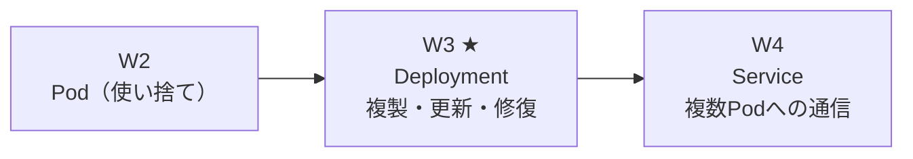
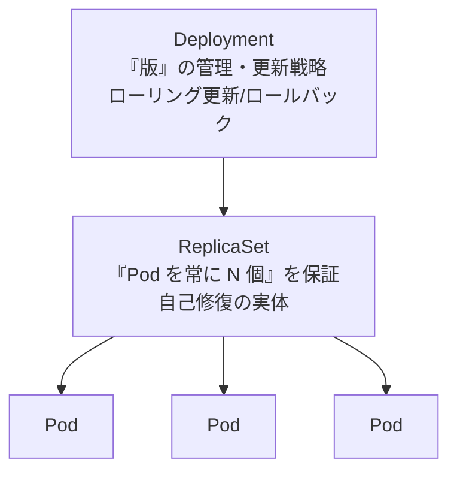
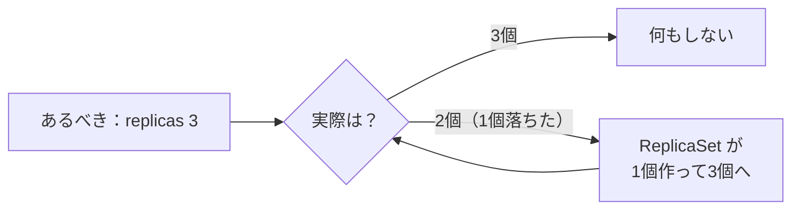
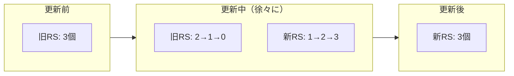
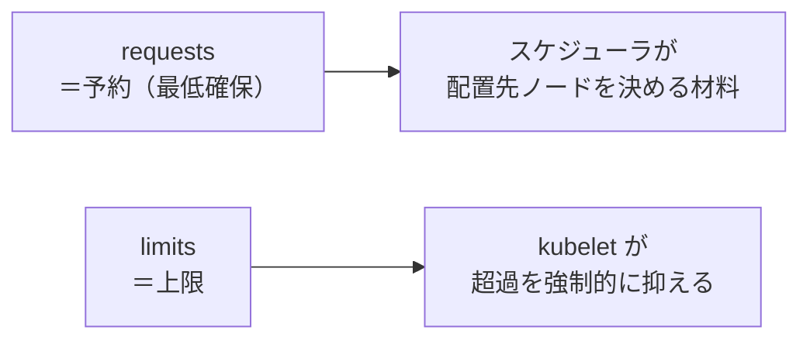
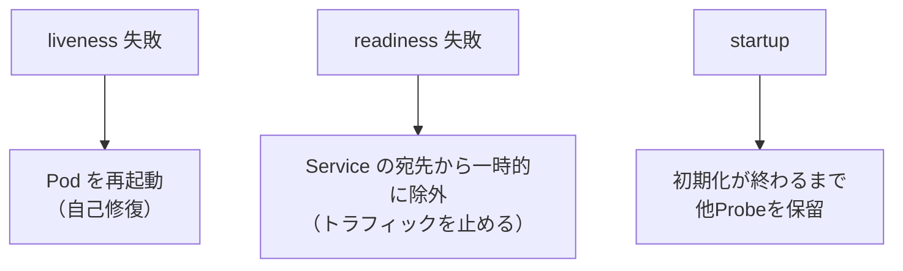

# AKS 学習ノート — 第3週：Kubernetes コア② Deployment（複製・ローリング更新・ロールバック・ConfigMap/Secret・Probe）

## 学習目標

この週を終えると、次を自分の言葉で説明し、手を動かせる状態を目指す。

- **Deployment → ReplicaSet → Pod** の3段階層と、各層が何を担うかを図で描ける。
- Deployment がどうやって「Pod を常に N 個に保つ」自己修復を実現するかを説明できる。
- **ローリング更新（rolling update）** と **ロールバック（rollback）** の仕組みを、ReplicaSet の増減として説明できる。
- Deployment の `selector` と `template` の関係（ラベルで自分の Pod を見つける）を説明できる。
- **ConfigMap / Secret** で設定・機密を Pod に注入でき、「ConfigMap も Secret も暗号化ではない」ことを説明できる。
- **requests / limits** で CPU・メモリを予約・制限でき、CPU 超過（スロットル）とメモリ超過（OOM Kill）の違いを言える。
- **Probe（liveness / readiness / startup）** でヘルスチェックし、自己修復とトラフィック制御に連動させられる。

---

## §0 この週の位置づけ

W2 のハンズオン最後（§6.6）で、`kubectl delete pod web` した Pod は**そのまま消えたきり**になった。Pod は自分では蘇らない。これを解決するのが **Deployment（デプロイメント）** である。



W1 で学んだ「宣言的・自己修復」という思想が、W3 で初めて**実際に動く道具**になる。W2 で学んだ「ラベル/セレクタ」も、ここで「Deployment が自分の Pod 群を見つける手段」として効いてくる。この週が、Kubernetes の"らしさ"が最も体感できる回である。

---

## 1. Deployment とは何か

公式定義。

> A Deployment manages a set of Pods to run an application workload, usually one that doesn't maintain state. A Deployment provides declarative updates for Pods and ReplicaSets.
> （Deployment は、アプリを動かすための Pod 群を管理する。通常は**状態を持たない（ステートレスな）**もの向け。Pod と ReplicaSet に対する**宣言的な更新**を提供する）

> You describe a desired state in a Deployment, and the Deployment Controller changes the actual state to the desired state at a controlled rate.
> （Deployment にあるべき状態を記述すると、Deployment コントローラが実際の状態を、制御された速度でその状態へ変える）
> — 出典：kubernetes.io / Deployments

W1・§2.2 の「あるべき状態 → 実際を寄せる」という一文が、そのまま Deployment の定義になっている。Deployment は**その調整ループを回すコントローラ**そのものである。

> **用語補足：ステートレス／ステートフル**
> - ステートレス（stateless）＝ Pod 自身がデータを持たない。どの Pod に来ても同じ結果（例：Web の表示、API 計算）。→ Deployment 向き。
> - ステートフル（stateful）＝ Pod ごとに固有のデータ・順序が要る（例：DB）。→ W7 の StatefulSet 向き。
> W3〜W12 の主役はステートレスな Deployment である。

---

## 2. Deployment → ReplicaSet → Pod の3段階層

Deployment は Pod を**直接**は作らない。間に **ReplicaSet（レプリカセット）** を挟む。

> Create a Deployment to rollout a ReplicaSet. The ReplicaSet creates Pods in the background.
> （Deployment を作って ReplicaSet をロールアウトする。ReplicaSet が裏で Pod を作る）
> — 出典：kubernetes.io / Deployments



| 層 | 何を担うか | ひとことで |
|---|---|---|
| **Deployment** | 更新戦略・版（リビジョン）の管理・ロールバック | 「どう入れ替えるか」の司令塔 |
| **ReplicaSet** | 指定数の Pod を維持（足りなければ作り、多ければ消す） | 「常に N 個」を守る番人 |
| **Pod** | 実際にコンテナを動かす（W2） | 実働部隊 |

> **なぜ2層に分けるのか**：ReplicaSet は「今この版の Pod を N 個に保つ」ことだけに専念する。Deployment は「古い ReplicaSet を減らし、新しい ReplicaSet を増やす」という**版の切り替え**を担う。役割を分けることで、ローリング更新（§4）が「2つの ReplicaSet の増減」というシンプルな操作に落ちる。

> **重要な注意**：Deployment が持つ ReplicaSet を**手で触ってはいけない**（"Do not manage ReplicaSets owned by a Deployment."）。ReplicaSet は Deployment の道具。人間が操作するのは常に Deployment。

### 2.1 自己修復（W1 の思想が実際に動く）

ReplicaSet が「常に N 個」を守るので、Pod が1個落ちれば ReplicaSet が即座に新しい Pod を作る。W2・§6.6 で消したきりだった Pod が、Deployment 配下では**自動で蘇る**。これが W1・§2.2 の自己修復ループの実体である。



---

## 3. selector と template：Deployment はどうやって自分の Pod を見つけるか

Deployment のマニフェストの核心は `selector` と `template` の対応である。

```yaml
apiVersion: apps/v1
kind: Deployment
metadata:
  name: web
spec:
  replicas: 3
  selector:
    matchLabels:
      app: web          # ← この条件で「自分の Pod」を見つける
  template:             # ← 作る Pod の設計図
    metadata:
      labels:
        app: web        # ← selector と一致させる（必須）
    spec:
      containers:
      - name: nginx
        image: nginx:1.14.2
        ports:
        - containerPort: 80
```

> The `.spec.selector` field defines how the created ReplicaSet finds which Pods to manage. In this case, you select a label that is defined in the Pod template (`app: nginx`).
> （selector は、作られた ReplicaSet が**どの Pod を管理するか**を見つける方法を定める。Pod テンプレートで定義したラベルを選ぶ）
> — 出典：kubernetes.io / Deployments

つまり W2 で学んだ**ラベル/セレクタが、ここで「Deployment（ReplicaSet）が自分の配下の Pod を識別する仕組み」として使われている**。

- `selector.matchLabels` … 「この条件に合う Pod は自分の子だ」と主張する条件。
- `template` … その Pod を実際に作るときの設計図（中身は W2 の Pod マニフェストの `spec` と同じ）。
- **両者のラベルは一致必須**。一致しないと Deployment は「自分の子がいない」と誤認する。

> **用語補足：`replicas`（レプリカ＝複製の数）**
> `.spec.replicas: 3` で「この版の Pod を3個保て」。ReplicaSet はこの数を維持する（"creates three replicated Pods, indicated by the `.spec.replicas` field"）。

> **豆知識：`pod-template-hash` ラベル**
> Deployment は、作る ReplicaSet ごとに `pod-template-hash` という**自動ラベル**を付ける。これで「新版の ReplicaSet」と「旧版の ReplicaSet」の Pod が混ざらない（"ensures that child ReplicaSets of a Deployment do not overlap"）。これも**触ってはいけない**自動ラベルである。ローリング更新（§4）が安全に効くのは、この仕分けラベルのおかげ。

---

## 4. ローリング更新とロールバック

Deployment の真価は「**止めずに版を入れ替える**」ことにある。

### 4.1 ローリング更新（rolling update）

> Declare the new state of the Pods by updating the PodTemplateSpec of the Deployment. A new ReplicaSet is created, and the Deployment gradually scales it up while scaling down the old ReplicaSet, ensuring Pods are replaced at a controlled rate.
> （Pod テンプレートを更新して新しい状態を宣言すると、**新しい ReplicaSet が作られ**、Deployment はそれを徐々に増やしながら**古い ReplicaSet を減らし**、制御された速度で Pod を入れ替える）
> — 出典：kubernetes.io / Deployments



新旧2つの ReplicaSet の**片方を減らし片方を増やす**だけ。常に稼働 Pod があるのでダウンタイムがない。

> **発火条件が重要**：ローリング更新が起きるのは **Pod テンプレート（`.spec.template`）が変わったときだけ**。
> > A Deployment's rollout is triggered if and only if the Deployment's Pod template ... is changed ... Other updates, such as scaling the Deployment, do not trigger a rollout.
> つまり **イメージやラベルを変えると更新が走る**が、`replicas` の数だけ変えても更新（版切り替え）は走らない（＝単なる増減）。この線引きは W8 のスケーリングを学ぶときに効いてくる。

### 4.2 ロールバック（rollback）

新版に不具合があったら、前の版へ戻せる。仕組みは「**版（リビジョン）の履歴**」。

> Each new ReplicaSet updates the revision of the Deployment.
> （新しい ReplicaSet ごとに Deployment のリビジョンが更新される）

> Rollback to an earlier Deployment revision if the current state of the Deployment is not stable.
> （現在の状態が不安定なら、以前のリビジョンへロールバックする）
> — 出典：kubernetes.io / Deployments

古い ReplicaSet は**すぐには消されず履歴として残る**。だから戻すのが速い。

```bash
kubectl rollout history deployment/web        # 版の履歴を覗く（非破壊）
kubectl rollout undo deployment/web           # 直前の版へ戻す
kubectl rollout undo deployment/web --to-revision=2   # 特定の版へ戻す
```

> **コマンドの読み方ボックス：`kubectl rollout`（ロールアウト＝展開）**
> - `rollout status` … 更新の進み具合を覗く（非破壊）
> - `rollout history` … 版の履歴を覗く（非破壊）
> - `rollout undo` … 前（または指定）の版へ**戻す**（変更あり）
> - `rollout restart` … Pod を順に再作成して**入れ替える**（設定変更を反映したいとき等）

> **これは W4/W11 の伏線**：この「新旧 ReplicaSet の重み付けを変える」考え方は、W11 の Blue-Green / Canary デプロイの基礎。Deployment のローリング更新はその最も基本的な形である。

---

## 5. ConfigMap と Secret：設定・機密を Pod に注入する

アプリの設定（接続先 URL、機能フラグ）やパスワードを**イメージに焼き込む**と、環境ごとにイメージを作り直す羽目になる。Kubernetes は設定を**外出し**して Pod に注入する仕組みを持つ。

### 5.1 ConfigMap（機密でない設定）

> A ConfigMap is an API object used to store non-confidential data in key-value pairs. Pods can consume ConfigMaps as environment variables, command-line arguments, or as configuration files in a volume.
> （ConfigMap は**機密でない**データをキー/値で保存する API オブジェクト。Pod は環境変数・コマンド引数・ボリューム上の設定ファイルとして消費できる）
> — 出典：kubernetes.io / ConfigMap

重要な性質を先に押さえる。

- **暗号化ではない**：`ConfigMap does not provide secrecy or encryption.` パスワードを入れてはいけない。
- **サイズ上限 1 MiB**：`The data stored in a ConfigMap cannot exceed 1 MiB.` 大きい設定は別手段（ボリューム/DB）。
- `spec` ではなく **`data`** フィールドを持つ（Pod や Deployment と構造が違う点に注意）。

### 5.2 Secret（機密データ用）

パスワード・トークン・鍵は **Secret** に入れる。ただし——

> **超重要な誤解ポイント：Secret も既定では暗号化されていない**
> Kubernetes の Secret は既定で **base64 エンコードされているだけ**（＝人間が読みにくいだけで、暗号化ではない。誰でもデコードできる）。「Secret だから安全」は誤り。本当に守るには、後述の追加対策が要る。
> - Kubernetes 側：etcd の保存時暗号化（encryption at rest）を有効化。
> - AKS 側：**Azure Key Vault に本物の機密を置き、Secrets Store CSI ドライバで Pod にマウント**する（**W9 で詳説**）。本教材はこの AKS 流を本命とする。

> **用語補足：base64（ベースろくじゅうよん）**
> バイナリを64種類の文字だけで表す**エンコード方式**であって暗号ではない。`echo <文字列> | base64 -d` で誰でも元に戻せる。「隠す」効果はゼロに近い。

### 5.3 Pod への注入方法：環境変数 vs ボリューム

ConfigMap / Secret を Pod に渡す代表的な2方式。

**（A）環境変数として渡す：**
```yaml
env:
  - name: PLAYER_INITIAL_LIVES
    valueFrom:
      configMapKeyRef:
        name: game-demo
        key: player_initial_lives
```

**（B）ボリュームとしてファイルでマウントする：**
```yaml
volumeMounts:
- name: foo
  mountPath: "/etc/foo"
  readOnly: true
volumes:
- name: foo
  configMap:
    name: myconfigmap
```

| 方式 | 更新の反映 | 向く用途 |
|---|---|---|
| 環境変数 | **自動反映されない**（Pod 再起動が必要） | 少数の単純な設定値 |
| ボリューム（ファイル） | **やがて自動反映される**（"eventually updated"） | 設定ファイル一式、動的に変えたい設定 |

出典：kubernetes.io / ConfigMap（"ConfigMaps consumed as environment variables are not updated automatically and require a pod restart" ／ mounted は "eventually updated"）

---

## 6. requests / limits：CPU・メモリの予約と制限

Pod を放置すると、1つのアプリがノードの CPU・メモリを食い尽くし、他を巻き添えにする。これを防ぐのが **requests（要求＝予約）** と **limits（制限＝上限）** である。

### 6.1 それぞれの意味

> When you specify a resource _request_ ... the kube-scheduler uses this information to decide which node to place the Pod on.
> （request を指定すると、スケジューラがそれを見て**どのノードに置くか**決める）

> When you specify a resource _limit_ ... the kubelet enforces those limits so that the running container is not allowed to use more of that resource than the limit.
> （limit を指定すると、kubelet がそれを**強制**し、コンテナはそれ以上使えない）
> — 出典：kubernetes.io / Resource Management for Pods and Containers



```yaml
resources:
  requests:      # スケジューリング用の予約
    cpu: "250m"
    memory: "128Mi"
  limits:        # 超えられない上限
    cpu: "500m"
    memory: "256Mi"
```

### 6.2 CPU 超過とメモリ超過は挙動が違う（頻出）

ここが試験・実務でよく問われる。**超過時の扱いが CPU とメモリで根本的に違う**。

| 資源 | 上限に達すると | 挙動 | 一言 |
|---|---|---|---|
| **CPU** | スロットル（throttling） | 使用を絞られるが**殺されない** | 遅くなるだけ |
| **メモリ** | OOM Kill（Out Of Memory） | コンテナが**強制終了**される | 落ちる |

> CPU limits are enforced by CPU throttling. ... a `cpu` limit is a hard limit the kernel enforces. Containers may not use more CPU than is specified.
> （CPU の上限はスロットルで強制。カーネルが効かせるハード上限。上限以上の CPU は使えない）

> `memory` limits are enforced by the kernel with out of memory (OOM) kills. When a container uses more than its `memory` limit, the kernel may terminate it.
> （メモリ上限は OOM Kill で強制。上限を超えるとカーネルが**終了させ得る**）
> — 出典：kubernetes.io / Resource Management for Pods and Containers

> **用語補足：単位（CPU / メモリ）**
> - CPU：`1` = 物理1コア相当。`500m`（ミリコア）= 0.5 コア。`250m` = 0.25 コア。最小 `1m`。
> - メモリ：バイト単位。`Mi`（メビ＝1024²）/`Gi`（ギビ＝1024³）が実務の定番。`128Mi` ≒ 128×1024×1024 バイト。`M`（1000²）と `Mi`（1024²）は別物なので混同しない。

> **AKS での効き方（W8 の伏線）**：requests は「Pod をどのノードに載せられるか」を左右する。ノードの空き（＝request の合計余地）が足りないと Pod は保留（Pending）になる。W5 のノードプール、W8 の Cluster Autoscaler／HPA は、この requests を基準にノードや Pod の数を増減する。**requests を適切に付けることが、後段のスケーリングが正しく効く前提**になる。

---

## 7. Probe：ヘルスチェックで自己修復とトラフィックを制御

Deployment が「Pod は動いている（Running）」と見なしても、アプリ内部が固まっている（デッドロック等）ことがある。**Probe（プローブ＝探査）** は、コンテナの中身が本当に健全かを Kubernetes に教える仕組み。

| Probe | 読み | 問うこと | 失敗すると |
|---|---|---|---|
| **liveness** | ライブネス | 「生きてるか？（固まってないか）」 | コンテナを**再起動**する |
| **readiness** | レディネス | 「今リクエストを受けられるか？」 | Service の**振り分け対象から外す**（W4 と連動） |
| **startup** | スタートアップ | 「起動が完了したか？（遅い初期化用）」 | 起動完了まで liveness/readiness を待たせる |



```yaml
livenessProbe:
  httpGet:
    path: /healthz
    port: 80
  initialDelaySeconds: 5
  periodSeconds: 10
readinessProbe:
  httpGet:
    path: /ready
    port: 80
  periodSeconds: 5
```

> **liveness と readiness の使い分け（重要）**
> - **liveness** は「壊れたら再起動して直す」＝自己修復の引き金。
> - **readiness** は「まだ準備中／一時的に不調」の Pod へ**トラフィックを送らない**ための引き金。再起動はしない。
> 起動に時間がかかるアプリで liveness を短く設定すると、起動中を「死んだ」と誤判定して**再起動ループ**に陥る。そういうときに **startup Probe** で起動猶予を与える。readiness は W4 の Service（どの Pod に振り分けるか）と直結する。

---

## 8. ハンズオン：Deployment で複製・更新・ロールバック・設定注入

W1 のクラスター（`aks-learn`）と W2 の `demo` Namespace を使う（無ければ再作成）。

### 8.1 Deployment を宣言的に作る

`deploy.yaml`：
```yaml
apiVersion: apps/v1
kind: Deployment
metadata:
  name: web
spec:
  replicas: 3
  selector:
    matchLabels:
      app: web
  template:
    metadata:
      labels:
        app: web
    spec:
      containers:
      - name: nginx
        image: nginx:1.14.2
        ports:
        - containerPort: 80
        resources:
          requests:
            cpu: "100m"
            memory: "64Mi"
          limits:
            cpu: "250m"
            memory: "128Mi"
```

```bash
kubectl apply -f deploy.yaml -n demo
kubectl get deploy,rs,pods -n demo
```
Deployment 1・ReplicaSet 1・Pod 3 が見える（§2 の3段階層が実物で確認できる）。

### 8.2 自己修復を体感する

```bash
kubectl delete pod -l app=web -n demo --field-selector status.phase=Running --wait=false
kubectl get pods -n demo
```
Pod を消しても、ReplicaSet が即座に作り直して**3個へ戻る**（W2 で消えたきりだったのと対照的）。

### 8.3 ローリング更新

```bash
kubectl set image deployment/web nginx=nginx:1.16.0 -n demo
kubectl rollout status deployment/web -n demo
kubectl get rs -n demo
```
新旧2つの ReplicaSet が並び、新版が増え旧版が0になる様子が見える（§4.1）。

### 8.4 ロールバック

```bash
kubectl rollout history deployment/web -n demo
kubectl rollout undo deployment/web -n demo
```
直前の版へ即座に戻る（旧 ReplicaSet が履歴として残っていたから速い）。

### 8.5 ConfigMap を注入

```bash
kubectl create configmap web-config --from-literal=GREETING=hello -n demo
```
`deploy.yaml` の containers に環境変数を足して `apply`：
```yaml
        env:
        - name: GREETING
          valueFrom:
            configMapKeyRef:
              name: web-config
              key: GREETING
```
`kubectl exec -it <pod> -n demo -- printenv GREETING` で注入を確認。

### 8.6 後片付け

```bash
kubectl delete namespace demo
```
（クラスターごと止めるなら W1・§6.6）

---

## 9. 自己チェック

1. Deployment → ReplicaSet → Pod の3段階層を図で描き、各層の役割を一言ずつ述べよ。なぜ2層に分けるのか。
2. Deployment 配下の Pod を消すとどうなるか。W2 の裸の Pod との違いと、その理由を述べよ。
3. `selector.matchLabels` と `template.metadata.labels` はなぜ一致させる必要があるか。
4. ローリング更新を「新旧 ReplicaSet の増減」として説明せよ。更新が**発火する条件**は何か。`replicas` を変えると発火するか。
5. ロールバックが速いのはなぜか（何が残っているから戻せるのか）。
6. ConfigMap と Secret の違いを述べよ。「Secret は暗号化されている」は正しいか。AKS で本当に機密を守るにはどうするか。
7. requests と limits の違いを述べよ。CPU 上限超過とメモリ上限超過で挙動がどう違うか。
8. liveness と readiness の違いを、失敗時の挙動で説明せよ。起動が遅いアプリで再起動ループを避けるにはどうするか。

---

## 10. 次週予告（W4：Kubernetes コア③ Service とネットワーク基礎）

W3 で Pod を3個に増やし、更新でも入れ替わるようにした。すると当然の疑問——「**IP がころころ変わる複数の Pod に、どうやって安定してアクセスするのか**」。それに答えるのが W4 の **Service** である。

- Service の3タイプ：**ClusterIP / NodePort / LoadBalancer**。
- Service はどうやって Pod を束ねるか（またしても**ラベルセレクタ**）。
- **kube-proxy** が通信を Pod へ振り分ける仕組み。
- クラスター内 **DNS** と、名前で相手を見つける **サービスディスカバリ**。
- **Ingress** の概念（W6 の Azure ネットワークへの入口）。
- W3 の **readiness Probe** が「振り分け対象に入れるか」でここに直結する。

---

## 出典（公式ドキュメント）

- Kubernetes 公式 — Deployments：https://kubernetes.io/docs/concepts/workloads/controllers/deployment/
- Kubernetes 公式 — ConfigMaps：https://kubernetes.io/docs/concepts/configuration/configmap/
- Kubernetes 公式 — Secrets：https://kubernetes.io/docs/concepts/configuration/secret/
- Kubernetes 公式 — Resource Management for Pods and Containers：https://kubernetes.io/docs/concepts/configuration/manage-resources-containers/
- Kubernetes 公式 — Liveness, Readiness and Startup Probes：https://kubernetes.io/docs/concepts/configuration/liveness-readiness-startup-probes/
