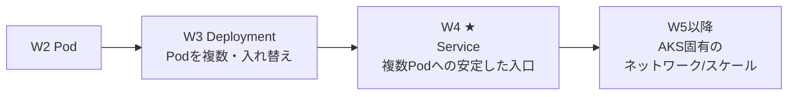
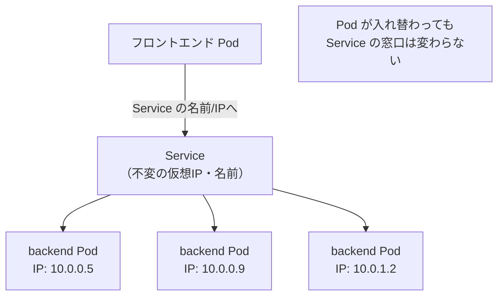
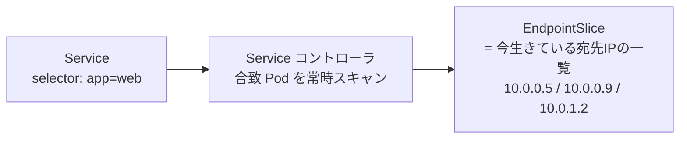
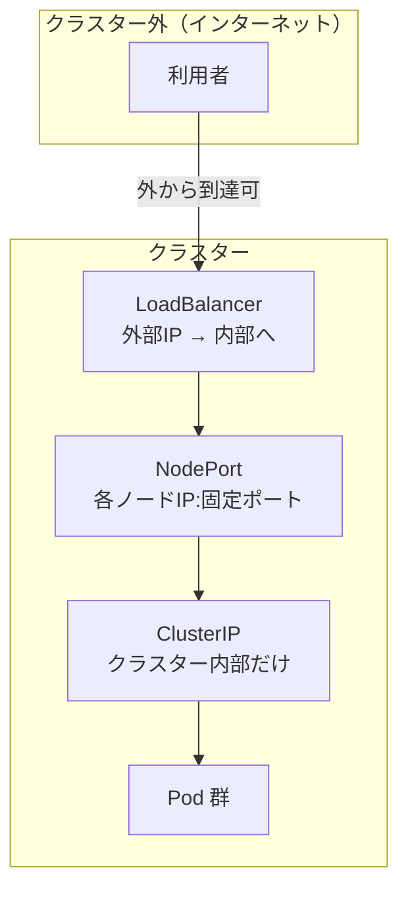
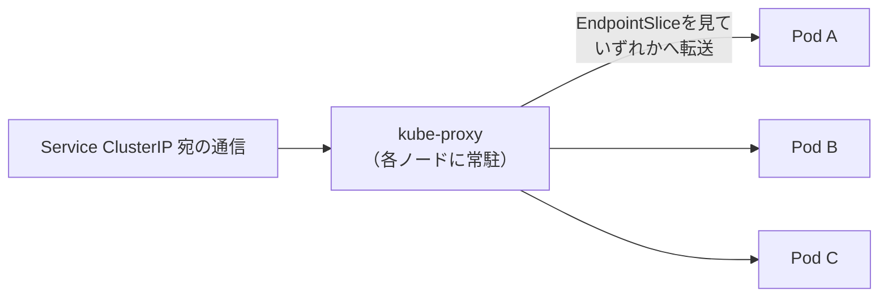
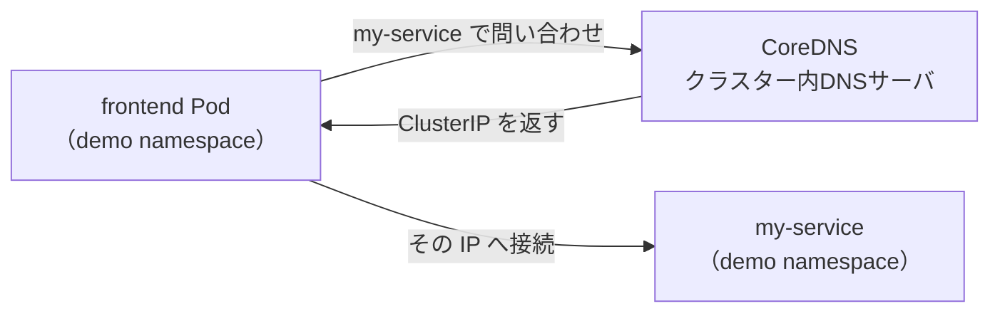
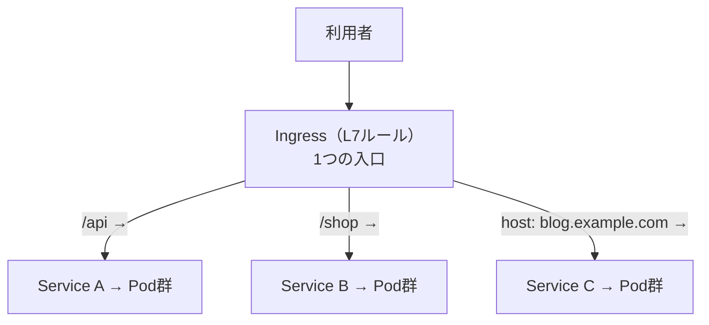
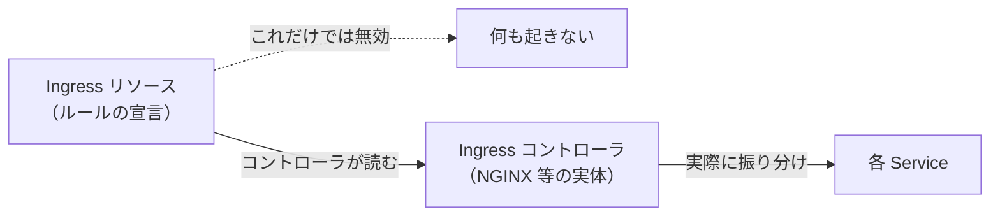

# AKS 学習ノート — 第4週：Kubernetes コア③ Service とネットワーク基礎（ClusterIP/NodePort/LoadBalancer・kube-proxy・DNS・Ingress）

## 学習目標

この週を終えると、次を自分の言葉で説明し、手を動かせる状態を目指す。

- **Service（サービス）** が解く問題（Pod は使い捨てで IP が変わる）を説明できる。
- Service がどうやって Pod を束ねるか（**ラベルセレクタ → EndpointSlice**）を説明できる。
- Service の3タイプ **ClusterIP / NodePort / LoadBalancer** の違いと使い分けを図で描ける。
- **kube-proxy** が Service 宛の通信を Pod へ振り分ける役割を説明できる。
- クラスター内 **DNS（CoreDNS）** と、名前で相手を見つける **サービスディスカバリ** の仕組みを説明できる。
- **Ingress（イングレス）** の概念と、「Ingress コントローラが無いと機能しない」ことを説明できる。
- W3 の **readiness Probe** が「どの Pod に振り分けるか」に直結することを説明できる。

---

## §0 この週の位置づけ

W3 で Pod を3個に増やし、更新でも入れ替わるようにした。すると当然の疑問が生じる——**「IP がころころ変わる複数の Pod に、どうやって安定してアクセスするのか」**。それに答えるのが **Service** である。



W4 は「素の Kubernetes」パート（W2〜W4）の最終回である。ここまでの Pod・Deployment・Service が Kubernetes の三本柱で、W5 以降の AKS 固有機能はすべてこの上に乗る。特に本週の **LoadBalancer / Ingress** は、W6（Azure ネットワーク）へ直結する。

---

## 1. Service が解く問題：Pod は使い捨てで IP が変わる

W2・W3 で学んだとおり、Pod は**使い捨て（ephemeral＝短命）**である。公式もこう言う。

> Pods are ephemeral resources (you should not expect that an individual Pod is reliable and durable). Each Pod gets its own IP address... the set of Pods running in one moment in time could be different from the set of Pods running that application a moment later.
> （Pod は短命な資源。個々の Pod が信頼でき永続すると期待してはならない。各 Pod は自分の IP を持つが、ある瞬間に動いている Pod の集合は、少し後には別の集合になり得る）
> — 出典：kubernetes.io / Service

すると困るのが、**Pod 同士（あるいは外部）からのアクセス**である。

> if some set of Pods (call them "backends") provides functionality to other Pods (call them "frontends") inside your cluster, how do the frontends find out and keep track of which IP address to connect to?
> （バックエンドの Pod 群にフロントエンドの Pod がアクセスしたいとき、どの IP につなげばいいかをどうやって知り、追い続けるのか）
> — 出典：kubernetes.io / Service

Pod が増減・入れ替わるたびに IP を追いかけるのは不可能。そこで**「変わらない、安定した名前と IP」を提供する層**が要る。それが Service である。

> **用語補足：ephemeral（エフェメラル＝短命・儚い）**
> 「一時的ですぐ消える」の意。Kubernetes では Pod の IP は Pod が作り直されるたびに変わる前提。Service はその**手前に置く不変の窓口**である。

---

## 2. Service とは何か

公式定義。

> In Kubernetes, a Service is a method for exposing a network application that is running as one or more Pods in your cluster.
> （Service は、クラスター内で1つ以上の Pod として動くネットワークアプリを**公開する方法**）

> Each Service object defines a logical set of endpoints (usually these endpoints are Pods) along with a policy about how to make those pods accessible.
> （各 Service は、論理的なエンドポイント集合（通常は Pod）と、それらへアクセスさせる方針を定義する）
> — 出典：kubernetes.io / Service

Service は「**変わらない仮想 IP と名前**」を1つ持ち、その裏で「**今生きている Pod 群**」へ通信を振り分ける。フロントエンドは Service の名前だけ知っていればよく、裏の Pod がいくつ増減しても関知しなくてよい。これが **decoupling（デカップリング＝疎結合化・切り離し）** である（"The Service abstraction enables this decoupling."）。



---

## 3. Service はどうやって Pod を束ねるか：セレクタ → EndpointSlice

Service も、対象の Pod を**名前ではなくラベルセレクタで**指名する（W2・W3 と同じ仕組み）。

```yaml
apiVersion: v1
kind: Service
metadata:
  name: my-service
spec:
  selector:
    app: web          # ← この条件に合う Pod を束ねる
  ports:
    - protocol: TCP
      port: 80         # Service が受けるポート
      targetPort: 9376 # Pod 側の実ポート
```

> The set of Pods targeted by a Service is usually determined by a selector that you define.
> （Service が対象とする Pod 群は、通常あなたが定義するセレクタで決まる）
> — 出典：kubernetes.io / Service

裏側では **EndpointSlice（エンドポイントスライス）** という仕組みが動く。

> The controller for that Service continuously scans for Pods that match its selector, and then makes any necessary updates to the set of EndpointSlices for the Service.
> （Service のコントローラはセレクタに合う Pod を絶えずスキャンし、EndpointSlice を必要に応じて更新する）
> — 出典：kubernetes.io / Service



> **W3 の readiness Probe がここで効く（重要）**
> EndpointSlice に載る（＝Service から通信が届く）のは、**readiness Probe に合格した Pod だけ**。W3 で「readiness 失敗＝振り分け対象から外す」と学んだのは、まさにこの EndpointSlice から外れることを指す。起動中・一時不調の Pod にトラフィックが行かないのは、この連携のおかげである。

> **用語補足：`port` と `targetPort`**
> - `port` … Service が受け付けるポート（利用者が叩く側）。
> - `targetPort` … 実際に Pod のコンテナが待ち受けるポート（転送先）。
> 「Service の 80 番で受けて、Pod の 9376 番へ流す」という付け替えができる。

---

## 4. Service の3タイプ：ClusterIP / NodePort / LoadBalancer

Service の `type` によって「どこからアクセスできるか」が変わる。これが W4 で最も重要な区別である。



上図のとおり、3タイプは**積み重ね**の関係にある（LoadBalancer は NodePort を内包し、NodePort は ClusterIP を内包する）。

| type | 到達範囲 | 何をするか | 主な用途 |
|---|---|---|---|
| **ClusterIP**（既定） | クラスター**内部のみ** | 内部専用の仮想 IP を1つ割り当てる | Pod 間通信（backend を frontend に見せる等） |
| **NodePort** | 各ノードの IP:固定ポート | 全ノードの同じポートを開け、そこへ来た通信を Service へ | 開発・デバッグ、L4 の外部公開の下地 |
| **LoadBalancer** | クラスター**外部**（外部 IP） | クラウドの L4 ロードバランサを作り外部 IP を付与 | 本番の外部公開（AKS では Azure Load Balancer が自動作成） |

> **AKS での効き方**：`type: LoadBalancer` を作ると、**AKS が Azure Load Balancer を自動でプロビジョニングし、パブリック IP を割り当てる**。素の Kubernetes では「クラウド任せ」なこの部分を、AKS が Azure と統合して実現する（W6 で内部 LB・詳細を扱う）。

> **注意：LoadBalancer は L4（TCP/UDP）**
> LoadBalancer / NodePort は**ポート単位**の公開（L4）。「/api は A、/web は B」のような **URL パス・ホスト名での振り分け（L7）** はできない。それをやりたいときが次の Ingress（§6）である。

> **用語補足：L4 / L7（レイヤー4 / レイヤー7）**
> OSI 参照モデルの層。L4＝トランスポート層（TCP/UDP、ポート単位）。L7＝アプリケーション層（HTTP、URL・ホスト名を理解）。LoadBalancer は L4、Ingress は L7 と覚える。

---

## 5. kube-proxy：通信を実際に Pod へ振り分ける

Service は「宛先の一覧（EndpointSlice）」を持つが、**実際に通信を各 Pod へ振り分ける**のは各ノード上の **kube-proxy（キューブプロキシ）** である（W1・§3.2 で名前だけ出た部品）。



- kube-proxy は各ノードで、Service の仮想 IP 宛パケットを**実際の Pod IP へ書き換えて転送**する（多くは iptables や IPVS を使う）。
- どの Pod へ振るかは EndpointSlice（＝readiness に合格した生きた Pod）から選ぶ。
- 結果として、利用者は「1つの安定した Service IP」に投げるだけで、負荷が複数 Pod へ分散される。

> **用語補足：proxy（プロキシ＝代理）**
> 「代理で通信を中継するもの」。kube-proxy は Service という仮想の宛先を、実在する Pod へ橋渡しする"代理人"である。AKS Automatic や新しめの構成では eBPF ベースの Cilium が kube-proxy 相当を担うこともあるが、役割（Service→Pod の振り分け）は同じ（W6 で触れる）。

---

## 6. DNS とサービスディスカバリ：名前で相手を見つける

Service には安定した IP が付くが、IP を直接書くのは不便。Kubernetes は **クラスター内 DNS** を持ち、**Service を名前で引ける**ようにしている。これが **サービスディスカバリ（service discovery＝サービスの発見）** である。

### 6.1 Service の DNS 名の形

> "Normal" (not headless) Services are assigned DNS A and/or AAAA records ... with a name of the form `my-svc.my-namespace.svc.cluster-domain.example`. This resolves to the cluster IP of the Service.
> （通常の Service には `my-svc.my-namespace.svc.クラスタードメイン` という形の DNS レコードが割り当てられ、Service の ClusterIP に解決される）
> — 出典：kubernetes.io / DNS for Services and Pods

```
<サービス名>.<Namespace>.svc.cluster.local
   例:  my-service.demo.svc.cluster.local
```

### 6.2 同じ Namespace なら短い名前で届く

各 Pod の `/etc/resolv.conf` に検索ドメインが設定されており、**同一 Namespace なら短縮名だけで解決**できる。

```
search <namespace>.svc.cluster.local svc.cluster.local cluster.local
```

- 同じ Namespace：`my-service` だけで届く。
- 別の Namespace：`my-service.<相手のnamespace>` と書けば届く（"a Pod in the _test_ namespace can successfully resolve either `data.prod` or `data.prod.svc.cluster.local`"）。



### 6.3 CoreDNS

クラスター内 DNS を実際に提供するのが **CoreDNS（コアディーエヌエス）**。W1・§6.5 で `kube-system` に見えた Pod の1つがこれである。kubelet が公開する Pod / Service の情報をもとに DNS を"プログラム"する。

> **なぜ嬉しいか**：アプリのコードに Pod の IP を焼き込む必要がなくなり、「`payment-service` に接続」のように**名前で書く**だけでよくなる。裏の Pod が何個でも、どう入れ替わっても、名前は不変。W12 の最終 PJ でもアプリは Service 名で相手を呼ぶ。

> **用語補足：DNS（Domain Name System＝ドメインネームシステム）**
> 「名前 → IP アドレス」を引く電話帳の仕組み。インターネットの `example.com → IP` と同じことを、クラスター内部の Service 名に対してやっているのが CoreDNS。

---

## 7. Ingress：HTTP/HTTPS を URL で振り分ける入口

LoadBalancer（§4）は L4 で、アプリを1つ外に出すたびに外部 IP（＝Azure Load Balancer のパブリック IP）を消費する。10 個のアプリを出したら 10 個の外部 IP、では非効率。かつ「`/api` は A、`/shop` は B、`app.example.com` は C」のような **URL/ホスト名での振り分け（L7）** もしたい。それを担うのが **Ingress** である。

### 7.1 Ingress とは

> Ingress exposes HTTP and HTTPS routes from outside the cluster to services within the cluster. Traffic routing is controlled by rules defined on the Ingress resource.
> （Ingress は、クラスター外から内部の Service への HTTP/HTTPS ルートを公開する。ルーティングは Ingress リソースに定義したルールで制御する）
> — 出典：kubernetes.io / Ingress

Ingress ができること：
- **ホスト名/パスベースのルーティング**（L7）：URL に応じて別の Service へ振り分け。
- **1つの入口の共有**：複数アプリを1つの外部 IP・入口の裏に集約。
- **SSL/TLS 終端**：HTTPS の証明書処理を入口で行う（"SSL termination and name-based virtual hosting"）。



### 7.2 【最重要】Ingress は「ルール」だけ。実行するコントローラが要る

初学者が必ずつまずく点。

> You must have an Ingress controller to satisfy an Ingress. Only creating an Ingress resource has no effect.
> （Ingress を満たすには **Ingress コントローラが必須**。Ingress リソースを作っただけでは**何も起きない**）
> — 出典：kubernetes.io / Ingress

Ingress リソースは「こう振り分けたい」という**設定（ルール）の宣言**にすぎない。それを実際に実行する**実体（ロードバランサやリバースプロキシ）＝Ingress コントローラ**を別途クラスターに入れる必要がある。



> **AKS での実体（W6 の伏線）**：AKS では **Application Routing アドオン（マネージド NGINX）** や自前の NGINX Ingress、あるいは **Application Gateway Ingress Controller（AGIC）** を Ingress コントローラとして使う。W6 でこれらを Azure ネットワークとして詳しく扱う。本週は「Ingress＝ルール、コントローラ＝実行者、両方要る」を押さえれば十分。

### 7.3 Ingress と LoadBalancer Service の違い

| | Service `type: LoadBalancer` | Ingress |
|---|---|---|
| 層 | L4（TCP/UDP、ポート単位） | L7（HTTP/HTTPS、URL・ホスト名） |
| 振り分け | ポート単位 | パス・ホスト名で細かく | 
| 任意プロトコル | できる（"expose arbitrary ports"） | HTTP/HTTPS のみ |
| 外部 IP の消費 | アプリごとに1つ増えがち | 1つの入口に集約できる |
| 必要なもの | Service だけ | Ingress リソース＋**Ingress コントローラ** |

> An Ingress does not expose arbitrary ports or protocols. Exposing services other than HTTP and HTTPS to the internet typically uses a service of type ... NodePort or ... LoadBalancer.
> （Ingress は任意のポート/プロトコルは公開しない。HTTP/HTTPS 以外を外に出すなら NodePort か LoadBalancer を使う）
> — 出典：kubernetes.io / Ingress

---

## 8. ハンズオン：ClusterIP → LoadBalancer で公開し、DNS で呼ぶ

W1 のクラスター（`aks-learn`）・W3 の Deployment（`web`, `app=web`）がある前提。`demo` Namespace で作業する。

### 8.1 ClusterIP で内部公開

`svc-clusterip.yaml`：
```yaml
apiVersion: v1
kind: Service
metadata:
  name: web
spec:
  selector:
    app: web          # W3 の Deployment の Pod を束ねる
  ports:
    - port: 80
      targetPort: 80
```
```bash
kubectl apply -f svc-clusterip.yaml -n demo
kubectl get svc,endpointslices -n demo
```
Service に ClusterIP が付き、EndpointSlice に W3 の Pod 3個の IP が並ぶのを確認（§3）。

### 8.2 DNS で名前解決を体感

```bash
kubectl run tmp -n demo --rm -it --image=busybox --restart=Never -- \
  sh -c "nslookup web && wget -qO- web"
```
一時 Pod から `web`（短縮名）だけで名前解決でき、`web.demo.svc.cluster.local` に解決されること、nginx の応答が返ることを確認（§6.2）。

### 8.3 readiness と EndpointSlice の連動を確認（任意）

W3 の Deployment に readiness Probe を付けて `apply` し、Pod が Ready になるまで EndpointSlice に載らない（＝振り分け対象に入らない）ことを `kubectl get endpointslices -n demo -o wide` で観察する。

### 8.4 LoadBalancer で外部公開

`svc-lb.yaml`：
```yaml
apiVersion: v1
kind: Service
metadata:
  name: web-public
spec:
  type: LoadBalancer
  selector:
    app: web
  ports:
    - port: 80
      targetPort: 80
```
```bash
kubectl apply -f svc-lb.yaml -n demo
kubectl get svc web-public -n demo -w
```
数分待つと `EXTERNAL-IP` にパブリック IP が入る（AKS が Azure Load Balancer を自動作成）。`curl http://<EXTERNAL-IP>` で外から nginx に届くことを確認。

> **コスト注意**：LoadBalancer はパブリック IP・Azure Load Balancer を消費し課金される。確認後は速やかに `kubectl delete svc web-public -n demo`。

### 8.5 後片付け

```bash
kubectl delete namespace demo
```
（クラスターごと止めるなら W1・§6.6）

---

## 9. 自己チェック

1. Service が解く問題を、「Pod は ephemeral」という語を使って説明せよ。
2. Service はどうやって対象 Pod を決めるか。EndpointSlice とは何で、そこに載る条件（W3 と連動）は何か。
3. ClusterIP / NodePort / LoadBalancer の到達範囲と用途を述べ、3者の「積み重ね」の関係を図で示せ。
4. `port` と `targetPort` の違いを述べよ。
5. kube-proxy の役割を一言で述べよ。Service の仮想 IP 宛の通信は最終的にどうやって Pod へ届くか。
6. Service の完全な DNS 名の形を書け。同じ Namespace の Pod が短縮名で届くのはなぜか。CoreDNS の役割は。
7. Ingress は何を解決するか（L4 の LoadBalancer に対する利点を2つ）。「Ingress リソースを作っただけでは何も起きない」のはなぜか。
8. Ingress と `type: LoadBalancer` の違いを、層（L4/L7）・プロトコル・外部 IP の消費の観点で述べよ。

---

## 10. 次週予告（W5：AKS クラスター構成 — コントロールプレーンとノードプール）

W2〜W4 で「素の Kubernetes」（Pod・Deployment・Service）を固めた。W5 からは **AKS 固有** の層に入る。まずクラスターそのものの構造から。

- コントロールプレーン（W1 で学んだ頭脳）を Azure が**マネージド**でどう提供するか（ティアと SLA）。
- **ノードプール（node pool）**：system プールと user プールの分離、なぜ分けるか。
- ノードの実体＝**VMSS（Virtual Machine Scale Sets＝仮想マシンスケールセット）**、ノードサイズ・台数の選び方。
- **spot ノードプール**（安価・中断あり）でコストを抑える。
- **クラスター/ノードのアップグレード**、メンテナンスウィンドウ。

W3 で学んだ requests が「Pod をどのノードに載せられるか」を左右した——W5 はその「ノード」側を Azure の視点から掘り下げる回である。

---

## 出典（公式ドキュメント）

- Kubernetes 公式 — Service：https://kubernetes.io/docs/concepts/services-networking/service/
- Kubernetes 公式 — DNS for Services and Pods：https://kubernetes.io/docs/concepts/services-networking/dns-pod-service/
- Kubernetes 公式 — Ingress：https://kubernetes.io/docs/concepts/services-networking/ingress/
- Kubernetes 公式 — EndpointSlices：https://kubernetes.io/docs/concepts/services-networking/endpoint-slices/
