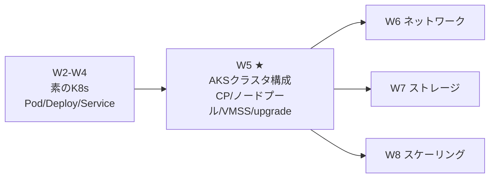
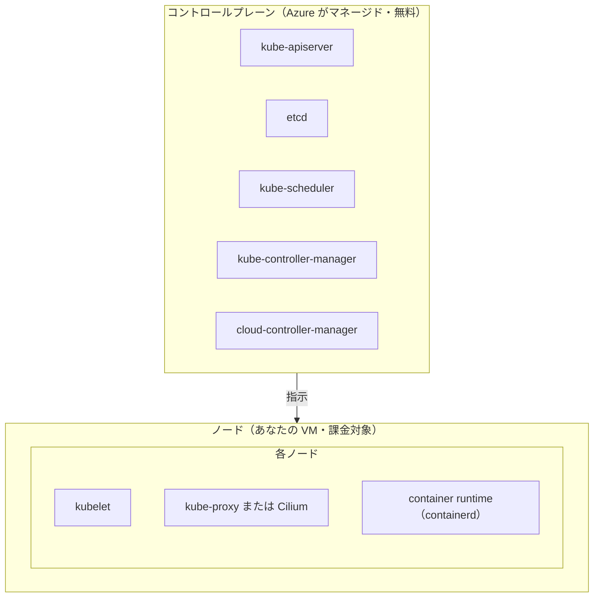
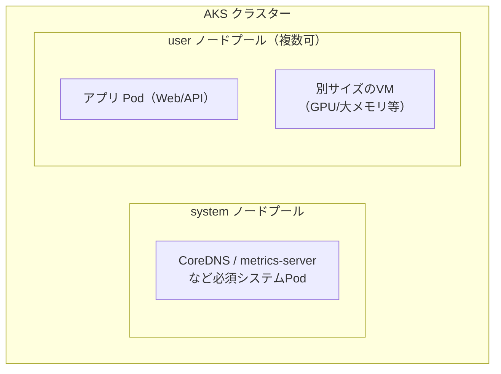
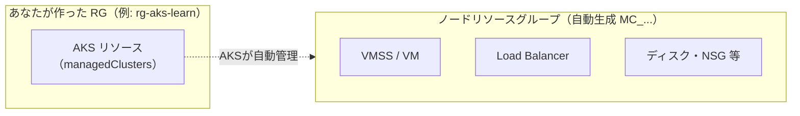
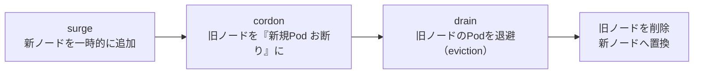

# AKS 学習ノート — 第5週：AKS クラスター構成（コントロールプレーン・ノードプール・VMSS・spot・アップグレード）

## 学習目標

この週を終えると、次を自分の言葉で説明し、手を動かせる状態を目指す。

- AKS の**コントロールプレーン**（Azure がマネージド）と**ノード**（あなたの VM）の責任分界を、部品名まで挙げて説明できる。
- **料金ティア（Free / Standard / Premium）** と稼働 SLA の関係を説明できる。
- **ノードプール（node pool）** とは何か、**system プール** と **user プール** をなぜ分けるかを説明できる。
- ノードの実体が **VMSS（Virtual Machine Scale Sets＝仮想マシンスケールセット）** であること、**ノードリソースグループ**が別に作られる理由を説明できる。
- **spot ノードプール**の仕組み（安価・中断あり・taint/toleration・system 不可）と適した用途を判断できる。
- クラスター/ノードの**アップグレード**（cordon & drain・max surge・PDB）と**メンテナンスウィンドウ**を説明できる。

---

## §0 この週の位置づけ

W2〜W4 で「素の Kubernetes」（Pod・Deployment・Service）を固めた。W5 からは **AKS 固有** の層に入る。まずクラスターそのものの構造から始める。



W1 で「コントロールプレーンは Azure が無料で管理、課金はノードだけ」と概観した。W3 で「requests が Pod をどのノードに載せられるかを左右する」と学んだ。W5 はその**ノード側**を Azure の視点から掘り下げ、「ノードをどう束ね（プール）、どう調達し（VMSS/spot）、どう保守する（アップグレード）」を扱う。W6〜W8 のネットワーク・ストレージ・スケールは、すべてこの「ノードプール」の上に乗る。

---

## 1. クラスターの2大構成：コントロールプレーンとノード

公式の分け方は明快である。

> An AKS cluster is divided into two main components:
> - **Control plane**: provides the core Kubernetes services and orchestration of application workloads.
> - **Nodes**: the underlying virtual machines (VMs) that run your applications.
> （AKS クラスターは2つの主要素に分かれる。コントロールプレーン＝コア Kubernetes サービスとワークロードのオーケストレーション。ノード＝アプリを動かす土台の VM）
> — 出典：Microsoft Learn / AKS Core Concepts



### 1.1 コントロールプレーン（Azure 管理）

W1・§3.1 で概観した頭脳部品を、AKS では**すべて Azure が運用**する。

| 部品 | 役割 |
|---|---|
| `kube-apiserver` | クラスターへの唯一の入口（内外からの要求を受ける） |
| `etcd` | クラスターの状態・構成を保つ高可用キーバリューストア |
| `kube-scheduler` | 未割り当ての Pod を見て、どのノードに載せるか決める |
| `kube-controller-manager` | 各種コントローラを回す（ノード停止の検知・対応など） |
| `cloud-controller-manager` | **クラウド固有**の制御ロジック（Azure LB やディスクとの統合） |

> The control plane remains Azure-managed in both AKS Automatic and AKS Standard.
> （コントロールプレーンは Automatic でも Standard でも Azure マネージドのまま）
> — 出典：Microsoft Learn / AKS Core Concepts

> **用語補足：cloud-controller-manager（クラウドコントローラマネージャ）**
> 素の Kubernetes には無い/汎用な部品で、**Azure と Kubernetes をつなぐ通訳**。W4 で `type: LoadBalancer` を作ると Azure Load Balancer が自動生成されたのは、この部品が Azure 側 API を叩いているから。W6 のネットワーク、W7 のディスク自動作成もここが効く。

### 1.2 ノード（あなたの VM）

各ノードは Azure VM で、W1・§3.2 の Kubernetes ノード部品が乗る。

| 部品 | 役割 |
|---|---|
| `kubelet` | Pod のコンテナが動いていることを保証する現場監督 |
| `kube-proxy` または **Cilium** | Service 宛通信の振り分け（W4）。Azure CNI powered by Cilium 構成では kube-proxy の代わりに Cilium |
| container runtime（**containerd**） | コンテナの実行・ライフサイクル管理（K8s 1.19+ の Linux は containerd） |

> **用語補足：リソース予約（resource reservation）**
> ノードの CPU・メモリの全部がアプリに使えるわけではない。AKS は kubelet や OS のために CPU とメモリを**予約**する。だから「ノードの総資源」と「Pod に割り当て可能な資源（allocatable）」にはズレがある（"AKS reserves two types of resources, CPU and memory, on each node"）。W3 の requests を設計するときは、この allocatable を基準に考える。

---

## 2. 料金ティア（Free / Standard / Premium）と SLA

AKS の**クラスター管理**の料金ティアは3つ。これは「コントロールプレーンにいくら払うか（＝どれだけの信頼性・機能を得るか）」の選択で、W1・W5 の「ノード課金」とは別軸である。

| ティア | 内容 |
|---|---|
| **Free** | 現行の全 AKS 機能を含む。最大 **1,000 ノード**。**稼働 SLA なし**（金銭補償なし） |
| **Standard** | 稼働 SLA が既定で有効。より高い信頼性。最大 **5,000 ノード** |
| **Premium** | 全機能＋コミュニティ超えの長期サポート（Microsoft の追加保守） |

出典：Microsoft Learn / AKS Core Concepts（Pricing tiers 表）

> **紛らわしい点：料金ティアの "Standard" とクラスターモードの "AKS Standard" は別物**
> 公式も注記している（"The Standard pricing tier is separate from AKS Standard cluster mode."）。
> - **クラスターモード**（Automatic / Standard）＝どこまで Azure に任せるか（W1・§4.2）。
> - **料金ティア**（Free / Standard / Premium）＝コントロールプレーンの SLA・規模・サポート。
> 学習では **Free ティア**（SLA 不要）、本番では **Standard ティア**（稼働 SLA）を選ぶのが定石。

> **用語補足：稼働 SLA（uptime SLA）**
> 「コントロールプレーン（apiserver）が一定割合の時間ちゃんと応答します」という金銭補償付きの約束。Free には無い。本番でクラスターが業務の中核なら Standard 以上にする。

---

## 3. ノードプール：ノードを役割で束ねる

### 3.1 ノードプールとは

> In AKS, nodes are grouped together into *node pools*. By default, node pools use Virtual Machine Scale Sets to manage the VMs that run your applications.
> （AKS ではノードを**ノードプール**にまとめる。既定でノードプールは VMSS で VM を管理する）
> — 出典：Microsoft Learn / AKS Core Concepts

**ノードプール＝同じ設定（VM サイズ・OS・K8s バージョン等）を共有するノードの集まり**。1つのクラスターに複数のプールを持て、プールごとに違う VM サイズや OS を割り当てられる。

### 3.2 system プールと user プール

公式は用途で2種類に分ける。

| プール種別 | 主目的 | 具体例 |
|---|---|---|
| **system ノードプール** | **クラスター必須のシステム Pod** をホスト | CoreDNS、konnectivity-agent、metrics-server 等 |
| **user ノードプール** | **あなたのアプリ Pod** をホスト | Web/API などの業務ワークロード |

> When you create an AKS cluster, you define the initial number of nodes ... which creates a *system node pool*. System node pools serve the primary purpose of hosting critical system pods, such as CoreDNS ... To support applications that have different compute or storage demands, you can create *user node pools*.
> — 出典：Microsoft Learn / AKS Core Concepts



> **なぜ分けるのか**：システム Pod（CoreDNS など）が落ちるとクラスター全体が不調になる。アプリが暴走してノード資源を食い潰しても、**システム Pod は別プール（別 VM）にいて巻き込まれない**ようにするのが狙い。本番では「system プールにはアプリを載せない（専用にする）」のが定石。学習用の1ノードクラスター（W1）は system プール1つで兼用しているだけである。

> **用語補足：taint / toleration（テイント／トレレーション）**
> - **taint（汚れ・忌避）**＝ノードに付ける「原則ここに Pod を置くな」という札。
> - **toleration（許容）**＝Pod 側に付ける「その札を我慢して置いてよい」という許可証。
> system プールを「アプリお断り」にしたり、後述の spot プールを「中断耐性のある Pod だけ」に絞るのに使う。§5 で実際に出てくる。

---

## 4. VMSS とノードリソースグループ

### 4.1 ノードの実体は VMSS

ノードプールの VM は、既定で **VMSS（Virtual Machine Scale Sets＝仮想マシンスケールセット）** で管理される。

> **用語補足：VMSS（Virtual Machine Scale Sets）**
> Virtual Machine＝仮想マシン、Scale Sets＝規模の集合。「**同一構成の VM を、まとめて増減できる**」Azure の仕組み。ノードを1台→10台に増やすとき、VMSS が同じ設定の VM を9台複製する。W8 の Cluster Autoscaler が「ノードを増やす」とき、実際に叩かれるのがこの VMSS である。

### 4.2 ノードリソースグループ（自動でできる2つ目の箱）

AKS を作ると、リソースグループが**2つ**できる。

> When you create an AKS cluster in an Azure resource group, the AKS resource provider automatically creates a second resource group called the *node resource group*. This resource group contains all the infrastructure resources associated with the cluster, including VMs, Virtual Machine Scale Sets, and storage.
> （AKS を作ると、AKS リソースプロバイダが**ノードリソースグループ**という2つ目の RG を自動作成する。VM・VMSS・ストレージなどのインフラ資源が入る）
> — 出典：Microsoft Learn / AKS Core Concepts



- **RG1（あなたの箱）**：`Microsoft.ContainerService/managedClusters` という AKS 本体リソース。
- **RG2（ノードリソースグループ）**：既定名は `MC_<RG1>_<クラスタ名>_<リージョン>`。中の VMSS・LB・ディスクは **AKS が自動管理**する領域。

> **注意：ノードリソースグループの中身を手で触らない**
> ここは AKS が管理する前提の箱。中の VMSS や LB を手動で書き換えると、AKS の管理と食い違って壊れやすい。ノードを増減したいなら `az aks nodepool` や `az aks scale`（＝RG1 側の操作）を使う。W1 で「クラスターを消すと箱ごと消える」と言ったのは、この2つの RG がまとめて片付くことも含む。

---

## 5. spot ノードプール：安いが中断される

コストを抑えたいバッチ処理・開発環境向けに、**spot（スポット）ノードプール**がある。

> A Spot node pool is a node pool backed by an Azure Spot Virtual Machine scale set. With Spot VMs ... you can take advantage of unutilized Azure capacity with significant cost savings. ... There's no SLA for the Spot nodes. ... If Azure needs capacity back, the Azure infrastructure evicts the Spot nodes.
> （spot ノードプールは Azure Spot VMSS が土台。**Azure の余剰容量を大幅割引**で使える。ただし **SLA なし・高可用性の保証なし**。Azure が容量を必要とすれば**ノードは追い出される（eviction）**）
> — 出典：Microsoft Learn / Add a Spot node pool to AKS

### 5.1 spot の性質と制約

| 観点 | 内容 |
|---|---|
| メリット | 余剰容量を**大幅割引**で利用（コスト削減） |
| デメリット | **いつでも追い出され得る**（eviction）。SLA なし・HA 保証なし |
| プール制約 | **system/default プールにはできない**（"can't be a default node pool, it can only be used as a secondary pool"）＝必ず user プール |
| 土台 | **VMSS 必須** |
| 目印 | `kubernetes.azure.com/scalesetpriority:spot` ラベルと `...=spot:NoSchedule` **taint** が自動で付く |
| 使うには | Pod 側に対応する **toleration** と node affinity が必要 |
| 適した用途 | バッチ処理・開発/テスト・中断に耐える大規模計算 |

> **taint/toleration の実例（§3.2 の応用）**：spot ノードには自動で `NoSchedule` の taint が付く。だから普通の Pod は spot に載らない（追い出されると困るから）。中断に耐えられる Pod にだけ toleration を付けて、意図的に spot へ載せる。これで「安い spot には壊れてもいいものだけ」を担保する。

### 5.2 最大価格（max price）と eviction ポリシー

- `--spot-max-price -1` … 「価格による追い出しはしない」（容量都合の追い出しは依然あり）。正の値なら「1時間あたりその USD 額を超えたら追い出す」（最大5桁小数）。
- `--eviction-policy Delete`（既定）… 追い出されたノードは削除。`Deallocate` は停止状態で残るが**クォータを消費し続ける**ため、スケール/アップグレードで問題になり得る。
- **Cluster Autoscaler 併用が推奨**（追い出し後、必要なら別ノードを補充。W8 で詳説）。

> **判断の勘所**：本番の常時稼働サービスに spot は不向き（いつ消えるか分からない）。「消えても再実行すればよい」「多少落ちても困らない」ワークロードにだけ使う。system プール（＝クラスターの土台）は絶対に spot にできない、が肝。

---

## 6. アップグレード：止めずに新バージョンへ

Kubernetes は活発に更新される。AKS では**コントロールプレーン**と**各ノードプール**をアップグレードする。ノードの入れ替えは W3 のローリング更新に似た「少しずつ」方式で行う。

### 6.1 cordon & drain と max surge

ノードを新バージョンに入れ替えるとき、AKS は各ノードで次を行う。



| 用語 | 読み | 意味 |
|---|---|---|
| **cordon** | コードン（封鎖） | ノードを「新しい Pod を受け付けない」状態にする（既存 Pod はまだ動く） |
| **drain** | ドレイン（排出） | ノード上の Pod を退避（eviction）させ、他ノードへ移す |
| **max surge** | マックスサージ（急増上限） | アップグレード中に**一時的に追加**してよいノードの割合/数 |

> 本番の推奨値：`maxSurge=33%`, `maxUnavailable=1`（"Use `maxSurge=33%` ... for production"）。surge を大きくすると速いが、その分だけ余分なノード（＝IP・クォータ）が要る。開発は `maxSurge=50%` 等。
> — 出典：Microsoft Learn / AKS Upgrade Options

### 6.2 PDB：drain でアプリを落としすぎない

drain は Pod を追い出すので、下手をするとアプリの稼働 Pod が一斉に消える。それを防ぐのが **PDB（Pod Disruption Budget＝Pod 中断予算）**。

> **用語補足：PDB（Pod Disruption Budget）**
> 「アップグレードなどの**自発的な中断（voluntary disruption）**の際、**同時に落としてよい Pod 数の下限/上限**」を宣言するオブジェクト。例：「web は常に最低2個は動かしておく」。drain はこの予算を尊重して、予算を割るような退避を待つ/拒否する。W3 の readiness と並ぶ「安全にアプリを動かし続ける」ための道具。

drain が PDB に阻まれて進まない場合の対処（`--undrainable-node-behavior Cordon` で該当ノードを隔離、`Quarantined` ラベル、force upgrade で PDB を無視 等）もあるが、詳細は運用回。ここでは「**アップグレードは drain を伴い、PDB で守る**」を押さえる。

### 6.3 メンテナンスウィンドウ（Planned Maintenance）

アップグレードやノード OS の更新を**いつ実施してよいか**を制御するのが **Planned Maintenance（計画メンテナンス）／メンテナンスウィンドウ**。

- 低トラフィックの時間帯に自動アップグレードを寄せる（"Schedule auto-upgrade during low-traffic periods. Use at least four hours."）。
- 「毎週日曜の深夜だけ」等の窓を設定でき、業務時間中の予期せぬ入れ替えを避ける。

> **アップグレードの全体像**：`max surge`（どれだけ並列に）＋`PDB`（どれだけ落としてよいか）＋`メンテナンスウィンドウ`（いつやるか）＋`node drain timeout`（退避をどれだけ待つか）を組み合わせて、**低停止で確実な**アップグレードを狙う。AKS Automatic ではこれらが既定で管理され、Standard では自分で調整する。

> **spot のアップグレードは特殊**：spot プールのアップグレードは cordon と eviction 通知は出るが **drain はされず、surge ノードも無い**（元々いつ消えてもいい前提だから）。system/user の通常プールとは扱いが違う。

---

## 7. ハンズオン：ノードプールを覗き、user プールと spot プールを足す

W1 のクラスター（`rg-aks-learn` / `aks-learn`）がある前提。

### 7.1 クラスターとノードプールの構造を覗く

```bash
az aks show -g rg-aks-learn -n aks-learn --query "{tier:sku.tier, k8s:kubernetesVersion, nodeRG:nodeResourceGroup}" -o table
az aks nodepool list -g rg-aks-learn --cluster-name aks-learn -o table
```
料金ティア・K8s バージョン・**ノードリソースグループ名**（`MC_...`）・既存の system プールが見える（§2・§3・§4）。

```bash
kubectl get nodes -o wide
kubectl get pods -n kube-system
```
system プール上で CoreDNS 等が動いていることを確認（§3.2）。

### 7.2 user ノードプールを追加

```bash
az aks nodepool add \
  --resource-group rg-aks-learn \
  --cluster-name aks-learn \
  --name userpool \
  --node-count 1 \
  --node-vm-size Standard_B2s \
  --mode User
```
`--mode User` で user プールとして追加（§3.2）。`az aks nodepool list ... -o table` で2プールになったことを確認。

### 7.3 spot ノードプールを追加（任意・コスト注意）

```bash
az aks nodepool add \
  --resource-group rg-aks-learn \
  --cluster-name aks-learn \
  --name spotpool \
  --priority Spot \
  --eviction-policy Delete \
  --spot-max-price -1 \
  --enable-cluster-autoscaler --min-count 1 --max-count 2 \
  --node-vm-size Standard_B2s
```
```bash
az aks nodepool show -g rg-aks-learn --cluster-name aks-learn -n spotpool \
  --query "{priority:scaleSetPriority, taints:nodeTaints, labels:nodeLabels}" -o json
```
`scaleSetPriority: Spot`、`...=spot:NoSchedule` の taint、`scalesetpriority: spot` ラベルが付くことを確認（§5）。この taint のせいで、toleration の無い普通の Pod は spot に載らない。

### 7.4 後片付け

```bash
az aks nodepool delete -g rg-aks-learn --cluster-name aks-learn -n spotpool --no-wait
az aks nodepool delete -g rg-aks-learn --cluster-name aks-learn -n userpool --no-wait
```
（クラスターごと止めるなら W1・§6.6 の `az group delete`）

---

## 8. 自己チェック

1. AKS のコントロールプレーンとノードの責任分界を述べよ。コントロールプレーンの部品を3つ以上挙げ、cloud-controller-manager は何をするか説明せよ。
2. 料金ティア Free / Standard / Premium の違いを述べよ。「料金ティアの Standard」と「クラスターモードの AKS Standard」はどう違うか。
3. ノードプールとは何か。system プールと user プールをなぜ分けるのか。
4. taint と toleration の関係を説明せよ。system プールを「アプリお断り」にするのにどう使うか。
5. ノードの実体（VMSS）とは何か。AKS を作ると RG が2つできるのはなぜか。ノードリソースグループの中を手で触ってはいけないのはなぜか。
6. spot ノードプールの利点と最大のリスクを述べよ。spot にできない/すべきでないものは何か（system プールは？常時稼働サービスは？）。
7. アップグレードの cordon・drain・max surge をそれぞれ説明せよ。PDB は drain の際に何を守るか。
8. メンテナンスウィンドウは何を制御するか。低停止アップグレードのために組み合わせる要素を3つ挙げよ。

---

## 9. 次週予告（W6：ネットワーク（Azure））

W5 で「ノードをどう束ね・調達・保守するか」を押さえた。W6 は、そのノードと Pod が**どう通信するか**という Azure ネットワークに踏み込む。W4 の Service/Ingress が Azure の実体と結びつく回である。

- **kubenet vs Azure CNI**：Pod にどう IP を配るか（CNI＝Container Network Interface）。Overlay / Pod サブネットの違い。
- **Ingress コントローラの実体**：Application Routing アドオン（マネージド NGINX）、自前 NGINX、**Application Gateway Ingress Controller（AGIC）**。
- **内部 LoadBalancer**（外部 IP を出さず VNet 内だけに公開）。
- **ネットワークポリシー**：Pod 間通信の許可/拒否をルールで制御。

W4 で「LoadBalancer は Azure LB が自動生成」「Ingress はコントローラが必須」と伏線を張った——W6 でその Azure 側の実体を明らかにする。

---

## 出典（公式ドキュメント）

- Microsoft Learn — AKS Core Concepts：https://learn.microsoft.com/en-us/azure/aks/core-aks-concepts
- Microsoft Learn — Add a Spot node pool to AKS：https://learn.microsoft.com/en-us/azure/aks/spot-node-pool
- Microsoft Learn — Upgrade options and recommendations for AKS clusters：https://learn.microsoft.com/en-us/azure/aks/upgrade-options
- Microsoft Learn — System node pools：https://learn.microsoft.com/en-us/azure/aks/use-system-pools
- Microsoft Learn — Pricing tiers for AKS cluster management：https://learn.microsoft.com/en-us/azure/aks/free-standard-pricing-tiers
- Microsoft Learn — Use planned maintenance：https://learn.microsoft.com/en-us/azure/aks/planned-maintenance
