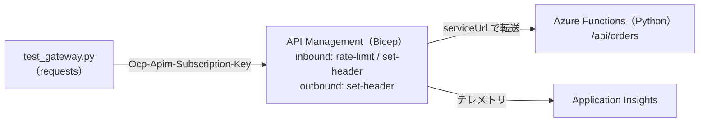

# Week 10 — 実装：Bicep + Python Function + ポリシー + E2E テスト

> **実装フェーズ** | 学習プラン Week 10 / 10  
> 学習目標：これまでポータルで触れた要素を **Bicep で IaC 化**し、Python の Azure Function をバックエンドに、APIM をファサードとして公開し、ポリシー込みで E2E に動かす

---

## 0. 総仕上げの位置づけ

Week 1〜9 で学んだ概念を、**実際に動くもの**として組み上げる。手を動かして「点」を「線」にする週。

| これまで学んだ概念 | 今週どこで使うか |
|---|---|
| オブジェクトモデル（Week 2） | Bicep の API/Operation/Product/Subscription/Backend/Named value |
| ポリシー（Week 3/4） | `infra/policies/api-policy.xml`（rate-limit / set-header） |
| セキュリティ（Week 5） | サブスクリプションキー認証・Managed Identity（オプション） |
| 監視（Week 8） | App Insights + 診断設定を Bicep で接続 |
| IaC / CI-CD（Week 9） | Bicep で宣言的にデプロイ（APIOps の代替アプローチ） |

---

## 1. 構築する全体像



---

## 2. 成果物（ディレクトリ）

```
api-management/
├── infra/
│   ├── main.bicep            APIM + App Insights + API/ポリシー/プロダクト/サブスク 等
│   ├── main.bicepparam       パラメータ（publisherEmail / backendUrl を自分の値に）
│   └── policies/
│       └── api-policy.xml     API スコープのポリシー（loadTextContent で読み込む）
└── code/
    ├── function_app/
    │   ├── function_app.py    Orders API（Python v2 モデル・GET/POST）
    │   ├── host.json
    │   └── requirements.txt
    └── test_gateway.py        E2E テスト（200 / 401 / 429 を検証）
```

> **ポイント**：ポリシー XML は Bicep の外部ファイルにし、`loadTextContent('policies/api-policy.xml')` で読み込む。XML をコードとして管理でき、レビュー・差分が見やすい（Week 9 の「構成はコードが真実」）。

---

## 3. 実装ステップ

### ① バックエンド（Azure Functions）をデプロイ
```bash
cd api-management/code/function_app
# 例：Azure Functions Core Tools で作成済みの Function App に発行
func azure functionapp publish <your-function-app-name>
```
- ローカル確認：`func start` → `curl http://localhost:7071/api/orders/42`
- Function の公開 URL（`https://<func>.azurewebsites.net/api`）を控える

### ② Bicep パラメータを設定
`infra/main.bicepparam` の `publisherEmail` と `backendUrl`（①の URL）を自分の値に変更。

### ③ APIM 一式をデプロイ
```bash
az group create -n rg-apim-week10 -l japaneast
az deployment group create \
  --resource-group rg-apim-week10 \
  --template-file infra/main.bicep \
  --parameters infra/main.bicepparam
```
> ⚠️ **Developer ティアの APIM 作成は 30〜45 分かかる**（Week 1）。気長に待つ。

### ④ サブスクリプションキーを取得
出力 `apimName` を使って primaryKey を取得：
```bash
az apim subscription show \
  --resource-group rg-apim-week10 \
  --service-name <apimName> \
  --subscription-id starter-sub \
  --query primaryKey -o tsv
```
（またはポータルの **Subscriptions → Starter subscription** から primary key をコピー）

### ⑤ E2E テスト
```bash
export APIM_GATEWAY_URL="<出力 apimGatewayUrl>"   # https://<apim>.azure-api.net/store
export APIM_SUBSCRIPTION_KEY="<④で取得したキー>"
pip install requests
python code/test_gateway.py
```
期待結果：キー付き=200 / キーなし=401 / 連打で 429。

---

## 4. Verification（動作確認）

- [ ] `az deployment group create` が成功する
- [ ] キー付きで `GET /store/orders/42` が **200** + JSON を返す
- [ ] キーなしで **401 Access denied**
- [ ] 連打で **429 Too Many Requests**（`X-RateLimit-Remaining` ヘッダも確認）
- [ ] レスポンスに outbound ポリシーの `X-Powered-By: apim-week10` が付く
- [ ] Application Insights にリクエストのテレメトリが記録される（数分後）
- [ ] **最終自己評価**：Week 1 のリクエストフロー図を再描画し、APIM を知らない開発者向けに 500 字で説明を書く

---

## 5. 発展（任意）

- **Managed Identity でバックエンド認証**（Week 5）：Function App に Easy Auth を構成し、`api-policy.xml` の backend セクションの `authentication-managed-identity` を有効化。APIM の MI に対象ロールを付与
- **Key Vault 参照 Named value**（Week 5）：シークレットを Key Vault に置き、MI に `Key Vault Secrets User` を付与して参照
- **キャッシュ**（Week 9）：GET 操作に `cache-lookup`/`cache-store` を追加
- **APIOps**（Week 9）：このインスタンスを Extractor で Git 化してみる

---

## 6. 自己チェック

1. **Bicep で APIM 子リソース（api/policy/product/subscription）の依存順序をどう表現するか？**
   - キーワード：parent プロパティ・暗黙の依存・必要なら dependsOn

2. **`authentication-managed-identity` を使うと Function 呼び出しの認証はどう変わるか？**
   - キーワード：MI で Entra トークン取得・キーレス・Function 側に Entra 認証が要る

3. **ポリシー XML を Bicep の外部ファイル（loadTextContent）にする利点は？**
   - キーワード：コードとして管理・レビュー/差分・再利用

4. **ローカルから `az` でデプロイする前に必要な認証コマンドは？**
   - キーワード：`az login`・サブスクリプション選択（`az account set`）

5. **キーなしが 401、連打が 429 になるのは、それぞれどのポリシー/仕組みか？**
   - キーワード：サブスクリプション必須(Week 2)、rate-limit-by-key(Week 4)

---

## 7. 学習プラン完走 🎉

Week 1〜10 で、APIM を「設計思想 → オブジェクト → ポリシー → セキュリティ → ライフサイクル → ネットワーク → 運用 → 高度な機能 → 実装」と一周した。
- **到達点**：APIM + バックエンドを Bicep でゼロから設計・構築・デプロイし、ポリシーで保護して E2E に動かせる
- **次の一歩**：Managed Identity / Key Vault / キャッシュ / AI ゲートウェイ / APIOps を実際に足してみる（§5）
