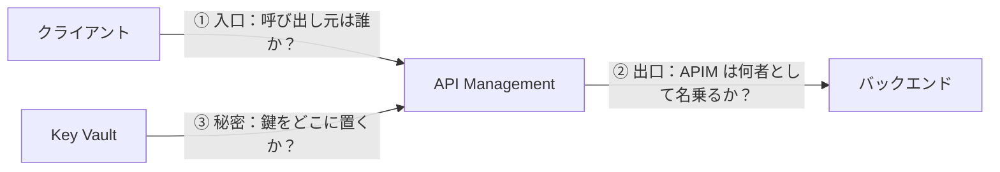
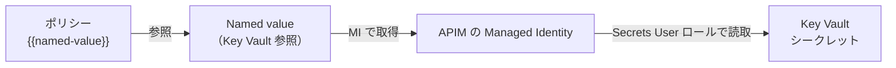

# Week 5 — セキュリティ

> **Phase 2a** | 学習プラン Week 5 / 10  
> 学習目標：APIM のセキュリティ手段を「クライアント認証」「バックエンド認証」「シークレット管理」に分類して理解し、JWT 検証ポリシーと Managed Identity の使いどころを説明できる

---

## 0. セキュリティを 3 つの問いに分解する

APIM のセキュリティは機能が多くて混乱しやすい。次の 3 つの問いに分けると整理できる。



| 問い | 守る場所 | 主な手段 |
|---|---|---|
| ① クライアント認証 | 入口（C→A） | サブスクリプションキー / `validate-jwt` / クライアント証明書 |
| ② バックエンド認証 | 出口（A→B） | `authentication-managed-identity` / 証明書 / Basic |
| ③ シークレット管理 | 横断 | Named value の **Key Vault 参照** |

> Week 2 で出た「サブスクリプションキー」は①の最も基本的な手段。今週はそれ以外の本格的な認証を足していく。

---

## 1. ① クライアント認証（入口の保護）

「この呼び出し元を通してよいか」を判定する。

### 手段の比較

| 手段 | 認証するもの | 強さ・用途 |
|---|---|---|
| サブスクリプションキー | 「有効なキーを持っているか」 | 簡易。誰が・何の権利で、の管理向き。**本人性の証明は弱い** |
| `validate-jwt` | OAuth2/OIDC のトークン（署名・発行者・対象・クレーム） | **本番の認証の中核**。ユーザー/アプリの ID を検証 |
| クライアント証明書（mTLS） | クライアントが持つ証明書 | 強力。B2B・高セキュリティ用途 |

> **重要**：サブスクリプションキーは「鍵を持っているか」だけ。漏れたら誰でも使える。
> 本番でユーザーやアプリの**身元**を確かめるなら `validate-jwt`（OAuth2）を使う。両方を併用することも多い（キーで利用枠管理 + JWT で本人確認）。

### `validate-jwt`（最重要）

外部の ID プロバイダ（Microsoft Entra ID など）が発行した **JWT（JSON Web Token）の存在と正当性を検証**するポリシー。APIM を OAuth2 のリソースサーバとして機能させる。

> **JWT（JSON Web Token）とは？**
> ひとことで言うと「**改ざんできない、署名付きの身分証明書をテキスト1本にしたもの**」。ログイン後に ID プロバイダが発行し、「私は確かに本人です」とサーバーに示すために使う。
>
> **イメージ**：割り印（署名）入りのパスポート。発行機関だけが作れる署名が押してあるので、偽造・改ざんするとバレる。だから受け取った APIM は発行機関に毎回問い合わせなくても、**署名を検証するだけ**で本物と判断できる。
>
> **構造**：`ヘッダ . ペイロード . 署名` の3つを `.` でつないだ文字列。
> ```
> eyJhbGc...  .  eyJzdWI...  .  SflKxwRJ...
>    ①ヘッダ        ②ペイロード      ③署名
> ```
> | パート | 中身 |
> |---|---|
> | ① ヘッダ | 署名アルゴリズムなど（例 `{"alg":"RS256"}`） |
> | ② ペイロード（**クレーム**） | 主張したい情報（例 `{"sub":"user123","aud":"my-api","exp":...,"roles":["finance"]}`） |
> | ③ 署名 | ①②を秘密鍵で署名した値（改ざん検知用） |
>
> ⚠️ ①②は **Base64 エンコードされているだけで暗号化ではない** → 誰でもデコードして中身を読める。だから秘密情報は入れない。守っているのは「中身の機密」ではなく「**改ざんされていないこと**」。
>
> **クレーム（claim）** = ペイロードの中の各項目。`iss`(発行者) / `aud`(対象) / `exp`(有効期限) / `sub`(ユーザーID) / `roles`・`scp`(権限) など。validate-jwt はこれらを検証する。

> **よくある疑問：「誰でも中身を読めるなら、誰でも使えてしまうのでは？」**
> 答えは **No**。「読める」と「使える/作れる」は別のこと。
>
> | 操作 | 誰でもできる？ | なぜ |
> |---|---|---|
> | ① 中身を**読む**（デコード） | ✅ できる | Base64 なので。でも中身は秘密ではないので無害 |
> | ② 中身を**書き換える**（例：自分を admin に） | ❌ できない | 署名が合わなくなり検証で弾かれる |
> | ③ 有効な JWT を**ゼロから偽造** | ❌ できない | 署名には発行者の**秘密鍵**が必要。発行者しか持たない |
> | ④ 他人の**本物の JWT を丸ごと盗んで使う** | ⚠️ できてしまう | これが唯一の弱点（下記） |
>
> **なぜ改ざん・偽造ができないか**：署名は「内容を秘密鍵で計算した値」。内容を書き換えると署名とズレてバレる。正しい署名を作り直すには秘密鍵が要るが、それは発行者だけが持つ（**公開鍵で検証・秘密鍵で署名**）。
> 例え：割り印つきの契約書。中身は読めるが、一文字でも書き換えると割り印とズレる。割り印を押せるのは発行者だけ。
>
> **④だけが本当の弱点（Bearer の性質）**：JWT は「持っている人＝本人」とみなす持参人方式。本物を丸ごと盗まれると盗んだ人も使える（電車の切符と同じ）。だから対策がセット：
> - **HTTPS 必須**（通信路で盗み見されない）
> - **有効期限 `exp` を短く**（盗まれても短時間で無効）
> - **秘密情報を JWT に入れない**（読まれる前提）
>
> まとめ：守っているのは「中身を隠すこと」ではなく「**改ざん・偽造を防ぐこと**」（＝署名）。読めるのは仕様どおり。ただし盗難は別問題なので HTTPS と短い有効期限で守る。

検証する内容：
- **署名** … 本物の発行者が署名したか（改ざんされていないか）
- **issuer（発行者）** … 信頼する発行元か
- **audience（対象）** … この API 向けのトークンか
- **expiration（有効期限）** … 失効していないか（既定で必須）
- **required-claims** … 必要なロール/スコープを持つか

公式例（Microsoft Entra ID シングルテナント）：
```xml
<validate-jwt header-name="Authorization" failed-validation-httpcode="401"
              failed-validation-error-message="Unauthorized. Token is missing or invalid.">
  <openid-config url="https://login.microsoftonline.com/contoso.onmicrosoft.com/.well-known/openid-configuration" />
  <audiences>
    <audience>00001111-aaaa-2222-bbbb-3333cccc4444</audience>
  </audiences>
</validate-jwt>
```

> **公式確認メモ**
> - トークンの場所は 3 通り：`header-name`（通常 `Authorization`）/ `query-parameter-name` / `token-value`（式）
> - 失敗時の既定ステータスは **401**（`failed-validation-httpcode` で変更可）
> - `<openid-config url="...">` を指定すると、署名鍵（JWKS）と発行者をそのエンドポイントから取得（**約 1 時間キャッシュ**）。鍵のローテーションに自動追従
> - **inbound 専用**、全ティア対応（Consumption も可）
> - Microsoft Entra ID **が発行した**トークンなら、より簡単な [`validate-azure-ad-token`](https://learn.microsoft.com/en-us/azure/api-management/validate-azure-ad-token-policy) も使える

### クレームでの認可（おまけ）
`output-token-variable-name` で検証済みトークンを変数に取り出し、`choose` でロール別に弾ける：
```xml
<validate-jwt header-name="Authorization" require-scheme="Bearer" output-token-variable-name="jwt">
  <openid-config url="..." />
  <audiences><audience>...</audience></audiences>
</validate-jwt>
<choose>
  <when condition="@(context.Request.Method == "POST" &&
        !((Jwt)context.Variables["jwt"]).Claims["group"].Contains("finance"))">
    <return-response><set-status code="403" reason="Forbidden" /></return-response>
  </when>
</choose>
```
→ 「POST かつ finance グループでなければ 403」。**認証（誰か）と認可（何をしてよいか）**を分けて考える好例。

---

## 2. ② バックエンド認証（出口の保護）

APIM がバックエンドを呼ぶとき、APIM 自身が「何者か」を名乗る。

| 手段 | 仕組み |
|---|---|
| `authentication-managed-identity` | APIM の**マネージド ID** で Entra トークンを取得し提示（鍵レス） |
| `authentication-certificate` | クライアント証明書でバックエンドへ |
| `authentication-basic` | Basic 認証（ユーザー/パスワード） |

### `authentication-managed-identity`（推奨）

APIM のマネージド ID を使って Entra ID から**アクセストークンを取得し、`Authorization: Bearer <token>` でバックエンドへ**自動付与する。トークンは失効まで APIM がキャッシュ。

```xml
<authentication-managed-identity resource="https://cognitiveservices.azure.com" /> <!-- Azure OpenAI -->
```
- `resource` … 対象リソースのアプリケーション ID（または既知のリソース URL）。例：Key Vault=`https://vault.azure.net`、ARM=`https://management.azure.com/`、自作 API=その AD アプリの client ID
- `client-id` 省略 → **システム割り当て ID**、指定 → そのユーザー割り当て ID

> **これの何が嬉しいか**：バックエンド接続用の API キー・パスワードを**どこにも保存しなくてよい**（鍵レス）。鍵の漏洩・ローテーションの悩みが消える。

> ⚠️ **公式の重要注意**：トークンの転送先は**利用者の責任**。APIM は「どのバックエンドへ送るか」を検証しない。意図しない宛先にトークンが渡らないよう、Backend エンティティやポリシーを慎重に設定する。

---

## 3. ③ シークレット管理（Key Vault 連携）

どうしても必要なシークレット（外部 API キーなど）は、ポリシーに直書きせず **Key Vault に置き、Named value で参照**する。



設定の流れ：
1. APIM の**マネージド ID を有効化**
2. Key Vault 側で、その MI に **`Key Vault Secrets User`** ロールを付与（RBAC）
3. Named value を **Key Vault 参照**として作成（対象シークレットを指定）
4. ポリシーから `{{named-value名}}` で参照

> **利点（プレーン/シークレット値と比べて）**
> - シークレットの**正本が Key Vault に一元化**される（APIM にコピーが残らない）
> - Key Vault 側でローテーションすると、APIM の Named value も**定期的に最新値へ更新**される（追従）
> - 監査・アクセス制御を Key Vault に集約できる

---

## 4. その他の保護（補強）

| 手段 | 用途 |
|---|---|
| `ip-filter` | 送信元 IP の許可/拒否 |
| `rate-limit-by-key`（Week 4） | 単純な DoS/乱用の緩和 |
| `cors`（Week 4） | ブラウザからの呼び出し制御 |
| Product のアクセス境界 | プロダクト単位で見せる/見せない、承認フロー |
| サブスクリプション承認 | 申請を手動承認にして無制限利用を防ぐ |

> セキュリティは単一手段ではなく**多層防御**。例：WAF（前段）+ `validate-jwt`（認証）+ `rate-limit-by-key`（乱用緩和）+ `authentication-managed-identity`（出口）を重ねる。

---

## ＋ 初学者向け用語補足

この週は前提となる用語が多いので、まとめて補足する。

| 用語 | かんたんな説明 |
|---|---|
| **OAuth2** | 「ログインの仕組み」の標準規格。パスワードを各サービスに渡す代わりに、ID プロバイダが発行した**トークン（JWT）**で認可する方式。 |
| **OIDC（OpenID Connect）** | OAuth2 の上に「**本人確認（誰がログインしたか）**」を足した規格。OAuth2＝認可、OIDC＝認証＋認可、という関係。 |
| **ID プロバイダ（IdP）** | ログインを受け付けてトークンを発行する側。例：Microsoft Entra ID、Google、Auth0。 |
| **公開鍵 / 秘密鍵（公開鍵暗号）** | ペアの鍵。**秘密鍵で署名**し、**公開鍵で検証**する。秘密鍵は発行者だけが持ち、公開鍵はみんなに配ってよい。だから「本物が署名したか」を誰でも確認できる。 |
| **署名（signature）** | データに押す電子的な割り印。改ざんされると検証が失敗する。JWT の③がこれ。 |
| **JWKS** | 「JSON Web Key Set」＝発行者の**公開鍵の一覧**。`openid-config` の URL から取得して署名検証に使う。 |
| **Bearer（ベアラー）** | 「これを持っている人＝持参人」を信頼する方式。`Authorization: Bearer <トークン>` の形で送る。漏れると他人に使われるので HTTPS 必須・有効期限は短く。 |
| **mTLS（相互TLS）** | 通常の HTTPS はサーバ側だけ証明書を出すが、mTLS は**クライアントも証明書を出して相互に身元確認**する。`m` は mutual（相互）。 |
| **Managed Identity（マネージド ID）** | Azure リソース（ここでは APIM）に Azure が自動で割り当てる「**パスワード不要の ID**」。これで他の Azure サービスへ認証できる。鍵を自分で管理しなくてよいのが利点。**システム割り当て**（リソースと一蓮托生）と**ユーザー割り当て**（独立して使い回せる）の2種。 |
| **RBAC / ロール** | Role-Based Access Control。「誰に・何の権限を」をロール単位で付与する仕組み。例：`Key Vault Secrets User` ロール＝シークレットを読む権限。 |
| **認証 / 認可** | 認証(authn)＝「誰か」を確かめる。認可(authz)＝「何をしてよいか」を決める。validate-jwt は署名検証＝認証、claims による分岐＝認可。 |

---

## 5. 全体整理

### 3 分類まとめ

| 分類 | 代表手段 | 一言 |
|---|---|---|
| ① クライアント認証 | サブスクリプションキー / `validate-jwt` / mTLS | 入口で「呼び出し元は誰か」 |
| ② バックエンド認証 | `authentication-managed-identity` / 証明書 / Basic | 出口で「APIM は何者か」 |
| ③ シークレット管理 | Named value の Key Vault 参照 | 鍵を直書きせず Vault に集約 |

### 重要な用語まとめ

| 用語 | 一言説明 |
|---|---|
| サブスクリプションキー | 「鍵を持っているか」のみ。本人性は弱い |
| validate-jwt | OAuth2/OIDC の JWT を検証（署名/issuer/audience/claims）。失敗で既定 401 |
| openid-config | 署名鍵(JWKS)と発行者の取得元。約1時間キャッシュ・鍵ローテ追従 |
| validate-azure-ad-token | Entra 発行トークン専用の簡易版 |
| クライアント証明書(mTLS) | 証明書による相互認証。B2B・高セキュリティ |
| authentication-managed-identity | MI で Entra トークン取得しバックエンドへ Bearer 付与（鍵レス） |
| Key Vault 参照 Named value | シークレットを Vault に置き参照。MI + Secrets User ロールが必要 |
| 認証 / 認可 | 誰か(authn) / 何をしてよいか(authz)。validate-jwt + claims で両方 |

---

## ハンズオン チェックリスト

- [ ] APIM の**システム割り当て Managed Identity を有効化**し、Object ID を確認
- [ ] Key Vault を作成しシークレットを 1 つ登録 → APIM の MI に `Key Vault Secrets User` を付与 → Named value を **Key Vault 参照**で作成 → ポリシーから `{{名前}}` で参照
- [ ] `validate-jwt` を Entra ID 向けに設定（`openid-config` にテナントの構成エンドポイント）→ **トークンなしで `401`** を確認（実トークン取得は任意・難易度高）
- [ ] ノートに「① クライアント認証 / ② バックエンド認証 / ③ シークレット管理」の 3 分類表を自分で作る

---

## 自己チェック

週末にドキュメントを閉じて答えてみる。

1. **サブスクリプションキーと `validate-jwt` は何が違い、本番の認証にどちらを使うべきか？**
   - キーワード：鍵の所持のみ vs 本人/アプリの ID 検証、本番は validate-jwt（併用も）

2. **`authentication-managed-identity` を使うと、バックエンド接続のシークレットがどう不要になるか？**
   - キーワード：MI で Entra トークン取得、鍵レス、保存不要

3. **Named value を Key Vault 参照にする利点は（プレーン値と比べて）？**
   - キーワード：正本を Vault に一元化、ローテーション追従、監査集約

4. **mTLS（クライアント証明書）が向くシナリオは？**
   - キーワード：B2B・高セキュリティ、証明書による相互認証

5. **`validate-jwt` の失敗時、既定で返るステータスは？トークンはどこから取れる？**
   - キーワード：401、header/query/token-value

6. **「認証」と「認可」の違いを validate-jwt で説明すると？**
   - キーワード：署名/issuer/audience の検証=認証、claims による分岐=認可

---

## 次週の予告（Week 6）

API のライフサイクルとガバナンスへ：

- **インポート** — OpenAPI / SOAP / Azure リソース（Function App など）
- **バージョン と リビジョン** — 破壊的変更 vs 非破壊的変更（混同注意）
- **プロダクト公開・Developer Portal** — 利用者にどう届けるか
