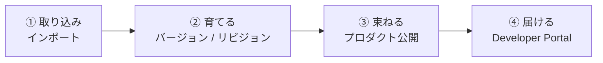
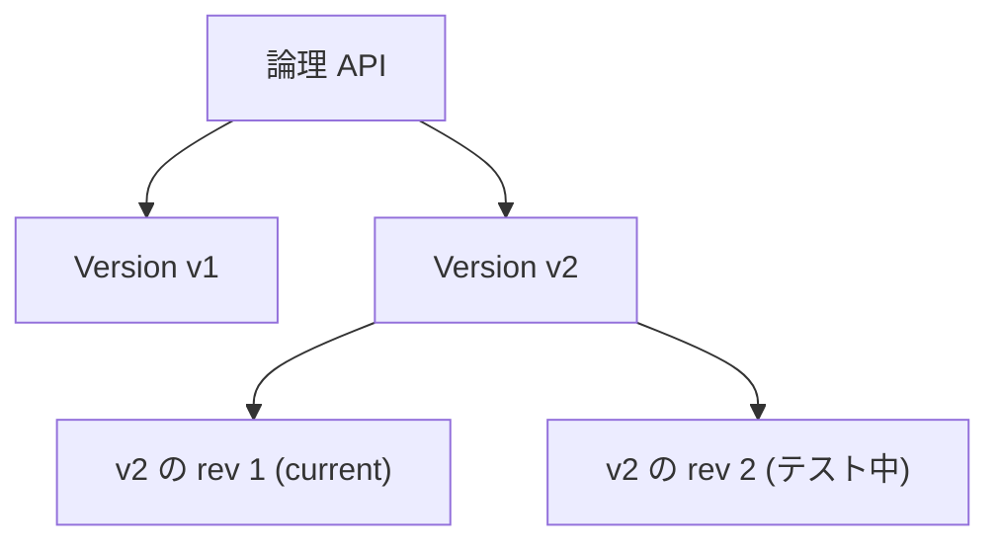

# Week 6 — API ライフサイクルとガバナンス

> **Phase 2a** | 学習プラン Week 6 / 10  
> 学習目標：API の取り込み（インポート）からバージョン管理・公開・利用者向けポータルまで、API のライフサイクル全体を運用観点で説明できる

---

## 0. 今週の位置づけ

Week 2〜5 で「API をどう構成し、ポリシーで守るか」を学んだ。
今週は時間軸の話 ——「API を**どう取り込み・育て・利用者に届けるか**」というライフサイクル。



---

## 1. API のインポート（フロントエンド定義の作り方）

Week 2 では手動で Operation を作ったが、実務では**既存の定義ファイルやリソースから自動生成**するのが普通。

| 取り込み元 | 内容 |
|---|---|
| **OpenAPI / Swagger**（最頻出） | 定義ファイル（JSON/YAML）から Operation を一括自動生成 |
| **WSDL（SOAP）** | SOAP パススルー、または **SOAP-to-REST 変換**で公開 |
| **Azure リソース直結** | Function App / Logic App / App Service / Container App を選ぶだけ |
| GraphQL / gRPC / OData / WebSocket | 各プロトコル（詳細は Week 9） |

> **ポイント**：OpenAPI を取り込むと、パス・メソッド・パラメータ・サンプル応答までまとめて定義される。Week 2 で手作業した内容が一瞬で揃う。
> Function App を取り込むと、その関数群が API/Operation として自動登録され、バックエンドも自動で紐づく。

### 初学者向け用語補足：API の形式・プロトコルとは

これらは「**API のやり取りの流儀（スタイル）**」の違い。略称は正式名称も併記する。

| 名称（正式名称） | どういうものか | イメージ |
|---|---|---|
| **OpenAPI / Swagger**<br/>(OpenAPI Specification／旧称 Swagger) | REST API の**設計図（仕様書）**フォーマット（JSON/YAML）。エンドポイント・パラメータ・レスポンスが書いてある。Swagger は旧名・現在はツール群の名前 | 建物の設計図。渡すと設計図どおり API を自動で建ててくれる |
| **WSDL（SOAP）**<br/>(Web Services Description Language／Simple Object Access Protocol) | SOAP = 古くから企業系で使う**XML ベースの厳格なプロトコル**。WSDL はその設計図 | 書式が厳密な「内容証明郵便」。堅いが重い |
| **GraphQL**<br/>(Graph Query Language) | クライアントが**欲しいデータだけを1回で指定**する方式 | 定食（REST）に対し、à la carte で自分で構成する注文 |
| **gRPC**<br/>(gRPC Remote Procedure Calls／RPC=Remote Procedure Call) | **バイナリ**で HTTP/2 上をやり取りする**高速なサービス間通信** | 人が読める手紙(REST)に対し、機械同士の圧縮電報 |
| **OData**<br/>(Open Data Protocol) | REST に**URL でのデータ問い合わせ言語**を足した標準（`$filter` `$top` など） | URL で SQL っぽい検索ができる版 |
| **WebSocket**<br/>("Web" + "Socket"・略語ではない) | **つなぎっぱなしで双方向リアルタイム通信**するプロトコル | 手紙の往復(HTTP)に対し、開きっぱなしの電話 |

> 補足：**REST** = Representational State Transfer（今主流の API スタイル。HTTP メソッド＋URL＋JSON）。**RPC** = Remote Procedure Call（離れたサーバの関数を、手元の関数のように呼ぶ方式）。

#### 「XML ベース」とは
「〜ベース」=「〜を土台にした」。**XML ベース = メッセージをすべて XML（→ Week 3）で表現する方式**。SOAP は XML ベースなので、1回のやり取りが丸ごと XML 文書になる。

SOAP（XML ベース）のリクエスト例 ↓
```xml
<soap:Envelope xmlns:soap="http://www.w3.org/2003/05/soap-envelope">
  <soap:Body>
    <getOrder><orderId>42</orderId></getOrder>
  </soap:Body>
</soap:Envelope>
```
同じことを REST なら `GET /orders/42` だけ（本文すら不要）。
> **イメージ**：XML ベース(SOAP) = 役所の「申請書一式」（封筒・本体と様式に全部記入、堅牢だが冗長）。REST(JSON) = 付箋に「42番ちょうだい」と書く感覚（軽い）。

#### REST：実際に何を送っているのか（具体例）
HTTP リクエストは「**リクエスト行 + ヘッダ + 本文**」でできている。

**例1：注文を取得（GET）**
```
GET /store/orders/42 HTTP/1.1          ← ① メソッド + パス
Host: contoso.azure-api.net            ← ② ヘッダ
Ocp-Apim-Subscription-Key: abc123      ← ② ヘッダ（キー）
                                        ← ③ 本文：GET は空でOK
```
```
HTTP/1.1 200 OK                        ← ① ステータス行
Content-Type: application/json         ← ② ヘッダ
                                        
{ "orderId": 42, "item": "コーヒー豆", "quantity": 2, "status": "shipped" }   ← ③ 本文(JSON)
```

**例2：注文を作る（POST）**
```
POST /store/orders HTTP/1.1            ← 作成は POST、パスは一覧側
Host: contoso.azure-api.net
Content-Type: application/json
Ocp-Apim-Subscription-Key: abc123

{ "item": "紅茶", "quantity": 1 }       ← ③ 本文：作りたい内容を JSON で
```
```
HTTP/1.1 201 Created                    ← 「作成できた」を表す 201
Content-Type: application/json

{ "orderId": 43, "item": "紅茶", "quantity": 1, "status": "pending" }
```

**ここで Week 1〜5 がつながる**
- パス `/store/orders/42` が Week 2 の Operation `GET /orders/{id}`（id=42）にマッチ
- `Ocp-Apim-Subscription-Key` ヘッダが Week 2 のサブスクリプションキー
- `200`/`201`/`429` が Week 4 のステータスコード
- ポリシーはこの**リクエストを inbound で、レスポンスを outbound で**加工する（Week 3）

> **REST の4原則**：① リソース指向（モノを URL で表す）② HTTP メソッドを動詞に ③ ステートレス（各リクエストが自己完結・サーバは前回を覚えない）④ 標準ステータスコード。
> **イメージ（図書館）**：本(リソース)に棚番号(URL)、借/返/閲覧は決まった動作(メソッド)、司書は前回を覚えない＝毎回会員証(ステートレス)。
> ステートレスは Week 5 の「毎回 JWT を送る」設計と相性が良く、スケールしやすい。

---

## 2. バージョン（Versions）

**利用者に見える「破壊的変更」を安全に扱う**ための仕組み。複数バージョンを**同時に並存**させ、利用者が使うものを選ぶ。

> **破壊的変更（breaking change）とは**（公式用語。docs に "handle breaking changes" と明記）
> = 既存の呼び出し元が、これまで通りでは動かなくなる変更。
>
> | 変更 | 破壊的？ | なぜ |
> |---|---|---|
> | 必須パラメータを追加 | 💥 破壊的 | 古い呼び出しは送っていない → エラー |
> | レスポンス項目名を変更（`name`→`fullName`） | 💥 破壊的 | 古いクライアントが読めない |
> | エンドポイント削除/URL変更 | 💥 破壊的 | 呼び出し先が消える |
> | **任意の**新項目をレスポンスに追加 | ✅ 非破壊的 | 古いクライアントは無視するだけ |
> | バグ修正・性能改善 | ✅ 非破壊的 | 呼び出し方は不変 |
>
> **イメージ**：電源プラグの規格変更。形を別規格に変える(💥)と既存の家電が挿せない。差込口を増やすだけ(✅)なら既存はそのまま使える。
> → 破壊的＝バージョン、非破壊的＝リビジョン（§4）。

> **なぜ v1, v2 と複数用意するのか？（1つで十分では？）**
> 自分だけが使うなら1つで十分。問題は**外部の利用者がいるとき**。
> 1つの API を直接書き換えて破壊的変更を入れると、**ある日突然、既存利用者のアプリが一斉に壊れる**。しかも相手に「今すぐ更新して」と強制はできない（配布済みアプリ・パートナー都合）。
> バージョンがあれば、v1（旧）を既存利用者がそのまま使い続け、v2（新）へ準備できた人から移行 → 移行完了後に v1 を廃止予告して停止できる。
> **イメージ**：道路の架け替え。車(利用者)が走る古い道をいきなり壊さず、新しい道を隣に作って少しずつ移ってもらう。
> → バージョンは「**利用者を壊さずに破壊的な進化をする**」ための道具。破壊的変更が無いなら1バージョンで十分。

### 3 つのバージョニング方式
利用者がどのバージョンを使うかを指定する方法。**1つの version set 内では全バージョンが同じ方式**（最初に決めた方式に固定）。

| 方式 | 指定の仕方 | 例 |
|---|---|---|
| **Path** | URL パスに含める | `https://.../products/v1/...` |
| **Header** | カスタムヘッダで指定 | `Api-Version: v1` |
| **Query string** | クエリで指定 | `https://.../products?api-version=v1` |

- バージョン識別子は**任意の文字列**（数字 `v1`・日付 `2024-01-01`・名前など）
- 各バージョンは事実上「独立した API」。Operation もポリシーもバージョンごとに違ってよい

### Original 版（公式の重要な挙動）
非バージョンの API にあとからバージョンを足すと、**`Original` というバージョンが自動生成**され、**バージョン識別子なしの既定 URL で応答**する。
→ 既存の呼び出し元を壊さずにバージョン導入できる。

### version set（バージョンの束）
APIM は内部に **version set** というリソースを持ち、「1つの論理 API のバージョン群」をまとめる。表示名と**バージョニング方式**を保持する。最後のバージョンを消すと自動削除される。

> **公式確認メモ**
> - version set 内のバージョニング方式は、最初のバージョン追加時に決まり**全バージョン共通**
> - Developer Portal にバージョンを表示するには、**そのバージョンをプロダクトに追加**する必要がある

---

## 3. リビジョン（Revisions）

**非破壊的な変更を、本番に影響を与えず試して切り替える**ための仕組み。

仕組み：
1. 新しいリビジョンを作る（本番＝current はそのまま動き続ける）
2. そのリビジョンで編集・テスト
3. 準備できたら **「current にする（make current）」** で本番へ昇格
4. 問題があれば、前のリビジョンを current に戻す＝**ロールバック**

### 特定リビジョンへのアクセス（公式の注意）
`;rev={番号}` を **API ID に付ける**（URI パスではない。クエリ文字列の前）：
```
https://apis.contoso.com/customers;rev=3/leads?customerId=123
                                  ^^^^^^^ API ID に付ける
```

### change log と description（公開 / 非公開の違い）
| | 用途 | 見える先 |
|---|---|---|
| **description** | 自分用のメモ | 非公開（利用者には見えない） |
| **change log** | current 昇格時の変更告知 | **公開**（Developer Portal に掲載） |

> **change log（リビジョンの公開メモ）とは**：リビジョンを current に昇格させるとき、「今回どこを変えたか」を**利用者向けに書ける欄**。Developer Portal に掲載され、API 利用者が読める。いわば **「更新のお知らせ／リリースノート」**。
> 例：「2026-06-22: レスポンスに created_at フィールドを追加しました」
> **イメージ**：アプリ更新時に出る「このバージョンの新機能」のお知らせの、API 版。

> **公式確認メモ**
> - 非 current のリビジョンでは、Name / Path / Protocols / Subscription required / API version などの**プロパティは変更不可**（current でのみ変更可）。変えようとすると `Can't change property for non-current revision` エラー
> - リビジョンは**オフライン化**でき、URL を知っていてもアクセス不可にできる（テスト中の保護に）

---

## 4. バージョン vs リビジョン（最重要・混同注意）

両者は**別機能**で、組み合わせられる（各バージョンが複数リビジョンを持てる）。

| | バージョン（Version） | リビジョン（Revision） |
|---|---|---|
| 主な用途 | **破壊的変更** | **非破壊的・小さな変更** |
| 利用者から見えるか | 見える（選んで使う） | 基本見えない（current が使われる） |
| 並存 | 複数バージョンが同時稼働 | current は常に1つ（他は控え） |
| 指定方法 | Path / Header / Query | `;rev=` で明示（通常は指定しない） |
| 公式の言い回し | breaking changes 向け | minor and non-breaking changes 向け |



> **判断の型**：互換性が**壊れる** → Version。互換性が**壊れない**改修・段階適用 → Revision。
> リビジョンに破壊的変更が出てしまったら、「**Create Version from Revision**」で正式なバージョンへ昇格できる。

---

## 5. プロダクト公開とアクセス制御

Week 2 の Product を「公開」する運用面。

| 設定 | 内容 |
|---|---|
| 公開 / 非公開 | published（利用可能）/ draft（編集中・非公開） |
| サブスクリプション承認 | 自動承認 / **管理者の手動承認**（無制限利用を防ぐ） |
| 利用規約（Legal terms） | サブスク申請時に同意させる文面 |
| API の束ね | 複数 API を 1 プロダクトにまとめて提供 |

> プロダクトを published にして初めて、利用者が Developer Portal から見つけて購読できる。

---

## 6. Developer Portal

API **利用者（開発者）向けの自動生成サイト**。

- **API リファレンス** … 取り込んだ定義から自動生成されるドキュメント
- **試用コンソール（Try it）** … ブラウザから実際に API を呼べる（CORS が要る・Week 4）
- **サブスクリプション申請** … 利用者が自分でキーを取得
- **change log** … リビジョンの公開メモがここに出る

| 種類 | 説明 |
|---|---|
| マネージドポータル | Azure が用意・ビジュアルエディタでカスタマイズ。**公開（publish）操作で反映** |
| セルフホストポータル | ソースを自分でホストし高度にカスタマイズ |

> **セルフホストポータルとは**：Developer Portal の中身は**オープンソースとして公開**されており、それを取得・改造して**自前の Web ホスティングで動かす**方式。
>
> | | マネージド | セルフホスト |
> |---|---|---|
> | 動かす場所 | Azure（APIM 内蔵） | 自分のホスティング |
> | 管理・更新 | Azure 任せ | 自分で実施 |
> | カスタマイズ | ビジュアルエディタで編集 | **ソースコードを直接改造**（自由度最大） |
> | 手間 | 少ない（既定でおすすめ） | 多い |
>
> **イメージ**：マネージド = 内装済みの賃貸（家具配置はできるが建物は大家＝Azure が管理）。セルフホスト = 設計図をもらって自分で建てる（壁をぶち抜く改造もできるが建築・保守も全部自分）。
> ほとんどはマネージドで十分。既定の枠を超えた独自要件があるときだけセルフホストを検討する。

> ⚠️ Developer Portal は **Consumption ティアでは利用不可**（公式）。

---

## 7. ガバナンス補助

API が増えてきたときに統制を保つ仕組み（本格的な分権管理は Week 9 の Workspaces）。

- **タグ** … API をタグ付けして分類・絞り込み
- **命名規則** … API 名・suffix・バージョン識別子の一貫性
- これらは後の **CI/CD（APIOps）** や Workspaces につながる土台

---

## 8. 全体整理

### 重要な用語まとめ

| 用語 | 一言説明 |
|---|---|
| インポート | OpenAPI / WSDL / Azure リソースから API を自動生成 |
| バージョン | 破壊的変更を並存管理。Path/Header/Query の3方式 |
| version set | 1論理APIのバージョン群を束ねるリソース（方式は共通） |
| Original 版 | 非バージョンAPIにバージョン追加時、自動生成される既定URL応答版 |
| リビジョン | 非破壊的変更を試して切替。current を1つ持つ |
| `;rev=` | 特定リビジョンへのアクセス。API ID に付ける |
| make current | リビジョンを本番に昇格（戻せばロールバック） |
| change log / description | 公開メモ / 非公開メモ |
| Create Version from Revision | リビジョンを正式バージョンへ昇格 |
| Developer Portal | 利用者向け自動生成サイト（Consumption 不可） |

---

## ハンズオン チェックリスト

- [ ] 公開 OpenAPI（例：Swagger Petstore の `openapi.json`）をインポートし、Operation が自動生成されることを確認
- [ ] その API に **Version**（`v1`）を Path 方式で導入し、`.../v1/...` でアクセスできることを確認。`Original` 版が自動生成されたことも確認
- [ ] **Revision** を1つ作り、Operation かポリシーを少し変更 → `;rev=2` で試す → **current に昇格** → change log を記録
- [ ] 前のリビジョンを current に戻して**ロールバック**を体験
- [ ] Developer Portal を起動・公開し、利用者目線で API ドキュメントと「Try it」を試す
- [ ] ノートに Version と Revision の違いを1枚の表で自作

---

## 自己チェック

週末にドキュメントを閉じて答えてみる。

1. **Version と Revision の違いを、具体的な変更例2つで説明できるか？**
   - キーワード：破壊的=Version、非破壊的=Revision、並存 vs current 1つ

2. **バージョニングの3方式（Path/Header/Query）それぞれの指定方法は？**
   - キーワード：URLパス / カスタムヘッダ / クエリ、version set で方式共通

3. **非バージョンの API にバージョンを足すと、既存の呼び出し元が壊れないのはなぜ？**
   - キーワード：Original 版が自動生成され既定 URL で応答

4. **`;rev=` はどこに付けるか？current にするとは何が起きるか？**
   - キーワード：API ID に付ける、本番に昇格、戻せばロールバック

5. **change log と description の違いは？**
   - キーワード：公開（Developer Portal）/ 非公開（自分用）

6. **Developer Portal は誰のための、何をする場所か？**
   - キーワード：利用者向け、ドキュメント・Try it・購読申請

---

## 次週の予告（Week 7）

Phase 2b に入り、ネットワークと配置形態へ：

- **VNet 統合** — External / Internal モードの違い
- **Private Endpoint** — 受信のプライベート化
- **Self-hosted Gateway** — オンプレ/他クラウドで動かす
- **前段の WAF 構成** — App Gateway / Front Door との組み合わせ
