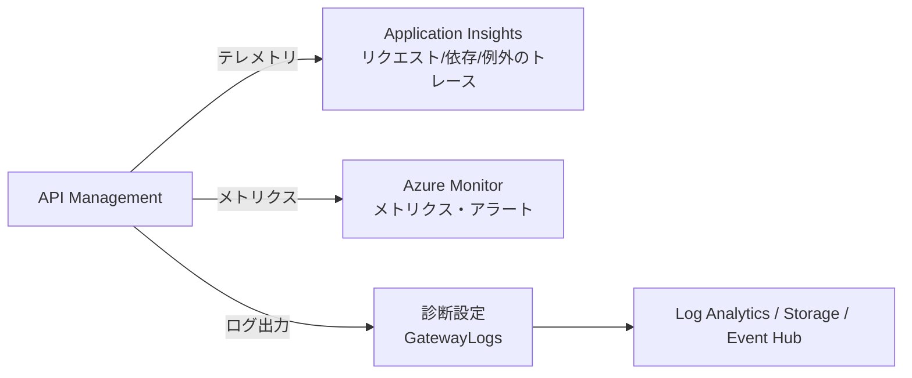

# Week 8 — ティア・スケーリング・監視

> **Phase 2b** | 学習プラン Week 8 / 10  
> 学習目標：APIM のティア選定・スケーリング・SLA・マルチリージョンの判断軸を持ち、監視（App Insights / Azure Monitor / 診断ログ / トレース）で運用状況を把握できる

---

## 0. 今週の位置づけ

ここまで「APIM が何をするか」を学んだ。今週は運用観点 ——「**どのプランで・どれだけの規模で・どう監視して動かすか**」。

> **初学者向け用語補足**
> - **ティア（SKU）**：価格・性能・機能のグレード（プラン）。スマホの料金プランのようなもの。
> - **SLA（Service Level Agreement）**：稼働率の保証（例 99.95%）。下回ると返金などの取り決め。
> - **スケールユニット（unit）**：処理能力の追加単位。ユニットを増やすほど捌ける量が増える。
> - **サーバーレス**：使った分だけ課金・自動で増減（自分でサーバ管理しない）方式。

---

## 1. ティア（SKU）の選定

APIM のティアは「クラシック（v1 系）」と「v2 系」に大別される。

### クラシック
| ティア | 特徴 | SLA |
|---|---|---|
| **Consumption** | **サーバーレス**・従量課金・ゼロまで自動縮退。一部機能制限あり | あり |
| **Developer** | 全機能が使えるが**非本番**（SLA なし）。学習・検証用 | **なし** |
| **Basic / Standard** | 本番向け中位 | あり |
| **Premium** | VNet 注入・**マルチリージョン**・可用性ゾーン・最大スケール | あり |

### v2（新プラットフォーム）
| ティア | 用途 | ネットワーク |
|---|---|---|
| **Basic v2** | 開発/テスト向け（ただし**SLA あり**） | — |
| **Standard v2** | 本番。**VNet 統合**（outbound）+ 受信 Private Endpoint | 送受信の分離可 |
| **Premium v2** | エンタープライズ。**VNet 注入**（完全分離）・高スケール・AZ・専用 ASE | フル分離 |

> **公式確認メモ**
> - **v2 は全ティア SLA あり**（クラシック Developer だけ SLA なし、と覚える）
> - スケール上限：Basic v2 / Standard v2 は**最大 10 ユニット**、Premium v2 は**最大 30 ユニット**
> - **マルチリージョン展開は クラシック Premium のみ**（**v2 では現状未対応**）
> - **Self-hosted Gateway も v2 未対応**（Developer / Premium のみ・Week 7）
> - Premium v2 のゲートウェイは**専用 App Service Environment** 上で動く

### 選定の軸
1. **SLA が要るか**（学習なら Developer、本番なら SLA ありティア）
2. **VNet が要るか**（要 → Premium / v2 系）
3. **マルチリージョンが要るか**（要 → クラシック Premium）
4. **スループット / コスト**（Consumption は安価・小規模、Premium は高性能・高コスト）

> **Consumption の特性**：リクエストが無ければゼロまで縮退し、来たら自動で立ち上がる。小規模・不定期トラフィックに最適。ただし `rate-limit-by-key` 等**一部機能が非対応**（Week 4）。

---

## 2. スケーリングと容量

### スケールユニットと容量メトリック
処理能力は**ユニット**を増減して調整する。「いつ増やすか」を判断する材料が**容量メトリック**。

| | 容量メトリック | 意味 |
|---|---|---|
| **クラシック** | **Capacity** | CPU・メモリ・ネットワークキュー長の**複合指標**。負荷の総合的な目安 |
| **v2** | **CPU Percentage / Memory Percentage of Gateway** | ゲートウェイの CPU/メモリ使用率（v2 では Capacity は使えず 0 表示） |

> ⚠️ **Capacity はリクエスト数そのものではない**。複雑な変換ポリシーや遅いバックエンドは、少ないリクエストでも Capacity を押し上げる。

### スケールの判断（公式の目安）
- Capacity（または CPU/メモリ%）が **60〜70% を長時間（例 30分）超えたら**スケール/アップグレード
- **1 ユニット構成なら 40% で**スケール（OS 更新用に余力を残すため）
- **瞬間的なスパイクは無視**（システム要因で起きる。長期トレンドで判断）
- マルチリージョン時は**ロケーション別**に見る

> ⚠️ **公式の重要注意：容量を超えても APIM はスロットル（制限）しない**。過負荷の Web サーバのように**レイテンシ増・接続切断・タイムアウト**で劣化する。クライアント側は**リトライ**で備える。

### オートスケール
- Azure Monitor の**オートスケール**でユニットを自動追加できる
- **スケール操作は約 30 分かかる**ので、しきい値・ルールは余裕を持って設計
- マルチリージョンでは**プライマリロケーションのみ**スケール可
- フラッピング（増減ループ）に注意

---

## 3. マルチリージョンと可用性

- **マルチリージョン展開＝クラシック Premium のみ**。ゲートウェイを複数リージョンに置き、利用者に**地理的に近い拠点**で受ける（レイテンシ低減・災害対策）
- **可用性ゾーン（AZ）**：1 リージョン内の複数データセンターに分散し、ゾーン障害に耐える（Premium / Premium v2）
- マルチリージョンでも**管理プレーンとスケールはプライマリ**が中心

> 注意：v2 は高速デプロイ・新ネットワークが強みだが、**マルチリージョンはまだ無い**（要件があるならクラシック Premium）。

---

## 4. 監視（Observability）

APIM の状態を知る手段は3層で整理できる。



| 手段 | 何が分かるか |
|---|---|
| **Application Insights** | 1リクエスト単位のトレース（依存関係・例外・所要時間）。**サンプリング**で量とコストを調整 |
| **Azure Monitor メトリクス** | Capacity / Requests / レイテンシ等の数値。**アラート**を設定可 |
| **診断設定（GatewayLogs）** | ゲートウェイログを **Log Analytics / Storage / Event Hub** へ送る。KQL で検索 |
| **API トレース** | ポリシーのステップ単位デバッグ（`Ocp-Apim-Trace`・Week 3/4 で使ったトレース） |

> **初学者向け用語補足**
> - **Application Insights**：アプリの動作を可視化する監視サービス（APM）。
> - **Azure Monitor**：Azure 全体の監視基盤。メトリクス（数値）とログを集約。
> - **Log Analytics**：ログを貯めて **KQL（Kusto Query Language）** という言語で検索する場所。
> - **診断設定（Diagnostic settings）**：どのログをどこへ送るかの設定。

> **プライバシー/コスト**：ヘッダや本文のログはマスキングを検討。Application Insights は**サンプリング率**を下げると安くなるが、取りこぼしが増えるトレードオフ。

---

## 5. 全体整理

### 重要な用語まとめ

| 用語 | 一言説明 |
|---|---|
| ティア（SKU） | 価格・性能・機能のグレード。classic と v2 |
| Consumption | サーバーレス・従量・ゼロ縮退。一部機能制限 |
| Developer | 全機能・非本番・**SLA なし**（学習用） |
| Premium | VNet・**マルチリージョン**・AZ・最大スケール |
| v2（Basic/Standard/Premium v2） | 新基盤・全て SLA あり・高速デプロイ。**マルチリージョン未対応** |
| スケールユニット | 処理能力の追加単位 |
| Capacity（classic）/ CPU・Memory %（v2） | スケール判断に使う容量メトリック。**リクエスト数ではない** |
| スケール目安 | 60〜70%持続（1ユニットは40%）。超過時はスロットルせず劣化 |
| オートスケール | ユニット自動追加。**約30分**かかる |
| Application Insights | リクエスト/例外のトレース監視 |
| 診断設定 / GatewayLogs | ログを Log Analytics 等へ。KQL で検索 |

---

## ハンズオン チェックリスト

- [ ] Application Insights を APIM に接続し、数回呼び出してトレース/依存関係が記録されるのを確認
- [ ] Metrics ブレードで Capacity（または CPU/Memory %）・Requests・レイテンシのグラフを見る。Capacity が何を意味するか考察
- [ ] 診断設定で `GatewayLogs` を Log Analytics に送り、KQL で直近のリクエストを1クエリ書いて確認
  ```kql
  ApiManagementGatewayLogs
  | take 20
  ```
- [ ] ティア比較表（Consumption / Developer / Standard / Premium / v2）を「SLA・VNet・マルチリージョン・コスト」軸で自作
- [ ] メトリックアラートを1つ設定（例：Capacity が 20 分間しきい値超で通知）

---

## 自己チェック

週末にドキュメントを閉じて答えてみる。

1. **Consumption と Premium をどう使い分けるか（判断軸）？**
   - キーワード：サーバーレス/小規模 vs VNet・マルチリージョン・高スケール

2. **「Capacity（容量メトリック）」が高い＝リクエストが多い、で合っているか？**
   - キーワード：違う。複合指標、複雑ポリシー/遅いバックエンドでも上がる

3. **容量を超えると APIM はどうなる？クライアントは何で備える？**
   - キーワード：スロットルせず劣化（レイテンシ/切断/タイムアウト）、リトライ

4. **スケールの目安と、1ユニット時の注意は？オートスケールの所要時間は？**
   - キーワード：60〜70%持続、1ユニットは40%、約30分

5. **マルチリージョン展開ができるのはどのティア？v2 でできる？**
   - キーワード：クラシック Premium のみ、v2 は未対応

6. **App Insights のサンプリングを下げるトレードオフは？**
   - キーワード：コスト減 vs 取りこぼし増

---

## 次週の予告（Week 9）

高度な機能を俯瞰する：

- **キャッシュ** — 内蔵 / 外部 Redis
- **バックエンド** — ロードバランシング・サーキットブレーカー
- **新プロトコル** — GraphQL / WebSocket / gRPC
- **AI/LLM ゲートウェイ** — トークン制限・セマンティックキャッシュ（AI Search とつながる）
- **Workspaces / CI/CD（APIOps）**
