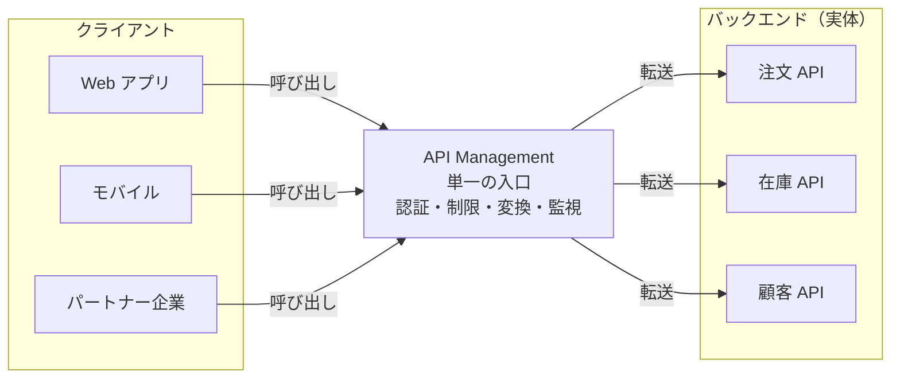
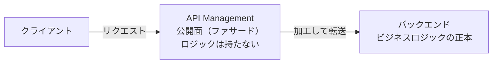
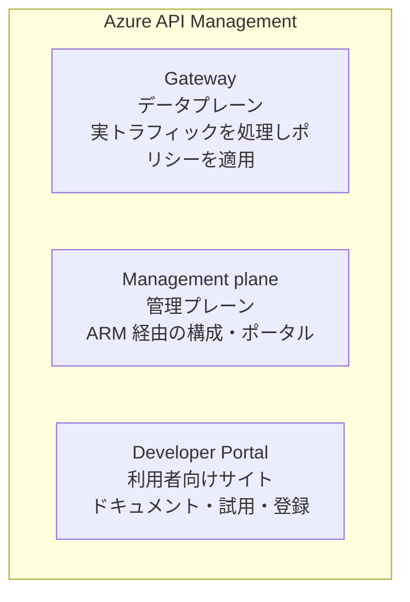
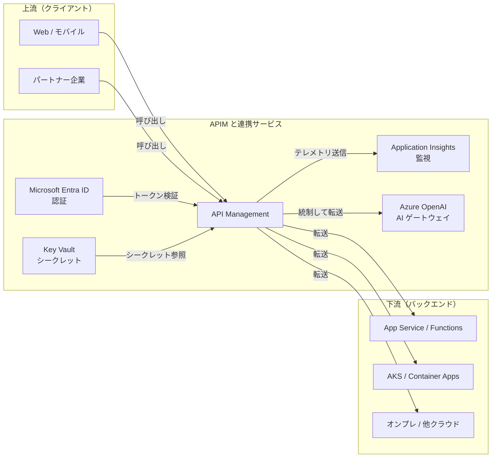
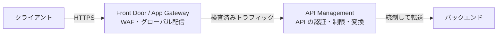
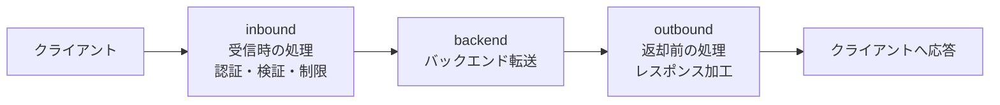
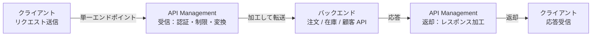

# Week 1 — 製品の存在理由と設計思想

> **Phase 1a** | 学習プラン Week 1 / 10  
> 学習目標：Azure API Management が「なぜ存在するのか」「何を解決するのか」、API ゲートウェイ（ファサード）パターンの意義を自分の言葉で説明できる

---

## 1. なぜ API ゲートウェイが必要か

API Management（以下 APIM）を理解するには、まず「なぜ必要なのか」という問題から入る。

### バックエンド API が増えると起きること

社内に注文 API・在庫 API・顧客 API…とバックエンドが増えていくと、どの API にも**同じような共通処理**が必要になる。

| 共通処理（横断的関心事） | 内容 |
|---|---|
| 認証・認可 | 呼び出し元が誰か、許可されているか |
| レート制限・クォータ | 使いすぎを防ぐ |
| 変換 | リクエスト/レスポンスのヘッダ・形式を加工 |
| ロギング・監視 | 誰がいつ何を呼んだか |
| キャッシュ | 同じ応答を使い回して高速化 |

これを**各 API が個別に実装**すると、3 つの問題が起きる。

| 問題 | 説明 |
|---|---|
| **重複** | 同じ認証コードを全 API にコピペ → 修正漏れ・バグ |
| **不整合** | API ごとに認証方式やエラー形式がバラバラ |
| **密結合** | クライアントがバックエンドの URL・台数・実装に直接依存してしまう |

> **重要な概念の区別**
> - **バックエンド（実体）**：ビジネスロジックそのもの。注文を処理する、在庫を返す
> - **公開面（ファサード）**：外部に「どう見せるか」。認証・URL・形式・制限
>
> この 2 つは本来「別の関心事」。混ぜると上記の問題が起きる。

APIM はこの「公開面（ファサード）」の問題を解くために作られた。

---

## 2. 解決策：API ゲートウェイ（ファサード）パターン

すべての API 呼び出しを**単一の入口（ゲートウェイ）に集約**し、横断的関心事をそこで一元処理する。

- クライアントは APIM の **1 つのエンドポイント**だけを知ればよい
- 認証・制限・変換・監視は APIM に**1 箇所だけ**書く
- バックエンドの URL や台数が変わっても、クライアントは影響を受けない（疎結合）

> このように「裏側の複雑さを隠して、きれいな単一の顔（ファサード）を見せる」のが **API ゲートウェイ（ファサード）パターン**。

---

## 3. APIM のアイデンティティ：関心の分離

APIM は「API の**公開・保護・変換・監視・収益化**」を行うマネージドサービス。

### 核心となる設計思想

> **ビジネスロジック（バックエンド）と、公開面（APIM）を分離する**

### 重要な原則

- **APIM はバックエンドの正本ではない** — ビジネスロジックはバックエンドにある
- APIM が担うのは「仲介・加工・統制」。リクエスト/レスポンスを受け取り、ポリシーに従って加工して通す層
- だから APIM を消してもバックエンドのデータは消えない（公開面が消えるだけ）

> AI Search が「検索インデックス（データの派生物）」を担い正本ではなかったのと同じ構図。
> **APIM は「API の公開面」を担い、ロジックの正本ではない。**

---

## 4. APIM の 3 つの構成要素

APIM は 1 つのサービスだが、役割の異なる 3 つの面（プレーン）を持つ。

| 構成要素 | 役割 | 主な利用者 |
|---|---|---|
| **Gateway（データプレーン）** | 実際の API トラフィックを受け、ポリシーを適用してバックエンドへ転送する実行エンジン | エンドユーザーのリクエスト |
| **Management plane（管理プレーン）** | Azure Resource Manager 経由で API・ポリシー・プロダクトを構成。Portal や CLI/Bicep が叩く | API 管理者・運用者 |
| **Developer Portal** | 自動生成される利用者向けサイト。API リファレンス参照・サブスクリプション取得・「Try it」での試用 | API を使う開発者 |

> **混同しやすいポイント**：「Gateway」は実トラフィックの通り道、「Management」は設定の通り道。
> ポリシーを**設定する**のは管理プレーン、ポリシーが**実行される**のはゲートウェイ。

---

## 5. Azure エコシステムの中での位置づけ

APIM は単体では動かない。周囲のサービスとの関係を理解することが重要。

| 方向 | 関係 |
|---|---|
| **上流** | Web/モバイル/パートナー → APIM の単一エンドポイントを呼ぶ |
| **横連携** | Microsoft Entra ID → JWT を検証して呼び出し元を認証（Week 5） |
| **横連携** | Key Vault → ポリシーで使うシークレットを安全に参照（Week 5） |
| **横連携** | Application Insights → リクエスト/例外のテレメトリを送り監視（Week 8） |
| **横連携** | Azure OpenAI → LLM 呼び出しをトークン制限・キャッシュで統制（Week 9） |
| **下流** | App Service / Functions / AKS / オンプレ / 他クラウド → 実際のバックエンド |

> Week 9 の「AI/LLM ゲートウェイ」は、AI Search で学んだ RAG の**生成側（Azure OpenAI）を APIM で統制する**話。2 つの学習がここで繋がる。

---

## 6. APIM と Application Gateway / Front Door の違い

名前が似ていて混同しやすいので、ここで整理しておく。

| サービス | 種別 | 主な役割 | レイヤ |
|---|---|---|---|
| **API Management** | API 専用の管理レイヤ | API の公開・認証・変換・制限・監視・収益化 | アプリケーション（API） |
| **Application Gateway** | 汎用 L7 ロードバランサ + WAF | リージョン内の負荷分散・WAF による防御 | ネットワーク（HTTP） |
| **Azure Front Door** | グローバル L7 ロードバランサ + WAF + CDN | 世界規模の配信・WAF・キャッシュ | ネットワーク（グローバル） |

> **ポイント**：App Gateway / Front Door は「どの HTTP リクエストをどこへ流すか・どう守るか」という**汎用の通信制御**。
> APIM は「API としてどう公開し、誰に・どう使わせるか」という**API 固有の管理**。

### 併用パターン（よくある構成）

前段に WAF（Front Door / App Gateway）、後段に APIM、という二段構えは定番（詳細は Week 7）。

---

## 7. リクエストの流れ（予告）

APIM の中身では、1 リクエストが**パイプライン**を通って処理される（詳細は Week 3）。

> **パイプライン（pipeline）とは**
> 処理を**決まった順番で連鎖させる**仕組み。水道管（pipe）を水が流れるように、リクエストが各ステージを順番に通過する。
> 各ステージに「認証チェック」「ヘッダ加工」「ログ記録」などの処理（= **ポリシー**）を差し込める。
> 今週は「そういう仕組みがある」という予告として眺めるだけで OK。中身は Week 3〜4 で深掘りする。

> この `inbound → backend → outbound`（+ エラー時の `on-error`）の 4 セクションに**ポリシー**を書くことで、APIM のあらゆる振る舞いを制御する。ポリシーこそが APIM の心臓。Week 3〜4 で深掘りする。

---

## 8. Week 1 全体の整理

### 現時点の理解（リクエストフロー図）

### 重要な用語まとめ

| 用語 | 一言説明 |
|---|---|
| API ゲートウェイ（ファサード） | 全呼び出しを集約し横断処理を一元化する単一の入口 |
| 横断的関心事 | 認証・制限・変換・ロギングなど、全 API 共通の処理 |
| 関心の分離 | バックエンド＝ロジック、APIM＝公開面、と役割を分けること |
| Gateway（データプレーン） | 実トラフィックを処理しポリシーを実行する面 |
| Management plane | ARM 経由で構成を行う管理の面 |
| Developer Portal | API 利用者がドキュメント参照・登録・試用するサイト |
| ポリシー | inbound/backend/outbound/on-error に書く振る舞いの定義（Week 3〜） |

---

## ハンズオン チェックリスト

- [ ] Azure Portal で API Management サービスを作成（**Developer ティア**推奨。全機能が使え安価／本番 SLA なし。※作成完了まで 30〜45 分かかる）
- [ ] 各ブレードを開いて 1 文でメモする
  - APIs：
  - Products：
  - Subscriptions：
  - Named values：
  - Backends：
  - Policies：
  - Developer portal：
  - Network：
  - Metrics：
- [ ] リクエストフロー図を手描きする（このノートのフロー図と比較してみる）

---

## 自己チェック

週末にドキュメントを閉じて答えてみる。

1. **API ゲートウェイパターンが解決する「横断的関心事の散在」とは具体的に何か？**
   - キーワード：認証/制限/変換の重複、不整合、密結合

2. **APIM の 3 コンポーネントの役割をそれぞれ説明できるか？**
   - キーワード：Gateway＝実トラフィック、Management＝構成、Developer Portal＝利用者向け

3. **APIM と Application Gateway の違いを例で説明できるか？**
   - キーワード：API 専用の管理レイヤ vs 汎用 L7/WAF、併用パターン

4. **なぜ APIM は「バックエンドの正本ではない」のか？**
   - キーワード：関心の分離、公開面、ロジックはバックエンドにある

---

## 次週の予告（Week 2）

APIM の中核オブジェクトとリクエストの流れを学ぶ：

- **API / Operation** — 公開する API と個々のエンドポイント
- **Product** — API を束ねた公開単位（利用条件を定義）
- **Subscription** — 利用者のアクセス権とキー
- **Backend** — 再利用可能なバックエンド接続定義
- **Named value** — 定数・シークレットの集中管理
