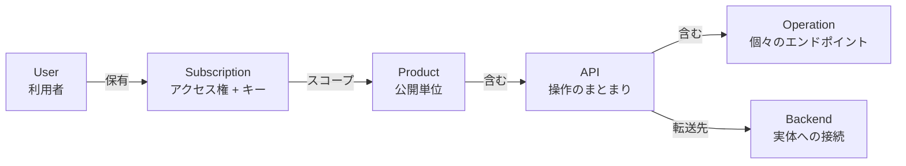
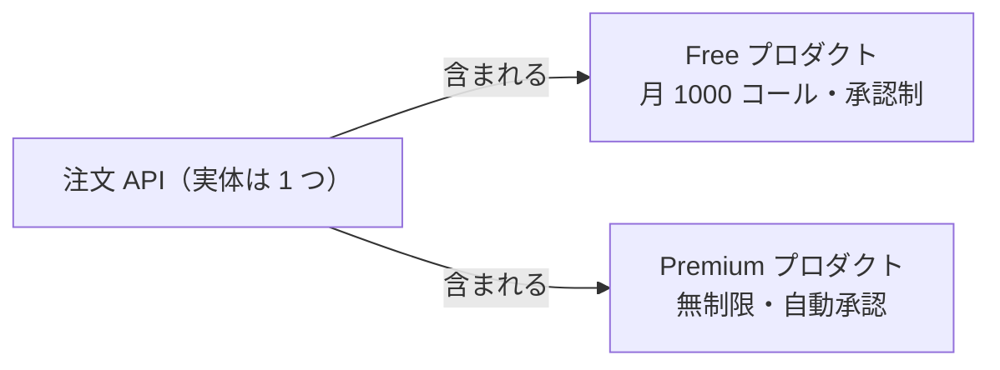
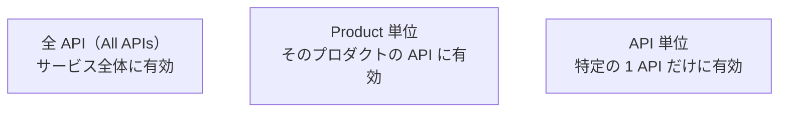
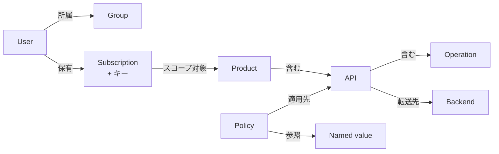
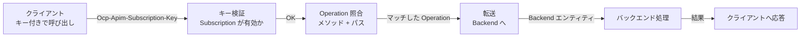

# Week 2 — オブジェクトモデルとリクエストの流れ

> **Phase 1a** | 学習プラン Week 2 / 10  
> 学習目標：APIM の中核オブジェクト（API・Operation・Product・Subscription・Backend・Named value）の役割と関係を図解でき、1 リクエストがどう処理されるかを説明できる

---

## 0. 今週の見取り図

Week 1 で「APIM は API の公開面（ファサード）」と理解した。
今週は、その公開面が**どんな部品（オブジェクト）で構成されているか**を分解する。



> ざっくり：**利用者**が**サブスクリプション（キー）**を持ち、それで**プロダクト**に含まれる**API**の**オペレーション**を呼ぶ。API は**バックエンド**へ転送する。

---

## 1. API と Operation

### API
関連する操作を 1 つにまとめた**論理的なまとまり**。
- **フロントエンド**（外部に公開される形：URL・パラメータ・認証）と、**バックエンド**（実体）を持つ
- 例：「注文 API」「天気 API」

### Operation
API の中の**個々のエンドポイント**。HTTP メソッド + URL テンプレートで定義する。
- 例：`GET /orders/{id}`、`POST /orders`、`DELETE /orders/{id}`

### API の URL 構造

```
https://{apim名}.azure-api.net / {api-suffix} / {operationのパス}
        └─ ゲートウェイのホスト ─┘ └ API 識別 ┘ └─ 操作 ─┘
```

例：`https://contoso.azure-api.net/store/orders/42`
- `contoso.azure-api.net` … APIM ゲートウェイ
- `store` … この API の suffix（API ごとに設定）
- `orders/42` … Operation `GET /orders/{id}` に id=42 でマッチ

> **フロントエンドとバックエンドは別 URL でよい**
> 公開 URL が `.../store/orders/42` でも、転送先のバックエンドは `https://internal-order-svc:8080/api/v3/order?id=42` のように全く違ってよい。この「付け替え」こそファサードの役割（変換は Week 4）。

---

## 2. Product（プロダクト）

1 つ以上の API を束ねた**公開単位**。「誰に・どんな条件で使わせるか」を定義する。

| Product が決めること | 例 |
|---|---|
| どの API を含むか | 注文 API + 在庫 API をまとめて公開 |
| 利用条件 | 月 1000 コールまで、レート 10/分 |
| 公開状態 | 公開（published）/ 非公開（draft） |
| サブスクリプション要否 | 必要 / 不要 |
| 承認フロー | 申請を自動承認 / 管理者が手動承認 |

### 典型例：同じ API を別条件で出す



同じ 1 つの API を、「無料枠（制限あり）」と「有料枠（制限なし）」の 2 プロダクトで提供できる。

### Open product と Protected product
- **Protected（保護）**：利用にサブスクリプションが必要（既定・一般的）
- **Open（開放）**：サブスクリプション不要で誰でも呼べる

---

## 3. Subscription（サブスクリプション）とキー

利用者が持つ**アクセス権**。これに紐づく**サブスクリプションキー**で API を呼ぶ。

> ⚠️ Azure の「サブスクリプション（課金単位）」とは**全く別物**。APIM 内の「API を使う権利」のこと。

### キーの渡し方
呼び出し時に HTTP ヘッダ（またはクエリ）でキーを送る：
```
curl -H "Ocp-Apim-Subscription-Key: <キー>" \
  "https://contoso.azure-api.net/store/orders/42"
```
- ヘッダ：`Ocp-Apim-Subscription-Key: <キー>`
- クエリ：`?subscription-key=<キー>`（簡便だが URL に残るので非推奨寄り）

### キーが 2 本ある理由（primary / secondary）
**無停止でローテーション**するため。
1. 普段は primary を使う
2. 漏洩・定期更新時：secondary に切り替え → primary を再生成 → また primary に戻す
3. どの瞬間も「有効なキーが 1 本以上ある」状態を保てる

### サブスクリプションのスコープ（3 種）



| スコープ | 用途 |
|---|---|
| All APIs | 管理者・内部利用など全部使いたい |
| Product | 一般的。プロダクトの利用条件ごと管理 |
| API | 単一 API だけをピンポイントで使わせたい |

---

## 4. Backend（バックエンド）

バックエンドサービスの**接続情報を再利用可能なエンティティ**として定義したもの。

| Backend が持つ情報 | 例 |
|---|---|
| URL | `https://internal-order-svc.example.com` |
| 認証 | クライアント証明書 / ヘッダ / Managed Identity |
| TLS 設定 | 証明書検証の有無など |

### なぜ「エンティティ」にするのか（直書きとの違い）
API のバックエンド URL を直接書くこともできるが、Backend エンティティにしておくと：
- **再利用**：複数 API が同じバックエンドを参照できる
- **一元管理**：URL や認証が変わっても 1 箇所直すだけ
- **発展**：ロードバランシング・サーキットブレーカーを後付けできる（Week 9）

ポリシーから `set-backend-service` で参照する（Week 3〜4）。

---

## 5. Named value（名前付き値）

ポリシーやバックエンド設定で使う**定数・シークレットの集中管理**。プログラミングの環境変数のような役割。

```
ポリシー内で {{backend-url}} と書く → 実際の値に展開される
```

| 種類 | 用途 |
|---|---|
| プレーン値 | 環境ごとに変わる URL・フラグなど（隠す必要なし） |
| シークレット | API キー・パスワード（値はマスクされる） |
| **Key Vault 参照** | Key Vault のシークレットを参照（ローテーション追従）→ Week 5 |

> **利点**：同じ値を複数ポリシーで使い回せる。環境（dev/prod）でこの値だけ差し替えれば、ポリシー本体は共通にできる。

---

## 6. User / Group

主に **Developer Portal**（API 利用者向けサイト）の利用者管理。

| 概念 | 説明 |
|---|---|
| **User** | Developer Portal に登録した API 利用者（開発者） |
| **Group** | User の権限グループ。Product の可視性を Group 単位で制御 |

### 組み込み Group
- **Administrators** … APIM 管理者
- **Developers** … 登録済みの利用者
- **Guests** … 未登録の閲覧者
- + カスタム Group（例：「パートナー企業」だけに特定 Product を見せる）

---

## 7. 全体オブジェクト関係と用語の整理

### オブジェクト関係図



### 重要な用語まとめ

| 用語 | 一言説明 |
|---|---|
| API | 関連する操作の論理的なまとまり（フロント/バック両面を持つ） |
| Operation | API 内の個々のエンドポイント（メソッド + URL テンプレート） |
| Product | API を束ねた公開単位。利用条件・承認・公開状態を定義 |
| Subscription | 利用者のアクセス権。キーで API を呼ぶ。スコープは All/Product/API |
| サブスクリプションキー | primary/secondary の 2 本。無停止ローテーション用 |
| Backend | 再利用可能なバックエンド接続定義（URL・認証・TLS） |
| Named value | 定数・シークレットの集中管理（環境変数的） |
| User / Group | Developer Portal の利用者と権限グループ |

---

## 8. リクエストが処理される流れ（1 本のリクエスト視点）

ここまでの部品が、1 リクエストでどう絡むかを追う。



1. クライアントが**サブスクリプションキー付き**でゲートウェイ URL を呼ぶ
2. APIM が**キーを検証**（無効なら `401 Access denied`）
3. URL とメソッドから**どの Operation か**を照合
4. （ポリシーを適用しつつ）**Backend へ転送**
5. バックエンドの応答を（ポリシーで加工しつつ）**クライアントへ返却**

> 「ポリシーを適用しつつ」の中身が Week 3〜4。今週は**部品の名前と関係**を確実に押さえる。

---

## ハンズオン チェックリスト

- [ ] Portal の「APIs」でデモ API を作成（`Echo API` テンプレート、または httpbin.org を手動登録）
- [ ] Operation を 1 つ追加（例：`GET /get`）し、**Test タブ**でゲートウェイ経由の呼び出しを実行
- [ ] Product を 1 つ作成 → 作った API を割り当て → Subscription を作成 → 発行キーを取得
- [ ] キー付きで `curl` 実行して 200 応答を確認
  ```
  curl -H "Ocp-Apim-Subscription-Key: <key>" \
    "https://<apim名>.azure-api.net/<suffix>/get"
  ```
- [ ] **キーを付けずに**呼んで `401 Access denied`（subscription key not found）を確認
- [ ] Week 1 のリクエストフロー図に Product / Subscription / Key を書き加える

---

## 自己チェック

週末にドキュメントを閉じて答えてみる。

1. **API・Product・Subscription の関係を第三者に図で説明できるか？**
   - キーワード：API＝操作のまとまり、Product＝公開単位、Subscription＝アクセス権

2. **同じ API を「無料枠」と「有料枠」で提供するには何を作るか？**
   - キーワード：Product を 2 つ、利用条件で差をつける

3. **サブスクリプションキーが 2 本ある理由は？**
   - キーワード：無停止ローテーション、primary/secondary

4. **Backend エンティティと、API にバックエンド URL を直書きする違いは？**
   - キーワード：再利用、一元管理、LB/サーキットブレーカーへの発展

5. **キーなしで呼ぶとどうなるか？どのステップで弾かれるか？**
   - キーワード：401 Access denied、キー検証ステップ

---

## 次週の予告（Week 3）

いよいよ APIM の心臓、**ポリシー**に入る：

- **4 セクション** — inbound / backend / outbound / on-error
- **4 スコープ** — Global / Product / API / Operation と評価順序
- **継承と `<base/>`** — 親ポリシーをどこで実行するか
- ポリシーがリクエスト/レスポンスの「どこで」効くかを正確に掴む
