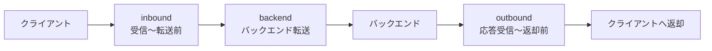
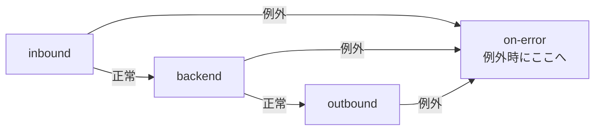
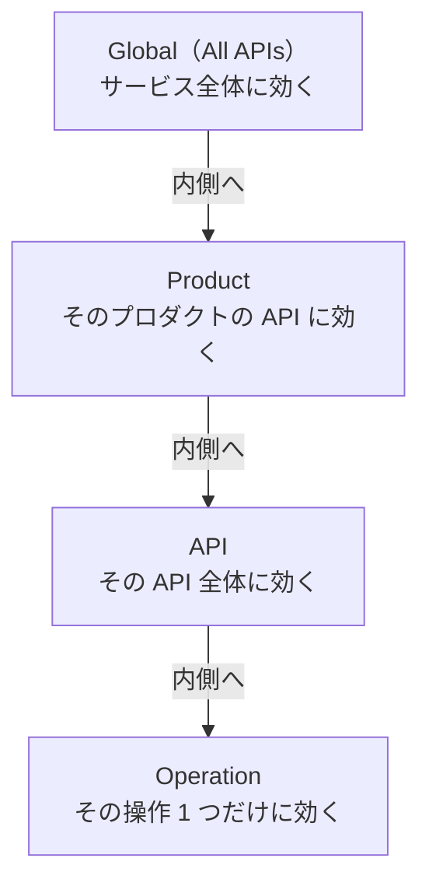
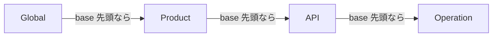
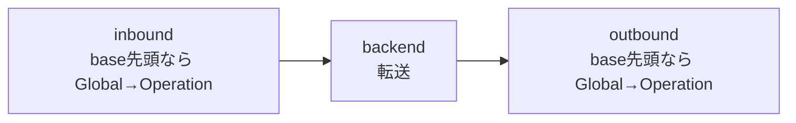

# Week 3 — ポリシーパイプラインの基礎

> **Phase 1b** | 学習プラン Week 3 / 10  
> 学習目標：APIM の中核機能であるポリシーの**実行モデル**（4 セクション・スコープ・継承）を理解し、ポリシーがリクエスト/レスポンスの「どこで」効くかを正確に説明できる

---

## 0. ポリシーとは何か（Week 1〜2 からの接続）

Week 1 で「APIM は API の公開面（ファサード）で、認証・制限・変換・監視を一元処理する」と学んだ。
その**「処理」を実際に書く場所がポリシー**。

> **ポリシー = APIM の振る舞いを定義する命令の集まり（XML で書く）**

> **初学者向け用語補足：XML とは**
> データや設定を「タグ」で構造的に書く記法。`<タグ>中身</タグ>` の形で入れ子にする。HTML の親戚。
> ```xml
> <inbound>                          開始タグ
>   <set-header name="X-A">          属性（name="..."）
>     <value>123</value>             子要素
>   </set-header>
> </inbound>                         終了タグ（/ で閉じる）
> ```
> - `<base />` のように中身がないタグは `<タグ />` と一行で閉じる（自己終了タグ）。
> - APIM のポリシーはこの XML で、「どのセクションに・どんな命令を・どの順で」並べるかを表現する。

APIM が「何を・どう・どの順で」やるかは、ほぼすべてポリシーで決まる。だから──

> 🫀 **APIM の理解度 ≒ ポリシーをどれだけ説明できるか。** 今週と来週が一番大事。

ポリシーは「リクエストが通るパイプライン」の中に並べる（Week 1 §7 のパイプラインの中身がこれ）。

---

## 1. パイプラインの 4 セクション

1 リクエストは 4 つの段階を順に通る。ポリシーは**どの段階に置くか**で効くタイミングが決まる。



| セクション | いつ実行されるか | ここに置くもの（例） |
|---|---|---|
| **inbound** | クライアントから受信後、バックエンドへ転送する前 | 認証・JWT 検証・レート制限・リクエストの加工 |
| **backend** | バックエンドへ実際に転送する処理そのもの | 転送（forward-request）・リトライ・タイムアウト・バックエンド差し替え |
| **outbound** | バックエンド応答を受けてから、クライアントへ返す前 | レスポンスの加工・ヘッダ追加・キャッシュ格納 |
| **on-error** | 上のどこかで**例外が起きた**ときに実行 | エラーの整形・ロギング・代替応答 |

### on-error の位置づけ
on-error は「順番に通る 4 番目」ではなく、**どの段階でエラーが起きても飛んでくる例外処理**。try-catch の catch に近い。



> **判断の型**：「リクエストに対して何かしたい」→ inbound、「レスポンスに対して何かしたい」→ outbound、「転送の仕方を変えたい」→ backend、「失敗時の処理」→ on-error。

---

## 2. ポリシースコープ（どこに書くか）

同じ 4 セクションが、**4 つの階層（スコープ）**に存在する。広い範囲から狭い範囲へ入れ子になっている。



| スコープ | 効く範囲 | 使いどころ（例） |
|---|---|---|
| **Global** | すべての API | 全社共通の CORS・共通ログ・グローバルなレート制限 |
| **Product** | その Product に含まれる API | 「Free プロダクトは月 1000 まで」などプラン別制限 |
| **API** | その API のすべての Operation | この API 共通の認証・バックエンド設定 |
| **Operation** | その Operation 1 つ | 「この削除操作だけ追加チェック」など個別処理 |

> **イメージ**：会社の就業規則。
> 全社規則（Global）→ 部門規則（Product）→ チーム規則（API）→ 個人の取り決め（Operation）。
> 内側ほど具体的・例外的。

> **補足：正確には 5 スコープ**
> 公式では Global と Product の間に **Workspace**（チーム単位の分権管理）があり、`Global → Workspace → Product → API → Operation` の 5 階層。Workspace は大組織向けの機能なので本書では Week 9 で扱う。当面は上の 4 つで考えてよい。

---

## 3. 評価順序は `<base/>` で決まる（ここが最重要）

> ⚠️ **よくある誤解**：「スコープが入れ子だから外→内→内→外で自動的に決まる」「outbound は inbound の逆順になる」── **どちらも不正確**。
> 公式ドキュメント：
> > "determine the policy evaluation order **by placement of the `base` element** in each section"
> > （評価順序は各セクションの `base` 要素の**置き場所で決まる**）

### 仕組み：テンプレート展開
実効ポリシー（effective policy）は、最も内側の **Operation から始めて、`<base/>` を親スコープの内容で置き換えていく**ことで作られる。`<base/>` =「このセクションの親スコープのポリシーをここに差し込む」。

### 既定（`<base/>` を各セクションの先頭に置く＝推奨）
このとき inbound・outbound・on-error すべてが、次の順で実行される：



```
effective な inbound（base 先頭の場合）       effective な outbound（base 先頭の場合）
  [Global の inbound]                           [Global の outbound]
  [Product の inbound]                          [Product の outbound]
  [API の inbound]                              [API の outbound]
  [Operation の inbound]                        [Operation の outbound]
  → 上から順に実行：Global→Operation            → 上から順に実行：Global→Operation
```

> **重要**：outbound も「base 先頭」なら inbound と**同じ Global→Operation 順**。
> **自動で逆順にはならない。** 逆順（Operation→Global）にしたいなら、outbound の `<base/>` を**末尾**に置く。

### `<base/>` を動かすと順序が変わる（自分で制御する）

| `<base/>` の位置 | 実行順 |
|---|---|
| セクションの**先頭** | 親（外側）→ 自分（内側） |
| セクションの**末尾** | 自分（内側）→ 親（外側） |

公式の例（API スコープの inbound、base が中間）：
```xml
<inbound>
  <cross-domain />     <!-- ① API 自身：base より前なので最初 -->
  <base />             <!-- ② 親（Global/Product）の inbound がここで走る -->
  <find-and-replace from="xyz" to="abc" />  <!-- ③ API 自身：base より後 -->
</inbound>
```
→ 実行順：cross-domain → 親スコープの inbound → find-and-replace

> 💡 Portal の **「Calculate effective policy」** で、展開後の実効ポリシー（実際の実行順）を確認できる。迷ったら必ずこれで答え合わせする。

---

## 4. ポリシー継承と `<base/>`

各スコープのポリシーは独立して書けるが、**内側スコープは外側（親）のポリシーを引き継ぐ**。その引き継ぎ位置を示すのが `<base/>`。

### `<base/>` とは
`<base/>` =「**ここで親スコープの同じセクションのポリシーを実行する**」というプレースホルダ（差し込み口）。

```xml
<policies>
  <inbound>
    <base />            <!-- ← ここで親（外側スコープ）の inbound が走る -->
    <!-- このスコープ独自の inbound ポリシーをここに書く -->
  </inbound>
  <backend><base /></backend>
  <outbound><base /></outbound>
  <on-error><base /></on-error>
</policies>
```

### `<base/>` の位置で「親の前/後」を選べる

```xml
<!-- パターンA：親 → 自分 -->
<inbound>
  <base />
  <set-header name="X-Mine" ... />   <!-- 親の後に自分の処理 -->
</inbound>

<!-- パターンB：自分 → 親 -->
<inbound>
  <set-header name="X-Mine" ... />   <!-- 親より先に自分の処理 -->
  <base />
</inbound>
```

| 書き方 | 実行順 |
|---|---|
| `<base/>` を先頭 | 親の処理 → 自分の処理 |
| `<base/>` を末尾 | 自分の処理 → 親の処理 |

### `<base/>` を消すとどうなる
そのセクションでは**親スコープのポリシーが継承されない**（＝外側の処理がスキップされる）。

> ⚠️ うっかり `<base/>` を消すと、Global で設定した共通認証やログが効かなくなる、という事故が起きやすい。「親を意図的に切りたいとき以外は `<base/>` を残す」のが基本。

> **イメージ**：`<base/>` = 親レシピの「ここまでの工程を全部やる」という一行。
> 自分のレシピのどこに置くかで、親工程を「先にやる／後でやる」を選べる。その行を消すと親工程をまるごと飛ばす。

---

## 5. ポリシーの編集方法（Portal）

- ポリシーは**スコープごとに別々のエディタ**で編集する
  - Global … APIs 一覧の「All APIs」のポリシー
  - Product … 各 Product の「Policies」
  - API … その API の「All operations」のポリシー（鉛筆/`</>`アイコン）
  - Operation … 個々の Operation の「Inbound/Outbound processing」
- エディタは **XML 直接編集**と、**コードスニペット挿入**（`+ Add policy`）の両方が使える
- 慣れるまではスニペットで挿入 → XML を読んで意味を確認、がおすすめ

---

## 6. 全体整理

### パイプライン × スコープのマトリクス
1 リクエストは「4 セクション × スコープ」の格子を通る、とイメージするとよい。各セクション内の実行順は `<base/>` の位置で決まる（既定＝先頭なら Global→Operation）。



### 重要な用語まとめ

| 用語 | 一言説明 |
|---|---|
| ポリシー | APIM の振る舞いを定義する XML の命令群 |
| inbound | 受信〜転送前。認証・検証・制限・リクエスト加工 |
| backend | 転送そのもの。リトライ・差し替え |
| outbound | 応答受信〜返却前。レスポンス加工・キャッシュ格納 |
| on-error | 例外時に飛ぶ処理（try-catch の catch 的） |
| スコープ | Global / (Workspace) / Product / API / Operation の階層 |
| 評価順序 | `<base/>` の位置で決まる。既定（base 先頭）なら inbound も outbound も Global→Operation。自動反転はしない |
| `<base/>` | 親スコープのポリシーをここで実行する差し込み口。先頭=親が先、末尾=自分が先 |
| Calculate effective policy | Portal で展開後の実効ポリシー（実際の実行順）を確認する機能 |

---

## ハンズオン チェックリスト

- [ ] Week 2 で作った API の **All operations** スコープに inbound ポリシーを追加：
  ```xml
  <set-header name="X-Hello" exists-action="override">
    <value>from-apim</value>
  </set-header>
  ```
  → Test タブのトレースで、バックエンドに届くリクエストにヘッダが付くのを確認
- [ ] **outbound** にレスポンスヘッダを追加し、`curl -i`（または Test）で確認
- [ ] Global と API の両方に `set-header` を置き、`<base/>` の位置を前後で変えて**適用順序の違い**を観察
- [ ] `<base/>` を一度消してみて、Global のヘッダが消えることを確認（確認後すぐ戻す）
- [ ] ノートに「inbound/backend/outbound/on-error に何を置くか」を自分の言葉で整理

> **トレースの見方**：Test タブで呼び出すと、各ポリシーがどの順で評価されたかがステップ表示される（`Ocp-Apim-Trace` の仕組み・詳細は Week 8）。評価順序を目で確認できる強力なツール。

---

## 自己チェック

週末にドキュメントを閉じて答えてみる。

1. **レート制限は inbound・outbound のどちらに書くべきか？なぜ？**
   - キーワード：バックエンドに行く前に止めたい → inbound

2. **`<base/>` を削除すると何が起きるか？**
   - キーワード：親スコープのポリシーが継承されない、共通処理がスキップ

3. **Global と Operation のポリシーが両方あるとき、実行順は何で決まるか？「outbound は自動で逆順」は正しいか？**
   - キーワード：`<base/>` の位置で決まる、既定（base 先頭）なら inbound も outbound も Global→Operation、自動反転はしない、Calculate effective policy

4. **バックエンドのレスポンスを書き換えたいときは、どのセクション？**
   - キーワード：outbound

5. **「この削除操作だけ追加の権限チェック」を入れたい。どのスコープ？**
   - キーワード：Operation スコープ

---

## 次週の予告（Week 4）

具体的なポリシーと、ポリシー式（`context`）に踏み込む：

- **アクセス制限** — rate-limit / quota / ip-filter
- **変換** — set-header / rewrite-uri / set-body / json↔xml / cors
- **制御フロー** — choose/when / return-response / mock-response / send-request
- **ポリシー式** — `@(...)` / `context` オブジェクトを**読めるようになる**
