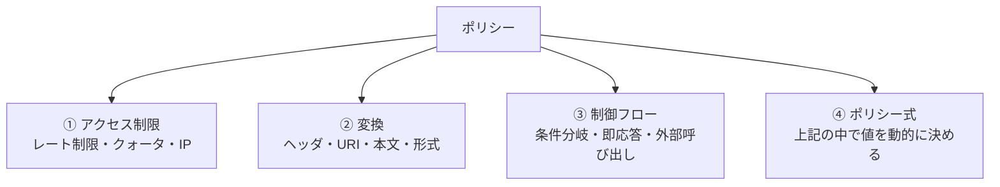
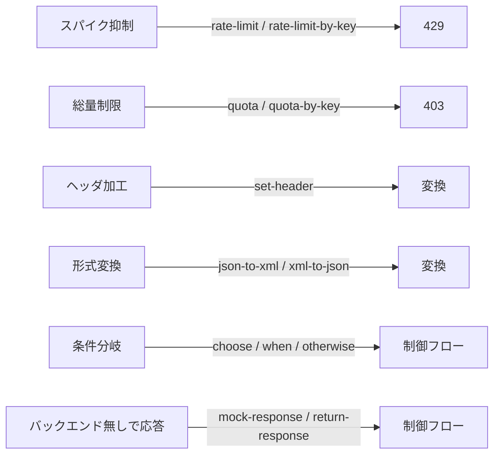

# Week 4 — 主要ポリシーとポリシー式

> **Phase 1b** | 学習プラン Week 4 / 10  
> 学習目標：実務頻用のポリシー（変換・レート制限・キャッシュ・制御フロー）を分類して理解し、`context` を使ったポリシー式を**読んで意味が説明できる**

---

## 0. 今週の位置づけ

Week 3 で「ポリシーの**器**（4 セクション・スコープ・`<base/>`）」を学んだ。
今週はその器に入れる「**中身**（個々のポリシー）」を、用途で分類して押さえる。

> ⚠️ 個々のポリシーは 75 種類以上ある。全部覚えるのではなく、**「どんな用途のものがあるか」の地図**を作るのが目標。ポリシー式は「自分で書く」より「**読める**」を優先（C# 経験がなくてよい）。

ポリシーはおおまかに 4 つの用途に分けられる：



---

## 1. アクセス制限・トラフィック管理

### レート制限とクォータの違い（最重要の区別）

| | レート制限（rate-limit系） | クォータ（quota系） |
|---|---|---|
| 目的 | 短時間の**スパイク抑制** | 長期の**総量上限** |
| 期間の例 | 10 回 / 60 秒 | 10000 回 / 月 |
| 期間上限 | `renewal-period` は**最大 300 秒**（公式仕様） | 長期間（時間・日・月）OK |
| 超過時 | `429 Too Many Requests` | `403 Forbidden`（quota は 403） |

> **覚え方**：レート制限 = 「一気に来るな（蛇口の勢い）」、クォータ = 「合計でここまで（バケツの容量）」。
> レート制限は最大 300 秒なので、「月◯回」のような長期上限は必ずクォータ側で表現する。

### 主なポリシー

| ポリシー | 何でカウントするか |
|---|---|
| `rate-limit` | **サブスクリプション単位**（プロダクトに紐づく標準のレート制限） |
| `rate-limit-by-key` | **任意のキー単位**（IP・ユーザー・ヘッダなど式で指定） |
| `quota` | サブスクリプション単位の総量 |
| `quota-by-key` | 任意のキー単位の総量 |
| `ip-filter` | 送信元 IP の許可/拒否（allow / deny） |

### `rate-limit-by-key` の例（公式リファレンスより）
```xml
<rate-limit-by-key calls="10"
      renewal-period="60"
      counter-key="@(context.Request.IpAddress)"
      increment-condition="@(context.Response.StatusCode == 200)"
      remaining-calls-variable-name="remainingCallsPerIP" />
```
- `counter-key` … カウントの単位（ここでは呼び出し元 IP）。同じキー値は**全スコープで 1 つのカウンタを共有**
- `calls` / `renewal-period` … 「60 秒で 10 回まで」
- `increment-condition` … 数える条件（ここでは 200 応答のときだけ加算）

> **公式確認メモ**
> - `rate-limit-by-key` は **inbound セクション専用**
> - 対応ティア：Developer / Basic / Basic v2 / Standard / Standard v2 / Premium / Premium v2 → **Consumption ティアは非対応**
> - カウンタは**各ゲートウェイで独立**（マルチリージョンでも全体合算はしない）

---

## 2. 変換（Transformation）

リクエスト/レスポンスを加工する。APIM が「ファサード」として表と裏を付け替える中核。

| ポリシー | 用途 |
|---|---|
| `set-header` | ヘッダの追加・上書き・削除（`exists-action` で挙動指定） |
| `set-query-parameter` | クエリパラメータの設定 |
| `rewrite-uri` | 公開 URL → バックエンド URL のパス書き換え |
| `set-body` | 本文を組み立て直す（テンプレート/Liquid 可） |
| `json-to-xml` / `xml-to-json` | 形式変換（レガシー SOAP ↔ REST 仲介の定番） |
| `find-and-replace` | 本文中の文字列置換 |
| `cors` | ブラウザからの呼び出し許可（SPA・Developer Portal に必須） |

### set-header の例
```xml
<set-header name="X-Source" exists-action="override">
  <value>apim</value>
</set-header>
```
`exists-action` の値：`override`（上書き）/ `skip`（あれば触らない）/ `append`（追記）/ `delete`（削除）。

> **CORS の注意**：ブラウザの JavaScript から APIM を直接呼ぶ場合、`cors` がないとブラウザ側でブロックされる（サーバ間呼び出しでは不要）。Developer Portal の「Try it」も CORS が要る。

---

## 3. 制御フロー

リクエストの流れを分岐させたり、途中で止めたり、外部を呼んだりする。

| ポリシー | 用途 |
|---|---|
| `choose` / `when` / `otherwise` | 条件分岐（if / else if / else） |
| `return-response` | バックエンドに行かず**その場で応答を組み立てて返す** |
| `mock-response` | 定義済みのサンプル応答を返す（バックエンド未完成時の並行開発） |
| `send-request` | 副次的に**別の HTTP を呼ぶ**（認可サーバ照会など。応答を使う） |
| `send-one-way-request` | 投げっぱなしの外部呼び出し（通知など。応答を待たない） |
| `retry` | 条件付きリトライ |
| `forward-request` | backend セクションでの「実際の転送」（既定で入っている） |

### choose の例
```xml
<choose>
  <when condition="@(context.Request.Headers.GetValueOrDefault("X-Debug","") == "1")">
    <set-header name="X-Mode" exists-action="override"><value>debug</value></set-header>
  </when>
  <otherwise>
    <set-header name="X-Mode" exists-action="override"><value>normal</value></set-header>
  </otherwise>
</choose>
```

### return-response と mock-response の違い
- `mock-response` … API 定義の**サンプル応答**をそのまま返す（中身は定義側に用意）。「バックエンドがまだ無い」開発初期に便利
- `return-response` … ポリシーで**自分で応答を組み立てて**返す（ステータス・ヘッダ・本文を指定）。短絡・エラー整形・固定応答に使う

> どちらも「バックエンドに行かずに応答を返す」点は同じ。**中身を定義のサンプルに任せる＝mock、自分で作る＝return**。

---

## 4. ポリシー式（C# 式）

ポリシーの属性値や本文を、**動的に**決めるための小さな C# コード。

### 2 つの構文（公式）
| 形 | 用途 |
|---|---|
| `@(式)` | **単一の式**。値を 1 つ返す |
| `@{ 文; ... return 値; }` | **複数文**。`return` で値を返す（全経路で return 必須） |

```xml
<!-- 単一式 -->
<set-header name="X-Region" exists-action="override">
  <value>@(context.Deployment.Region)</value>
</set-header>
```
```xml
<!-- 複数文（読めれば OK）-->
<set-header name="X-Auth-State" exists-action="override">
  <value>@{
    var auth = context.Request.Headers.GetValueOrDefault("Authorization", "");
    return auth.Length > 0 ? "has-auth" : "anon";
  }</value>
</set-header>
```

### `context` オブジェクト（暗黙で使える・すべて読み取り専用）

1 リクエストの情報がすべてここにある。よく使うメンバー（公式リファレンスより抜粋）：

| メンバー | 主なプロパティ | 何が取れるか |
|---|---|---|
| `context.Request` | `Method` / `Url` / `Headers` / `Body` / `IpAddress` / `MatchedParameters` | 受信リクエストの中身 |
| `context.Response` | `StatusCode` / `Headers` / `Body` | バックエンド応答（outbound で使う） |
| `context.Subscription` | `Id` / `Name` / `Key` / `PrimaryKey` | 呼び出し元のサブスクリプション |
| `context.User` | `Id` / `Email` / `Groups` | Developer Portal 利用者 |
| `context.Product` | `Id` / `Name` / `State` | 対象プロダクト |
| `context.Api` / `context.Operation` | `Id` / `Name` / `Path` など | どの API/操作か |
| `context.Variables` | `IReadOnlyDictionary` | `set-variable` で保持した値の置き場 |
| `context.LastError` | `Message` / `Reason` / `Source` | on-error で使うエラー情報 |

> **ヘッダ取得の定番**：`context.Request.Headers.GetValueOrDefault("名前", "既定値")`
> ── ヘッダが無くても例外にならず既定値が返る（公式が用意した安全な取り方）。

### `set-variable` で値を引き回す
```xml
<set-variable name="callerIp" value="@(context.Request.IpAddress)" />
<!-- 後続で参照 -->
<set-header name="X-Caller" exists-action="override">
  <value>@((string)context.Variables["callerIp"])</value>
</set-header>
```

> **式の読み方練習**：いきなり書かず、既存の式を 1 行ずつ日本語に翻訳する。
> 例：`@(context.Request.Headers.GetValueOrDefault("Authorization","").Length > 0 ? "has-auth" : "anon")`
> → 「Authorization ヘッダ（無ければ空文字）の長さが 0 より大きければ "has-auth"、そうでなければ "anon"」

---

## 5. 全体整理

### 用途 → 代表ポリシーの対応



### 重要な用語まとめ

| 用語 | 一言説明 |
|---|---|
| rate-limit（系） | 短時間のスパイク抑制。最大 300 秒。超過で 429 |
| quota（系） | 長期の総量上限。月単位など。超過で 403 |
| counter-key | rate-limit-by-key 等のカウント単位（同値は全スコープで共有） |
| set-header | ヘッダの追加/上書き/削除。exists-action で挙動指定 |
| rewrite-uri | 公開 URL → バックエンド URL のパス書き換え |
| json-to-xml / xml-to-json | 形式変換。SOAP↔REST 仲介の定番 |
| cors | ブラウザからの呼び出し許可。SPA・Try it に必須 |
| choose/when/otherwise | 条件分岐 |
| mock-response / return-response | バックエンドに行かず応答。サンプル任せ=mock、自作=return |
| `@(...)` / `@{...}` | 単一式 / 複数文（return 必須） |
| context | リクエスト情報の読み取り専用オブジェクト |

---

## ハンズオン チェックリスト

- [ ] `rate-limit-by-key`（`counter-key` をサブスクリプション ID か IP）を 5 calls / 30 sec で設定 → 連打して `429` を確認
  ```xml
  <rate-limit-by-key calls="5" renewal-period="30"
        counter-key="@(context.Subscription?.Id ?? context.Request.IpAddress)" />
  ```
  ※ Consumption ティアでは非対応なので Developer ティア等で試す
- [ ] `mock-response` を設定し、バックエンド未接続のまま固定応答が返ることを確認
- [ ] `choose` + 式で、特定ヘッダ（例 `X-Debug: 1`）がある時だけ別ヘッダを付ける分岐を実装
- [ ] `xml-to-json` または `set-body` で応答の整形を 1 つ試す
- [ ] Test タブのトレースで、各ポリシーがどの順に評価されたか確認（Week 3 の評価順序を目で再確認）

---

## 自己チェック

週末にドキュメントを閉じて答えてみる。

1. **`rate-limit` と `quota` をいつ使い分けるか？「月 10000 回」はどちらで書くべき？**
   - キーワード：スパイク抑制 vs 総量、rate-limit は最大 300 秒なので月単位は quota、429 vs 403

2. **`mock-response` と `return-response` の違いは？**
   - キーワード：サンプル任せ vs 自分で組み立てる、どちらもバックエンドに行かない

3. **ポリシー式の `context` から「呼び出し元のサブスクリプション名」を取るには？**
   - キーワード：`context.Subscription.Name`

4. **SOAP バックエンドを REST として公開するとき、どのポリシーが要るか？**
   - キーワード：xml-to-json / json-to-xml、変換

5. **`@(...)` と `@{...}` の違いは？**
   - キーワード：単一式 / 複数文、複数文は return 必須

6. **ブラウザの JS から APIM を直接呼ぶのに失敗する。まず疑うポリシーは？**
   - キーワード：cors

---

## 次週の予告（Week 5）

Phase 2a に入り、セキュリティを 3 分類で学ぶ：

- **クライアント認証** — サブスクリプションキー / `validate-jwt`（OAuth2/OIDC）/ クライアント証明書（mTLS）
- **バックエンド認証** — `authentication-managed-identity` / 証明書
- **シークレット管理** — Named value の Key Vault 参照
