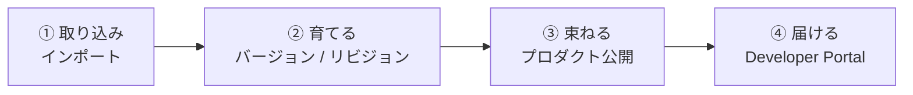
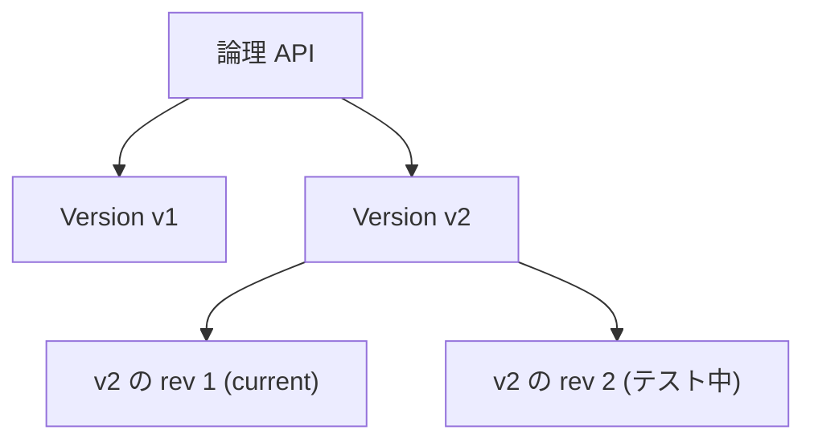

# Week 6 — API ライフサイクルとガバナンス

> **Phase 2a** | 学習プラン Week 6 / 10  
> 学習目標：API の取り込み（インポート）からバージョン管理・公開・利用者向けポータルまで、API のライフサイクル全体を運用観点で説明できる

---

## 0. 今週の位置づけ

Week 2〜5 で「API をどう構成し、ポリシーで守るか」を学んだ。
今週は時間軸の話 ——「API を**どう取り込み・育て・利用者に届けるか**」というライフサイクル。



---

## 1. API のインポート（フロントエンド定義の作り方）

Week 2 では手動で Operation を作ったが、実務では**既存の定義ファイルやリソースから自動生成**するのが普通。

| 取り込み元 | 内容 |
|---|---|
| **OpenAPI / Swagger**（最頻出） | 定義ファイル（JSON/YAML）から Operation を一括自動生成 |
| **WSDL（SOAP）** | SOAP パススルー、または **SOAP-to-REST 変換**で公開 |
| **Azure リソース直結** | Function App / Logic App / App Service / Container App を選ぶだけ |
| GraphQL / gRPC / OData / WebSocket | 各プロトコル（詳細は Week 9） |

> **ポイント**：OpenAPI を取り込むと、パス・メソッド・パラメータ・サンプル応答までまとめて定義される。Week 2 で手作業した内容が一瞬で揃う。
> Function App を取り込むと、その関数群が API/Operation として自動登録され、バックエンドも自動で紐づく。

---

## 2. バージョン（Versions）

**利用者に見える「破壊的変更」を安全に扱う**ための仕組み。複数バージョンを**同時に並存**させ、利用者が使うものを選ぶ。

> 破壊的変更（breaking change）= 既存の呼び出し方が壊れる変更。例：必須パラメータの追加、レスポンス形式の変更、エンドポイント削除。

### 3 つのバージョニング方式
利用者がどのバージョンを使うかを指定する方法。**1つの version set 内では全バージョンが同じ方式**（最初に決めた方式に固定）。

| 方式 | 指定の仕方 | 例 |
|---|---|---|
| **Path** | URL パスに含める | `https://.../products/v1/...` |
| **Header** | カスタムヘッダで指定 | `Api-Version: v1` |
| **Query string** | クエリで指定 | `https://.../products?api-version=v1` |

- バージョン識別子は**任意の文字列**（数字 `v1`・日付 `2024-01-01`・名前など）
- 各バージョンは事実上「独立した API」。Operation もポリシーもバージョンごとに違ってよい

### Original 版（公式の重要な挙動）
非バージョンの API にあとからバージョンを足すと、**`Original` というバージョンが自動生成**され、**バージョン識別子なしの既定 URL で応答**する。
→ 既存の呼び出し元を壊さずにバージョン導入できる。

### version set（バージョンの束）
APIM は内部に **version set** というリソースを持ち、「1つの論理 API のバージョン群」をまとめる。表示名と**バージョニング方式**を保持する。最後のバージョンを消すと自動削除される。

> **公式確認メモ**
> - version set 内のバージョニング方式は、最初のバージョン追加時に決まり**全バージョン共通**
> - Developer Portal にバージョンを表示するには、**そのバージョンをプロダクトに追加**する必要がある

---

## 3. リビジョン（Revisions）

**非破壊的な変更を、本番に影響を与えず試して切り替える**ための仕組み。

仕組み：
1. 新しいリビジョンを作る（本番＝current はそのまま動き続ける）
2. そのリビジョンで編集・テスト
3. 準備できたら **「current にする（make current）」** で本番へ昇格
4. 問題があれば、前のリビジョンを current に戻す＝**ロールバック**

### 特定リビジョンへのアクセス（公式の注意）
`;rev={番号}` を **API ID に付ける**（URI パスではない。クエリ文字列の前）：
```
https://apis.contoso.com/customers;rev=3/leads?customerId=123
                                  ^^^^^^^ API ID に付ける
```

### change log と description（公開 / 非公開の違い）
| | 用途 | 見える先 |
|---|---|---|
| **description** | 自分用のメモ | 非公開（利用者には見えない） |
| **change log** | current 昇格時の変更告知 | **公開**（Developer Portal に掲載） |

> **公式確認メモ**
> - 非 current のリビジョンでは、Name / Path / Protocols / Subscription required / API version などの**プロパティは変更不可**（current でのみ変更可）。変えようとすると `Can't change property for non-current revision` エラー
> - リビジョンは**オフライン化**でき、URL を知っていてもアクセス不可にできる（テスト中の保護に）

---

## 4. バージョン vs リビジョン（最重要・混同注意）

両者は**別機能**で、組み合わせられる（各バージョンが複数リビジョンを持てる）。

| | バージョン（Version） | リビジョン（Revision） |
|---|---|---|
| 主な用途 | **破壊的変更** | **非破壊的・小さな変更** |
| 利用者から見えるか | 見える（選んで使う） | 基本見えない（current が使われる） |
| 並存 | 複数バージョンが同時稼働 | current は常に1つ（他は控え） |
| 指定方法 | Path / Header / Query | `;rev=` で明示（通常は指定しない） |
| 公式の言い回し | breaking changes 向け | minor and non-breaking changes 向け |



> **判断の型**：互換性が**壊れる** → Version。互換性が**壊れない**改修・段階適用 → Revision。
> リビジョンに破壊的変更が出てしまったら、「**Create Version from Revision**」で正式なバージョンへ昇格できる。

---

## 5. プロダクト公開とアクセス制御

Week 2 の Product を「公開」する運用面。

| 設定 | 内容 |
|---|---|
| 公開 / 非公開 | published（利用可能）/ draft（編集中・非公開） |
| サブスクリプション承認 | 自動承認 / **管理者の手動承認**（無制限利用を防ぐ） |
| 利用規約（Legal terms） | サブスク申請時に同意させる文面 |
| API の束ね | 複数 API を 1 プロダクトにまとめて提供 |

> プロダクトを published にして初めて、利用者が Developer Portal から見つけて購読できる。

---

## 6. Developer Portal

API **利用者（開発者）向けの自動生成サイト**。

- **API リファレンス** … 取り込んだ定義から自動生成されるドキュメント
- **試用コンソール（Try it）** … ブラウザから実際に API を呼べる（CORS が要る・Week 4）
- **サブスクリプション申請** … 利用者が自分でキーを取得
- **change log** … リビジョンの公開メモがここに出る

| 種類 | 説明 |
|---|---|
| マネージドポータル | Azure が用意・ビジュアルエディタでカスタマイズ。**公開（publish）操作で反映** |
| セルフホストポータル | ソースを自分でホストし高度にカスタマイズ |

> ⚠️ Developer Portal は **Consumption ティアでは利用不可**（公式）。

---

## 7. ガバナンス補助

API が増えてきたときに統制を保つ仕組み（本格的な分権管理は Week 9 の Workspaces）。

- **タグ** … API をタグ付けして分類・絞り込み
- **命名規則** … API 名・suffix・バージョン識別子の一貫性
- これらは後の **CI/CD（APIOps）** や Workspaces につながる土台

---

## 8. 全体整理

### 重要な用語まとめ

| 用語 | 一言説明 |
|---|---|
| インポート | OpenAPI / WSDL / Azure リソースから API を自動生成 |
| バージョン | 破壊的変更を並存管理。Path/Header/Query の3方式 |
| version set | 1論理APIのバージョン群を束ねるリソース（方式は共通） |
| Original 版 | 非バージョンAPIにバージョン追加時、自動生成される既定URL応答版 |
| リビジョン | 非破壊的変更を試して切替。current を1つ持つ |
| `;rev=` | 特定リビジョンへのアクセス。API ID に付ける |
| make current | リビジョンを本番に昇格（戻せばロールバック） |
| change log / description | 公開メモ / 非公開メモ |
| Create Version from Revision | リビジョンを正式バージョンへ昇格 |
| Developer Portal | 利用者向け自動生成サイト（Consumption 不可） |

---

## ハンズオン チェックリスト

- [ ] 公開 OpenAPI（例：Swagger Petstore の `openapi.json`）をインポートし、Operation が自動生成されることを確認
- [ ] その API に **Version**（`v1`）を Path 方式で導入し、`.../v1/...` でアクセスできることを確認。`Original` 版が自動生成されたことも確認
- [ ] **Revision** を1つ作り、Operation かポリシーを少し変更 → `;rev=2` で試す → **current に昇格** → change log を記録
- [ ] 前のリビジョンを current に戻して**ロールバック**を体験
- [ ] Developer Portal を起動・公開し、利用者目線で API ドキュメントと「Try it」を試す
- [ ] ノートに Version と Revision の違いを1枚の表で自作

---

## 自己チェック

週末にドキュメントを閉じて答えてみる。

1. **Version と Revision の違いを、具体的な変更例2つで説明できるか？**
   - キーワード：破壊的=Version、非破壊的=Revision、並存 vs current 1つ

2. **バージョニングの3方式（Path/Header/Query）それぞれの指定方法は？**
   - キーワード：URLパス / カスタムヘッダ / クエリ、version set で方式共通

3. **非バージョンの API にバージョンを足すと、既存の呼び出し元が壊れないのはなぜ？**
   - キーワード：Original 版が自動生成され既定 URL で応答

4. **`;rev=` はどこに付けるか？current にするとは何が起きるか？**
   - キーワード：API ID に付ける、本番に昇格、戻せばロールバック

5. **change log と description の違いは？**
   - キーワード：公開（Developer Portal）/ 非公開（自分用）

6. **Developer Portal は誰のための、何をする場所か？**
   - キーワード：利用者向け、ドキュメント・Try it・購読申請

---

## 次週の予告（Week 7）

Phase 2b に入り、ネットワークと配置形態へ：

- **VNet 統合** — External / Internal モードの違い
- **Private Endpoint** — 受信のプライベート化
- **Self-hosted Gateway** — オンプレ/他クラウドで動かす
- **前段の WAF 構成** — App Gateway / Front Door との組み合わせ
