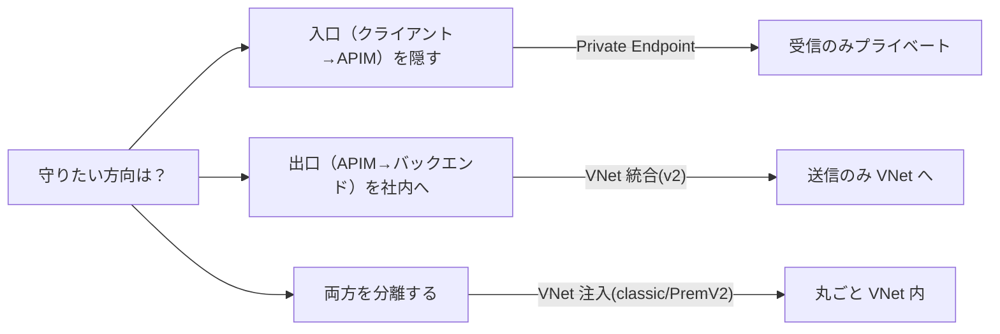
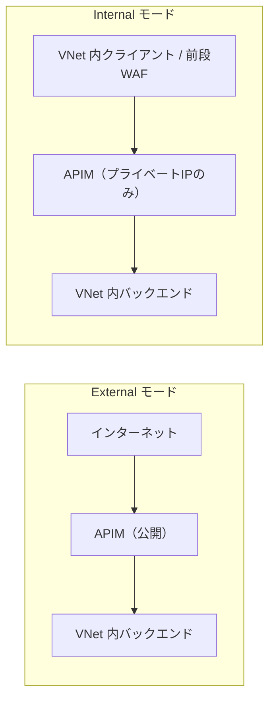
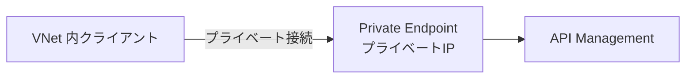
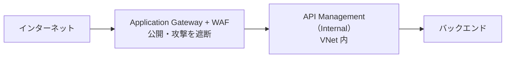
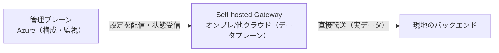

# Week 7 — ネットワークと配置形態

> **Phase 2b** | 学習プラン Week 7 / 10  
> 学習目標：APIM のネットワーク統合（VNet 外部/内部・Private Endpoint・Self-hosted Gateway）の違いと適用シナリオを説明でき、前段の WAF 構成の意図を理解できる

---

## 0. 出発点：既定では全部「公開」

既定の APIM は、**インターネット上の公開エンドポイント**で受け付け、**公開バックエンド**へ繋ぐ。
だが実務では「バックエンドは社内ネットワークの中」「API を社内限定にしたい」という要件が出てくる。

そこで APIM には、**Azure 仮想ネットワーク（VNet）と組み合わせて、入口（inbound）や出口（outbound）を絞る**オプションが用意されている。**どのオプションが使えるかはティアで決まる**。



> **初学者向け用語補足**
> - **VNet（Virtual Network・仮想ネットワーク）**：Azure 上に作る「自分専用の閉じたネットワーク」。中のリソースはプライベート IP で通信できる。
> - **サブネット**：VNet をさらに区切った区画。APIM はこのサブネットに配置される。
> - **プライベート IP / パブリック IP**：VNet 内だけで通じる住所 / インターネットから見える住所。
> - **NSG（Network Security Group）**：サブネットの通信を許可/拒否するルール集（ファイアウォール的）。
> - **ExpressRoute / S2S VPN**：オンプレ（自社データセンター）と Azure を専用線/暗号トンネルで繋ぐ仕組み。

---

## 1. VNet 注入（injection）— External と Internal

**VNet 注入** = APIM インスタンス**そのものを VNet のサブネットに入れる**方式（classic の Developer / Premium）。inbound・outbound の両方を VNet 経由にできる。注入には **External** と **Internal** の2モードがある。

| | External モード | Internal モード |
|---|---|---|
| ゲートウェイの公開 | **公開のまま**（外部ロードバランサ経由） | **VNet 内のみ**（内部ロードバランサ経由） |
| VNet 内リソースへのアクセス | できる | できる |
| 代表シナリオ | 公開 API を出しつつ、**プライベート/オンプレのバックエンド**に到達したい | 社内限定 API、前段に WAF を置く、ハイブリッド、複数拠点を単一ゲートウェイで |



> **覚え方**：External=「**入口は公開**、バックエンドは VNet」。Internal=「**入口も VNet 内**（外から直接は触れない）」。

#### 補足：APIM 本体の場所と VIP / DIP（公式用語）
**External でも Internal でも、APIM 本体は同じく VNet のサブネット内**に配置される（「External だから VNet の外」ではない）。違いは「入口をどのロードバランサで公開するか」だけ。

APIM は内部に2種類の IP を持つ：

| 用語 | 正体 | 用途 |
|---|---|---|
| **VIP（Virtual IP）** | ロードバランサの代表アドレス | **クライアントが到達する入口**。External=パブリック VIP / Internal=内部LBのプライベート VIP |
| **DIP（Dynamic IP）** | サブネット内の**各 VM のプライベート IP** | APIM が **VNet/ピアVNet のバックエンドへ出ていく**ために使う。**クライアントの接続先ではない** |

- 内部のロードバランサは **Azure（APIM）管理**。既定で全受信を拒否するため、**NSG で明示的に許可**が必要
- **クライアントが叩くのは VIP**。各 VM の DIP は「裏口（バックエンド到達用）」であり、**ユーザーは直接使わない**
- 「APIM の入口がプライベート IP」なのは **Internal モードの話**（内部LBのプライベート VIP）。External の入口はパブリック VIP

```
■ External   [クライアント] → [パブリックVIP / 外部LB] → [VM群(DIP)=APIM] → [VNet内バックエンド]
■ Internal   [VNet内クライアント] → [プライベートVIP / 内部LB] → [VM群(DIP)=APIM] → [VNet内バックエンド]
```

> 細かい更新（2024年5月〜）：Internal はパブリック IP リソース不要に、External もパブリック IP は任意（未指定なら Azure 管理のパブリック IP が自動使用）。

#### Internal は外部から直接アクセス不可・モードは排他
- **Internal は外部（インターネット）からゲートウェイに直接届かない**（VNet 内限定）。外部公開したいなら**前段に Application Gateway/Front Door**を置いて中継（§4）
- モードは `None / External / Internal` の**排他的な1択**。**1インスタンスで External と Internal は共存できない**
- 「内部からも外部からも使いたい」は **Internal + 前段WAF** で実現するのが定番（External 単体でも公開＋VNet到達は可能だが、ゲートウェイが公開される）

> 補足：Internal でも管理（コントロールプレーン）通信は別経路で届く（`ApiManagement` サービスタグ・ポート 3443）。これは API を叩くデータプレーンとは別。

---

## 2. 「注入（injection）」と「統合（integration）」の違い（重要）

v2 ティアでは用語が変わるので混乱しやすい。**注入と統合は別物**。

| | VNet 注入（injection） | VNet 統合（integration） |
|---|---|---|
| 対応ティア | classic Developer / Premium、Premium v2 | **Standard v2 / Premium v2** |
| 何を VNet に入れるか | APIM **インスタンスごと** | **送信（outbound）だけ** |
| inbound | VNet 経由にできる（Internal なら非公開） | **公開のまま** |
| outbound | VNet 経由 | VNet 経由（バックエンド到達用） |
| ゲートウェイ/管理/ポータルの公開 | Internal なら非公開化できる | **公開のまま** |
| ねらい | APIM 丸ごとネットワーク分離 | 公開 API のまま、**社内バックエンドに届かせる** |

> **ひとことで**：
> - **注入**＝APIM を VNet の中に「引っ越し」させる（入口も出口も VNet）
> - **統合（v2）**＝APIM は公開のまま、出口だけ VNet に「腕を伸ばす」
>
> ※ Premium v2 には outbound/inbound 両方を分離する**注入**もある（gateway のみ対象）。

#### v2 には「Internal モード」という名前はない（重要）
v1 の「External/Internal モード」は v2 にはない。**ゴール（外部遮断して内部限定）は同じでも、手段と用語が違う**。

| やりたいこと | v1（classic） | v2 |
|---|---|---|
| 送信だけ VNet（入口は公開） | （該当なし） | **VNet 統合**（Standard v2 / Premium v2） |
| ゲートウェイを非公開（内部限定） | **Internal モード**（内部LB） | **Premium v2 の VNet 注入**（ゲートウェイがプライベート IP）／または **受信 Private Endpoint + パブリックアクセス無効化**（§3） |

- **v2 の「VNet 統合」は Internal ではない**：ゲートウェイ・管理・ポータルは**公開のまま**、送信だけ VNet へ
- v2 で外部遮断するには、内部LB という言い方ではなく **Private Link（Private Endpoint）やサブネット注入のプライベート IP** で達成する

#### 日本語公式の用語に注意（表記揺れ）
日本語版ドキュメントは**機械翻訳（ms.translationtype: MT）で表記がブレている**。同じ英語 "injection" が「**注入**」「**挿入**」「**インジェクション**」と混在している。

| 本ノートの用語 | 日本語公式での表記（揺れ） | 英語の正式用語 |
|---|---|---|
| VNet **注入** | 「注入」「挿入」「インジェクション」が混在 | **injection** |
| VNet **統合** | 「統合」 | **integration** |
| External / Internal | 「外部 / 内部」 | External / Internal |
| Private Endpoint | 「受信プライベート エンドポイント」 | Inbound private endpoint |

> 混乱を避けるには、**英語の "injection（注入/挿入）" と "integration（統合）" の区別**で覚えるのが確実。本ノートが英語を併記しているのはこのため。

---

## 3. Private Endpoint（受信のプライベート化）

APIM の**受信（inbound）だけ**を、VNet 内のプライベート IP で受ける方式（Azure Private Link を利用）。



> **公式確認メモ**
> - Private Endpoint は **inbound 専用**（VNet 注入/統合の outbound とは別概念）
> - **managed gateway のみ対応**（self-hosted gateway は非対応）
> - **パブリックアクセスの無効化は、Private Endpoint を構成した後にのみ**可能
> - 対応ティア：Developer / Basic / Standard / Standard v2 / Premium / Premium v2
> - Standard v2 では「inbound Private Endpoint + outbound VNet 統合」で**クライアント〜バックエンドの端から端までのネットワーク分離**ができる

> **注入の Internal モードとの違い**：Internal 注入は「APIM 丸ごと VNet 内」。Private Endpoint は「受信の口だけプライベートにする」より軽量な手段。

---

## 4. 前段の WAF 構成（よくある本番構成）

「外部にも安全に公開したいが、プライベート/オンプレのバックエンドにも届きたい」── このとき、**Internal モードの APIM を、インターネット向けの Application Gateway（WAF）の後ろに置く**のが定番。



- 前段の **WAF**（Application Gateway / Front Door）が Web 攻撃を遮断（Week 1 で学んだ WAF）
- 後段の **Internal APIM** が API の認証・変換・制限を担当
- APIM 自体は外から直接触れない（VNet 内）ので攻撃面が小さい

---

## 5. Self-hosted Gateway（自己ホストゲートウェイ）

APIM ゲートウェイの**コンテナ版**を、**自分の環境（オンプレ・他クラウド・エッジ）で動かす**機能（Developer / Premium ティア）。

### 前提：コントロールプレーンとデータプレーン
システムを「決める係」と「動かす係」に分ける考え方。

| | コントロールプレーン（脳） | データプレーン（実働） |
|---|---|---|
| 役割 | どう動くべきかを**決める・配る**（設定・管理） | **実際のトラフィックを処理**（ルール通りに動く） |
| 実通信を扱う | 扱わない | **扱う** |
| APIM では | 管理プレーン（Portal/ARM で API・ポリシー定義） | **ゲートウェイ**（各呼び出しを受けポリシー適用し転送） |

> **イメージ**：レストラン。コントロールプレーン＝メニュー/ルールを決める店長（料理は出さない）。データプレーン＝実際に料理を出す現場スタッフ（ルール通りに動く）。

### ゲートウェイと APIM インスタンスの関係
APIM インスタンス（Azure に作るリソース）は3部品でできている（Week 1）：**管理プレーン（脳）＋ ゲートウェイ（データプレーン）＋ 開発者ポータル**。
**セルフホステッドゲートウェイ＝この「ゲートウェイ部品だけ」をコンテナに切り出して現地で動かすもの**。本体（脳・ポータル）は Azure に残る。

> **イメージ**：APIM インスタンス＝本社（指令室＝管理 ＋ 受付＝マネージドGW）。セルフホステッドGW＝各地に増やす**支店の受付窓口**。指示（設定）は全部 本社（Azure）から来る。

### 何が嬉しいか（トラフィック経路の違い）
既定では全 API トラフィックが Azure を経由する。**呼び出し元もバックエンドもオンプレ**だと、隣同士なのに Azure まで往復する（ヘアピン）。

```
❌ マネージドGW だけ
[オンプレ呼び出し元] →(Azureへ)→ [AzureのマネージドGW] →(オンプレへ戻る)→ [オンプレのバックエンド]
   = 遠回り（レイテンシ増・データ転送費・データが Azure を通る＝コンプライアンス問題）

✅ セルフホステッドGW を現地に置く
[オンプレ呼び出し元] → [現地のセルフホストGW(ポリシー適用)] → [オンプレのバックエンド]
   = 実データは現地で完結。Azure とは設定取得・状態/メトリクス送信(443)だけ
```



> 核心：**実データは現地で完結（速い・安い・データが外に出ない）。でも設定・監視は Azure に一元化されたまま**。「現地の速さ」と「中央管理の楽さ」を両立できる。

### 何をデプロイするのか（重要）
デプロイするのは **Microsoft 公式のゲートウェイコンテナ**（MCR から取得）。**自作ではなく、公式イメージを動かす**。与える設定はごくわずか：

```yaml
# Kubernetes デプロイの中身（概念）
image: mcr.microsoft.com/azure-api-management/gateway:v2   # ① 公式コンテナイメージ
env:
  config.service.endpoint: contoso.configuration.azure-api.net  # ② どの脳に繋ぐか
  config.service.auth: <トークン>                                # ③ 脳に繋ぐ認証情報（Secret）
replicas: 2                                                # ④ いくつ動かすか（インフラ設定）
```

> ⚠️ **API 定義やポリシーはこのファイルに書かない**。コンテナは起動後、**②の脳から設定を自動ダウンロード**（約10秒ごとに更新チェック）。Azure ポータルで「ゲートウェイ」を作ると、この YAML / Helm / Docker コマンドが**自動生成**される。

### 設定の流れと、ユーザー側で必要な設定
```
① Azure 側：APIM に「ゲートウェイ」を1つ定義 → 担当する API を割り当てる（脳側）
② 現地側：公式コンテナをデプロイ。①を指す + 認証トークンを渡す
③ コンテナ起動 → 脳から設定をダウンロード → 担当 API の処理開始
```
| ユーザー側で必要な設定 | 中身 |
|---|---|
| (a) 脳とのアクセス | 接続先（config エンドポイント）＋ 認証トークン |
| (b) コンテナを動かす基盤（AKS 等）の設定 | レプリカ数・リソース・公開方法・ネットワーク・443 疎通 |

「どの API を捌くか・ポリシーの中身」は**脳（Azure）側**で設定 → コンテナが引き継ぐ。現地で書くのは「脳への繋ぎ込み」と「コンテナの動かし方」だけ（＝設定の二重管理にならない）。

### マネージドとの労力差・オープンソースとの混同に注意
- マネージドは Azure が全部やる（インフラ・スケール・更新・可用性）。セルフホステッドは**コンテナを自分で運用**する（Docker/K8s/Arc・スケール・更新・443 疎通）→ **手間は増える**
- ⚠️ **セルフホステッドゲートウェイは自作するものではない**（公式コンテナを動かすだけ）。「**オープンソースで自前ホスト**」できるのは [Week 6](week6.md) の**セルフホスト開発者ポータル**の方。両者は別物（混同注意）

| | 中身 | 自作する？ |
|---|---|---|
| セルフホステッド**ゲートウェイ**（Week 7） | Microsoft 公式コンテナ | ❌ 公式イメージを運用 |
| セルフホスト**開発者ポータル**（Week 6） | オープンソースのポータル | ⭕ コード改造して自前ホスト可 |

> **公式確認メモ**
> - **管理プレーン＝Azure、データプレーン（ゲートウェイ本体）＝現地**、という分離
> - Linux ベースの Docker コンテナ。Docker / Kubernetes / Azure Arc で動かす
> - 1つの self-hosted gateway は**単一の APIM インスタンスに federated（連携）**
> - **Azure への outbound 443 接続が必要**（毎分の heartbeat、10秒ごとの構成取得、メトリクス送信）
> - **fail static**：Azure との接続が切れても、メモリ上の構成で**動作を継続**できる（構成バックアップを使えば停止中でも起動可能）
> - 制約：TLS セッション再開やクライアント証明書の再ネゴシエーションは非対応

---

## 6. 全体整理

### ネットワークモデル比較（公式の表を要約）

| モデル | 対応ティア | 守る方向 | ねらい |
|---|---|---|---|
| VNet 注入 External（classic） | Developer / Premium | in+out（入口は公開） | 公開しつつ private/オンプレ backend へ |
| VNet 注入 Internal（classic） | Developer / Premium | in+out（入口も非公開） | 社内限定・前段 WAF |
| VNet 注入（Premium v2） | Premium v2 | in+out（gateway のみ） | 丸ごと分離 |
| VNet 統合（v2） | Standard v2 / Premium v2 | **out のみ**（公開のまま） | 公開 API から社内 backend へ |
| Inbound Private Endpoint | Developer/Basic/Standard/Std v2/Premium/Prem v2 | **in のみ** | クライアント接続のプライベート化 |

### 重要な用語まとめ

| 用語 | 一言説明 |
|---|---|
| VNet 注入（injection） | APIM 丸ごとを VNet サブネットに配置（in+out） |
| External モード | 入口は公開・バックエンドは VNet（注入） |
| Internal モード | 入口も VNet 内（外から直接触れない） |
| VNet 統合（integration・v2） | 送信(outbound)だけ VNet へ。入口は公開のまま |
| Private Endpoint | 受信(inbound)だけプライベート IP で受ける。managed のみ |
| 前段 WAF 構成 | Internal APIM の前に App Gateway/Front Door |
| Self-hosted Gateway | ゲートウェイのコンテナ版を現地で実行。管理は Azure |
| fail static | Azure 切断時もメモリ構成で動作継続 |

---

## ハンズオン チェックリスト

※ VNet 注入は時間とコストがかかるため、本週は**設計理解中心**。手を動かすのは構成図と（任意で）Private Endpoint まで。

- [ ] External と Internal の違いを、自分の言葉でリクエスト経路図に描く（インターネット・WAF・APIM・バックエンドの位置）
- [ ] 「注入（injection）」と「統合（integration, v2）」の違いを1文ずつで説明できるか確認
- [ ] （任意・低コスト）テスト APIM に Private Endpoint を1つ構成、または手順を読んで構成図に落とす
- [ ] Self-hosted Gateway の概念図（管理=Azure / データ=現地）を描く
- [ ] 「いつ Internal モードが必要か」をユースケースで2つ挙げてノート化

---

## 自己チェック

週末にドキュメントを閉じて答えてみる。

1. **External モードと Internal モードの違いと、それぞれの代表シナリオは？**
   - キーワード：入口が公開 vs VNet 内、公開＋private backend / 社内限定・前段WAF

2. **「VNet 注入」と「VNet 統合（v2）」は何が違うか？**
   - キーワード：丸ごと(in+out) vs 送信のみ・公開のまま

3. **Private Endpoint は inbound/outbound どちら？VNet 統合とどう違う？**
   - キーワード：inbound のみ、統合は outbound、managed 限定

4. **Internal モード APIM の前段に Application Gateway を置く理由は？**
   - キーワード：WAF で攻撃遮断、APIM の攻撃面を小さく

5. **Self-hosted Gateway はどんな要件で有効か？管理とデータの分担は？**
   - キーワード：オンプレ/他クラウド・低レイテンシ・データ所在、管理=Azure/データ=現地

6. **Self-hosted Gateway が Azure と切れたらどうなる？**
   - キーワード：fail static、メモリ構成で継続

---

## 次週の予告（Week 8）

ティア・スケーリング・監視へ：

- **ティア（SKU）** — Consumption / Developer / Basic / Standard / Premium と v2 系の選定軸
- **スケーリング** — スケールユニット・容量メトリック・オートスケール
- **マルチリージョン** — Premium の地理分散
- **監視** — Application Insights / Azure Monitor / 診断ログ / トレース
