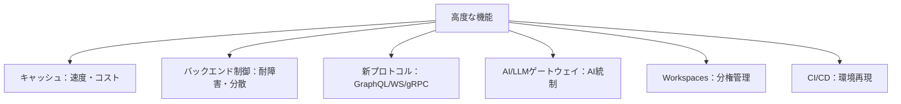
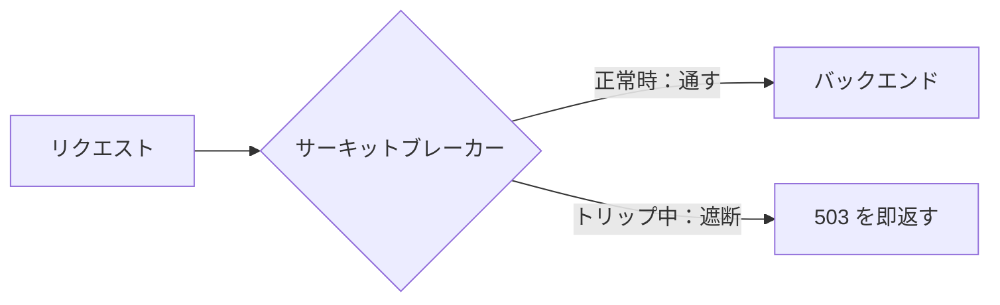

# Week 9 — 高度な機能（キャッシュ・バックエンド・新プロトコル・AIゲートウェイ・運用自動化）

> **Phase 2b** | 学習プラン Week 9 / 10  
> 学習目標：APIM の応用機能を俯瞰し、それぞれが「どんな課題を解くか」を説明できる。特に AI/LLM ゲートウェイと CI/CD（APIOps）の位置づけを理解する

---

## 0. 今週の位置づけ

ここまでで APIM の土台（オブジェクト・ポリシー・セキュリティ・ライフサイクル・ネットワーク・運用）が揃った。
今週は**応用機能を「広く浅く」俯瞰**する。各機能は「何を解くか」を掴めば十分（深掘りは必要時に）。



---

## 1. キャッシュ

同じ応答を使い回して**高速化・バックエンド負荷軽減・コスト削減**する。

| ポリシー | 用途 |
|---|---|
| `cache-lookup` / `cache-store` | **レスポンス全体**のキャッシュ（inbound で探す → outbound で保存） |
| `cache-lookup-value` / `cache-store-value` | **任意の値**のキャッシュ（外部呼び出し結果など） |

### 内蔵キャッシュ vs 外部キャッシュ
| | 内蔵キャッシュ | 外部キャッシュ（Azure Cache for Redis / Managed Redis） |
|---|---|---|
| 容量 | 小・ティア依存 | 大・自分で管理 |
| 共有 | インスタンス内 | 複数ゲートウェイ間で共有可 |
| 用途 | 軽いキャッシュ | 本格運用・セマンティックキャッシュ（§4） |

> **キャッシュキーの設計**が肝。クエリ・ヘッダ・サブスクリプション単位など「同じとみなす条件」を決める。ユーザー個別データを共有キャッシュしてしまう事故に注意。

---

## 2. バックエンドの高度な制御（プール・LB・サーキットブレーカー）

Week 2 の Backend エンティティを発展させ、**複数バックエンドへの分散**と**耐障害**を実現する。

### ロードバランス用プール（backend pool）
複数バックエンドを1つの塊として負荷分散する。**最大 30 バックエンド**。

| 方式 | 内容 |
|---|---|
| **Round-robin** | 均等に振り分け（既定） |
| **Weighted** | 重み付き（例 backend-1:3 / backend-2:1）。blue-green に便利 |
| **Priority-based** | 優先グループ順。**高優先が全滅（CB トリップ）したときだけ低優先を使う** |
| **Session-aware** | 同一セッションを同じバックエンドへ（Cookie でセッション維持）。AIチャット等に有用 |

### サーキットブレーカー（circuit breaker）
バックエンドが過負荷/障害のとき、**一時的にリクエスト送信を止めて回復を待つ**仕組み（[回路遮断器パターン](https://learn.microsoft.com/en-us/azure/architecture/patterns/circuit-breaker)）。



> **公式確認メモ**
> - トリップ条件：一定期間内の**失敗回数/割合**＋**失敗とみなすステータスコード範囲**（例：1時間に 5xx が3回）
> - トリップすると、一定時間バックエンドへ送らず **503 Service Unavailable** を返す → 期間後に自動復帰
> - **動的トリップ時間**：バックエンドの `Retry-After` ヘッダ値を採用できる（Azure OpenAI が `429 + Retry-After` を返すケースで有効）
> - **Consumption ティアは非対応**／現状**1バックエンドに1ルールのみ**
> - 分散アーキテクチャのため、LB・CB は**各ゲートウェイ単位で近似**（インスタンス間で同期しない）

参照はポリシーで `set-backend-service backend-id="myBackend"`（Week 2/4）。

---

## 3. 新しいプロトコル / API 種別

REST 以外も APIM で公開・統制できる（各プロトコルの中身は Week 6 §1 の補足参照）。

| 種別 | APIM での扱い |
|---|---|
| **GraphQL** | パススルー（既存 GraphQL を公開）/ シンセティック（スキーマ + リゾルバを APIM 側で構成） |
| **WebSocket** | 双方向リアルタイム通信の中継 |
| **gRPC** | バイナリ高速通信（プレビュー機能含む） |

---

## 4. AI / LLM ゲートウェイ（重要・AI Search とつながる）

Azure OpenAI / 各種 LLM を APIM の背後に置き、**ゲートウェイとして統制**する一連の機能（AI gateway）。

### なぜ要るか
生成 AI の主資源は**トークン**。モデルには TPM（Tokens Per Minute）の割り当てがある。アプリが増えると「1つのアプリが全 TPM を食って他が詰まる」問題が起きる。→ **APIM で消費を配分・可視化・防御**する。

### 主なポリシー（公式の名称）
| ポリシー | 解く課題 |
|---|---|
| `llm-token-limit`（`azure-openai-token-limit`） | **トークン量ベースのレート制限/クォータ**。counter-key 単位で TPM 制限 |
| `llm-emit-token-metric` | トークン消費を **Azure Monitor に可視化**（次元でアプリ別集計） |
| `llm-semantic-cache-store` / `llm-semantic-cache-lookup` | **セマンティックキャッシュ**。意味が近い過去プロンプトの回答を再利用 |
| `llm-content-safety` | Azure AI Content Safety でプロンプトを検査 |

トークン制限の例（公式）：
```xml
<llm-token-limit counter-key="@(context.Subscription.Id)"
    tokens-per-minute="500" estimate-prompt-tokens="false"
    remaining-tokens-variable-name="remainingTokens" />
```

### セマンティックキャッシュとは
通常のキャッシュは「**完全一致**」のプロンプトしか再利用できない。セマンティックキャッシュは **Embeddings でプロンプトをベクトル化し、意味が近い過去のプロンプト**の回答を再利用する（外部 Redis + RediSearch が必要）。
→ **トークン消費削減・レイテンシ削減**。

> **AI Search との接続点**：AI Search で学んだ RAG の「**生成**側（Azure OpenAI）」を、APIM が**トークン制限・キャッシュ・ロードバランス・監視**で統制する構図。検索（AI Search）＝Retrieval、生成（OpenAI）＝Generation、その生成を束ねる門番が APIM の AI ゲートウェイ。
> Embeddings・ベクトル近接・コサイン類似 という考え方は AI Search のベクトル検索と同根。

### 耐障害・分散（§2 の応用）
複数の OpenAI デプロイを**バックエンドプールでロードバランス**し、**サーキットブレーカー**で `429 + Retry-After` を捌く。PTU（予約スループット）を優先グループに、従量課金を低優先に、といった設計ができる。

---

## 5. Workspaces（分権管理）

大組織で API をチーム単位に**分けて管理**する仕組み（Week 3 で「5番目のスコープ」として触れた Workspace）。

- 各チームが自分の API・ポリシーを**独立した管理権限**で扱える
- 中央（プラットフォームチーム）は全体ガバナンスを保ちつつ、現場に権限委譲
- 大規模な API ガバナンスの分権化に有効

---

## 6. CI/CD（APIOps / IaC）

APIM の構成を**宣言的に管理し、環境間（dev→prod）で再現**する。

| 手段 | 内容 |
|---|---|
| **APIOps** | APIM 構成を**抽出 → Git 管理 → デプロイ**するフレームワーク（[Azure/apiops](https://github.com/Azure/apiops)） |
| **Bicep / ARM** | IaC でインスタンス・API・ポリシーを定義（Week 10 で実践） |

> **解く課題：環境間の構成ドリフト**。ポータルで手動変更を重ねると dev と prod がズレていく。APIOps/IaC なら「構成はコード（Git）が真実」となり、再現性・レビュー・ロールバックが効く。Week 10 の Bicep 実装の前提知識。

---

## 7. 全体整理

### 機能 → 解く課題

| 機能 | 解く課題 |
|---|---|
| キャッシュ（内蔵/Redis） | 速度・バックエンド負荷・コスト |
| バックエンドプール/LB | 複数バックエンドへの分散・blue-green |
| サーキットブレーカー | 過負荷バックエンドの保護・回復（503・Retry-After） |
| GraphQL/WebSocket/gRPC | REST 以外のプロトコル公開 |
| LLM token-limit | トークンの配分・1アプリの独占防止 |
| LLM semantic-cache | 意味が近いプロンプトの回答再利用（コスト/速度） |
| llm-emit-token-metric | アプリ別トークン消費の可視化 |
| Workspaces | チーム単位の分権 API 管理 |
| APIOps / IaC | 環境間の構成再現・ドリフト防止 |

---

## ハンズオン チェックリスト

- [ ] レスポンスキャッシュ（`cache-lookup`/`cache-store`）を GET Operation に設定し、2回目以降が高速化することを確認
- [ ] （任意・Azure OpenAI があれば）APIM 経由で OpenAI を呼び、`llm-token-limit` を設定してトークン超過時の挙動を観察。無ければ公式手順を読み構成図化
- [ ] Backend プールでのロードバランシング設定例（weighted）を読み、構成図に落とす
- [ ] サーキットブレーカーのルール（例：1時間に 5xx が3回でトリップ）を設計してノート化
- [ ] APIOps の README とアーキテクチャ図を読み、「APIM 構成を Git 管理する」流れをノート化

---

## 自己チェック

週末にドキュメントを閉じて答えてみる。

1. **内蔵キャッシュと外部 Redis キャッシュをどう使い分けるか？**
   - キーワード：容量・複数ゲートウェイ共有・セマンティックキャッシュ

2. **サーキットブレーカーは何を守るための機能か？トリップするとどうなる？**
   - キーワード：過負荷バックエンドの保護、503 を返す、期間後に復帰、Retry-After

3. **LLM ゲートウェイで「トークンレート制限」「セマンティックキャッシュ」がそれぞれ解く課題は？**
   - キーワード：TPM の配分/独占防止、意味が近いプロンプトの回答再利用でコスト/速度

4. **セマンティックキャッシュは通常キャッシュと何が違う？**
   - キーワード：完全一致でなく意味の近さ（Embeddings・ベクトル近接）、Redis 必要

5. **APIOps が解決する「環境間の構成ドリフト」とは？**
   - キーワード：手動変更で dev/prod がズレる、構成をコード（Git）で真実化

6. **AI Search の学習と AI ゲートウェイはどうつながる？**
   - キーワード：RAG の生成側（OpenAI）を APIM が統制、Retrieval/Generation

---

## 次週の予告（Week 10・実装）

いよいよ手を動かす総仕上げ：

- **Bicep** で APIM インスタンス + 子リソース（API/ポリシー/プロダクト/サブスク）を IaC 化
- **Python の Azure Function** をバックエンドに
- **ポリシー**（rate-limit / managed identity）を適用
- **E2E テスト**（キー付き 200 / キーなし 401 / 超過 429）
