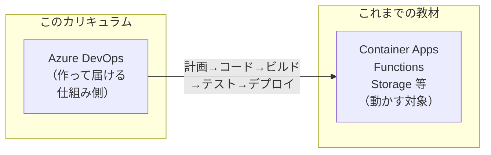
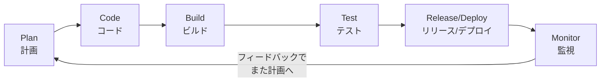
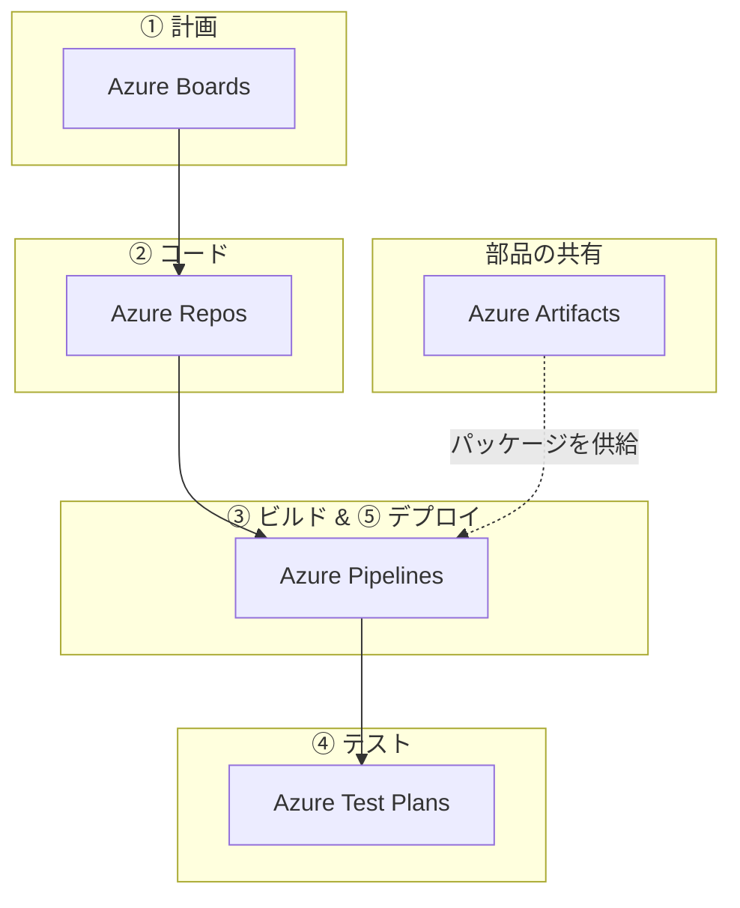
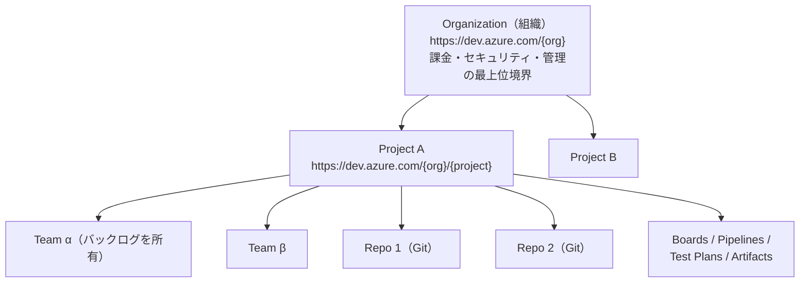

# Azure DevOps 学習 — Week 1：Azure DevOps とは何か

## この週の学習目標

- **DevOps**（デブオプス＝Development＋Operations／開発と運用）という思想が、なぜ・どんな課題を解くために生まれたのかを説明できる。
- **CI/CD**（Continuous Integration / Continuous Delivery＝継続的インテグレーション／継続的デリバリー）の必要性を、手作業リリースの痛みから逆算して理解する。
- Azure DevOps を構成する **5つのサービス**（Boards / Repos / Pipelines / Test Plans / Artifacts）が、それぞれ開発ライフサイクルのどの局面を担うかを俯瞰できる。
- **Organization → Project → Team → Repository** の入れ物の階層を理解し、「1 Organization / 1 Project から始める」という設計原則を説明できる。
- GitHub / GitLab など隣接プロダクトとの線引きを持ち、Azure DevOps を選ぶ／選ばない判断軸を持つ。
- 実際に無料の Organization を作り、既定 Project の中に5サービスが並ぶ画面を自分の目で確認する。

> このカリキュラムは Azure Container Apps 教材や Relay 教材と同じ方針で進める。**である調**・**1週ずつ**・**略語は初出で必ず展開**・**技術的事実は公式ドキュメントで裏取りし URL を残す**。用語でつまずいたら質問してほしい。説明した内容は「初心者向け用語補足」ボックスとしてその週に追記する。

---

## §0 位置づけ — このカリキュラムの中での W1

Azure DevOps は、これまで学んできた Storage・Container Apps・Functions などの**「動かす対象（アプリ・インフラ）」とは層が違う**。Azure DevOps は、それらのアプリを**「計画し・コードにし・ビルドし・テストし・デプロイする」までの仕事のやり方そのもの**を支える土台である。

つまり本教材は「Azure の個別サービスの深掘り」ではなく、**チーム開発とリリースの自動化**という横串のテーマを扱う。W1 はその全体地図（5サービスと入れ物の階層）を描く回である。

---

## 1. なぜ DevOps か — 「壁」を壊す思想

### 1-1. 開発チームと運用チームの間にあった「壁」

昔ながらの現場では、役割が分断されていた。

| 役割 | やりたいこと | 生まれる緊張 |
|---|---|---|
| **Dev**（Development＝開発）チーム | 新機能をどんどん出したい（変化を好む） | 「早く出させろ」 |
| **Ops**（Operations＝運用）チーム | 本番を落としたくない（安定を好む） | 「勝手に変えるな」 |

この2つが別部署・別評価で動くと、リリースのたびに「投げ渡し（throw over the wall）」が起きる。開発が完成品を運用に投げ、運用が「これでは動かない」と押し返す。この往復がリリースを遅く・危険にしていた。

**DevOps** はこの壁を壊し、**「作る人と届ける人が同じチームとして、計画からデプロイ・監視まで一気通貫で責任を持つ」**という文化・実践の総称である。ツールの名前ではなく、まず**思想**であることが重要である。

この輪（ループ）をできるだけ速く・小さく・安全に回すことが DevOps のゴールである。Azure DevOps は、この輪の各段をツールで支える。

> **初心者向け用語補足：なぜ「輪」なのか？**
> ソフトウェアは一度作って終わりではない。使われ始めてから「バグが見つかる」「もっとこうしたい」という要望が出て、また計画に戻る。滝が上から下に一度流れて終わる旧来のやり方（**ウォーターフォール**）に対し、DevOps は小さな輪を何度も回す。輪を速く回せるほど、ユーザーの声を早く製品に反映できる。

### 1-2. CI/CD — 輪を「自動で」速く回す仕組み

手作業でこの輪を回すと、こういう痛みが出る。

- 各自がバラバラに書いたコードを、月末にまとめて統合したら**大量の衝突（コンフリクト）**で火を噴く。
- リリース手順が「先輩の頭の中」にあり、手順書どおりやっても**環境ごとに動いたり動かなかったり**する。
- 本番反映が怖くて夜間・休日にしかできない。

これを機械にやらせるのが CI/CD である。

| 略語 | 展開 | 意味（何を自動化するか） |
|---|---|---|
| **CI** | **Continuous Integration**（継続的インテグレーション） | 誰かがコードを push するたびに、**自動でビルド＋テスト**して「壊れていないか」を即座に検証する。統合を「月末に一括」ではなく「毎回こまめに」行うことで衝突を小さく保つ。 |
| **CD** | **Continuous Delivery**（継続的デリバリー） | CI を通ったものを、**自動でステージング／本番へ届けられる状態にする**。手順を人の記憶ではなくコード（パイプライン定義）に固定するので、誰がやっても同じ結果になる。 |

> **初心者向け用語補足：CD のもう一つの意味**
> CD は文脈により **Continuous Deployment（継続的デプロイ）** を指すこともある。両者の違いは「本番反映に人の承認を挟むか」である。
> - **Continuous Delivery**：本番に出せる状態まで自動。最後の「本番へGO」は人がボタンを押す。
> - **Continuous Deployment**：テストが全部通れば、人の承認なしで本番まで自動で出る。
> 本教材では W5 で「承認（Approval）」を扱うので、まずは「Delivery＝出せる状態まで自動、最後は人が承認」という穏当な形を基準に理解しておけばよい。

---

## 2. Azure DevOps とは — 公式の定義と全体像

Microsoft の公式ドキュメントは Azure DevOps をこう定義する。

> "Azure DevOps is a cloud-based platform that provides integrated tools for software development teams."
> （出典：[What is Azure DevOps?](https://learn.microsoft.com/en-us/azure/devops/user-guide/what-is-azure-devops)）

日本語にすると「ソフトウェア開発チーム向けの、統合されたツール群を提供するクラウドベースのプラットフォーム」である。キーワードは **integrated（統合された）**。バラバラのツールを寄せ集めるのではなく、計画・コード・ビルド・テスト・デプロイが**1つのプラットフォーム上でつながっている**ことが売りである。

### 2-1. 2つの提供形態

| 形態 | 読み | 中身 | 誰向けか |
|---|---|---|---|
| **Azure DevOps Services** | サービシズ | Microsoft がクラウドで運用（`dev.azure.com`）。インフラ管理不要、自動更新、99.9% SLA。 | 大多数の人。本教材はこちらを扱う。 |
| **Azure DevOps Server** | サーバー | 自社のサーバー（オンプレミス）に自分で導入・保守する版。 | データを社内に置く規制要件などがある組織。 |

> **SLA**＝Service Level Agreement（サービス品質保証。Service=サービス／Level=水準／Agreement=合意）。「99.9% の時間は使える状態を保証する」という約束のこと。

本教材で「Azure DevOps」と書いたら、断りがない限りクラウド版（**Azure DevOps Services**）を指す。

---

## 3. 5つのサービス — 開発ライフサイクルとの対応

Azure DevOps の中核は次の5サービスである。公式の一行説明（原文）とともに、輪のどの段を担うかを押さえる。

| サービス | 読み | 担う局面 | 公式の一行説明（要約・原文の核） |
|---|---|---|---|
| **Azure Boards** | ボード | 計画・進捗管理 | "Plan and track work using Agile tools, Kanban boards, backlogs, and dashboards."（Agileツール・Kanban・バックログで作業を計画し追跡） |
| **Azure Repos** | レポズ | ソースコード管理 | "Host unlimited private Git repositories..."（無制限のプライベート Git リポジトリをホスト。TFVC も選べる） |
| **Azure Pipelines** | パイプラインズ | ビルド・テスト・デプロイ | "Build, test, and deploy applications with CI/CD pipelines that work with any language, platform, and cloud."（あらゆる言語・基盤・クラウド向けの CI/CD） |
| **Azure Test Plans** | テストプランズ | テスト管理 | "Plan, execute, and track testing with manual test cases, exploratory testing sessions, and automated test integration."（手動・探索的・自動テストの計画と追跡） |
| **Azure Artifacts** | アーティファクツ | パッケージ管理 | "Create, host, and share packages like NuGet, npm, Maven, Python, and Universal packages..."（NuGet/npm/Maven/Python 等のパッケージを共有） |

> **初心者向け用語補足：出てきた固有名詞のよみと意味**
> - **Agile（アジャイル）**：短い期間で作って評価し、こまめに軌道修正する開発の進め方（W2 で詳説）。
> - **Kanban（カンバン）**：作業カードを「未着手／作業中／完了」の列で見える化する手法。トヨタの「かんばん」が語源。
> - **Backlog（バックログ）**：やることリスト。優先順にため込んだ作業の一覧。
> - **Git（ギット）**：分散型のバージョン管理システム。コードの変更履歴を記録し、複数人の並行作業を支える（W3 で復習）。
> - **TFVC**＝Team Foundation Version Control（Team=チーム／Foundation=基盤／Version=版／Control=管理）。Git 以前からある集中型のバージョン管理。新規は基本 Git 推奨。
> - **NuGet（ニューゲット）／npm（エヌ・ピー・エム）／Maven（メイヴン）**：それぞれ .NET／Node.js／Java の「部品（ライブラリ）配布の仕組み」。
> - **アーティファクト**＝成果物。ここでは「ビルドで作られた配布可能な部品（パッケージ）」を指す。

### 3-1. 5サービスは「つながっている」ことが本質

各サービスは単独でも使えるが、真価は連携にある。公式が挙げる典型ワークフロー：

1. **Plan** — Azure Boards で作業項目（Work Item）を計画する。
2. **Code** — Azure Repos でプルリクエストを使って機能を実装する。
3. **Build** — Azure Pipelines と Azure Artifacts でビルド・パッケージ化する。
4. **Test** — Azure Test Plans で手動・自動テストする。
5. **Deploy** — Azure Pipelines で各環境へデプロイする。
6. **Monitor** — ダッシュボードで進捗・メトリクスを監視する。
7. **Iterate** — フィードバックを受けてまた計画へ戻る。

**トレーサビリティ（traceability＝追跡可能性）**が効くのが統合の醍醐味である。「この本番バグ → 直したコミット → そのプルリク → ビルド番号 → 元になった User Story」が1本の線でつながる。ツールが別々だとこの線が切れる。

---

## 4. 入れ物の階層 — Organization / Project / Team / Repository

Azure DevOps を使い始めるには、まず「入れ物」の階層を理解する必要がある。

| 層 | 何の境界か | URL / 特徴 |
|---|---|---|
| **Organization**（組織） | 課金・セキュリティ・管理の**最上位の境界**。1つの Microsoft Entra テナントに接続。 | `https://dev.azure.com/{organization}` |
| **Project**（プロジェクト） | 作業の**器**。この中に Boards / Repos / Pipelines / Test Plans / Artifacts が一式そろう。セキュリティ・プロセスの境界。 | `https://dev.azure.com/{org}/{project}` |
| **Team**（チーム） | Project 内の単位。**各チームが自分のバックログを持つ**。チームを作る＝バックログを作る、という関係。 | Project 設定で構成 |
| **Repository**（リポジトリ） | コードの入れ物。1 Project 内に **Git リポジトリを無制限**に作れる。 | Repos の中に複数 |

> **初心者向け用語補足：Microsoft Entra テナントとは**
> **Microsoft Entra ID**（旧称 Azure Active Directory／Azure AD）は Microsoft のクラウド認証基盤。**テナント（tenant）**はその中の「1つの組織の区画」を指す。「この Organization のユーザーは、この Entra テナントに属する人だけ」と結びつけることで、退職者を Entra から外せば Azure DevOps へのアクセスも自動で失われる、という一元管理ができる。1つの Entra テナントに複数の Organization をぶら下げることも可能。

### 4-1. 設計原則：「1つ」から始める

初学者が最初に迷うのが「Organization や Project をいくつ作るか」である。公式ガイダンスは明快である。

> "**Start with one organization** and expand only when you have specific business requirements that demand separation."
> （まず1つの Organization から始め、分離が必要な明確な理由があるときだけ増やす）
> — [Plan your organizational structure](https://learn.microsoft.com/en-us/azure/devops/user-guide/plan-your-azure-devops-org-structure)

Project も同様で、公式は次のように言う。

> "Even if you have many teams working on hundreds of different applications and software projects, you can manage them within a single project in Azure DevOps."
> （何百ものアプリを扱う多数のチームがいても、単一の Project で管理できる）

**設計の合言葉：「大きな Project を分割するほうが、別々の Organization を統合するより簡単」**（公式 Tip の "It's easier to split a large project than to merge separate organizations."）。だから迷ったら小さく（1 Org / 1 Project）始めて、必要が明確になってから分ける。

| こう分けたくなったら | まず疑う | 本当に分けるべき例 |
|---|---|---|
| Organization を増やしたい | ほぼ不要 | 規制で完全隔離が必要（HIPAA/PCI-DSS 等）、別の Entra テナント、別課金 |
| Project を増やしたい | まず1つで足りないか | 業務単位でプロセス（Work Item 種別・カスタムフィールド）を根本から変えたい、厳格なアクセス隔離 |

> **初心者向け用語補足：出てきた規制略語**
> - **HIPAA**（ヒパー）＝Health Insurance Portability and Accountability Act（米国の医療情報保護法）。
> - **PCI-DSS**＝Payment Card Industry Data Security Standard（クレジットカード業界のセキュリティ基準）。
> - **SOX**（ソックス）＝Sarbanes–Oxley Act（米国の企業会計・内部統制の法律）。
> これらは「データを厳格に隔離せよ」と求めるため、Organization レベルの硬い境界が正当化される数少ないケースである。

### 4-2. 無料枠（最初の5ユーザー）

Organization ごとに、5ユーザーまでは無料で以下が使える（公式）。

| サービス | 無料枠 |
|---|---|
| **Azure Pipelines** | Microsoft ホスト CI/CD：1並列ジョブ・**月1,800分（最大30時間）** ＋ セルフホスト1並列ジョブ |
| **Azure Boards** | Work Item 追跡・ボード |
| **Azure Repos** | **無制限**のプライベート Git リポジトリ |
| **Azure Artifacts** | Organization あたり **2 GiB** 無料 |
| **Stakeholder**（ステークホルダー） | **無制限**（ダッシュボード閲覧・基本参加は無料） |

> **初心者向け用語補足：ライセンスの3段階**
> - **Stakeholder（ステークホルダー＝利害関係者）**：無料。Boards の閲覧や作業項目の基本操作はできるが、コードやパイプラインの多くは触れない。非エンジニアの関係者向け。
> - **Basic（ベーシック）**：最初の5人まで無料。Repos・Pipelines 含む全機能。開発者向け。
> - **Basic + Test Plans**：Basic に Test Plans を追加した有料ライセンス。
> GiB は Gibibyte（ギビバイト＝2の30乗バイト、約1.07 GB）。

---

## 5. 隣接プロダクトとの線引き

Azure DevOps だけが唯一の選択肢ではない。代表的な比較対象を押さえる。

| プロダクト | 立ち位置 | Azure DevOps との関係 |
|---|---|---|
| **GitHub** | Microsoft 傘下。OSS の世界標準。GitHub Actions で CI/CD、Issues/Projects で計画。 | **今は GitHub 推しが主流**。Azure DevOps と GitHub は連携可能（Boards と GitHub を繋ぐ等）。W9 で GitHub Actions と Pipelines を1セクション比較する。 |
| **GitLab** | 開発〜運用を1製品に統合（Azure DevOps に思想が近い競合）。 | 直接の競合。self-hosted 志向が強い。 |
| **Jenkins（ジェンキンス）** | 老舗の CI サーバー（OSS）。プラグイン文化。 | Pipelines は「YAML で定義・マネージド」で、Jenkins の「サーバー自前運用」より運用が軽い。 |
| **Jira（ジラ）** | Atlassian の計画・課題管理ツール。 | Azure Boards の主な比較対象。Boards は Repos/Pipelines と統合済みなのが強み。 |

> **なぜ今 Azure DevOps を学ぶのか**：GitHub が主流化した今も、Azure DevOps は「Boards の計画機能の充実」「オンプレ版（Server）の存在」「エンタープライズでの既存採用」で根強い。そして CI/CD・Agile・トレーサビリティという**概念そのもの**は GitHub でも共通なので、Azure DevOps で身につけた土台は他ツールにそのまま効く。

> **OSS**＝Open Source Software（オープンソースソフトウェア。ソースコードが公開され、誰でも利用・改変できるソフト）。

---

## 6. ハンズオン — Organization を作り、5サービスを確認する

> 実際に無料の Organization を1つ作り、既定 Project の中に5サービスが並ぶ画面を目で確認する。**課金は発生しない**（Basic 5人まで無料枠）。既に会社等で Organization を持っている場合は、練習用に個人の Microsoft アカウントで新規作成することを勧める。

### 手順

1. ブラウザで **https://dev.azure.com** を開く。
2. Microsoft アカウント（無ければ無料作成）でサインインする。
   - **注意（安全上）**：パスワードやアカウント作成は必ず自分自身の手で行うこと。認証情報の入力は人間が行う領域である。
3. 案内に従い **Organization を新規作成**する（名前は世界で一意。例：`yourname-devops-lab`）。ホスト地域（リージョン）を選ぶ。
4. 続けて **既定の Project を作成**する。Project 名（例：`FirstProject`）を入れ、Visibility は **Private** を選ぶ。
5. 作成後、左ナビに次が並ぶことを確認する（今週のゴール）：
   - **Overview**（概要／Wiki／Dashboards）
   - **Boards**
   - **Repos**
   - **Pipelines**
   - **Test Plans**（ライセンスにより表示のみのことあり）
   - **Artifacts**
6. URL を確認する：`https://dev.azure.com/{あなたのOrg}/{あなたのProject}` の形になっている。これが §4 で学んだ階層の実物である。
7. 右上の歯車 **Project settings** を開き、**Repos → Repositories** に既定リポジトリが1つあること、**Boards** にバックログが用意されていることを軽く覗く（詳細は各週で扱う）。

### 確認ポイント

- 左ナビの5サービスが、W1 §3 の図と対応していることを指させる。
- URL の `dev.azure.com/{org}/{project}` が §4 の階層そのものだと分かる。
- まだ何も作り込んでいないのに「コードを置く場所・作業を計画する場所・ビルドする場所」が最初からそろっている——これが "integrated platform" の意味だと体感する。

> 次回以降のハンズオンはこの Organization / Project を使い回す。作った URL をメモしておくこと。

---

## 7. 自己チェック

1. DevOps が壊そうとした「壁」とは何と何の間の壁か。なぜその壁がリリースを遅く・危険にしたか。
2. CI と CD はそれぞれ何の略で、何を自動化するか。Continuous Delivery と Continuous Deployment の違いは何か。
3. Azure DevOps の5サービスを挙げ、それぞれが開発ライフサイクル（Plan→Code→Build→Test→Deploy→Monitor）のどの局面を担うか対応づけよ。
4. Organization / Project / Team / Repository の階層を、それぞれ「何の境界か」とともに説明せよ。
5. 「Organization や Project はまず1つから始めよ」と公式が言うのはなぜか。分割と統合ではどちらが簡単か。
6. Stakeholder / Basic の2ライセンスの違いは何か。無料枠で Pipelines は月何分使えるか。
7. Azure DevOps と GitHub の関係を一言で。今 Azure DevOps を学ぶ意義は何か。

---

## 8. 次週予告 — W2：Azure Boards

W2 では **Azure Boards** に踏み込む。Agile / Scrum / Kanban という進め方の違い、**Work Item の階層**（Epic → Feature → User Story → Task / Bug）、Sprint（スプリント）と Backlog、そしてボード上で作業を動かす流れを、W1 で作った Project の上で実際に触りながら学ぶ。「計画をコードやビルドとどう繋げるか（トレーサビリティ）」の入り口でもある。

---

## 出典（公式ドキュメント）

- What is Azure DevOps? — https://learn.microsoft.com/en-us/azure/devops/user-guide/what-is-azure-devops
- Plan your organizational structure — https://learn.microsoft.com/en-us/azure/devops/user-guide/plan-your-azure-devops-org-structure
- Sign up for Azure DevOps — https://learn.microsoft.com/en-us/azure/devops/user-guide/sign-up-invite-teammates
