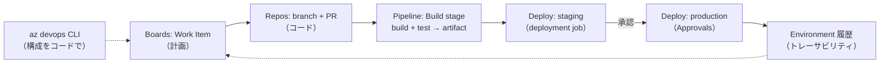
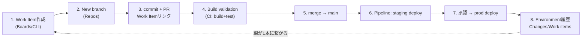

# Azure DevOps 学習 — Week 10：最終プロジェクト（CI/CD E2E）

## この週の学習目標

- W1〜W9 の全概念を、1つの動くプロジェクトに束ねる。
- **マルチステージ `azure-pipelines.yml`**（build → test → deploy）を、サンプルアプリに対して実装する。
- **サンプルアプリ**（Python FastAPI）を用意し、単体テスト・ビルド・デプロイの対象にする。
- **`az devops` CLI** で、プロジェクト・パイプライン・変数を**コマンド（コード）から構成**できる。
- Boards の Work Item から本番デプロイまでの**トレーサビリティを E2E** で通す。
- 学んだ全概念（トリガー・stage/job/step・deployment job・environment・承認・変数・テスト発行・鍵レス認証）を実地で確認する。

> W1〜W9 の総まとめ。ここでは「教材の成果物」として、実際に動く `code/`（アプリ＋テスト）と `azure-pipelines.yml` をリポジトリに置く。検証は `py_compile`（構文緑）で行い、実際の実行は各自の Azure DevOps Organization で行う。

---

## §0 このプロジェクトの全体像



W1〜W9 の各サービスが、この1本の流れに全部登場する。

---

## 1. サンプルアプリ（code/）

シンプルな **Python FastAPI** アプリと単体テストを用意する（本教材の `code/` に実物あり）。

### 1-1. 構成

```
code/
├── app.py              # FastAPI アプリ（/ , /health , /version）
├── test_app.py         # pytest 単体テスト
├── requirements.txt    # 依存（fastapi, uvicorn, pytest, httpx）
└── README.md           # ローカル実行手順
```

### 1-2. app.py の要点

- `/`：あいさつを返す。
- `/health`：ヘルスチェック（W5 の environment health、readiness probe 相当の思想）。
- `/version`：環境変数 `APP_VERSION` を返す（デプロイ環境ごとに変わる値の例＝W5 の変数）。

### 1-3. test_app.py の要点

- FastAPI の `TestClient` で各エンドポイントを叩き、ステータス200と内容を検証。
- パイプラインの test stage で `pytest --junitxml` を走らせ、結果を Publish Test Results で発行（W8）。

---

## 2. マルチステージ azure-pipelines.yml

W4〜W6 の集大成。build → test → deploy(staging) → deploy(production, 承認付き) を1本で。

### 2-1. 骨格

```yaml
trigger:
  - main                        # W4: CI トリガー

variables:
  - group: demo-vars            # W5: Variable Group（APP_VERSION 等）
  - name: pythonVersion
    value: '3.12'

stages:
  # ---- W4: CI（build + test）----
  - stage: BuildTest
    displayName: Build and Test
    jobs:
      - job: BuildTest
        pool: { vmImage: ubuntu-latest }     # W4: MS-hosted agent
        steps:
          - task: UsePythonVersion@0
            inputs: { versionSpec: '$(pythonVersion)' }
          - script: |
              cd code
              python -m pip install --upgrade pip
              pip install -r requirements.txt
            displayName: 依存インストール
          - script: |
              cd code
              pytest --junitxml=test-results.xml
            displayName: 単体テスト（W8）
          - task: PublishTestResults@2         # W8: 結果発行
            condition: succeededOrFailed()
            inputs:
              testResultsFormat: JUnit
              testResultsFiles: 'code/test-results.xml'
          - task: ArchiveFiles@2               # 成果物を固める
            inputs:
              rootFolderOrFile: 'code'
              archiveFile: '$(Build.ArtifactStagingDirectory)/app.zip'
          - task: PublishBuildArtifacts@1      # W4: artifact 発行
            inputs:
              pathToPublish: '$(Build.ArtifactStagingDirectory)'
              artifactName: drop

  # ---- W5: CD（staging）----
  - stage: DeployStaging
    displayName: Deploy to Staging
    dependsOn: BuildTest
    condition: succeeded()
    jobs:
      - deployment: DeployStaging              # W5: deployment job
        pool: { vmImage: ubuntu-latest }
        environment: staging                   # W5: environment
        strategy:
          runOnce:                             # W5: runOnce 戦略
            deploy:
              steps:
                - download: current
                  artifact: drop
                - script: echo "Deploy app.zip to STAGING (APP_VERSION=$(APP_VERSION))"

  # ---- W5: CD（production, 承認付き）----
  - stage: DeployProd
    displayName: Deploy to Production
    dependsOn: DeployStaging
    condition: and(succeeded(), eq(variables['Build.SourceBranch'], 'refs/heads/main'))  # W6: 条件
    jobs:
      - deployment: DeployProd
        pool: { vmImage: ubuntu-latest }
        environment: production                # W5: 承認チェックを設定した環境
        strategy:
          runOnce:
            deploy:
              steps:
                - download: current
                  artifact: drop
                - script: echo "Deploy app.zip to PRODUCTION (APP_VERSION=$(APP_VERSION))"
```

### 2-2. どの週がどこに効いているか

| 箇所 | 対応する週 |
|---|---|
| `trigger: main` | W4（CI トリガー） |
| `variables: - group:` | W5（Variable Group） |
| stage/job/step 構造・`vmImage` | W4（構造・agent） |
| `pytest` + `PublishTestResults` | W8（自動テスト統合） |
| `PublishBuildArtifacts` / `download` | W4-W5（artifact の受け渡し） |
| `deployment` + `environment` + `runOnce` | W5（deployment job・環境・戦略） |
| production の承認 | W5（Approvals and checks、environment 側に設定） |
| `condition: and(succeeded(), eq(...))` | W6（条件） |

> 実 Azure へのデプロイにする場合は、staging/prod の `script` を `AzureWebApp@1` 等の task に置き換え、**Service Connection（W6・workload identity federation）**で認証する。本教材は「概念の一巡」を主目的とし、デプロイ step は echo で表現する（環境非依存で検証可能）。

---

## 3. az devops CLI — 構成をコードで

GUI でポチポチではなく、**`az devops` CLI**（Azure CLI の拡張）でプロジェクト・パイプライン・変数を構成する。W9 の「鍵レス認証」に沿い、可能なら Entra ログイン（`az login`）を使う。

### 3-1. セットアップ

```bash
# Azure CLI に devops 拡張を追加
az extension add --name azure-devops

# ログイン（W9: 鍵レスの Entra 認証を優先。PAT でも可）
az login

# 既定の組織・プロジェクトを設定（毎回 --org/--project を書かずに済む）
az devops configure --defaults \
  organization=https://dev.azure.com/<your-org> \
  project=<your-project>
```

### 3-2. 代表コマンド

```bash
# プロジェクト一覧（W1: Organization/Project）
az devops project list --output table

# Work Item を作成（W2: Boards）
az boards work-item create \
  --title "CI/CD capstone" --type "User Story" --output table

# リポジトリ一覧（W3: Repos）
az repos list --output table

# パイプラインを YAML から作成（W4: azure-pipelines.yml を登録）
az pipelines create \
  --name "capstone-ci" \
  --repository <repo> --branch main \
  --yml-path azure-pipelines.yml

# Variable Group を作成（W5: 変数）
az pipelines variable-group create \
  --name demo-vars \
  --variables APP_VERSION=1.0.0 --authorize true

# パイプラインを実行（run）
az pipelines run --name "capstone-ci"

# ブランチポリシー一覧（W3: Branch policy）
az repos policy list --output table
```

> **なぜ CLI か（Infrastructure/Config as Code の思想）**：GUI 操作は再現できず履歴に残らない。CLI（やスクリプト）にすれば、環境構築を**コードとして再現・レビュー・自動化**できる。W4 で学んだ「Pipeline as Code」を、パイプラインの中身だけでなく**プロジェクト構成そのもの**にも広げる発想。

---

## 4. E2E トレーサビリティの確認

W1 から追ってきた「1本の線」を最後に通す。



各ステップで、前の週の成果物がどう効いているかを確認する。最終的に **Environment の Deployments → Work items タブ**で、最初に作った Work Item が本番デプロイまで到達したことを確認できれば、E2E 完成。

---

## 5. ハンズオン（総合）

> 本教材の `code/` と `azure-pipelines.yml`（`infra/` にサンプル配置）を使う。実行は各自の Organization で。

### 手順

1. `code/` のアプリをローカルで動かす：`cd code && pip install -r requirements.txt && uvicorn app:app --reload`。`/`, `/health`, `/version` を確認。
2. `pytest` がローカルで緑になることを確認。
3. `az devops` CLI をセットアップ（§3-1）。`az devops project list` で疎通確認。
4. リポジトリに `code/` と `azure-pipelines.yml` を push。
5. **environment**（staging / production）を作り、**production に Approvals** を設定（W5）。
6. **Variable Group `demo-vars`**（`APP_VERSION=1.0.0`）を作り、パイプラインに認可（W5）。CLI でも可（§3-2）。
7. `az pipelines create` でパイプラインを YAML から作成し、`az pipelines run` で実行。
8. run が BuildTest → DeployStaging と進み、**DeployProd の前で承認待ち**になることを確認。承認して完了。
9. **Tests タブ**にテスト結果、**Environments → production → Deployments** にデプロイ履歴が出ることを確認。
10. 最初に作った Work Item から、branch→PR→build→deploy が Development / Deployment コントロールで1本に繋がることを確認（E2E トレーサビリティ）。

### 確認ポイント（総括）

- 1本の `azure-pipelines.yml` に、W4〜W8 の概念が全部載っている。
- `az devops` CLI で構成をコード化でき、GUI 依存から脱却できる。
- Work Item → 本番デプロイまでのトレーサビリティが実際に繋がる。
- 鍵レス認証（Entra / Service Connection）を優先する運用（W9）が身についている。

---

## 6. カリキュラム全体の振り返り

| 週 | サービス/テーマ | 中核概念 |
|---|---|---|
| W1 | 全体像 | DevOps思想・CI/CD・5サービス・Org/Project/Team/Repo |
| W2 | Boards | Agile・Work Item階層・Sprint・Area/Iteration |
| W3 | Repos | Git・ブランチ戦略・PR・ブランチポリシー |
| W4 | Pipelines(CI) | trigger/stage/job/step・agent/pool・YAML |
| W5 | Pipelines(CD) | multi-stage・deployment job・environment・承認・変数 |
| W6 | Pipelines応用 | テンプレート・条件/Matrix・Service Connection |
| W7 | Artifacts | Feed・upstream・view・SemVer・保持 |
| W8 | Test Plans | Plan/Suite/Case・手動/探索/自動テスト・品質ゲート |
| W9 | セキュリティ/運用 | 権限・アクセスレベル・PAT・監査・GHA比較 |
| W10 | 最終PJ | 全部を1本の CI/CD E2E に束ねる |

一貫するテーマ：**①統合による端から端のトレーサビリティ**（要求→コード→ビルド→デプロイ→テスト）、**②Everything as Code**（Pipeline/Config as Code）、**③鍵レス認証への潮流**（PAT削減・federation/Entra）。

---

## 7. 自己チェック（総合）

1. `azure-pipelines.yml` の各 stage（BuildTest/DeployStaging/DeployProd）が、W4〜W6 のどの概念に対応するか説明せよ。
2. production への承認は YAML のどこに書くか（引っかけ）。正しくはどこに設定するか。
3. `az devops` CLI で構成をコード化する利点は。GUI 操作の問題点は。
4. Work Item から本番デプロイまでのトレーサビリティは、最終的にどの画面で確認できるか。
5. このカリキュラムを貫く3つのテーマを挙げよ。
6. 実 Azure にデプロイする場合、echo の step を何に置き換え、認証はどうするか。

---

## 出典（公式ドキュメント）

- Customize a pipeline (multi-stage) — https://learn.microsoft.com/en-us/azure/devops/pipelines/customize-pipeline
- Azure DevOps CLI — https://learn.microsoft.com/en-us/azure/devops/cli/
- az pipelines — https://learn.microsoft.com/en-us/cli/azure/pipelines
- Build, test, and deploy Python apps — https://learn.microsoft.com/en-us/azure/devops/pipelines/ecosystems/python
- Publish Test Results task — https://learn.microsoft.com/en-us/azure/devops/pipelines/tasks/reference/publish-test-results-v2
