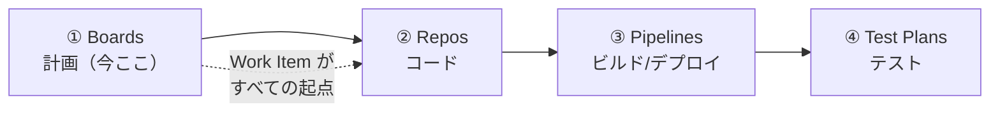
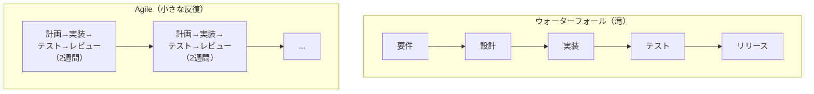
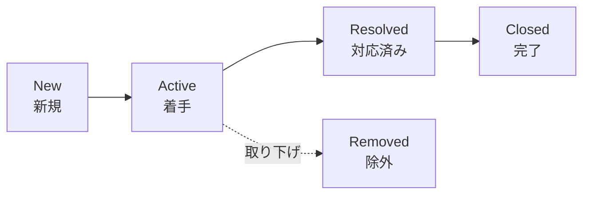
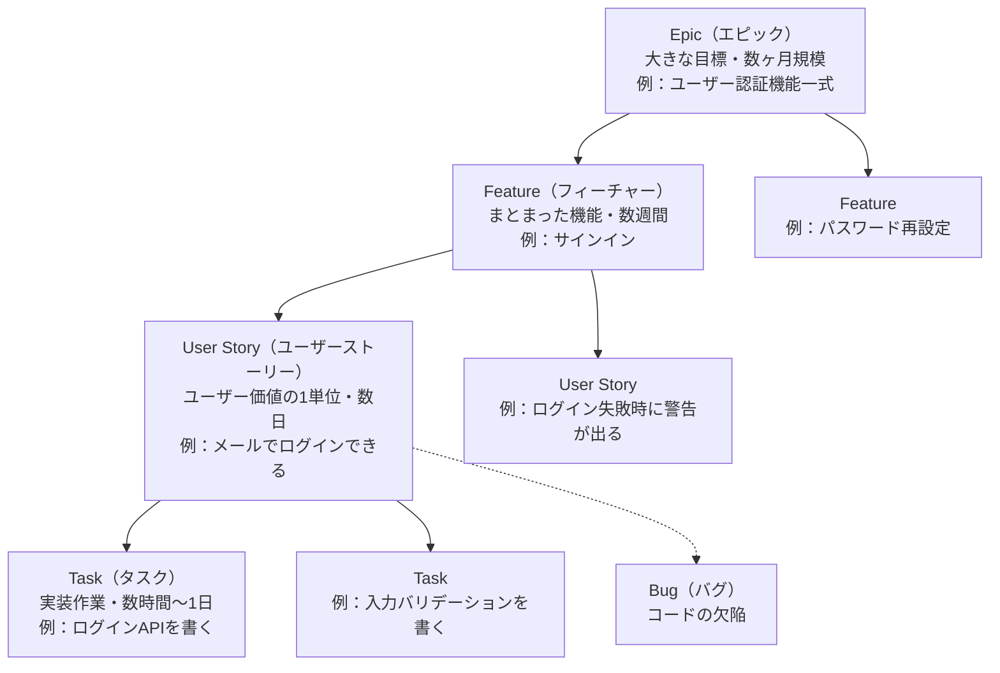
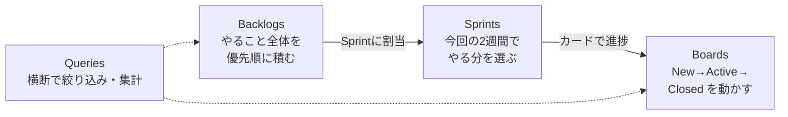
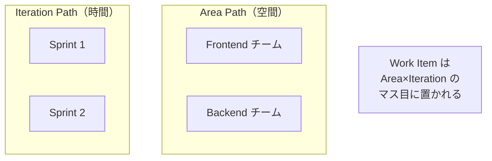

# Azure DevOps 学習 — Week 2：Azure Boards（計画と進捗管理）

## この週の学習目標

- **Agile**（アジャイル）という開発の進め方を、ウォーターフォールとの対比で説明できる。
- **Scrum**（スクラム）と **Kanban**（カンバン）の違い、および Azure Boards が両方を支えることを理解する。
- **Work Item**（ワークアイテム＝作業項目）とは何かを説明し、**プロセステンプレート**（Basic / Agile / Scrum / CMMI）で用意される種別が違うことを理解する。
- **ポートフォリオ階層**（Epic → Feature → User Story/PBI → Task、＋ Bug）を、親子リンクで組み立てられる。
- **Backlog**（バックログ）・**Sprint**（スプリント／Iteration）・**Board**（ボード）・**Query**（クエリ）の4つのハブの役割を使い分けられる。
- **Area Path**（エリアパス）と **Iteration Path**（イテレーションパス）が「どのチームの・いつの」作業かを決める2軸だと理解する。
- W1 で作った Project の上で、Epic → Feature → User Story → Task を実際に作り、ボードで状態を動かす。

> W1 の復習：Azure DevOps は5サービスの統合プラットフォーム。本週はその①「計画」を担う **Azure Boards**。公式定義は "Azure Boards is a web-based service that teams use to plan, track, and discuss work throughout the development lifecycle."（開発ライフサイクル全体で作業を計画・追跡・議論するための Web サービス）。

---

## §0 位置づけ — 5サービスの中の Boards

Boards で作った **Work Item** は、この先のすべての起点になる。W3 のコミット／プルリク、W4-6 のビルド、W8 のテストが、すべて Work Item に紐づく。だから「トレーサビリティ（追跡可能性）の出発点」として Boards を最初に学ぶ。

---

## 1. Agile とは — なぜ「小さく回す」のか

### 1-1. ウォーターフォール vs Agile

W1 で「輪を速く回す」のが DevOps だと学んだ。その回し方の思想が **Agile** である。

| 観点 | ウォーターフォール | Agile |
|---|---|---|
| 進め方 | 全工程を一度だけ順に流す | 短い期間（例：2週間）で全工程を何度も回す |
| 仕様変更 | 後半での変更が高くつく | 各反復の区切りで軌道修正できる |
| 動くもの | 最後まで出てこない | 反復ごとに動くものが増える |
| 向くもの | 要件が固く変わらない案件 | 要件が動く・不確実な案件（多くのソフト開発） |

Agile は「最初に全部を正しく決めるのは無理」という前提に立ち、**小さく作って・見せて・直す**を繰り返す。Azure Boards はこの進め方を道具で支える。

> **初心者向け用語補足：Agile は「宣言」から始まった**
> Agile は2001年の「アジャイルソフトウェア開発宣言（Agile Manifesto）」に由来する価値観の総称であり、特定の手順ではない。その具体的な実践方法として **Scrum** や **Kanban** などがある。「Agile という大きな傘の下に Scrum / Kanban がある」と捉えるとよい。

### 1-2. Scrum と Kanban

| 手法 | 読み | 中心概念 | 一言で |
|---|---|---|---|
| **Scrum** | スクラム | Sprint（固定期間の反復）・役割・儀式 | 「2週間の箱に作業を詰めて回す」時間区切り型 |
| **Kanban** | カンバン | ボードの列・WIP 制限・流れ | 「作業カードを列で流し続ける」連続フロー型 |

- **Scrum** は、Sprint（スプリント＝ふつう1〜4週間）という固定の時間箱を区切り、その中で計画・実装・レビューを回す。ラグビーの「スクラム（肩を組んで押し合う密集）」が語源で、チームが一丸で進む様を表す。
- **Kanban** は、時間で区切らず「未着手→作業中→完了」の列にカードを流し続ける。「作業中（WIP）」の枚数に上限を設けて詰まりを可視化する。

> **WIP**＝Work In Progress（Work=作業／In Progress=進行中）。「今まさに手をつけている作業」の数。WIP を制限すると「あれもこれも中途半端」を防げる。

Azure Boards は **Scrum でも Kanban でも Scrumban（両者の折衷）でも使える**（公式："Whether you practice Scrum, Kanban, or Scrumban, Azure Boards provides the backlogs and boards to support your methodology."）。

---

## 2. Work Item — 計画の最小単位

### 2-1. Work Item とは

公式の定義：

> "A **work item** is a record in Azure Boards that represents a unit of work - a feature to build, a bug to fix, a task to complete, or an issue or risk to track."
> （Work Item とは Azure Boards 上の1レコードで、作る機能・直すバグ・こなすタスク・追うリスクといった「作業の1単位」を表す）

つまり **Work Item ＝「やることカード」**。ID が自動採番され、Organization/Project 内で一意になる。すべての計画・進捗・議論・履歴がこのレコードに集約される。

Work Item の主な共通フィールド（公式）：

| フィールド | 意味 | 必須か |
|---|---|---|
| **Title** | 作業の説明（255文字以内） | **唯一の必須項目** |
| **Assigned To** | 担当者（一度に1人だけ） | 任意 |
| **State** | 状態（New/Active/…）。作成時は最初の状態になる | 自動で初期化 |
| **Reason** | State を変えた理由（自動で既定値が入る） | 自動 |
| **Area** | Area Path＝どのチーム/機能の作業か | 任意 |
| **Iteration** | Iteration Path＝いつ（どの Sprint）の作業か | 任意 |

> 公式注記："The only required field for all work item types is **Title**."（全種別で必須なのは Title だけ）。まず Title だけで作り、詳細は後から埋められる——これが「小さく始める」を支える。

### 2-2. State の遷移（New → Active → Resolved → Closed）

Work Item は一度に1つの State しか持てない。Agile プロセスの User Story は次のように進む。

公式："The User Story (Agile) uses states such as *New*, *Active*, *Resolved*, *Closed*, and *Removed*." そして "When all work is complete, set the work item **State** to Closed."（作業が全部終わったら Closed にする）。**Removed** はバックログから外す（消さずに隠す）状態である。

ボード上でカードをドラッグして列を移せば、この State が更新される。State は「どの列に出るか」も左右する。

---

## 3. プロセステンプレート — 種別のセットが4つある

Project を作るとき **プロセス（Process）** を選ぶ。これが「使える Work Item の種別と、その State の流れ」を決める。公式："The available work item types depend on the process used when your project was created: **Agile**, **Basic**, **Scrum**, or **CMMI**."

| プロセス | 読み | バックログ項目の呼び名 | 特徴・向き |
|---|---|---|---|
| **Basic** | ベーシック | **Issue** | 最もシンプル（Epic/Issue/Task の3種）。初学者・小チーム向け。新規 Project の既定候補 |
| **Agile** | アジャイル | **User Story** | 定番。Epic/Feature/User Story/Task/Bug。Agile 実践の標準 |
| **Scrum** | スクラム | **Product Backlog Item（PBI）** | Scrum 用語に合わせた種別。Impediment（障害）を持つ |
| **CMMI** | シーエムエムアイ | **Requirement** | 形式的な管理（変更管理・レビュー重視）。大企業・規制向け |

> **CMMI**＝Capability Maturity Model Integration（Capability=能力／Maturity=成熟度／Model=モデル／Integration=統合）。組織のプロセス成熟度を測る枠組みに由来し、最も形式ばった種別セット。

> **初心者向け用語補足：どれを選ぶ？**
> 迷ったら **Agile**（最も情報が多く標準的）か、まず触るだけなら **Basic**（3種でシンプル）。プロセスは Project 作成時に決めるが、後から作り直しは面倒なので最初に決める。本教材のハンズオンは **Agile** で説明する（User Story を使う）。呼び名が違うだけで「大きな塊→中くらい→やること→細タスク」という**階層の考え方は全プロセス共通**である。

---

## 4. ポートフォリオ階層 — Epic → Feature → User Story → Task

Work Item は親子リンクで階層をなす。公式："Epics group Features, Features group Requirements (User Stories, Product Backlog Items, Issues, or Requirements), and Requirements group Tasks."

| 種別 | 粒度の目安 | 誰が主に見るか |
|---|---|---|
| **Epic** | 数ヶ月・事業目標レベル | 経営・PdM（プロダクト全体） |
| **Feature** | 数週間・機能のまとまり | PdM・リード |
| **User Story** | 数日・ユーザー価値の1単位 | 開発チーム（バックログの主役） |
| **Task** | 数時間〜1日・実装の細分 | 実装担当（Sprint 内で消化） |
| **Bug** | コードの欠陥 | チーム設定で「Story と同列」か「Task と同列」か選べる |

> **PdM**＝Product Manager（プロダクトマネージャー）。何を作るかを決める役割。

**Bug の扱いは選べる**（公式："Teams choose how to track bugs."）：①バックログに User Story と並べる（要求として管理）、②User Story にぶら下げる（タスクとして管理）、③バックログに出さない。チーム設定の「Working with bugs」で切り替える。

> **User Story の書き方の定番**："As a〈誰〉, I want〈何〉, so that〈なぜ〉"（〜として、〜したい、なぜなら〜）。機能ではなく「ユーザーにとっての価値」を書くのがコツ。カテゴリ表では User Story/PBI/Issue/Requirement はすべて "Requirement" カテゴリに属し、プロダクトバックログとボードを制御する。

---

## 5. 4つのハブ — 計画の道具箱

Azure Boards の左メニューには複数のハブ（機能の入口）がある。中心の4つを押さえる。

| ハブ | 役割 | いつ使うか |
|---|---|---|
| **Boards** | Work Item をカードで表示し、列間ドラッグで State 更新（Kanban） | 日々の「今どこ？」を見える化 |
| **Backlogs** | Work Item を計画・並べ替え・階層化。Product backlog と Portfolio backlog（Feature/Epic 単位） | 優先順位づけ・段取り |
| **Sprints** | 特定 Sprint（Iteration Path）の Work Item を管理。Taskboard で Sprint 計画 | Sprint 計画・日次進捗 |
| **Queries** | 条件でフィルタした Work Item 一覧を作る。一括更新・トレンドチャートの元 | 絞り込み・棚卸し・レポート |

- **Backlog** は「やること全体の優先リスト」。ここから今回やる分を **Sprint** に割り当てる（バックログからドラッグ）。
- **Sprint** の中身は **Board / Taskboard** で日々動かす。
- **Query** は種別や State や担当で横断的に絞り込み、ダッシュボードのグラフ元にもなる。

> **初心者向け用語補足：Query（クエリ）とは**
> 「State = Active かつ Assigned To = 自分」のような条件式で Work Item を検索・保存する仕組み。SQL の WHERE 句のイメージ。保存したクエリは一覧・一括更新・バーンダウン等のチャート元に使える。

---

## 6. Area Path と Iteration Path — 「どのチームの・いつの」2軸

Work Item を仕分ける2つの重要な軸がある。

| パス | 何を決めるか | 例 |
|---|---|---|
| **Area Path** | **どの製品・機能・チーム**の作業か（空間の軸） | `MyApp\Frontend`, `MyApp\Backend` |
| **Iteration Path** | **いつ（どの Sprint/リリース）**の作業か（時間の軸） | `MyApp\Sprint 1`, `MyApp\2026-Q3` |

公式："Area paths group work items by product, feature, or team." / "Iteration paths group work items by time-boxed delivery, such as a sprint or release."

- **チーム（Team）は Area Path で定義される**。W1 で学んだ Team は、担当する Area Path をスコープに持つ（公式："Define teams by name, members, and area paths."）。だから Frontend チームのボードには Frontend の Area Path の作業だけが出る。
- Sprint は Iteration Path の実体。Sprint 計画とは「この Iteration Path に Work Item を割り当てる」こと。

---

## 7. トレーサビリティ — Boards が起点になる

W1 で強調した「1本の線でつながる」を、Boards 側から見る。公式が挙げる Boards のトレーサビリティ：

- Work Item（要求）から**ブランチを作成**できる（Work Item の Actions →「New branch...」）。
- Work Item に紐づく**プルリクを開いて検証**できる。
- **ビルド・リリースを Work Item に紐づけ**、デプロイ状況を追える。
- 要求から本番まで変更をたどれる。

Work Item フォームの **Development コントロール**が、その Work Item に関係するブランチ・コミット・プルリク・ビルドを表示する。**Deployment コントロール**がデプロイ段階を表示する。つまり「この User Story のコードはどれで、どこまでデプロイされたか」が1画面で分かる。これが W3 以降で効いてくる。

> Discussion 欄では `@` でメンバーをメンション、`#` で別 Work Item にリンク、`!` でプルリクにリンクできる。議論も履歴として残る。

---

## 8. ハンズオン — Epic から Task までを作り、ボードで動かす

> W1 で作った Project（Agile プロセス想定）を使う。もし Basic で作っていた場合は読み替えるか、練習用に Agile の Project を新規作成してよい。

### 手順

1. **Boards → Backlogs** を開く。上部のバックログレベル切替で **Epics** を選ぶ。
2. **Epic を1つ作る**：New Work Item に例「ユーザー認証機能」と入力して追加。ID が採番されることを確認。
3. Epic を開き、**Add link →** もしくはバックログの「＋」で **Feature「サインイン」を子として追加**する（親子リンク）。
4. Feature「サインイン」の下に **User Story「メールでログインできる」を追加**する。
5. その User Story を開き、**Tasks を2つ追加**：「ログインAPIを書く」「入力バリデーションを書く」。粒度が下がっていくことを体感する。
6. **Backlogs** をバックログレベル **Stories** に切り替え、User Story を**上下ドラッグで優先順位づけ**する。
7. **Sprints → 現在のスプリント**を開き、バックログから User Story を**ドラッグして Sprint に割り当てる**（Iteration Path が付く）。
8. **Boards** を開き、User Story のカードを **New → Active** にドラッグ。State が変わり、履歴に記録されることを確認。
9. User Story の **Area** を自チームに、**Iteration** を現在の Sprint に設定して保存。§6 の2軸を実物で確認。
10. （任意）User Story の **Actions メニュー → New branch...** が存在することだけ確認（実際のブランチ作成は W3 で行う）。トレーサビリティの入口を見ておく。

### 確認ポイント

- Epic → Feature → User Story → Task が親子でつながり、粒度が段階的に細かくなっている。
- カードのドラッグで State が変わり、History に残る。
- Backlog（優先順）→ Sprint（今回分）→ Board（日々の状態）という道具の流れを体で理解した。
- Area（どのチーム）と Iteration（いつ）の2軸で Work Item が仕分けられる。

---

## 9. 自己チェック

1. ウォーターフォールと Agile の最大の違いを、「変更への強さ」の観点で説明せよ。
2. Scrum と Kanban の中心概念の違いは何か。Azure Boards は両方を支えるか。
3. Work Item とは何か。全種別で唯一の必須フィールドは何か。
4. プロセス（Basic/Agile/Scrum/CMMI）ごとに「バックログ項目」の呼び名を挙げよ。階層の考え方は共通か。
5. Epic → Feature → User Story → Task の各粒度の目安を述べよ。Bug の扱いにはどんな選択肢があるか。
6. Backlogs / Sprints / Boards / Queries の4ハブの役割を1行ずつで。
7. Area Path と Iteration Path はそれぞれ何を決めるか。Team はどちらで定義されるか。
8. User Story から本番デプロイまでを1本でたどれる仕組み（トレーサビリティ）は、Work Item のどのコントロールで見えるか。

---

## 10. 次週予告 — W3：Azure Repos

W3 では **Azure Repos** に進む。Git の基礎を素早く復習し、**ブランチ戦略**、**Pull Request（プルリク）によるコードレビュー**、そして main ブランチを守る **Branch Policy（ブランチポリシー）**を学ぶ。W2 で作った Work Item と、W3 のブランチ／プルリクを**紐づける**ことで、計画とコードが1本の線でつながる様子を実際に作る。

---

## 出典（公式ドキュメント）

- What is Azure Boards? — https://learn.microsoft.com/en-us/azure/devops/boards/get-started/what-is-azure-boards
- About work items and work item types — https://learn.microsoft.com/en-us/azure/devops/boards/work-items/about-work-items
- Choose a process — https://learn.microsoft.com/en-us/azure/devops/boards/work-items/guidance/choose-process
- About area and iteration paths — https://learn.microsoft.com/en-us/azure/devops/organizations/settings/about-areas-iterations
