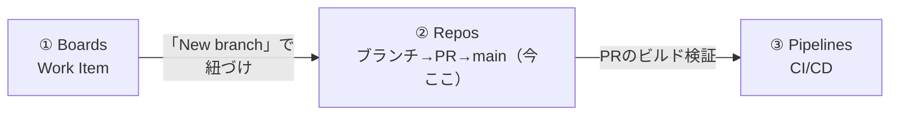
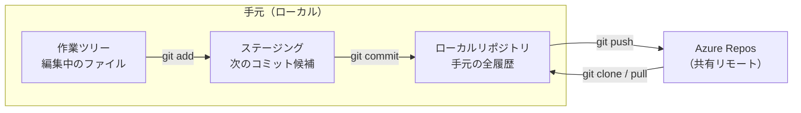
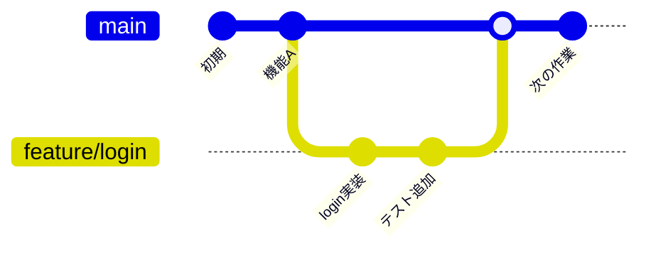
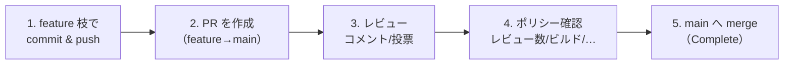
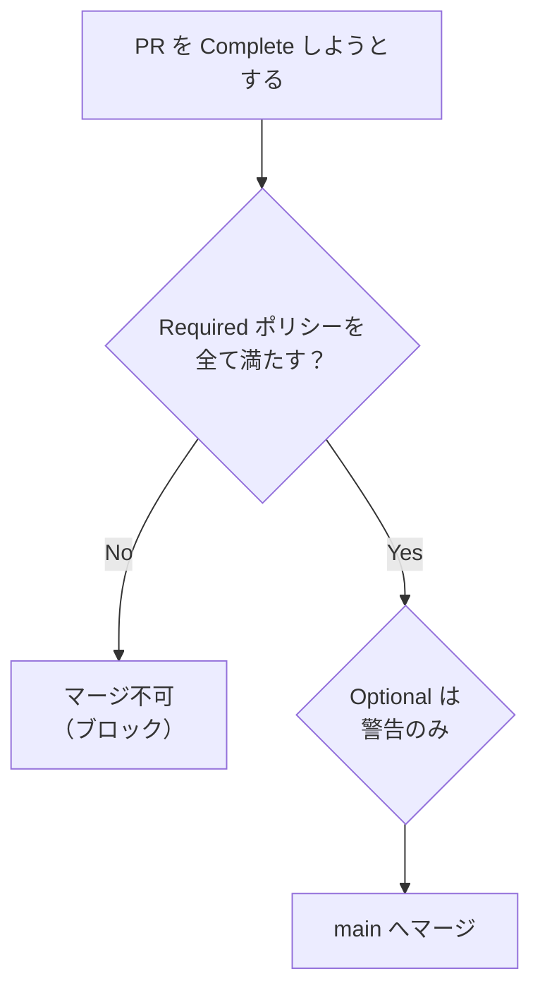
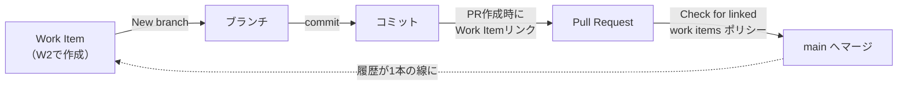

# Azure DevOps 学習 — Week 3：Azure Repos（コードの共同作業）

## この週の学習目標

- **バージョン管理**が何を解決するかを説明し、**Git**（分散）と **TFVC**（集中）の違いを理解する。
- Git の基本操作（clone / commit / push / branch / merge）を、Azure Repos の文脈で復習する。
- **ブランチ戦略**（Trunk-based / Feature Branch / Release Flow）の考え方を持つ。
- **Pull Request（PR＝プルリク）**によるコードレビューの流れを説明できる。
- **Branch Policy（ブランチポリシー）**で main を守る主要ルール（最小レビュー数・ビルド検証・コメント解決・Work Item 紐づけ）を設定できる。
- **Required（必須）と Optional（任意）**ポリシーの違いを理解する。
- W2 の Work Item と、W3 のブランチ・PR を**紐づけて**、計画とコードを1本の線でつなぐ。

> W2 の復習：Boards の Work Item がすべての起点。本週はその②「コード」を担う **Azure Repos**。公式定義は "Azure Repos is a set of version control tools that you can use to manage your code."（コードを管理するバージョン管理ツール群）。

---

## §0 位置づけ — 計画とビルドの間

Repos は「Work Item（計画）を実際のコード変更に変え、main に安全に取り込む」段を担う。ここで学ぶ **PR** と **ブランチポリシー**は、W4 以降の CI/CD が「壊れたコードを弾く」ための土台になる。

---

## 1. バージョン管理 — なぜ必要か

公式の説明：

> "Version control systems are software that helps you track changes you make in your code over time."
> （バージョン管理はコードの変更を時系列で追跡するソフトウェア）

バージョン管理が無いと、こうなる：

- `main_final.py` `main_final_v2.py` `main_final_本当に最終.py` のようなファイル地獄。
- 複数人が同じファイルを編集して、誰の変更が正か分からなくなる。
- 「先週動いていた版に戻したい」ができない。

バージョン管理はこれを解決する。公式："Version control keeps a history of your development so that you can review and even roll back to any version of your code with ease."（過去の任意の版に簡単に戻せる）。**一人開発でも有効**である。

Azure Repos は2種類を提供する（W1 既出）。

| 方式 | 読み | 型 | 特徴 |
|---|---|---|---|
| **Git** | ギット | 分散（distributed） | 手元にも完全な履歴を持つ。オフライン作業可。**新規は基本これ** |
| **TFVC** | ティーエフブイシー | 集中（centralized） | 履歴はサーバーのみ。手元は各ファイル1版。Project に1つのリポジトリ |

> **初心者向け用語補足：分散 vs 集中**
> - **集中型（TFVC）**：中央サーバーだけが「正史（全履歴）」を持つ。手元は最新版のコピーだけ。サーバーに繋がないと履歴が見られない。
> - **分散型（Git）**：clone した瞬間、**手元のリポジトリにも全履歴が丸ごと入る**。だからオフラインでコミットでき、サーバーは「共有用の待ち合わせ場所」になる。公式："your local copy of code is a complete version control repository."
> 現代の標準は Git。本教材も以降 Git を前提にする。TFVC は「昔からの資産がある組織向け」と理解しておけばよい。

**Azure Repos の Git は標準 Git**（公式："Git in Azure Repos is standard Git."）。VS Code・Visual Studio・コマンドライン・各種 IDE から使える。特殊な方言ではない点が安心材料。

> **IDE**＝Integrated Development Environment（Integrated=統合／Development=開発／Environment=環境）。エディタ・ビルド・デバッグをまとめた開発ソフト（VS Code, Visual Studio 等）。

---

## 2. Git 基礎の復習 — Azure Repos の文脈で

Git の中核操作を、リモート（Azure Repos）とのやり取りとして整理する。

| コマンド | 読み下し | やること（破壊的か） |
|---|---|---|
| `git clone <URL>` | クローン＝複製 | リモートを手元に丸ごと複製（初回） |
| `git add <file>` | アッド＝加える | 変更を「次のコミット候補（ステージ）」に載せる |
| `git commit -m "..."` | コミット＝確定 | ステージした変更を手元履歴に**スナップショットとして確定**（消えない） |
| `git push` | プッシュ＝押し上げ | 手元のコミットをリモートへ送る |
| `git pull` | プル＝引き込む | リモートの変更を手元に取り込む（fetch＋merge） |
| `git branch <名>` | ブランチ＝枝 | 新しい枝（作業の分岐）を作る |
| `git checkout <名>` / `git switch <名>` | チェックアウト／スイッチ＝切替 | 別ブランチに移る |
| `git merge <名>` | マージ＝合流 | 別ブランチの変更を今のブランチに合流させる |

> **コミットとは何をしているか**：Git は変更を「差分」ではなく「その時点のファイル全体のスナップショット（撮影）」として記録する。各コミットは一意のハッシュ（例 `a1b2c3d`）を持ち、親コミットを指すことで履歴の鎖を作る。だから任意のコミットに戻れる。

### 2-1. ブランチという考え方

**ブランチ**は「main を汚さずに作業するための平行世界」である。

main から枝を切り、その枝で自由に commit し、完成したら main に merge して戻す。複数人が別々の枝で並行作業でき、main は常に「動く状態」に保てる——これがブランチの狙い。

---

## 3. ブランチ戦略 — main をどう守り、どう合流させるか

「いつ枝を切り、いつ・どう戻すか」の方針をブランチ戦略と呼ぶ。代表例：

| 戦略 | 読み | 要点 | 向き |
|---|---|---|---|
| **Feature Branch** | フィーチャーブランチ | 機能ごとに枝を切り、PR で main へ | 最も一般的。中小チーム |
| **Trunk-based** | トランクベース | main（trunk＝幹）へ小さく頻繁に取り込む。枝は短命 | CI/CD と相性抜群。高頻度リリース |
| **Release Flow** | リリースフロー | Trunk-based ＋ リリース用ブランチ。Microsoft 社内の実践 | 大規模・定期リリース |
| **Git Flow** | ギットフロー | develop/release/hotfix など多層。手厚いが重い | 厳格な版管理が要る場合 |

> **初心者向け用語補足：Trunk と Branch の語感**
> **Trunk（トランク）**＝幹、**Branch（ブランチ）**＝枝。Trunk-based は「幹に小さくこまめに合流させ、枝を長生きさせない」思想。枝が長生きすると main との差が開いて **マージ地獄（大量コンフリクト）**になるため、CI/CD 時代は短命ブランチが好まれる。Microsoft 公式は自社の "Release Flow: Our Branching Strategy" を紹介している。

**共通する原則**：main（重要ブランチ）は直接 push で汚さず、**必ず PR を通す**。公式："There are a few critical branches in your repo that the team relies on to always be in good shape... Require pull requests to make any changes on these branches. Developers who push changes directly to the protected branches have their pushes rejected."（保護ブランチへ直接 push すると拒否される）。

---

## 4. Pull Request（PR）— レビューして合流させる

**Pull Request（プルリク）**は「私の枝を main に取り込んでほしい、レビューしてください」という**合流のお願い＋レビューの場**である。

公式（Repos の PR 機能）："Review code with your team and make sure that changes build and pass tests before it gets merged."（マージ前に、ビルドが通りテストが通ることを確認しながらレビューする）。

PR 画面でできること：

- **差分（diff）を見る**：何が変わったか行単位で表示。
- **コメント／投票**：行にコメント、全体に Approve / Wait / Reject を投票。
- **Work Item をリンク**：この PR がどの計画（W2 の Work Item）に対応するか紐づけ（公式 "Link work items to pull requests"）。
- **PR Status**：外部サービスが成功/失敗を PR に書き込める（カスタム検証の拡張点）。

### 4-1. マージ方式

PR 完了時に、履歴の残り方を選べる。

| 方式 | 読み | 履歴の形 |
|---|---|---|
| **Merge (no fast-forward)** | マージコミット | 枝のコミット全部＋合流コミット1つ |
| **Squash merge** | スカッシュ＝押しつぶす | 枝の全コミットを**1つにまとめて** main へ（履歴がきれい） |
| **Rebase** | リベース＝土台を付け替え | 枝のコミットを main の先端に一直線で並べ直す |

> **初心者向け用語補足：Squash がよく好まれる理由**
> 開発中の「typo修正」「またtypo修正」みたいな細かいコミットを main に残したくないとき、Squash すれば1機能＝1コミットに圧縮できて履歴が読みやすい。ブランチポリシーでマージ方式を制限（Limit merge types）できる。

---

## 5. Branch Policy（ブランチポリシー）— main を機械で守る

**ブランチポリシー**は「このブランチに PR をマージするための満たすべき条件」である。人の善意でなく仕組みで品質を強制する。公式："Use branch policies to protect important branches by requiring pull requests, reviewers, builds, and other checks before changes merge." そして "You can't delete a branch with required policies configured, and all changes must go through pull requests (PRs)."（必須ポリシー付きブランチは削除不可、変更は必ず PR 経由）。

主要ポリシー（公式）：

| ポリシー | 何を強制するか | 公式の要点 |
|---|---|---|
| **Require a minimum number of reviewers** | 最小レビュー承認数 | "Require approval from a minimum number of reviewers before a pull request can complete."（例：2人以上の Approve） |
| **Check for linked work items** | PR に Work Item を紐づけ | "requires that work items be linked to a PR for the PR to merge."（計画との紐づけを強制＝トレーサビリティ） |
| **Check for comment resolution** | 全 PR コメントの解決 | "checks whether all PR comments are resolved."（未解決コメントを残したままマージ不可） |
| **Limit merge types** | 許可するマージ方式の限定 | §4-1 の方式を選ばせる/縛る |
| **Build validation** | PR のコードで**ビルド＋テストを走らせ、通ることを要求** | 事前にビルドパイプラインが必要。CI との接点（W4） |
| **Status checks** | 外部サービスの成功ステータスを要求 | 事前に PR status を投稿できる連携が必要 |
| **Automatically included reviewers** | 特定パス変更時に自動でレビュアーを追加 | 例：`/security/` 配下はセキュリティ班を必須レビュアーに |

### 5-1. Required と Optional

各ポリシーは **Required（必須）** か **Optional（任意）** にできる。

- **Required**：満たさないと**マージできない**（ブロックする）。
- **Optional**：満たさなくても**警告を出すだけ**でマージは可能。公式（linked work items 例）："Make the setting **Optional** to warn when there are no linked work items, but allow completion of the pull request."

### 5-2. 最小レビュー数の細かい設定（公式）

「Require a minimum number of reviewers」には補助オプションがある。

- **Allow requestors to approve their own changes**：作成者の自己承認を数に含めるか。既定では作成者の Approve は数に**数えない**。
- **Allow completion even if some reviewers vote to wait or reject**：一部が Wait/Reject でも、必要数が Approve すれば完了可。
- **Reset all approval votes**：ソースブランチに新しい push が入ったら承認票をリセット（＝変更のたびに再承認を要求）。

> **投票の種類**：Approve（承認）/ Approve with suggestions（提案付き承認）/ Wait for author（作者待ち）/ Reject（却下）。Reject があると通常マージできない。

---

## 6. トレーサビリティの実現 — Work Item ⇄ ブランチ ⇄ PR

W2 で見た「Development コントロール」を、Repos 側から完成させる。

- Work Item の Actions →「New branch...」でブランチを作ると、そのブランチは Work Item に紐づく。
- PR 作成時に Work Item をリンク（または「Check for linked work items」ポリシーで強制）。
- こうして「計画（Work Item）→ 枝 → コミット → PR → main」が1本の線でたどれる。W8 のテスト、W4-6 のビルドもこの線に載る。

---

## 7. ハンズオン — ブランチ→PR→ポリシーで main を守る

> W1 の Project・W2 の Work Item を使う。Git クライアント（`git` コマンドまたは VS Code）が手元にある前提。無ければ Web 画面だけでも手順5以降は実施できる。

### 手順

1. **Repos → Files** を開き、既定リポジトリの **Clone** ボタンから HTTPS の URL を控える。
   - **注意（安全上）**：認証情報やパスワードの入力は自分の手で行うこと。Azure DevOps は Git 認証に PAT やクレデンシャルマネージャを使う（PAT は W9 で扱う）。
2. 手元で `git clone <URL>` する（またはこの手順は Web で代替可）。
3. **W2 の User Story を開き、Actions メニュー → New branch...** を選ぶ。ブランチ名（例 `feature/login`）を付けて作成。Work Item に紐づいたブランチができる。
4. そのブランチで小さな変更を1つ入れる（例：`README.md` に1行追記）。`git add` → `git commit -m "add login note"` → `git push`（Web の場合は Edit → Commit で `feature/login` に直接コミット）。
5. **Repos → Pull requests → New pull request** で、`feature/login` → `main` の PR を作成。タイトル・説明を書き、**Work Items にリンク**されていることを確認。
6. **PR の Files タブ**で差分を確認し、任意で行コメントを付ける。
7. いったん PR を閉じずに、**Repos → Branches → main の「…」→ Branch policies** を開く。
8. **Require a minimum number of reviewers** を On（数=1、練習なので「Allow requestors to approve their own changes」も On）にする。
9. **Check for linked work items** を On（Required）にする。
10. PR に戻り、**Complete** を試す。ポリシー（レビュー承認・Work Item リンク）が満たされているとマージでき、欠けているとブロックされることを確認。満たしてマージする。
11. マージ後、**W2 の User Story を開き、Development コントロール**にブランチ・PR・コミットが表示されることを確認（トレーサビリティ完成）。

### 確認ポイント

- Work Item から作ったブランチ→PR→マージが、Work Item の Development 欄で1本につながって見える。
- ブランチポリシーの Required を満たさないと Complete がブロックされる。Optional なら警告だけ。
- main へ直接 push しようとすると（ポリシー有効時）拒否される、という保護の意味が腹落ちする。

---

## 8. 自己チェック

1. バージョン管理は何を解決するか。一人開発でも有効な理由は。
2. Git（分散）と TFVC（集中）の最大の違いは。clone した手元には何が入るか。
3. `add` / `commit` / `push` / `pull` はそれぞれ何をするか。コミットは差分とスナップショットのどちらで記録されるか。
4. ブランチ戦略を2つ挙げ、Trunk-based が CI/CD 時代に好まれる理由を述べよ。
5. Pull Request とは何の場か。マージ前に確認するのは何か。Squash merge の利点は。
6. ブランチポリシーの主要4つ（最小レビュー数・Work Item 紐づけ・コメント解決・ビルド検証）を、それぞれ何を強制するかとともに。
7. Required と Optional の違いは。Optional は満たさないとどうなるか。
8. Work Item →ブランチ→PR→main を1本でたどれる仕組みは、Work Item のどのコントロールで見えるか。

---

## 9. 次週予告 — W4：Azure Pipelines 基礎（CI）

W3 のブランチポリシーで出てきた **Build validation（ビルド検証）**の正体が W4 の主役、**Azure Pipelines** である。YAML でパイプラインを定義し、`trigger` / `stage` / `job` / `step` の構造、実行環境の **agent / pool**、そして **Microsoft-hosted と self-hosted** の違いを学ぶ。「PR のたびに自動でビルド＋テスト」という CI の実体を、W3 の PR と繋げて実装していく。

---

## 出典（公式ドキュメント）

- Collaborate on code (What is Azure Repos?) — https://learn.microsoft.com/en-us/azure/devops/repos/get-started/what-is-repos
- Set and manage branch policies — https://learn.microsoft.com/en-us/azure/devops/repos/git/branch-policies
- Branch policies and settings overview — https://learn.microsoft.com/en-us/azure/devops/repos/git/branch-policies-overview
- About pull requests — https://learn.microsoft.com/en-us/azure/devops/repos/git/pull-requests
- Release Flow: Our branching strategy — https://learn.microsoft.com/en-us/azure/devops/repos/tfvc/branch-strategically
