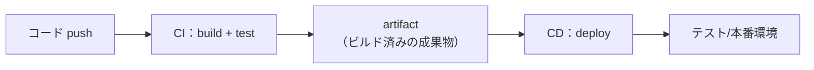
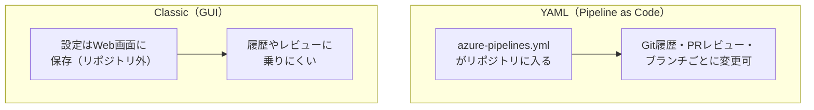
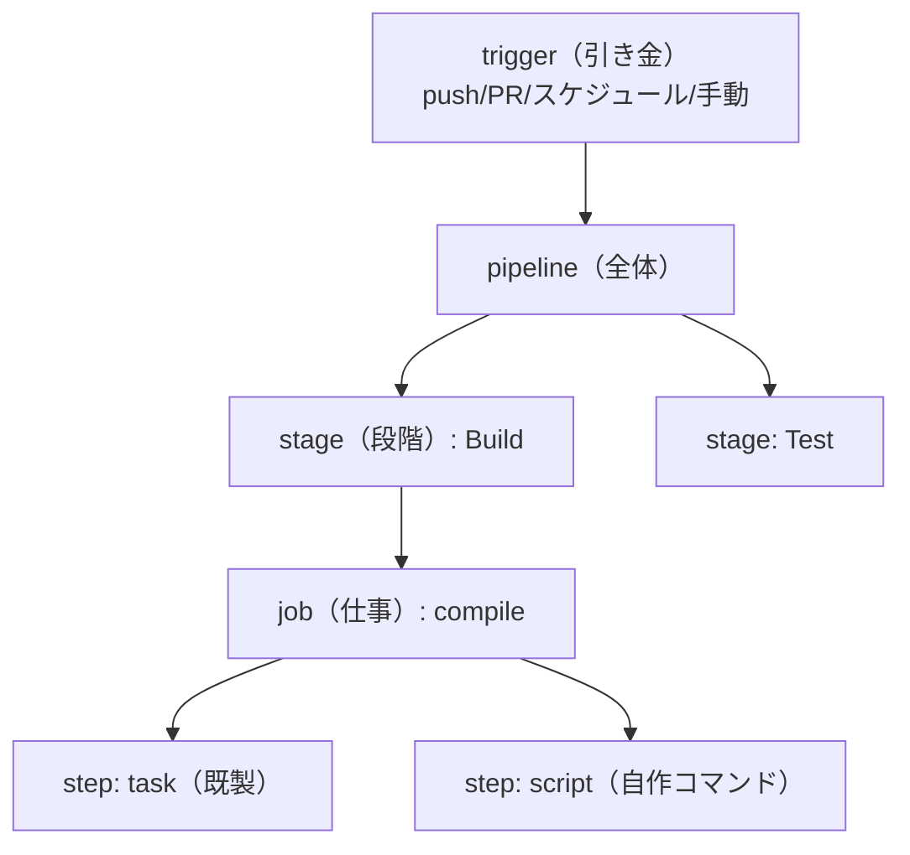
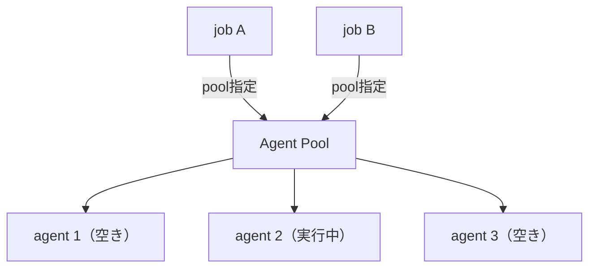
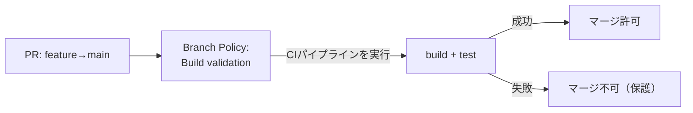

# Azure DevOps 学習 — Week 4：Azure Pipelines 基礎（CI）

## この週の学習目標

- **Azure Pipelines** が何を自動化するかを、CI/CD の観点で説明できる。
- **YAML パイプライン**と **Classic（GUI）**の違いを理解し、なぜ今 YAML が主流かを言える。
- パイプラインの構造 **trigger → stage → job → step（task / script）**を、入れ子の階層として説明できる。
- 実行環境の **agent（エージェント）**と **pool（プール）**の役割を理解する。
- **Microsoft-hosted** と **self-hosted** エージェントの違い（毎回まっさらな VM か、自前で持続か）を説明できる。
- W3 のブランチポリシー「Build validation」の正体が CI パイプラインだと繋げられる。
- W1 の Project で、最小の `azure-pipelines.yml` を作り、push でビルドが自動起動する CI を体験する。

> W3 の復習：Repos の PR とブランチポリシー。その「Build validation（ビルド検証）」を実行する主体が、本週の **Azure Pipelines**。公式定義："Azure Pipelines is the part of Azure DevOps that combines continuous integration, continuous testing, and continuous delivery to automatically build, test, and deploy code projects to any destination."（CI・継続的テスト・CD を組み合わせ、任意の宛先へ自動でビルド・テスト・デプロイする）。

---

## §0 位置づけ — 計画・コードを「動く保証」に変える

```mermaid
flowchart LR
    R["② Repos<br/>push / PR"] -->|trigger| P["③ Pipelines（今ここ：CI）<br/>build → test"]
    P -->|成果物(artifact)| CD["W5：CD<br/>deploy"]
    P -.->|PRのBuild validation| R
```

W4 は「push されたコードを、自動でビルドしテストし、壊れていないことを保証する」＝**CI（継続的インテグレーション）**の実装回である。W5 でこの成果物を各環境へ届ける **CD** に進む。W4・W5・W6 の3週で Pipelines を深掘りする最初の週にあたる。

---

## 1. Pipelines は何を自動化するか

W1 で学んだ CI/CD を、Pipelines の言葉で再確認する。公式の定義：

| 概念 | 公式の定義（要約） |
|---|---|
| **CI**（Continuous Integration） | "a process that runs automated tests and builds on a schedule, whenever code is pushed, or both."（push のたび／定期に、自動でテストとビルドを走らせる） |
| **CD**（Continuous Delivery） | "a process for building, testing, and deploying code to one or more test and production environments."（複数のテスト/本番環境へビルド・テスト・デプロイ） |

そして両者の橋渡しをするのが **artifact（アーティファクト＝成果物）**である。公式："CI pipelines produce artifacts that CD pipelines can use for automatic deployments."（CI がアーティファクトを産み、CD がそれを使ってデプロイする）。



> **初心者向け用語補足：artifact（アーティファクト）とは**
> パイプラインの実行（run）が生み出す「ファイルやパッケージの集合」。例：ビルドで出来た `.zip`、コンパイル済みバイナリ、Docker イメージ。CI で作った artifact を CD が受け取って配る——この受け渡しが CI/CD の連結点。
> なお **Pipelines の artifact** と **Azure Artifacts（W7）**は別物。公式が明記："Artifacts in Azure Pipelines are different from Azure Artifacts."。前者は「run が産む成果物」、後者は「パッケージを共有するフィード」。

対応言語は広い。公式："Azure Pipelines tasks can build, test, and deploy applications written in Node.js, Python, Java, PHP, Ruby, C#, C++, Go, XCode, .NET, Android, and iOS." 実行 OS も Linux / macOS / Windows。「あらゆる言語・基盤・クラウド」を掲げる。

---

## 2. YAML パイプライン vs Classic

Azure Pipelines の定義方法は2つある。

| 方式 | 読み | 定義の置き場所 | 特徴 |
|---|---|---|---|
| **YAML パイプライン** | ヤムル | `azure-pipelines.yml`（**コードと同じリポジトリ**） | **Pipeline as Code**。バージョン管理・レビュー・分岐可。**現在の主流・推奨** |
| **Classic（GUI）** | クラシック | Web の GUI エディタ（リポジトリ外） | 画面でポチポチ組む。学習は楽だが履歴・レビューに乗らない。旧来型 |



> **初心者向け用語補足：Pipeline as Code（パイプライン・アズ・コード）とは**
> 「ビルド/デプロイの手順そのものを、コードとしてリポジトリに置く」考え方。手順が `azure-pipelines.yml` というテキストになるので、①誰が何をいつ変えたか Git 履歴に残る、②PR でレビューできる、③ブランチごとに違う手順を試せる。W3 で学んだ Repos の恩恵（履歴・レビュー・ブランチ）がそのままパイプラインにも効く。本教材は一貫して **YAML** で進める。

> **YAML**（ヤムル）＝YAML Ain't Markup Language（再帰的頭字語）。インデント（字下げ）で階層を表す設定記述フォーマット。**タブではなく半角スペースでインデント**する点が最重要の注意。

---

## 3. パイプラインの構造 — trigger → stage → job → step

Pipelines の中核概念を、公式定義とともに階層で押さえる。これが W4〜W6 すべての土台になる。

公式の要約：
- "A manual, scheduled, or automated **trigger** causes a pipeline to start."
- "A pipeline can contain one or more **stages**... each contains one or more **jobs**."
- "Jobs run on **agents**... Each job contains one or more **steps**."
- "A **step** is the smallest element of a pipeline and can be a **task** or a **script**."



| 用語 | 読み | 公式定義（要約） | たとえ |
|---|---|---|---|
| **trigger** | トリガー | "an event that causes a pipeline to run."（実行の引き金） | スタートの号砲 |
| **pipeline** | パイプライン | "defines a workflow for build, test, and deployment tasks."（一連の作業フロー全体） | 料理のレシピ全体 |
| **stage** | ステージ | "a logical boundary in a pipeline... for example build, test, and production."（関心の分離。既定で順に実行） | レシピの大工程（下ごしらえ/加熱/盛付） |
| **job** | ジョブ | "an execution boundary of a set of steps that run sequentially on the same agent."（同一エージェント上で順に走る step の束） | 一人の担当が受け持つ一連の作業 |
| **step** | ステップ | "the smallest building block of a pipeline... a script or a task."（最小単位） | 手順書の1行 |
| **task** | タスク | "a prepackaged script... with a set of inputs."（入力を持つ既製の部品） | 出来合いの調理器具 |
| **script** | スクリプト | "runs command line, PowerShell, or Bash code as a step."（自作のコマンド） | 手で包丁を使う |

### 3-1. 階層の関係を正確に

- **stage は既定で順番に**実行される（build → test → prod）。公式："Multiple stages in a pipeline run one after another by default."
- **job は既定で順とは限らない**（並列もありうる）。公式："Jobs don't always run sequentially in stages by default." 例：x86 ビルドと x64 ビルドを別 job で**並列**に。
- **step は既定で上から順に**実行される。公式："By default, steps run one after another in a job."
- **1 job ＝ 1 agent**：ある job の全 step は同じエージェント上で走る。別 job は別エージェント（別マシン）かもしれない。

> **task と script の使い分け**：`PublishBuildArtifacts@1` のような**既製 task** は「REST 呼び出しや成果物発行」を入力指定だけで実行できる（車輪の再発明を避ける）。一方 `script: npm test` のような **script** は「このパイプライン固有の任意コマンド」を書く。多くのパイプラインは既製 task と script の混在になる。

### 3-2. run（実行）という単位

パイプラインを1回動かすことを **run（ラン）**と呼ぶ。公式："A run represents one execution of a pipeline." run はまずパイプラインを解釈し、job を1つ以上のエージェントに送り、ログとテスト結果を集める。「パイプライン定義」＝レシピ、「run」＝実際に1回料理したこと、と分けて捉える。

---

## 4. Agent と Pool — どのマシンで走るか

### 4-1. Agent（エージェント）

公式："An agent is computing infrastructure with installed agent software that runs one pipeline job at a time."（エージェント・ソフトを入れた計算資源で、**一度に1 job** を実行する）。

つまり job は「どこか実マシン（agent）」の上で走る。誰かが実際にビルドコマンドを叩いてくれる労働者、と考えるとよい。

### 4-2. Pool（プール）

**プール**は同種のエージェントの集まり。job は「このプールで走らせて」と指定し、プール内の空いているエージェントが1つ割り当てられる。YAML では `pool:` で指定する。



### 4-3. Microsoft-hosted vs self-hosted

エージェントの調達方法が2種類ある。ここが W4 の要。

| 種類 | 誰が用意・保守するか | VM の寿命 | 使いどころ |
|---|---|---|---|
| **Microsoft-hosted** | Microsoft（保守・更新も自動） | **1 job ごとに使い捨て（毎回まっさら）** | まず最初に試すべき既定。手間ゼロ |
| **self-hosted** | 自分（自前の VM に導入・保守） | **run 間で状態が持続** | 特殊な依存ソフト・キャッシュ高速化・社内ネット接続が要るとき |

公式（Microsoft-hosted）："With Microsoft-hosted agents, maintenance and upgrades happen automatically." / "**Each time you run a pipeline, you get a fresh virtual machine for each job**... The virtual machine is discarded after one job."（毎 job まっさらな VM、終わったら破棄）。既定プール名は **Azure Pipelines**。

公式（self-hosted）："A self-hosted agent is an agent that you set up to run jobs and manage yourself... **machine-level caches and configuration persist from run to run, which can boost speed**."（自分で用意・管理。キャッシュや設定が run 間で持続し高速化しうる）。

> **初心者向け用語補足：なぜ「毎回まっさら」が嬉しいのか／困るのか**
> Microsoft-hosted は job ごとに新品 VM なので「前回の残りかすで挙動が変わる」ことがなく**再現性が高い**。反面、毎回ゼロから依存インストールするので**遅くなりがち**で、特殊ソフトを事前に入れておけない。self-hosted は逆で、状態が残るぶん速いが、汚れの蓄積や保守は自分持ち。**まず Microsoft-hosted で始め、不足したら self-hosted**、が公式の推奨順。

代表的な Microsoft-hosted イメージ：`ubuntu-latest`（Linux・最速安価で定番）、`windows-latest`、`macOS-latest`。YAML の `vmImage` で指定する。

### 4-4. 並列ジョブ（parallel job）と無料枠

**parallel job（並列ジョブ）**＝Organization で同時に走らせられる job の数。公式："If your organization has a single parallel job, you can run a single job at a time... Any other concurrent jobs are queued."（1並列だと1 job ずつ、残りは待ち行列）。

無料枠（W1 既出の再確認・公式）：課金設定した private プロジェクトで **Microsoft-hosted 1並列・1 run 最大60分・月1,800分**。有料の parallel job は 1 run 最大360分・月間上限なし。

---

## 5. 最小 YAML の読み方

もっとも小さな CI パイプラインの例（Node.js を想定）：

```yaml
# azure-pipelines.yml（リポジトリ直下に置く）
trigger:
  - main                      # main への push で自動起動

pool:
  vmImage: ubuntu-latest      # Microsoft-hosted の Linux で実行

steps:
  - script: echo "Hello, Pipelines"   # step①：自作コマンド（script）
    displayName: あいさつ

  - task: NodeTool@0          # step②：既製 task（Node をセットアップ）
    inputs:
      versionSpec: '20.x'
    displayName: Node 20 を用意

  - script: |                 # step③：複数行コマンド
      npm install
      npm test
    displayName: 依存導入とテスト
```

読み下し：

| 行 | 意味 |
|---|---|
| `trigger: [main]` | main に push されたら自動で run する（CI の引き金） |
| `pool: {vmImage: ubuntu-latest}` | Microsoft-hosted の Ubuntu エージェントで走らせる |
| `steps:` | 実行する step の並び（この例は stage/job を省略した簡易形。単一 stage・単一 job とみなされる） |
| `- script:` | 自作のシェルコマンドを実行 |
| `- task: NodeTool@0` | 既製 task。`@0` は task のメジャーバージョン。`inputs:` で引数を渡す |
| `displayName:` | 実行ログでの表示名（読みやすさ用） |

> **省略形について**：小さなパイプラインは `stages:`/`jobs:` を書かず `steps:` から始められる。Azure Pipelines が「単一 stage・単一 job」を暗黙補完する。stage/job を明示するのは、複数段（build→deploy）や並列 job が必要になったとき（W5・W6）。

---

## 6. W3 との接続 — CI が Build validation を担う

W3 のブランチポリシー「**Build validation（ビルド検証）**」は、まさにこの CI パイプラインを PR で走らせる仕組みである。



- W4 で作った CI パイプラインを、W3 の「Build validation」ポリシーに登録すると、**PR のたびに自動ビルド＋テスト**が走る。
- 失敗すれば main へのマージがブロックされる＝壊れたコードが main に入らない。
- これが「CI で品質を守る」の具体形。公式："To help preserve quality, Azure Pipelines runs automated tests as part of the CI process."

---

## 7. ハンズオン — 最小 CI を作り、push で自動起動させる

> W1 の Project・W3 で使った既定リポジトリを使う。リポジトリに簡単なコード（無ければ `README.md` だけでも可）がある前提。

### 手順

1. **Pipelines → Pipelines → New pipeline** を選ぶ。
2. コードの場所で **Azure Repos Git** を選び、対象リポジトリを選択。
3. テンプレート選択画面で **Starter pipeline**（最小の雛形）を選ぶ。`azure-pipelines.yml` の編集画面が開く。
4. 中身を最小形に置き換える（例）：
   ```yaml
   trigger:
     - main
   pool:
     vmImage: ubuntu-latest
   steps:
     - script: echo "Hello from CI"
       displayName: あいさつ
     - script: echo "build step here"
       displayName: 疑似ビルド
   ```
5. **Save and run** を押す。コミット先を `main`（または新規ブランチ＋PR）に選んで実行。
   - これで `azure-pipelines.yml` がリポジトリにコミットされる（＝Pipeline as Code の実物がリポジトリに入る）。
6. **run が起動**する。ログ画面で trigger → job → 各 step が順に緑になるのを確認。`ubuntu-latest` の agent が割り当てられていることを見る。
7. リポジトリで**もう一度小さな変更を main に push** する。**自動で run が始まる**ことを確認（`trigger: main` が効いている＝CI の本質）。
8. （任意・W3 と接続）**Repos → Branches → main → Branch policies → Build Validation** を開き、いま作ったパイプラインを追加。PR を作ると自動でこのパイプラインが走り、失敗するとマージがブロックされることを確認。

### 確認ポイント

- `azure-pipelines.yml` が**リポジトリの中**にある（GUI 設定ではない）＝Pipeline as Code。
- main への push で**人が押さなくても** run が始まる＝トリガーによる CI。
- ログに agent（`ubuntu-latest`）・job・step の階層がそのまま現れる。
- Build validation に登録すると、CI が PR の門番になる（W3 と接続）。

---

## 8. 自己チェック

1. Azure Pipelines が組み合わせる3つ（CI・継続的テスト・CD）を挙げ、CI と CD の橋渡しをするものは何か。
2. YAML パイプラインと Classic の違いは。「Pipeline as Code」の利点を3つ。
3. trigger → stage → job → step の階層を説明せよ。stage・job・step は既定で順次か並列か、それぞれ。
4. task と script の違いは。1つの job の全 step は同じ agent で走るか。
5. agent と pool の関係は。Microsoft-hosted と self-hosted の最大の違い（VM の寿命）を述べよ。
6. Microsoft-hosted で「毎回まっさらな VM」が再現性に効く理由と、速度面の弱点は。
7. parallel job とは何か。無料枠では同時に何 job・月何分か。
8. W3 の「Build validation」と W4 の CI パイプラインはどう繋がるか。壊れたコードが main に入らないのはなぜか。

---

## 9. 次週予告 — W5：Azure Pipelines（CD）

W5 は CI の先、**CD（継続的デリバリー）**に進む。複数 **stage** を明示した **multi-stage パイプライン**（build → deploy）、デプロイ先を表す **Environment（環境）**、本番前に人が承認を挟む **Approvals and checks（承認とチェック）**、そして値や機密を渡す **Variables / Variable Group** を学ぶ。W4 で作った CI の artifact を、実際に環境へ届ける流れを組み立てる。

---

## 出典（公式ドキュメント）

- What is Azure Pipelines? — https://learn.microsoft.com/en-us/azure/devops/pipelines/get-started/what-is-azure-pipelines
- Key Azure Pipelines concepts — https://learn.microsoft.com/en-us/azure/devops/pipelines/get-started/key-pipelines-concepts
- Azure Pipelines agents — https://learn.microsoft.com/en-us/azure/devops/pipelines/agents/agents
- YAML schema reference — https://learn.microsoft.com/en-us/azure/devops/pipelines/yaml-schema
