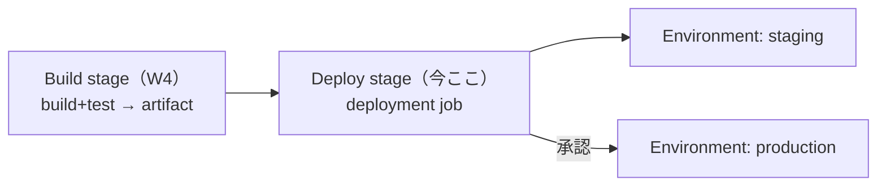
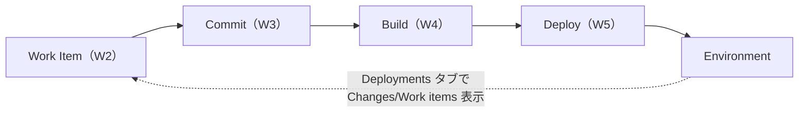
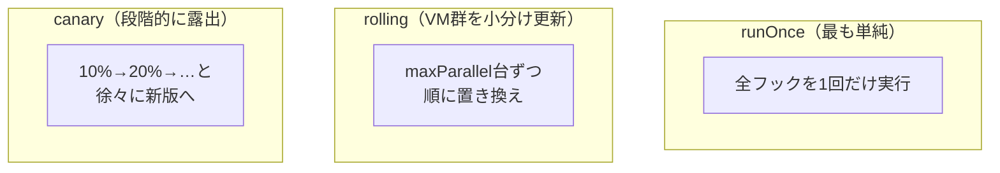
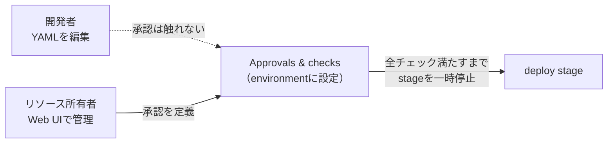

# Azure DevOps 学習 — Week 5：Azure Pipelines（CD／継続的デリバリー）

## この週の学習目標

- **CD（継続的デリバリー）**が CI の先で何をするかを、artifact の受け渡しとして説明できる。
- 複数 **stage** を明示した **multi-stage パイプライン**（build → deploy）を書ける。
- **deployment job（デプロイジョブ）**が通常 job と何が違うか（環境ターゲット・デプロイ履歴・戦略）を説明できる。
- **Environment（環境）**の役割（デプロイ先・履歴・トレーサビリティ・保護）を理解する。
- デプロイ戦略 **runOnce / rolling / canary** とライフサイクルフック（preDeploy/deploy/routeTraffic/postRouteTraffic/on）の骨格を掴む。
- **Approvals and checks（承認とチェック）**で本番前に人の承認を挟む仕組みを理解し、YAML には書けない（リソース所有者が管理する）点を押さえる。
- **Variables** と **Variable Group**、Key Vault 連携で値と機密を安全に渡せる。
- W4 の CI パイプラインに deploy stage を足し、承認付きで環境へ配る流れを組む。

> W4 の復習：`trigger→stage→job→step`、CI が artifact を産む。本週はその artifact を **Environment** へ届ける **CD**。公式（CD 定義）："Continuous delivery (CD) is a process for building, testing, and deploying code to one or more test and production environments. Deploying and testing in multiple stages helps drive quality by catching errors early and often."

---

## §0 位置づけ — artifact を「環境へ届ける」



W4 で「壊れていないこと」を保証した artifact を、W5 で「実際の環境へ配る」。ここで **stage を複数に分け**、**環境**という概念と **承認ゲート**が登場する。W6 ではこれを再利用可能に（テンプレート・Service Connection・Key Vault）していく。

---

## 1. Multi-stage パイプライン — build と deploy を段に分ける

W4 では `steps:` だけの単一 stage だった。CD では最低でも **build stage** と **deploy stage** に分ける。

```yaml
trigger:
  - main

stages:
  - stage: Build                    # ① ビルド段
    jobs:
      - job: BuildJob
        pool: { vmImage: ubuntu-latest }
        steps:
          - script: echo build...
          - task: PublishBuildArtifacts@1   # artifact を発行
            inputs:
              pathToPublish: '$(Build.ArtifactStagingDirectory)'
              artifactName: drop

  - stage: DeployStaging            # ② デプロイ段（Build の後に実行）
    dependsOn: Build
    jobs:
      - deployment: DeployJob       # ← job ではなく deployment
        pool: { vmImage: ubuntu-latest }
        environment: staging        # ← デプロイ先の環境
        strategy:
          runOnce:
            deploy:
              steps:
                - download: current  # 前段の artifact を取得
                  artifact: drop
                - script: echo deploy to staging...
```

ポイント：
- **stage は既定で順に**走る（W4 既出）。`dependsOn: Build` で「Build が終わってから Deploy」を明示できる。
- Build stage が **artifact を発行**し、Deploy stage が **download** で受け取る。これが CI→CD の受け渡し。公式："Azure Pipelines CD produces deployable artifacts... Automated release processes consume these artifacts."

> **初心者向け用語補足：なぜ段を分けるのか**
> 公式は stage を分ける理由を3つ挙げる：①別チームが別部分を管理する（テスト班とデプロイ班）、②**特定 job に承認をつなげる**（承認したい単位を stage にする）、③長時間 job を独立させる。CD で「本番デプロイ stage だけに承認を挟む」ためには、本番を独立 stage にする必要がある——これが段分けの実利。

---

## 2. Deployment job — デプロイ専用の特別な job

CD の主役が **deployment job（デプロイジョブ）**。通常 job（`job:`）ではなく `deployment:` と書く。公式推奨："we recommend that you put your deployment steps in a special type of job called a deployment job."

### 2-1. 通常 job との違い

| | 通常 job（`job:`） | deployment job（`deployment:`） |
|---|---|---|
| ターゲット | agent | **environment（環境）** |
| デプロイ履歴 | 残らない | **environment に記録される**（監査可） |
| デプロイ戦略 | なし | **runOnce / rolling / canary** |
| ソース取得 | 自動 checkout | **自動 checkout しない**（`checkout: self` が必要） |

公式が挙げる deployment job の利点2つ：
- **Deployment history**："You get the deployment history across pipelines, down to a specific resource and status of the deployments for auditing."（どのパイプラインが・どの環境へ・いつデプロイしたか監査できる）
- **Apply deployment strategy**："You define how your application is rolled out."（どう展開するかを定義）

> **注意：自動 clone しない**。公式："A deployment job doesn't automatically clone the source repo. You can check out the source repo within your job with `checkout: self`."（通常 job と違い、deployment job はソースを自動取得しない。必要なら明示的に `checkout: self`）。

---

## 3. Environment — デプロイ先を表す論理ターゲット

公式定義："An environment represents a logical target where your pipeline deploys software. Common environment names include Dev, Test, QA, Staging, and Production."（Dev/Test/QA/Staging/Production などの論理的なデプロイ先）。

`environment:` に名前を書くと、その環境がなければ**自動作成**され（Web エディタ経由の場合）、デプロイ履歴がそこに積まれる。

### 3-1. Environment の4つの利点（公式）

| 利点 | 中身 |
|---|---|
| **Deployment history** | どのパイプライン・run がこの環境へデプロイしたか記録。複数パイプラインが同じ環境を狙うとき変更源を特定できる |
| **Traceability of commits and work items** | この環境へ**新たにデプロイされたコミットと Work Item** を一覧できる。W2/W3 の線がここまで届く |
| **Diagnostic resource health** | アプリが望む状態で動いているか検証できる |
| **Security** | どのユーザー・どのパイプラインがこの環境を狙えるかを制限できる |



公式（トレーサビリティ）："You can also view the commits and work items that were newly deployed to the environment... track whether a code change commit or feature/bug-fix work item reached an environment."（あるコミットや Work Item が「どの環境まで届いたか」を追える）。これが W1 から一貫して追ってきた**エンドツーエンドのトレーサビリティの終着点**である。

### 3-2. リソースタイプ

環境は「リソースの集まり」で、リソースが実際のデプロイ先。公式："Azure Pipelines environments currently support the Kubernetes and virtual machine resource types."（Kubernetes と仮想マシンをサポート）。リソースを紐づけない**空の環境**も作れ、デプロイ履歴の記録だけに使える（公式 Tip："Create an empty environment and reference it from deployment jobs to record deployment history"）。本教材のハンズオンはこの「空の環境」で十分。

> **注意**：Environment は **YAML パイプライン専用**。Classic には無く、代わりに Deployment groups がある（公式："Azure DevOps environments aren't available in Classic pipelines."）。

---

## 4. デプロイ戦略 — どう展開するか

deployment job は **戦略（strategy）**を選ぶ。公式："Azure DevOps supports the runOnce, rolling, and the canary strategies."

### 4-1. ライフサイクルフック

どの戦略も共通の「フック（hook＝差し込み口）」を持つ。公式の各定義：

| フック | 読み | いつ・何を（公式定義） |
|---|---|---|
| `preDeploy` | プリデプロイ | "run steps that initialize resources before application deployment starts."（デプロイ前の初期化） |
| `deploy` | デプロイ | "run steps that deploy your application."（本体を配る。**artifact の download はこのフックに自動注入**される） |
| `routeTraffic` | ルートトラフィック | "run steps that serve the traffic to the updated version."（新版へトラフィックを流す） |
| `postRouteTraffic` | ポストルート | "run the steps after the traffic is routed."（流した後の監視。一定時間ヘルスを見る） |
| `on: failure` / `on: success` | オン | "run steps for rollback actions or clean-up."（失敗時のロールバック／成功時の後始末） |

### 4-2. 3つの戦略



| 戦略 | 読み | 要点（公式） | 向き |
|---|---|---|---|
| **runOnce** | ランワンス | "the simplest deployment strategy wherein all the lifecycle hooks... are executed once."（全フックを1回） | まず最初の基本形。本教材の中心 |
| **rolling** | ローリング | "replaces instances of the previous version... on a fixed set of virtual machines (rolling set) in each iteration."（VM を `maxParallel` 台ずつ小分けに更新）。**VM リソース専用** | ダウンタイムを抑えたい VM 群 |
| **canary** | カナリア | "roll out the changes to a small subset of servers first... As you gain more confidence... release it to more servers."（`increments: [10,20]` のように少数→多数へ段階露出） | 高リスク変更のリスク低減 |

> **初心者向け用語補足：canary（カナリア）の語源**
> 昔、炭鉱で毒ガス検知にカナリアを先に入れた故事から。「まず少数（カナリア）に出して異常が無いか見てから全体へ」という発想。`postRouteTraffic` でヘルス監視し、問題なければ増やす。rolling が「置き換える台数」を刻むのに対し、canary は「新版に流すトラフィック割合」を刻む。

runOnce の最小形（公式例に準拠）：

```yaml
- deployment: DeployWeb
  pool: { vmImage: ubuntu-latest }
  environment: smarthotel-dev
  strategy:
    runOnce:
      deploy:
        steps:
          - checkout: self
          - script: echo my first deployment
```

---

## 5. Approvals and checks — 本番前に人が承認する門

CD の肝は「**本番に出す前に人が承認する**」ゲート。これが **Approvals and checks（承認とチェック）**。

公式定義："a manual approval check on an environment ensures that deployment to that environment only happens after the designated user reviews the changes being deployed."（環境への手動承認チェックにより、指定ユーザーが変更をレビューした後にのみデプロイされる）。

### 5-1. 最重要：承認は YAML に書かない

公式が明確に述べる：

> "Approvals and other checks aren't defined in the yaml file. Users modifying the pipeline yaml file can't modify the checks... Administrators of resources manage checks using the web interface of Azure Pipelines."

つまり **承認は environment（リソース）側に、Web UI で設定する**。YAML をいじれる開発者が勝手に承認を外せない——これがセキュリティ上きわめて重要。「作る人（YAML）」と「守る人（リソース所有者）」の権限を分離している。



### 5-2. 動作

公式："Azure Pipelines pauses the execution of a pipeline before each stage, and waits for all pending checks to be completed."（stage の前で一時停止し、全チェック完了を待つ）。承認を Reject すれば stage は実行されず、Timeout でも skip される。グループを承認者にした場合は**1人が承認すれば進む**。

### 5-3. チェックの種類（抜粋）

承認以外にも多様なチェックがある（公式の5カテゴリの一部）：

| チェック | 何をゲートするか |
|---|---|
| **Approvals** | 指定ユーザー/グループの手動承認（最頻出。本番デプロイ制御） |
| **Branch control** | 許可ブランチ（例 `refs/heads/main`）から作られたものだけ通す |
| **Business hours** | 指定時間帯だけデプロイを許可 |
| **Required template** | 特定の YAML テンプレートを継承していないと失敗（W6 と接続） |
| **Invoke REST API / Azure Function** | 外部サービスの成功応答を要求（カスタム検証） |
| **Exclusive lock** | 同時に1 run だけ通す（`lockBehavior: runLatest`/`sequential`） |

> environment のロールは **Creator / Reader / User / Administrator** の4つ。承認/チェックを管理できるのは Creator/Administrator/User（Reader 不可）。**Stakeholder は環境を作れない**（リポジトリにアクセスできないため）。

---

## 6. Variables と Variable Group — 値と機密を渡す

パイプラインに埋め込みたくない値（接続文字列・APIキー・環境ごとに違う設定）を外出しする仕組み。

### 6-1. パイプライン変数

YAML 内で直接定義する変数。

```yaml
variables:
  buildConfiguration: Release        # name-value 形式
steps:
  - script: echo $(buildConfiguration)   # $(名前) で参照（マクロ構文）
```

### 6-2. Variable Group（変数グループ）

公式定義："Variable groups store values and secrets that you can pass into a YAML pipeline or make available across multiple pipelines in a project."（**複数パイプラインで共有**できる値と機密の束）。**Pipelines → Library** で作る。

YAML からは `group:` で参照：

```yaml
variables:
  - group: my-variable-group          # 変数グループを取り込む
  - name: my-standalone-variable      # 単独変数と混在時は name-value 形式で
    value: 'xyz'
steps:
  - script: echo $(customer)          # グループ内の変数を $(名前) で使う
```

> **セキュリティ注意（公式）**：YAML でグループ名を書くだけだと、リポジトリに push できる人が機密を抜ける恐れがある。そのため **パイプラインにグループの使用を認可（authorize）する**必要がある（Library の Pipeline permissions、または CLI）。Secret 変数は**保護リソース**で、承認/チェック/パイプライン権限で守れる。

### 6-3. Key Vault 連携

機密は Variable Group を **Azure Key Vault** にリンクして管理するのが定石。公式："To create a secret variable group to link secrets from an Azure key vault as variables, follow... Link a variable group to secrets in Azure Key Vault."

```mermaid
flowchart LR
    KV["Azure Key Vault<br/>（機密の金庫）"] -->|リンク| VG["Variable Group<br/>（AzureKeyVault型）"]
    VG -->|group:参照＋認可| Pipe["Pipeline"]
    Pipe -->|$(secretName)で<br/>taskに引数として渡す| Task["step"]
```

> **初心者向け用語補足：Key Vault（キーボルト）とは**
> **Azure Key Vault** は機密（パスワード・証明書・APIキー）を安全に保管する Azure のサービス。パイプラインに直書きせず金庫に置き、実行時だけ取り出す。Variable Group を `AzureKeyVault` 型でリンクすると、Key Vault の secret がそのままパイプライン変数として使える。**Secret 変数はスクリプトで直接使えず、task の引数として渡す**必要がある（公式）。詳細な Key Vault 連携・Service Connection は W6 で扱う。

---

## 7. ハンズオン — CI に承認付き deploy stage を足す

> W4 で作った CI パイプライン（`azure-pipelines.yml`）を拡張する。デプロイ先は「空の環境」で履歴記録のみ（実インフラ不要）。

### 手順

1. **Pipelines → Environments → Create environment** で環境 `staging` を作る（リソースは None／空でよい）。同様に `production` も作る。
2. `production` 環境を開き、**Approvals and checks タブ → + → Approvals** を選び、承認者に**自分**を追加して Create。これで production への stage は承認待ちで止まる。
3. `azure-pipelines.yml` を multi-stage に書き換える：
   ```yaml
   trigger:
     - main
   stages:
     - stage: Build
       jobs:
         - job: BuildJob
           pool: { vmImage: ubuntu-latest }
           steps:
             - script: echo "build & test"
             - script: mkdir -p $(Build.ArtifactStagingDirectory) && echo hello > $(Build.ArtifactStagingDirectory)/app.txt
             - task: PublishBuildArtifacts@1
               inputs:
                 pathToPublish: '$(Build.ArtifactStagingDirectory)'
                 artifactName: drop
     - stage: DeployStaging
       dependsOn: Build
       jobs:
         - deployment: DeployStaging
           pool: { vmImage: ubuntu-latest }
           environment: staging
           strategy:
             runOnce:
               deploy:
                 steps:
                   - download: current
                     artifact: drop
                   - script: echo "deploy to STAGING"; cat $(Pipeline.Workspace)/drop/app.txt
     - stage: DeployProd
       dependsOn: DeployStaging
       jobs:
         - deployment: DeployProd
           pool: { vmImage: ubuntu-latest }
           environment: production      # ← 承認チェックが効く
           strategy:
             runOnce:
               deploy:
                 steps:
                   - script: echo "deploy to PRODUCTION"
   ```
4. **Save and run**。run が Build → DeployStaging と進み、**DeployProd の直前で一時停止**することを確認。
5. run 画面に **Review（承認）ボタン**が出るので、承認する。DeployProd が動き出す。
6. **Environments → production → Deployments タブ**を開き、デプロイ履歴が記録されていることを確認。**Changes / Work items** タブにコミットや Work Item が並ぶ（W3/W2 との接続）。
7. （任意）Variable Group を試す：**Library → + Variable group** で `demo-vars`（`greeting=hello` 等）を作り、Pipeline permissions でこのパイプラインを認可。YAML の Build stage に `variables: [- group: demo-vars]` を足し、`echo $(greeting)` で参照できることを確認。

### 確認ポイント

- stage が Build→Staging→Prod と順に進み、Prod の前で**人の承認を待つ**。
- 承認は **YAML ではなく environment 側（Web UI）**に設定した＝作る人と守る人の分離。
- deployment job のデプロイ履歴が environment に残り、Changes/Work items でトレーサビリティが完結する。
- artifact が Build stage で発行され、Deploy stage で download されて渡っている。

---

## 8. 自己チェック

1. CD とは何をするか。CI が産み CD が消費するものは何か。
2. multi-stage で build と deploy を分ける実利を、承認の観点から述べよ。`dependsOn` は何を保証するか。
3. deployment job は通常 job と何が違うか（ターゲット・履歴・戦略・checkout の4点）。
4. Environment の役割を4つ挙げよ。トレーサビリティは Environment のどのタブで見えるか。
5. runOnce / rolling / canary の違いは。canary が刻むのは何か、rolling が刻むのは何か。
6. ライフサイクルフック preDeploy/deploy/routeTraffic/postRouteTraffic/on の役割を1行ずつ。artifact の download が自動注入されるのはどのフックか。
7. なぜ承認は YAML に書かず environment 側に設定するのか。セキュリティ上の意味は。
8. パイプライン変数と Variable Group の違いは。Key Vault の secret を使うとき、スクリプトで直接使えるか、どう渡すか。

---

## 9. 次週予告 — W6：Azure Pipelines 応用

W6 は Pipelines 深掘りの最終週。**テンプレート**（YAML の再利用・`extends`／`Required template` チェックと接続）、**条件と Matrix**（環境ごと・OSごとの分岐と並列展開）、**Service Connection**（Azure など外部への認証接続）、そして W5 で触れた **Key Vault 連携**の実装を扱う。「動くパイプライン」を「保守できる・安全なパイプライン」へ引き上げる回である。

---

## 出典（公式ドキュメント）

- Deployment jobs — https://learn.microsoft.com/en-us/azure/devops/pipelines/process/deployment-jobs
- Create and target environments — https://learn.microsoft.com/en-us/azure/devops/pipelines/process/environments
- Pipeline deployment approvals (Approvals and checks) — https://learn.microsoft.com/en-us/azure/devops/pipelines/process/approvals
- Manage variable groups — https://learn.microsoft.com/en-us/azure/devops/pipelines/library/variable-groups
- Link a variable group to Key Vault — https://learn.microsoft.com/en-us/azure/devops/pipelines/library/link-variable-groups-to-key-vaults
