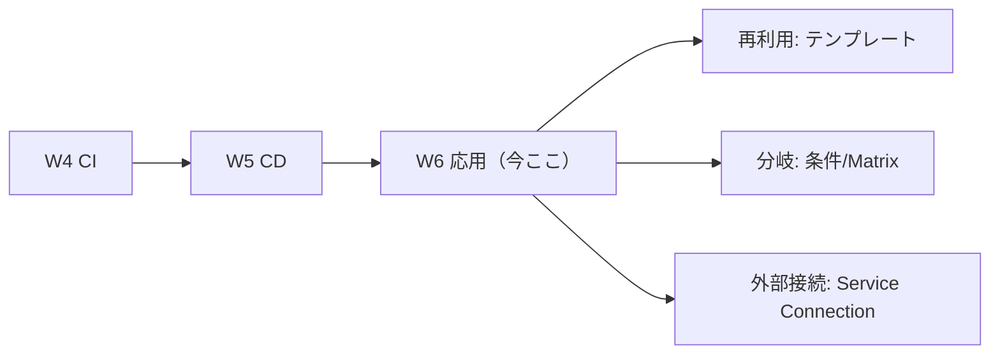
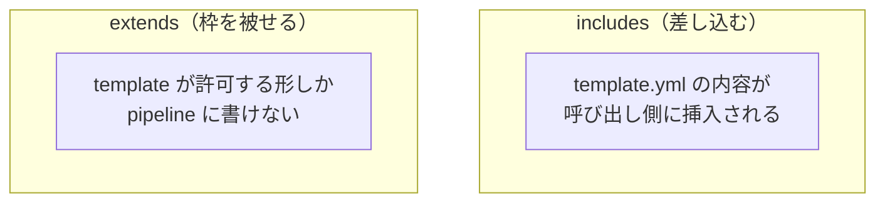
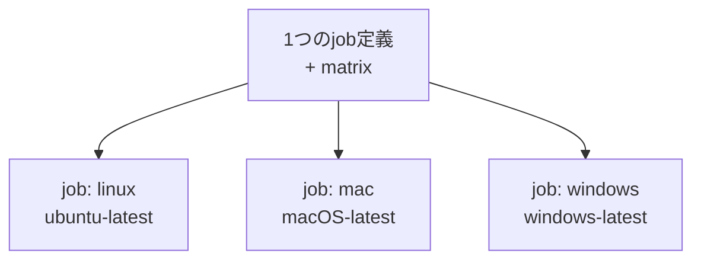
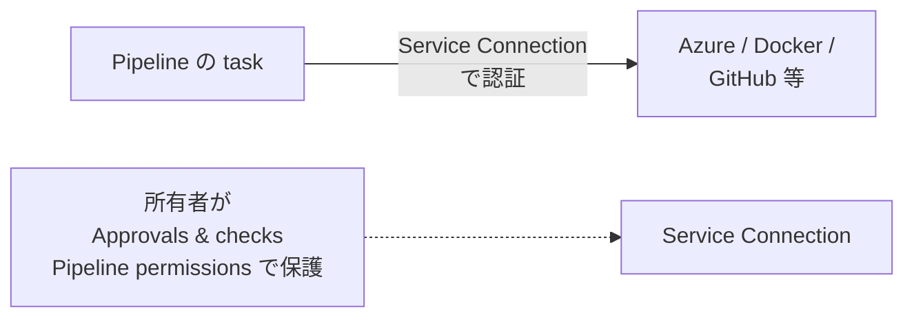
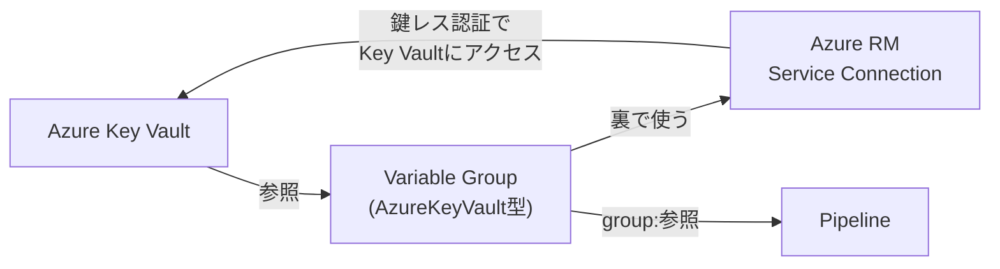

# Azure DevOps 学習 — Week 6：Azure Pipelines 応用（再利用・安全・外部接続）

## この週の学習目標

- **YAML テンプレート**の2種（**includes** と **extends**）の違いを理解し、再利用とガバナンスに使い分けられる。
- **テンプレートパラメータ**で、同じ手順を値違いで何度も展開できる。
- **条件（condition）**で stage/job/step を状況に応じて実行/スキップできる（`succeeded()`/`eq()`/変数）。
- **Matrix ストラテジ**で、OS やバージョン違いを1定義から並列展開できる。
- **Service Connection（サービス接続）**が外部（Azure 等）への認証接続だと理解し、**workload identity federation**（鍵レス）を第一候補にできる。
- W5 の **Key Vault 連携**を Service Connection 経由で実装する道筋を掴む。
- 「動くパイプライン」を「保守できる・安全なパイプライン」へ引き上げる。

> W4〜W5 の復習：`trigger→stage→job→step`、multi-stage・deployment job・承認・Variable Group。本週は Pipelines 深掘りの最終週。**重複をなくし（テンプレート）・分岐を扱い（条件/Matrix）・外部へ安全に繋ぐ（Service Connection）**。

---

## §0 位置づけ — Pipelines を「本番運用の品質」へ



同じ YAML をコピペし続けると保守が破綻する。複数環境・複数 OS で分岐が必要になる。Azure 本番へは安全に認証接続したい。この3つを解決するのが W6 である。

---

## 1. テンプレート — YAML の再利用とガバナンス

公式："Templates let you define reusable content, logic, and parameters in YAML pipelines." 種類は2つ。

| 種類 | 読み | 役割（公式） | たとえ |
|---|---|---|---|
| **Includes templates** | インクルード | "Insert reusable content into a pipeline."（内容を差し込む。多くの言語の include と同じ） | 定型文の貼り付け |
| **Extends templates** | エクステンズ | "Control and define a schema for what is allowed in a pipeline."（何を許すかを定義。セキュリティ/コンプラ強制） | 守るべき型（枠）を上から被せる |



### 1-1. includes — 手順の使い回し

`insert-npm-steps.yml` の step 群を、複数 job で使い回す（公式例）：

```yaml
# File: templates/insert-npm-steps.yml
steps:
  - script: npm install
  - script: npm test
```
```yaml
# File: azure-pipelines.yml
jobs:
  - job: Linux
    pool: { vmImage: ubuntu-latest }
    steps:
      - template: templates/insert-npm-steps.yml   # 差し込み
  - job: Windows
    pool: { vmImage: windows-latest }
    steps:
      - template: templates/insert-npm-steps.yml   # 同じ手順を再利用
```

step だけでなく **job・stage・変数** もテンプレート化できる。

### 1-2. パラメータ — 値違いで展開

`${{ parameters.xxx }}` で値を差し替える。公式例：1つの job テンプレートを3 OS 分展開。

```yaml
# templates/npm-with-params.yml
parameters:
  - name: name
    default: ''
  - name: vmImage
    default: ''
jobs:
  - job: ${{ parameters.name }}
    pool: { vmImage: ${{ parameters.vmImage }} }
    steps:
      - script: npm install
      - script: npm test
```
```yaml
# azure-pipelines.yml
jobs:
  - template: templates/npm-with-params.yml
    parameters: { name: Linux, vmImage: 'ubuntu-latest' }
  - template: templates/npm-with-params.yml
    parameters: { name: Windows, vmImage: 'windows-latest' }
```

> **初心者向け用語補足：`${{ }}` と `$( )` の違い（重要）**
> - `${{ parameters.x }}`＝**コンパイル時**（run 開始前）に展開される（テンプレート式）。パラメータや `${{ if }}` の分岐に使う。
> - `$(variableName)`＝**実行時**に展開される（マクロ構文、W5 既出）。変数の値の参照に使う。
> テンプレートやパラメータは run が始まる前に「YAML を組み立てる」段で処理され、変数は「走らせる」段で解決される、と分けて理解する。

### 1-3. extends — 型で縛って安全にする

公式："When a template controls what is allowed in a pipeline, the template defines logic that another file must follow. For example, you might want to restrict what tasks are allowed to run."

`extends` は「このテンプレートが許す形しか書けない」を強制する。W5 の **Required template チェック**（environment/service connection 側で「このテンプレートを継承していなければ失敗」）と組み合わせると、組織のセキュリティ標準を全パイプラインに強制できる。公式："you can increase security by adding a required template approval."

```yaml
# azure-pipelines.yml
trigger: [main]
extends:
  template: start-extends-template.yml   # この枠に従う
  parameters:
    buildSteps:
      - bash: echo Test    # 許可された形はOK
      # CmdLine@2 などは template 側で弾かれ、YAML構文エラーで失敗する
```

> **includes と extends の使い分け**：単なる重複排除は **includes**。「危険な task を禁止」「必ず特定 stage を通す」などガバナンス強制は **extends**。他リポジトリのテンプレートも `resources.repositories` で参照でき、`ref` でバージョン固定（タグ/ブランチ/SHA）できる。制限：YAML ファイルは100個・ネスト100段・20MB まで。

---

## 2. 条件（condition）— 状況で実行/スキップ

既定では「依存が全部成功したら実行」。これを `condition` で上書きする。

公式の主要関数：

| condition | 意味 |
|---|---|
| `succeeded()` | 直前の依存が全て成功したら（既定） |
| `failed()` | 直前の依存が失敗したときだけ |
| `succeededOrFailed()` | 失敗しても実行（キャンセル時は除く） |
| `always()` | 失敗・キャンセルでも必ず実行 |
| `eq(a, b)` / `ne` / `and` / `or` | 値の比較・論理結合 |

例：main ブランチのときだけ Stage B を実行（公式例）：

```yaml
variables:
  isMain: $[eq(variables['Build.SourceBranch'], 'refs/heads/main')]
stages:
  - stage: A
    jobs: [ { job: A1, steps: [ { script: echo Hello A } ] } ]
  - stage: B
    condition: and(succeeded(), eq(variables.isMain, true))   # mainかつ成功時のみ
    jobs: [ { job: B1, steps: [ { script: echo Hello B } ] } ]
```

> **重要な落とし穴（公式）**：`condition` を明示すると**既定の「親の成否を見る」挙動を上書きする**。`eq(variables['Build.SourceBranch'], 'refs/heads/main')` だけ書くと、**ビルドをキャンセルしても走ってしまう**。親の状態も見たいなら必ず `and(succeeded(), ...)` のように組み合わせる。

代表的な condition（公式表より）：

| やりたいこと | condition |
|---|---|
| main で、かつ成功時 | `and(succeeded(), eq(variables['Build.SourceBranch'], 'refs/heads/main'))` |
| PR が引き金、かつ失敗時 | `and(failed(), eq(variables['Build.Reason'], 'PullRequest'))` |
| CI ビルドのとき | `and(succeeded(), in(variables['Build.Reason'], 'IndividualCI', 'BatchedCI'))` |

---

## 3. Matrix — 1定義で並列展開

同じ job を「OS 違い」「バージョン違い」で並列に走らせたいとき、**matrix ストラテジ**を使う。

```yaml
jobs:
  - job: Build
    strategy:
      matrix:
        linux:
          imageName: 'ubuntu-latest'
        mac:
          imageName: 'macOS-latest'
        windows:
          imageName: 'windows-latest'
      maxParallel: 2          # 同時に走らせる上限
    pool:
      vmImage: $(imageName)   # matrix の各行が変数を注入
    steps:
      - script: echo Building on $(imageName)
```

- `matrix` の各キー（linux/mac/windows）が**別々の job インスタンス**になり並列実行される。
- 各行で定義した変数（`imageName`）がその job に注入される。
- `maxParallel` で同時実行数を制限（parallel job 枠との兼ね合い）。



> **matrix と includes テンプレートの違い**：テンプレートは「YAML を書く手間の再利用」、matrix は「実行時に同じ job を設定違いで並列展開」。クロスプラットフォーム対応（Linux/Mac/Windows で全部テスト）に matrix は最適。

---

## 4. Service Connection — 外部への認証接続

パイプラインが Azure・Docker レジストリ・外部 Git などに触るには認証が要る。それを担うのが **Service Connection（サービス接続）**。

公式定義："Service connections are authenticated connections between Azure Pipelines and external or remote services that you use to execute tasks in a job."（job のタスクが使う、Azure Pipelines と外部/リモートサービスの間の認証済み接続）。

主な種類（公式例）：

| 種類 | 接続先 |
|---|---|
| **Azure Resource Manager** | Azure サブスクリプション（最頻出。デプロイ先） |
| **GitHub / GitHub Enterprise Server** | GitHub リポジトリ |
| **Docker Registry** | Docker レジストリ（ACR 等） |
| **Kubernetes** | K8s クラスタ |
| **Azure Repos/TFS** | 別 Organization の Azure Repos |



### 4-1. 認証方式 — 鍵レスを第一に

Azure Resource Manager 接続の認証は主に2方式。

| 方式 | 読み | 中身 | 推奨度 |
|---|---|---|---|
| **Workload identity federation** | ワークロードID連携 | **秘密鍵を持たず**、短命トークンで Azure に認証（フェデレーション） | **第一候補（鍵レス＝漏洩リスク小）** |
| **Service principal（secret）** | サービスプリンシパル | アプリ用IDと**秘密鍵**で認証。鍵の保管・更新が必要 | 次善 |

> **初心者向け用語補足：Service Principal と Workload Identity Federation**
> - **Service Principal（サービスプリンシパル）**＝Microsoft Entra 上の「アプリ用のユーザー」。人ではなくパイプラインが Azure にログインするための ID。従来は秘密鍵（client secret）を持たせたが、鍵の漏洩・失効管理が悩みだった。
> - **Workload Identity Federation（ワークロードID連携）**＝秘密鍵を持たせず、「この Azure DevOps のこのパイプライン」という信頼関係で短命トークンを発行する仕組み。**鍵が存在しない＝盗まれない**。W5 の PAT/secret を減らす方針と同じ思想（鍵レス優先）。新規は原則こちら。

### 4-2. Service Connection の保護

Service Connection も**保護リソース**（W5 の environment / variable group と同じ）。公式：接続の **Approvals and checks** タブで、その接続を使う stage 開始前の承認/チェックを設定できる。**Pipeline permissions** で使えるパイプラインを限定できる。100日未使用で自動無効化され、有効化イベントは Audit log に残る。

### 4-3. Key Vault 連携の実装（W5 の続き）

W5 で触れた Key Vault 連携は、実装上こう繋がる：



Variable Group を Key Vault にリンクする際、裏では **Azure Resource Manager の Service Connection**（できれば workload identity federation）が Key Vault への認証に使われる。つまり「Service Connection が鍵レスで Key Vault に触り、その secret を Variable Group 経由でパイプラインに渡す」構図。

---

## 5. ハンズオン — テンプレート化＋Matrix＋（任意）Service Connection

> W4/W5 のパイプラインを土台にする。Service Connection の実作成は Azure サブスクリプションが要るため任意（無ければ手順1〜4で完結）。

### 手順

1. リポジトリに `templates/build-steps.yml` を作る：
   ```yaml
   steps:
     - script: echo "install deps"
     - script: echo "run build"
   ```
2. `azure-pipelines.yml` の Build job の steps を、テンプレート参照に置き換える：
   ```yaml
   jobs:
     - job: Build
       pool: { vmImage: ubuntu-latest }
       steps:
         - template: templates/build-steps.yml
   ```
3. **Matrix を足す**：Build job を OS 3種で並列展開してみる：
   ```yaml
   jobs:
     - job: Build
       strategy:
         matrix:
           linux:   { imageName: ubuntu-latest }
           windows: { imageName: windows-latest }
         maxParallel: 2
       pool: { vmImage: $(imageName) }
       steps:
         - template: templates/build-steps.yml
         - script: echo "built on $(imageName)"
   ```
4. **condition を足す**：DeployProd stage に `condition: and(succeeded(), eq(variables['Build.SourceBranch'], 'refs/heads/main'))` を付け、main のときだけ本番に進むようにする。Save and run し、run 画面で matrix が2 job に分かれ、条件が効くことを確認。
5. （任意・Azure 必要）**Project settings → Service connections → New service connection → Azure Resource Manager** を選び、認証は **Workload identity federation (automatic)** を選んでサブスクリプションに接続。名前を付けて作成。
6. （任意）その Service Connection を使う `AzureCLI@2` task を deploy step に足し、Azure に対して `az account show` 等を実行できることを確認。**Service connection の Approvals and checks** タブで承認を足せることも見ておく。

### 確認ポイント

- steps がテンプレートに切り出され、`azure-pipelines.yml` がすっきりした（重複排除）。
- matrix で1定義が複数 job に並列展開された。
- condition で main 限定の分岐が効いた（`and(succeeded(), ...)` の重要性）。
- （任意）Service Connection が「パイプライン→Azure」の認証の橋で、鍵レス（federation）が推奨だと理解した。

---

## 6. 自己チェック

1. includes テンプレートと extends テンプレートの違いは。ガバナンス強制にはどちらを使うか。
2. `${{ parameters.x }}` と `$(variableName)` は、それぞれいつ（コンパイル時/実行時）展開されるか。
3. `condition` を明示すると既定挙動はどうなるか。キャンセル時も走らせないためのイディオムは。
4. matrix ストラテジは何を並列展開するか。`maxParallel` は何を制限するか。
5. Service Connection とは何か。Azure Resource Manager 接続の2つの認証方式と、推奨される方を理由とともに。
6. Service Connection はどう保護されるか（W5 の environment と同じ枠組みで）。
7. Key Vault 連携で Service Connection はどの役割を果たすか。

---

## 7. 次週予告 — W7：Azure Artifacts

W7 は Pipelines を離れ、**Azure Artifacts** に進む。**Feed（フィード）**というパッケージの入れ物、**NuGet/npm/Maven/Python/Cargo/Universal** の対応、公開レジストリを安全に取り込む **Upstream sources**、そして **バージョニングと保持ポリシー**を学ぶ。W6 のパイプラインが産んだ成果物を「共有可能なパッケージ」として配る仕組みである。

---

## 出典（公式ドキュメント）

- YAML templates — https://learn.microsoft.com/en-us/azure/devops/pipelines/process/templates
- Pipeline conditions — https://learn.microsoft.com/en-us/azure/devops/pipelines/process/conditions
- Service connections — https://learn.microsoft.com/en-us/azure/devops/pipelines/library/service-endpoints
- Link a variable group to Key Vault — https://learn.microsoft.com/en-us/azure/devops/pipelines/library/link-variable-groups-to-key-vaults
- Jobs (matrix strategy) — https://learn.microsoft.com/en-us/azure/devops/pipelines/process/phases
