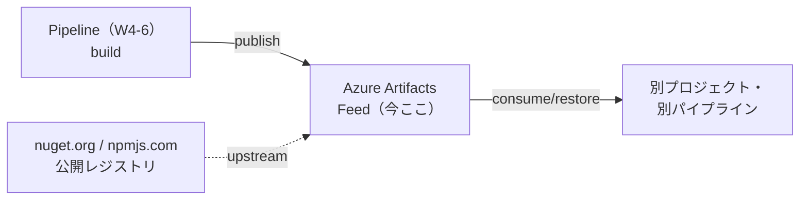
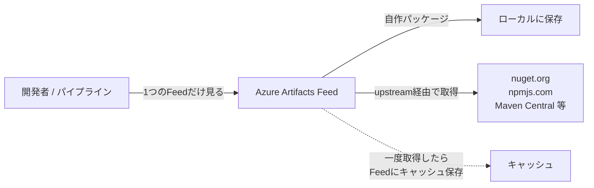
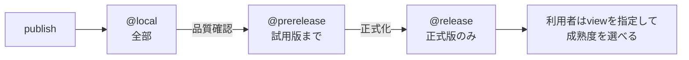
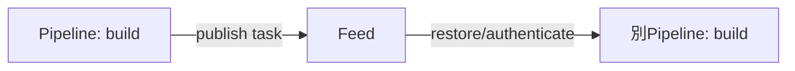

# Azure DevOps 学習 — Week 7：Azure Artifacts（パッケージ管理）

## この週の学習目標

- **パッケージ管理**が何を解決するかを理解し、Azure Artifacts の役割を説明できる。
- **Feed（フィード）**がパッケージの入れ物・アクセス境界だと理解する。
- 対応パッケージ種別（**NuGet / npm / Maven / Python / Cargo / Universal**）を把握する。
- **Upstream sources（上流ソース）**で公開レジストリ（nuget.org, npmjs.com 等）を安全に取り込む仕組みを説明できる。
- **Feed view（@local / @prerelease / @release）**でパッケージの成熟度を段階公開できることを理解する。
- **セマンティックバージョニング**と **保持ポリシー（retention）**の考え方を持つ。
- W6 のパイプラインで作った成果物を、Feed に publish し consume する流れを掴む。

> W1〜W6 の復習：Boards→Repos→Pipelines と流れてきた。本週は5サービスの④相当、**Azure Artifacts**。公式定義："Azure Artifacts provides developers with a streamlined way to manage all their dependencies from a single feed."（すべての依存関係を単一のフィードから管理する）。

---

## §0 位置づけ — 「部品」を共有する

W4 で「Pipelines artifact ≠ Azure Artifacts」と区別した。前者は run が産む一時成果物、**後者は「再利用可能なパッケージ（ライブラリ）を共有するフィード」**。共通ライブラリを社内で配る・公開パッケージを安全に取り込む、のが Azure Artifacts の役目。

---

## 1. パッケージ管理 — 何を解決するか

現代の開発は「他人が作った部品（ライブラリ）」の上に成り立つ。その部品の配布・取得の仕組みが**パッケージ管理**。

問題例：
- 社内で作った共通認証ライブラリを、5つのプロジェクトで使い回したい。コピペは地獄。
- 公開レジストリ（nuget.org 等）から直接取ると、ある日パッケージが消える／改ざんされるリスク（供給網リスク）。
- どのバージョンを使っているか、チームでバラバラ。

Azure Artifacts はこれを解決する。公式："These feeds serve as repositories for storing, managing, and sharing packages within your team, across organizations, or... publicly online."

> **初心者向け用語補足：パッケージ（package）とは**
> ライブラリ（再利用可能なコード）を、バージョン番号とメタ情報付きで固めた配布単位。`.NET` なら NuGet、`Node.js` なら npm、`Python` なら wheel/sdist。「部品を箱詰めして、番号を貼って棚に置く」イメージ。棚が Feed。

---

## 2. Feed — パッケージの入れ物

公式："Azure Artifacts feeds are organizational constructs that let you store, manage, and control access to packages."（保存・管理・アクセス制御を行う構成単位）。

Feed の性質：
- **複数種別を1つの Feed に**混在できる（公式："Azure Artifacts feeds support multiple package types such as npm, NuGet, Maven, Python, Cargo, and Universal Packages."）。
- **Visibility（可視性）**と **Scope（範囲：Organization or Project）**を作成時に決める。
- **無料枠は Organization ごとに 2 GiB**（W1 既出）。

対応種別（公式・Azure DevOps Services）：

| 種別 | 読み | エコシステム |
|---|---|---|
| **NuGet** | ニューゲット | .NET |
| **npm** | エヌ・ピー・エム | Node.js / JavaScript |
| **Maven / Gradle** | メイヴン／グレイドル | Java |
| **Python** | パイソン | Python（pip） |
| **Cargo** | カーゴ | Rust |
| **Universal Packages** | ユニバーサル | 任意のファイル群（種別に依らない汎用箱） |

> **Universal Packages**＝言語エコシステムに属さない「任意のファイルの塊」を版管理して配る箱。ビルド成果物・データセット・ツール類など、NuGet/npm 等に当てはまらないものに使う。

---

## 3. Upstream sources — 公開レジストリを安全に取り込む

**Upstream source（上流ソース）**は、Feed に「公開レジストリへの窓口」を持たせる仕組み。

利点：
- **窓口が1つになる**：開発者は「この Feed だけ」を見れば、自作パッケージも公開パッケージも取得できる。
- **キャッシュで供給網を守る**：一度 upstream 経由で取得した公開パッケージは Feed に**保存される**。元が消えても手元の Feed には残る（公式：upstream sources で "maintaining security"）。
- **監査・制御**：どの公開パッケージが入ってきたか Feed で把握できる。

> **初心者向け用語補足：なぜ「上流（upstream）」か**
> 川の流れで、公開レジストリが源流（上流）、自分の Feed が下流。「上流から水（パッケージ）を引いてくる」イメージ。Feed 作成時に「Upstream sources」チェックを入れると、その Feed が公開レジストリのプロキシ兼キャッシュになる。

---

## 4. Feed view — 成熟度で段階公開

**Feed view（フィュー）**は、同じ Feed 内のパッケージを「成熟度」で切り分けて見せる仕組み。既定で3つ。

| View | 読み | 意味 |
|---|---|---|
| `@local` | ローカル | その Feed に publish された全パッケージ＋upstream で取得したもの（既定の全体ビュー） |
| `@prerelease` | プレリリース | プレリリース版まで含めて公開する段階 |
| `@release` | リリース | 正式リリース版だけを公開する段階 |

利用側は `https://.../feed@release` のように view を指定して、「安定版だけ欲しい」を選べる。開発中の不安定版を本番プロジェクトに混入させない仕切りになる。

---

## 5. バージョニングと保持ポリシー

### 5-1. セマンティックバージョニング（SemVer）

パッケージのバージョンは **SemVer（Semantic Versioning）** が定番。`MAJOR.MINOR.PATCH`（例 `2.4.1`）。

| 位置 | 読み | 上げる条件 |
|---|---|---|
| **MAJOR** | メジャー | 後方互換を壊す変更 |
| **MINOR** | マイナー | 後方互換のある機能追加 |
| **PATCH** | パッチ | 後方互換のあるバグ修正 |

`2.4.1-beta` のような接尾辞が**プレリリース版**（@prerelease view と対応）。**同じバージョン番号での上書き publish は原則不可**（immutable＝一度出したものは変えない）。修正は必ず新バージョンで出す。

### 5-2. 保持ポリシー（retention）

Feed は放置するとストレージ（2 GiB 無料枠）を食い潰す。**保持ポリシー**で古いバージョンを自動削除する。

- 「最新 N 版だけ残す」「M 日より古いものは消す」等を設定。
- ただし**最近ダウンロードされたものは保護**される（使われている版を誤って消さない）。
- パイプラインが publish し続ける環境では、保持ポリシーが無いとすぐ容量オーバーになる。

---

## 6. パイプラインとの連携

Azure Artifacts はパイプラインと繋がって初めて真価を発揮する。

- **publish（発行）**：ビルドで作ったパッケージを Feed に push（`NuGetCommand@2 push` / `TwineAuthenticate`+`twine` 等）。
- **consume/restore（取得）**：ビルド時に Feed からパッケージを取得。認証は **NuGet Authenticate / npm Authenticate** 等の task が担う。

> **認証の注意（W9 と接続）**：ローカル開発では **Azure Artifacts Credential Provider** を使う。パイプラインでは **PAT を API キーとして使えない**（公式 FAQ）ので、`NuGet Authenticate` 等の認証 task を使う。鍵を直書きしないのが原則。

---

## 7. ハンズオン — Feed を作り publish/consume する

> W1 の Project を使う。ローカルに対象言語のツール（例：`dotnet` や `pip`/`twine`）がある前提。無ければ手順1〜3（Feed 作成・upstream 確認）だけでも可。

### 手順

1. **Artifacts → Create Feed**。名前（例 `demo-feed`）を付け、Scope を Project、**Upstream sources をチェック**して作成。
2. 作成した Feed を開き、**Connect to feed** ボタンで、対象種別（NuGet/npm/Python 等）の接続手順・URL が表示されることを確認。
3. **Upstream sources 設定**を開き、`nuget.org` や `npmjs.com` などの公開ソースが窓口として登録されていることを確認（§3）。
4. （publish 例・Python）ローカルで簡単なパッケージをビルドし、`twine` で Feed に publish する。認証は Connect to feed の指示に従う（`~/.pypirc` や Credential Provider）。
5. Feed の一覧に自作パッケージが**バージョン付きで**現れることを確認。View 切替（@local/@release）を試す。
6. 別の場所（または CI パイプライン）から、この Feed を参照して**同じパッケージを restore** できることを確認。upstream 経由で公開パッケージも同じ Feed から取れることを見る。
7. **Feed settings → Retention** を開き、保持ポリシー（例：最新 N 版を残す）を設定できることを確認。

### 確認ポイント

- 1つの Feed に自作パッケージと（upstream 経由の）公開パッケージが同居する。
- パッケージがバージョン付きで管理され、同一版の上書きはできない。
- View（@release 等）で成熟度を仕切れる。
- 保持ポリシーで容量を制御する必要性を理解した。

---

## 8. 自己チェック

1. パッケージ管理は何を解決するか。Pipelines artifact と Azure Artifacts の違いは。
2. Feed とは何か。1つの Feed に異なる種別のパッケージを混在できるか。
3. 対応パッケージ種別を4つ以上挙げよ。Universal Packages は何のためか。
4. Upstream sources は何をするか。供給網（公開パッケージ消失）に対してどう守るか。
5. Feed view（@local/@prerelease/@release）は何を切り分けるか。
6. SemVer の MAJOR/MINOR/PATCH をそれぞれ上げる条件は。同一バージョンの上書き publish はできるか。
7. 保持ポリシーはなぜ必要か。誤って使用中の版を消さない仕組みは。
8. パイプラインで publish/consume する際、PAT を API キーとして使えるか。代わりに何を使うか。

---

## 9. 次週予告 — W8：Azure Test Plans と品質

W8 は5サービスの最後、**Azure Test Plans**。**Test Plan / Test Suite（static/requirement-based/query-based）/ Test Case** の階層、**手動テスト**（Test Runner）と**探索的テスト**（Test & Feedback 拡張）、そして **自動テストのパイプライン統合**（Publish Test Results）とカバレッジ・品質ゲートを学ぶ。W2 の Work Item・W4-6 のパイプラインと結びつき、トレーサビリティが「要求→テスト→品質」まで一巡する。

---

## 出典（公式ドキュメント）

- What is Azure Artifacts? — https://learn.microsoft.com/en-us/azure/devops/artifacts/start-using-azure-artifacts
- What are feeds? — https://learn.microsoft.com/en-us/azure/devops/artifacts/concepts/feeds
- Upstream sources — https://learn.microsoft.com/en-us/azure/devops/artifacts/concepts/upstream-sources
- Feed views — https://learn.microsoft.com/en-us/azure/devops/artifacts/concepts/views-on-feeds
- Retention policies — https://learn.microsoft.com/en-us/azure/devops/artifacts/feeds/retention-policies
