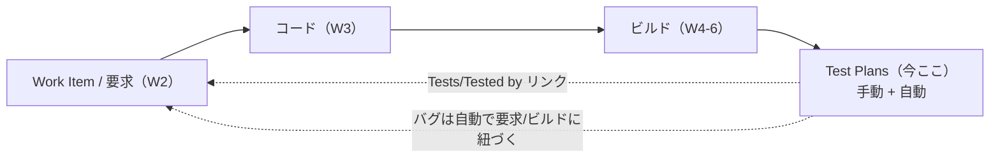
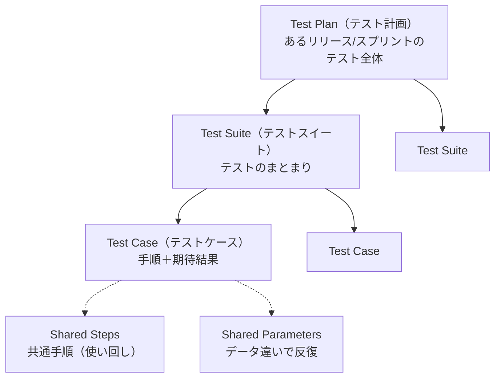
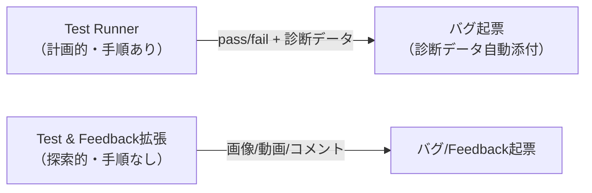
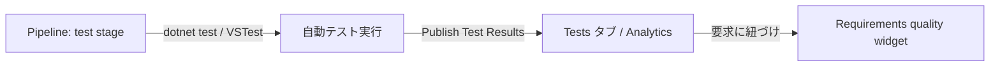
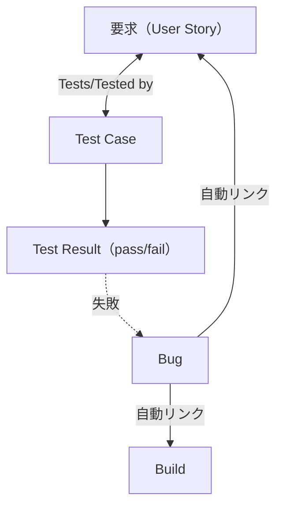

# Azure DevOps 学習 — Week 8：Azure Test Plans と品質

## この週の学習目標

- **Azure Test Plans** が計画的手動テスト・探索的テスト・UAT・自動テストを支えることを理解する。
- テストの階層 **Test Plan → Test Suite → Test Case** と、Suite の3種（**static / requirement-based / query-based**）を使い分けられる。
- **Test Case**（手順＋期待結果）の作り方と、**Shared Steps / Shared Parameters / Configurations** の役割を理解する。
- **Test Runner**（手動テスト）と **Test & Feedback 拡張**（探索的テスト）の違いを説明できる。
- **自動テストのパイプライン統合**（Publish Test Results 等）と、テスト結果・カバレッジの可視化を理解する。
- **品質ゲート（Requirements quality widget 等）**で「要求ごとの品質」を追える。
- W2 の Work Item・W4-6 のパイプラインと結びつけ、トレーサビリティを「要求→テスト→品質」まで一巡させる。
- アクセスレベル **Basic + Test Plans** が必要な範囲を把握する。

> W1〜W7 の総括：Boards（計画）→Repos（コード）→Pipelines（ビルド/デプロイ）→Artifacts（部品）と来た。本週は最後のサービス **Test Plans**。公式："Azure Test Plans offers powerful tools for driving quality and collaboration throughout the development process."

---

## §0 位置づけ — 品質でトレーサビリティを閉じる



公式（トレーサビリティ）："Bugs created while testing are automatically linked to the requirements and builds being tested." これで W1 から追ってきた「要求→コード→ビルド→デプロイ→**テスト/品質**」の輪が閉じる。

---

## 1. Azure Test Plans が支える4つのテスト

公式："This browser-based test management solution supports planned manual testing, user acceptance testing, exploratory testing, and stakeholder feedback."

| テスト種別 | 読み | 誰が | 何を |
|---|---|---|---|
| **計画的手動テスト** | — | テスター/テストリード | Test Plan/Suite に整理した手順を実行 |
| **UAT（受け入れテスト）** | ユーザー受け入れ | 受け入れ担当 | 顧客要求を満たすか検証（成果物を再利用） |
| **探索的テスト** | — | 開発/テスト/UX/PO 等 | 手順書なしでシステムを触りながら探る |
| **ステークホルダーフィードバック** | — | 開発外（営業/マーケ等） | 要求への感想・バグ報告 |

> **UAT**＝User Acceptance Testing（User=利用者／Acceptance=受け入れ／Testing=試験）。「発注者が納品物を受け入れてよいか」を確かめる最終確認。
> **PO**＝Product Owner（プロダクトオーナー。何を作るかの責任者）。

---

## 2. テストの階層 — Plan → Suite → Case

公式："test-specific work item types—Test Plans, Test Suites, Test Cases, Shared Steps, and Shared Parameters." これらはすべて Work Item である（W2 と地続き）。



### 2-1. Test Suite の3種（重要）

公式："Test suites can be dynamic—requirements-based-suites and query-based-suites... or static."

| Suite 種別 | 読み | 中身 | 使いどころ |
|---|---|---|---|
| **static**（静的） | スタティック | 手で選んだテストケースの固定集合 | 回帰テスト（決まった一式を毎回） |
| **requirement-based**（要求ベース） | — | ある要求（User Story 等）に紐づくテストの動的集合 | 「この要求の品質」を追う |
| **query-based**（クエリベース） | — | クエリ条件に合うテストの動的集合 | 「優先度=高のテスト全部」等 |

> **dynamic（動的）vs static（静的）**：static は手で入れた固定メンバー。dynamic（requirement/query ベース）は条件に合うものが自動で増減する。要求ベース Suite は「その要求がテストで担保されているか」を可視化するのに最適。

### 2-2. Test Case の中身

公式："Within each test case, you specify a set of test steps with their expected outcomes."（各ステップに「操作」と「期待結果」を書く）。

- **Shared Steps（共有ステップ）**：複数ケースで繰り返す手順（例：ログイン）を1つにまとめて使い回す。
- **Shared Parameters（共有パラメータ）**：同じ手順を**データ違いで反復**（公式例：カートに数量200と数量1を入れて両方確認）。
- **Configurations（構成）**：OS・ブラウザ・バージョン違いの組み合わせ（公式："testing your applications on different operating systems, web browsers, and versions"）。

Test Case を User Story/Feature/Bug に**リンク**すると、要求とテストが結びつく（トレーサビリティ）。

> **用語整理（公式）**：**Test case**＝検証する1シナリオ。**Test run**＝1つ以上のケースを実行した1回の実行。**Test result**＝各ケースの結果（pass/fail）。

---

## 3. 手動テストと探索的テスト — 2つのツール

公式は2つの実行ツールを挙げる。

| ツール | 読み | 用途 | 特徴 |
|---|---|---|---|
| **Test Runner** | テストランナー | 計画的手動テスト | Test Plans hub から起動。手順ごとに pass/fail、スクショ・操作ログ・画面録画を収集 |
| **Test & Feedback 拡張** | — | 探索的テスト | Chrome/Edge の無料拡張。手順書なしで触りながら画像・動画・コメントを記録。バグを即起票 |



公式（診断データの価値）："Bugs filed during the tests automatically include all captured diagnostic data to help your developers reproduce the issues."（テスト中に起票したバグに診断データが自動添付され、開発者が再現しやすい）。手動テストの最大の利点は「バグ再現に必要な情報が自動で揃う」こと。

---

## 4. 自動テストのパイプライン統合

公式："Automated testing is facilitated by running tests within Azure Pipelines." つまり自動テストは**パイプラインの中で走らせ、結果を Test Plans/レポートに集約**する。

主要な統合 task（公式）：

| task | 役割 |
|---|---|
| **Publish Test Results** | テスト結果（JUnit/xUnit 等）を Azure Pipelines に発行 |
| **Visual Studio Test（VSTest）** | 単体/機能テスト（Selenium/Appium 等）を実行 |
| **.NET Core CLI** | `dotnet test` でビルド・テスト |



> **重要（公式注記）**：自動テストを task で回す場合、**Test Plan/Test Case/Test Suite を定義する必要はない**（"Defining test plans, test cases, and test suites isn't required when test tasks are used."）。手動テスト管理（Test Plans hub）と、自動テスト（パイプライン task）は別ルートで、どちらも結果は Analytics に集約される。

W4 で作った CI に `dotnet test` + Publish Test Results を足せば、run ごとにテスト結果が可視化される。W3 の Build validation と組み合わせれば「テストが通らない PR はマージ不可」になる。

---

## 5. 品質ゲートとトレーサビリティ

### 5-1. Requirements quality widget（要求品質ウィジェット）

公式："The Requirements quality widget displays a list of all the requirements in scope, along with the Pass Rate for the tests and count of Failed tests."（要求ごとに、テストの合格率と失敗数を表示）。

- 「この User Story はテストで担保されているか」「テストが無い要求はどれか」が一目で分かる。
- ダッシュボードに置き、ビルド/リリースごとに品質を継続追跡する。

### 5-2. トレーサビリティの完成形

公式が挙げるリンク：Test Case ⇄ User Story/Feature/Requirement、バグ ⇄ 要求/ビルド。



これで W1 §3 の「1本の線」が完全に閉じる：**要求 → コード → ビルド → デプロイ → テスト → バグ → 要求**。ツールが統合されているからこの線が切れない、が Azure DevOps の核心。

---

## 6. アクセスレベル — Basic + Test Plans

Test Plans の**管理系機能は有料アクセスレベルが要る**。公式のアクセスレベル別表より：

| タスク | Stakeholder | Basic | Basic + Test Plans |
|---|---|---|---|
| Test Plan/Suite の作成、実行設定・構成管理 | ✖ | ✖ | **✔** |
| Test Runner で任意 OS でテスト実行 | ✖ | ✔ | ✔ |
| **Test & Feedback 拡張での探索的テスト** | **✔** | ✔ | ✔ |
| チャート作成・結果閲覧・UAT 割当 | ✔ | ✔ | ✔ |

> つまり **Test Plan の計画・管理には Basic + Test Plans（有料）**が要るが、探索的テスト（Test & Feedback 拡張）は Stakeholder でもできる。W1 のライセンス3段階（Stakeholder/Basic/Basic+Test Plans）がここで効いてくる。**Advanced（Visual Studio Enterprise）** でも Test Plans 機能が使える。

---

## 7. ハンズオン — Test Case を作り、自動テストをパイプラインに繋ぐ

> W1 の Project・W2 の User Story を使う。手順1〜4（手動テスト）は Basic + Test Plans が要る場合あり。手順5（自動テスト）は Basic で可。

### 手順（手動テスト）

1. **Test Plans → New Test Plan** を作る（対象イテレーションを選ぶ）。
2. Test Plan に **requirement-based suite** を追加し、W2 の User Story を紐づける（要求とテストが結合）。
3. Suite に **Test Case を作成**：ステップ「ログイン画面を開く」→期待結果「フォームが表示」、「正しい資格情報で送信」→期待結果「ホームに遷移」等。
4. **Execute タブ → Test Runner** で実行。各ステップを pass/fail。失敗させて**バグを起票**し、診断データ（スクショ等）が自動添付されること、バグが User Story に紐づくことを確認。

### 手順（自動テスト・パイプライン統合）

5. W4/W6 の `azure-pipelines.yml` の Build/Test に、テスト実行＋結果発行を足す（言語に応じて）。例（.NET）：
   ```yaml
   steps:
     - task: DotNetCoreCLI@2
       inputs:
         command: test
         projects: '**/*Tests.csproj'
         arguments: '--logger trx'
     - task: PublishTestResults@2
       inputs:
         testResultsFormat: VSTest
         testResultsFiles: '**/*.trx'
   ```
6. Save and run し、run の **Tests タブ**にテスト結果（件数・pass/fail）が出ることを確認。
7. （任意）ダッシュボードに **Requirements quality widget** を追加し、要求ごとの合格率が見えることを確認。W3 の Build validation と併せれば「テスト失敗の PR はマージ不可」になる。

### 確認ポイント

- Plan→Suite→Case の階層と、requirement-based suite で要求とテストが結合する。
- 手動テストのバグに診断データが自動添付され、再現が容易になる。
- 自動テストの結果がパイプラインの Tests タブに集約される（Plan 定義は不要）。
- Requirements quality widget で「要求ごとの品質」が見える＝トレーサビリティが閉じる。

---

## 8. 自己チェック

1. Azure Test Plans が支える4つのテストを挙げよ。UAT・探索的テストとは何か。
2. Test Plan/Suite/Case の階層を説明せよ。Suite の3種（static/requirement-based/query-based）の違いは。
3. Shared Steps と Shared Parameters と Configurations はそれぞれ何のためか。
4. Test Runner と Test & Feedback 拡張の違いは。手動テストで起票したバグの利点は。
5. 自動テストはどこで走らせるか。Publish Test Results は何をするか。自動テストに Test Plan 定義は必須か。
6. Requirements quality widget は何を可視化するか。トレーサビリティはどう閉じるか。
7. Test Plan の計画・管理に必要なアクセスレベルは。探索的テストは Stakeholder でできるか。

---

## 9. 次週予告 — W9：セキュリティ・運用・比較

5サービスを一巡した。W9 は横断テーマとして**セキュリティと運用**を扱う。**セキュリティグループと権限**（Readers/Contributors/Project Administrators、Allow/Deny/継承）、**アクセスレベル**との違い、**PAT（個人アクセストークン）**とその安全な扱い・鍵レス代替（Entra）、**監査ログ**、そして **GitHub Actions との比較**（YAML・Runner・料金）と使い分けを学ぶ。

---

## 出典（公式ドキュメント）

- What is Azure Test Plans? — https://learn.microsoft.com/en-us/azure/devops/test/overview
- Test objects and terms — https://learn.microsoft.com/en-us/azure/devops/test/test-objects-overview
- Create test plans and test suites — https://learn.microsoft.com/en-us/azure/devops/test/create-a-test-plan
- Requirements traceability — https://learn.microsoft.com/en-us/azure/devops/pipelines/test/requirements-traceability
- About access levels — https://learn.microsoft.com/en-us/azure/devops/organizations/security/access-levels
