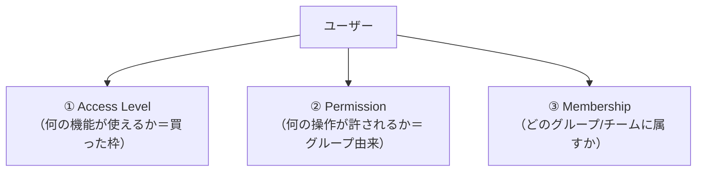
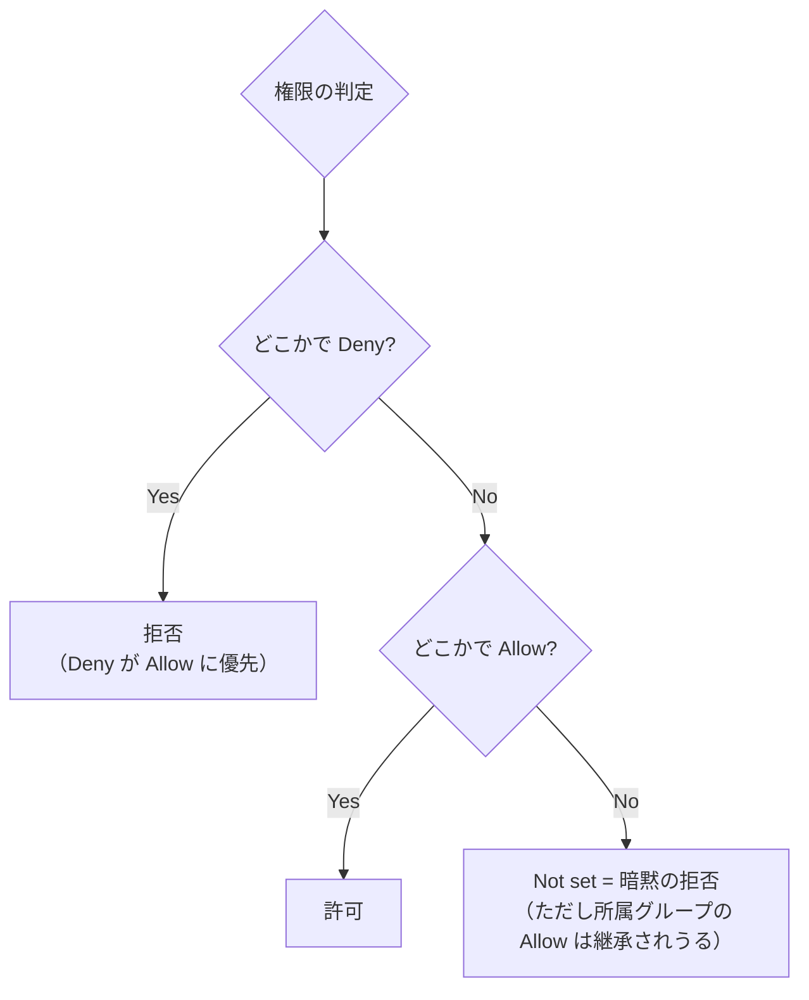
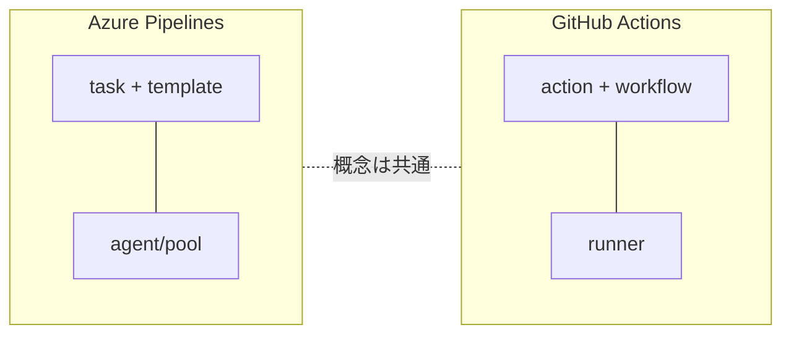

# Azure DevOps 学習 — Week 9：セキュリティ・運用・GitHub Actions 比較

## この週の学習目標

- **アクセスレベル**（Stakeholder / Basic / Basic + Test Plans）と **権限（permission）**の違いを説明できる。
- **セキュリティグループ**（Readers / Contributors / Project Administrators / Project Collection Administrators）と、権限の **Allow / Deny / 継承** の規則を理解する。
- **Deny が Allow に優先**する原則と、**object レベルでは specificity（具体性）が継承に優先**する例外を説明できる。
- **PAT（個人アクセストークン）**が何で、なぜ危険で、どう安全に扱うか（スコープ最小・短命・ローテーション）を理解する。
- **鍵レス代替**（Microsoft Entra トークン・マネージドID・サービスプリンシパル）を第一候補にできる。
- **監査ログ（Audit log）**で誰が何をしたか追える。
- **GitHub Actions と Azure Pipelines** を対比し、使い分けの判断軸を持つ。

> W1〜W8 で5サービスを一巡。W9・W10 は横断テーマ。本週は「安全に・正しく運用する」ための土台。

---

## §0 位置づけ — 3つの独立した制御軸

Azure DevOps のアクセス制御は**3つの独立した軸**で決まる（公式）。まずこの分離が最重要。

公式："Azure DevOps controls access through these three inter-connected functional areas: Membership management, Permission management, Access level management."

---

## 1. アクセスレベル vs 権限 — 混同禁物

### 1-1. アクセスレベル（Access Level）

「Web ポータルのどの**機能**が使えるか」を決める。**買ったライセンスで決まる**（W1 既出）。

| レベル | 使える範囲 |
|---|---|
| **Stakeholder** | 無料。Boards の閲覧・基本操作、探索的テスト。コード/パイプラインの多くは不可 |
| **Basic** | 最初の5人無料。Boards/Repos/Pipelines/Artifacts の全機能 |
| **Basic + Test Plans** | Basic ＋ Test Plans 管理（有料） |

公式："To give a user access to Agile portfolio management or test case management features, change **access levels**, not permissions."（Agile ポートフォリオやテスト管理を使わせたいなら、権限でなくアクセスレベルを変える）。

### 1-2. 権限（Permission）

「特定の**操作（タスク）**が許されるか」を決める。**セキュリティグループ経由**で付与。

公式："All users in Azure DevOps belong to one or more default security groups. Assign permissions to security groups that either **Allow** or **Deny** access."

> **混同ポイント**：「機能が見えない」のはアクセスレベル不足、「操作が拒否される」のは権限不足。原因の切り分けが運用トラブル対応の基本。

---

## 2. セキュリティグループと権限規則

### 2-1. 既定のセキュリティグループ

公式："Most Azure DevOps users are added to the **Contributors** security group and granted the **Basic** access level."

| グループ | レベル | 権限 |
|---|---|---|
| **Readers** | Project | 閲覧のみ |
| **Contributors** | Project | **読み書き**（リポジトリ・作業追跡・パイプライン）。**大多数のユーザーはここ** |
| **Project Administrators** | Project | プロジェクト設定・チーム・Area/Iteration・サービス接続の管理 |
| **Project Collection Administrators** | Organization | **最上位**。プロジェクト作成・ポリシー・プロセス・保持ポリシー・拡張の管理 |

> **Collection ≒ Organization**：クラウド（Services）では "Project Collection" ≒ Organization。オンプレ（Server）の名残で "Collection" と呼ぶ。

### 2-2. Allow / Deny / 継承の規則

権限の状態は Allow / Deny / Not set などがある。核心の規則：

公式の重要規則：

| 規則 | 内容 |
|---|---|
| **Deny > Allow** | "For most groups and almost all permissions, **Deny** overrides **Allow**." 2グループに属し片方が Deny なら、もう片方が Allow でも**できない** |
| **Not set = 暗黙 Deny** | ただしグループ経由の Allow（inherited）が働きうる |
| **明示 > 継承** | "Explicit permissions always take precedence over inherited ones." |
| **object では具体性 > 継承** | 親 Area を Deny、子 Area を Allow にすると、子では **Allow が勝つ**（specificity trumps inheritance） |
| **PCA の例外** | Project Collection Administrators でも、**work item 操作等で明示 Deny されると覆せない** |

> **初心者向け用語補足：なぜ Deny をむやみに使わないか**
> Deny は「その人がどのグループに入っても覆せない」強い禁止。1つの Deny が数百人に波及しうる（公式警告）。普段は「必要なグループに入れて Allow、入れないことで実質拒否（Not set）」で設計し、Deny は例外的に使う。

---

## 3. PAT（個人アクセストークン）

### 3-1. PAT とは

公式定義："A personal access token (PAT) acts as an alternative password for authenticating into Azure DevOps. This PAT identifies you and determines your accessibility and scope of access. Treat PATs with the same level of caution as passwords."（パスワード代わりの認証トークン。**パスワード同様に扱え**）。

Git 操作・REST API・パイプラインエージェント認証などに使う。作成時に **スコープ（Read/Write の範囲）と有効期限** を設定する。

### 3-2. なぜ危険か

公式（強い警告）："Avoid using PATs when a more secure authentication method is available. PATs carry inherent security risks because they're **long-lived credentials that can be leaked, stolen, or misused**."（長命の資格情報で、漏洩・盗難・悪用されうる）。

- 一度漏れると、有効期限まで悪用され放題。
- 公開 GitHub リポジトリに誤コミットされる事故が多い（Azure DevOps は自動検知して失効させる）。

### 3-3. 安全な扱い（公式ベストプラクティス）

| 原則 | 内容 |
|---|---|
| **最小スコープ** | "Select only the minimum scopes required." 読み取りだけで済むなら書き込みを付けない |
| **短命** | "Keep PAT lifespans short."（例：30〜90日） |
| **ローテーション** | 定期的に再生成（個人PATは90日、高権限は30日目安） |
| **共有しない・金庫に保管** | Key Vault 等に保管、コードに直書きしない |
| **不要になったら失効（Revoke）** | 退職・用済み時は即失効 |

### 3-4. 鍵レス代替を第一に（重要な潮流）

公式："Use Microsoft Entra tokens, managed identities, or service principals instead whenever possible." Microsoft は **PAT を減らす**方針を明確にしている。

| 代替 | 中身 | 使いどころ |
|---|---|---|
| **Microsoft Entra token** | 短命・更新可・Entra で監査 | 対話的シナリオ・CLI（`az`） |
| **Managed Identity** | Azure ホストのサービスに付く鍵レスID | App Service/Functions/Container Apps |
| **Service Principal** | アプリ用ID | クロステナント・非Azure |
| **Service Connection**（W6） | パイプライン→外部の認証。federation で鍵レス | パイプライン全般 |

> W5（Variable Group/Key Vault）・W6（Service Connection の workload identity federation）で繰り返した「鍵レス優先」は、この PAT 削減の潮流と一貫している。**新規は PAT よりまず Entra/federation** を検討する。

---

## 4. 監査ログ（Audit log）

公式："Azure DevOps records disable and enable events in the Audit log." **Organization settings → Audit log** で、誰が・いつ・何をしたかを追える。

- PAT の作成/失効（`PatCreated`/`PatRevoked` 等）、権限変更、Service Connection の有効/無効などを記録。
- 既定の保持は **90日**（Services、管理者が調整可）。
- フィルタ・エクスポートでコンプライアンス報告に使う。異常（業務時間外の PAT 作成等）の検知にも。

> **監査は「後から追える」ことに価値がある**。インシデント（漏洩・不正アクセス）が起きたとき、Audit log が無いと原因も影響範囲も特定できない。運用では監査ログの定期レビューを習慣化する。

---

## 5. GitHub Actions との比較

Azure Pipelines と **GitHub Actions**（GHA）はどちらも Microsoft 傘下の YAML ベース CI/CD。概念は共通だが用語と流儀が違う。

| 観点 | Azure Pipelines | GitHub Actions |
|---|---|---|
| 定義ファイル | `azure-pipelines.yml`（1本が基本） | `.github/workflows/*.yml`（複数ワークフロー） |
| 再利用単位 | **task**（既製）＋ template | **action**（Marketplace の部品）＋ reusable workflow |
| 実行環境 | **agent / pool**（MS-hosted / self-hosted） | **runner**（GitHub-hosted / self-hosted） |
| 引き金 | `trigger` / PR / schedule | `on:`（push/pull_request/schedule/多数のイベント） |
| 認証トークン | `$(System.AccessToken)` / Service Connection | `GITHUB_TOKEN`（自動発行）/ OIDC |
| 承認ゲート | environment の Approvals and checks | environment の Required reviewers |
| 計画/課題管理 | **Azure Boards（強み）** | GitHub Issues/Projects |
| 料金 | 無料枠1並列/1,800分（W1） | 無料枠はリポジトリ種別で異なる（分課金） |

### 使い分けの判断軸

- **GitHub 中心の開発なら GHA**：コードが GitHub にあり、OSS 連携・Marketplace の action が豊富。今の新規はこちらが主流。
- **エンタープライズの計画管理重視なら Azure DevOps**：Boards の充実、Test Plans、オンプレ版（Server）、既存の大規模採用。
- **併用も可**：Azure Boards と GitHub を連携（W2 既出）。「計画は Boards、CI/CD は GHA」も現実的。
- **本質は共通**：CI/CD・Agile・トレーサビリティ・鍵レス認証（OIDC/federation）という概念は両者共通。Azure DevOps で身につけた土台は GHA にそのまま効く。

> **OIDC**＝OpenID Connect。GHA が Azure に鍵レスで認証する仕組み（Azure Pipelines の workload identity federation に相当）。両者とも「長命の秘密鍵をやめる」方向は一致している。

---

## 6. ハンズオン — 権限・PAT・監査を確認する

> W1 の Organization/Project を使う。**PAT の作成は自分のアカウントで行うこと**（認証情報の管理は人間の領域）。

### 手順

1. **Project settings → Permissions** を開き、**Contributors / Readers / Project Administrators** グループがあることを確認。Contributors の権限（Repos 読み書き等）を眺める。
2. あるグループの権限で **Allow / Deny / Not set** の状態、「Why?」リンクで継承元をたどれることを確認（§2 の規則）。
3. **Organization settings → Users** で、自分のアクセスレベル（Basic 等）を確認。アクセスレベルと権限が別物であることを再確認。
4. **User settings（右上ギア）→ Personal access tokens → New Token**：
   - 名前を付け、有効期限を短め（例30日）、**スコープは最小限**（例：Code Read のみ）で作成。
   - 生成された token は一度しか表示されない（安全な場所に保管）。**共有しない**。
5. 作った PAT を試したら、**用済みで Revoke** する（§3-3 の実践）。
6. **Organization settings → Audit log** を開き、たった今の **PatCreated / PatRevoked** イベントが記録されていることを確認。
7. （任意）**Project settings → Service connections** を開き、W6 の Service Connection が「PAT より安全な鍵レス認証」の代替であることを再確認。

### 確認ポイント

- アクセスレベル（機能の枠）と権限（操作の可否）は独立している。
- Deny は強く、object では具体性が継承に勝つ。
- PAT はパスワード同様で、最小スコープ・短命・失効が鉄則。鍵レス代替が第一候補。
- 監査ログに操作が残り、後から追える。

---

## 7. 自己チェック

1. アクセスレベルと権限の違いは。テスト管理機能を使わせたいとき、どちらを変えるか。
2. 既定グループ Readers/Contributors/Project Administrators/Project Collection Administrators の役割は。大多数はどこか。
3. Deny と Allow ではどちらが優先か。object レベルでの例外（specificity）とは。
4. なぜ Deny をむやみに使わない方がよいか。
5. PAT とは何か。なぜ危険か。安全に扱う4原則を挙げよ。
6. PAT の鍵レス代替を3つ挙げ、パイプラインでは何を使うべきか。
7. Audit log は何を記録するか。既定保持は何日か。
8. Azure Pipelines と GitHub Actions の対応関係（task/agent と action/runner 等）を述べ、使い分けの軸を1つ。

---

## 8. 次週予告 — W10：最終プロジェクト

最終週は総合演習。**マルチステージ `azure-pipelines.yml`（CI/CD）+ サンプルアプリ + `az devops` CLI** で、W1〜W9 を1つに束ねる。サンプルアプリのビルド→テスト→（承認付き）デプロイを YAML で組み、`az devops` CLI でプロジェクト/パイプライン/変数を**コードから構成**し、Boards の Work Item から本番デプロイまでのトレーサビリティを E2E で通す。学んだ全概念を実際に動かす回である。

---

## 出典（公式ドキュメント）

- About permissions and security groups — https://learn.microsoft.com/en-us/azure/devops/organizations/security/about-permissions
- About access levels — https://learn.microsoft.com/en-us/azure/devops/organizations/security/access-levels
- Use personal access tokens — https://learn.microsoft.com/en-us/azure/devops/organizations/accounts/use-personal-access-tokens-to-authenticate
- Audit log — https://learn.microsoft.com/en-us/azure/devops/organizations/audit/azure-devops-auditing
- Migrate from Azure Pipelines to GitHub Actions — https://learn.microsoft.com/en-us/actions/migrating-to-github-actions/migrating-from-azure-pipelines-to-github-actions
