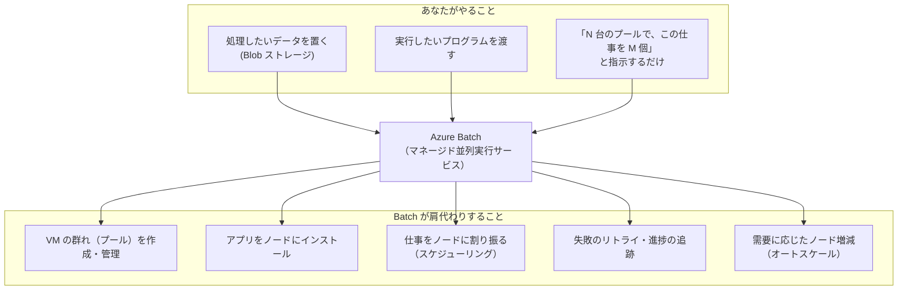
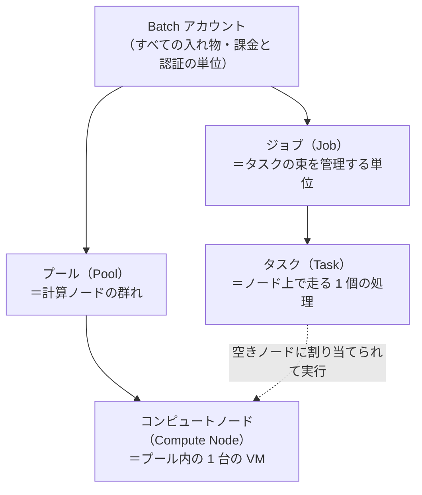
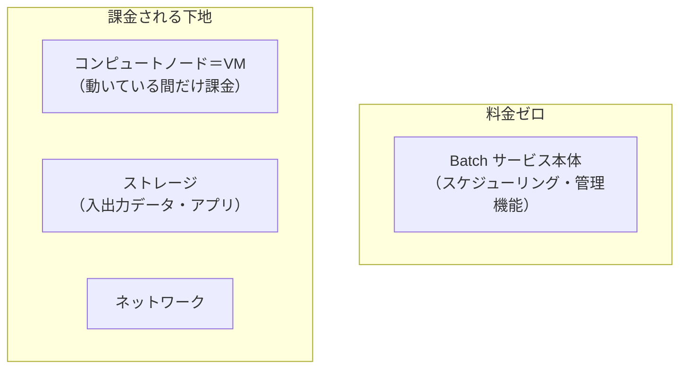
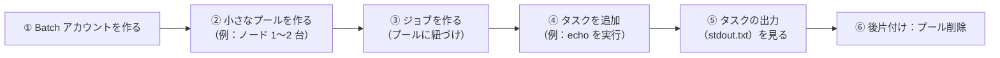
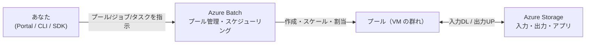

# Week 1 — Azure Batch とは何か：スケジューラもクラスタも自前運用せずに「大量の並列ジョブ」を流す

> **Phase 1a** | 学習プラン Week 1 / 10
> 学習目標：Azure Batch が「どんな問題を解くサービスなのか」「なぜ VM を自分で並べるのでも AKS でもなく Batch なのか」を自分の言葉で説明でき、実際に Batch アカウントを 1 つ作って、プール → ジョブ → タスクを 1 本流し「動くもの」を目で確認できる

---

## 0. 今週の位置づけ

この学習プランは全 10 週で、**Azure Batch というマネージド並列実行サービス**を主役に据え、次の順で深掘りする。

1. **Week 1-2**：Batch の正体とオブジェクトモデル（今日はここ）
2. **Week 3-4**：計算資源をどう用意するか（プール／ノード → オートスケール）
3. **Week 5-6**：仕事の単位をどう組むか（ジョブとタスク → 分割と依存関係）
4. **Week 7-8**：データとセキュリティ（入出力・アプリ配布 → 認証）
5. **Week 9-10**：運用と最終プロジェクト（コスト・監視・エラー切り分け → E2E 実装）

Batch は「**大量の計算をとにかく並列でさばく**」ための道具である。これまでの姉妹教材（Storage・API Management・Resource Manager など）が「データを置く」「API を守る」「リソースを宣言的に作る」といったテーマだったのに対し、本教材は「**計算そのものを大規模にスケールさせる**」という新しい軸を扱う。

> **本教材が扱わない範囲**：HPC 専用の高度なチューニング（InfiniBand〈インフィニバンド〉や RDMA〈Remote Direct Memory Access〉によるノード間高速通信の最適化、大規模 MPI の性能設計）は深追いしない。密結合並列（MPI）は Week 6 で「そういうものがある」という俯瞰に留める。また、レンダリング特化機能や Batch の内部スケジューラ実装の詳細も対象外とする。本教材の主眼は「**intrinsically parallel（内在的に並列）なワークロードを Batch で大規模に流せるようになる**」ことにある。

> **初学者向け用語補足：略語の展開**
> - **HPC**＝High Performance Computing（High＝高い／Performance＝性能／Computing＝計算）＝高性能計算。科学技術計算やシミュレーションなど、大量の計算資源を要する処理の総称。
> - **PaaS**＝Platform as a Service（Platform＝土台／as a Service＝サービスとして）＝アプリの実行基盤（OS・ミドルウェア・スケジューラなど）をクラウド側が用意してくれる提供形態。利用者は「その上で動かす仕事」に集中できる。
> - **VM**＝Virtual Machine（Virtual＝仮想の／Machine＝機械）＝仮想マシン。物理サーバー上に切り出された 1 台分の仮想的なコンピューター。

---

## 1. なぜ「大量の並列計算」は自前だと辛いのか

「同じ処理を、入力データを変えて 1 万回まわしたい」——たとえば次のような場面を考える。

- 動画ファイル 5,000 本を、それぞれ別フォーマットに変換（トランスコード）したい
- 金融のリスク試算を、乱数を変えながら 10 万パターン走らせたい（モンテカルロ・シミュレーション）
- 画像 20 万枚に、それぞれ同じ画像解析を掛けたい

これらはどれも「**1 件 1 件の処理は独立していて、互いに通信しない**」。だから理屈の上では「10 万台のマシンで一斉に走らせれば、1 台で 10 万回まわすより 10 万倍速い」はずだ。ところが、これを**自分で**やろうとすると、計算そのものとは無関係な苦労が山ほど出てくる。

| 自前でやると発生する苦労 | 具体的に何が大変か |
|---|---|
| 大量の VM を用意・起動・破棄する | 需要に応じて 100 台立てて、終わったら確実に消す（消し忘れ＝課金事故） |
| どの仕事をどのマシンに割り振るか決める | 「空いているマシンに次の仕事を渡す」係（＝スケジューラ）を自作する必要 |
| 失敗した仕事をやり直す | どのマシンで何が落ちたかを追跡し、リトライを管理する |
| 入力データと実行プログラムを全マシンに配る | 5,000 台に同じバイナリと入力を確実に届ける |
| 需要に応じて台数を増減させる | 仕事が溜まったら増やし、捌けたら減らす仕組みを作る |

つまり、本当にやりたいのは「動画を変換する処理」そのものなのに、その前段として「**マシンの群れを管理し、仕事を割り振り、失敗を面倒みる仕組み**」——いわゆる**ジョブスケジューラ**や**計算クラスタの運用**——を自作・維持しなければならない。これは Week 1 で繰り返し見てきた構図と同じで、「本質でない共通の面倒ごとを、専用のマネージドサービスに肩代わりさせる」動機がここにある。

> **初学者向け用語補足：クラスタ / ジョブスケジューラとは**
> - **クラスタ（cluster）**＝複数のコンピューターを束ねて 1 つの計算資源プールのように扱う構成。「計算クラスタ」は、たくさんの計算用マシンの群れのこと。
> - **ジョブスケジューラ（job scheduler）**＝「たくさんの仕事（ジョブ）」を「空いているマシン」に順番に割り当てていく交通整理役。どの仕事をいつ・どこで走らせるかを決め、終わったら次を渡す。従来の HPC 現場では Slurm〈スラーム〉や PBS といったスケジューラソフトを自前でクラスタに導入して運用していた。**Batch はこの「クラスタ＋スケジューラ」をまるごとクラウド側が肩代わりするサービス**である。

---

## 2. Azure Batch の正体：クラスタもスケジューラも「install/manage/scale しなくていい」

Microsoft Learn の定義は、Batch が肩代わりする範囲を明確に述べている。

> Use Azure Batch to run large-scale parallel and high-performance computing (HPC) batch jobs efficiently in Azure. Azure Batch creates and manages a pool of compute nodes (virtual machines), installs the applications you want to run, and schedules jobs to run on the nodes. There's no cluster or job scheduler software to install, manage, or scale.
> （Azure Batch を使えば、大規模並列・HPC のバッチジョブを Azure 上で効率よく実行できる。Batch は**コンピュートノード（仮想マシン）のプールを作成・管理し、実行したいアプリをインストールし、ジョブをノード上で実行するようスケジュールする**。**インストール・管理・スケールが必要なクラスタソフトやジョブスケジューラソフトは存在しない**）
> — [What is Azure Batch?](https://learn.microsoft.com/en-us/azure/batch/batch-technical-overview)

前節で「自前だと辛い」と挙げた苦労を、この 1 文がそのまま裏返している。

ポイントは「**利用者は"仕事の中身"と"どれくらい並列にするか"だけを指示し、マシンの群れの管理は Batch に任せる**」という役割分担にある。あなたは Portal・CLI・SDK・REST API といった経路から Batch に「こういうプールで、このジョブを、このタスク群で流して」と伝えるだけでよい。

> **初学者向け用語補足：intrinsically parallel（内在的に並列）／embarrassingly parallel とは**
> Batch が最も得意とするのは、Microsoft Learn が **"intrinsically parallel（別名 embarrassingly parallel）"** と呼ぶワークロードである。
> - **intrinsically parallel**＝intrinsically（本質的に）＋parallel（並列）＝「もともと並列にしやすい」性質。個々の処理が**互いに独立していて通信しない**ため、単純に台数を増やすだけで速くなる。
> - **embarrassingly parallel**＝直訳は「恥ずかしいほど並列」。あまりに簡単に並列化できてしまうので「工夫のしどころがなくて拍子抜けするほど」という語感の、計算科学の定型表現。
>
> 例：動画 5,000 本の変換は、1 本の変換が他の 1 本に一切依存しない → 5,000 台で一斉に走らせられる。これが「内在的に並列」。逆に、各処理が互いにデータをやり取りしながら進むもの（流体シミュレーションなど）は **tightly coupled（密結合）** と呼ばれ、MPI という仕組みで通信する。Batch は密結合もこなせるが、本領は前者にある。

---

## 3. 他の計算サービスとの棲み分け：なぜ VM でも AKS でも Functions でもなく Batch か

「計算を動かす」だけなら Azure には他にも選択肢がある。Batch の輪郭は、**他サービスとの違い**を並べると一番はっきりする。

| サービス | 何に向くか | Batch と比べたときの位置づけ |
|---|---|---|
| **VM を自前で並べる** | 何でもできるが全部自前 | プールの作成・スケジューラ・スケール・リトライを**全部自分で実装**することになる。Batch はまさにこの手間を肩代わりする |
| **Azure Batch** | **多数の短命タスクを、大量ノードで一気に並列実行** | 「同じ処理を入力違いで何万回」というバッチ計算に最適。ジョブ／タスクという単位で大量投入し、終わったらノードを畳む |
| **AKS**（Azure Kubernetes Service） | 常時稼働の**サービス（Web/API 等）**をコンテナで運用 | 「立てっぱなしで受け続ける」サーバー向き。Batch は「仕事が来たら計算して畳む」バッチ向きで、狙いが逆 |
| **Container Instances（ACI）** | コンテナを**単発でサッと**動かす | 少数のコンテナを手早く動かすのは得意だが、「何千タスクをスケジュールしオートスケールで捌く」オーケストレーションは持たない |
| **Azure Functions** | イベント駆動の**短い処理**（数秒〜数分） | 1 件のイベントに 1 実行、という粒度。長時間の重い計算や「数万件を計画的に流す」用途には不向き |

覚え方はシンプルで、**「同じ処理を入力を変えて大量に・並列で・計画的に流したい」ならまず Batch を疑う**。逆に「立てっぱなしのサービス」なら AKS、「イベントに反応する小さな処理」なら Functions、という住み分けになる。

> **初学者向け用語補足：略語の展開（比較表の中の用語）**
> - **AKS**＝Azure Kubernetes Service。Kubernetes〈クバネティス／クーベネティス〉＝コンテナ（アプリを丸ごと箱詰めした実行単位）を多数のマシンにまたがって配置・運用するオーケストレーション基盤。
> - **ACI**＝Azure Container Instances（Container＝コンテナ／Instances＝実体）＝サーバー管理なしでコンテナを単発起動できるサービス。
> - **SaaS**＝Software as a Service＝完成したソフトをサービスとして使う形態。Batch の上に自社の並列処理サービスを構築して顧客に SaaS として提供する、といった使い方もできる（後述）。

Microsoft Learn も、Batch を「**開発者がプラットフォームサービスとして使い、大規模実行が必要な SaaS アプリやクライアントアプリを構築するための土台**」と位置づけ、金融のモンテカルロ・リスク試算サービスや、大量画像処理サービスの構築例を挙げている（出典：同上 [What is Azure Batch?](https://learn.microsoft.com/en-us/azure/batch/batch-technical-overview)）。Batch は「単体のツール」であると同時に「**自社サービスの心臓部として組み込む部品**」でもある。

Batch が実際に使われる代表的なワークロード（公式が挙げる例）：

- 金融リスクのモンテカルロ・シミュレーション
- VFX（Visual Effects＝視覚効果）や 3D 画像レンダリング
- 画像解析・画像処理
- メディアのトランスコード（フォーマット変換）
- 遺伝子配列の解析
- OCR（Optical Character Recognition＝光学文字認識）
- データ取り込み・ETL（Extract／Transform／Load＝抽出・変換・格納）
- ソフトウェアテストの大量並列実行

---

## 4. オブジェクトモデルの予告：Account → Pool → Node → Job → Task

Batch を操作するとき、あなたは 5 つの階層の言葉で考えることになる。今週は名前と関係だけ掴めば十分で、詳細は **Week 2** で固定する。

- **Batch アカウント**：すべてのプール・ジョブ・タスクを収める最上位の入れ物。課金と認証の単位でもある。Batch を使うにはまずこれが要る。
- **プール（Pool）**：計算に使う VM の群れ。「何台・どのサイズ・どの OS」を指定する。
- **コンピュートノード（Compute Node）**：プールの中の 1 台の VM。実際にタスクが走る場所。
- **ジョブ（Job）**：タスクの集まりを管理する単位。「このジョブはこのプールで走る」と紐づける。
- **タスク（Task）**：ノード上で実行される 1 個の処理（＝あなたのプログラムやスクリプトの 1 回の実行）。ジョブにタスクを追加すると、**Batch が自動で空きノードに割り当てて実行する**。

Microsoft Learn の基本ワークフローは、この 5 階層を使って次の 6 ステップにまとめられている（出典：[Batch service workflow and resources](https://learn.microsoft.com/en-us/azure/batch/batch-service-workflow-features)）。

> **初学者向け用語補足：ジョブとタスクの関係（「発注書」と「作業指示 1 件」）**
> - **ジョブ**＝「動画 5,000 本を変換する」という**一括の発注書**。全体をまとめて管理する箱。
> - **タスク**＝「この 1 本の動画を変換せよ」という**個別の作業指示 1 件**。ジョブの中に 5,000 個のタスクが並ぶ。
> - Batch は 5,000 個のタスクを、プールにある（たとえば）100 台のノードに次々割り振り、空いたノードに次のタスクを渡していく。この「割り振り」こそが、自前だと作らねばならなかったスケジューラの仕事で、Batch が肩代わりする核心である。

---

## 5. 課金モデル：Batch そのものは無料、払うのは「下地」の分だけ

Batch を学ぶうえで最初に安心してよいのが料金の考え方である。Microsoft Learn は明言している。

> There's no extra charge to use Batch. You pay only for the underlying resources consumed, such as virtual machines, storage, and networking.
> （**Batch の利用に追加料金はない**。課金されるのは、消費した**下地のリソース**——仮想マシン・ストレージ・ネットワーク——の分だけ）
> — [What is Azure Batch?](https://learn.microsoft.com/en-us/azure/batch/batch-technical-overview)

これは実務上とても重要な意味を持つ。「Batch のプールを作った」＝「VM が起動した」＝「課金が始まった」ということなので、**使い終わったプールのノードを畳む（0 台にする、またはプールを消す）ことがコスト管理の要**になる。この「ノードが動いている間だけ課金」という性質と、需要に応じて自動でノードを増減させる**オートスケール**（Week 4）や、割安な **Spot ノード**（Week 3・9）が、そのままコスト最適化の武器になる。

> **初学者向け用語補足：なぜ「本体無料」なのに油断できないのか**
> 「Batch は無料」という言葉だけを覚えると事故る。無料なのは**スケジューリングや管理といった Batch の頭脳部分**だけで、実際に計算する VM は 1 台ごとに時間課金される。100 台のプールを立てて消し忘れれば、Batch 料金はゼロでも VM 料金は膨らみ続ける。今週のハンズオンでも、最後に**必ずプールを削除する**ところまでを 1 セットとして扱う。

---

## 6. 最初の成功体験：Batch アカウントを作り、プール → ジョブ → タスクを 1 本流す

今週は難しい構築はしない。**「Batch アカウントを作り、小さなプールで 1 個のタスクを走らせ、その出力を見る」**ところまでを体験し、Week 2 以降の言葉（プール・ジョブ・タスク）に実感を持たせるのがゴールである。

### 手順の全体像

### やること（Portal 版）

1. [Azure Portal](https://portal.azure.com) にサインインし、リソースグループを 1 つ用意する（例：`rg-batch-learn`）。
2. 「Batch アカウント」を新規作成する（アカウント名・リージョンを指定。ストレージアカウントの紐づけは今週は任意）。
3. 作成した Batch アカウントを開き、**プール（Pools）** を 1 つ作る。
   - OS は Linux（例：Ubuntu Server の Marketplace イメージ）、VM サイズは小さいもの（例：`Standard_A1_v2` 相当）
   - **ノード数（Dedicated nodes）は 1〜2 台**に絞る（学習用。多くすると課金が増える）
   - ノードが「アイドル（Idle）」状態になるまで数分待つ（＝VM が起動しタスクを待っている状態）
4. **ジョブ（Jobs）** を 1 つ作り、上で作ったプールに紐づける。
5. そのジョブに **タスク（Tasks）** を 1 つ追加する。コマンドラインは簡単なもので十分（例：`/bin/bash -c "echo Hello from Azure Batch; hostname"`）。
6. タスクが「完了（Completed）」になったら、そのタスクの **`stdout.txt`** を開き、`Hello from Azure Batch` とノード名（hostname）が出ていることを確認する。
7. **後片付け**：学習が済んだら**プールを削除**する（ノードの課金を止めるため）。リソースグループごと消すなら `az group delete -n rg-batch-learn` でもよい。

> Portal のボタン操作も、CLI（`az batch pool create` など）も、SDK からの呼び出しも、最終的には裏側で **Batch の REST API**（そしてアカウント作成自体は ARM）を叩いている——「すべての操作は最終的に同じ API に集約される」という Resource Manager 教材で学んだ構図は、Batch でもそのまま生きている。

> **初学者向け用語補足：`stdout.txt` / `stderr.txt` とは**
> タスク＝ノード上で走る 1 個のプログラム実行なので、そのプログラムが**標準出力（stdout＝standard output）に書いた文字**は `stdout.txt` に、**標準エラー出力（stderr＝standard error）に書いた文字**は `stderr.txt` に、ノード上のそのタスク専用フォルダへ自動で記録される。タスクが期待通り動いたか・失敗の原因は何かを見る第一の窓口がこの 2 ファイルで、Week 9 のエラー切り分けでも主役になる。

---

## 7. Week 1 全体の整理

### 重要な用語まとめ

| 用語 | 一言説明 |
|---|---|
| Azure Batch | クラスタもスケジューラも自前運用せずに、大規模並列・HPC バッチジョブを流せるマネージドサービス |
| intrinsically / embarrassingly parallel | 各処理が独立で通信しない、台数を増やすだけで速くなるワークロード。Batch の本領 |
| tightly coupled（密結合） | 処理どうしが MPI で通信し合うワークロード。Batch でも可能だが Week 6 で俯瞰のみ |
| Batch アカウント | すべてのプール・ジョブ・タスクを収める最上位の入れ物。課金・認証の単位 |
| プール（Pool） | 計算に使う VM（ノード）の群れ。台数・サイズ・OS を指定 |
| コンピュートノード（Compute Node） | プール内の 1 台の VM。タスクが実際に走る場所 |
| ジョブ（Job） | タスクの集まりを管理する単位。特定のプールに紐づく |
| タスク（Task） | ノード上で実行される 1 個の処理。Batch が自動で空きノードに割り当てる |
| 課金モデル | Batch 本体は無料。VM・ストレージ・ネットワークなど「下地」にだけ課金 |

---

## ハンズオン チェックリスト

- [ ] Batch アカウントを 1 つ作成した
- [ ] ノード 1〜2 台の小さなプールを作り、ノードが Idle 状態になるのを確認した
- [ ] ジョブを 1 つ作り、そのプールに紐づけた
- [ ] タスクを 1 つ追加し、Completed になるまで見届けた
- [ ] タスクの `stdout.txt` を開き、期待した出力（`Hello from Azure Batch` とノード名）を確認した
- [ ] **後片付け：プールを削除した**（またはリソースグループごと削除し、ノードの課金を止めた）

---

## 自己チェック

週末にドキュメントを閉じて答えてみる。

1. **Azure Batch は何を肩代わりしてくれるサービスか？**
   - キーワード：コンピュートノード（VM）のプールの作成・管理、アプリのインストール、ジョブのスケジューリング、install/manage/scale するクラスタ・スケジューラが不要
2. **「intrinsically parallel（embarrassingly parallel）」なワークロードとは何か。例を 1 つ挙げられるか？**
   - キーワード：各処理が独立で通信しない、台数を増やすだけで速くなる、動画の一括変換／画像解析／モンテカルロ試算 など
3. **Batch と AKS／Functions の使い分けを一言で言うと？**
   - キーワード：Batch＝大量の短命タスクを並列でさばくバッチ、AKS＝立てっぱなしのサービス、Functions＝イベント駆動の小さな処理
4. **Account → Pool → Node → Job → Task の 5 階層を、それぞれ一言で説明できるか？**
   - キーワード：アカウント＝入れ物、プール＝VM の群れ、ノード＝1 台の VM、ジョブ＝タスクの束、タスク＝1 個の処理
5. **「Batch は無料」なのに、なぜコスト管理が必要なのか？**
   - キーワード：無料なのは Batch 本体だけ、課金されるのは下地の VM・ストレージ・ネットワーク、プールのノードが動いている間だけ課金、使い終わったら畳む

---

## 次週の予告（Week 2）

今週さらっと予告した **Account → Pool → Node → Job → Task の 5 階層**を、正式に固定する：

- 各要素が「何を表し・何を含み・誰が（あなた／Batch）作るのか」
- ジョブとプールの結びつき（1 つのジョブは 1 つのプールで走る）
- タスクがノードに割り当てられるまでの流れ
- **Job Schedule（繰り返しジョブ）** の俯瞰——「毎晩このジョブを流す」をどう表すか
- このオブジェクトモデルが、以降 8 週すべての土台になること
