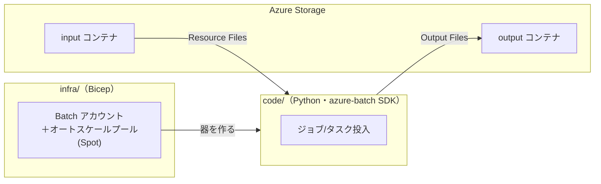
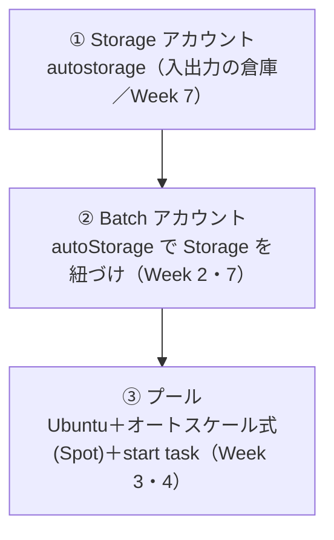
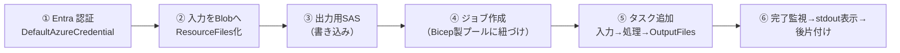
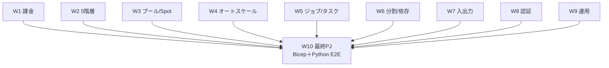
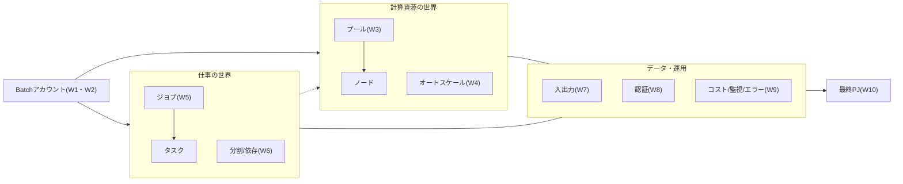

# Week 10 — 最終プロジェクト：Bicep ＋ Python で Batch を E2E 実行する

> **Phase 5b（最終回）** | 学習プラン Week 10 / 10
> 学習目標：全 9 週で学んだ要素を 1 本の動くソリューションに結実させる。**Bicep** で Batch アカウント＋オートスケール付きプール（Spot 併用）を作り、**Python（azure-batch SDK）** でジョブ／タスクを投入し、各タスクが **Blob から入力を取り → 処理し → Blob へ出力する** ところまでを E2E で通し、最後に**後片付けで課金を止める**

---

## 0. 今週の位置づけ：9 週の集大成

Week 1-9 で Batch の部品を一つずつ学んだ。最終回は、それらを**1 本のパイプライン**に組み上げる。



**役割分担**は Week 2 で学んだ「計算資源の世界」と「仕事の世界」の分離そのもの——**器（プール）は Bicep で宣言的に**、**仕事（ジョブ/タスク）は Python で動的に**投入する。実装は `batch/infra/` と `batch/code/` にある。

---

## 1. infra/：Bicep で器を作る（Week 2・3・4・7）

`infra/main.bicep` が作るのは 3 つ。



要点（各週の回収）：

- **Storage アカウント**：`autoStorage.storageAccountId` で Batch に紐づける（Week 7 の autostorage）。Application Packages を使う場合に備え、ファイアウォール／階層型名前空間は付けない。
- **プールの VM 構成**：Marketplace の Ubuntu 22.04 ＋対応する `nodeAgentSkuId`（**組で指定**／Week 3）。`vmSize` は作成後変更不可なのでパラメータ化。
- **オートスケール式**（Week 4 §5 の定番を Spot 主体にアレンジ）：

  ```text
  $samples = $PendingTasks.GetSamplePercent(TimeInterval_Minute * 5);
  $tasks = $samples < 70 ? 0 : avg($PendingTasks.GetSample(TimeInterval_Minute * 5));
  $TargetLowPriorityNodes = min(<maxNodes>, $tasks);
  $TargetDedicatedNodes = 0;
  $NodeDeallocationOption = taskcompletion;
  ```

  「保留タスクの直近 5 分平均で **Spot ノード**を増減、標本が 70% 未満なら 0 台、縮小時は走っているタスクを終わらせてから（`taskcompletion`）」——Week 4 の読む変数／書く変数／`GetSamplePercent` の信頼チェック／`$NodeDeallocationOption` がそのまま効いている。Dedicated は 0 でコスト最小（Week 9）。
- **start task**：ノード起動時に共有ディレクトリへ印を書くだけの例（Week 3）。`waitForSuccess: true` で完了を待つ。

> **Bicep の落とし穴（実装メモ）**：オートスケール式に `${maxNodes}` を埋め込むとき、Bicep の**三重引用符（複数行）文字列は補間されない**。パラメータを効かせるには**単一引用符文字列＋改行エスケープ `\n`** を使う（`$PendingTasks` 等の `$` はそのままリテラルとして残る）。`az bicep build` の `no-unused-params` 警告でこのミスに気づける。

### デプロイと検証

```bash
az group create -n rg-batch-e2e -l japaneast
az deployment group create -g rg-batch-e2e -f infra/main.bicep -p infra/main.bicepparam
```

本教材では `az bicep build -f infra/main.bicep` でコンパイル通過を確認済み（ARM 教材 Week9 と同じ検証手順）。出力（`batchAccountUrl`・`storageAccountName`・`poolId`）を次の Python へ渡す。

---

## 2. code/：Python でジョブ／タスクを投入する（Week 5・7・8）

`code/batch_e2e.py` の流れは、Week 2 で見た**基本 6 ステップ**の実装そのもの。



要点（各週の回収）：

- **① 認証**：`DefaultAzureCredential` で **Entra 認証**（Week 8）。共有キーは使わない。ローカルは `az login`、Azure 上はマネージドID を自動利用。
- **② 入力**：`BlobServiceClient` で input コンテナへアップロードし、各 Blob に read SAS を付けて **`ResourceFile`** 化（Week 7）。SAS は**アカウントキーを使わず user delegation key** から発行（Week 8）。
- **③ 出力先**：output コンテナへの **write SAS**（Week 7）。
- **④ ジョブ**：`BatchJobCreateOptions` で作り、`BatchPoolInfo(pool_id=...)` で **Bicep 製プールに紐づけ**（Week 2・5）。
- **⑤ タスク**：各タスクが入力の単語数を数えて `result.txt` を作り、標準出力にも出す。コマンドは**シェルを介さない**ので `/bin/bash -c` で明示（Week 2）。**`OutputFile`** で `result.txt`（成功時＝`TASK_SUCCESS`）と `std*.txt`（完了時＝`TASK_COMPLETION`）を output コンテナへ。`path` にタスク ID を入れて**同名衝突を回避**（Week 7）。
- **⑥ 監視・後片付け**：`list_tasks` で全タスクが `COMPLETED` になるまでポーリング（Week 5・9）。各タスクの `exit_code` と `stdout.txt` を表示（Week 9 の切り分けの起点）。最後にジョブ削除、プールは畳んで**課金停止**（Week 1・9）。

### 実行

```bash
export BATCH_ACCOUNT_URL="https://<batchAccountUrl>"
export STORAGE_ACCOUNT_NAME="<storageAccountName>"
export POOL_ID="e2e-pool"
pip install -r code/requirements.txt
python code/batch_e2e.py
```

本教材では `python -m py_compile` で構文通過を確認済み。実アカウントへの投入はハンズオンとして各自の環境で行う（要 `az login` と RBAC 割り当て）。

---

## 3. 全 10 週の要素が、この 1 本のどこで効くか

最終プロジェクトを通して、全 10 週がどこに現れるかの対応表。

| 週 | 学んだこと | 最終PJでの現れ方 |
|---|---|---|
| **W1** | Batch の正体・課金（本体無料/下地課金） | プールを畳んで課金停止する後片付け |
| **W2** | Account→Pool→Node→Job→Task の 5 階層 | 器(Bicep)と仕事(Python)の分離・6 ステップ実装 |
| **W3** | プール/ノード・Dedicated vs Spot・start task | Bicep の VM 構成・Spot ノード・start task |
| **W4** | オートスケール式・読む/書く変数 | Bicep の autoScale.formula（`$PendingTasks`→`$TargetLowPriorityNodes`） |
| **W5** | ジョブ/タスク・状態・exit code | Python のジョブ/タスク投入・完了監視・exit_code 表示 |
| **W6** | 分割・依存・taskSlotsPerNode | 入力 1 本＝1 タスクの分割（独立＝intrinsically parallel） |
| **W7** | Resource/Output Files・autostorage | 入力=ResourceFile・出力=OutputFile・Storage 紐づけ |
| **W8** | 共有キー vs Entra ID・マネージドID | DefaultAzureCredential・user delegation SAS |
| **W9** | コスト・監視・エラー切り分け | Spot+autoscale でコスト最小・exit_code/stdout で切り分け |
| **W10** | E2E 統合 | 本プロジェクト |



---

## 4. 後片付け（重要：課金を止める）

Week 1・9 の教訓——**ノードは動いている間だけ課金される**。学習が済んだら必ず畳む。

```bash
# ジョブ/プールだけ消す（アカウントは残す）
az batch pool delete --account-name <batch> --account-endpoint <url> --pool-id e2e-pool

# まとめて消す（リソースグループごと）
az group delete -n rg-batch-e2e
```

> `az group delete` は Batch アカウント・Storage・プールをまとめて削除する（ARM のコントロールプレーン操作／Resource Manager 教材）。**やり残した Spot/Dedicated ノードが 1 台でも残っていると課金が続く**ので、最後に Portal でプールが消えたことを確認する。

---

## 5. 全 10 週の振り返り



学び終えて言えるようになったこと：

1. **Batch は「クラスタもスケジューラも自前運用せず、大量の並列計算を流す」ためのサービス**である（W1）。
2. 操作はすべて **Account → Pool → Node → Job → Task** の 5 階層で考える（W2）。
3. **計算資源（プール）は Spot とオートスケールで安く・弾力的に**用意する（W3・4・9）。
4. **仕事（ジョブ/タスク）は分割・依存・リトライ・特別なタスク**で組み立てる（W5・6）。
5. **入出力は Storage 経由**、認証は **Entra ID＋マネージドID で秘密なし**に寄せる（W7・8）。
6. **運用は「不健全ノードも課金される」を軸に、監視とエラー切り分け**で締める（W9）。
7. そして **Bicep＋Python で E2E に組み上げられる**（W10）。

---

## ハンズオン チェックリスト（最終）

- [ ] `az bicep build -f infra/main.bicep` が通ることを確認した
- [ ] `infra/` をリソースグループにデプロイし、Batch アカウント・Storage・プールができたことを Portal で確認した
- [ ] Bicep の出力を環境変数に入れ、`python code/batch_e2e.py` を実行した
- [ ] タスクが `Completed`（exit_code 0）になり、`stdout.txt` に処理結果が出たことを確認した
- [ ] output コンテナに `TaskN/result.txt` と `TaskN/stdout.txt` が保存されたことを確認した
- [ ] オートスケールで Spot ノードが増減する様子を観察した（任意）
- [ ] **後片付け**：プール削除／`az group delete` でノード課金を止めた

---

## 自己チェック（総合）

1. **なぜ器(プール)を Bicep、仕事(ジョブ/タスク)を Python で分けるのか？**
   - キーワード：計算資源の世界と仕事の世界の分離（W2）、宣言的な器 vs 動的な投入
2. **最終PJのオートスケール式は何を見て何を増減するか？**
   - キーワード：`$PendingTasks`（読む）→`$TargetLowPriorityNodes`（書く／Spot）、5 分平均、70% 信頼チェック
3. **入力と出力はどうやってノードの外とやり取りするか？**
   - キーワード：ResourceFiles で Blob→ノード、OutputFiles でノード→Blob、autostorage、SAS/マネージドID
4. **このアプリはなぜ共有キーを使わずに済むか？**
   - キーワード：DefaultAzureCredential で Entra 認証、user delegation key で SAS 発行、秘密なし
5. **学習後に必ずやることは？ なぜか？**
   - キーワード：プールを畳む／リソースグループ削除、ノードは動いている間だけ課金

---

## おわりに

全 10 週、おつかれさまでした。ここまでで **Azure Batch を「大量の並列計算をマネージドに流す道具」として設計・実装・運用できる**土台ができた。次に進むなら——

- **HPC/MPI の本格運用**（W6 で俯瞰した密結合並列の最適化・InfiniBand）
- **Batch を Data Factory 等のワークフローに組み込む**大規模パイプライン
- **コンテナワークロード**（W3 で俯瞰したコンテナ対応プール）の本格活用

いずれも、本教材で固めた 5 階層のオブジェクトモデルと運用の型が土台になる。
