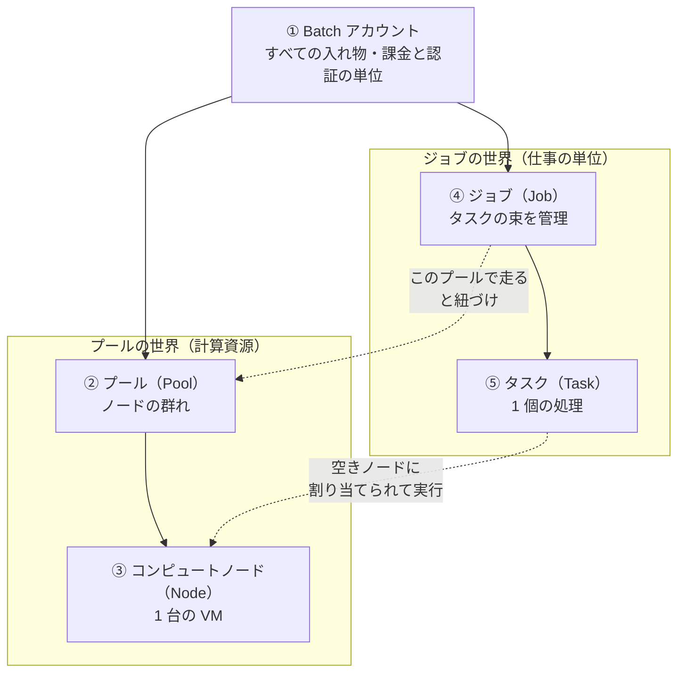
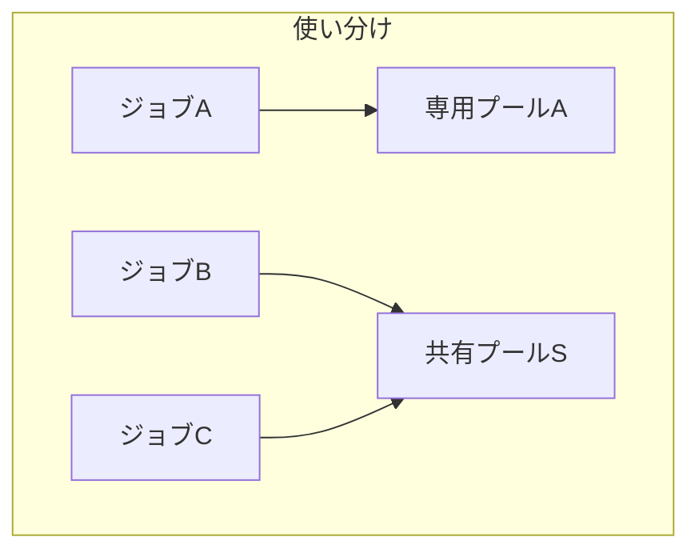
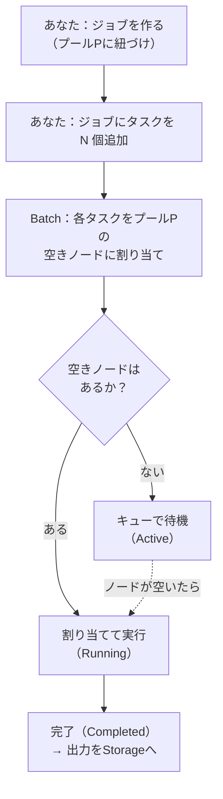
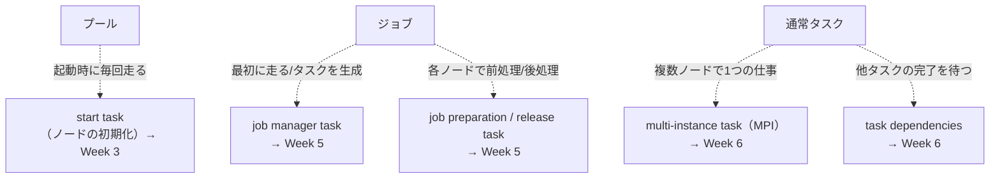
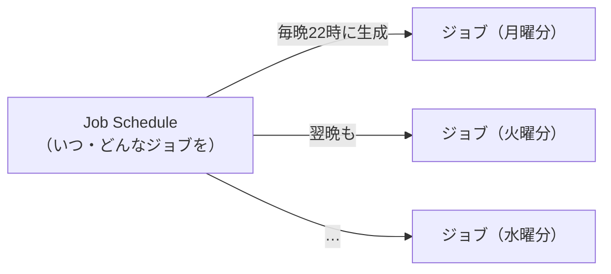
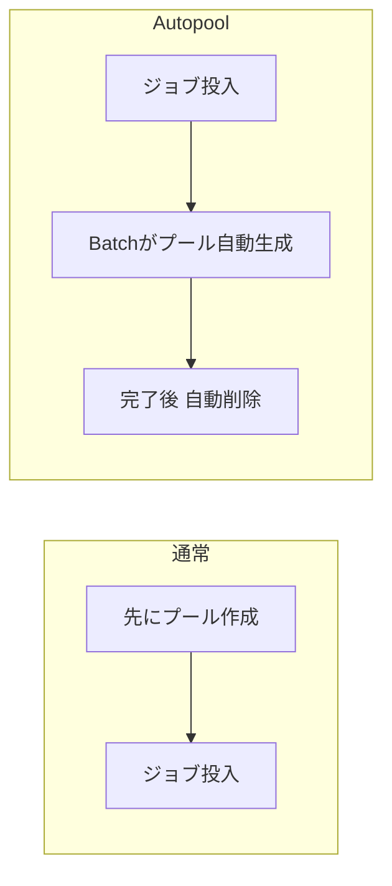
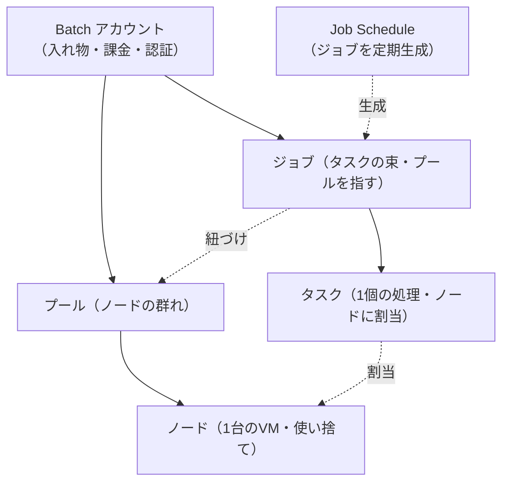

# Week 2 — オブジェクトモデルの全体像：Account → Pool → Node → Job → Task を正式に固定する

> **Phase 1b** | 学習プラン Week 2 / 10
> 学習目標：Batch を構成する 5 つの要素（Batch アカウント／プール／コンピュートノード／ジョブ／タスク）が「**何を表し・何を含み・誰が（あなたか Batch か）作るのか**」を正確に区別でき、ジョブとプールの結びつき、タスクがノードに割り当てられるまでの流れ、そして「繰り返しジョブ（Job Schedule）」「自動生成プール（Autopool）」の位置づけを図で説明できる

---

## 0. 今週の位置づけ

Week 1 では「Batch はクラスタもスケジューラも自前運用せずに大量並列を流すサービス」という**輪郭**と、5 階層（Account → Pool → Node → Job → Task）の**名前**を予告した。今週はこの 5 階層を**正式な地図として固定する**。ここが以降 8 週すべての土台になる。


今週は「**それぞれが何者か・どう繋がるか**」までを扱い、各要素の詳細な設定（VM サイズ選定・オートスケール式・タスクの状態遷移など）は該当週に送る。地図の縮尺で言えば「都市の配置図」を描く週であり、「各建物の間取り」は先の週で描く。

> **初学者向け用語補足：オブジェクトモデル（object model）とは**
> **オブジェクトモデル**＝あるシステムを「どんな種類の"モノ（オブジェクト）"が、どんな**包含関係・参照関係**で結びついて成り立っているか」を表した構造。Batch の場合、「アカウントの中にプールとジョブがあり、プールの中にノードがあり、ジョブの中にタスクがある」という関係そのものが Batch のオブジェクトモデルである。この地図を頭に入れておくと、Portal・CLI・SDK のどの経路で操作しても「今どの階層を触っているか」を見失わずに済む。

---

## 1. 5 階層の全体図

まず全体像を 1 枚で掴む。実線は**包含（〜の中にある）**、点線は**参照（〜を指し示す・割り当てられる）**を表す。



この図の読み方が今週の核心である。

- 左右に **「計算資源の世界（プール／ノード）」** と **「仕事の世界（ジョブ／タスク）」** の 2 つがあり、両方が Batch アカウントの中にある。
- **ジョブはプールを"指す"**（このジョブはこのプールで走る、という紐づけ）。ジョブがプールを"含む"のではない。
- **タスクはノードに"割り当てられて"走る**。タスクがノードを"含む"のでもない。
- つまり「仕事の世界」と「計算資源の世界」は**別々に用意して、実行時に結びつける**。この分離が Batch の設計の要である。

> **なぜ「仕事」と「計算資源」を分けるのか**：同じプール（計算資源）を複数のジョブで使い回せるし、逆にジョブごとに専用プールを立てて終わったら畳むこともできる。仕事と資源を分離しておくことで、「資源は据え置き・仕事だけ次々流す」も「仕事のたびに資源を用意して捨てる」も、どちらも表現できる。この使い分けは Week 3 の「プールとノードのライフタイム」で詳しく扱う。

---

## 2. 5 階層を 1 つずつ固定する

各要素を「**何を表すか／何を含むか／誰が作るか／公式の定義**」で押さえる。

### ① Batch アカウント（Batch account）

| 観点 | 内容 |
|---|---|
| 何を表す | すべてのプール・ジョブ・タスクを収める**最上位の入れ物**。**課金と認証の単位**でもある |
| 何を含む | プール群・ジョブ群（＝以下すべて） |
| 誰が作る | **あなた**（ARM／Portal／CLI で作成。これは Resource Manager 教材で学んだ ARM リソースの作成そのもの） |

Batch を使うにはまずアカウントが要る。ほとんどの Batch ソリューションは、入出力ファイル用に **Azure Storage アカウント**も併せて使う（[Batch service workflow and resources](https://learn.microsoft.com/en-us/azure/batch/batch-service-workflow-features) の Note：「You need a Batch account to use the Batch service. Most Batch solutions also use an associated Azure Storage account for file storage and retrieval.」）。

> **初学者向け用語補足：Batch アカウントと Storage アカウントは別物**
> Batch アカウント＝「プール・ジョブ・タスクを管理する頭脳」。Storage アカウント＝「入力データ・出力結果・実行アプリを置く倉庫」。この 2 つは別々のリソースで、Batch アカウントに Storage アカウントを**紐づけて**使う。なぜ倉庫が要るのかは Week 7（データ入出力）で本格的に扱う。今は「計算の入出力データは Batch の外（Storage）に置く」という役割分担だけ押さえればよい。

### ② プール（Pool）

| 観点 | 内容 |
|---|---|
| 何を表す | アプリを走らせる**ノード（VM）の群れ** |
| 何を含む | コンピュートノード（0 台〜多数） |
| 誰が作る | **あなた**（手動）、または **Batch**（ジョブ投入時に自動生成＝後述の Autopool） |

公式定義はシンプルで、「A pool is the collection of nodes that your application runs on.（プールとは、アプリが実行されるノードの集まり）」（[Nodes and pools in Azure Batch](https://learn.microsoft.com/en-us/azure/batch/nodes-and-pools)）。プールを作るとき指定する主な属性（同ページより）：

- OS とバージョン／各種構成
- **ノードの種別（Dedicated／Spot）と目標台数（target）**
- ノードのサイズ（VM サイズ）
- **オートスケール（自動スケール）ポリシー**
- タスクのスケジューリングポリシー（1 ノードあたり同時タスク数など）
- ノード間通信（communication status）の有無
- **start task**（ノード起動時の初期化）
- **application packages**（アプリの配布）
- VNet／ファイアウォール構成

これらの詳細は Week 3-4 で 1 つずつ扱う。今週は「プールとは**こういう属性を持つノードの群れ**である」という枠だけ掴めばよい。重要な制約が 1 つある——**プールは、それを作成した Batch アカウントの中でしか使えない**（「A pool can only be used by the Batch account in which it was created.」）。

### ③ コンピュートノード（Compute Node）

| 観点 | 内容 |
|---|---|
| 何を表す | プール内の **1 台の VM**。タスクが実際に走る場所 |
| 何を含む | 割り当てられたタスクの実行環境（CPU コア・メモリ・ローカルディスク・標準フォルダ構造・環境変数） |
| 誰が作る | **Batch**（プールの目標台数に合わせて自動で確保・追加・削除する） |

公式定義：「a *compute node* (or *node*) is a virtual machine that processes a portion of your application's workload.（コンピュートノード（ノード）とは、アプリのワークロードの一部を処理する仮想マシン）」。ノードのサイズが、そのノードの CPU コア数・メモリ容量・ローカルファイルシステムのサイズを決める。

ノードの**生き死に**には重要な性質がある（同ページより）。

> Every node that is added to a pool is assigned a unique name and IP address. When a node is removed from a pool, any changes that are made to the operating system or files are lost, and its name and IP address are released for future use. When a node leaves a pool, its lifetime is over.
> （プールに追加された各ノードには一意の名前と IP アドレスが割り当てられる。ノードがプールから削除されると、OS やファイルへの変更はすべて失われ、名前と IP は再利用のため解放される。**ノードがプールを去ると、そのノードの生涯は終わる**）


> **初学者向け用語補足：ノードは「使い捨て」だから状態を残さない**
> ノードは畳まれると中身が消える——だから「ノードのローカルディスクに大事な結果を置きっぱなし」は禁物で、**結果は必ず Storage（外部の倉庫）へ書き出す**（Week 7）。逆に「ノードには毎回同じ初期化を掛ければ同じ環境になる」ようにしておけば、台数を増減しても均質さが保てる。この「毎回の初期化」を担うのが **start task**（Week 3）である。ノードを使い捨て前提で設計するこの考え方は、ステートレス（状態を持たない）設計の一種と言える。

### ④ ジョブ（Job）

| 観点 | 内容 |
|---|---|
| 何を表す | **タスクの集まり**を管理する単位。「どのプールで走らせるか」を指定する |
| 何を含む | タスク群 |
| 誰が作る | **あなた**（クライアントアプリ／SDK／CLI から作成） |

公式定義：「A job is a collection of tasks. It manages how computation is performed by its tasks on the compute nodes in a pool.（ジョブとはタスクの集まりであり、プール内のノード上でタスクがどう計算を行うかを管理する）」。そして決定的に重要なのが次の一文——

> A job specifies the pool in which the work is to be run. You can create a new pool for each job, or use one pool for many jobs.
> （**ジョブは、その仕事を走らせるプールを指定する**。ジョブごとに新しいプールを作ってもよいし、1 つのプールを多数のジョブで使ってもよい）

つまり **1 つのジョブは 1 つのプールに紐づく**が、1 つのプールは複数のジョブに共有され得る（多対一）。



ジョブには他にも、優先度（priority、-1000〜+1000）や制約（constraints）を設定できる。制約の代表は次の 2 つ（詳細は Week 5）：

- **最大実行時間（maximum wallclock time）**：これを超えるとジョブと全タスクが終了させられる
- **タスクの最大リトライ回数（maximum number of task retries）**：失敗したタスクを何回まで再実行するか

### ⑤ タスク（Task）

| 観点 | 内容 |
|---|---|
| 何を表す | ノード上で実行される **1 個の計算単位**（あなたのプログラム／スクリプトの 1 回の実行） |
| 何を含む | コマンドライン・リソースファイル・環境変数・制約・アプリパッケージ等の指定 |
| 誰が作る | **あなた**（ジョブにタスクを追加する）。または Batch の特別なタスク（後述） |

公式定義：「A task is a unit of computation that is associated with a job. It runs on a node. Tasks are assigned to a node for execution, or are queued until a node becomes free.（タスクはジョブに紐づく計算単位で、ノード上で走る。**タスクは実行のためノードに割り当てられるか、ノードが空くまでキューで待つ**）」。

タスク作成時に指定できる主なもの：

- **コマンドライン**：ノード上でアプリ／スクリプトを起動するコマンド。**注意：コマンドラインはシェルを介さず直接実行される**ため、環境変数展開（`$PATH` など）を使いたいなら `/bin/sh -c "..."`（Linux）や `cmd /c ...`（Windows）のように**明示的にシェルを起動する**必要がある（Week 1 のハンズオンで `/bin/bash -c "..."` と書いたのはこのため）
- **リソースファイル（resource files）**：処理対象データ。コマンド実行前に Blob から自動でノードへコピーされる（Week 7）
- **環境変数**・**制約（constraints）**・**アプリパッケージ**・**コンテナイメージ参照**（プールがコンテナ構成のとき）

> **初学者向け用語補足：「コマンドラインはシェルを介さない」の意味**
> 普段ターミナルでコマンドを打つと、裏で bash などの**シェル**が `$PATH`（コマンドの探索パス）や `$HOME` といった環境変数を展開してくれている。ところが Batch のタスクは、指定したコマンドを**シェルを通さず生で実行**する。すると `echo $MY_VAR` の `$MY_VAR` が展開されず文字列のまま渡る、といったズレが起きる。だから環境変数やパス解決に頼るなら、`/bin/sh -c "echo $MY_VAR"` のように**自分でシェルを噛ませる**のが定石。この落とし穴は Week 5・Week 9 のエラー切り分けでも再登場する。

> **初学者向け用語補足：そもそも「シェル（shell）」とは何か**
> **シェル**＝あなたが打ったコマンドの文字列を**解釈して、実際にプログラムを起動してくれる仲介役のプログラム**。代表例は **bash（バッシュ）** や **zsh（ズィーシェル、macOS の既定）**、Windows の `cmd.exe`。あなたと OS の間に立ち、コマンドを渡す**前に下ごしらえ**をしてくれる。
>
> ```mermaid
> flowchart LR
>     U["あなた<br/>echo $HOME と入力"]
>     SH["シェル（bash/zsh）<br/>文字列を解釈・下ごしらえ"]
>     OS["OS<br/>プログラムを実行"]
>     U --> SH --> OS
> ```
>
> | シェルがやる下ごしらえ | 例 |
> |---|---|
> | **環境変数の展開** | `$HOME` → `/Users/you` に置換 |
> | **PATH の解決** | `python` だけで `/usr/bin/python` を探し出す |
> | **ワイルドカード展開** | `*.txt` → 実在するファイル名の一覧に広げる |
> | **パイプ・リダイレクト** | `a \| b`（a の出力を b へ）、`> out.txt`（出力をファイルへ） |
> | **引用符の処理** | `"a b"` を 1 つの引数として扱う |
>
> **名前の由来**：OS の中核（**カーネル**＝kernel＝核）を包む**外殻**として利用者とカーネルの間に立つことから「シェル（殻）」と呼ぶ。あなたはカーネルを直接触らず、殻越しに指示を出している。
>
> Batch のタスクは、この**シェル（と下ごしらえ）を挟まずに**コマンドを直接実行する——だから上の表の恩恵が一切効かない。効かせたいなら `/bin/sh -c "..."` と書いて**自分でシェルを起動する**。ここで **`-c`＝command**（＝「続く文字列を 1 つのコマンドとして解釈して実行せよ」）という意味。Week 1 のハンズオンで `/bin/bash -c "echo Hello..."` と書いたのも、この「自分でシェルを噛ませる」定石そのものだった。

---

## 3. タスクがノードに割り当てられるまで（実行時の結びつき）

「仕事の世界」と「計算資源の世界」が実行時にどう結びつくかを追う。ここが 5 階層の全体像の"動き"の部分である。



- あなたがやるのは「ジョブをプールに紐づけ」「タスクを追加」まで。
- **どのタスクをどのノードに割り当てるかは Batch が自動で決める**（＝自前だと作るはずだったスケジューラの仕事）。
- 空きノードがなければタスクは **Active（キュー待ち）** のまま待ち、ノードが空き次第 **Running** に移る。終われば **Completed**。
- しかも Batch は「プールの全ノードが揃うのを待たず、**個々のノードが用意でき次第そこにタスクを流し始める**」（[Nodes and pools](https://learn.microsoft.com/en-us/azure/batch/nodes-and-pools) の "Pool and compute node lifetime"）。これにより資源の遊びを最小化する。

> タスクの状態（Active / Running / Completed など）の遷移と、失敗時のリトライの詳細は **Week 5** で本格的に扱う。今週は「割り当てか、キュー待ちか」という骨格だけ掴めばよい。

---

## 4. 特別なタスクは「どの階層にくっつくか」だけ先に地図に置く

Batch には、あなたが計算のために足すタスクの他に、サービスが用意する**特別なタスク**がいくつかある。今週はそれぞれの**中身**ではなく、**5 階層のどこにくっつくか**だけを地図に書き込む（詳細は各週へ）。



| 特別なタスク | くっつく階層 | 一言 | 詳しく |
|---|---|---|---|
| **start task** | プール | ノードがプールに参加・再起動するたびに走る初期化 | Week 3 |
| **job manager task** | ジョブ | ジョブの中で最初に走り、タスクを生成・監視する"現場監督" | Week 5 |
| **job preparation / release task** | ジョブ | タスク実行前の準備・実行後の後片付けを各ノードで行う | Week 5 |
| **multi-instance task** | タスク | 複数ノードを束ねて 1 つの仕事を処理（MPI＝密結合並列） | Week 6 |
| **task dependencies** | タスク | 「タスク B は A の完了後に走る」等の依存関係 | Week 6 |

> **なぜ今、中身でなく位置だけ置くのか**：これらは強力だが、いきなり全部を詳しく学ぶと 5 階層の骨格がぼやける。まず「start task はプールに、job manager はジョブに付く」という**貼り付く場所**を地図に刻んでおくと、後の週で詳細を学ぶときに「あの位置の機能だ」と迷わず置ける。

---

## 5. 繰り返しジョブ（Job Schedule）と自動生成プール（Autopool）の俯瞰

最後に、5 階層の"外側"に位置する 2 つの便利機能を俯瞰する。どちらも「作る手間・畳む手間を自動化する」ための仕組みである。

### 5-1. Job Schedule（繰り返しジョブ）

「毎晩このバッチを流す」「1 時間ごとに集計ジョブを走らせる」——こうした**定期実行**を表すのが Job Schedule。

> Job schedules enable you to create recurring jobs within the Batch service. A job schedule specifies when to run jobs and includes the specifications for the jobs to be run.
> （ジョブスケジュールは Batch 内で**繰り返しジョブ**を作れる仕組み。**いつジョブを走らせるか**と、**走らせるジョブの仕様**を定義する）
> — [Jobs and tasks in Azure Batch](https://learn.microsoft.com/en-us/azure/batch/jobs-and-tasks)



スケジュールの有効期間（いつからいつまで有効か）と、その期間中どれくらいの頻度でジョブを生成するかを指定できる。なお、**Job Schedule から生成されるジョブには job manager task が必須**である（ジョブが実体化する前にタスクを定義する唯一の手段だから／Week 5 で扱う）。

> **初学者向け用語補足：Job と Job Schedule の違い**
> **Job**＝1 回分の仕事の束（今夜の分）。**Job Schedule**＝「Job を定期的に生み出す型紙」。Schedule 自体は計算しない。時が来るたびに、型紙から新しい Job（と、その中のタスク）を打ち出す。cron（クーロン＝定期実行の仕組み）で毎晩スクリプトを起動するのに近いが、起動されるのが「ジョブ」である点が Batch 流。

### 5-2. Autopool（自動生成プール）

通常はプールを先に作ってからジョブを流すが、**ジョブ投入時に Batch がプールを自動生成し、ジョブが終わったら自動で消す**こともできる。これが Autopool。

> An autopool is a pool that the Batch service creates when a job is submitted, rather than being created explicitly before the jobs that will run in the pool.
> （Autopool は、プールを事前に明示的に作るのではなく、**ジョブ投入時に Batch が作るプール**。多くの場合、ジョブ完了後に自動削除される設定にする）
> — [Nodes and pools](https://learn.microsoft.com/en-us/azure/batch/nodes-and-pools)



Autopool は「使い捨てのプールを、ジョブのたびに用意して畳む」を自動化する。「据え置きプールにジョブを次々流す」か「ジョブごとに Autopool を立てて捨てる」かは、待ち時間とコストのトレードオフで選ぶ（Week 3 のライフタイム設計、Week 9 のコスト最適化で扱う）。

---

## 6. Week 2 全体の整理



### 重要な用語まとめ

| 用語 | 一言説明 | 誰が作る |
|---|---|---|
| Batch アカウント | 全プール・ジョブを収める入れ物。課金・認証の単位 | あなた（ARM） |
| プール（Pool） | ノードの群れ。作成したアカウント内でのみ使える | あなた／Batch(Autopool) |
| コンピュートノード（Node） | プール内の 1 台の VM。畳むと中身は消える（使い捨て） | Batch |
| ジョブ（Job） | タスクの束。1 つのプールを指す（多対一で共有可） | あなた |
| タスク（Task） | 1 個の処理。空きノードに割当、なければキュー待ち | あなた／特別なタスク |
| Job Schedule | ジョブを定期的に生成する型紙（繰り返しジョブ） | あなた |
| Autopool | ジョブ投入時に Batch が自動生成し、完了後に畳むプール | Batch |

---

## ハンズオン チェックリスト

Week 1 で作った Batch アカウント（未削除なら）を使い、地図と実物を対応づける。

- [ ] Portal で Batch アカウントを開き、左メニューに **Pools** と **Jobs** が別々にあることを確認した（＝「計算資源の世界」と「仕事の世界」の分離）
- [ ] Week 1 で作ったジョブを開き、それが**どのプールに紐づいているか**（Pool ID）を確認した
- [ ] そのジョブのタスクを開き、**どのノード（Node ID）で実行されたか**を確認した（＝タスク→ノードの割当）
- [ ] プールを開き、ノードの一覧とそれぞれの**状態**（Idle／Running など）を確認した
- [ ] （任意）**Job schedules** メニューを開き、「繰り返しジョブ」という項目が存在することだけ目視した
- [ ] 学習が済み、当面使わないならプールを削除してノード課金を止めた

---

## 自己チェック

週末にドキュメントを閉じて答えてみる。

1. **5 階層（Account / Pool / Node / Job / Task）を、包含関係とともに図で描けるか？**
   - キーワード：アカウントの中にプールとジョブ、プールの中にノード、ジョブの中にタスク
2. **ジョブとプールの関係は「1 対 1」か？**
   - キーワード：ジョブはプールを 1 つ指す、1 つのプールは複数ジョブで共有可（多対一）
3. **タスクはどうやってノードに割り当てられるか。空きがないとどうなるか？**
   - キーワード：Batch が自動割当、空きがなければ Active でキュー待ち、空き次第 Running
4. **「ノードがプールを去るとその生涯は終わる」とはどういう意味で、何に気をつけるべきか？**
   - キーワード：畳むと OS・ファイルの変更は消える、結果は Storage へ書き出す、start task で毎回初期化
5. **Job と Job Schedule の違いは？ Autopool とは何か？**
   - キーワード：Job＝1 回分の仕事、Job Schedule＝ジョブを定期生成する型紙、Autopool＝ジョブ投入時に自動生成し完了後に畳むプール

---

## 次週の予告（Week 3）

「計算資源の世界」——**プールとコンピュートノード**を深掘りする：

- VM サイズの選び方（CPU コア・メモリ・GPU/HPC 系サイズ）と「作成後はサイズを変えられない」制約
- ノードの OS／イメージ（Marketplace イメージ・カスタムイメージ・**node agent SKU**）と、コンテナ対応プールの俯瞰
- **Dedicated（専用）ノード vs Spot ノード**——安さと引き換えの"横取り（preemption）"、両者の混在
- ノードのライフサイクル状態と、プール／ノードのライフタイム設計（ジョブごとに立てて畳む vs 据え置き）
- **start task**——ノード起動時の初期化を実際に書く
