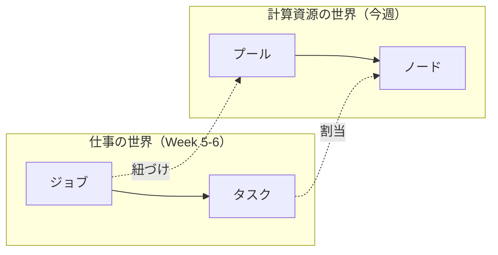
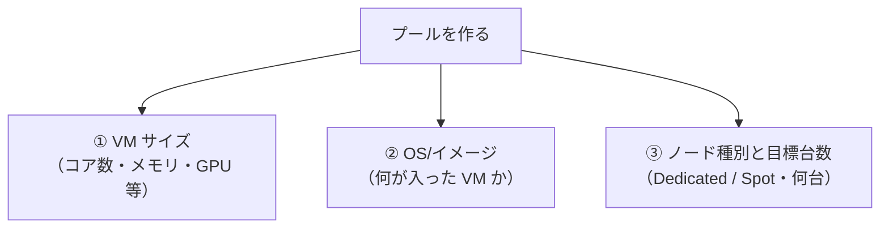
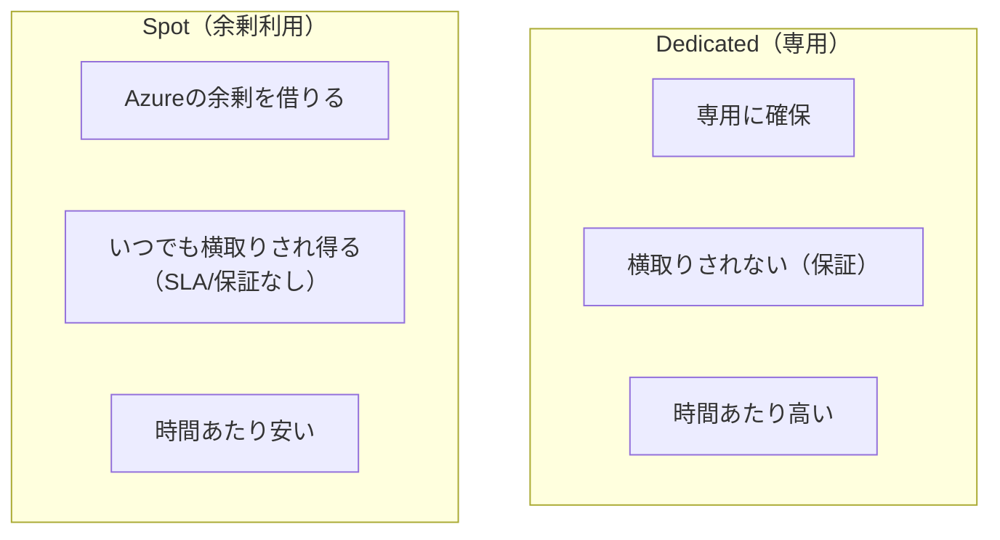
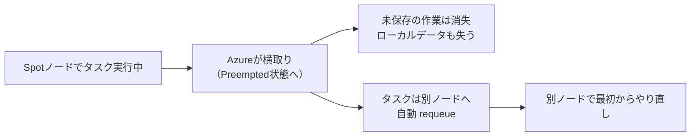
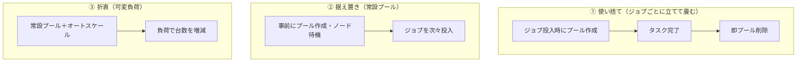
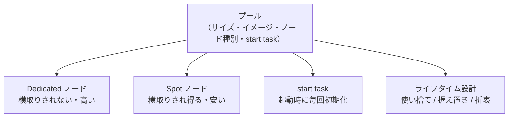

# Week 3 — プールとコンピュートノード：計算資源をどう用意し、どう安く・均質に保つか

> **Phase 2a** | 学習プラン Week 3 / 10
> 学習目標：プールを作るときに決める主要な属性（VM サイズ・OS/イメージ・node agent SKU・ノード種別）を理解し、**Dedicated（専用）ノードと Spot ノードの違い（安さと引き換えの横取り）** を説明でき、ノードのライフサイクル状態を読み解き、**start task** でノードを起動時に初期化する意味を説明できる

---

## 0. 今週の位置づけ

Week 2 で 5 階層の地図（Account → Pool → Node → Job → Task）を固定した。今週からは地図の左半分、**「計算資源の世界」＝プールとコンピュートノード**を深掘りする。



Week 2 で「プールを作るとき指定する主な属性」として OS・ノード種別・サイズ・オートスケール・start task・アプリパッケージ…を列挙した。今週はこのうち **VM サイズ／イメージ／ノード種別（Dedicated vs Spot）／ライフサイクル／start task** を扱う。**オートスケールは Week 4**、**アプリパッケージは Week 7**、**VNet/通信は Week 8** に送る。

> **なぜプールが最重要か**：Week 1 で見たとおり「Batch 本体は無料、課金されるのは下地の VM」。その VM の集まりがプールである。**プールの設計＝コストと性能の設計**であり、Batch を実務で使うときに最初に効いてくるのがここである。

---

## 1. コンピュートノード＝1 台の VM をおさらいする

プールの中身であるノードは、Week 2 で見たとおり **1 台の仮想マシン（VM）**である。改めて公式定義：

> A node is an Azure virtual machine (VM) ... that is dedicated to processing a portion of your application's workload. The size of a node determines the number of CPU cores, memory capacity, and local file system size that is allocated to the node.
> （ノードとは、アプリのワークロードの一部を処理する Azure 仮想マシン。**ノードのサイズが、CPU コア数・メモリ容量・ローカルファイルシステムのサイズを決める**）
> — [Nodes and pools in Azure Batch](https://learn.microsoft.com/en-us/azure/batch/nodes-and-pools)

ノードは OS 環境が対応するあらゆる実行ファイル／スクリプトを走らせられる（Windows なら `.exe`/`.cmd`/`.bat`/PowerShell、Linux ならバイナリ・シェル・Python スクリプトなど）。そして各ノードには、タスクから参照できる**標準のフォルダ構造と環境変数**、アクセス制御用の**ファイアウォール設定**、**リモートアクセス**（Windows は RDP＝Remote Desktop Protocol、Linux は SSH＝Secure Shell）が最初から備わっている（リモートアクセスの詳細は Week 8）。

---

## 2. プールを作るとき最初に決める 3 つ：サイズ・イメージ・ノード種別

プールの属性は多いが、まず外せない 3 つから押さえる。



### 2-1. VM サイズ：作成後は変えられない

Azure Batch では、Azure にあるほぼすべての VM ファミリ・サイズから選べる。汎用サイズのほか、HPC 特化サイズや GPU（Graphics Processing Unit＝画像処理装置、機械学習にも使う）搭載サイズも選べる。ここで**決定的な制約**がある。

> Node VM sizes can only be chosen at the time a pool is created. In other words, once a pool is created, its VM size can't be changed.
> （ノードの VM サイズはプール作成時にしか選べない。**いったんプールを作ると、その VM サイズは変更できない**）
> — 同上

つまり「後から 1 サイズ大きくする」はできず、**別サイズのプールを作り直す**しかない。だからサイズ選定は最初に効く重要な判断になる。

> **初学者向け用語補足：VM サイズの読み方（例：`Standard_D4s_v3`）**
> Azure の VM サイズ名は決まった規則で読める。`Standard_D4s_v3` なら——
> - `Standard`＝提供区分（標準）
> - `D`＝**ファミリ**（D は汎用バランス型。ほかに F＝計算重視、N＝GPU、H＝HPC など）
> - `4`＝**vCPU 数**（＝仮想 CPU コア数。ここでは 4 コア）
> - `s`＝**Premium SSD 対応**（s＝storage、高速ディスクが使える）
> - `v3`＝**世代**（version 3。数字が大きいほど新しい世代）
>
> 学習用は小さいサイズ（コア数の少ないもの）で十分。コア数はそのまま**コア数クォータ**（後述）と課金に効く。

> **初学者向け用語補足：そもそも「CPU コア数」とは何か**
> 上の `4`＝vCPU 数（CPU コア数）が Batch のコスト・性能に直結するので、コアそのものを押さえておく。
>
> - **CPU**＝Central Processing Unit（中央処理装置）＝プログラムの命令を実行するコンピューターの「頭脳」。
> - **コア（core＝核）**＝その CPU の中にある**実際に計算する働き手**。今の CPU は 1 個の中にコアを複数積む（マルチコア）。**コア数＝同時に働ける"手"の数**。
> - **vCPU**＝virtual CPU（仮想 CPU）＝仮想マシンに割り当てられたコア。VM の世界では「コア数」を vCPU 数で数える。
>
> ```mermaid
> flowchart TD
>     CPU["CPU（頭脳）"]
>     CPU --> C1["コア1（働き手）"]
>     CPU --> C2["コア2"]
>     CPU --> C3["コア3"]
>     CPU --> C4["コア4"]
> ```
>
> **1 コアで何ができるか**：1 コア＝1 本の命令の流れを上から順に実行する＝料理でいう**コック 1 人**。1 人が一度に作れるのは基本 1 皿ずつ（切る→炒める→盛る、と順番に）。1 コアの PC でも「音楽を聴きながらブラウザ」ができるのは、OS がごく短時間で作業を切り替えている（**タイムスライシング**）から"同時"に見えるだけで、その瞬間に走る命令の流れは 1 本。
>
> **コアが増えると何がいいか**：コック 4 人なら 4 皿を**本当に同時**に作れる（＝**並列／parallel**）。独立した仕事がたくさんあれば理屈上コア数ぶん速くなる。ただし **1 皿を 4 人がかりで 4 倍速にはならない**——手順に依存関係がある仕事は人数を増やしても限界がある。**"分けられる仕事"でこそコア増が効く**のがポイントで、これは Week 1 の **intrinsically parallel（独立した仕事を大量に並べる）** がコア増と相性抜群、という話に直結する。
>
> **Batch での意味**：
> - **1 ノード（VM）のコア数** → そのノードで**同時に走らせられるタスク数**の上限に効く（既定は 1 タスク/ノードだが、多コアなら複数同時も設定可。Week 4・Week 6）。
> - **プール全体のコア数**（＝ノード数 × 1 ノードのコア数） → **プール全体の並列度**＝一度にさばけるタスク総数の目安。`D4s_v3`（4 コア）を 10 台なら計 40 コア＝最大 40 タスク並列。
> - **コアクォータ**（次の補足）は「ノード数」ではなく**コア数**で決まる。大きいサイズ（多コア）ほど少ない台数で枠を使い切る。
>
> ざっくり：**コア＝働き手の数／1 コア＝一度に 1 仕事／コアを増やす＝独立した仕事を同時にこなせる**。

> **初学者向け用語補足：クォータ（quota）とは**
> **クォータ**＝「使ってよい上限枠」。Batch アカウントには既定で**コア数（＝ノード数に対応）の上限**が設けられている。目標台数を指定してもプールが目標に届かない場合、このコアクォータに引っかかっているのが典型的な原因（引き上げは申請制）。「10 台立てたのに 5 台で止まる」ときはまずクォータを疑う。

### 2-2. OS とイメージ、そして node agent SKU

プールのノードをどんな VM から作るかは **Virtual Machine Configuration** で指定する。ここで 2 つを組で指定する。

- **VM イメージ参照（image reference）**：どの OS イメージから VM を作るか。選択肢は 3 系統——
  1. **Marketplace イメージ**：Azure Marketplace の既製イメージ（例：Ubuntu Server、Windows Server）
  2. **カスタムイメージ**：自分で用意した VM イメージ（Azure Compute Gallery 経由）。必要なアプリを焼き込んでおける
  3. **コンテナ対応イメージ**：Docker コンテナでタスクを走らせるための構成（後述）
- **node agent SKU（`nodeAgentSkuId`）**：そのイメージの OS に合った **Batch ノードエージェント**を指定する

> **初学者向け用語補足：node agent（ノードエージェント）と SKU とは**
> **Batch node agent**＝各ノード上で動く**小さな常駐プログラム**で、ノードと Batch サービスの間の**指令のやり取り（command-and-control）**を担う。「このタスクを起動せよ」「状態を報告せよ」といった Batch からの指示を、ノード上で実際に実行する"現場担当"。OS ごとに実装が違うため、その識別子を **SKU** と呼ぶ（例：`batch.node.ubuntu 24.04`）。
> **SKU（Stock Keeping Unit、エス・ケー・ユー）**＝もとは小売の「在庫管理単位＝商品の型番」を指す言葉。IT では「選べる構成の型番・区分」の意味で広く使われる。ここでは「どの OS 向けのノードエージェントか」を表す型番、と捉えればよい。イメージ（例：Ubuntu 24.04）と SKU（`batch.node.ubuntu 24.04`）は**対応する組**で指定する。

> **初学者向け用語補足：コンテナ対応プールとは（俯瞰）**
> 通常のタスクは「ノードの OS の上で直接プログラムを実行」する。これに対し**コンテナ対応プール**では、タスクを **Docker コンテナ**（アプリと依存物を丸ごと箱詰めした実行単位）の中で走らせられる。Docker〈ドッカー〉対応イメージでプールを作り、タスクにコンテナイメージ（Docker Hub や private registry のもの）を参照させる。「実行環境をイメージごと固定したい」ときに便利だが、本教材では俯瞰に留める（詳細は公式 [Run Docker container applications on Azure Batch](https://learn.microsoft.com/en-us/azure/batch/nodes-and-pools)）。

### 2-3. ノード種別：Dedicated と Spot

そして今週の山場が**ノード種別**。プールには 2 種類のノードを置け、それぞれに**目標台数（target）**を指定する。

> - **Dedicated nodes.** Dedicated compute nodes are reserved for your workloads. They're typically more expensive than Spot nodes, but they're guaranteed to never be preempted.
> - **Spot nodes.** Spot nodes take advantage of surplus capacity in Azure to run your Batch workloads. Spot nodes are less expensive per hour than dedicated nodes...
> （**Dedicated ノード**＝あなたのワークロード専用に確保され、Spot より高いが**決して横取りされない**ことが保証される。**Spot ノード**＝Azure の余剰キャパシティを使い、Dedicated より時間あたり安い）
> — 同上

これは次節でじっくり扱う。ここでは「**同じプールに Dedicated と Spot を混在でき、それぞれ別々に目標台数を持てる**」という枠だけ押さえる。

> **初学者向け用語補足：「target（目標）」であって「確約」ではない**
> ノード台数は **target（目標）** と呼ばれる。「5 台」と指定しても必ず 5 台になるとは限らない——コアクォータに達したり、オートスケールの上限に引っかかったり、Spot の余剰が足りなかったりすると、目標未満で止まる。「指定＝命令」ではなく「そこを目指して Batch が努力する値」と理解する。

---

## 3. Dedicated vs Spot：安さと引き換えの「横取り（preemption）」

Spot ノードは Batch のコスト最適化の主役なので、仕組みを正確に押さえる。

### 3-1. Spot ノードとは

> Spot VMs take advantage of surplus capacity in Azure. ... The tradeoff for using Spot VMs is that these VMs have no SLA and no availability guarantees. Spot VMs can be preempted at any time, including immediately upon VM creation.
> （Spot VM は Azure の**余剰キャパシティ**を使う。トレードオフは、**SLA も可用性保証もない**こと。Spot VM は**作成直後を含め、いつでも横取り（preempt）され得る**）
> — [Run Batch workloads on cost-effective Spot VMs](https://learn.microsoft.com/en-us/azure/batch/batch-spot-vms)



> **初学者向け用語補足：SLA / preemption / 余剰キャパシティ**
> - **SLA**＝Service Level Agreement（Service＝サービス／Level＝水準／Agreement＝合意）＝「これだけの可用性を保証します」という提供者の約束。Spot には**この約束がない**。
> - **preemption（プリエンプション＝横取り・先取り）**＝Azure が「その VM のキャパシティを他の用途に返してほしい」と判断したとき、**あなたの Spot ノードを強制的に取り上げる**こと。日本語では「エビクション（eviction＝立ち退き）」とも。
> - **余剰キャパシティ（surplus capacity）**＝Azure のデータセンターで、今たまたま誰にも使われていない空き計算資源。Spot はこの"空き"を割安で借りる仕組みなので、空きが減れば返さねばならない（＝横取り）。

### 3-2. 横取りされると何が起きるか

ここが実務で最も重要。横取り時の Batch の挙動は公式に明記されている。

> If a preemption occurs, the Spot compute node will be evicted and all work that wasn't appropriately checkpointed will be lost. ... The running Batch task that was interrupted due to preemption will be automatically requeued for execution by a different compute node.
> （横取りが起きると Spot ノードは**立ち退き（evict）**となり、**適切にチェックポイントされていない作業はすべて失われる**。横取りで中断された実行中タスクは、**自動的に別ノードへ再キュー（requeue）される**）
> — 同上



つまり **Batch がタスクの再実行は面倒みてくれる**が、**そのタスクが途中まで進めた計算は（保存していなければ）ゼロからやり直し**になる。だからこそ——

- **短いタスクほど Spot 向き**（横取りされてもやり直しが軽い）
- **長いタスクは checkpoint（途中経過の保存）を実装**すると被害を減らせる
- **長時間の MPI ジョブ（複数 VM を束ねる密結合）は Spot に不向き**——1 台横取りされるとジョブ全体をやり直しになりかねない（MPI は Week 6）

なお、横取りされた VM は Azure により**復元が試みられることがあるが、横取り後 48 時間以内の best-effort（最善努力）で、成功は保証されない**。また Batch の Spot は**上限価格（max price）の設定や価格ベースの立ち退きはできず、立ち退きは"キャパシティ都合"のみ**で起きる。

> **初学者向け用語補足：checkpoint（チェックポイント）とは**
> **チェックポイント**＝長い処理の途中で「ここまでの計算結果」を定期的に外部（Storage 等）に保存しておくこと。ゲームのセーブポイントと同じ発想。横取りで中断→別ノードでやり直しになっても、直近のチェックポイントから再開できれば、最初からやり直さずに済む。チェックポイントの実装は**利用者側の責任**（Batch は自動ではやってくれない）。

### 3-3. 混在の 3 パターン

Spot の"消えるリスク"を、Dedicated と組み合わせて和らげる定石が 3 つある。

| 構成 | 中身 | 向くケース |
|---|---|---|
| **Spot のみ** | 全ノード Spot。最も安い | 完了時刻に融通が利き、消えても平気なワークロード |
| **Spot ＋ 固定 Dedicated** | 一定数の Dedicated を土台に、Spot を上乗せ | 「最低限これだけは常に進めたい」土台を確保しつつ安く回す |
| **Dedicated と Spot の動的ミックス** | Spot 優先で使い、足りなければ Dedicated を増やす | 可用性とコストのバランスを自動で取りたい（Week 4 のオートスケールと組む） |

> **初学者向け用語補足：Spot の別名「low-priority」——API に残る旧称**
> Spot ノードは、以前は **low-priority（低優先度）ノード**と呼ばれていた。今のドキュメントは「Spot」で統一しているが、**API やコマンドのプロパティ名には旧称が残っている**ので混乱しないこと。
> - CLI/SDK の台数指定：`--target-low-priority-nodes` / `TargetLowPriorityNodes`（＝Spot の目標台数）
> - オートスケール変数：`$TargetLowPriorityNodes` / `$CurrentLowPriorityNodes`（Week 4）
> - タスクが自分の乗るノード種別を知る環境変数：`AZ_BATCH_NODE_IS_DEDICATED`（Dedicated なら true）
>
> 「low-priority と書いてあったら Spot のことだ」と読み替えられれば十分。なお **Spot は Dedicated と別枠の vCPU クォータ**を持ち、その枠は Dedicated より大きい（安いぶん多く使わせてくれる）。

---

## 4. ノードのライフサイクル状態を読む

プールを開くと各ノードに**状態（state）**が表示される。トラブル時の第一の手がかりになるので、主要な状態を押さえる。


| 状態 | 意味 |
|---|---|
| **Creating** | Batch が VM を確保している最中 |
| **Starting** | Batch サービスがノードを起動している最中 |
| **WaitingForStartTask** | start task を実行中で、その完了を待っている（`waitForSuccess` 有効時） |
| **StartTaskFailed** | start task がリトライ尽きても失敗した状態（`waitForSuccess` 有効時）。**このノードはタスクを実行できない** |
| **Idle** | 空いていて、いつでもタスクを割り当てられる状態 |
| **Running** | start task 以外のタスクを 1 個以上実行中 |
| **Rebooting / Reimaging** | 再起動中／再イメージ中 |
| **LeavingPool** | プールから抜けつつある（手動削除・縮小・オートスケールでの減少） |
| **Preempted** | Spot ノードが Azure に横取りされた状態。余剰が戻れば再初期化されることがある |
| **Unusable** | Batch がタスクを走らせられない状態（構成ミス・NSG 設定ミスなど）。再起動で Idle に戻ることもある |
| **Offline** | Batch がタスクをスケジュールしない状態 |

（出典：[Count states for tasks and nodes](https://learn.microsoft.com/en-us/azure/batch/batch-get-resource-counts)、[Pool and node errors](https://learn.microsoft.com/en-us/azure/batch/batch-pool-node-error-checking)、[Nodes and pools](https://learn.microsoft.com/en-us/azure/batch/nodes-and-pools)）

> **初学者向け用語補足：`Unusable` と `StartTaskFailed` はトラブルのサイン**
> ノードが **Idle にならず `Unusable` や `StartTaskFailed` で止まっている**なら、それは「計算以前にノードの準備でつまずいている」合図。前者は構成・ネットワーク（NSG＝Network Security Group＝ネットワークセキュリティグループ、通信を許可/拒否するルール）の設定ミスが典型、後者は start task の失敗が原因。Week 9 のエラー切り分けでは、まずこの**ノード状態**を見るところから始める。

---

## 5. プール／ノードのライフタイム設計：立てて畳むか、据え置くか

Week 2 で「ジョブごとに専用プール」も「1 プールを多ジョブで共有」もできると学んだ。これを**時間軸**で設計するのが今節。両極端と、その中間をとる**折衷（せっちゅう）**型がある（折衷＝異なる 2 つの良いところを取り合わせて中間を狙うこと。例：和洋折衷）。



| 型 | 利点 | 欠点 |
|---|---|---|
| **① 使い捨て** | 使うときだけ確保するので**無駄がなくコスト最小**（Autopool が自動化） | ノード確保を待つぶん**ジョブ開始が遅い** |
| **② 据え置き** | ノードが待機済みなので**ジョブが即開始** | 遊休ノードにも**課金され続ける** |
| **③ 折衷（推奨されがち）** | 常設プールにオートスケールを掛け、負荷に応じて増減。バランス型 | 設計がやや複雑（Week 4） |

ここで Week 1 の教訓が効く——**遊んでいるノードにも課金される**ので、「使い終わったら畳む」を徹底する。公式も明言：

> To maximize compute resource utilization, set the target number of nodes to zero at the end of a job, but allow running tasks to finish.
> （計算資源の利用効率を最大化するには、**ジョブ終了時に目標ノード数を 0 にする**。ただし実行中タスクは完了させる）
> — [Nodes and pools](https://learn.microsoft.com/en-us/azure/batch/nodes-and-pools)

なお Batch は「プールの全ノードが揃うのを待たず、**用意できたノードから順にタスクを流し始める**」（Week 2 §3 で既出）。だから①使い捨て型でも、全台起動を待たずに走り出せる。

---

## 6. start task：ノードを起動時に毎回そろえる

ノードは**使い捨て**（Week 2）——畳めば中身が消え、増やせば真っさらな VM が加わる。ならば「増えたノードにも、毎回同じ初期化を掛ける」仕組みが要る。それが **start task**。

> By associating a start task with a pool, you can prepare the operating environment of its nodes. For example, you can perform actions such as installing the applications that your tasks run, or starting background processes. The start task runs every time a node starts, for as long as it remains in the pool.
> （start task をプールに関連づけると、ノードの動作環境を準備できる。例：タスクが使うアプリのインストール、バックグラウンドプロセスの起動。**start task はノードが起動するたびに毎回走る**——プールに居る限り、初回参加時も、再起動・再イメージ時も）
> — [Jobs and tasks in Azure Batch](https://learn.microsoft.com/en-us/azure/batch/jobs-and-tasks)


start task の効きどころは、**「ノードを増やす＝目標台数を上げるだけ」で新ノードが自動的に同じ環境になる**点にある。公式いわく「increasing the number of nodes in a pool is as simple as specifying the new target node count（ノードを増やすのは新しい目標台数を指定するだけで済む）」。start task が新ノードを設定し、受け入れ可能な状態にしてくれる。

- start task も通常のタスク同様、**リソースファイル**（Storage 上のアプリ本体・依存物）と**コマンドライン**を指定できる。Batch がまずファイルをノードへコピーし、次にコマンドを実行する。
- 通常は **start task の完了を待ってからノードを「タスク割当可」とみなす**（`waitForSuccess`）。待つ間はノードが `WaitingForStartTask` 状態になる。
- **start task が失敗すると、ノードは `StartTaskFailed` になりタスクを割り当てられない**（リソースファイルのコピー失敗や、コマンドが 0 以外の終了コードを返した場合）。
- 既存プールの start task を追加・変更したら、**ノードを再起動**しないと反映されない。

> **初学者向け用語補足：exit code（終了コード）と「0 は成功」**
> **exit code（終了コード／戻り値）**＝プログラムが終了時に OS へ返す整数。慣習として **`0`＝成功、`0` 以外＝失敗**を意味する。start task のコマンドが `0` 以外で終わると Batch は「初期化に失敗した」と判断し、そのノードを `StartTaskFailed` にする。この「0＝成功」の約束は、Week 9 のタスク失敗の切り分けでも中心的な手がかりになる。

> **start task が大きくなりすぎるとき**：start task には（リソースファイルと環境変数を含む）合計サイズの上限がある。大きくなる場合は、**アプリパッケージ**（Week 7）でアプリ／データを配る、または zip 化してリソースファイルにしノード上で展開する、という 2 つの回避策がある。

---

## 7. Week 3 全体の整理



### 重要な用語まとめ

| 用語 | 一言説明 |
|---|---|
| VM サイズ | ノードの CPU/メモリ/ディスクを決める。**作成後は変更不可**（作り直し） |
| VM イメージ／node agent SKU | どの OS の VM か（Marketplace/カスタム/コンテナ）＋対応するノードエージェント型番 |
| Dedicated ノード | 専用確保・横取りされない・高い |
| Spot ノード | 余剰利用・いつでも横取りされ得る・安い（旧称 low-priority） |
| preemption（横取り） | Azure が Spot を強制回収すること。実行中タスクは別ノードへ自動 requeue、未保存の作業は消失 |
| checkpoint | 途中経過を外部保存し、やり直しの被害を減らす（利用者責任） |
| ノード状態 | Creating/Starting/WaitingForStartTask/Idle/Running/Preempted/Unusable/StartTaskFailed 等 |
| start task | ノード起動時に毎回走る初期化タスク。失敗すると StartTaskFailed |
| ライフタイム設計 | 使い捨て（コスト最小・開始遅い）／据え置き（即開始・遊休課金）／折衷（オートスケール） |

---

## ハンズオン チェックリスト

Week 1 のプールを一度削除し、種別を意識して作り直してみる（少台数で）。

- [ ] プール作成画面で **VM サイズ**を選ぶ欄を確認し、小さいサイズ（例：`Standard_A1_v2` 相当）を選んだ
- [ ] **イメージ**（例：Ubuntu Server）と、それに対応する **node agent SKU** が組で指定されることを確認した
- [ ] **Dedicated ノード**と **Spot（low-priority）ノード**の目標台数を**別々に**指定できることを確認した（例：Dedicated 1・Spot 1）
- [ ] ノードが `Creating → Starting →（start task があれば WaitingForStartTask）→ Idle` と状態遷移するのを観察した
- [ ]（任意）簡単な **start task**（例：`/bin/sh -c "echo start-task ran > $AZ_BATCH_NODE_SHARED_DIR/ok.txt"`）を設定し、ノードが Idle になるまで待った
- [ ] 観察が済んだら**プールを削除**してノード課金を止めた

---

## 自己チェック

週末にドキュメントを閉じて答えてみる。

1. **VM サイズについて、プール作成後にできないことは何か？**
   - キーワード：サイズ変更不可、別サイズは作り直し
2. **Dedicated ノードと Spot ノードの違いを、価格と横取りの観点で言えるか？**
   - キーワード：Dedicated＝高い・横取りされない、Spot＝安い・いつでも横取りされ得る・SLA なし
3. **Spot ノードが横取りされたとき、タスクと途中経過はどうなるか？**
   - キーワード：タスクは別ノードへ自動 requeue、未保存（未 checkpoint）の作業は消失、ローカルデータも失う
4. **ノードが `Idle` にならず `StartTaskFailed` や `Unusable` の場合、何を疑うか？**
   - キーワード：start task の失敗（exit code 0 以外・リソースファイルコピー失敗）、構成/NSG のミス
5. **start task は何のためにあり、いつ走るか？**
   - キーワード：ノードの起動時に毎回、アプリ導入・環境準備、増台しても均質、失敗するとタスク割当不可

---

## 次週の予告（Week 4）

プールの台数を**負荷に応じて自動で増減**させる——**オートスケール**を学ぶ：

- スケール式（autoscale formula）の書き方と、Batch が定期評価して台数を決める仕組み
- 組み込み変数：`$PendingTasks`・`$RunningTasks`・`$ActiveTasks`・`$TargetDedicatedNodes`・`$TargetLowPriorityNodes` など
- メトリクスの 3 分類（時間・リソース・タスク）と評価間隔
- 台数を減らすときの実行中タスクの扱い（node deallocation option）
- 手動スケール（Resize）との対比と、「ジョブ終了時に 0 台へ」の実践
