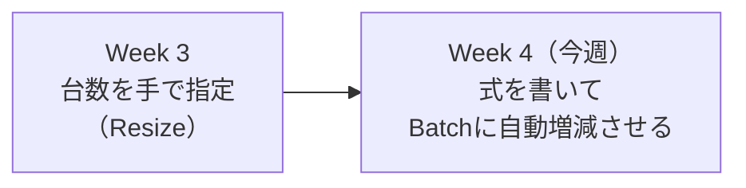
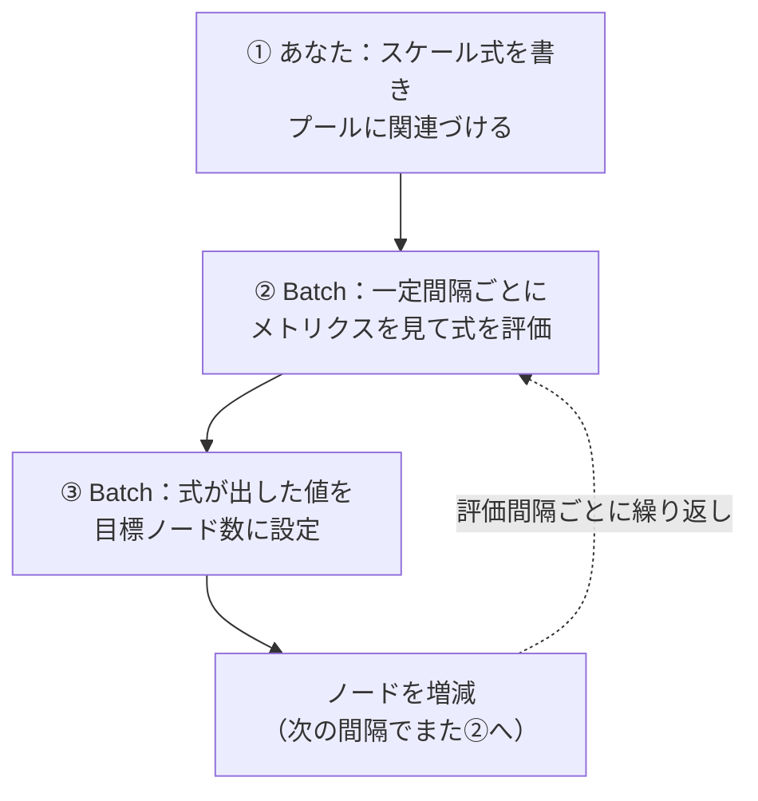
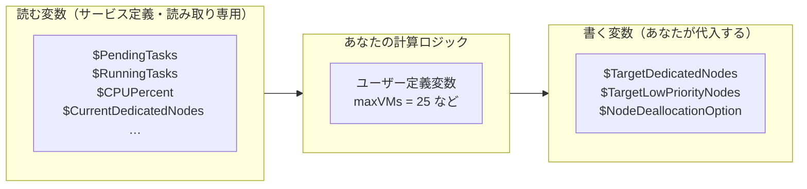
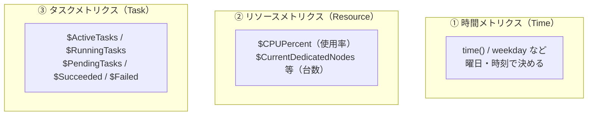
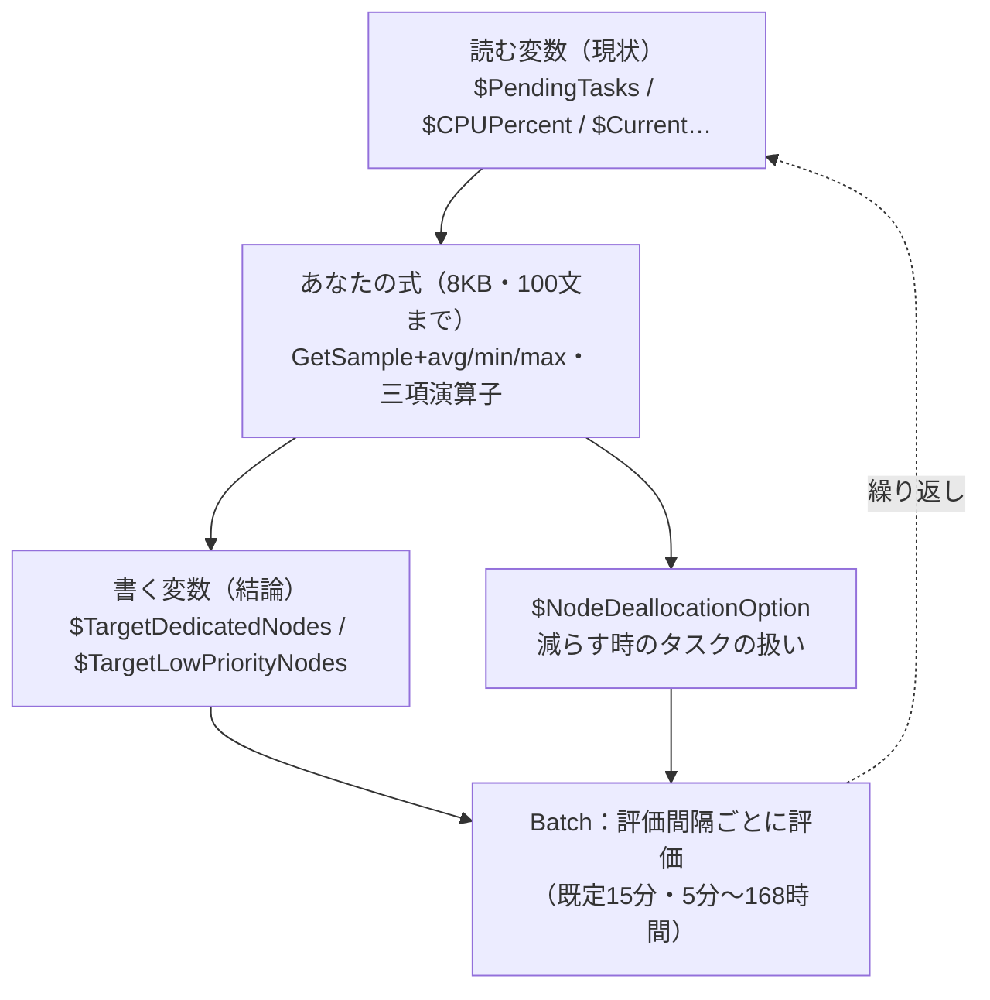

# Week 4 — オートスケール：ノード数（＝コア総量）を負荷に応じて自動で増減させる

> **Phase 2b** | 学習プラン Week 4 / 10
> 学習目標：オートスケール式（autoscale formula）が「Batch によって定期評価され、次の間隔の目標ノード数を決める文字列」であることを理解し、**読む変数（`$PendingTasks` など）と書く変数（`$TargetDedicatedNodes` など）**を区別でき、メトリクスの 3 分類・評価間隔・ノード削除時の実行中タスクの扱い（`$NodeDeallocationOption`）を説明でき、簡単なスケール式を読める

---

## 0. 今週の位置づけ

Week 3 で「プールの台数（target）」を**手で**指定した。だが実務では負荷は時々刻々変わる——昼はジョブが殺到し、夜は空になる。そのたびに人が台数を調整するのは非現実的だ。そこで **Batch に台数を自動で増減させる**のが今週の **オートスケール（automatic scaling）**。



Week 3 の核心「**コア＝働き手、ノードを増やす＝並列度が上がる、ただし遊休ノードにも課金**」がそのまま効く。オートスケールは「**仕事が溜まったら働き手を増やし、捌けたら減らして 0 に近づける**」を自動化する仕組みで、Week 1 で見た「Batch のコスト最適化の武器」の中心である。

> **手動スケール（Resize）との対比**：Week 3 の `az batch pool resize`（目標台数を直接セット）は「今、この台数にしろ」という一回きりの命令。オートスケールは「**こういうルールで、これからずっと自分で決めろ**」という委任。前者は静的、後者は動的。

---

## 1. オートスケールの全体像：式を書く → Batch が定期評価 → 目標台数を更新

仕組みは 3 ステップのループである。



公式の定義：

> To enable automatic scaling on a pool of compute nodes, you associate the pool with an *autoscale formula* that you define. The Batch service uses the autoscale formula to determine how many nodes are needed to execute your workload. ... Batch periodically reviews service metrics data and uses it to adjust the number of nodes in the pool based on your formula and at an interval that you define.
> （オートスケールを有効にするには、プールに**自分で定義したオートスケール式**を関連づける。Batch はその式で必要なノード数を判断し、**サービスのメトリクスを定期的に見て、あなたの式に基づき、あなたが定めた間隔で**ノード数を調整する）
> — [Autoscale compute nodes in an Azure Batch pool](https://learn.microsoft.com/en-us/azure/batch/batch-automatic-scaling)

ここで**重要な発想の転換**がある。オートスケール式は「増やせ・減らせ」という**命令の列ではない**。「**次の間隔で目標台数は何台であるべきか**」を計算して**変数に代入する式**である。あなたは"望ましい状態"を計算し、そこへ寄せるのは Batch がやる——Resource Manager 教材で学んだ**宣言型（declarative）**の考え方が、ここでも生きている。

---

## 2. スケール式の正体：読む変数と書く変数

オートスケール式は**文字列**で、次の制約を持つ（公式より）。

- 1 つ以上の**文（statement）**をセミコロン `;` で区切って並べる
- 最大 **8 KB**、最大 **100 文**まで
- 改行・コメントを含められる

そして式の中で使う変数には、性質の異なる 2 種類がある。**この区別が今週で一番大事**。



### 2-1. 読む変数（サービス定義・読み取り専用）＝「今どうなっているか」

Batch が現状を教えてくれる読み取り専用の変数。代表的なもの（[同ページ](https://learn.microsoft.com/en-us/azure/batch/batch-automatic-scaling) より）：

| 変数 | 意味 |
|---|---|
| `$ActiveTasks` | 実行準備ができていて**まだ実行されていない**タスク数（依存が満たされたもののみ） |
| `$RunningTasks` | **実行中**のタスク数 |
| `$PendingTasks` | `$ActiveTasks` ＋ `$RunningTasks`（＝待ち＋実行中の合計） |
| `$SucceededTasks` / `$FailedTasks` | 成功／失敗したタスク数 |
| `$CPUPercent` | CPU 使用率の平均 |
| `$CurrentDedicatedNodes` | 現在の Dedicated ノード数 |
| `$CurrentLowPriorityNodes` | 現在の Spot ノード数（横取り済みも含む） |
| `$PreemptedNodeCount` | 横取り（preempted）状態のノード数 |
| `$UsableNodeCount` | 使用可能なノード数 |

> **`$PendingTasks` と `$RunningTasks` の使い分け**（公式の助言）：「ある時点で**走っている**タスク数で測るなら `$RunningTasks`、**これから走る待ち行列**で測るなら `$ActiveTasks`」。多くの増減は「溜まっている仕事量」で決めたいので、`$PendingTasks`（待ち＋実行中）がよく使われる。

> **初学者向け用語補足：Spot 変数に残る旧称 low-priority**（Week 3 の再確認）
> オートスケールでも Spot の変数名は **low-priority** のまま：`$TargetLowPriorityNodes`（Spot の目標台数）、`$CurrentLowPriorityNodes`（現在の Spot 数）。Week 3 で見た「API に旧称が残る」がここにも現れる。「low-priority＝Spot」と読み替える。

### 2-2. 書く変数（あなたが代入する）＝「どうしたいか」

式の**結論**として、あなたが値を代入する変数。これらへの代入が、次の間隔の Batch の行動を決める。

| 変数 | 何を決めるか |
|---|---|
| `$TargetDedicatedNodes`（別名 `$TargetDedicated`） | Dedicated ノードの目標台数 |
| `$TargetLowPriorityNodes`（別名 `$TargetLowPriority`） | Spot ノードの目標台数 |
| `$NodeDeallocationOption` | ノードを減らすとき、実行中タスクをどう扱うか（§4） |

> これらは Week 3 で「target＝努力目標」と学んだ、まさにその目標値。コアクォータやオートスケール上限に阻まれると目標未満で止まる点も同じ。

### 2-3. ユーザー定義変数

`maxNumberofVMs = 25;` のように**自分で作る変数**。計算を読みやすく分けるために使う。`$` で始まるのがサービス定義変数、`$` なしがユーザー定義変数、と見分けられる。

---

## 3. サンプルとメトリクスの 3 分類：Batch は「30 秒ごとの標本」を渡してくる

読む変数の値は、実は「今この瞬間の 1 個の数字」ではなく、**過去の標本（sample）の集まり**として渡ってくる。ここを理解しないと式が書けない。

> **初学者向け用語補足：sample（サンプル＝標本）とは**
> **sample（標本）**＝ある時点で採取した 1 個の計測値。Batch は task・resource のメトリクスを **30 秒ごとに 1 個**採取して溜めており、式からはこの標本の列を参照する。「過去 15 分の `$PendingTasks`」と言えば、30 秒 × 30 個＝最大 30 標本の列を指す。標本採取から式で使えるようになるまで**約 1 分の遅延**がある（だから直近 1 分ぶんは欠けることがある）。

だから読む変数には、標本を取り出す**メソッド**が付いている。

| メソッド | 何を返すか |
|---|---|
| `GetSample(count)` | 直近 `count` 個の標本。例：`GetSample(1)` は最新 1 個 |
| `GetSample(開始[, 終了][, samplePercent])` | 時間範囲で標本を取る。例：`$CPUPercent.GetSample(TimeInterval_Minute * 5)` ＝直近 5 分 |
| `GetSamplePercent(範囲)` | その範囲で**何％の標本が揃っているか**を返す |
| `GetSamplePeriod()` | 標本の採取周期を返す |

`avg(...)`（平均）・`min(...)`・`max(...)` と組み合わせて「直近 15 分の平均保留タスク数」などを得る。

> **公式の強い注意：`GetSample(1)` だけに頼るな**。「最後の 1 標本をくれ、いつのものでも」という意味になり、古い標本かもしれず、直近の全体像を表さない。**時間範囲（かつ 1 分より古い開始点）で取り、平均を使う**のが定石。

メトリクスは 3 つに分類される（同ページ）。



| 分類 | 何に基づくか | 代表変数 |
|---|---|---|
| **時間（Time）** | 曜日・時刻。「平日昼だけ増やす」等の予測的スケール | `time()`, `.weekday`, `.hour` |
| **リソース（Resource）** | CPU 使用率・帯域・メモリ・ノード数 | `$CPUPercent`, `$CurrentDedicatedNodes`, `$PreemptedNodeCount`, `$UsableNodeCount` |
| **タスク（Task）** | タスクの状態（Active/Running/…）による量 | `$ActiveTasks`, `$RunningTasks`, `$PendingTasks`, `$SucceededTasks`, `$FailedTasks` |

「タスクが溜まったら増やす」はタスクメトリクス、「CPU が張り付いたら増やす」はリソースメトリクス、「毎週月曜だけ増やす」は時間メトリクス、と使い分ける。

---

## 4. ノードを減らすときの実行中タスク：`$NodeDeallocationOption`

オートスケールは増やすだけでなく**減らす**。このとき「まだ走っているタスクをどう扱うか」が問題になる。Week 3 の Spot 横取りと同じ「途中の仕事をどうする？」問題である。これを決めるのが `$NodeDeallocationOption`。

| 値 | 挙動 | 使いどころ |
|---|---|---|
| **`requeue`**（既定） | 実行中タスクを**即中断**し、ジョブのキューに戻して再スケジュール | 目標台数へ**最速**で到達したい。ただし走っていた仕事は無駄になる |
| **`terminate`** | 実行中タスクを**即中断し、キューからも除去**（再実行しない） | もう不要なタスクを止めてよいとき |
| **`taskcompletion`** | 実行中タスクの**完了を待ってから**ノードを外す | タスクの中断・やり直しを避け、**やった仕事を無駄にしたくない**とき（実務で最頻出） |
| **`retaineddata`** | ノード上の**保持データの掃除完了を待ってから**外す | ローカルに保持したデータの後始末が要るとき |

> **初学者向け用語補足：なぜ既定の `requeue` に注意すべきか**
> 既定は「速さ優先」の `requeue`——縮小時に走っていたタスクを問答無用で中断し、やり直しにする。長いタスクだと「あと少しで終わるのに中断→最初から」という無駄が起きる。だから多くのサンプル式が明示的に `$NodeDeallocationOption = taskcompletion;` を置き、「**走っているタスクは終わらせてから減らす**」を選んでいる。これは Week 3 の checkpoint の話（途中の仕事を守る）と同じ動機。

---

## 5. スケール式を読む：公式サンプル

### 5-1. 保留タスク数に応じて増減する定番式

最もよく使う「溜まった仕事量でスケール」の公式サンプル：

```text
startingNumberOfVMs = 1;
maxNumberofVMs = 25;
pendingTaskSamplePercent = $PendingTasks.GetSamplePercent(TimeInterval_Minute * 15);
pendingTaskSamples = pendingTaskSamplePercent < 70 ? startingNumberOfVMs : avg($PendingTasks.GetSample(TimeInterval_Minute * 15));
$TargetDedicatedNodes=min(maxNumberofVMs, pendingTaskSamples);
$NodeDeallocationOption = taskcompletion;
```

1 行ずつ読むとこうなる。

| 行 | 読み方 |
|---|---|
| `startingNumberOfVMs = 1;` | ユーザー定義変数。初期は 1 台 |
| `maxNumberofVMs = 25;` | 上限 25 台（暴走を防ぐキャップ） |
| `pendingTaskSamplePercent = $PendingTasks.GetSamplePercent(... 15);` | 直近 15 分で**保留タスクの標本が何％揃っているか** |
| `pendingTaskSamples = ... < 70 ? startingNumberOfVMs : avg($PendingTasks.GetSample(... 15));` | **標本が 70％未満なら**信頼できないので初期値 1、**揃っていれば**直近 15 分の保留タスク数の**平均** |
| `$TargetDedicatedNodes = min(maxNumberofVMs, pendingTaskSamples);` | 目標台数＝「その平均」と「上限 25」の小さい方 |
| `$NodeDeallocationOption = taskcompletion;` | 減らすときは走っているタスクを終わらせてから |

`? :` は**三項演算子**（`条件 ? 真のとき : 偽のとき`）。「標本が足りなければ安全側（初期値）、足りていれば実測平均」という**データの信頼性チェック**を挟んでいるのがこの式の肝で、公式が `GetSample(1)` 単独を避けよと言う理由がここに表れている。

### 5-2. 曜日で決める（時間メトリクスの最小例）

```text
$TargetDedicatedNodes = (time().weekday == 1 ? 5 : 1);
```

「月曜（weekday == 1）は 5 台、それ以外は 1 台」。CPU もタスク量も見ず、**カレンダーだけ**で決める予測的スケール。定期的な負荷の波が分かっているときに使う。

> **初学者向け用語補足：`TimeInterval_Minute` などの時間定数**
> 式の中の `TimeInterval_Minute` / `TimeInterval_Second` / `TimeInterval_Hour` は Batch が用意する**時間の単位定数**。`TimeInterval_Minute * 15` は「15 分」を表す。`avg(...)`（平均）・`min`・`max` と合わせて「直近 N 分の平均／最小／最大」を組み立てる。

---

## 6. 評価間隔（automatic scaling interval）

式が**どれくらいの頻度で評価されるか**も設定できる。

> By default, the Batch service adjusts a pool's size according to its autoscale formula every 15 minutes. ... The minimum interval is five minutes, and the maximum is 168 hours. If an interval outside this range is specified, the Batch service returns a Bad Request (400) error.
> （既定では **15 分ごと**にプールサイズを調整する。**最小 5 分・最大 168 時間**（＝7 日）。範囲外を指定すると **400 Bad Request** を返す）
> — 同ページ


- 間隔が短いほど**反応は速い**が、標本の遅延（約 1 分）や短期のブレに振り回されやすい。
- 間隔が長いほど**落ち着く**が、急な負荷増への追従が遅れる。
- 評価は「その瞬間の標本」ではなく「あなたの式が参照する時間範囲の標本」に基づくので、**間隔と、式の中の `GetSample` の時間範囲を噛み合わせる**のがコツ（例：15 分間隔なら直近 15 分平均を見る、など）。

> **注意（公式より）**：`$PendingTasks` は内部キューの都合で、削除済みタスクが一時的に数え残ることがある。また **job release task は `$ActiveTasks`/`$PendingTasks` に含まれない**ため、式によっては「release task を走らせるノードが無い」状態になり得る（job release task は Week 5）。

---

## 7. Week 4 全体の整理



### 重要な用語まとめ

| 用語 | 一言説明 |
|---|---|
| オートスケール式 | 「次の間隔の目標台数」を計算して代入する文字列（最大 8KB・100 文・`;` 区切り） |
| 読む変数（サービス定義） | `$PendingTasks`・`$RunningTasks`・`$CPUPercent`・`$CurrentDedicatedNodes` 等の読み取り専用 |
| `$PendingTasks` | `$ActiveTasks`（待ち）＋`$RunningTasks`（実行中）の合計 |
| 書く変数 | `$TargetDedicatedNodes`／`$TargetLowPriorityNodes`／`$NodeDeallocationOption` |
| sample（標本） | 30 秒ごとに採取される計測値。`GetSample`/`GetSamplePercent` で参照、約 1 分遅延 |
| メトリクス 3 分類 | 時間（曜日/時刻）・リソース（CPU/台数）・タスク（Active/Running/…） |
| `$NodeDeallocationOption` | 縮小時のタスク扱い：requeue(既定)/terminate/taskcompletion/retaineddata |
| 評価間隔 | 既定 15 分・最小 5 分・最大 168 時間（範囲外は 400） |

---

## ハンズオン チェックリスト

Week 3 のプールに、オートスケールを掛けてみる（上限は小さく）。

- [ ] プールの **Scale** 設定で「手動（fixed）」と「オートスケール（formula）」の切り替えがあることを確認した
- [ ] §5-1 の定番式を貼り、`maxNumberofVMs` を **2〜3** など小さい値にして有効化した
- [ ] **評価間隔**を 5 分（最小）に設定し、`az batch pool autoscale evaluate` で式の評価結果（目標台数）を確認した
- [ ] ジョブにタスクを数個投入し、`$PendingTasks` が増えて**目標台数が増える**方向に動くのを観察した
- [ ] タスクが捌けたあと、**目標が減って 0 に近づく**のを観察した（`$NodeDeallocationOption = taskcompletion` の効果も）
- [ ] 観察後、オートスケールを無効化するかプールを削除して課金を止めた

---

## 自己チェック

週末にドキュメントを閉じて答えてみる。

1. **オートスケール式は「命令の列」か「代入の式」か？ 何を代入するのか？**
   - キーワード：代入の式、次の間隔の目標台数を計算して `$TargetDedicatedNodes` 等に代入、宣言型
2. **読む変数と書く変数の代表を 2 つずつ挙げ、違いを言えるか？**
   - キーワード：読む＝`$PendingTasks`/`$CPUPercent`（現状・読み取り専用）、書く＝`$TargetDedicatedNodes`/`$TargetLowPriorityNodes`（結論・代入する）
3. **`$PendingTasks` は何と何の合計か？**
   - キーワード：`$ActiveTasks`（待ち）＋`$RunningTasks`（実行中）
4. **`GetSample(1)` だけに頼るなと言われるのはなぜか？**
   - キーワード：古い 1 標本かもしれない、直近の全体像を表さない、時間範囲＋平均を使う
5. **縮小時に走っているタスクを無駄にしたくないとき、`$NodeDeallocationOption` に何を選ぶか？**
   - キーワード：`taskcompletion`（完了を待つ）、既定の `requeue` は即中断で無駄が出る
6. **評価間隔の既定・最小・最大は？**
   - キーワード：既定 15 分、最小 5 分、最大 168 時間（7 日）

---

## 次週の予告（Week 5）

「計算資源の世界」を終え、**「仕事の世界」＝ジョブとタスク**の深掘りに入る：

- タスクの状態遷移（Active → Running → Completed）と、失敗時のリトライ（`maxTaskRetryCount`）
- ジョブの制約（`constraints`）：最大実行時間（maximum wallclock time）など
- 全タスク完了時の自動終了（`onAllTasksComplete` / `terminatejob`）
- 特別なタスクの本命：**Job Manager タスク**（タスクを生成・監視する"現場監督"）、**Job Preparation / Release タスク**（各ノードでの前処理・後片付け）
- Job Schedule から生成されるジョブに Job Manager が必須な理由
