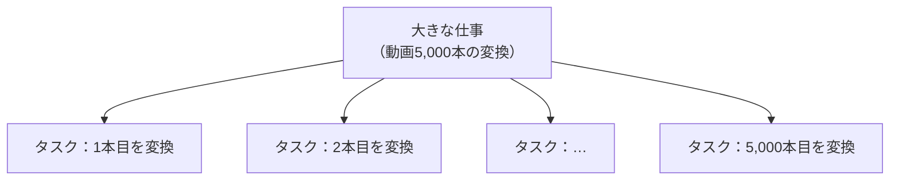
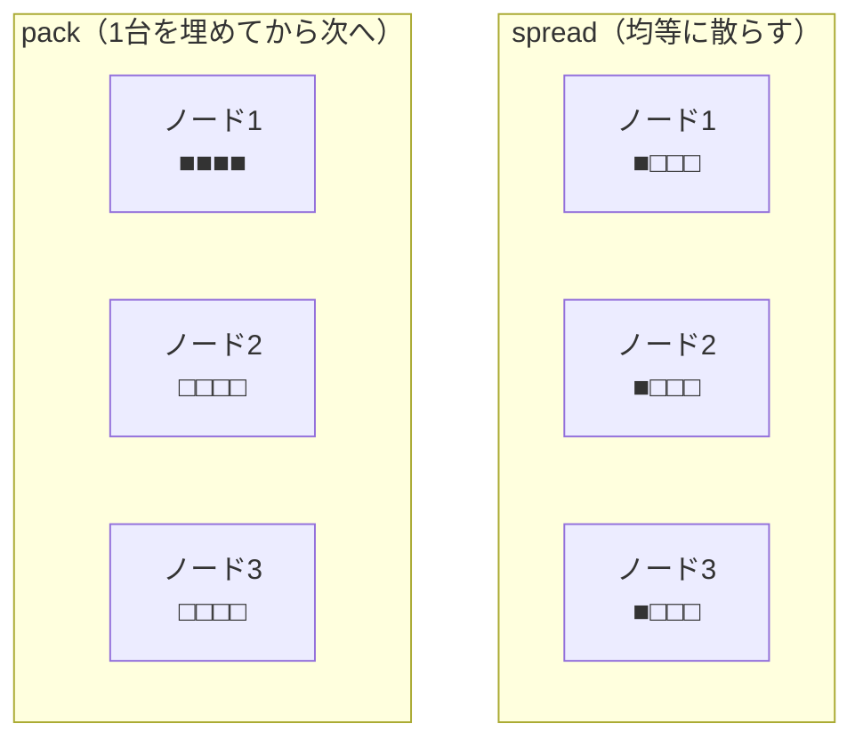
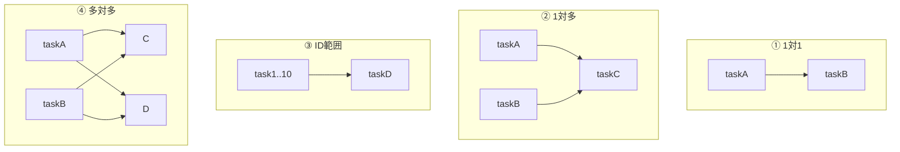
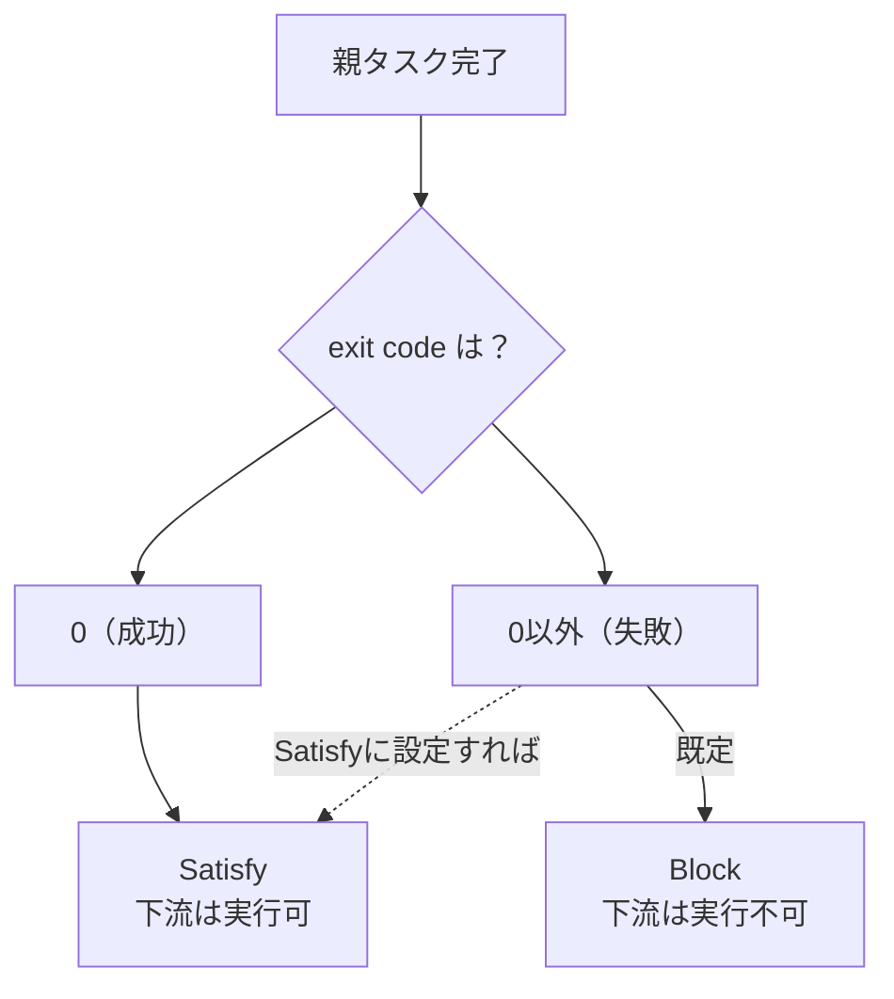
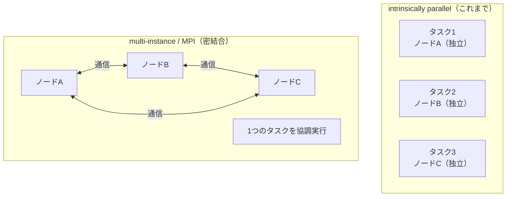
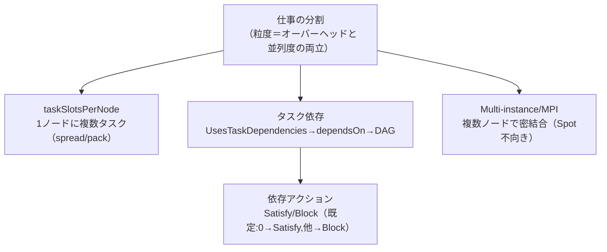

# Week 6 — タスクの分割と依存関係：1 ノードに複数タスク・順序を表す依存・MPI の俯瞰

> **Phase 3b** | 学習プラン Week 6 / 10
> 学習目標：1 つの仕事を多数のタスクへ分割する粒度の考え方を持ち、**1 ノードで複数タスクを同時実行する仕組み（`taskSlotsPerNode`）** を説明でき、**タスク依存（task dependencies）** の 4 パターンと有効化・失敗時の扱い（Satisfy/Block）を理解し、**Multi-instance タスク／MPI** による密結合並列がなぜ Spot に不向きかを説明できる

---

## 0. 今週の位置づけ

Week 5 で個々のタスクの一生（状態・リトライ・制約）と、ジョブを支える特別なタスクを学んだ。今週は**複数のタスクをどう組み合わせて 1 つの大きな仕事にするか**——分割・同時実行・順序——を扱う。「仕事の世界」の総仕上げである。

Week 3 の「コア＝働き手／ノードを増やす＝並列度」、Week 5 で予告した `maxTasksPerNode`（1 ノードで複数タスク）、そして Week 1 の intrinsically parallel が、今週すべて合流する。

---

## 1. 仕事をタスクへ分割する：粒度の設計

Batch の出発点は「大きな 1 つの仕事を、独立した小さなタスクに割る」こと。ここで効くのが**粒度（granularity＝どれくらい細かく割るか）**の判断である。

| 割り方 | 結果 |
|---|---|
| **細かすぎる**（1 タスクが一瞬で終わる） | タスクの起動・スケジュール・結果回収の**オーバーヘッド**が相対的に大きくなり、無駄が増える |
| **粗すぎる**（1 タスクが巨大） | タスク数が少なく**並列度が上がらない**。1 タスクの失敗で失う仕事も大きい |
| **ちょうどよい**（独立した自然な単位） | 「動画 1 本＝1 タスク」のように、**互いに独立した自然な単位**で割ると管理も並列度も両立 |

> **初学者向け用語補足：オーバーヘッドとは**
> **オーバーヘッド（overhead）**＝本来やりたい仕事（動画変換）そのものではない、**付随的にかかるコスト**。Batch では 1 タスクごとに「ノードへ割り当てる・リソースファイルを落とす・結果を回収する・状態を記録する」といった手間がかかる。1 タスクが 0.1 秒で終わるのにこの手間が 2 秒かかるなら、9 割以上が無駄。だから「割れば割るほど速い」わけではなく、**1 タスクがオーバーヘッドに見合う程度の仕事量**を持つ粒度が良い。

分割された多数のタスクの間に**順序関係がない**なら、それはまさに Week 1 の **intrinsically parallel**——全部同時に流せる。順序関係が**ある**場合に必要になるのが §3 のタスク依存である。

---

## 2. 1 ノードで複数タスクを同時に：`taskSlotsPerNode`

Week 5 の Job Manager の話で「1 ノードあたり同時タスク数（`maxTasksPerNode`）」が出てきた。ここを正式に扱う。既定では **1 ノード＝同時に 1 タスク**だが、これを増やせる。

> **用語の整理**：この設定の現在のプロパティ名は **`taskSlotsPerNode`（タスクスロット/ノード）**。以前は `maxTasksPerNode` と呼ばれた（Week 5 まで使ってきた名前）。Spot＝low-priority と同じく**旧称が残っている**ので読み替える。「ノードに"タスクを置ける枠（スロット）"が何個あるか」を表す。

### 2-1. なぜ 1 ノードに複数タスクを詰めるのか

Week 3 で「多コアのノードは同時に複数タスクを走らせられる」と触れた。1 ノードに複数タスクを詰める利点（[Run tasks concurrently](https://learn.microsoft.com/en-us/azure/batch/batch-parallel-node-tasks) より）：

- **データ転送を減らす**：共通データを**少数のノード**にだけコピーし、その上で複数タスクを並列実行 → 転送料金を大幅削減
- **メモリの山を平準化**：大きなメモリを一時的に使うタスクを、少数の大型ノードに同居させて効率化
- **ノード数上限の緩和**：ノード間通信するプールはノード数に上限があるため、1 ノードあたりのタスク数を増やして総並列度を稼ぐ

公式の例が分かりやすい。1 コアの `Standard_D1` を **1,000 台**必要とする仕事は、16 コアの `Standard_D14` で並列タスクを有効にすると **63 台**で済む（16 倍少ない）。共通データのコピー先も 63 ノードだけになり、効率が上がる。

> **設定の制約**：`taskSlotsPerNode` は**ノードのコア数の最大 4 倍**まで（例：4 コアなら最大 16）。ただしコア数によらず**1 ノード 256 スロットが上限**。そして**プール作成時にしか設定できず、後から変更不可**（Week 3 の「VM サイズは作成後変更不可」と同じ性質）。

### 2-2. タスクをどう分散させるか：spread と pack

複数スロットを有効にしたら、「タスクをノード間でどう配るか」を **`taskSchedulingPolicy`（fill type）** で決める。

| fill type | 挙動 | 向くケース |
|---|---|---|
| **spread（散らす）** | タスクを全ノードに**均等**に配る | 各タスクにノードの資源をなるべく広く使わせたい |
| **pack（詰める）** | 1 ノードを**満杯にしてから**次のノードへ | 空きノードを作り、**オートスケールで余った台数を削除**してコスト削減（Week 4 と好相性） |

> **初学者向け用語補足：`requiredSlots`（タスクの重み付け）とオートスケールへの影響**
> タスクごとに `requiredSlots`（必要スロット数・既定 1）を指定でき、重いタスクは複数スロットを占有させられる。例：`taskSlotsPerNode = 8` のノードで、CPU を食うタスクは `requiredSlots = 8`（1 台を占有）、軽いタスクは `requiredSlots = 1`（8 個同居）。
> **重要な副作用**：Week 4 のオートスケール式で `$RunningTasks` を使っていると、1 ノードで複数タスクが同時に走るぶん**タスク数の数え方が大きく変わる**。`taskSlotsPerNode` を上げるなら、スケール式が台数を過大／過小評価しないか見直すこと（公式も明記）。

> **Week 5 とのつながり**：Job Manager の `runExclusive = false` が効くのは「ノードが複数タスク同時実行を許す場合だけ」と学んだ。その"複数タスク同時実行"の正体が、この `taskSlotsPerNode > 1` である。

---

## 3. タスク依存（task dependencies）：順序関係を表す

分割したタスクに**順序**があるとき——「下流タスクが上流タスクの出力を使う」「前処理が終わってから本処理」——それを表すのが**タスク依存**。

> With Batch task dependencies, you create tasks that are scheduled for execution on compute nodes after the completion of one or more parent tasks.
> （タスク依存を使うと、**1 つ以上の親タスクの完了後に**スケジュールされるタスクを作れる）
> — [Create task dependencies](https://learn.microsoft.com/en-us/azure/batch/batch-task-dependencies)

代表的な用途：**MapReduce** 型の処理、**DAG（有向非巡回グラフ）** で表せるデータ処理、レンダリングの前処理・後処理、上流の出力に依存する下流タスク全般。

> **初学者向け用語補足：DAG（有向非巡回グラフ）とは**
> **DAG**＝Directed（有向＝矢印に向きがある）Acyclic（非巡回＝ぐるっと一周して戻ってこない）Graph（グラフ＝点と線のつながり）。「A の後に B、B の後に C」と**一方通行で、循環しない**依存関係のこと。もし「A は B に依存し、B は A に依存」のような循環があると誰も始められず詰むので、依存は必ず DAG（循環なし）になっている必要がある。タスク依存はこの DAG を Batch 上で表現する仕組み。

### 3-1. 有効化とdeclare の仕方

タスク依存は**まずジョブ側で有効化**が必要（忘れやすい第一の関門）。

> To use task dependencies in your Batch application, you must first configure the job to use task dependencies. ... setting its `UsesTaskDependencies` property to `true`
> （タスク依存を使うにはまずジョブで有効化する。`UsesTaskDependencies` を `true` にする）
> — 同ページ

有効化したら、各タスクに `dependsOn`（依存先）を指定する。「Flowers は Rain と Sun に依存」なら、Flowers の `dependsOn` に `TaskIds = {"Rain", "Sun"}` を書く。すると **Rain と Sun が成功完了してから** Flowers がスケジュールされる。

### 3-2. 4 つの依存パターン

| パターン | 意味 | 指定方法 |
|---|---|---|
| **1 対 1** | taskB は taskA の完了後 | `TaskIds = {"taskA"}` |
| **1 対多** | taskC は taskA と taskB 両方の完了後 | `TaskIds = {"taskA","taskB"}` |
| **ID 範囲** | taskD は ID 1〜10 の全タスク完了後 | `TaskIdRanges = { (1,3) }` |
| **多対多** | C・D・E・F がそれぞれ A・B に依存 | 上記の組み合わせ |

> **ID 範囲の注意点**（公式より）：範囲依存で選ばれるのは **ID が整数値のタスクだけ**。`1..10` は `3` や `7` を選ぶが `5flamingoes` は選ばない。先頭の 0 は無視され、`4`・`04`・`004` はすべて同じ「4」扱い。また、**親タスク ID を列挙する方式は合計 64,000 文字を超えると失敗**するので、親が大量なら ID 範囲を使う。

---

## 4. 親が失敗したら？：依存アクション（Satisfy / Block）

既定では「**親が成功完了（exit code 0）してから**下流が走る」。では親が失敗したら？ 既定では下流は**走れないまま**になる。これを制御するのが**依存アクション（dependency action）**。

| 依存アクション | 意味 |
|---|---|
| **Satisfy** | 親が（指定した条件で）終了したら、下流を**実行可能**にする |
| **Block** | 下流を**実行不可**にする |

既定は「**exit code 0 なら Satisfy、それ以外はすべて Block**」。つまり親が失敗したら下流は自動的に止まる。だが「親が失敗しても、**古いデータを使って下流を走らせたい**」といった場合は、その失敗条件に対して `DependencyAction = Satisfy` を設定すれば、失敗しても下流を進められる。逆に特定のエラーコードでは確実に止めたい、という細かい制御もできる（`ExitCodes`・`ExitCodeRanges`・`PreProcessingError` などの条件ごとに指定）。

> **Week 4 とのつながり**：オートスケールの `$ActiveTasks` は「実行準備ができ、**依存が満たされた**タスク」だけを数え、**依存がまだ満たされていないタスクは除外**する（Week 4 §2-1 の定義）。つまり「上流待ちで止まっている下流タスク」はオートスケールの増員判断に**カウントされない**。依存が解けて初めて Active に数えられ、必要なら台数が増える。§3-§4 の依存の話が、Week 4 のスケール判断と噛み合っているのが分かる。

---

## 5. Multi-instance タスクと MPI：複数ノードを束ねて 1 つの仕事（俯瞰）

ここまでは「独立したタスクを並べる（intrinsically parallel）」話だった。最後に、Week 1 で予告した**もう一方の世界＝密結合並列（tightly coupled）**を俯瞰する。

これまでのタスクは「1 タスク＝1 ノード（の 1 スロット）で完結」だった。これに対し **Multi-instance タスク**は、**複数ノードを束ねて 1 つのタスクを協調実行**する。

> A multi-instance task is a task that is configured to run on more than one compute node simultaneously. With multi-instance tasks, you can enable high-performance computing scenarios that require a group of compute nodes that are allocated together to process a single workload, such as Message Passing Interface (MPI).
> （Multi-instance タスクは**複数ノードで同時実行**するタスク。**一体で確保したノード群が 1 つのワークロードを処理する** HPC シナリオ——MPI など——を可能にする）
> — [Jobs and tasks](https://learn.microsoft.com/en-us/azure/batch/jobs-and-tasks)

> **初学者向け用語補足：MPI（Message Passing Interface）とは**
> **MPI**＝Message（メッセージ）Passing（受け渡し）Interface（インターフェース＝共通の作法）＝**複数のノードが計算の途中で互いにデータをやり取りしながら 1 つの問題を解く**ための標準規格。流体シミュレーションや有限要素解析のように、「隣の領域の計算結果を受け取らないと自分の次のステップが進まない」タイプの計算で使う。これが Week 1 で言った **tightly coupled（密結合）**——独立して走れず、常に通信し合う。
>
> Batch で MPI を動かすには、**ノード間通信を有効にしたプール**が要る（Week 3 §で触れた communication status）。ノードどうしが通信するため、プールのノード数に上限が課される点にも注意。本教材では「そういう世界がある」という俯瞰に留める（詳細は公式 [Use multi-instance tasks to run MPI applications](https://learn.microsoft.com/en-us/azure/batch/jobs-and-tasks)）。

### なぜ Spot は長い MPI に不向きか（Week 3 の回収）

Week 3 で「長時間の MPI ジョブは Spot に不向き」と述べた。理由がここで腑に落ちる。

密結合では全ノードが通信で一体化しているので、**1 ノードが横取りされると計算の輪が壊れ、ジョブ全体をやり直し**になりかねない。独立タスク（intrinsically parallel）なら「横取りされたそのタスクだけ別ノードで再実行」で済むが、MPI はそうはいかない。だから **MPI には横取りされない Dedicated ノード**、intrinsically parallel には安い Spot、という Week 3 の使い分けに戻ってくる。

---

## 6. Week 6 全体の整理

### 重要な用語まとめ

| 用語 | 一言説明 |
|---|---|
| 粒度（granularity） | タスクの割り方。細かすぎ＝オーバーヘッド増、粗すぎ＝並列度不足 |
| `taskSlotsPerNode` | 1 ノードで同時に走らせるタスク枠（旧 `maxTasksPerNode`）。最大 4×コア・256 上限・作成時のみ設定 |
| fill type（spread/pack） | タスクの配り方。spread＝均等、pack＝詰めて空きノードを作りオートスケールで削減 |
| `requiredSlots` | タスクごとの必要スロット数（既定 1）。重いタスクに複数割当 |
| タスク依存 | 親の完了後に下流を走らせる。`UsesTaskDependencies=true`＋`dependsOn` |
| 依存 4 パターン | 1 対 1／1 対多／ID 範囲（整数 ID のみ）／多対多 |
| 依存アクション | Satisfy（実行可）／Block（不可）。既定は exit 0→Satisfy、他→Block |
| Multi-instance / MPI | 複数ノードを束ねて協調実行する密結合並列。Dedicated 向き（Spot 不向き） |

---

## ハンズオン チェックリスト

- [ ] `taskSlotsPerNode` を 2〜4 に設定したプールを作り（作成時のみ設定可）、1 ノードで複数タスクが同時に Running になるのを確認した
- [ ] fill type を **pack** にして、1 ノードが埋まってから次に配られる様子を観察した（任意）
- [ ] ジョブを **`UsesTaskDependencies = true`** で作り、taskA → taskB（1 対 1）の依存を設定して、A 完了後に B が走るのを確認した
- [ ] taskC が taskA・taskB 両方に依存（1 対多）する構成を試した
- [ ] **親をわざと失敗**させ、既定では下流が Block されること、依存アクションを Satisfy にすると走ることを確認した（任意）
- [ ] 観察後、プールを削除して課金を止めた

---

## 自己チェック

週末にドキュメントを閉じて答えてみる。

1. **タスクを「細かく割れば割るほど速い」わけではないのはなぜか？**
   - キーワード：1 タスクごとのオーバーヘッド、細かすぎると無駄が相対的に増える、見合う仕事量の粒度
2. **`taskSlotsPerNode` を上げると何が嬉しく、設定上どんな制約があるか？**
   - キーワード：少数ノードで並列・データ転送削減、最大 4×コア・256 上限、作成時のみ・変更不可
3. **fill type の spread と pack、オートスケールでコスト削減に向くのはどちらか？**
   - キーワード：pack（詰めて空きノードを作る）、オートスケールが空きノードを削除
4. **タスク依存を使うのに、タスクを作る前に必ずやることは？**
   - キーワード：ジョブで `UsesTaskDependencies = true`（有効化を忘れると使えない）
5. **依存の既定動作と、親失敗時に下流を走らせる方法は？**
   - キーワード：既定は exit 0→Satisfy・他→Block、失敗条件に DependencyAction=Satisfy を設定
6. **MPI（密結合）が Spot に不向きなのはなぜか？**
   - キーワード：全ノードが通信で一体、1 ノード横取りでジョブ全体やり直し、Dedicated 向き

---

## 次週の予告（Week 7）

「仕事の世界」を終え、**データの入出力とアプリ配布**に入る（Storage 教材との接続点）：

- **Resource Files**：Blob からノードへ入力を落とす仕組み（これまで何度も出てきた「リソースファイル」の本体）
- **Output Files**：タスクの結果を Blob へ自動アップロード
- **Application Packages**：実行バイナリの配布・バージョン管理（start task を軽くする回避策の本命）
- Azure Files のマウント、そして Batch アカウントに紐づく Storage アカウントの役割
