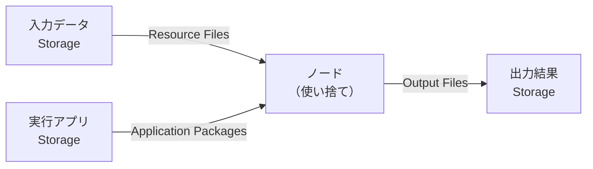
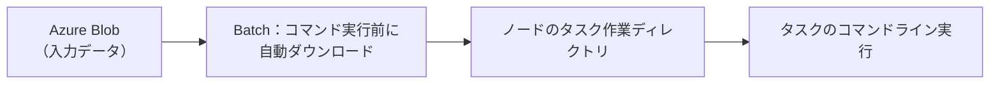
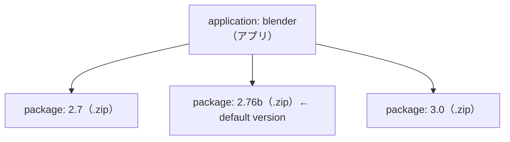
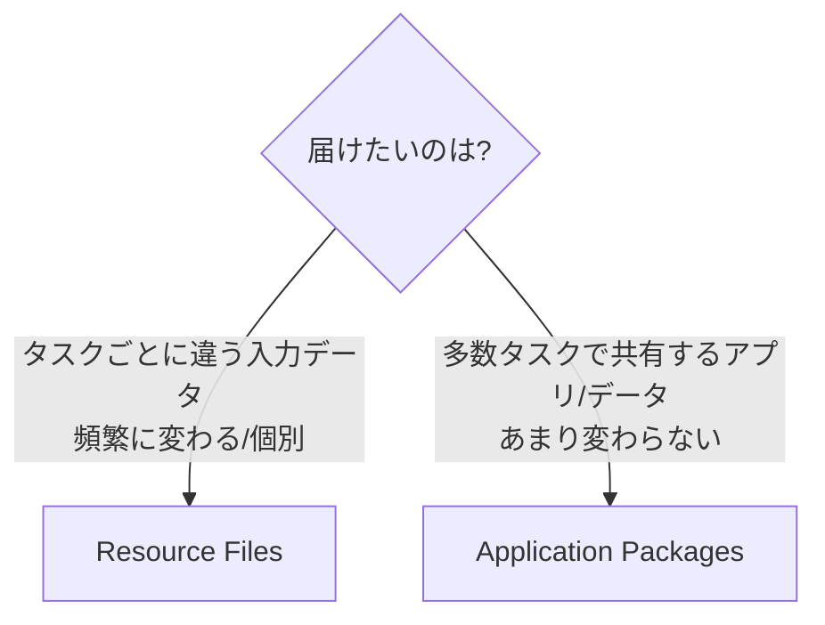
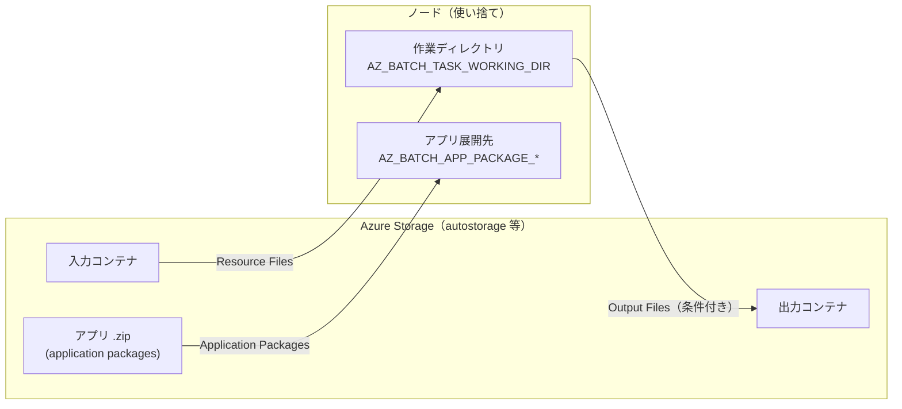

# Week 7 — データの入出力とアプリ配布：Resource Files・Output Files・Application Packages

> **Phase 4a** | 学習プラン Week 7 / 10
> 学習目標：ノードが使い捨てだからこそ「入力は Storage から取り、出力は Storage へ返す」構図を説明でき、**Resource Files（入力の取得）／Output Files（結果の書き出し）／Application Packages（実行アプリの配布）** の 3 つを区別して使い分けられ、それぞれが Batch アカウントに紐づく **Storage アカウント（autostorage）** とどう関わるかを理解する

---

## 0. 今週の位置づけ

Week 3-6 で「計算資源（プール／ノード）」と「仕事（ジョブ／タスク）」を学んだ。だが肝心の**データ**——タスクが処理する入力、生み出す出力、そして実行するアプリ本体——を「どうノードに届け、どう外に残すか」はまだ曖昧なままだった。今週それを埋める。ここは **Storage 教材との接続点**でもある。



Week 2 で釘を刺した性質がここで効く——**ノードは畳めば中身が消える（使い捨て）**。だから「入力はノードの外（Storage）から取り、出力はノードの外（Storage）へ返す」が鉄則になる。今週の 3 つの機能は、すべてこの出入りを担う道具である。

> **初学者向け用語補足：autostorage（自動ストレージ）アカウントとは**
> Week 2 で「Batch アカウントと Storage アカウントは別物」「多くの Batch ソリューションは Storage アカウントを紐づけて使う」と学んだ。この**Batch アカウントに紐づけた Storage アカウント**を **autostorage account（オートストレージ・アカウント）** と呼ぶ。「紐づけておけば、コンテナ名を指定するだけで SAS URL を毎回作らなくてよくなる」ための仕組み（後述）。**Application Packages はこの紐づけが必須**、Resource Files/Output Files は autostorage でも任意の Storage でもよい。

---

## 1. Resource Files：入力をノードへ取り込む

**Resource Files（リソースファイル）** は、Week 2・5 で何度も名前だけ出てきた「タスク実行前に Blob からノードへ自動コピーされる入力」の本体である。

> Resource files are the way to provide this data to your Batch virtual machine (VM) via a task. All types of tasks support resource files: tasks, start tasks, job preparation tasks, job release tasks, etc.
> （Resource Files は、タスク経由で Batch の VM にデータを渡す手段。**あらゆる種類のタスクが対応**——通常タスク・start task・job preparation/release タスクなど）
> — [Creating and using resource files](https://learn.microsoft.com/en-us/azure/batch/resource-files)



### 1-1. Resource Files の 3 つの指定方法

データの置き場所と認証方法によって、3 通りの作り方がある。

| 方法 | いつ使うか | 認証 |
|---|---|---|
| **Storage コンテナ URL** | Azure 上の**任意の**Storage コンテナから取る | SAS URL／マネージドID／公開アクセス |
| **Storage コンテナ名（autostorage）** | 紐づけ済みの autostorage アカウントのコンテナから取る | **不要**（紐づけ済みなので名前だけ） |
| **Web エンドポイント（HTTP URL）** | 任意の有効な HTTP URL から**単一ファイル**を取る（GitHub なども可） | 不要（Storage で非公開なら要 SAS/ID） |

- **Storage コンテナ URL** 方式では、コンテナへのアクセスに **SAS（Shared Access Signature）** を使うのが基本。コンテナ全体にアクセスするには `Read` と `List` の両権限が要る（単一 Blob なら `Read` だけ）。SAS の代わりに**マネージドID**（プールに割り当て・`Storage Blob Data Reader` ロール）も使える（Week 8 の伏線）。
- **autostorage 方式**なら SAS を組み立てる必要がなく、`ResourceFile.FromAutoStorageContainer(コンテナ名)` のように**名前だけ**で済む。
- `blobPrefix`（Blob 名の接頭辞）で「特定のプレフィックスで始まる Blob だけ落とす」と絞り込める。

> **初学者向け用語補足：SAS（Shared Access Signature）——Storage 教材の復習**
> **SAS（シャス／エス・エー・エス）＝Shared（共有）Access（アクセス）Signature（署名）**＝Storage のアカウントキーを渡さずに、「このコンテナに・この権限で・この期限まで」と**限定したアクセス権**を URL に埋め込んで渡す仕組み。Batch が Storage の入力を読むときも、この SAS 付き URL を使う（読むなら `Read`＋`List`、書くなら `Write`）。Storage 教材で学んだ SAS が、そのまま Batch の入出力認証に効いてくる。autostorage を使えば、この SAS 発行を Batch に肩代わりさせられる、というのが「紐づけ」の主な旨味。

### 1-2. ファイルはどこに落ちるか（AZ_BATCH 環境変数）

Resource Files は**タスクの作業ディレクトリ**に落ちる。ノード上の場所は環境変数で参照する（Week 1・5 のハンズオンで使った `$AZ_BATCH_NODE_SHARED_DIR` もこの一族）。

| 環境変数 | 指す場所 |
|---|---|
| `AZ_BATCH_TASK_WORKING_DIR` | そのタスク専用の作業ディレクトリ（Resource Files はここ、`stdout.txt`/`stderr.txt` もここ） |
| `AZ_BATCH_NODE_SHARED_DIR` | 同じノード上の全タスクが共有できるディレクトリ（job preparation で置いた共通データの置き場など） |
| `AZ_BATCH_NODE_ROOT_DIR` | Batch が使うルートディレクトリ |

> **注意：Resource Files を大量に付けすぎない**（公式より）。1 タスクに大量のファイル（＝ファイル名/URL の合計長）を付けると、Batch が「タスクが大きすぎる」と拒否することがある。多数の共有ファイルは、次の Application Packages か、「コンテナ 1 個を指す単一 Resource File」にまとめるのが定石。

---

## 2. Output Files：結果を Storage へ書き出す

タスクが生んだ結果は、放っておくと**ノードとともに消える**。Week 2 で見たとおりノードは使い捨てで、しかもタスクにはファイル保持期間（Week 5 の retention time）もある。だから**残したい出力は Storage へ持ち出す**——それを自動化するのが **Output Files**。

> Tasks write output data to the file system of a Batch compute node, but all data on the node is lost when it is reimaged or when the node leaves the pool. ... it's important to persist task output that you'll need later to a data store such as Azure Storage.
> （タスクはノードのファイルシステムに出力を書くが、**ノードが再イメージされたりプールを去ると全データが失われる**。だから後で必要な出力は Azure Storage に**永続化（persist）**することが重要）
> — [Persist output data to Azure Storage](https://learn.microsoft.com/en-us/azure/batch/batch-task-output-files)

タスク作成時に **`OutputFiles`** を指定すると、Batch が**タスク完了時に、指定パターンに合うファイルを指定コンテナへ自動アップロード**する。アプリ本体は改変不要——タスクを作るコード側で出力の永続化を書ける。

### 2-1. Output Files の 3 要素


| 要素 | 意味 |
|---|---|
| **`filePattern`** | アップロードするファイルのパターン。`*`（非再帰）・`**`（再帰）のワイルドカード可。単一ファイルはワイルドカードなしで指定 |
| **`destination`**（コンテナ＋`Path`） | 書き出し先の Storage コンテナ（SAS またはマネージドID で認証。**書き込みなので `Write` 権限**）。`Path` で Blob 名/仮想ディレクトリを指定 |
| **`uploadCondition`** | いつアップロードするか（下表） |

> **初学者向け用語補足：ワイルドカード `*`（非再帰）と `**`（再帰）の違い**
> **ワイルドカード（wildcard）**＝「何にでもマッチする代役記号」（トランプのジョーカー＝万能札が語源）。`std*.txt` なら「`std` で始まり `.txt` で終わるもの全部（`stdout.txt`・`stderr.txt`…）」を表す。`*` と `**` の違いは「**サブフォルダの中まで潜って探すか**」。次の構成で考える。
>
> ```text
> 作業ディレクトリ/
> ├── a.txt
> ├── b.txt
> └── logs/            ← サブフォルダ
>     ├── c.txt
>     └── deep/
>         └── d.txt
> ```
>
> | パターン | 意味 | マッチ |
> |---|---|---|
> | `*.txt` | **今いる階層だけ**（非再帰＝サブフォルダに潜らない） | `a.txt`・`b.txt`（`c.txt`・`d.txt` は**マッチせず**） |
> | `**/*.txt` | **サブフォルダも全部潜って**（再帰） | `a.txt`・`b.txt`・`c.txt`・`d.txt` **全部** |
>
> **初学者向け用語補足：再帰（さいき／recursive）とは**——「同じ処理を、その中身に対しても繰り返し適用する」こと。フォルダ探索なら「フォルダを開いたら、その中のフォルダも開いて、さらにその中も…と底まで潜る」動き。`**` はこれを行い、`*` は 1 階層で打ち止め。
>
> 結果が複数フォルダに散らばるなら `**/*.txt`、直下だけでよいなら `*.txt`、1 ファイルだけなら `output.txt`（ワイルドカードなし）。公式サンプルにある `..\std*.txt` は「`..`（1 つ上のディレクトリ）にある `stdout.txt`/`stderr.txt` を、非再帰の `*` で拾う」指定である。

**`uploadCondition`（アップロード条件）** の値：

| 値 | 挙動 |
|---|---|
| **`TaskSuccess`** | タスクが成功（exit code 0）したときだけ |
| **`TaskFailure`** | タスクが失敗（exit code 0 以外）したときだけ |
| **`TaskCompletion`** | 成否によらず完了したら（最もよく使う） |

> **使い分けの典型**：「**結果ファイルは成功時だけ**（`TaskSuccess`）／**詳細ログは失敗時だけ**（`TaskFailure`）」。失敗時に結果ファイルは不完全かもしれず、成功時に詳細ログは要らない——条件を分けることで、無駄なアップロードと混乱を避ける。

### 2-2. 同名ファイルの衝突を避ける：`Path` にタスク ID を入れる

全タスクが `stdout.txt`/`stderr.txt`（Week 1）や `output.txt` を作ると、共有コンテナで**同名衝突**する。`Path` に**タスク ID** を入れて一意にするのが定石。

```text
https://<acct>.blob.core.windows.net/mycontainer/task1/output.txt
https://<acct>.blob.core.windows.net/mycontainer/task2/output.txt
```

> **初学者向け用語補足：アップロード失敗の見分け方**
> Output Files のアップロードに失敗すると、タスクは **Completed** になりつつ `FailureInfo` がセットされる（例：コンテナが見つからない `FileUploadContainerNotFound`）。さらに Batch は各アップロードごとにノードへ `fileuploadout.txt`（進捗）と `fileuploaderr.txt`（エラー）を書く。「タスク自体は成功なのに結果が Storage に無い」ときは、この 2 ファイルを見る。Week 9 のエラー切り分けで再登場する。

---

## 3. Application Packages：実行アプリを配布・バージョン管理する

Resource Files/Output Files が「データ」の出入りなら、**Application Packages** は「**実行するアプリ本体**」の配布を担う。

### 3-1. Application と Application Package の関係

> Within Azure Batch, an *application* refers to a set of versioned binaries... An application contains one or more *application packages*, which represent different versions of the application. Each *application package* is a .zip file that contains the application binaries and any supporting files.
> （**application**＝バージョン管理されたバイナリ一式。application は 1 つ以上の **application package**（＝各バージョン）を含む。各 application package は**バイナリと付随ファイルを固めた .zip**）
> — [Deploy application packages to compute nodes](https://learn.microsoft.com/en-us/azure/batch/batch-application-packages)



- **application ID**（例：`blender`）と**version**（例：`2.7`）で 1 つの package を指す。
- **default version（既定バージョン）**を設定でき、参照時にバージョンを省略するとそれが使われる。
- **.zip 形式のみ**。ID は 64 文字以内・アカウント内で一意。

### 3-2. プール単位 vs タスク単位

application package は**プール**にも**タスク**にも付けられる。

| 種別 | いつ・どこに展開されるか | 向くケース |
|---|---|---|
| **Pool application package** | プールに参加/再起動した**全ノード**に展開 | プールの全ノードでそのアプリを使う |
| **Task application package** | タスクが割り当たったノードに、**コマンド実行直前**に展開（同バージョンが既にあれば再利用） | 共有プールで、一部のタスクだけが重いアプリを使う。**転送を最小化** |

### 3-3. ノード上での参照：`AZ_BATCH_APP_PACKAGE_*` 環境変数

展開先は環境変数で参照する。Windows と Linux で綴りが違う点に注意。

```text
Windows: AZ_BATCH_APP_PACKAGE_APPLICATIONID#version   例) AZ_BATCH_APP_PACKAGE_BLENDER#2.7
Linux  : AZ_BATCH_APP_PACKAGE_applicationid_version    例) AZ_BATCH_APP_PACKAGE_blender_2_7
```

Linux では `.`（ピリオド）・`-`（ハイフン）・`#`（番号記号）が `_`（アンダースコア）に**平坦化**され、application ID の大文字小文字は保たれる。default version を設定していればバージョン接尾辞を省略して `AZ_BATCH_APP_PACKAGE_BLENDER` のように参照できる。

### 3-4. なぜ Application Packages が「start task を軽くする本命」なのか

Week 3 で「start task にはサイズ上限があり、大きくなるなら application packages を使う」と予告した。理由がここで繋がる。

> The total size of a start task must be less than or equal to 32,768 characters, including resource files and environment variables. If your start task exceeds this limit, using application packages is another option.
> （start task の合計サイズは**32,768 文字以下**でなければならない。超えるなら application packages が選択肢）
> — 同ページ

Application Packages を使えば——

- start task に大量の Resource File を並べなくてよい
- Storage 上でのアプリの複数バージョン管理を自前でやらなくてよい
- ファイルアクセス用の **SAS URL を自分で発行しなくてよい**（Batch が裏で Storage とやり取りしてくれる）
- **タスク間でキャッシュされる**ので、ダウンロードが最適化される

> **利用の前提と注意**：Application Packages を使うには **Storage アカウントの紐づけ（autostorage）が必須**。package は block blob として保存され、その分の**ストレージ課金は通常どおり**発生する（Week 1「Batch 本体は無料、下地に課金」の一例）。ファイアウォール設定済み／階層型名前空間（Hierarchical namespace）有効の Storage アカウントは使えない点にも注意。不要になった古い package は消してコストを抑える。

---

## 4. Resource Files と Application Packages の使い分け

似た「ノードへファイルを届ける」機能が 2 つ出たので、使い分けを固定する。



| | Resource Files | Application Packages |
|---|---|---|
| 向くもの | タスク固有・**頻繁に更新/差し替え**する個別ファイル | 多タスクで**共有**・**あまり変わらない**アプリやデータ |
| 更新のしやすさ | 個別ファイルの追加/編集が容易 | バージョン単位。個別差し替えは不向き |
| 最適化 | 柔軟だが自前管理 | **ダウンロード最適化・タスク間キャッシュ** |
| SAS 管理 | 自分で（autostorage なら不要） | Batch が裏で肩代わり |

公式の助言：「共通ファイルが多タスクで共有され、あまり変わらないなら application package。各タスク固有のファイルが多く、更新/差し替えが多いなら resource files」。

> **Azure Files のマウント（俯瞰）**：上記 2 つのほか、プールのノードに **Azure Files 共有をマウント**して、全タスクが同じファイルシステムを直接読み書きする方法もある（`fuse` などでマウント）。「大きな共通データを毎回コピーせず、共有ドライブとして見せたい」ときの選択肢。本教材では俯瞰に留める。

---

## 5. Week 7 全体の整理



### 重要な用語まとめ

| 用語 | 一言説明 |
|---|---|
| autostorage アカウント | Batch アカウントに紐づけた Storage。コンテナ名だけで入出力でき、Application Packages には必須 |
| Resource Files | タスク実行前に Blob→ノードへ落とす入力。3 方式（コンテナ URL／autostorage 名／HTTP URL） |
| `AZ_BATCH_TASK_WORKING_DIR` | Resource Files や stdout/stderr が置かれるタスク作業ディレクトリ |
| Output Files | タスク完了時に結果を Blob へ自動アップロード。`filePattern`／`destination`＋`Path`／`uploadCondition` |
| uploadCondition | `TaskSuccess`／`TaskFailure`／`TaskCompletion` |
| Application / Application Package | application＝バージョン管理されたバイナリ群、package＝各バージョンの .zip |
| Pool/Task application package | プール全ノードに展開／タスクのノードに実行直前展開 |
| `AZ_BATCH_APP_PACKAGE_*` | 展開先を指す環境変数（Windows と Linux で綴りが違う） |
| start task サイズ上限 | 32,768 文字。超えるなら application packages で回避 |

---

## ハンズオン チェックリスト

Storage アカウントを紐づけ、入力→処理→出力の一連を体験する（少台数で）。

- [ ] Batch アカウントに **Storage アカウントを紐づけ**（autostorage）た
- [ ] 入力用コンテナに小さなテキストファイルを 1 つアップロードした
- [ ] タスクに **Resource File**（そのファイル）を指定し、`AZ_BATCH_TASK_WORKING_DIR` に落ちていることを（例：`ls`／`cat` するタスクで）確認した
- [ ] タスクに **Output File**（例：`output.txt` を `uploadCondition = TaskCompletion` で出力コンテナへ）を指定し、完了後に Blob に上がっていることを確認した
- [ ]（任意）Portal の **Applications** から Storage を紐づけ、簡単な .zip を **Application Package** として登録し、Pool に参照させて `AZ_BATCH_APP_PACKAGE_*` 環境変数がノードに出ることを確認した
- [ ] 観察後、プールを削除して課金を止めた

---

## 自己チェック

週末にドキュメントを閉じて答えてみる。

1. **なぜ入力を Storage から取り、出力を Storage へ返すのか？**
   - キーワード：ノードは使い捨て、再イメージ/離脱で消える、保持期間もある、残すものは外部へ永続化
2. **Resource Files の 3 つの指定方法と、autostorage を使う利点は？**
   - キーワード：コンテナ URL（SAS/ID）／autostorage コンテナ名／HTTP URL、autostorage なら SAS 不要で名前だけ
3. **Output Files の `uploadCondition` を「結果は成功時・ログは失敗時」に分ける狙いは？**
   - キーワード：`TaskSuccess`/`TaskFailure`、失敗時の結果は不完全、無駄と混乱を避ける
4. **application と application package の関係、default version とは？**
   - キーワード：application＝バージョン群、package＝各バージョンの .zip、default version は省略時に使われる版
5. **Application Packages が start task を軽くする理由は？**
   - キーワード：start task の 32,768 文字上限、Resource File を並べず済む、SAS 発行不要、タスク間キャッシュ、要 autostorage
6. **Resource Files と Application Packages はどう使い分けるか？**
   - キーワード：個別・頻繁更新→Resource Files、共有・あまり変わらない→Application Packages

---

## 次週の予告（Week 8）

データの通り道を確保したところで、**認証とセキュリティ**を扱う（今週チラ見えした SAS・マネージドID を正面から）：

- Batch アカウントの認証：**共有キー vs Entra ID（旧 Azure AD）**
- プールの**マネージドID**——Storage への SAS レス・アクセス（今週の Resource/Output Files の認証がここで完結）
- ノードへの接続（SSH/RDP）とプールの通信モード
- VNet 統合と、Batch のアクセスモデルを ARM のコントロール/データプレーンの枠組みに接続
