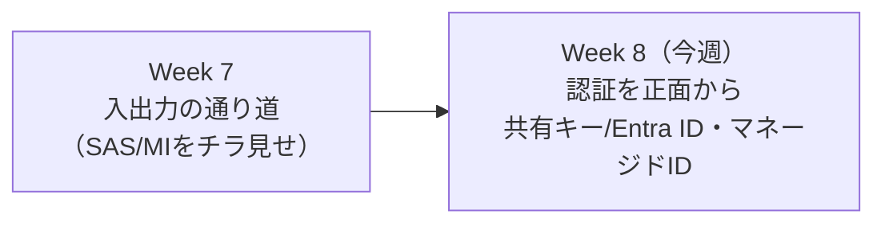
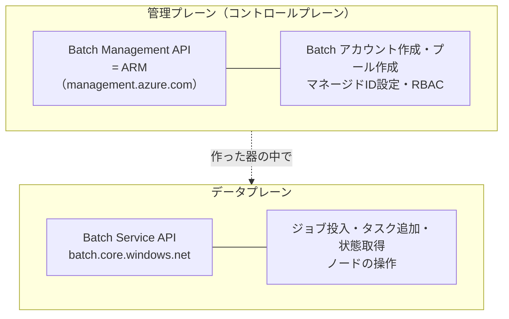
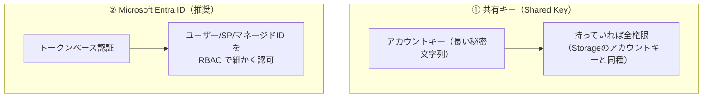
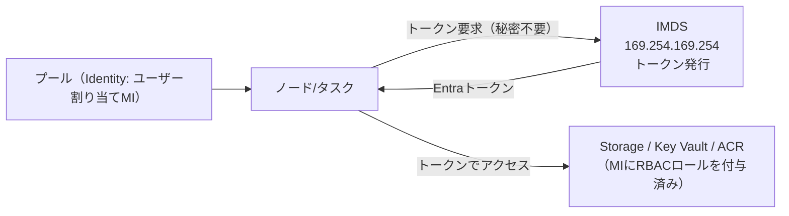
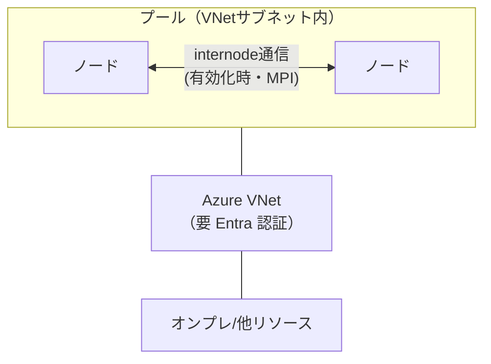
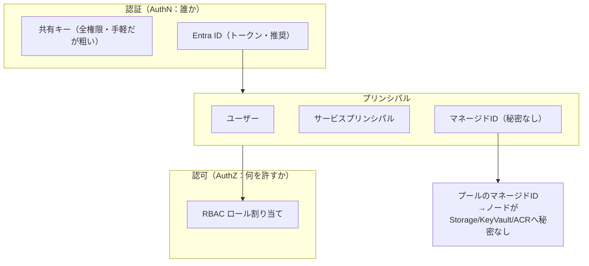

# Week 8 — 認証とセキュリティ：共有キー vs Entra ID・プールのマネージドID・ノードへの接続

> **Phase 4b** | 学習プラン Week 8 / 10
> 学習目標：Batch の 2 つの平面（管理プレーン＝ARM／データプレーン＝Batch サービス API）を区別でき、Batch アカウントの認証方式（**共有キー vs Microsoft Entra ID**）の違いと使い分けを説明でき、**プールのマネージドID**が Week 7 の Resource/Output Files の「秘密なしアクセス」をどう実現するかを理解し、ノードへの接続（SSH/RDP）と VNet 統合の要点を押さえる

---

## 0. 今週の位置づけ

Week 7 で入出力の通り道を作ったが、その認証は SAS やマネージドID を**チラ見せ**しただけだった。今週はそれを正面から扱う。Batch のアクセスモデルは、Resource Manager 教材で学んだ**コントロールプレーン／データプレーン**と**3 種類のプリンシパル**の枠組みにきれいに乗る——それを軸に整理する。

> **初学者向け用語補足：AuthN と AuthZ（復習）**
> - **認証（AuthN＝Authentication）**＝「**あなたは誰か**」を確かめること（本人確認）。
> - **認可（AuthZ＝Authorization）**＝「その人に**何を許すか**」を決めること（権限付与＝RBAC）。
> 今週の前半（共有キー／Entra ID）は主に AuthN、後半の RBAC ロール割り当ては AuthZ の話。ARM 教材で学んだこの区別がそのまま効く。

---

## 1. Batch の 2 つの平面：管理プレーンとデータプレーン

Batch を操作する API は、Resource Manager 教材の**コントロールプレーン／データプレーン**そのままに 2 系統ある。

| 平面 | 何をする | エンドポイント | 例 |
|---|---|---|---|
| **管理プレーン**（Batch Management API） | Batch アカウントやプールという**器を作る・構成する** | `management.azure.com`（＝ARM） | アカウント作成、プール作成、マネージドID 設定、RBAC |
| **データプレーン**（Batch Service API） | 器の中で**仕事を回す** | `<account>.<region>.batch.azure.com` / リソース `https://batch.core.windows.net/` | ジョブ投入、タスク追加、ノード状態取得 |

これは Week 1 で「Batch アカウントは ARM リソース」「ジョブ/タスクは Batch サービス API」と別々に触れていたことの正式な整理である。**「プールをマネージドID 付きで作る」のは管理プレーンの仕事**で、後述のとおり管理プレーン＋Entra 認証でしかできない。

---

## 2. Batch アカウントの認証：共有キー vs Microsoft Entra ID

データプレーン（Batch サービス API）を呼ぶときの認証方式は 2 つある。

### 2-1. 共有キー（Shared Key）

Batch アカウントに付いている**アカウントキー**（長い秘密文字列）を使う方式。Storage 教材で見た「Storage アカウントキー」と同じ発想で、**持っていればそのアカウントに対してほぼ全権限**を持ててしまう。手軽だが、キー 1 本が漏れれば全部やられる——**粒度の細かい制御ができず、キーの管理・ローテーションが負担**になる。

### 2-2. Microsoft Entra ID（推奨）

Microsoft のクラウド ID 管理サービス **Microsoft Entra ID（旧 Azure AD＝Azure Active Directory）** による**トークンベース認証**。

> Azure Batch supports authentication with Microsoft Entra ID ... The recommended way to authenticate Azure Batch apps is to use the Azure Identity client library
> （Batch は Microsoft Entra ID 認証をサポート。**推奨は Azure Identity クライアントライブラリ**を使うこと）
> — [Authenticate Azure Batch services with Microsoft Entra ID](https://learn.microsoft.com/en-us/azure/batch/batch-aad-auth)

Entra ID 認証は、ARM 教材で学んだ**3 種類のプリンシパル**をそのまま使う。

| プリンシパル | 使う場面 | Batch での資格情報クラス（Azure Identity） |
|---|---|---|
| **ユーザー**（対話的） | 人が操作するアプリ | `InteractiveBrowserCredential` |
| **サービスプリンシパル（SP）** | 無人実行のアプリ（登録アプリの秘密/証明書） | `ClientSecretCredential` / `ClientCertificateCredential` |
| **マネージドID** | Azure 上で動くアプリ（秘密を持たない） | `ManagedIdentityCredential` |

推奨は **`DefaultAzureCredential`**——ローカル開発（CLI サインイン）でも Azure 上（マネージドID）でも**同じコードが動く**ように、複数の認証方法を自動で試すクラス。取得したトークンは**1 時間で失効**するが、Azure Identity が透過的にキャッシュ・更新する。

> **共有キーより Entra ID が推奨される理由**：Entra ID なら、誰が・何を・どこまでできるかを **RBAC（Role-Based Access Control）** で細かく認可でき（AuthZ）、秘密文字列を持ち歩かずに済む。特にマネージドID を使えば**秘密ゼロ**にできる。これは ARM 教材で学んだ「マネージドID＝秘密を持たない特別な SP」の考え方そのもの。RBAC では Batch 用の組み込みロールをアプリ（SP/MI）に割り当てる。

> **Entra ID が"必須"になる場面**：一部の機能は共有キーでは使えず Entra 認証が要る。代表が **①プールを VNet に入れる**とき（Week 3 で触れた「VNet を使うには Batch クライアント API が Entra 認証を使わねばならない」）、**②プールをマネージドID 付きで作る**とき（次節）。

---

## 3. プールのマネージドID：ノードから「秘密なし」で他リソースへ

Week 7 で Resource Files / Output Files の認証に「SAS の代わりにマネージドID も使える」と繰り返し出てきた。その正体がここ。

**プールにユーザー割り当てマネージドID を付ける**と、そのプールの**ノード（＝そこで走るタスク）**が、Storage・Key Vault・ACR（Azure Container Registry）などへ、**SAS やキーといった秘密を一切持たずに**アクセスできる。

> Managed identities for Azure resources eliminate complicated identity and credential management by providing an identity for the Azure resource in Microsoft Entra ID. This identity is used to obtain Microsoft Entra tokens to authenticate with target resources in Azure.
> （マネージドID は、Azure リソースに Entra ID 上の ID を与えることで、面倒な資格情報管理をなくす。この ID を使って**対象リソース認証用の Entra トークンを取得**する）
> — [Configure managed identities in Batch pools](https://learn.microsoft.com/en-us/azure/batch/managed-identity-pools)

仕組みと制約：

- **ユーザー割り当て（user-assigned）マネージドID** を使う。プールには**複数**割り当て可能。プール作成時に **`Identity` プロパティ**で紐づける（設定ミスがアクセス/アップロードエラーの典型原因）。
- ノード上では **IMDS（Azure Instance Metadata Service、`169.254.169.254`）** からトークンを取得して使う。Week 7 の Resource Files（`Storage Blob Data Reader`）や Output Files（`Storage Blob Data Contributor`）の認証は、この仕組みで秘密なしに完結する。
- **マネージドID 付きプールの作成は、管理プレーン API＋Entra 認証でしか行えない**（データプレーン API では不可）。§1・§2 がここで効く。
- プールに**アクティブなノードがある間はマネージドID の変更（その場更新）不可**。変更するなら**いったん 0 台に縮小**してから。

> **初学者向け用語補足：user-assigned と system-assigned（Batch pool では前者）**
> マネージドID には 2 種類ある（ARM 教材の復習）。
> - **system-assigned（システム割り当て）**＝そのリソース専属で、リソースを消すと ID も消える。
> - **user-assigned（ユーザー割り当て）**＝独立して作る ID で、複数のリソースで使い回せる。
> **Batch プールに付けられるのは user-assigned のみ**。なお Batch アカウントの system-assigned MI は「顧客管理キーによる暗号化（customer-managed key）」用途で、これは**プールの ID としては使えない**——両方で同じ ID を使いたいなら共通の user-assigned MI にする。

> **初学者向け用語補足：ACR（Azure Container Registry）とは**
> **ACR**＝Azure Container Registry（Container＝コンテナ／Registry＝登録簿）＝**Docker コンテナイメージを保管する Azure のプライベート倉庫**。Week 3 で触れたコンテナ対応プールが、非公開のイメージを引っぱってくる先がここ。従来は倉庫のパスワードが要ったが、プールのマネージドID を使えば**秘密なしで ACR からイメージを取得**できる。

---

## 4. ノードへの接続とプールの通信

セキュリティのもう一面が「ノードにどう触れるか・ノードがどう通信するか」。Week 3 でノードに RDP/SSH・ファイアウォールが備わると触れた点を、ここで掘る。

### 4-1. ノードへのリモート接続（SSH / RDP）

各ノードには既定でリモートアクセス手段が備わる。

- **Linux ノード：SSH（Secure Shell）** ——暗号化された遠隔シェル接続
- **Windows ノード：RDP（Remote Desktop Protocol）** ——リモートデスクトップ

主にデバッグ用（Week 9 でタスク失敗を調べるとき、ノードに入って `stdout.txt` などを直接見る）。ただし**プールを作るときにリモートアクセスを無効化**することもできる（`pool endpoint configuration`）。本番では不要な入口を閉じるのがセキュリティの定石。

> **初学者向け用語補足：SSH / RDP とは**
> - **SSH**＝Secure（安全な）Shell（シェル）＝Linux 等へ暗号化して遠隔ログインし、コマンドを打つための仕組み・プロトコル。Week 2 で学んだ「シェル」に、ネットワーク越しに安全につなぐ入口。
> - **RDP**＝Remote（遠隔）Desktop（デスクトップ）Protocol（プロトコル）＝Windows の画面ごと遠隔操作する仕組み。

### 4-2. ノード間通信と VNet

Week 3 の「communication status（ノード間通信）」と VNet の話がここで揃う。

- 既定では**同じプール内のノード同士は通信できる**が、プール外の VM とは通信できない。
- **ノード間通信（internode communication）を有効化**すると MPI（Week 6）のような密結合ワークロードが可能になる。ただしノード配置に制約が生じ、**プールの最大ノード数が制限される**ことがある。
- ノードを**VNet（Virtual Network＝仮想ネットワーク）のサブネット**に入れると、オンプレや他リソースと安全に通信できる。**VNet を使うには Batch クライアント API が Entra 認証を使う必要がある**（§2 の「Entra 必須」の一例）。ノードにアクセスする**パブリック IP は既定で変わり得る**ので、固定したいなら「指定したパブリック IP でプールを作る」。

> **初学者向け用語補足：VNet / NSG（復習）**
> - **VNet**＝Virtual Network＝Azure 上に作る仮想的な private なネットワーク。ここにノードを入れると「社内ネットの一部」のように扱え、外部から隔離しつつ必要な相手とだけ通信できる。
> - **NSG**＝Network Security Group（Week 3 既出）＝VNet 内の通信を許可/拒否するルール集。設定を誤るとノードが `Unusable` になる（Week 3）ので、Batch が要求する通信は塞がないこと。

---

## 5. Week 8 全体の整理

### 重要な用語まとめ

| 用語 | 一言説明 |
|---|---|
| 管理プレーン（Batch Management API） | ARM 経由。アカウント/プールを作る・構成する・MI/RBAC を設定 |
| データプレーン（Batch Service API） | `batch.core.windows.net`。ジョブ投入・タスク・ノード操作 |
| 共有キー（Shared Key） | アカウントキーによる認証。全権限・手軽だが粒度が粗くローテーション負担 |
| Microsoft Entra ID | トークンベース認証（推奨）。Azure Identity ライブラリ・`DefaultAzureCredential` |
| プリンシパル 3 種 | ユーザー／サービスプリンシパル／マネージドID |
| プールのマネージドID | user-assigned のみ。ノードが秘密なしで Storage/KeyVault/ACR へ（IMDS 経由） |
| Entra 必須の場面 | VNet 統合・マネージドID 付きプール作成 |
| SSH / RDP | ノードへのリモート接続（Linux/Windows）。無効化も可 |
| VNet / internode 通信 | ノードを private ネットに配置／ノード間通信（MPI）。VNet は Entra 必須 |

---

## ハンズオン チェックリスト

- [ ] Batch アカウントの **Keys**（共有キー）と、**Access control (IAM)**（Entra/RBAC）の両方が Portal にあることを確認した
- [ ] `az batch account login` を **Entra 認証（`--shared-key-auth` を付けない）** で行い、`az batch pool list` が通ることを確認した
- [ ]（任意）ユーザー割り当てマネージドID を 1 つ作り、それを **`Identity` に指定したプール**を作成した（アクティブノードがある間は変更不可＝先に 0 台に）
- [ ]（任意）その MI に Storage コンテナの `Storage Blob Data Reader` を付与し、**SAS なしの Resource File**（Week 7）が落ちることを確認した
- [ ] Linux ノードに **SSH** で接続し、`stdout.txt` などノード上のファイルを直接覗いた（Week 9 の予行）
- [ ] 観察後、プールを削除して課金を止めた

---

## 自己チェック

週末にドキュメントを閉じて答えてみる。

1. **Batch の管理プレーンとデータプレーンは、それぞれ何をし、どのエンドポイントか？**
   - キーワード：管理＝ARM(management.azure.com)でアカウント/プール、データ＝batch.core.windows.netでジョブ/タスク
2. **共有キーと Entra ID 認証の違い、Entra ID が推奨される理由は？**
   - キーワード：共有キー＝全権限・粗い、Entra＝トークン・RBAC で細かく認可・秘密なし化可能
3. **プールのマネージドID は何を可能にし、どの種類（user/system）を使うか？**
   - キーワード：ノードが秘密なしで Storage/KeyVault/ACR へ、IMDS 経由、user-assigned のみ
4. **Entra 認証が"必須"になる代表的な場面を 2 つ挙げられるか？**
   - キーワード：VNet 統合、マネージドID 付きプールの作成（管理プレーン API）
5. **本番でノードのセキュリティを固めるとき、リモート接続についてどうするか？**
   - キーワード：SSH/RDP は無効化できる、不要な入口を閉じる、VNet/NSG で通信を絞る

---

## 次週の予告（Week 9）

運用の締めくくり、**コスト最適化・監視・エラーハンドリング**を扱う：

- **Spot ＋オートスケール**によるコスト削減の実践（Week 3-4 の総合）と、料金の考え方（Batch 無料・下地に課金）
- メトリクスと監視（プール/ノード/タスクの状態カウント、Preempted の可視化）
- **タスク失敗の切り分け**：exit code・`stdout.txt`/`stderr.txt`・`fileuploaderr.txt`（Week 7）・ノード状態（Week 3）を総動員
- `Unusable`/`StartTaskFailed` の原因の追い方（今週の SSH でノードに入る手も使う）
