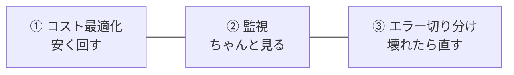
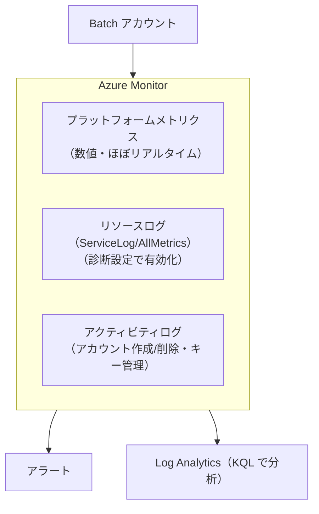
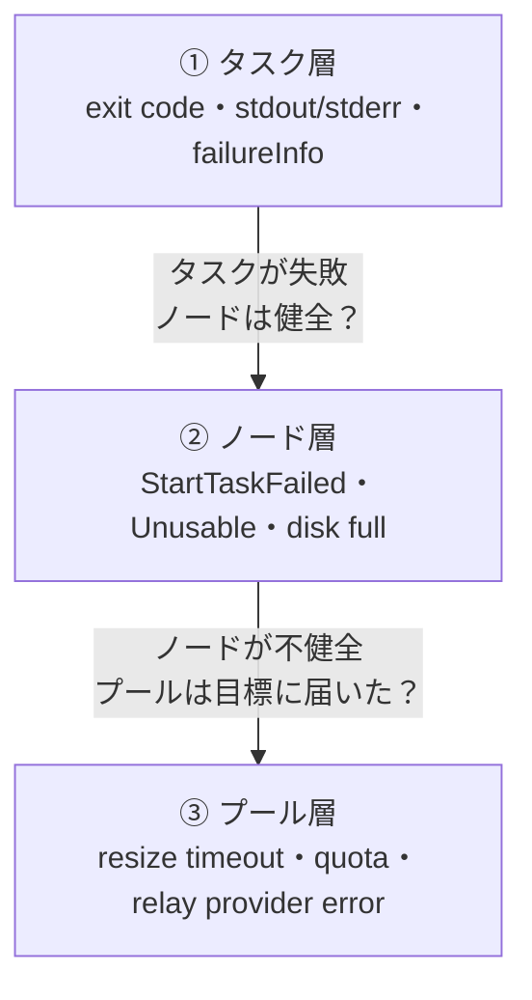
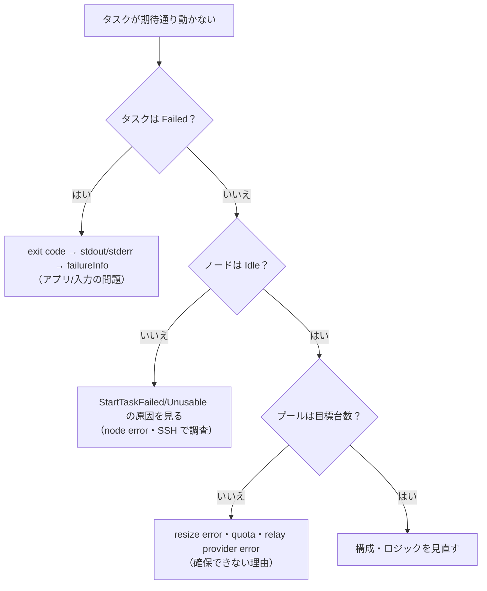
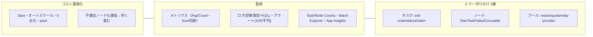

# Week 9 — コスト最適化・監視・エラーハンドリング：運用でつまずかないために

> **Phase 5a** | 学習プラン Week 9 / 10
> 学習目標：これまで学んだコスト削減の武器（Spot・オートスケール・pack・0 台化）を体系的に説明でき、Azure Monitor のメトリクス／ログ／アラートで Batch を監視でき、**タスク→ノード→プールの 3 層でエラーを切り分ける**手順（exit code・`stdout.txt`/`stderr.txt`・ノード状態・resize エラー）を実行でき、「不健全なノードにも課金される」罠を避けられる

---

## 0. 今週の位置づけ

Week 1-8 で Batch の構成要素をひととおり学んだ。今週は**運用の締めくくり**——「安く回す」「ちゃんと見る」「壊れたら直す」の 3 テーマを、これまでの知識を総動員して固める。次の Week 10（最終プロジェクト）の直前準備でもある。



---

## 1. コスト最適化：武器の総まとめと「課金の罠」

### 1-1. 料金の考え方（Week 1 の再確認）

Batch **本体は無料**、課金されるのは**下地**（VM・ストレージ・ネットワーク）。だから「コスト最適化＝下地の VM をいかに無駄なく使うか」に尽きる。これまで各週で出てきた武器を一枚にまとめる。

| 武器 | 効き方 | 学んだ週 |
|---|---|---|
| **Spot ノード** | 余剰キャパを割安で借りる（横取りリスクと引き換え） | Week 3 |
| **オートスケール** | 負荷に応じて台数を増減、遊休を減らす | Week 4 |
| **ジョブ終了時に target 0** | 使い終わったら畳んで課金を止める | Week 3-4 |
| **pack（fill type）** | ノードを詰めて空きを作り、オートスケールで削除 | Week 6 |
| **`taskSlotsPerNode`** | 少数の大型ノードに複数タスク、ノード数削減 | Week 6 |
| **retention time を短く** | タスクのファイル保持を短くしディスク／コスト削減 | Week 5・9 |
| **古い application package を削除** | 使わない .zip の block blob 課金を止める | Week 7 |

> **Spot のクォータ（Week 3 補足）**：Spot は Dedicated と**別枠の vCPU クォータ**を持ち、その枠は Dedicated より大きい。安いぶん多く使わせてくれるので、intrinsically parallel な仕事は Spot を主力にするとコスト効率が高い。

### 1-2. 最大の罠：不健全なノードにも課金される

コスト最適化で見落としがちな落とし穴を、公式が繰り返し警告している。

> Even when Batch successfully allocates nodes in a pool, various issues can cause some nodes to be unhealthy and unable to run tasks. **These nodes still incur charges**, so it's important to detect problems to avoid paying for nodes you can't use.
> （ノード確保に成功しても、様々な理由でノードが不健全になりタスクを走らせられないことがある。**そうしたノードにも課金は続く**ので、問題を検知して"使えないノードに払い続ける"のを避けることが重要）
> — [Pool and node errors](https://learn.microsoft.com/en-us/azure/batch/batch-pool-node-error-checking)


つまり **`Unusable` や `StartTaskFailed`（Week 3）で止まったノードは、働かないのに料金だけ発生する**。だからコスト最適化と監視・エラー切り分けは地続きで、「壊れたノードを早く見つけて畳む／直す」ことがそのままコスト削減になる。ここから §2 の監視・§3 の切り分けに繋がる。

---

## 2. 監視：Azure Monitor でメトリクス・ログ・アラートを見る

Batch は **Azure Monitor**（Azure 共通の監視基盤）に統合されている。監視データは大きく 3 本柱。



### 2-1. メトリクス（数値の時系列）

自動収集される。Batch の例：**Low-Priority Node Count（Spot ノード数）**、**Preempted Node Count（横取りされたノード数）**、**Task Complete/Fail Events**、**Unusable Node Count**、**Dedicated Core Count** など。Week 3-4 で見た Spot／横取り／タスク状態が、そのまま数値で見える。

> **初学者向け用語補足：集計（aggregation）の選び方**（公式の注意）
> メトリクスをグラフにするとき「複数の点をどうまとめるか（集計）」を選ぶ。**カウント系（Dedicated Core Count・Low-Priority Node Count 等）は `Avg`（平均）**、**イベント系（Pool Resize Complete Events 等）は `Count`（件数）** を使う。**`Sum`（合計）は避ける**——期間内の全データ点を足してしまい、実態とかけ離れた値になる。また直近 3 分のメトリクスはまだ集計中で過少報告され得る。

### 2-2. ログ（診断設定で有効化）

**リソースログは既定では保存されない**——**診断設定（diagnostic setting）** を作って送り先（Log Analytics／Storage／Event Hubs）を指定して初めて収集される。Batch で選べるログ：

- **ServiceLog**：プールやタスクなど個々のリソースのライフタイム中に Batch が出すイベント（例：`PoolResizeCompleteEvent`・`TaskCompleteEvent`・`TaskFailEvent`）
- **AllMetrics**：アカウントレベルのメトリクス

Log Analytics に送れば **KQL（Kusto Query Language）** で分析できる。たとえば「ジョブごとの失敗タスク一覧」：

```kusto
AzureDiagnostics
| where OperationName == "TaskFailEvent"
| summarize failedTaskList=make_list(id_s) by jobId=jobId_s, ResourceId
```

### 2-3. アラート

> **初学者向け用語補足：1 点で発火させない**（公式の助言）
> メトリクスは順序前後・欠損・重複があり得るので、**単一データ点でアラートを鳴らさない**。たとえば「Spot コア数が閾値を下回ったら通知」なら、**10 分以上の期間の平均**が閾値を割ったら発火、とする。代表的なアラート例：**Unusable Node Count > 0**（不健全ノードの検知＝§1 の課金の罠を早期発見）、**Task Fail Events が動的閾値超え**。

### 2-4. 状態カウントの効率的な取得と、専用ツール

数千タスク・数千ノードを一覧するのは重い（Week 1 で「efficiently にクエリせよ」と触れた）。代わりに**状態ごとのカウント**を取る軽い API がある——**Get Task Counts**（タスクを Active/Running/Completed 等で数える）と **List Pool Node Counts**（ノードを状態別に数える）。Week 2・5 の状態が、そのままダッシュボードの数字になる。

- **Batch Explorer**：作成・デバッグ・監視ができる無料のスタンドアロンツール（Azure Batch Insights と組めば VM 性能カウンタも見える）
- **Application Insights**：Batch アプリのコードに**カスタムメトリクス／トレース**を仕込んで、アプリ内部の挙動まで可視化する

---

## 3. エラー切り分け：タスク → ノード → プールの 3 層で見る

Batch のトラブルは、**どの層で起きているか**を見分けるのが要。下から上へ「タスク／ノード／プール」の 3 層で切り分ける。



### 3-1. タスク層：まず exit code と stdout/stderr

タスクが失敗（Week 5 で学んだ「Completed でも成否は別」）したら、最初に見るのはこの 3 点。

1. **exit code**：`0` なら成功、`0` 以外は失敗（Week 3・5）。まず戻り値を見る。
2. **`stdout.txt` / `stderr.txt`**：タスク作業ディレクトリ（Week 7）にある標準出力・標準エラー。アプリが何を出して落ちたか（Week 1・2）。
3. **`failureInfo`**：Batch が付ける失敗情報。加えて、**出力アップロードに失敗**したなら `fileuploadout.txt`/`fileuploaderr.txt`（Week 7）を見る。

リトライ（Week 5 の `maxTaskRetryCount`）で吸収できるのは一時的失敗だけ、という点も思い出す——毎回同じ exit code で落ちるなら、それはバグや入力不備であって、`stderr.txt` に答えがある。

### 3-2. ノード層：`StartTaskFailed` と `Unusable` の原因

タスク以前に**ノードが不健全**なこともある（§1 の課金の罠が発生する層）。

| 症状 | 主な原因 | 見るもの |
|---|---|---|
| **`StartTaskFailed`** | start task の失敗（Week 3・5） | start task の `stdout`/`stderr`、`taskFailureInformation` |
| **`Unusable`（原因あり）** | **application package／コンテナのダウンロード失敗**、カスタムイメージ不正、ディスク満杯 | `computeNodeError` プロパティ |
| **`Unusable`（原因なし）** | Batch が VM と**通信できない**（VNet で Storage/ポートがブロック、DNS が Storage を解決不可） | VNet/NSG/DNS 設定（Week 8） |
| **disk full** | 一時ドライブが `stdout`/`stderr`・リソースファイル・出力で満杯 | ノードに接続して調査、retention time を短く |

> **`Unusable` の回復**：原因ありの `Unusable`（特に app package／コンテナのダウンロード失敗）は、Batch が**自動回復を試みない**。ノードを**再起動**するか、**プールから外して増やし直す**（新しいノードに置き換える）。ディスク満杯なら、不要なジョブ/タスクを消して空けてから再起動すると `Idle` に戻る。いずれにせよ、放置＝課金なので早く対処する。

> **デバッグの実戦**：Week 8 の **SSH/RDP でノードに直接入る**、または **File - List From Compute Node API** で Batch 管理フォルダのファイル（タスク出力など）を覗く。原因が掴めないノードは、**ノードエージェントのログをアップロード**してからサポートに問い合わせる（アップロード後はノード/プールを消して課金を止める）。

### 3-3. プール層：目標台数に届かない

「プールが目標ノード数に届かない」系は、この層。

| 症状 | 主な原因 |
|---|---|
| **resize timeout / 失敗** | タイムアウトが短い（既定 15 分。大規模なら 30 分に）、**コアクォータ不足**（Week 3）、VNet のサブネット IP 枯渇、VNet 関連リソース不足 |
| **relay provider error** | 下層（VM Scale Set 等）から中継されるエラー。`AllocationFailed`（確保失敗）や VM サイズと Hypervisor 世代の不一致、スコープロックなど。構造化 JSON で詳細が返る |
| **オートスケール失敗** | 式の評価失敗・resize 失敗・式のバグで台数が変な値に（Week 4）。`Evaluate Pool Auto Scale` で最後の評価結果を見る |
| **プール削除が終わらない** | リソースロック、Batch 作成リソースへの依存、`Microsoft.Batch` プロバイダー未登録 |

> **初学者向け用語補足：relay provider error（中継プロバイダーエラー）とは**
> Batch のプールは、内部的には Azure の **VM Scale Set（VMSS＝仮想マシンの集合を管理する下層サービス）** の上に建っている。その下層で起きたエラーを、Batch が**そのまま中継（relay）**して見せてくれるのが relay provider error。「`AllocationFailed`＝要求した台数を確保できなかった」など、**なぜプール操作が失敗したか**の深い手がかりになる。Week 3 で「target は努力目標」と言った、その"届かなかった理由"がここに出る。

### 3-4. 切り分けの順番（まとめ）



---

## 4. Week 9 全体の整理



### 重要な用語まとめ

| 用語 | 一言説明 |
|---|---|
| 不健全ノードの課金 | `Unusable`/`StartTaskFailed` のノードも課金される。早く検知して畳む/直す |
| Azure Monitor | メトリクス（数値）・リソースログ（診断設定で有効化）・アクティビティログの 3 本柱 |
| メトリクス集計 | カウント系は `Avg`、イベント系は `Count`、`Sum` は避ける |
| ServiceLog / AllMetrics | 診断設定で送るログ種別。KQL（Log Analytics）で分析 |
| アラート | 単一データ点で鳴らさない。10 分以上の平均で。Unusable>0 等 |
| Get Task Counts / List Pool Node Counts | 状態別カウントを軽く取る API |
| タスク層の切り分け | exit code → `stdout.txt`/`stderr.txt` → `failureInfo` → file upload ログ |
| ノード層の切り分け | `StartTaskFailed`（start task）/`Unusable`（DL失敗・通信不可・disk full） |
| プール層の切り分け | resize timeout・コアクォータ・relay provider error・autoscale 失敗 |
| relay provider error | 下層 VMSS から中継されるエラー（`AllocationFailed` 等）。確保失敗の理由 |

---

## ハンズオン チェックリスト

- [ ] Batch アカウントの **Metrics** で `Task Complete Events` や `Low-Priority Node Count` を表示し、集計を **Avg/Count** に切り替えて違いを見た
- [ ] **診断設定**を作り、`ServiceLog`＋`AllMetrics` を Log Analytics へ送る設定をした（任意）
- [ ]（任意）Log Analytics で `TaskFailEvent` を KQL で検索した
- [ ] **わざと失敗**するタスク（`exit 1`）を流し、`stdout.txt`/`stderr.txt` と exit code、`failureInfo` を確認した
- [ ] **わざと壊れた start task**（存在しないコマンド）でノードを `StartTaskFailed` にし、そのノードが課金され続けることを理解した上で、ノードを再起動 or プール削除で対処した
- [ ] **Unusable Node Count > 0** のメトリクスアラートを作った（任意）
- [ ] 観察後、プールを削除して課金を止めた

---

## 自己チェック

週末にドキュメントを閉じて答えてみる。

1. **コスト最適化の武器を 4 つ挙げ、それぞれ何を減らすか言えるか？**
   - キーワード：Spot（単価）、オートスケール＋0 台化（遊休）、pack（空きノードを削除）、taskSlotsPerNode（ノード数）
2. **「不健全なノードにも課金される」がなぜコスト管理で重要か？**
   - キーワード：Unusable/StartTaskFailed でも料金発生、早く検知して畳む/直す、監視と地続き
3. **カウント系メトリクスをグラフにするとき、なぜ `Sum` を避けるか？**
   - キーワード：全データ点を足して実態とかけ離れる、カウントは `Avg`、イベントは `Count`
4. **アラートを単一データ点で鳴らすべきでないのはなぜか？**
   - キーワード：順序前後・欠損・重複がある、10 分以上の平均で判定
5. **タスクが失敗したとき、最初に見る 3 つは？**
   - キーワード：exit code、`stdout.txt`/`stderr.txt`、`failureInfo`（＋出力なら `fileuploaderr.txt`）
6. **ノードが `Unusable` なのに `computeNodeError` が無いとき、何を疑うか？**
   - キーワード：Batch が VM と通信できない、VNet で Storage/ポートがブロック、DNS が Storage を解決不可

---

## 次週の予告（Week 10・最終回）

いよいよ **最終プロジェクト（E2E 実装）**。ここまでの 9 週を 1 本の動くソリューションに結実させる：

- **Bicep** で Batch アカウント＋オートスケール付きプール（Spot 併用）を作成
- **Python（azure-batch SDK）** でジョブ／タスクを投入
- 各タスクが **Blob から入力を取得（Resource Files）→ 処理 → Blob へ出力（Output Files）**
- 全 9 週の要素がどこで効くかの対応表と、**後片付け（プール削除でノード課金停止）** まで
