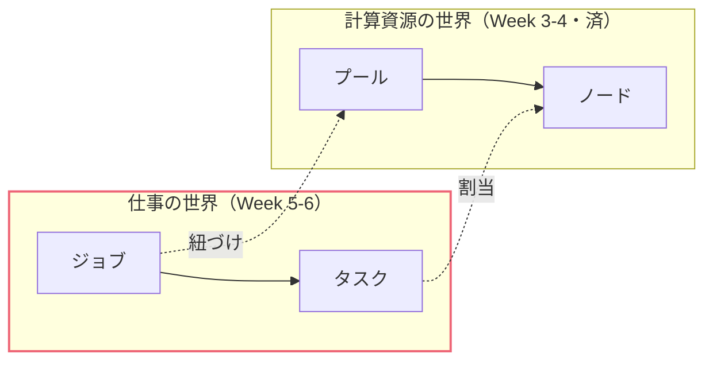
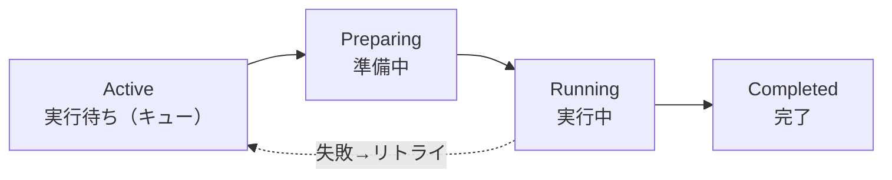
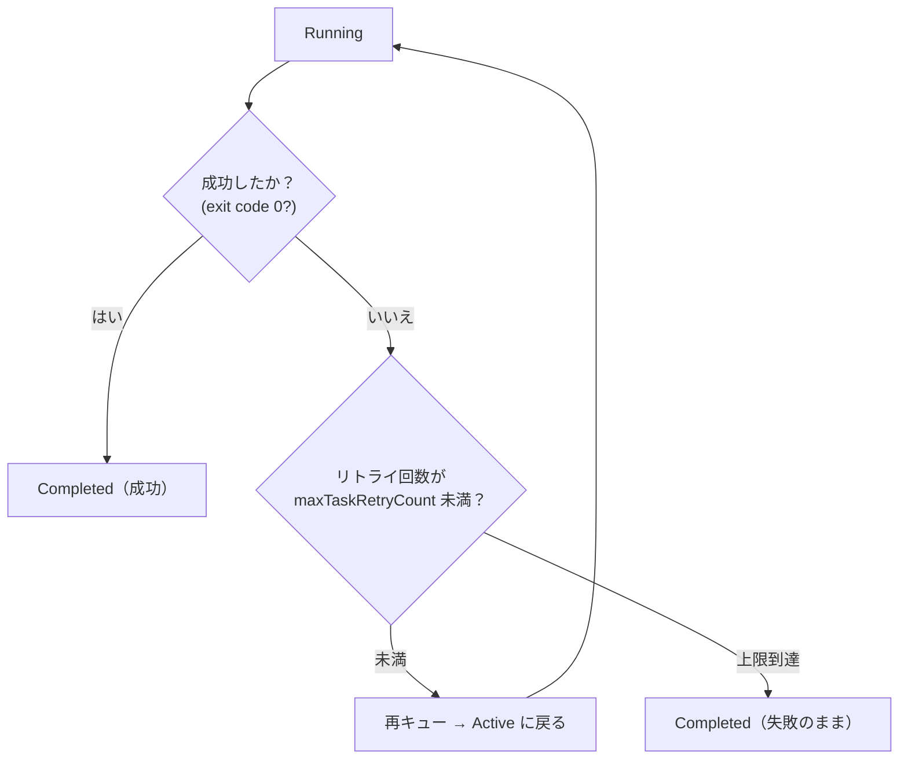
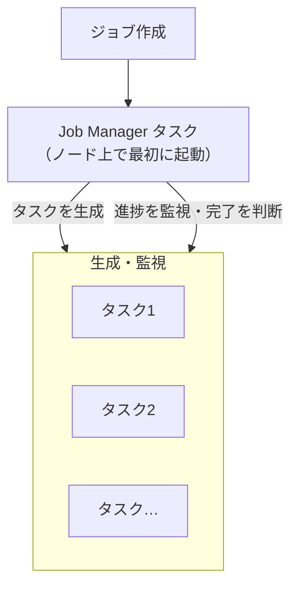
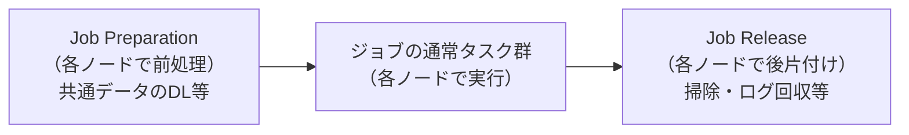
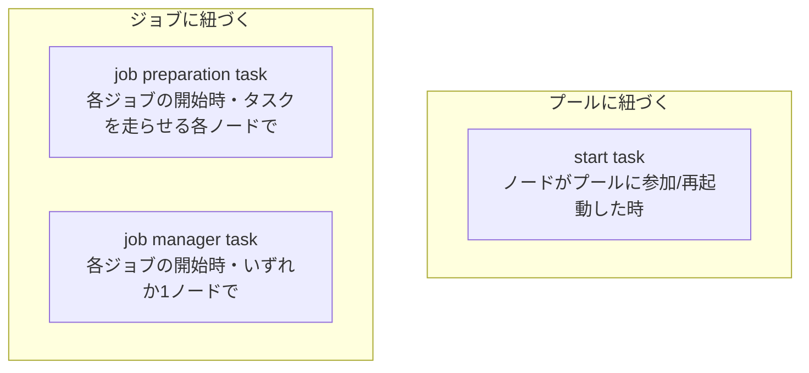
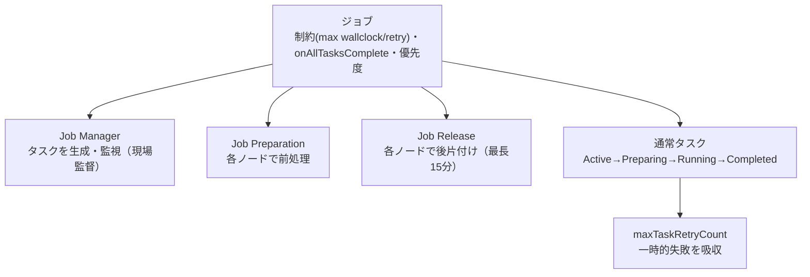

# Week 5 — ジョブとタスク：状態遷移・リトライ・制約と、ジョブを支える特別なタスク

> **Phase 3a** | 学習プラン Week 5 / 10
> 学習目標：タスクの状態遷移（Active → Preparing → Running → Completed）と失敗時のリトライ（`maxTaskRetryCount`）を説明でき、ジョブ／タスクの制約（`constraints`）と全タスク完了時の自動終了（`onAllTasksComplete`）を理解し、**Job Manager／Job Preparation／Job Release タスク**の役割分担と、それぞれが **start task** とどう違うかを説明できる

---

## 0. 今週の位置づけ

Week 3-4 で「計算資源の世界（プール／ノード）」を終えた。今週から**「仕事の世界」＝ジョブとタスク**に入る。

Week 2 の地図で「ジョブにくっつく特別なタスク（Job Manager／Preparation／Release）」の**位置**だけ置いておいた。今週はその**中身**を開ける。加えて、タスクが失敗したときにどう振る舞うか（リトライ・制約）という、**実務で最初につまずくところ**を固める。**タスクの分割設計と依存関係は Week 6** に送る。

---

## 1. タスクの状態遷移とライフサイクル

Week 2 で「タスクは割り当てか、キュー待ちか」の骨格だけ見た。今週はもう少し細かく、タスクの一生を追う。

| 状態 | 意味 |
|---|---|
| **Active** | ジョブに追加され、ノードへの割り当てを待っている（キューの中）。Week 4 の `$ActiveTasks` はこれ |
| **Preparing** | ノードに割り当てられ、実行の準備をしている（リソースファイルのダウンロード等） |
| **Running** | ノード上でコマンドラインを実行中。Week 4 の `$RunningTasks` はこれ |
| **Completed** | 実行が終わった（**成功とは限らない**——失敗して終わったタスクも Completed） |

> **初学者向け用語補足：`Completed` は「成功」ではなく「終わった」**
> 状態としての `Completed` は「もう動いていない＝実行が完了した」を意味するだけで、**成否とは別**。タスクが成功したか失敗したかは、`Completed` になったあとで **exit code（終了コード）** を見て判断する（Week 3 で見た「0＝成功、0 以外＝失敗」）。だから Week 4 のオートスケール変数にも `$SucceededTasks`（成功）と `$FailedTasks`（失敗）が別々にある。「Completed の数」だけ見て安心しないこと——この区別は Week 9 のエラー切り分けの起点になる。

タスクには寿命の制限もある（[Jobs and tasks](https://learn.microsoft.com/en-us/azure/batch/jobs-and-tasks) の Note より）：**ジョブに追加されてから完了まで最大 180 日**、**完了したタスクの情報は 7 日間保持**される。

---

## 2. 失敗とリトライ：`maxTaskRetryCount`

タスクは失敗する——アプリのバグ、入力の不備、そして Week 3 で見た **Spot ノードの横取り**。Batch はこれに対して**リトライ（再試行）**の仕組みを持つ。

> Retrying a task means that if the task fails, it's requeued to run again.
> （タスクのリトライとは、タスクが失敗したら**再びキューに戻して実行し直す**こと）
> — [Jobs and tasks](https://learn.microsoft.com/en-us/azure/batch/jobs-and-tasks)

- **`maxTaskRetryCount`**：失敗したタスクを**最大何回まで**再実行するか。`0` なら再試行なし、`3` なら最大 3 回まで再試行。「常に再試行」「決して再試行しない」も指定できる。
- リトライは「失敗したタスクを Active に戻して別の（または同じ）ノードで走らせ直す」動作。Week 3 の Spot 横取り時の「タスクは別ノードへ自動 requeue」も、この再キューの一種。

> **初学者向け用語補足：リトライが効く失敗・効かない失敗**
> リトライは「**たまたま**失敗した」ものに効く——ノードの一時的な不調、Spot 横取り、ネットワークの瞬断など。逆に「**必ず**失敗する」もの——コードのバグ、存在しない入力ファイルを指定、コマンドの綴り間違い——は、何回やり直しても同じ exit code で失敗する（＝リトライ回数を空費するだけ）。だから `maxTaskRetryCount` は「一時的な失敗を吸収する保険」であって「バグの回避策」ではない、と理解する。

---

## 3. 制約（constraints）：時間とリトライの上限

タスクやジョブが**暴走しない**ように、上限を設けるのが**制約（constraints）**。Week 4 のオートスケール上限（`maxNumberofVMs`）が「台数の暴走」を防いだのと同じ発想で、こちらは「時間とリトライの暴走」を防ぐ。

### 3-1. タスクの制約

タスク作成時に指定できる主な制約（[Jobs and tasks](https://learn.microsoft.com/en-us/azure/batch/jobs-and-tasks) より）：

| 制約 | 意味 |
|---|---|
| **最大実行時間**（max wall-clock time） | タスクが走ってよい最長時間。超えると打ち切り |
| **最大リトライ回数**（`maxTaskRetryCount`） | §2 の再試行上限 |
| **ファイル保持時間**（retention time） | タスクの作業ディレクトリのファイルを保持する時間 |

### 3-2. ジョブの制約

ジョブ全体にも制約を掛けられる（[同ページ](https://learn.microsoft.com/en-us/azure/batch/jobs-and-tasks) の Job constraints）。

> - You can set a **maximum wallclock time**, so that if a job runs for longer than the maximum wallclock time that is specified, the job and all of its tasks are terminated.
> - You can specify the **maximum number of task retries** as a constraint...
> （**最大実行時間**を設定でき、ジョブがそれを超えて走ると**ジョブと全タスクが終了させられる**。**タスクの最大リトライ回数**も制約として指定できる）

> **初学者向け用語補足：wall-clock time（実時間）とは**
> **wall-clock time（ウォールクロック・タイム＝壁掛け時計の時間）**＝「壁の時計で測った、実際に経過した時間」。CPU 時間（CPU が実際に計算に費やした時間）と区別するための言い方。たとえば入力待ちで止まっている間も wall-clock time は進む（CPU 時間は進まない）。Batch の「最大実行時間」は、この**現実の経過時間**で測る。「1 タスクは最長 1 時間まで」と決めておけば、無限ループなどで居座るタスクを自動で打ち切れる。

---

## 4. 全タスク完了時の自動終了：`onAllTasksComplete`

ジョブは、既定では**全タスクが終わっても "active（活動中)" のまま**残る。これを「全タスクが完了したら自動でジョブを終了する」に変えられる。

> By default, jobs remain in the active state when all tasks within the job are complete. You can change this behavior so that the job is automatically terminated when all tasks in the job are complete. Set the job's **onAllTasksComplete** property ... to `terminatejob`...
> （既定では全タスク完了後もジョブは active のまま。`onAllTasksComplete` を `terminatejob` にすると、**全タスク完了時にジョブを自動終了**できる）
> — [Jobs and tasks](https://learn.microsoft.com/en-us/azure/batch/jobs-and-tasks)

| `onAllTasksComplete` の値 | 挙動 |
|---|---|
| **`noaction`**（既定） | 全タスク完了後も何もしない（ジョブは active のまま） |
| **`terminatejob`** | 全タスク完了時にジョブを自動終了する |

> **落とし穴：タスクが 0 個のジョブは「全部完了」とみなされる**
> 公式は「Batch は**タスクが 1 つもないジョブを"全タスク完了"とみなす**」と注意している。だから、ジョブ作成直後（まだタスクを足していない）に `terminatejob` が効くと、**タスクを足す前にジョブが終了**してしまう。回避策は「最初は `noaction` で作り、タスクを全部足し終えてから `terminatejob` に変える」か、**Job Manager タスク**（次節）を使うこと。この "タスク 0＝完了" は、次節で Job Manager が重要になる伏線でもある。

なお、ジョブには**優先度（priority）**も付けられる（-1000〜+1000）。同じプール内では優先度の高いジョブのタスクが先にスケジュールされる（ただし実行中の低優先タスクを横取りはしない）。

---

## 5. 特別なタスク①：Job Manager タスク＝ジョブの「現場監督」

Week 2 で位置だけ置いた特別なタスクの本命に入る。まず **Job Manager タスク**。

これまで「タスクはクライアント（あなたの手元アプリ）が追加する」前提だった。だが「**ジョブの中に、タスクを生成・監視する係を 1 つ置く**」こともできる。それが Job Manager タスク。

> A job manager task contains the information that is necessary to create the required tasks for a job, with the job manager task being run on one of the compute nodes in the pool.
> （Job Manager タスクは、ジョブに必要なタスクを**生成するための情報**を持ち、プール内のいずれかのノード上で実行される）
> — [Jobs and tasks](https://learn.microsoft.com/en-us/azure/batch/jobs-and-tasks)

Job Manager タスクの特徴（同ページより）：

- ジョブ作成時に **Batch が自動でタスクとしてキューに入れる**（あなたが手で追加しなくてよい）
- **他のどのタスクよりも先に**実行される
- 関連するノードは、プール縮小時に**最後まで残される**（監督が先に消えないように）
- 失敗すると**最優先で再起動**される（必要なら他の実行中タスクを止めてでも場所を作る）
- ジョブ全体の終了と、その完了を結びつけられる

> **初学者向け用語補足：クライアントがタスクを足す vs Job Manager が足す**
> - **クライアント方式**：あなたの手元のプログラム（や CLI）が Batch にタスクを 1 個ずつ追加する。手元アプリが動き続けている必要がある。
> - **Job Manager 方式**：タスクを生成する仕事そのものを**ノード上で走る 1 タスク（監督）に委ねる**。手元アプリは「ジョブを作って監督を置く」だけで離れられ、あとはクラウド側で完結する。「入力ファイルを読んで内容に応じてタスクを動的に生成する」ような、**実行時に初めてタスク構成が決まる**ケースで力を発揮する。

### なぜ Job Schedule には Job Manager が必須か

Week 2 で「Job Schedule（繰り返しジョブ）から生成されるジョブには Job Manager が必須」と予告した。理由がここで繋がる。

> A job manager task is required for jobs that are created by a job schedule, because it is the only way to define the tasks before the job is instantiated.
> （Job Schedule で作られるジョブには Job Manager が必須。**ジョブが実体化する前にタスクを定義する唯一の手段**だから）
> — 同ページ

繰り返しジョブは「毎晩、その時が来たら Batch がジョブを自動生成」する（Week 2）。**そのとき、あなたの手元アプリはそこにいない**——だからタスクを足す係をジョブ自身に埋め込んでおく必要がある。それが Job Manager。§4 の「タスク 0＝完了とみなされる」問題も、Job Manager が最初にタスクを生成することで自然に解決する。

---

## 6. 特別なタスク②③：Job Preparation / Release タスク＝各ノードの前処理・後片付け

もう 1 組の特別なタスクが **Job Preparation（前処理）** と **Job Release（後片付け）**。ジョブの前後で、**タスクを走らせる各ノード上で**準備と掃除を行う。

> - A job preparation task runs before a job's tasks, on all compute nodes scheduled to run at least one task.
> - A job release task runs once the job is completed, on each node in the pool that ran a job preparation task.
> （Job Preparation タスクは、ジョブのタスク実行前に、**タスクを 1 つ以上走らせる予定の全ノード**で走る。Job Release タスクは、ジョブ完了後に、**Job Preparation を走らせた各ノード**で走る）
> — [Job preparation and release tasks](https://learn.microsoft.com/en-us/azure/batch/batch-job-prep-release)

典型的な使いどころ（同ページ）：

- **共通データの事前ダウンロード**：例）日次リスク計算で、全タスクが共通で使う市場データ（数 GB）を、各ノードに**一度だけ**前処理でダウンロードしておく → 各タスクはそれを使い回す
- **ジョブ間のデータ削除**：共有プールでノードが使い回されるとき、後片付けで前回のデータを消してディスクを空ける／セキュリティポリシーを満たす
- **ログの保全**：後片付けで、タスクが出したログやクラッシュダンプを圧縮して Storage にアップロード

Job Release タスクは、ジョブを **terminate（終了）** または **delete（削除）** したときに走り、**最長 15 分**で打ち切られる。

### start task / job preparation / job manager の違いを固定する

似た「準備系」タスクが 3 つ出てきたので、**いつ・どこで走るか**で明確に区別する。ここが今週で最も混乱しやすい。

| タスク | 紐づく先 | いつ走るか | どのノードで | 主目的 |
|---|---|---|---|---|
| **start task** | プール | ノードが**プールに参加・再起動**したとき | そのノード | ノード環境の初期化（アプリ導入） |
| **job preparation** | ジョブ | **各ジョブの開始時**（タスクの前） | タスクを走らせる**各ノード** | そのジョブ固有の共通準備 |
| **job manager** | ジョブ | **各ジョブの開始時**（最初に） | プール内の**いずれか 1 ノード** | タスクの生成・監視（現場監督） |

公式が明言する決定的な違い：

> `BatchJobPreparationTask` runs at the start of each job, whereas `StartTask` runs only when a compute node first joins a pool or restarts.
> （job preparation は**各ジョブの開始時**に走るのに対し、start task はノードが**プールに初めて参加/再起動**したときだけ走る）
> — 同ページ

> **初学者向け用語補足：例えるなら「店の開店準備」の三段構え**
> - **start task**＝**建物に電気・水道を引く**（そのノードがプールに入るとき一度きり／再起動時）。誰がどんな営業をするかに関係なく、まず設備を通す。
> - **job preparation**＝**今日のイベント用の食材を各厨房に配る**（そのジョブ固有・毎回・タスクを担う各ノードで）。ジョブが変われば準備も変わる。
> - **job manager**＝**今日の現場を仕切る店長**（そのジョブの開始時に 1 人・作業指示＝タスクを出し、進捗を見る）。
>
> なお job preparation と job manager がどちらもあるジョブでは、**job preparation → job manager → 他のタスク**の順に走る（job preparation が常に最初）。

---

## 7. Week 5 全体の整理

### 重要な用語まとめ

| 用語 | 一言説明 |
|---|---|
| タスクの状態 | Active（待ち）→ Preparing（準備）→ Running（実行）→ Completed（終了・成否は別） |
| exit code | 0＝成功、0 以外＝失敗。Completed だけでは成否は分からない |
| `maxTaskRetryCount` | 失敗タスクの再試行上限。一時的失敗の保険（バグには無力） |
| constraints | 最大実行時間（wall-clock）・リトライ回数・ファイル保持時間などの上限 |
| `onAllTasksComplete` | `noaction`（既定）／`terminatejob`（全タスク完了で自動終了）。タスク 0 は「完了」扱いに注意 |
| Job Manager タスク | ジョブ内でタスクを生成・監視する現場監督。自動起動・最初に実行・Job Schedule に必須 |
| Job Preparation タスク | 各ジョブ開始時に、タスクを走らせる各ノードで前処理（共通データ DL 等） |
| Job Release タスク | ジョブ完了/削除時に、prep を走らせた各ノードで後片付け（最長 15 分） |
| start task との違い | start task＝ノードのプール参加/再起動時、job prep＝各ジョブ開始時 |

---

## ハンズオン チェックリスト

Week 3 のプールに、制約と特別なタスクを付けたジョブを流してみる。

- [ ] タスクを 1 つ作り、`Active → Preparing → Running → Completed` と状態が進むのを Portal で観察した
- [ ] **わざと失敗する**タスク（例：`/bin/sh -c "exit 1"`）を作り、`maxTaskRetryCount` を 2 に設定して、リトライされる様子と最終的に失敗（exit code 1）で終わるのを確認した
- [ ] ジョブに **maximum wall-clock time**（例：数分）を設定し、長く走るタスクが打ち切られることを確認した（任意）
- [ ] ジョブの `onAllTasksComplete` を `terminatejob` にして、全タスク完了時にジョブが自動終了するのを確認した
- [ ]（任意）**Job Preparation タスク**（例：`/bin/sh -c "echo prep > $AZ_BATCH_NODE_SHARED_DIR/common.txt"`）と **Job Release タスク**（そのファイルを削除）を付け、Portal の「Preparation tasks / Release tasks」で結果を確認した
- [ ] 観察後、プールを削除して課金を止めた

---

## 自己チェック

週末にドキュメントを閉じて答えてみる。

1. **`Completed` になったタスクは成功したと言えるか？ 成否はどう判断するか？**
   - キーワード：Completed は「終わった」だけ、成否は exit code（0＝成功）、`$SucceededTasks`/`$FailedTasks`
2. **`maxTaskRetryCount` が効く失敗と効かない失敗の違いは？**
   - キーワード：一時的失敗（Spot 横取り・瞬断）には効く、バグや入力不備など必ず失敗するものには無力
3. **`onAllTasksComplete` を `terminatejob` にするとき、なぜ「タスク 0」に注意が要るか？**
   - キーワード：タスク 0 は全完了扱い、足す前に終了しかねない、noaction で作って後で変える／Job Manager を使う
4. **Job Manager タスクは何をし、なぜ Job Schedule に必須か？**
   - キーワード：ジョブ内でタスクを生成・監視、自動起動・最初に実行、繰り返しジョブは手元アプリ不在なのでタスク定義手段が必要
5. **start task と job preparation task の違いを一言で？**
   - キーワード：start task＝ノードのプール参加/再起動時、job prep＝各ジョブ開始時にタスクを走らせる各ノードで

---

## 次週の予告（Week 6）

1 つの仕事を**多数のタスクに分割し、順序関係を表現する**方法を学ぶ：

- 仕事をタスクへ分割する設計（1 タスク＝どの粒度にするか）
- **タスク依存（task dependencies）**：`taskB は taskA の完了後に実行`／範囲依存など
- 依存を有効化する手順と、Week 4 の `$ActiveTasks`（依存が満たされたものだけ数える）との関係
- **Multi-instance タスク**と **MPI（Message Passing Interface）**：複数ノードを束ねる密結合並列の俯瞰
- Week 3 の「Spot は長い MPI に不向き」がここで腑に落ちる
