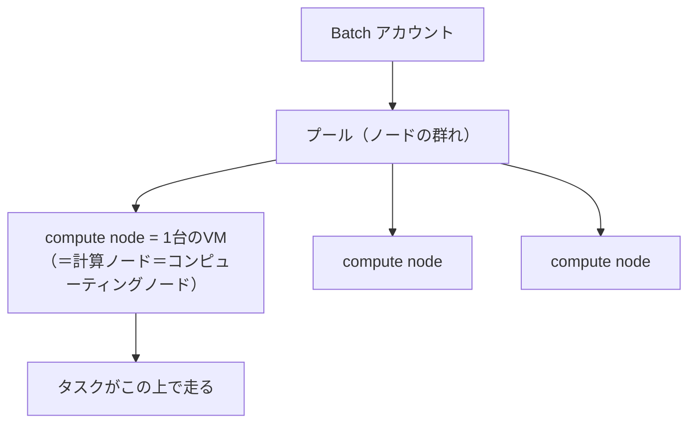
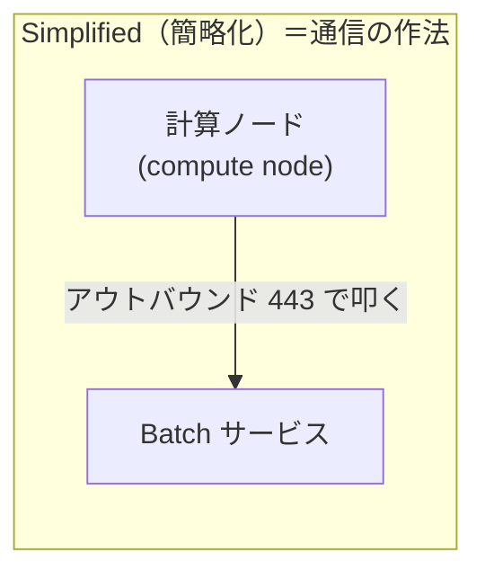

# 計算ノード＝コンピューティングノード＝compute node（用語の揺れ整理）

> **機能別まとめ（topic note）** | 学習プラン（notes/）とは別に、深掘りした機能を単体でまとめた学習メモ。
> 関連トピック：[node-communication-mode.md](node-communication-mode.md)。

---

## 0. 要点（先に結論）

- **「計算ノード」「コンピューティング ノード」「Batch 計算ノード」は全部同じもの**＝英語 **"compute node"** の訳語が揺れているだけ。指すのは**プール内の 1 台の VM**。
- 一方 **「Simplified 計算ノード通信」は"ノードそのもの"ではなく、そのノードと Batch サービスの"通信の作法（モード）"** の話。別カテゴリなので混同しない。

---

## 1. 訳語の揺れ：全部 "compute node"

Microsoft の日本語ドキュメントは、英語の **"compute node"** を場所によって「計算ノード」と訳したり「コンピューティング ノード」と訳したりする。**指すものは同一**。

| 日本語表記 | 英語（原語） | 中身 |
|---|---|---|
| 計算ノード | compute node | 同じ |
| コンピューティング ノード | compute node | 同じ |
| Batch 計算ノード | Batch compute node | 同じ（「Azure Batch の文脈での compute node」というだけ） |
| ノード | node | 同じ（省略形） |

> ドキュメントで表記が変わっても「＝compute node」と読み替えれば迷わない。

---

## 2. compute node（計算ノード）とは何か

**プール内の 1 台の仮想マシン（VM）**。タスクが実際に走る場所。

公式定義：
> a *compute node* (or *node*) is a virtual machine that processes a portion of your application's workload.
> （コンピューティングノード（ノード）とは、アプリのワークロードの一部を処理する仮想マシン）

- VM サイズが、そのノードの **CPU コア数・メモリ・ローカルディスク**を決める。
- **使い捨て**：プールから外れると中身は消える。だから入出力は Storage 経由。
- 状態（Idle/Running/Unusable など）を持つ。

---

## 3. 「Simplified 計算ノード通信」は別カテゴリ（混同注意）

**Simplified compute node communication（簡略化計算ノード通信）** は、**"ノードそのもの"ではなく、そのノードが Batch サービスと"どう通信するか"のモード**（詳細は [node-communication-mode.md](node-communication-mode.md)）。

- **計算ノード（compute node）** ＝ 登場人物（プール内の 1 台の VM）。
- **Simplified 計算ノード通信** ＝ その登場人物と Batch サービスの間の**通信の向き・作法**（ノード→Batch のアウトバウンド）。

「compute node」という同じ単語が名詞（ノード）にも修飾語（"compute node communication"＝ノードの通信）にも使われるため紛らわしいが、**片方はモノ、片方は通信方式**と切り分ける。

---

## 用語まとめ

| 用語 | 一言 |
|---|---|
| 計算ノード／コンピューティング ノード／Batch 計算ノード／ノード | 全部同じ＝**compute node**＝プール内の 1 台の VM |
| compute node の役割 | タスクが走る場所。VM サイズで CPU/メモリ/ディスクが決まる。使い捨て |
| Simplified 計算ノード通信 | ノード⇄Batch の**通信モード**（ノードそのものではない）。別カテゴリ |
