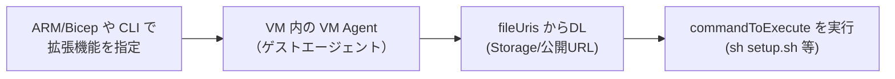
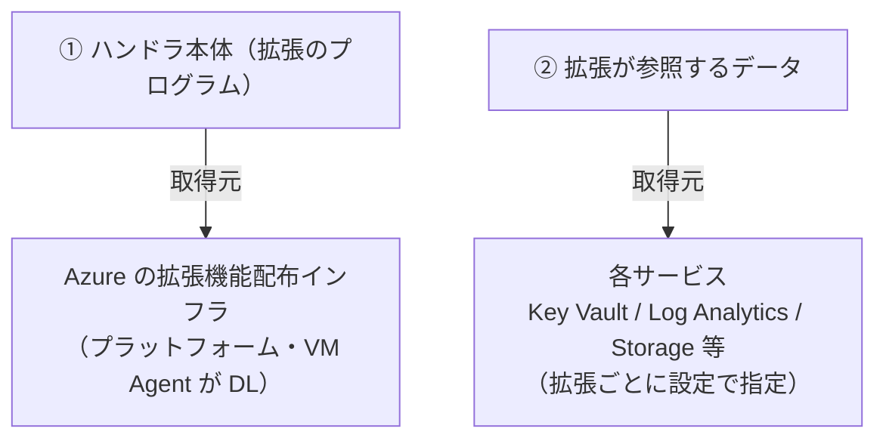

# カスタムスクリプト — Batch のノードで自分のスクリプトを走らせる（Linux 検証済み）

> **機能別まとめ（topic note）** | 学習プラン（notes/）とは別に、深掘り＋実機検証した内容を単体でまとめた学習メモ。
> 関連トピック：[node-communication-mode.md](node-communication-mode.md)、[compute-node-terminology.md](compute-node-terminology.md)。

---

## 0. この文書の要点（先に結論）

- **素の Azure VM** には「Custom Script Extension」＝スクリプトを DL して実行する VM 拡張機能がある。
- **Batch のプールでは `CustomScript` タイプは Batch 予約で使えない**（Batch が内部でノード構成に使用）。
- **Batch で自分のスクリプトを走らせる正攻法は `start task`**（＋タスクのコマンドライン）。スクリプト本体は resource file として配る。
- **Linux・インターネット経由（公開 URL からの DL）で start task を実機検証し、成功を確認済み**（§3）。
- 「今回 CustomScript 拡張を使ったか？」は **pool.json に `type: CustomScript` があるか**で判定でき、今回は使っていない＝start task（§4）。

---

## 1. Custom Script Extension とは（素の Azure VM の話）

**Custom Script Extension（カスタムスクリプト拡張機能）** ＝ Azure が用意した VM 拡張機能で、「VM 作成後に、指定したスクリプトを落として実行する」もの。デプロイ後の構成・ソフト導入・管理タスクの自動化に使う定番。



- **`fileUris`**：ダウンロードするスクリプト/ファイルの場所（Storage/公開 URL）
- **`commandToExecute`**：実行コマンド
- **`protectedSettings`**：暗号化して渡す秘密（Storage キー等）
- **型番（publisher/type）**：Linux＝`Microsoft.Azure.Extensions` の `CustomScript`、Windows＝`Microsoft.Compute` の `CustomScriptExtension`

出典：[Custom Script Extension for Linux](https://learn.microsoft.com/ja-jp/azure/virtual-machines/extensions/custom-script-linux)、[for Windows](https://learn.microsoft.com/en-us/azure/virtual-machines/extensions/custom-script-windows)

---

## 2. Batch では `CustomScript` は予約済み → `start task` を使う

Batch のプールに拡張機能は付けられる（[Use extensions with Batch pools](https://learn.microsoft.com/en-us/azure/batch/create-pool-extensions)）が、公式は明記：

> The CustomScript extension type is reserved for the Azure Batch service and can't be overridden.

理由：**Batch はノードのブートストラップ（node agent 導入・start task 実行など）に Custom Script Extension を内部利用している**。ユーザーが同じ型を足すと衝突する。

**「カスタムスクリプトを使えない」わけではない**——塞がれているのは "Custom Script Extension という 1 つの入口" だけで、Batch には同じ役割の入口（start task）がある。

### start task と Custom Script Extension の対応

| Custom Script Extension（素の VM） | Batch の start task |
|---|---|
| `fileUris`（DL するファイル） | `resourceFiles[].httpUrl`（インターネット）／`autoStorageContainerName`・`storageContainerUrl`（Storage） |
| `commandToExecute`（実行コマンド） | start task の `commandLine` |
| `script`（base64 インライン） | `commandLine` に直接書く／resource file 化 |
| `managedIdentity`（private Blob を秘密なしDL） | プールのマネージドID ＋ `resourceFiles[].identityReference` |
| VM Agent が実行 | Batch node agent が実行 |

### Batch で自分のスクリプトを走らせる手段一覧

| やりたいこと | 手段 |
|---|---|
| ノード起動時の初期化 | **start task** |
| ジョブごとの前処理/後処理 | **job preparation / release task** |
| 実際の処理そのもの | **タスクのコマンドライン** |
| バイナリ/スクリプトの配布 | **Application Packages** ＋ start task |

---

## 3. Linux・インターネット経由で start task を検証（実施・成功）

**公開 URL（GitHub raw）からスクリプトを DL して start task で実行**する構成を実機検証し、成功を確認した。

### 3-1. スクリプトを公開 URL に置く

`setup.sh`（環境情報を出力し、共有ディレクトリに印を残す。冪等に）：

```bash
#!/bin/bash
echo "=== start task begin ==="
echo "Host: $(hostname)"
echo "User: $(whoami)"
date -u +%FT%TZ > "$AZ_BATCH_NODE_SHARED_DIR/started.txt"
echo "=== start task done ==="
exit 0
```

**Azure 認証なしで GET できる URL** に置く（＝インターネット経由）。GitHub なら **Public リポジトリ**にして raw URL を使う：

```text
https://raw.githubusercontent.com/<user>/<repo>/main/setup.sh
```

> **⚠️ ポイント**
> - リポジトリは **Public**（Private だと raw URL がトークン必須になり「認証なし DL」が崩れる）。
> - **改行は LF**（start task は CSE と違い CRLF→LF 自動変換をしない。CRLF だと `bad interpreter` で失敗）。
> - 事前確認：`curl -I "<URL>"` で `200` が返るか。

### 3-2. アカウント〜プール作成

```bash
az login
RG=rg-batch-linux; LOC=japaneast
SA=batchlnx$RANDOM; BA=batchlnx$RANDOM
POOL=linux-inet-pool

az group create -n $RG -l $LOC
az storage account create -n $SA -g $RG -l $LOC --sku Standard_LRS --kind StorageV2
az batch account create -n $BA -g $RG -l $LOC --storage-account $SA
az batch account login -g $RG -n $BA
```

`pool.json`（`<SCRIPT_URL>` を Public raw URL に置換）：

```json
{
  "id": "linux-inet-pool",
  "vmSize": "STANDARD_D2S_V3",
  "virtualMachineConfiguration": {
    "imageReference": {
      "publisher": "canonical",
      "offer": "0001-com-ubuntu-server-jammy",
      "sku": "22_04-lts",
      "version": "latest"
    },
    "nodeAgentSKUId": "batch.node.ubuntu 22.04"
  },
  "targetDedicatedNodes": 1,
  "targetNodeCommunicationMode": "simplified",
  "startTask": {
    "commandLine": "/bin/bash -c \"sh setup.sh\"",
    "resourceFiles": [
      { "httpUrl": "<SCRIPT_URL>", "filePath": "setup.sh" }
    ],
    "userIdentity": { "autoUser": { "scope": "pool", "elevationLevel": "admin" } },
    "waitForSuccess": true,
    "maxTaskRetryCount": 1
  }
}
```

```bash
az batch pool create --json-file pool.json
```

- **Ubuntu イメージ＋対応 `nodeAgentSKUId`** を組で。
- `httpUrl`＝公開 URL なので **SAS 不要**。resource file は start task 作業ディレクトリに落ち、`sh setup.sh` で実行。
- `simplified` 通信＋既定パブリック IP なので、ノードはインターネットへ出られ URL に到達可能。

### 3-3. 検証コマンドと「実際の結果」

```bash
az batch node list --pool-id $POOL --query "[].{id:id, state:state}" -o table
NODE=$(az batch node list --pool-id $POOL --query "[0].id" -o tsv)

az batch node show --pool-id $POOL --node-id $NODE \
  --query "{state:state, result:startTaskInfo.result, exitCode:startTaskInfo.exitCode, failure:startTaskInfo.failureInfo}"

az batch node file download --pool-id $POOL --node-id $NODE \
  --file-path "startup/stdout.txt" --destination ./st-stdout.txt
az batch node file download --pool-id $POOL --node-id $NODE \
  --file-path "startup/stderr.txt" --destination ./st-stderr.txt
cat ./st-stdout.txt ./st-stderr.txt
```

**実際に得られた結果（成功の証跡）**：

```json
{ "exitCode": 0, "failure": null, "result": "success", "state": "idle" }
```

```text
# startup/stdout.txt
=== start task begin ===
Host: 653063a4bbac4062900793e6f840ac0e000000
User: root
=== start task done ===
# startup/stderr.txt は空
```

読み解き：

| 観測 | 意味 |
|---|---|
| `state: idle` / `result: success` / `exitCode: 0` | 公開 URL から DL → 実行まで成功 |
| stdout に begin/done | スクリプトが実際に走って出力した |
| `Host: 653063a4...` | そのノード（VM）の内部ホスト名（使い捨て名） |
| `User: root` | `elevationLevel: admin` → root（管理者）で実行された証拠 |
| stderr 空 | エラーなし |

### 3-4. 後片付け（課金停止）

```bash
az batch pool delete --pool-id $POOL
az group delete -n $RG
```

> ノードは動いている間だけ課金される（Batch 本体は無料）。学習後は必ずプールを畳む。

---

## 4. 「start task か CustomScript 拡張か」の判定

今回の検証は **CustomScript 拡張ではなく start task**。判定方法は 3 つ。

**① pool.json の形を見る（最も確実）**

| CustomScript 拡張を使っている印 | 今回の pool.json |
|---|---|
| `"publisher": "Microsoft.Azure.Extensions"` / `"type": "CustomScript"` | **無し** |
| `extensions: [...]`（VM 拡張の配列） | **無し** |
| `settings`/`protectedSettings`/`commandToExecute`/`fileUris` | **無し** |
| — | `startTask` があるだけ |

そもそも `type: CustomScript` を Batch プールに書いても予約済みで拒否される。

**② `az batch pool show` で確認**

```bash
az batch pool show --pool-id $POOL \
  --query "{startTask: startTask.commandLine, extensions: virtualMachineConfiguration.extensions}"
```
→ `startTask` に中身、`extensions` は null。

**③ 出力ファイルの場所で見分ける**

| 機構 | ログの場所 |
|---|---|
| **start task（今回）** | `startup/stdout.txt` / `startup/stderr.txt` |
| **CustomScript 拡張** | `/var/lib/waagent/custom-script/download/0/`、`/var/log/azure/custom-script/handler.log` |

今回は `startup/stdout.txt` に出た＝**start task を使った確定**。

> **注意（内部利用）**：Batch はノード構成の内部処理に Batch 自身の CustomScript 拡張を裏で使う（だから予約）。＝ノード上には Batch のものとして存在しうるが、**ユーザーの構成としては使っていない/追加できない**。

---

## 5. Batch プールの拡張機能まわりの地図

### 5-1. 拡張機能は「許可リスト制」（VM のように自由には足せない）

| 制約 | 内容 |
|---|---|
| **許可リスト制** | [公式一覧](https://learn.microsoft.com/en-us/azure/batch/create-pool-extensions)の拡張のみ（Key Vault / Azure Monitor / DSC / Diagnostics / HPC GPU ドライバ / Antimalware / Application Health / Guest Attestation 等）。他はサポートリクエストで申請 |
| **CustomScript は予約** | 追加不可（§2） |
| **作成時のみ** | 既存プールに後から追加/変更できない。プール作り直しが必要 |
| **VM Configuration 限定** | Cloud Service Configuration は不可 |

### 5-2. 拡張機能の「取得」は 2 種類ある



- **①ハンドラ本体**の取得元は **Azure の拡張機能配布インフラ**。ユーザーは場所を指定できない。**Batch 管理ノードサービスエンドポイントではない。**
- **②参照データ**は各サービスから。**拡張ごとに設定で指定できる**（例：Key Vault 拡張の `observedCertificates`）。ただし CustomScript のように任意 URL でスクリプトを引く用途は不可。

### 5-3. ノードが使うエンドポイントは用途ごとに別

| エンドポイント/依存 | 何のため | 拡張との関係 |
|---|---|---|
| **BatchNodeManagement.\<region\>**（ノード管理EP） | ノード ⇄ Batch サービスのインフラ通信 | 拡張の DL 元では**ない** |
| **WireServer `168.63.129.16`** | VM Agent が Azure から**拡張の設定・ゴール状態**を取得（TCP 80/32526） | 拡張が動くのに**必須** |
| **Azure 拡張機能配布インフラ** | 拡張ハンドラ本体の DL | ①の取得元 |
| **`169.254.169.254`（IMDS）** | マネージドID トークン | ②で MI 認証時 |

> **WireServer 168.63.129.16**＝Azure が各 VM に見せる特別な仮想パブリック IP（全リージョン共通・不変・UDR/NSG 対象外・インターネット非到達）。VM Agent が「Ready 通知・入れる拡張のゴール状態取得・DNS・DHCP・LB ヘルスプローブ」に使う。**ここをノード内 FW/プロキシで塞ぐと拡張機能が必ず失敗**する。出典：[What is IP address 168.63.129.16](https://learn.microsoft.com/en-us/azure/virtual-network/what-is-ip-address-168-63-129-16)

> だから「拡張機能エラー」＝「Batch 管理ノードEP からの DL 失敗」ではなく、多くは **WireServer 到達不可**か**拡張固有の参照先失敗**。一方 Batch 管理ノードEP に届かないと、拡張エラーではなく**ノードが `unusable`** になる（レイヤーが別）。

---

## 6. ダウンロード失敗のトラブルシュート（内部/インターネット/Storage）

プール構成中に DL する重要ファイルは **① start task の resource file ② application package ③ コンテナイメージ**。どれで失敗したかで症状（ノード状態）が変わる。

| DL 対象 | 失敗時のノード状態 | 見る場所 |
|---|---|---|
| start task の resource file | `starttaskfailed` | `startup/stderr.txt`・`startTaskInfo.failureInfo` |
| application package | **`unusable`**（自動回復されない） | `computeNodeError` |
| コンテナイメージ | **`unusable`** | `computeNodeError` |

### 共通の被疑
- **ノードが外に出られない**：NSG/UDR/FW で outbound 443 ブロック、パブリック IP/NAT 無し。
- **simplified＋`publicNetworkAccess=Disabled` で `nodeManagement` PE 未設定** → DL 以前にノードが Batch に届かず `unusable`。
- **DNS 解決失敗**（VNet のカスタム DNS）、**ディスク満杯**。

### インターネット経由に固有
- URL が実は非公開（private repo → 403/404）、SAS 付きなら期限切れ。
- アウトバウンド インターネットが閉じている、プロキシ未設定、URL タイポ（404）。

### Azure Storage 経由に固有
- **403**：SAS 期限切れ/権限不足、`storageAccountKey` 誤り、**マネージドID に `Storage Blob Data Reader` 未付与**、`autoStorageContainerName` なのに Storage 未紐づけ。
- **Storage アカウントのファイアウォール**がプールの送信 IP/サブネットを未許可（→ timeout）。**最頻出**。
- **simplified の egress ロックダウンの罠**：simplified は `Storage.<region>` へのアウトバウンドがベースライン不要。「BatchNodeManagement だけ許可」に絞ると、**resource files / app package 用の Storage が塞がれて DL 失敗**。→ その Storage 宛て egress を明示的に開ける。
- App Packages / ファイルマウントは、ファイアウォール有効 or 階層型名前空間(HNS)有効の Storage では使えない。

### 切り分けの最短手順
1. **ノード状態**（`starttaskfailed` か `unusable` か）。
2. `starttaskfailed` → **`startup/stderr.txt` の HTTP ステータス**で 403/404/timeout を二分。
3. `unusable` → **`computeNodeError`**（app package/コンテナ DL 失敗 or 通信不可）。
4. 403→認証 or Storage FW／404→URL／timeout→egress/DNS（simplified の Storage 明示許可・NSG・publicNetworkAccess）。

---

## 7. Windows 版検証手順（参考）

Windows・Storage 経由（Blob＋SAS）で PowerShell を start task 実行する場合の要点（Linux 版との違いだけ）：

- イメージ：`MicrosoftWindowsServer / WindowsServer / 2022-datacenter-core`、`nodeAgentSKUId: "batch.node.windows amd64"`。
- スクリプトを Blob へ上げ、**read SAS**（`az storage blob generate-sas --permissions r --as-user --auth-mode login`）付き URL を `resourceFiles[].httpUrl` に。
- `commandLine`：`cmd /c "powershell -ExecutionPolicy Bypass -File setup.ps1"`。
- 検証は同じく `startup/stdout.txt`・`startTaskInfo`。CustomScript 拡張なら `C:\WindowsAzure\Logs\Plugins\Microsoft.Compute.CustomScriptExtension\<version>\CustomScriptHandler.log` に出る（今回は start task なので startup/）。

---

## 8. 公開情報・GitHub 事例（DL 失敗系）

- [Troubleshooting Windows VM extension failures](https://learn.microsoft.com/en-us/azure/virtual-machines/extensions/troubleshoot)
- [VM extension provisioning errors in VMSS](https://learn.microsoft.com/en-us/troubleshoot/azure/virtual-machine-scale-sets/extensions/vm-extension-provisioning-errors)
- [azure-quickstart-templates #4010 — "Failed to download all specified files"](https://github.com/Azure/azure-quickstart-templates/issues/4010)
- [azure-pipelines-tasks #19271 — CustomScriptExtension on VMSS provisioning failure](https://github.com/microsoft/azure-pipelines-tasks/issues/19271)
- [custom-script-extension-linux #165 — HTTP 403 with user-assigned managed identity](https://github.com/Azure/custom-script-extension-linux/issues/165)
- [custom-script-extension-linux #168 — download failed: 404](https://github.com/Azure/custom-script-extension-linux/issues/168)

> 検索キーとして最も当たりが良いのはエラー文字列 **「Failed to download all specified files」**＋HTTP ステータス。

---

## 用語まとめ

| 用語 | 一言 |
|---|---|
| Custom Script Extension | 素の VM 拡張。fileUris を DL し commandToExecute を実行 |
| `CustomScript` 予約 | Batch が内部利用中でユーザーは追加不可。代わりに start task |
| start task | Batch 版のカスタムスクリプト実行（ノード起動時） |
| resourceFiles / httpUrl | start task に渡す DL ファイル（公開 URL は認証不要） |
| `startup/stdout.txt` | start task の標準出力（検証の第一の窓口） |
| 判定（start task か拡張か） | pool.json に `type: CustomScript` があるか。出力が startup/ に出れば start task |
| 拡張機能の 2 種類 DL | ①ハンドラ本体＝Azure 配布インフラ（指定不可）②参照データ＝各サービス（設定で指定） |
| WireServer 168.63.129.16 | VM Agent が拡張のゴール状態を取る特別 IP。塞ぐと拡張が失敗 |
| DL 失敗の症状 | resource file→`starttaskfailed`／app package・コンテナ→`unusable` |
