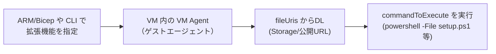
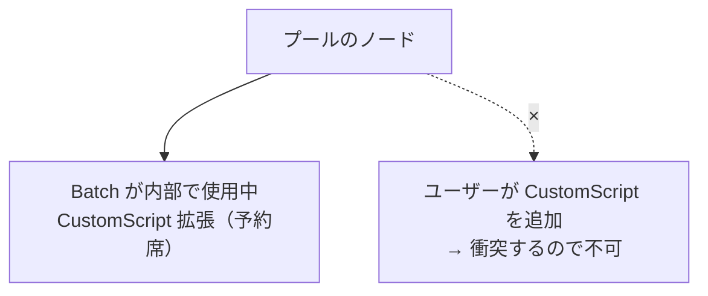
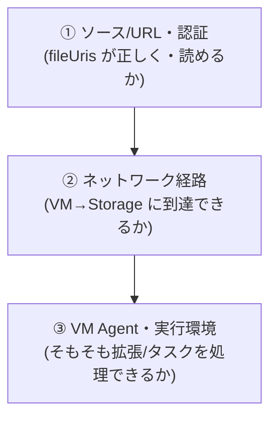

# カスタムスクリプト — Batch のノードで自分のスクリプトを走らせる

> **機能別まとめ（topic note）** | Week 別カリキュラムとは独立した、製品の特定機能の学習メモ。
> 関連 Week：プール/ノード・start task は [notes/week3.md](../notes/week3.md)、入出力（resource files）は [notes/week7.md](../notes/week7.md)、認証は [notes/week8.md](../notes/week8.md)、エラー切り分けは [notes/week9.md](../notes/week9.md)。

---

## 0. この文書の要点（先に結論）

- **素の Azure VM** には「Custom Script Extension」という、スクリプトを落として実行する VM 拡張機能がある。
- **Batch のプールでは、この `CustomScript` タイプは Batch サービスが予約済みで使えない**（Batch が内部でノード構成に使っているため）。
- **Batch でユーザーが自分のスクリプトを走らせる正攻法は `start task`**（ノード起動時）や**タスクのコマンドライン**。スクリプト本体は Blob の resource file として配る。
- 失敗の最頻ポイントは「**スクリプトのダウンロード**」——素の VM 拡張でも Batch の start task でも、SAS/権限（403）と Storage 到達性（timeout）が二大原因。

---

## 1. Custom Script Extension とは（素の Azure VM の話）

**Custom Script Extension（カスタムスクリプト拡張機能）** ＝ Azure が用意した VM 拡張機能で、「VM 作成後に、指定したスクリプトを落として実行する」もの。デプロイ後の構成・ソフト導入・管理タスクの自動化に使う定番。



- **`fileUris`**：ダウンロードするスクリプト/ファイルの場所（Storage/公開 URL）
- **`commandToExecute`**：実行コマンド
- **`protectedSettings`**：暗号化して渡す秘密（Storage キー等）。ログ/履歴に平文で残らない
- **型番（publisher/type）**：Linux＝`Microsoft.Azure.Extensions` の `CustomScript`、Windows＝`Microsoft.Compute` の `CustomScriptExtension`

> **VM Agent（ゲストエージェント）**：VM 内に最初から常駐し（Linux は `waagent`、Windows は VM Agent）、Azure からの「この拡張を入れて」を受けて実際に DL・実行する。Batch の **node agent**（[week3](../notes/week3.md)）が「Batch↔ノードの橋渡し」なのに対し、こちらは「Azure↔VM の橋渡し」。

出典：[Azure Custom Script Extension for Windows](https://learn.microsoft.com/en-us/azure/virtual-machines/extensions/custom-script-windows)、[VM extensions overview](https://learn.microsoft.com/en-us/azure/virtual-machines/extensions/overview)

---

## 2. Batch では `CustomScript` は予約済み → `start task` を使う

Batch のプールに拡張機能を付けられる（[Use extensions with Batch pools](https://learn.microsoft.com/en-us/azure/batch/create-pool-extensions)）が、公式は明記する：

> The CustomScript extension type is reserved for the Azure Batch service and can't be overridden.
> （`CustomScript` タイプは Azure Batch サービスの予約で、上書きできない）

理由：**Batch はノードのブートストラップ（node agent 導入・start task 実行など）に Custom Script Extension を内部利用している**。ユーザーが同じ型を足すと衝突する。



**「カスタムスクリプトを使えない」わけではない**——塞がれているのは "Custom Script Extension という 1 つの入口" だけ。Batch には同じ役割の入口が用意されている。

### start task と Custom Script Extension の対応

| Custom Script Extension（素の VM） | Batch の start task（[week3](../notes/week3.md)） |
|---|---|
| `fileUris`（DL するファイル） | resource files（Blob から DL／[week7](../notes/week7.md)） |
| `commandToExecute`（実行コマンド） | start task の `commandLine` |
| VM Agent が実行 | Batch node agent が実行 |
| 拡張ごとの instanceView / status | ノード状態・`startTaskInfo`・stdout/stderr |

> 要するに **start task は「Custom Script Extension の Batch 版」**。Batch はその VM 版を内部で使い、ユーザー向けには start task という顔で同じ能力を提供している。

### Batch で自分のスクリプトを走らせる手段一覧

| やりたいこと | 手段 | 週 |
|---|---|---|
| ノード起動時の初期化 | **start task** | week3 |
| ジョブごとの前処理/後処理 | **job preparation / release task** | week5 |
| 実際の処理そのもの | **タスクのコマンドライン** | week5 |
| バイナリ/スクリプトの配布 | **Application Packages** ＋ start task | week7 |

---

## 3. Windows カスタムスクリプト検証手順（アカウント作成 → 検証 → 後片付け）

Batch アカウントを新規に作り、**Windows ノードで PowerShell スクリプトを start task として実行**して検証する一連（Azure CLI）。前提：`az login` 済み、割り当てモードは既定の Batch service（別まとめ参照）。

### Phase 1. 変数とアカウント作成

```bash
az login
RG=rg-batch-cse; LOC=japaneast
SA=batchcse$RANDOM; BA=batchcse$RANDOM
POOL=winpool; JOB=winjob

az group create -n $RG -l $LOC
az storage account create -n $SA -g $RG -l $LOC --sku Standard_LRS --kind StorageV2
az batch account create -n $BA -g $RG -l $LOC --storage-account $SA
```

### Phase 2. スクリプトを Blob へ＋read SAS（week7・week8）

`setup.ps1`（検証用：環境情報を出力し、共有ディレクトリに印を残す）：

```powershell
Write-Output "=== start task begin ==="
Write-Output "Host: $env:COMPUTERNAME / User: $env:USERNAME"
"$(Get-Date -Format o) started" | Out-File "$env:AZ_BATCH_NODE_SHARED_DIR\started.txt"
Write-Output "=== start task done ==="
exit 0
```

```bash
az storage container create --account-name $SA --name scripts --auth-mode login
az storage blob upload --account-name $SA -c scripts -f setup.ps1 -n setup.ps1 --auth-mode login

EXPIRY=$(date -u -v+2H '+%Y-%m-%dT%H:%MZ' 2>/dev/null || date -u -d '+2 hours' '+%Y-%m-%dT%H:%MZ')
SAS=$(az storage blob generate-sas --account-name $SA -c scripts -n setup.ps1 \
      --permissions r --expiry $EXPIRY --https-only --as-user --auth-mode login -o tsv)
SCRIPT_URL="https://$SA.blob.core.windows.net/scripts/setup.ps1?$SAS"
```

### Phase 3. Windows プールを start task 付きで作成（week3）

```bash
az batch account login -g $RG -n $BA   # データプレーン接続（既定 Entra／week8）
```

`pool.json`（`<SCRIPT_URL>` は上の値に置換）：

```json
{
  "id": "winpool",
  "vmSize": "STANDARD_D2S_V3",
  "virtualMachineConfiguration": {
    "imageReference": {
      "publisher": "MicrosoftWindowsServer", "offer": "WindowsServer",
      "sku": "2022-datacenter-core", "version": "latest"
    },
    "nodeAgentSKUId": "batch.node.windows amd64"
  },
  "targetDedicatedNodes": 1,
  "startTask": {
    "commandLine": "cmd /c \"powershell -ExecutionPolicy Bypass -File setup.ps1\"",
    "resourceFiles": [ { "httpUrl": "<SCRIPT_URL>", "filePath": "setup.ps1" } ],
    "userIdentity": { "autoUser": { "scope": "pool", "elevationLevel": "admin" } },
    "waitForSuccess": true,
    "maxTaskRetryCount": 1
  }
}
```

```bash
az batch pool create --json-file pool.json
```

ポイント：Windows 用 `nodeAgentSKUId`＋イメージを組で（week3）／resource file は start task 作業ディレクトリに落ちるので相対実行（week7）／`elevationLevel: admin` で管理者実行／`waitForSuccess: true` で成功まで割当不可（失敗＝`starttaskfailed`）。

### Phase 4. ジョブ・タスク（week5）

```bash
az batch job create --id $JOB --pool-id $POOL
az batch task create --job-id $JOB --task-id task1 \
  --command-line 'cmd /c "powershell -Command \"Write-Output ran-in-task; hostname\""'
```

### Phase 5. 検証

```bash
# プール確保状況（resizeErrors があればプール層／week9）
az batch pool show --pool-id $POOL \
  --query "{alloc:allocationState, dedicated:currentDedicatedNodes, resizeErrors:resizeErrors}"

# ノード状態：creating→starting→waitingforstarttask→idle（失敗は starttaskfailed）
az batch node list --pool-id $POOL --query "[].{id:id, state:state}"

NODE=$(az batch node list --pool-id $POOL --query "[0].id" -o tsv)
az batch node show --pool-id $POOL --node-id $NODE \
  --query "{state:state, result:startTaskInfo.result, exitCode:startTaskInfo.exitCode, failure:startTaskInfo.failureInfo}"

# start task の stdout/stderr（startup/ 配下）
az batch node file download --pool-id $POOL --node-id $NODE \
  --file-path "startup/stdout.txt" --destination ./st-stdout.txt
az batch node file download --pool-id $POOL --node-id $NODE \
  --file-path "startup/stderr.txt" --destination ./st-stderr.txt

# タスクの exit code と stdout
az batch task show --job-id $JOB --task-id task1 --query "{exitCode:executionInfo.exitCode}"
az batch task file download --job-id $JOB --task-id task1 --file-path stdout.txt --destination ./task-stdout.txt
```

### Phase 6. 後片付け（week1・week9：課金停止）

```bash
az batch pool delete --pool-id $POOL
az group delete -n $RG
```

### 合否早見表

| 観測 | 判定 | 次の一手 |
|---|---|---|
| `idle`＋`startTaskInfo.result=success` | スクリプト実行 OK | タスク検証へ |
| `starttaskfailed`＋`exitCode≠0` | スクリプトは走ったが中身で失敗 | `startup/stderr.txt` を読む |
| `starttaskfailed`＋download 系エラー | **スクリプトが届いていない** | §4 のトラブルシュートへ |
| `unusable` | ノード層障害 | `computeNodeError`・VNet/DNS/ディスク（week9） |
| 目標台数に届かない | プール層 | `resizeErrors`・コアクォータ（week9） |

---

## 4. トラブルシュート：ダウンロード失敗＋プロビジョニング失敗

**因果**：ダウンロード失敗が根本で、その結果プロビジョニングが失敗する（`commandToExecute`/start task 実行前で止まる）。被疑は「**ファイルをノードに届ける経路**」に絞る。

### まずログで確定（HTTP ステータスを見る）

| 対象 | 場所（Windows CSE の例） |
|---|---|
| 拡張ハンドラのログ | `C:\WindowsAzure\Logs\Plugins\Microsoft.Compute.CustomScriptExtension\<version>\CustomScriptHandler.log` |
| DL 先 | `C:\Packages\Plugins\Microsoft.Compute.CustomScriptExtension\<version>\Downloads\...` |
| ゲストエージェント | `C:\WindowsAzure\Logs\WaAppAgent.log` |
| Batch start task の場合 | `startup/stdout.txt` / `startup/stderr.txt`（§3 Phase 5） |

### 被疑箇所（上の層から）



**① 認証・URL（403 / 404）**
- URL 誤り・Blob 不在 → 404
- 非公開 Blob で認証不足 → 403：**SAS の期限切れ/権限不足（read 要）**、`storageAccountKey` 誤り、**マネージドID に `Storage Blob Data Reader` が無い/未割当**
- 匿名アクセス無効なのに SAS 無し

**② ネットワーク（timeout / 到達不可）— 最頻出**
- **Storage アカウントのファイアウォールが「選択したネットワーク」で VM/サブネットを未許可**
- NSG / Azure Firewall / UDR が outbound 443 をブロック
- プライベートエンドポイント時の **DNS 不整合**
- 送信インターネット経路が無い（NAT/パブリック IP 無し）／プロキシ未設定

**③ VM Agent・環境**
- VM Agent が不健全/古い/停止 → 拡張を処理できずプロビジョニング失敗
- **`168.63.129.16`（Azure WireServer）をゲストファイアウォール/プロキシでブロック → 拡張は必ず失敗**（公式明記）
- ディスク満杯・TLS 古い

### HTTP ステータスでの分岐

| ログのステータス | 主犯 |
|---|---|
| **403** | ①認証（SAS/キー/ロール）or ②Storage ファイアウォール |
| **404** | ①URL 間違い |
| **timeout / 接続不可** | ②ネットワーク（NSG/UDR/FW/DNS/送信経路） |
| DL 行が無い/status 無し | ③VM Agent |

> 実務の第一容疑は **①SAS 期限切れ/ロール不足（403）** か **②Storage ファイアウォール（timeout）**。まず HTTP ステータスで二分する。Batch の start task でも download 失敗の意味論は同じ（`startup/stderr.txt` を見る）。

---

## 5. 公開情報・GitHub 事例

**公式トラブルシュート**
- [Troubleshooting Windows VM extension failures](https://learn.microsoft.com/en-us/azure/virtual-machines/extensions/troubleshoot)（ログ場所・切り分け）
- [VM extension provisioning errors in VMSS](https://learn.microsoft.com/en-us/troubleshoot/azure/virtual-machine-scale-sets/extensions/vm-extension-provisioning-errors)（Batch のプールは内部 VMSS なので該当）
- [Azure Custom Script Extension for Windows](https://learn.microsoft.com/en-us/azure/virtual-machines/extensions/custom-script-windows)
- [Use extensions with Batch pools](https://learn.microsoft.com/en-us/azure/batch/create-pool-extensions)（`CustomScript` 予約の記載）

**GitHub / Q&A 事例**（DL 失敗系。Windows CSE 本体は非公開のため、Linux CSE リポジトリの事例はエラー意味論の裏取りとして参照）
- [azure-quickstart-templates #4010 — "Failed to download all specified files"](https://github.com/Azure/azure-quickstart-templates/issues/4010)（代表的エラー文字列）
- [azure-pipelines-tasks #19271 — CustomScriptExtension on VMSS provisioning failure](https://github.com/microsoft/azure-pipelines-tasks/issues/19271)（`Microsoft.Compute/CustomScriptExtension`）
- [custom-script-extension-linux #165 — HTTP 403 with user-assigned managed identity](https://github.com/Azure/custom-script-extension-linux/issues/165)（①ロール不足）
- [custom-script-extension-linux #168 — download failed: 404](https://github.com/Azure/custom-script-extension-linux/issues/168)（①URL/不在）
- [azure-powershell #5126 — fileUris download differs from portal](https://github.com/Azure/azure-powershell/issues/5126)（SAS/URL 形式・期限）

> 検索キーとして最も当たりが良いのはエラー文字列 **「Failed to download all specified files」**＋HTTP ステータス。

---

## 用語まとめ

| 用語 | 一言 |
|---|---|
| Custom Script Extension | 素の VM 拡張。fileUris を DL し commandToExecute を実行 |
| `CustomScript` 予約 | Batch が内部利用中でユーザーは追加不可。代わりに start task |
| start task | Batch 版のカスタムスクリプト実行（ノード起動時） |
| resourceFiles / httpUrl | start task に渡す DL ファイル（Blob の SAS URL 等） |
| `startup/stdout.txt` | start task の標準出力（検証の第一の窓口） |
| VM Agent / node agent | Azure↔VM の橋渡し / Batch↔ノードの橋渡し |
| 168.63.129.16 | Azure WireServer。ブロックすると拡張が失敗 |
| 二大 DL 失敗原因 | ①SAS/権限（403）②Storage 到達性（timeout） |
