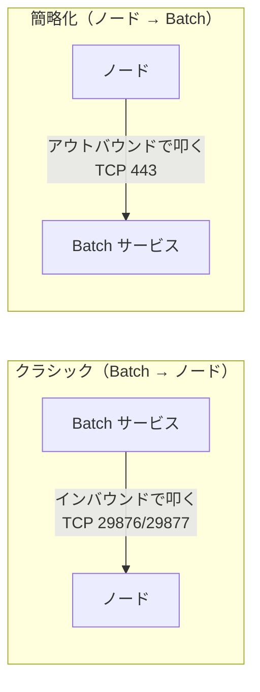

# ノード通信モード — クラシック vs 簡略化（simplified）

> **機能別まとめ（topic note）** | Week 別カリキュラムとは独立した学習メモ。
> 関連 Week：プール/ノード・通信は [notes/week3.md](../notes/week3.md)、VNet/NSG/publicNetworkAccess は [notes/week8.md](../notes/week8.md)、`unusable` 切り分けは [notes/week9.md](../notes/week9.md)、ノード間通信(MPI) は [notes/week6.md](../notes/week6.md)。

出典：[Use simplified compute node communication](https://learn.microsoft.com/ja-jp/azure/batch/simplified-compute-node-communication)

---

## 0. 要点（先に結論）

- **違いは「誰が通信を始めるか（接続の向き）」**。クラシック＝Batch→ノード（インバウンド）、簡略化＝ノード→Batch（アウトバウンド）。
- 簡略化は**インターネットからのインバウンドをゼロ**にでき、**アウトバウンド 443 を `BatchNodeManagement.<region>` へ 1 本**だけで済む → **より安全**。
- **クラシックは 2026-03-31 で廃止**予定＝これから作るなら**簡略化一択**。
- 落とし穴：アカウントの `publicNetworkAccess` が Disabled だと、簡略化は **`nodeManagement` プライベートエンドポイント**が無いとノードが `unusable` になる。

---

## 1. 核心：接続の"向き"が逆

Batch のノードは、インフラ管理のため Batch サービスと通信し続ける必要がある。その**接続を張る側**が違う。



公式定義：

> - **Classic**: the Batch service initiates communication with the compute nodes.
> - **Simplified**: the compute nodes initiate communication with the Batch service.

---

## 2. 必要なネットワークルールの違い（実務の肝）

VNet 内にプールを作る場合（week8）の NSG/UDR/ファイアウォールのルール：

| | クラシック | 簡略化 |
|---|---|---|
| **インバウンド** | TCP **29876 / 29877** を `BatchNodeManagement.<region>` から許可 | **なし** |
| **アウトバウンド** | TCP 443 を `Storage.<region>` へ ＋ TCP 443 を `BatchNodeManagement.<region>` へ | **443 を `BatchNodeManagement.<region>` へ（1 本だけ）** |

> **初学者向け用語補足：サービスタグ（service tag）とは**
> `BatchNodeManagement.<region>` や `Storage.<region>` は**サービスタグ**＝「その Azure サービスの IP 範囲」を表す名前付きの塊。個別 IP を列挙せず、この名前 1 つで NSG ルールを書ける。IP は Azure 側で更新されるので保守も楽。

つまり簡略化は「**インターネットからのインバウンドをゼロにでき、アウトバウンドも既知のサービスタグ 1 本**」。

---

## 3. 簡略化のメリット（なぜ推奨か）

1. **セキュリティ**：インバウンド用ポートを開ける要件をなくす → 攻撃面が小さい。ベースラインは**アウトバウンド 1 本**のみ。
2. **データ持ち出し（exfiltration）制御が細かい**：クラシックで必須だった `Storage.<region>` へのアウトバウンドが**ベースラインでは不要**。だから Storage への送信を明示的に絞れる（App Package 用・入出力用の特定 Storage だけ許可、等）。

> 公式：「reduce security risks by removing the requirement to open ports for inbound communication from the internet. Only a single outbound rule to a well-known Service Tag is required for baseline operation.」

---

## 4. クラシックは廃止（＝簡略化が標準）

> The *classic* compute node communication mode will be retired on **31 March 2026** and replaced with the *simplified* communication mode.

クラシックは **2026-03-31 で廃止**予定（この日付は既に到来しているため、実質**簡略化が標準**）。将来の Batch 機能改善も簡略化前提になり得る、と明記。

---

## 5. つまずきポイント（week8・week9 と接続）

簡略化は「ノード→Batch のアウトバウンド」に依存するので、**その出口が塞がれると詰む**。

- **`publicNetworkAccess` が Disabled** の場合、アウトバウンドを許可しても**ノード管理エンドポイントが公開接続を拒否**する。→ **`nodeManagement` プライベートエンドポイント**を VNet に作り、DNS を合わせる必要がある。怠るとノードが **`unusable`**（week9 の典型）になる。
- **2 つの設定は独立**：
  - **プールのパブリック IP**＝ノード自身の外向き（インターネット）通信の話。
  - **アカウントの `publicNetworkAccess`**＝Batch エンドポイント（ノード管理含む）が公開接続を受けるかの話。
  - 片方だけ見て判断しない。「パブリック IP あり＋NSG でアウトバウンド許可」でも、アカウントが Disabled なら private endpoint が無いと `unusable`。
- 必要なアウトバウンド依存は **List Outbound Network Dependencies Endpoints API** で確認できる（App Package 用 Storage・ACR・パッケージリポジトリ等はワークロード固有で追加が要る）。

---

## 6. 混同注意：「ノード通信モード」と「ノード間通信」は別物

week3・week6 で出た **`enableInterNodeCommunication`（ノード間通信）** とは**まったくの別概念**。

| | ノード通信モード（本書） | ノード間通信（week6） |
|---|---|---|
| 誰と誰の通信 | **ノード ⇄ Batch サービス**（インフラ管理） | **ノード ⇄ ノード**（MPI など） |
| プロパティ | `targetNodeCommunicationMode` | `enableInterNodeCommunication` |
| 値 | Classic / Simplified / Default | true / false |

---

## 7. 設定方法

- プールの **`targetNodeCommunicationMode`** に指定：
  - **Classic** / **Simplified** / **Default**（Batch が選ぶ。VNet ありのプールは 2024-09-30 まではクラシック既定だった）
- 既存プールの切り替えは、プロパティ変更後に**いったん 0 台へ縮小 → 再スケール**（week3 のライフタイム操作）。
- 実際に効いたモードは **`currentNodeCommunicationMode`** で確認（Get/List Pool・ポータル）。
- **Cloud Service Configuration プールは非対応**（常にクラシック・非推奨）→ **Virtual Machine Configuration** を使う。

Bicep/JSON 例（抜粋）：

```json
"targetNodeCommunicationMode": "simplified"
```

> **ヒント**：`targetNodeCommunicationMode` は"希望"であって保証ではない。no public IP・VNet・プール構成タイプ次第で希望が通らないことがある（`currentNodeCommunicationMode` で実際を確認）。

---

## 用語まとめ

| 用語 | 一言 |
|---|---|
| クラシック | Batch→ノードが接続開始。インバウンド 29876/29877 が要る。**廃止予定** |
| 簡略化（simplified） | ノード→Batch が接続開始。**アウトバウンド 443 の 1 本**だけ。推奨 |
| `BatchNodeManagement.<region>` | Batch 管理エンドポイントのサービスタグ |
| `targetNodeCommunicationMode` | プールに希望する通信モード（Classic/Simplified/Default） |
| `currentNodeCommunicationMode` | 実際に適用された通信モード |
| nodeManagement プライベートエンドポイント | `publicNetworkAccess=Disabled` 時に簡略化を成立させるために必須 |
| ノード間通信（別物） | `enableInterNodeCommunication`＝ノード⇄ノード（MPI）。混同注意 |
