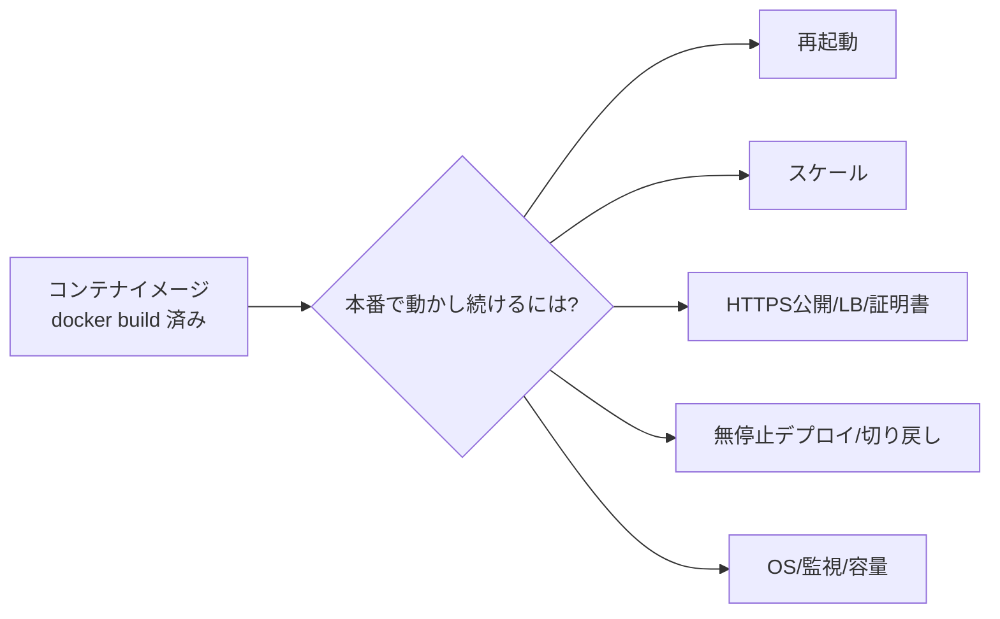

# Week 1 — Azure Container Apps とは何か：サーバ（インフラ）の面倒を見ずに、コンテナ化したアプリをただ動かす"サーバーレスコンテナ"基盤

> **Phase 1a** | 学習プラン Week 1 / 10
> 学習目標：Azure Container Apps（アジュール・コンテナ・アップス、以下 **ACA**）が「どんな問題を解くサービスなのか」を、素朴な選択肢（自分で VM にコンテナを載せる／フルの Kubernetes を運用する／単発の Container Instances）と対比しながら理解する。中核の発想である **「Kubernetes の複雑さに触れずに、コンテナ化アプリを載せるだけで動かせる（サーバーレスコンテナ）」** を掴み、ACA が土台にしている 4 つの OSS（**Kubernetes / KEDA / Dapr / Envoy**）が何を担っているかを言えるようになる。ハンズオンでは ACA の"器"である **Container Apps 環境（Environment）** を 1 つ作り、後の週でアプリが乗る土台を目視する。

---

## 0. 今週の位置づけ

この教材は Azure Container Apps を **10 週**で学ぶ。全体像は次のとおり。

```mermaid
flowchart LR
    W1[W1 とは何か<br/>サーバーレスコンテナ] --> W2[W2 リソースモデル<br/>環境/アプリ/リビジョン]
    W2 --> W3[W3 Ingress<br/>Envoy・外部/内部公開]
    W3 --> W4[W4 リビジョン管理<br/>Blue-Green/トラフィック分割]
    W4 --> W5[W5 スケーリング<br/>KEDA・ゼロスケール]
    W5 --> W6[W6 Dapr 統合<br/>サイドカー/pub-sub/状態]
    W6 --> W7[W7 ジョブ<br/>手動/定期/イベント駆動]
    W7 --> W8[W8 セキュリティ<br/>Secret/マネージドID/ACR]
    W8 --> W9[W9 ネットワーク・監視・<br/>比較・運用]
    W9 --> W10[W10 最終PJ<br/>Bicep+コンテナ E2E]
```



今週（W1）のゴールは、**YAML やスケールルールの書き方にはまだ立ち入らず**、「Azure Container Apps とは何のためのサービスで、隣接サービス（AKS・App Service・Container Instances・Functions）とどう違うのか」を腹落ちさせることである。リソースの作り方は W2、外部公開の仕組み（Ingress）は W3、目玉のオートスケール（KEDA）は W5、Dapr は W6 で順に深掘りする。

> **初学者向け用語補足：まず前提の 3 語（コンテナ・オーケストレーション・サーバーレス）**
> - **コンテナ（container）**＝ アプリ本体と、それが動くのに必要なライブラリ・設定を**1 つの箱に固めて持ち運べる**ようにしたもの。「私の PC では動くのに本番で動かない」を無くす。箱の設計図が **イメージ（image）**、それを実際に走らせた状態が **コンテナ**。港のコンテナ（規格が同じだから船・トラック・クレーンを選ばず運べる）が名前の由来。
> - **オーケストレーション（orchestration）**＝ 多数のコンテナを「何個・どのマシンで・落ちたら再起動・負荷が増えたら増やす」と**まとめて自動指揮する**こと。オーケストラの指揮者が語源。代表格が **Kubernetes**。
> - **サーバーレス（serverless）**＝ 「サーバが無い」のではなく、**サーバの存在を利用者が意識しなくてよい**の意。台数・OS・パッチ・スケールをクラウドが裏で面倒を見て、利用者は**使った分だけ課金**され、暇なときは **0 個**まで畳める。「サーバレス＝サーバを気にしなくていい」と読み替える。

---

## 1. そもそもの課題：コンテナは作った。で、どこで・どうやって動かし続ける？

`docker build` でコンテナイメージは作れた。ローカルでは `docker run` で動く。ところが**本番で動かし続ける**となると、とたんに考えることが増える。

- 落ちたら**誰が再起動**する？
- アクセスが増えたら**誰が台数を増やす**（減ったら減らす）？
- 外から HTTPS で**安全に公開**するには？証明書は？ロードバランサは？
- 新バージョンを**無停止で入れ替える**には？失敗したら**戻す**には？
- 動かすマシン（VM）の **OS パッチ・容量・監視**は誰が見る？



これらは**コンテナそのものではなく、コンテナを"運用する"ための周辺作業**である。ここをどこまで自分で背負うかで、選択肢が変わる。ここが Azure Container Apps の出発点である。

---

## 2. 素朴な選択肢とその限界

コンテナを Azure で動かす代表的な選択肢を、"自分で背負う量"の順に並べる。

| 選択肢 | やること | 限界・代償 |
| --- | --- | --- |
| **VM に自分でコンテナを載せる** | 仮想マシンを立て、Docker を入れて `docker run` | 再起動・スケール・LB・証明書・OS パッチ**すべて自前**。運用負担が最大 |
| **Azure Container Instances（ACI）** | 単一コンテナ（正確には 1 ポッド）をオンデマンドで起動 | **スケール・ロードバランス・証明書・リビジョンが無い**。5 個動かすには 5 個別々に作る。低レベルの"部品" |
| **Azure Kubernetes Service（AKS）** | フル機能の Kubernetes クラスタを Azure 上に | **最強だが最重量**。Kubernetes API・ノード・アップグレード・ネットワーク設計を（Standard では）自分で運用。学習コストが高い |
| **Azure Container Apps（ACA）** | コンテナを載せるだけ。スケール・Ingress・リビジョンは基盤が提供 | Kubernetes API に**直接は触れない**（＝それが必要なら AKS）。代わりに運用の大半を肩代わりしてもらえる |

公式は ACI と ACA の関係をこう位置づけている。

> Azure Container Instances (ACI) は、Hyper-V で分離されたコンテナの単一ポッドをオンデマンドで提供する。**Container Apps と比べると、より低レベルの"ビルディングブロック（部品）"**と考えられる。スケール・ロードバランシング・証明書といった概念は ACI コンテナには提供されない。たとえば 5 つのコンテナインスタンスにスケールするには、5 つの別個のコンテナインスタンスを作成する。Azure Container Apps は、証明書・リビジョン・スケール・環境といった**アプリケーション固有の概念をコンテナの上に多数提供する**。
> （出典：[Comparing Container Apps with other Azure container options](https://learn.microsoft.com/en-us/azure/container-apps/compare-options)）

そして AKS との違いはただ一点、**Kubernetes API に直接触れるかどうか**である。

> Azure Container Apps は、基盤の Kubernetes API への直接アクセスを提供しない。Kubernetes API とコントロールプレーンへのアクセスが必要なら AKS を使うべきである。しかし、Kubernetes スタイルのアプリを作りたいが、ネイティブな Kubernetes API すべてやクラスタ管理への直接アクセスは要らないのであれば、**Container Apps はベストプラクティスに基づく完全マネージドな体験を提供する**。
> （出典：同上）

> **初学者向け用語補足：略語・用語の展開**
> - **ACA** = Azure **C**ontainer **A**pps。本教材の主役。「コンテナを載せるだけで動くマネージド基盤」。
> - **ACI** = Azure **C**ontainer **I**nstances（Instances＝実体・個体）。単一コンテナを"1 個ずつ"起動する低レベル部品。
> - **AKS** = Azure **K**ubernetes **S**ervice。フルの Kubernetes をマネージドで。K が **Kubernetes** の頭文字（Kubernetes 自体は "K" と "s" の間に 8 文字あるので **K8s** とも略す）。
> - **ポッド（pod）**＝ Kubernetes における**コンテナをまとめて動かす最小の単位**。1 つ以上のコンテナを同じネットワーク・ストレージで束ねた"さや（pod＝豆のさや）"。ACA でも 1 アプリの実体は複数コンテナを束ねられる（後述のサイドカー）。
> - **コントロールプレーン（control plane）**＝ クラスタ全体を管理・指揮する"司令塔"の層。AKS では触れるが、ACA では隠されている（触らなくていい）。
> - **完全マネージド（fully managed）**＝ 運用作業（パッチ・スケール・可用性）をクラウド側が肩代わりする方式。逆は"セルフマネージド"。

ポイントは**抽象度（どこまで隠すか）**である。ACI は隠さなすぎ（部品むき出し）、AKS は隠さない代わりに全部握れる（重い）。ACA は**その中間で、Kubernetes の複雑さだけを隠して、アプリ運用に必要な機能は残す**という立ち位置を取る。

---

## 3. Azure Container Apps の正体：Kubernetes を隠した"サーバーレスコンテナ"

ここで登場するのが Azure Container Apps である。公式の定義：

> Azure Container Apps は、**基盤インフラを管理せずにコンテナ化アプリケーションを実行するためのサーバーレスプラットフォーム**である。サーバの構成・コンテナのオーケストレーション・デプロイの詳細を自分でやる代わりに、Container Apps が最新のリソースを提供し、アプリを安定・安全・スケーラブルに保つ。このアプローチが運用の負担を減らし、コスト削減にも役立つ。
> （出典：[Azure Container Apps overview](https://learn.microsoft.com/en-us/azure/container-apps/overview)）

公式が挙げる**代表的な用途**は次の 4 つ。

- **API エンドポイントのデプロイ**（Web/REST API を公開する）
- **バックグラウンド処理ジョブ**のホスティング
- **イベント駆動処理**の実行（キューにメッセージが来たら動く等）
- **マイクロサービス**の実行

> **初学者向け用語補足：マイクロサービス／イベント駆動**
> - **マイクロサービス（microservices）**＝ 1 つの大きなアプリを、機能ごとに**小さな独立サービスの集合**に分けて作る設計。各サービスが別々にデプロイ・スケールでき、ACA はこの分割運用に向く。反対は"モノリス（一枚岩）"。
> - **イベント駆動（event-driven）**＝ 「常時待ち構える」のではなく、**何か（イベント）が起きたら動く**方式。例：キューにメッセージが入った瞬間にコンテナが起き、処理し終えたら 0 個に畳む（＝ゼロスケール、W5）。

### 種明かし：ACA は 4 つの OSS の"良いとこ取り"で出来ている

ACA が魔法に見えるのは、実は**実績ある OSS（Open Source Software＝オープンソースソフトウェア）を土台に載せ、その複雑さを隠している**からである。公式いわく：

> **Kubernetes と、Dapr・KEDA・Envoy のようなオープンソース技術を土台に動いている**（Powered by Kubernetes and open-source technologies like Dapr, KEDA, and envoy）。
> （出典：[Comparing Container Apps with other Azure container options](https://learn.microsoft.com/en-us/azure/container-apps/compare-options)）

```mermaid
flowchart TD
    ACA[Azure Container Apps<br/>マネージドな"顔"（あなたが触る層）] --> K8s[Kubernetes<br/>コンテナのオーケストレーション]
    ACA --> KEDA[KEDA<br/>イベント/負荷でオートスケール・ゼロスケール]
    ACA --> Dapr[Dapr<br/>マイクロサービス用の共通API・サイドカー]
    ACA --> Envoy[Envoy<br/>Ingress・ルーティング・TLS終端]
```

| OSS | 読み | 何を担うか | 本教材で深掘りする週 |
| --- | --- | --- | --- |
| **Kubernetes** | クーバネティス／クーベネティス | コンテナのオーケストレーション（配置・再起動・束ね）。ACA はこの API を**隠す** | 概念のみ（触らない） |
| **KEDA** | ケダ | イベント・負荷に応じた**オートスケール／ゼロスケール** | **W5** |
| **Dapr** | ダプル／ダパー | マイクロサービスの共通部品（サービス呼び出し・pub/sub・状態管理）を**サイドカー**で提供 | **W6** |
| **Envoy** | エンヴォイ | **Ingress**（外部/内部公開）・ルーティング・トラフィック分割・TLS 終端 | **W3・W4** |

> **初学者向け用語補足：KEDA / Dapr / Envoy の語の展開**
> - **KEDA** = **K**ubernetes **E**vent-**D**riven **A**utoscaling（Kubernetes / Event-Driven＝イベント駆動 / Autoscaling＝自動増減）＝ 「キューの長さ」「HTTP 同時数」などの**外部シグナルを見てコンテナ数を自動で増減**する仕組み。ACA のゼロスケールの心臓部。
> - **Dapr** = **D**istributed **A**pplication **R**untime（Distributed＝分散した / Application＝アプリ / Runtime＝実行基盤）＝ マイクロサービスでよく要る機能（別サービス呼び出し・メッセージ配信・状態保存）を、**言語非依存の共通 API**として横付け（サイドカー）で提供。
> - **Envoy**（エンヴォイ＝「使者・特使」）＝ 高性能な**プロキシ**。ACA では入口（Ingress）に立ち、外からのリクエストを適切なリビジョンへ振り分け、HTTPS（TLS）を終端する。
> - **サイドカー（sidecar）**＝ 本体コンテナの"横"に相棒コンテナをぴったり付けて、共通機能（Dapr など）を肩代わりさせる構成。バイクの側車（サイドカー）が語源。W6 で詳述。
> - **TLS 終端（TLS termination）**＝ TLS(=Transport Layer Security＝通信の暗号化)の暗号化/復号を**入口でまとめて処理**し、内側は平文で流す方式。証明書管理を Envoy 側に任せられる。

つまり ACA は、**「Kubernetes を自前運用したら本来やるべき面倒（スケール＝KEDA、公開＝Envoy、マイクロサービス配線＝Dapr）を、マネージドで一括提供する"顔"」**である。あなたはコンテナイメージとちょっとした設定を渡すだけでよい。

---

## 4. ACA の主な機能（今週は"目次"として眺める）

公式の Features から、本教材で扱う主要機能を先取りで一覧にする。各項目の詳細は該当週で扱う。

| 機能 | ひとことで | 扱う週 |
| --- | --- | --- |
| **HTTPS / TCP の Ingress** | 他の Azure インフラを組まずに外部/内部公開 | W3 |
| **リビジョン（revisions）** | アプリの版を複数持ち、ライフサイクルを管理 | W2・W4 |
| **トラフィック分割** | 複数版へ配分（**Blue/Green**・A/B テスト） | W4 |
| **オートスケール（KEDA）** | 任意の KEDA スケールトリガーで増減。多くは**ゼロまで縮小可**（※） | W5 |
| **Dapr でマイクロサービス** | サービス呼び出し・pub/sub・状態管理の共通 API | W6 |
| **ジョブ（jobs）** | オンデマンド／スケジュール／イベント駆動で実行 | W7 |
| **シークレット管理** | アプリ内の機密値を安全に管理 | W8 |
| **任意のレジストリのコンテナ** | Docker Hub・**ACR**（Azure Container Registry）等、public/private | W8・W10 |
| **既存 VNet の指定** | 環境作成時に自前の仮想ネットワークを与える | W9 |
| **Log Analytics でログ監視** | ログを Azure Log Analytics に集約 | W2・W9 |

> ※ 公式注記：**CPU またはメモリ負荷でスケールするアプリはゼロにはスケールできない**（"Applications that scale on CPU or memory load can't scale to zero"）。ゼロスケールできるのは HTTP やイベント（キュー等）駆動のスケールルールの場合。ここは W5 で厳密に扱う。
> （出典：[Azure Container Apps overview](https://learn.microsoft.com/en-us/azure/container-apps/overview)）

> **初学者向け用語補足：Blue/Green デプロイ／A/B テスト／レジストリ**
> - **Blue/Green デプロイ**＝ 現行版（Blue）を残したまま新版（Green）を並べて立て、トラフィックを**一気に切り替え／問題あれば即戻す**無停止デプロイ手法。ACA はリビジョン＋トラフィック分割で実現（W4）。
> - **A/B テスト**＝ 版 A と版 B に利用者を**割合で振り分け**、どちらが良いか比較する手法。トラフィック分割の応用。
> - **レジストリ（registry）**＝ コンテナイメージを保管・配布する倉庫。公開倉庫が **Docker Hub**、Azure の private 倉庫が **ACR**（Azure Container Registry）。W10 で ACR にイメージを push して ACA から引く。

---

## 5. 間違えやすいものとの線引き

「コンテナを動かす／サーバーレス」系は紛らわしい。ここで交通整理する（詳しい使い分け表は W9 で扱う。今週は"別物"だと分かれば十分）。

| もの | 何をするか | ACA との違い |
| --- | --- | --- |
| **Azure Container Apps** | コンテナ化アプリ／マイクロサービス／ジョブをサーバーレスに動かす | **本教材の主役**。Kubernetes を隠しつつ、スケール・Ingress・リビジョンを提供 |
| **Azure Container Instances（ACI）** | 単一コンテナをオンデマンド起動 | ACA より**低レベルな部品**。スケール・LB・証明書・リビジョンが無い |
| **Azure Kubernetes Service（AKS）** | フルの Kubernetes をマネージド運用 | **Kubernetes API に直接触れる**（＝細かく握れるが重い）。それが要らないなら ACA |
| **Azure App Service** | Web アプリ／Web API のマネージドホスティング | **Web に最適化**。コード or コンテナで Web を載せるならこちら。ACA は汎用コンテナ／マイクロサービス向き |
| **Azure Functions** | イベント駆動の関数（FaaS） | **関数プログラミングモデル**に最適化。トリガー/バインドで"関数単位"。ACA は"コンテナ／アプリ単位"（ACA 上で Functions を動かす選択肢もある） |

> **初学者向け用語補足：FaaS / PaaS**
> - **FaaS** = Function as a Service（Function＝関数 / as a Service＝サービスとして）＝ 「関数 1 個」を書いて置くと、イベントで自動起動・自動スケールしてくれる形態。Azure Functions が代表。
> - **PaaS** = Platform as a Service＝ アプリの実行基盤（プラットフォーム）を丸ごと借りる形態。App Service が代表。ACA は"サーバーレスコンテナ"で、PaaS と FaaS の中間的な使い勝手を持つ。

> **ひとことで**：「汎用コンテナ／マイクロサービスをサーバーレスに、でも Kubernetes は運用したくない」なら ACA。「単発コンテナの部品が欲しい」のが ACI、「Kubernetes を細かく握りたい」のが AKS、「Web アプリを載せたい」のが App Service、「関数をイベントで動かしたい」のが Functions。

---

## 6. ハンズオン — Container Apps 環境という"器"を 1 つ作って眺める

今週は**まだコンテナアプリ本体は作らない**。後の週でアプリが乗る**土台＝環境（Environment）**だけを用意し、ACA がどこに現れるかを目視する。1 サブスクリプションだけで実施できる。

> **前提**：Azure サブスクリプションがあり、ポータルにサインインできること。環境の作成自体に大きな課金はないが、ACA はリソース消費（vCPU・メモリの割当時間・リクエスト）で課金される（詳細は W9）。今週はアプリを動かさないので発生は最小。**確認後に削除**すれば費用はほぼ生じない。

> **初学者向け用語補足：環境（Environment）とは何の器か**
> ACA の **環境（Managed Environment）** は、複数のコンテナアプリを囲う**安全な境界**であり、その中のアプリは**同じ仮想ネットワークを共有し、同じ Log Analytics ワークスペースにログを書き込む**。「アプリを入れる箱＝環境、その中に個々のアプリ」という 2 段構造。詳しくは W2。今週は「この器が実在する」ことだけ確認する。

### 手順 A：ポータルで Container Apps 環境を作る

ACA は「環境」→「その中のアプリ」の順で作る。まず器だけを作る。

1. [Azure ポータル](https://portal.azure.com) 上部の検索窓に **`Container Apps`** と入力し、**Container Apps**（サービス）を開く。
2. **「作成（Create）」** を押す。アプリ作成フォームが開くが、今週の狙いは**環境**なので、基本タブで次を指定する。
   - **サブスクリプション／リソースグループ**：任意（学習用に新規 RG を作ると後片付けが楽）。
   - **コンテナアプリ名**：仮の名前（例 `hello-aca`）。※本体は W2 で作り直してよい。
   - **リージョン（Location）**：近いリージョン。
   - **Container Apps 環境（Environment）**：**「新規作成」** を押し、環境名（例 `aca-learn-env`）を付ける。ここで Log Analytics ワークスペースが自動で紐づく。
3. コンテナタブでは既定の**クイックスタートイメージ**（`Use quickstart image`）のままでよい（Microsoft 提供の hello world。W2 で自前イメージに差し替える）。
4. **「確認および作成」→「作成」** でデプロイする。

> **用語補足：なぜ"アプリ作成"の画面から環境を作るのか**
> ポータルの ACA 作成ウィザードは「アプリを 1 つ作る」導線になっており、その途中で**環境が無ければ新規作成**させる作りになっている。つまり最初の 1 アプリを作ると、器（環境）も一緒に出来る。今週は環境が出来たことを確認するのが主眼で、アプリ本体は"おまけ"と捉えてよい。

### 手順 B：作った環境とアプリの中を眺める

1. デプロイ完了後、作成した **Container Apps 環境** を開く。
2. 環境の画面で、**「Apps（アプリ）」** に先ほどのアプリが 1 つ載っていることを確認する。これが「環境＝器、中にアプリ」の 2 段構造（W2 で正式に扱う）。
3. アプリ側を開き、**「Application Url」**（`https://<アプリ名>.<ランダム>.<リージョン>.azurecontainerapps.io` の形）にアクセスすると、クイックスタートの hello 画面が出る。これが Envoy の **Ingress**（W3）を通って公開されている。
4. アプリの **「Revisions（リビジョン）」** を開くと、リビジョンが 1 つあることを確認する。これが W2・W4 の主役。今週は「版が 1 つある」とだけ把握する。

> **なぜこの構成で正解なのか**：今週の目的は「Container Apps 環境という器が実在し、その中にアプリが乗り、アプリには Ingress の URL とリビジョンが備わっている」土台の把握。スケールルールや Dapr、複数リビジョンでのトラフィック分割は後の週で足していく。

### 手順 C：CLI で確認する（任意）

```bash
az containerapp env list --output table
az containerapp list --output table
```

> **コマンドの読み方**：`az`=Azure CLI（Command Line Interface＝コマンドライン操作）、`containerapp`=Container Apps を操作するコマンド群、`env`=environment（環境）、`list`=一覧、`--output table`=表形式で表示。1 つ目で環境が、2 つ目でアプリが並べば成功。`az` に `containerapp` が無い場合は `az extension add --name containerapp` で拡張を追加する（`extension add`=拡張機能を追加）。

### 後片付け

学習用リソースグループごと削除すれば、環境もアプリも消えて費用は生じない。

```bash
az group delete --name <作成したRG名> --yes --no-wait
```

> **読み方**：`group delete`=リソースグループを削除、`--yes`=確認プロンプトを省略、`--no-wait`=削除の完了を待たずにコマンドを返す。**W2 で再び環境を使うので、続けて学習するなら削除は W2 の後でもよい。**

---

## 7. 自己チェック

以下に自分の言葉で答えられれば W1 は合格である。

1. コンテナイメージを作った後、「本番で動かし続ける」ために増える運用作業を 3 つ以上挙げられるか。
2. VM 直載せ・ACI・AKS・ACA を「**自分で背負う運用量**」の順に並べ、それぞれの代償を言えるか。
3. ACA と **ACI** の違いを、公式の言葉「ACI は低レベルの**ビルディングブロック**」を踏まえて言えるか（スケール・LB・証明書・リビジョンの有無）。
4. ACA と **AKS** の決定的な違いは何か。「**Kubernetes API に◯◯できるか**」の形で言えるか。
5. ACA が土台にする **4 つの OSS（Kubernetes / KEDA / Dapr / Envoy）** を挙げ、それぞれが何を担うか（オーケストレーション／オートスケール／マイクロサービス共通 API／Ingress）を対応づけられるか。
6. **サーバーレス**とは「サーバが無い」ではなく何か。ACA の**ゼロスケール**が効く条件（HTTP/イベント駆動）と効かない条件（CPU/メモリ負荷）を言えるか。
7. ACA・ACI・AKS・App Service・Functions を、それぞれ 1 行で言い分けられるか。
8. ACA の **環境（Environment）** とは何を囲う器か。「同じ◯◯を共有し、同じ◯◯にログを書く」で説明できるか。

---

## 8. 次週予告（W2：リソースモデル＝環境・アプリ・リビジョン・レプリカ・コンテナ）

W2 では、今週「器」として眺めた**環境の中身**に踏み込む。ACA のリソース階層は **環境（Managed Environment）→ コンテナアプリ（Container App）→ リビジョン（Revision）→ レプリカ（Replica）→ コンテナ（Container）** という多段構造である。各層が何を表すか、なぜ「アプリ」と「リビジョン」を分けるのか（＝版管理とトラフィック分割の土台）、Log Analytics との連携で何が見えるかを理解する。ポータルとあわせて、クイックスタートではなく**自前で指定したイメージ**でアプリを 1 つデプロイし、リビジョンとレプリカを目視する。これが W3 の「Ingress で外部/内部に公開する」の前提になる。

---

### 参考（出典）
- [Azure Container Apps overview（概要）](https://learn.microsoft.com/en-us/azure/container-apps/overview)
- [Comparing Container Apps with other Azure container options（他コンテナ選択肢との比較）](https://learn.microsoft.com/en-us/azure/container-apps/compare-options)
- [Azure Container Apps environments（環境）](https://learn.microsoft.com/en-us/azure/container-apps/environment)
- [KEDA（公式）](https://keda.sh/) / [Dapr（公式）](https://dapr.io/) / [Envoy（公式）](https://www.envoyproxy.io/)
- [Azure Container Apps の料金](https://azure.microsoft.com/en-us/pricing/details/container-apps/)
