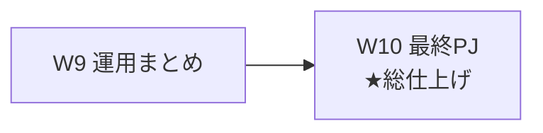
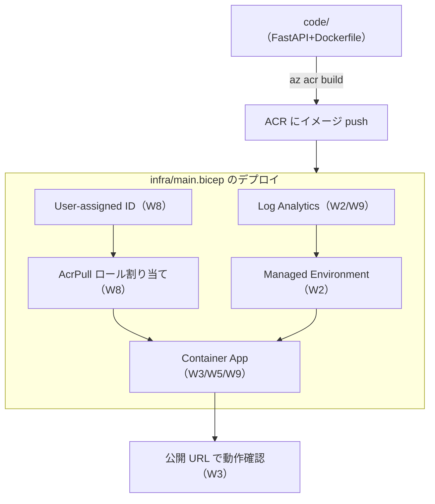
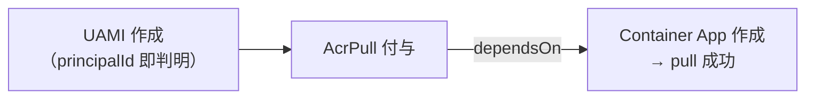
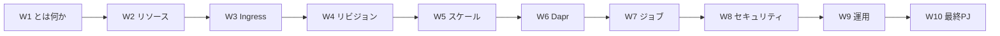

# Week 10 — 最終PJ：Bicep + FastAPI + Dockerfile + ACR で E2E デプロイ

> **Phase 1a** | 学習プラン Week 10 / 10（最終週）
> 学習目標：W2〜W9 の知識を **Bicep（IaC）＋自前コンテナ**で 1 つの動くシステムに束ねる。`infra/main.bicep` に **Log Analytics ＋ Managed Environment ＋ User-assigned マネージド ID ＋ AcrPull ロール ＋ Container App（Ingress・スケールルール・ヘルスプローブ）** を宣言し、`code/` に **Python（FastAPI）＋ Dockerfile ＋ requirements** の最小アプリを用意。**ACR にイメージをビルド（`az acr build`）→ Bicep でデプロイ → 公開 URL で動作確認**という E2E を通す。各週の概念が、コード 1 式にどう結晶するかを体感する。

---

## 0. 今週の位置づけ



これまで CLI やポータルで 1 つずつ触ってきた要素を、**宣言的な 1 ファイル（Bicep）**にまとめ、**再現可能なデプロイ**にする。実物のコードは本教材の `code/` と `infra/` にある。本ノートは**その設計意図と各週の対応**を解説する。

> **初学者向け用語補足：IaC / Bicep / 宣言的**
> - **IaC** = Infrastructure as Code（Infrastructure＝インフラ / as Code＝コードとして）＝ インフラ構成を**コードで記述**し、手作業でなく再現可能にデプロイする方式。
> - **Bicep**（バイセップ）＝ Azure 用の IaC 言語。ARM テンプレート（JSON）の**読み書きしやすい上位言語**で、`az bicep build` で ARM JSON に変換される。
> - **宣言的（declarative）**＝「**どうやるか**（手順）」ではなく「**あるべき状態**」を書く方式。Bicep に「この環境・このアプリがある」状態を書けば、Azure が差分を埋めて実現する。

---

## 1. 全体像：何を・どの順で作るか



**順序が重要**：イメージは**デプロイ前に ACR へ push**しておく（Bicep はそのイメージを参照するだけ）。だから「① ビルド＆push → ② Bicep デプロイ」の 2 段。

---

## 2. アプリ側（`code/`）：最小 FastAPI

`code/app.py` は 3 エンドポイントだけ：

| エンドポイント | 役割 | 対応週 |
| --- | --- | --- |
| `GET /` | 挨拶＋**ホスト名**（レプリカ識別）を返す | W5（スケールで hostname が変わる） |
| `GET /health` | **200 を返すヘルスチェック** | W9（liveness/readiness が叩く） |
| `GET /info` | 環境変数の一部（設定注入の確認） | W8（env での注入） |

> **初学者向け用語補足：FastAPI / uvicorn / ASGI**
> - **FastAPI**（ファストエーピーアイ）＝ Python の軽量な Web API フレームワーク。関数にデコレータ（`@app.get("/")`）を付けるだけでエンドポイントになる。
> - **uvicorn**（ユビコーン）＝ FastAPI を動かす **ASGI サーバ**。`uvicorn app:app --host 0.0.0.0 --port 8000` で起動。
> - **ASGI** = Asynchronous Server Gateway Interface（非同期のサーバ⇔アプリ橋渡し規約）。非同期 Web を扱える Python の標準的な口。
> - **`--host 0.0.0.0`** が肝：`127.0.0.1`（自分だけ）でなく**全インターフェースで待ち受ける**ことで、コンテナ外（Envoy）から到達できる（W3 の targetPort に届く前提）。

### Dockerfile の要点

```dockerfile
FROM python:3.12-slim        # linux/amd64（W2 の制限：Linux amd64 のみ）
COPY requirements.txt .
RUN pip install --no-cache-dir -r requirements.txt   # 依存を先に入れキャッシュを効かせる
COPY app.py .
ENV PORT=8000
EXPOSE 8000
CMD ["sh","-c","uvicorn app:app --host 0.0.0.0 --port ${PORT}"]
```

> **用語補足：なぜ `az acr build` を使うのか**
> ACA は **linux/amd64 のみ対応**（W2）。ARM Mac 等でローカル `docker build` すると arm64 イメージになり、そのままでは動かない。**`az acr build`（ACR のクラウドビルド）は既定で linux/amd64** で焼いてくれるため、プラットフォーム差でハマらない。ローカルで焼くなら `docker buildx build --platform linux/amd64` が必要。

---

## 3. インフラ側（`infra/main.bicep`）：各週の結晶

`main.bicep` が作るリソースと、対応する週：

| Bicep リソース | 型 | 対応週・意図 |
| --- | --- | --- |
| `logs` | `Microsoft.OperationalInsights/workspaces` | W2/W9：環境のログ集約先 |
| `uami` | `Microsoft.ManagedIdentity/userAssignedIdentities` | W8：鍵を持たず ACR から pull する ID |
| `acrPull` | `Microsoft.Authorization/roleAssignments` | W8：UAMI に **AcrPull** を ACR スコープで付与（最小権限） |
| `env` | `Microsoft.App/managedEnvironments` | W2：アプリを囲う器＋ログ設定 |
| `app` | `Microsoft.App/containerApps` | W3/W5/W9：Ingress・スケール・プローブ |

### なぜ user-assigned マネージド ID なのか（設計判断）

W8 で見たとおり ACR pull にはマネージド ID が使える。**system-assigned** だと「アプリを作らないと principalId が分からない」ため、**AcrPull ロール割り当てとアプリ作成が同一デプロイ内で循環**しやすい（pull が権限付与より先に走って失敗する）。

**user-assigned** は ID を**先に作れる**ので principalId が即分かり、**ロール割り当て → アプリ**の順を `dependsOn` で確実に守れる。これが本 PJ で UAMI を選んだ理由。



> **初学者向け用語補足：`dependsOn` / `guid()` / `listKeys()`**
> - **`dependsOn`**＝ Bicep で「このリソースは**先にこれが出来てから**作れ」と依存順を明示する。ロール反映前の pull を防ぐ。
> - **`guid(...)`**＝ 引数から**決定的な GUID**を生成する Bicep 関数。ロール割り当て名は一意な GUID が要るため、`guid(acr.id, uami.id, roleId)` で「同じ入力なら同じ名前」にして冪等にする。
> - **`listKeys()`**＝ Log Analytics の**共有キー**を取り出す関数（環境がログを書き込むのに使う）。鍵をパラメータに書かず、デプロイ時に安全に参照する。
> - **冪等（べきとう, idempotent）**＝ 何度実行しても結果が同じ性質。IaC の要。

### Container App 定義に埋まった各週

```bicep
configuration: {
  activeRevisionsMode: 'single'          // W4：単一リビジョンモード
  ingress: {                             // W3：外部公開・targetPort・最新版へ100%
    external: true
    targetPort: 8000
    transport: 'auto'
    traffic: [ { latestRevision: true, weight: 100 } ]
  }
  registries: [ { server: '...azurecr.io', identity: uami.id } ]  // W8：UAMIでpull
}
template: {
  containers: [ {
    resources: { cpu: json('0.5'), memory: '1.0Gi' }   // W2：決まった組み合わせ
    env: [ { name: 'APP_GREETING', value: '...' } ]     // W8：設定注入
    probes: [ /* Liveness/Readiness → /health */ ]      // W9：ヘルスプローブ
  } ]
  scale: {                                              // W5：HTTP同時50・min=0でゼロスケール
    minReplicas: 0
    maxReplicas: 5
    rules: [ { name: 'http-rule', http: { metadata: { concurrentRequests: '50' } } } ]
  }
}
```

> **用語補足：`json('0.5')` の謎**
> Bicep では小数リテラルの扱いの都合で、CPU 値を **`json('0.5')`** と書く（文字列 `'0.5'` を数値として解釈させる定石）。ACA の Bicep 例でも同様。`memory` は `'1.0Gi'` の文字列。**0.5 vCPU : 1.0Gi** は W2 の許容組み合わせ。

---

## 4. デプロイ手順（`code/README.md` の要約）

```bash
RG=aca-capstone-rg; LOC=japaneast; ACR=acacapstone$RANDOM

az group create -n $RG -l $LOC
az acr create -g $RG -n $ACR --sku Basic

# code/ で実行：クラウドビルド（linux/amd64）で push
az acr build -r $ACR -t aca-capstone:v1 .

# infra/ をデプロイ（ACR名とイメージをパラメータ上書き）
az deployment group create -g $RG \
  --template-file ../infra/main.bicep \
  --parameters acrName=$ACR containerImage=$ACR.azurecr.io/aca-capstone:v1 \
  --query properties.outputs.appUrl.value -o tsv
```

> **コマンドの読み方**：`az acr build -r <ACR> -t <repo:tag> .`＝カレント（`.`）の Dockerfile を**ACR 上でビルドして push**。`az deployment group create --template-file main.bicep --parameters ...`＝Bicep を RG にデプロイ。`--query properties.outputs.appUrl.value`＝出力の公開 URL を取り出す。

---

## 5. 動作確認（各週の回収）

| 確認 | 方法 | 回収する週 |
| --- | --- | --- |
| 外部公開されている | `appUrl` に HTTPS でアクセス→ `/` が JSON を返す | W3 Ingress |
| ゼロスケール→増減 | `/` を並行大量アクセス→ `hostname` が複数に振れる／放置で `replica list` が 0 に | W5 KEDA |
| 鍵無しで pull | `az role assignment list` に **AcrPull**／registries に username 無し | W8 マネージド ID |
| プローブ／ログ | `/health` が healthy 判定／`az containerapp logs show` に標準出力 | W9 |

```bash
# ゼロスケールの確認（無アクセスで放置後）
az containerapp replica list -n aca-capstone-app -g $RG -o table
# ログ
az containerapp logs show -n aca-capstone-app -g $RG --follow
```

### 検証（コードを壊していないか）

```bash
python3 -m py_compile code/app.py      # Python 構文
az bicep build --file infra/main.bicep # Bicep 構文（main.json が出るが commit しない）
```

> 本教材では `az bicep build` が成功することを確認済み（`infra/main.json` は生成後に削除し、`.gitignore` でも除外）。

---

## 6. 後片付け

```bash
az group delete -n aca-capstone-rg --yes --no-wait
```

> ACR・Log Analytics も課金対象。学習後は RG ごと削除する。**環境は 90 日で自動削除**（W2）だが、明示削除が確実。

---

## 7. 自己チェック（総合）

1. なぜ「① `az acr build` → ② Bicep デプロイ」の**順序**が必要か。Bicep はイメージをビルドするか、参照するだけか。
2. Dockerfile で `--host 0.0.0.0` が必須なのはなぜか。ACA が要求するイメージのプラットフォームは何か（W2）。
3. `main.bicep` が作る 5 リソースを挙げ、それぞれ**どの週の概念**に対応するか言えるか。
4. **user-assigned マネージド ID を選んだ理由**を、system-assigned の循環問題と `dependsOn` で説明できるか。
5. Container App 定義の中に、**W3・W5・W8・W9** はそれぞれどのプロパティとして現れるか。
6. `json('0.5')` と `'1.0Gi'` は W2 のどのルールに従っているか。
7. デプロイ後、**W5 のゼロスケール**と **W8 の鍵無し pull** を、それぞれどのコマンド/表示で確認するか。

---

## 8. 教材の総まとめ（W1→W10 の到達点）



- **概念（W1）** から始め、**リソースモデル（W2）** で骨格を掴み、**公開（W3）・版管理（W4）・スケール（W5）** で実行像を固め、**Dapr（W6）・ジョブ（W7）** で適用範囲を広げ、**セキュリティ（W8）・運用（W9）** で本番耐性を付け、**最終 PJ（W10）** で IaC に結晶させた。
- ここから先の発展：**カスタム VNet ＋ Front Door/App Gateway の多層防御**、**イベント駆動ジョブでの CI ランナー**、**Dapr pub/sub での本格マイクロサービス**、**GitHub Actions での CI/CD（Blue/Green 自動化）**。いずれも本教材の土台の上に載る。

お疲れさまでした。Azure Container Apps を「Kubernetes を隠したサーバーレスコンテナ基盤」として、概念から動くコードまで一気通貫で扱えるようになったはずである。

---

### 参考（出典）
- [Microsoft.App containerApps Bicep/ARM リファレンス](https://learn.microsoft.com/en-us/azure/templates/microsoft.app/containerapps)
- [Blue-Green Deployment（Bicep 例）](https://learn.microsoft.com/en-us/azure/container-apps/blue-green-deployment)
- [Pull images from ACR with managed identity](https://learn.microsoft.com/en-us/azure/container-apps/managed-identity-image-pull)
- [az acr build（ACR クラウドビルド）](https://learn.microsoft.com/en-us/cli/azure/acr#az-acr-build)
- [Quickstart: Deploy with Bicep](https://learn.microsoft.com/en-us/azure/container-apps/quickstart-bicep)
